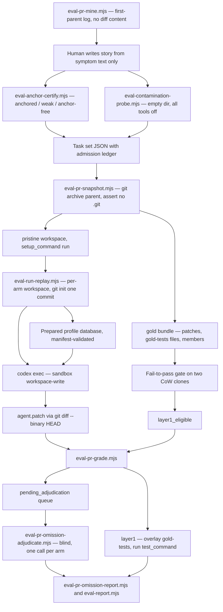
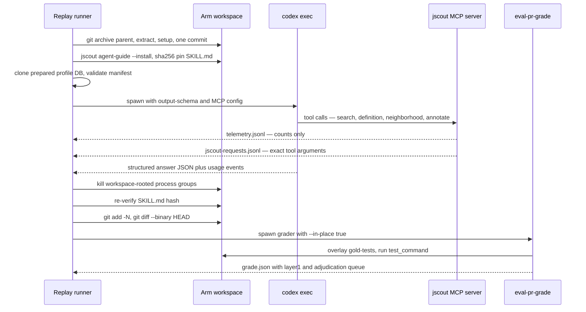
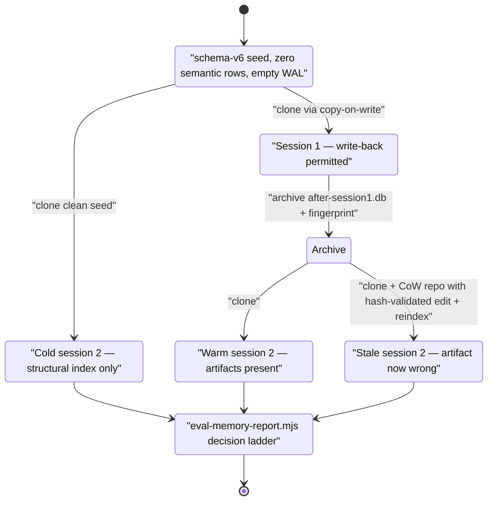

# Evaluation harness and methodology

The `eval/` tree and the ~40 `scripts/eval-*.mjs` files exist to answer one question under conditions where the answer could come out negative: does handing a coding agent the jscout MCP server change what it does, compared with handing it nothing but a shell? Every suite is a controlled comparison in which the only deliberate difference between arms is the retrieval substrate — same prompts, same execution model, same reasoning level, same frozen repository commit, same sandbox policy. The harness spawns Codex agents against snapshot workspaces, records structured JSON answers plus MCP telemetry, and grades by three progressively harder criteria: exact set equality against hand-built gold, fail-to-pass hidden tests, and blind LLM adjudication. Most of the code volume is not measurement — it is admission gating and leakage control, because a task that the model already memorized, or a workspace whose Git object store still contains the fix, produces a number that means nothing.

## Arms and profiles

The three original arms are defined in prose in `eval/README.md:5-9` and enforced by the runner's profile validation. `grep` mounts no jscout MCP server at all; `baseline` gets indexed search, definition and usage tools without `neighborhood` and without search expansion; `structural` adds expansion and `neighborhood`. The PR-replay generation extended this into a cumulative ladder encoded as data in `scripts/eval-run-replay.mjs:339` (`PROFILE_PLANS`), with `PROFILE_BASES` at `:363` naming which cheaper profile each one is built on top of and `PROFILE_INCREMENT` at `:372` naming the stages that turn the base into the target. `grep` is special-cased inside `profilePlan` (`eval-run-replay.mjs:381`) as the only profile with `usesJscout: false`.

| Profile | Stage plan (`PROFILE_PLANS`) | Base profile | MCP tool profile |
|---|---|---|---|
| `grep` | none — no MCP server | — | — |
| `baseline` | `[]` (index only) | — | `baseline` |
| `structural` | `[]` (index only) | — | `structural` |
| `checker` | `enrich` | `structural` | `structural` |
| `checker-embed` | `enrich`, `embed` | `checker` | `structural` |
| `checker-scout` | `enrich`, `scout` | `checker` | `structural` |
| `checker-scout-embed` | `enrich`, `scout`, `embed-product` | `checker-scout` | `structural` |
| `production-order` | `scout`, `enrich`, `embed-product` | *none, deliberately* | `structural` |
| `memory` | `enrich`, `scout`, `workflows`, `cards`, `summaries` | `checker-scout` | `structural` |
| `memory-embed` | the above plus `embed-product`, `embed-semantic` | `checker-scout-embed` | `structural` |

Two things in that table are load-bearing. `baseline` and `structural` have identical (empty) stage lists — they differ only in the `--profile` value passed to the MCP server at `eval-run-replay.mjs:993`, so the corpus is byte-identical and the treatment is purely the tool surface. And `production-order` declares no base on purpose: it reorders scout before enrich, and inheriting an additive profile's database would mean measuring a corpus that was never produced in that order. Orthogonal to profile, replay runs a `treatment` axis — `skill` (the shipped `SKILL.md` is installed and nothing more is said) versus `forced` (the prompt prohibits `grep`, `rg`, `git grep`, and `find` for repository-wide discovery, `eval-run-replay.mjs:727-733`). `grep` always runs as the single `control` treatment.

## Pre-registration discipline

`eval/prereg/` holds five dated registration documents, each written before any registered arm ran, each declaring itself immutable once runs begin with amendments confined to dated addenda (`eval/prereg/arc-replay-2026-08-09.md:1-7`). They name the task sets, the arms, the trial count, the primary outcome, the success boundary, and the stop rule up front. Smoke runs are labeled `--trial smoke*` and excluded from all claims. `eval/protocols/two-session-memory.md` registers the SC-2a gate thresholds, and `eval/protocols/adjudication-rubric.md` registers the judge's rubric — including a declaration that the judge authored the tool under evaluation, and an asymmetric default (when uncertain, rule `omission`) chosen so that all judgment uncertainty resolves against the author's interest.

The strongest form of this discipline is that the gate is executed by code rather than reread from prose. `eval-memory-report.mjs:240-250` emits one of six decision strings from the recorded numbers, with the thresholds as literals in the expression: `pass` requires a median session-2 token reduction ≥ 0.20 with correctness parity and every token win backed by an actually-retrieved artifact; `stop-efficiency` fires below 0.10 with zero capability wins; `fail-staleness` overrides efficiency entirely. The threshold cannot be reinterpreted after seeing results without editing the scorer and showing that edit in the diff. The cost is that the constants are hard-coded — a re-registered revision means changing the reporting code, which is exactly what happened for the post-v1 budget replay.

## Script inventory

| Purpose | Script | What it does |
|---|---|---|
| Mining | `eval-pr-mine.mjs` | Walks `git log --first-parent`, then a separate `git diff --numstat` per commit; admits single-purpose changes (20-600 lines, ≤25 files, ≥1 code file) and emits scaffolds with `story: null` and no diff content |
| Admission | `eval-anchor-certify.mjs` | Classifies a prompt `anchored` / `weak` / `anchor-free` against gold file contents; `--require <status>` sets exit code 1 |
| Admission | `eval-contamination-probe.mjs` | Re-asks the execution model the question in an empty temp dir with all tools off; classifies `clean` / `review` / `contaminated` / `invalid` |
| Admission | `eval-memory-transfer-probe.mjs` | Proves session-2 gold cannot be reproduced from session-1's answer text alone |
| Preparation | `eval-pr-prepare.mjs`, `eval-pr-snapshot.mjs` | History-free `git archive` export, setup run, gold bundle, fail-to-pass gate |
| Preparation | `eval-tree-clone.mjs`, `eval-hidden-tests.mjs` | CoW tree clone (`cp -c` / `--reflink=auto`, full-copy fallback); exact post-change test file overlay |
| Runners | `eval-run-codex.mjs` | Read-only localization runner (grep/baseline/structural, structural-full/elided) |
| Runners | `eval-run-replay.mjs` | Write-capable PR-replay runner (profile × treatment × trial) |
| Runners | `eval-run-memory.mjs`, `eval-run-memory-replay.mjs` | Two-session memory runner; fingerprint-verified replay of archived session-1 databases |
| Grading | `eval-pr-grade.mjs` | Layer 1 hidden-test run, layer 2 gold-file coverage, adjudication queue |
| Adjudication | `eval-pr-omission-adjudicate.mjs` | One blind judge call per arm over that arm's pending gold files |
| Adjudication | `eval-memory-correctness-adjudicate.mjs`, `eval-memory-staleness-adjudicate.mjs` | Batched blind source review of exact-set disagreements; stale-handling verdict |
| Reporting | `eval-report.mjs` | Per-suite precision/recall, cost means, profile deltas, missing arms |
| Reporting | `eval-pooled-report.mjs` | Task-clustered bootstrap CIs versus grep across task sets |
| Reporting | `eval-memory-report.mjs`, `eval-pr-omission-report.mjs` | The SC-2a decision block; per-gold-file omission markdown |
| Instruments | `eval-workflow-candidate-gate.mjs`, `eval-workflow-scope-report.mjs`, `eval-expansion-role-backfill.mjs` | Stage-A candidate recall gate; workflow participant scope from archived DBs; retroactive expansion role denominator |

## Admission: what a task must survive before it counts

Post-cutoff mining selects tasks around symbols introduced after the model's training cutoff, which is good for contamination but bad for discrimination: a newly introduced symbol is by construction a greppable handle. `eval-anchor-certify.mjs:74` tests every identifier-like prompt token and every ≥5-character non-stopword against the gold files' contents; any identifier hit makes the task `anchored`, a word-only hit makes it `weak`, no hits at all makes it `anchor-free`. CI passes `--require anchor-free`, so `weak` fails admission too. The heuristics are unvalidated — a hand-maintained stopword list (with a stray CJK token among the English) and a regex for identifier shape decide the class, with no calibration set. When a gold file has moved between parent and fix, the certifier falls back to `git show <sha>:<file>` rather than failing.

The contamination probe re-asks the same execution model the same question (or `contamination_prompt` if the task supplies a differently-worded one) inside an empty temp directory with web, browser, computer-use, apps, plugins, and multi-agent all disabled. It does not trust the prompt: `toolKinds` (`eval-contamination-probe.mjs:93`) recursively walks the Codex JSONL event tree for any of eight tool item types, and `classifyProbe` (`:110`) returns `invalid` the moment one appears, or on any runner error. Only full file recall *with at least one match* is `contaminated`; any partial overlap is `review`, and everything else is `clean`.

For PR-replay the final admission instrument is a fail-to-pass gate (`eval-pr-snapshot.mjs:196-246`). Two CoW clones of the prepared tree are made; the exact post-change test files are overlaid onto the parent clone and the test command must **fail**; then `gold-code.patch` is applied to the second clone, the tests are overlaid again, and it must **pass**. Only that sets `layer1_eligible = true` (`:257`); the other statuses are `skipped`, `no-tests`, and `rejected`. Note that hidden tests are overlaid as *files*, not applied as a patch (`eval-hidden-tests.mjs:8-12`) — agents routinely add their own tests to the same public files, and `git apply` would then fail and make a real arm look ungraded. The cost is that the grading probe silently discards the agent's own test edits.

## A PR-replay run end to end

The diagram below traces one task from mined candidate to reported number. Follow the split after `GRADE`: layer 1 is a test result, layer 2 produces a queue that has to be emptied by a judge before any omission number exists.

`SNAP` uses `git archive` rather than a checkout for a specific reason: a parent *checkout* still holds the fix commit in its object store, one `git show` away from the answer key. The exported tree has no `.git` at all, and the snapshotter asserts that twice — after export and again after `setup_command` runs, since a build step can re-create one. `ARM` then initializes a *synthetic* one-commit repository (`git init -b eval-base`) inside the export, runs setup, and amends the commit so prepared build output is the baseline; otherwise `git diff HEAD` would report `node_modules` and build artifacts as agent edits. The tradeoff is stated plainly in the design docs: the agent loses real history as a legitimate navigation aid, and every arm pays a full re-export, re-install, and rebuild.

`GOLD` is asserted mutually non-containing with the workspace, so the answer key cannot be reached from inside the sandbox. Arc mode restricts gold to the union of the arc members' own changed files, so interleaved unrelated commits on a busy monorepo cannot leak into gold, and writes per-member `git show` output under `gold/members/` as adjudication provenance.

## Inside one arm

This sequence shows where the two evaluation data streams come from and why the ordering of patch capture and grading matters.

The MCP server is the producer of both streams, not the runner. Telemetry (`src/mcp.rs:1302`) records timestamps, session, task, profile label, tool name, elapsed time, result bytes, source rendering byte counts, expansion node and role counts, and semantic artifact freshness — counts only, never paths, queries, or source text. The exact request log (`src/mcp.rs:190`) records tool name and arguments and is retained separately for audit. Three environment variables stamped onto the server process (`JSCOUT_TASK_ID`, `JSCOUT_SESSION_ID`, `JSCOUT_PROFILE_LABEL`) are the join keys; the profile label is what lets `structural-full` and `structural-elided` share one internal `tool_profile` while reporting as separate arms.

The privacy-minimal telemetry has a real cost: no metric can be attributed to a specific file. When the pre-registered file-roles change needed a *pre-change* denominator of expanded test/fixture nodes, it had to be reconstructed by `eval-expansion-role-backfill.mjs`, joining expansion node paths out of retained raw Codex artifacts against the frozen index's `files.role` column.

Ordering in the diagram is not decorative. Grading with `--in-place true` overlays hidden tests into the agent's own workspace and destroys it as an independent artifact; that is safe only because `saveAgentPatch` runs first (`eval-run-replay.mjs:1064` before `:1067`). Swapping those two calls would silently corrupt every captured patch. The skill hash re-verification is also weaker than it looks: `runnerError = runnerError ?? integrationError` at `:1056` means a timeout or non-zero exit masks the "skill was modified" message.

Profile database preparation has three paths, not two. On the first treatment of a profile the runner either clones an already-prepared database after validating its manifest against `{task_id, parent, profile, stages}` — a database with no manifest is rejected outright rather than trusted — or builds one. Every later treatment of the same profile always clones (`eval-run-replay.mjs:949-960`), which is how `skill` and `forced` are held to a byte-identical corpus. Within the build path, if the base profile's database already exists, it is cloned and only the `PROFILE_INCREMENT` stages run; `jscout index` is skipped entirely. Copy-on-write is used everywhere (`eval-tree-clone.mjs`, database copies via `COPYFILE_FICLONE`) because a prepared Next.js tree carries `node_modules` and build output and a large-repo index is hundreds of megabytes. The dependency on APFS clonefile / reflink is hard: the memory runner refuses to run without `--allow-full-copy true`.

## Grading: two layers that never blend

Layer 1 is binary and mechanical: if `task.layer1_eligible`, overlay `gold-tests/` and run `test_command` (`eval-pr-grade.mjs:198`); otherwise the layer is `{status: "not-eligible"}` and no test runs. Layer 2 scores gold-file coverage, and it adjudicates *before* it scores. `scoreCoverage` (`eval-pr-grade.mjs:75`) treats the reference patch as one valid implementation rather than the mandatory affected set: every gold file the agent did not patch becomes a `pending_adjudication` row, and `confirmed_omission_rate` stays `null` while anything is pending or when `required === 0` (`:93-95`). No headline omission number can be quoted from an unadjudicated grade.

The report keeps two recall-shaped quantities in sibling objects that are never combined. `patched` counts files actually changed on disk; `plan_mentioned` counts files the agent's `files` array claims. The prompt asks the agent to list every file it judged relevant "changed or deliberately left alone" (`eval-run-replay.mjs:709`), which is what makes `plan_mentioned` a meaningful signal — and exactly why blending it into recall would make the metric gameable by narrating rather than editing.

The blind judge sees the story, the arm's complete patch, and the reference diffs only for files that arm did not touch. Cases are keyed by `blindId(session)` (`eval-pr-omission-adjudicate.mjs:100`), a SHA-256 prefix that deliberately encodes no profile, treatment, trial, or model. Honesty requires two caveats. The blinding is *prompt*-side only: the emitted verdict row carries `session`, `profile`, `treatment`, and `execution_model` alongside `blind_case`, and the hash is trivially reversible by anyone holding the session list. And the schema (`eval/pr-omission-adjudication.schema.json`) requires only `{gold_file, verdict, reason}` — the "verdicts without cited evidence are invalid" rule lives in `eval/protocols/adjudication-rubric.md` and binds the human-driven judge, with no mechanical enforcement in the automated path. Adjudication is also expensive: the 39-arm optimistic-prefetch adjudication cost 16.15M input tokens and 84 minutes of sequential judge calls.

## The two-session memory suite

The memory suite tests a different claim: that semantic artifacts written in one session make a *later* session on a related task cheaper without making it wrong. The design is a warm/cold contrast over cloned databases.

`Cold` is the whole point of the clean-seed invariant: the runner refuses a seed that is not schema version 6 with zero rows in `semantic_artifacts` and `semantic_supports` and an empty WAL, because the cold arm's meaning is a byte-identical structural index with no semantic state. `Stale` exists to check that a wrong artifact is detected rather than served: the edit must be repository-relative, its find text must occur exactly once, the pre-edit file must hash to `base_sha256` and the post-edit file to `mutated_sha256`, and the two must differ — any mismatch aborts rather than running a mislabeled arm.

Two admission checks guard the pairs. Every pair's `anchor_class` must be `anchor-free` or `weak` and re-derivable from live source, and every pair must carry a `transfer_triviality` certificate with `status: "pass"` whose model and reasoning equal the execution run's — produced by `eval-memory-transfer-probe.mjs`, which feeds a no-tools model call only session 1's final answer text and fails the pair if that alone reproduces session 2's gold files *and* symbols. Without that probe the memory result would be unfalsifiable: a "warm" win could be pure prompt carryover.

The `Decide` node evaluates in a fixed precedence: `not-claim-eligible` → `incomplete` → `fail-staleness` → `pass` → `stop-efficiency` → `inconclusive` (`eval-memory-report.mjs:240-250`). A staleness case with a *missing* adjudication lands in `incomplete`, not `fail-staleness`; the hard staleness failure is only reachable once every cell is present and error-free. The staleness verdict itself is half mechanical: `classifyStalenessAdjudication` requires both the judge's `stale_reverified` boolean and the runner-recorded `inspected_files` containing the edited file, so a model claiming re-verification is not sufficient.

## Statistics and pooling

`eval-report.mjs` joins responses to telemetry on `(task, profile, session)` and emits per-profile precision/recall, correctness, tool calls, latency, result bytes, command bytes, inspected and irrelevant file counts, tokens, and named profile deltas; it also lists task/profile cells that are entirely missing, using the task set's declared `profiles`. That triple join is unique to it — `eval-memory-report.mjs` groups telemetry by `session` alone and `eval-pooled-report.mjs` groups it by `profile` and never joins per session. `eval-pooled-report.mjs` adds paired deltas versus grep with 95% intervals from `clusterBootstrapMean` (`:102`), which resamples whole *task* clusters with a fixed LCG seed so three trials of one task are not treated as three independent task designs. Both pooled and memory reports throw on more than one distinct `model/reasoning` stamp unless `--allow-cross-model true` is passed (`eval-pooled-report.mjs:130-140`). Clustering by task is what makes the intervals honest, and it is also why almost nothing is significant: with six to eight clusters the intervals are wide enough that nearly every cost effect crosses zero, and the recorded results say so rather than reaching for the per-trial n.

## Recorded findings

| Suite | Result | Limit |
|---|---|---|
| n8n + Twenty post-cutoff localization (72 runs, 8 tasks × 3 profiles × 3 trials) | grep 24/24 adjudicated correct, baseline 23/24, structural 23/24; all token and wall-time intervals cross zero | Correctness is ceilinged; the suite tests localization, not the product question |
| Same suite, expansion noise | Structural inspected +6.38 irrelevant files vs grep, interval `[+1.00, +12.38]` — the only stable effect, and it is harm | `irrelevant_files` derives from model self-reported `inspected_files` |
| File-role re-run (registered L1 fix) | Delta fell to +1.08, interval `[-9.21, +10.71]`; expanded test/fixture/generated nodes 12.82% → 0% | All three arms 24/24 exact, so the correctness question is untouched |
| SC-2a two-session memory gate | **Inconclusive** — 19.29% median token reduction against a registered 20% bar; interval `[-35.38%, +27.84%]`; session-1 correctness 14/18; 2 of 7 token wins retrieved no artifact | Stop rule also did not fire (median > 10%, four capability wins) |
| Registered post-v1 budget replay | **Pass** — median reduction 36.40%, artifact delivery 14/18 → 18/18, warm correctness 17/18 vs cold 14/18 | Single treatment change (response-budget priority); staleness not rerun; not a rollout claim |
| Next.js calibration task (`live-request-headers`) | 11/11 arms passed the hidden e2e — correctness ceiling; skill-only produced adoption in all 5 jscout profiles at 4.8 calls vs 23.8 forced | One task, one seed; supports no per-profile correctness claim |
| Next.js `optimistic-prefetch` | **0/44 graded arms** passed the oracle; the rewrite-misprediction case failed 44/44; every arm patched exactly 1 of 7 gold files | Cross-trial constant across three trials, two models, and four memory arms |
| Next.js `stale-development-cache` | 10 of 13 arms passed; forced arms averaged 41.3 jscout calls / 257,488 tool bytes vs 6.2 / 44,523 skill-only, with 81% more tokens and a lower pass rate | One task, one seed; no per-component correctness estimate |

A prior version of the calibration report claimed grep and structural patches failed the oracle; that oracle was overfit to the reference patch's internal API shape, was replaced by a production-mode behavioral e2e, and the failure conclusion was withdrawn in the same document. The result files carry that correction rather than quietly deleting it.

## Testing, and where the harness is thin

`npm test` runs 16 eval test files plus the graph-memory demo test, 56 top-level cases in total, all pure or stubbed — no test invokes a real Codex or a real model, which is why `--codex` is an overridable flag on the runners. The cases target protocol mechanisms rather than statistics: history-free export with out-of-sandbox gold, fail-to-pass admission, arc gold excluding interleaved commits, coverage scoring adjudicating before scoring, prepared-database manifests rejecting a different source snapshot, browser startup failing instead of dispatching a blind arm, process-group cleanup selecting only exact workspace-rooted groups, and two regression tests for scout partial-failure tolerance written after a prep abort lost 96 billed calls. Report-side tests exercise the gates directly, including cross-model pooling refusal and the three-part staleness gate.

The gaps are specific. `eval-run-codex.mjs` is the only runner with no test file. `scripts/eval-workflow-scope-report.test.mjs` exists but is absent from the `test` script in `package.json`, so its single case never runs in CI. No live model-call path is covered end to end. The bootstrap machinery has no property or reference-value test outside its use inside report tests. And nothing asserts that a task set's declared `profiles`/`treatments` match what a runner actually executed — `eval-run-replay.mjs` reads both exclusively from CLI flags and only `eval-report.mjs` reads `taskSet.profiles`, and only to list missing arms, so a task set declaring seven profiles run with `--profiles grep,structural` produces no warning.

Several other rough edges are worth naming. `eval-pr-grade.mjs:195` matches adjudication rows on the full commit SHA, so a verdict file keyed by the human-readable task id is silently filtered out and the queue stays pending — a defect logged in the guided-sessions write-up after it cost a retry. `eval-pooled-report.mjs`'s `trialOf` assumes `${profile}-${task_id}-${trial}` sessions, so it mis-parses PR-replay sessions, which embed a treatment segment. `eval-run-codex.mjs:152` builds its resume set from `${task_id}\0${profile}` with no trial component, so resuming under a different `--trial` silently skips completed tasks. Grader failures are swallowed into a 300-character `runner_error` with the row still landing in `responses.jsonl` at `layer1: null`, so a batch can "complete" with several ungraded arms. And `startBrowserServer` is called unconditionally at `eval-run-replay.mjs:1008` with no `try`/`catch`, so the no-browser branch in `promptFor` is unreachable from `main` and any repository without a resolvable `playwright` module aborts the arm — the profile machinery is generic, but the runner is currently Next.js-shaped.

Two honesty items travel with the data rather than being fixed. Replay execution keeps network capability enabled (`REPLAY_EXECUTION_POLICY`, `eval-run-replay.mjs:26`) because Codex's macOS no-network sandbox also blocks loopback binds, which makes Next.js dev and e2e oracles impossible; the external-access boundary is enforced by prompt, empty remotes, disabled web/browser tools, and a retained command stream — auditable, not technically isolated — and the policy object is stamped onto every response row so the caveat cannot be separated from the numbers. And `inspected_files` is model self-report, never traced; `eval/value-hypotheses-2026-08-09.md` labels every navigation metric exploratory until self-reports are audited against Codex event artifacts, yet `eval-report.mjs` still computes `mean_inspected_files` and `mean_irrelevant_files` from it and the results tables print them.

For the tool surface these arms exercise, see [10-cli-and-mcp.md](10-cli-and-mcp.md); for the semantic artifacts the memory suite writes and reads, see [08-scouting.md](08-scouting.md) and [06-semantic-layer.md](06-semantic-layer.md); for the telemetry emitter, see [14-cross-cutting.md](14-cross-cutting.md).
