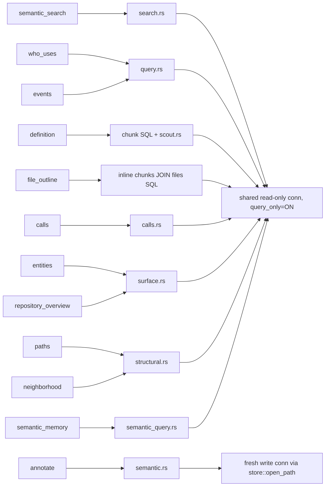
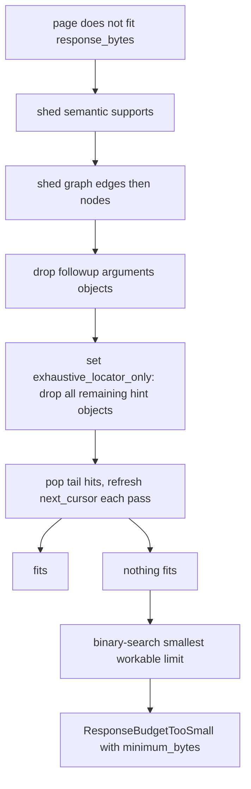
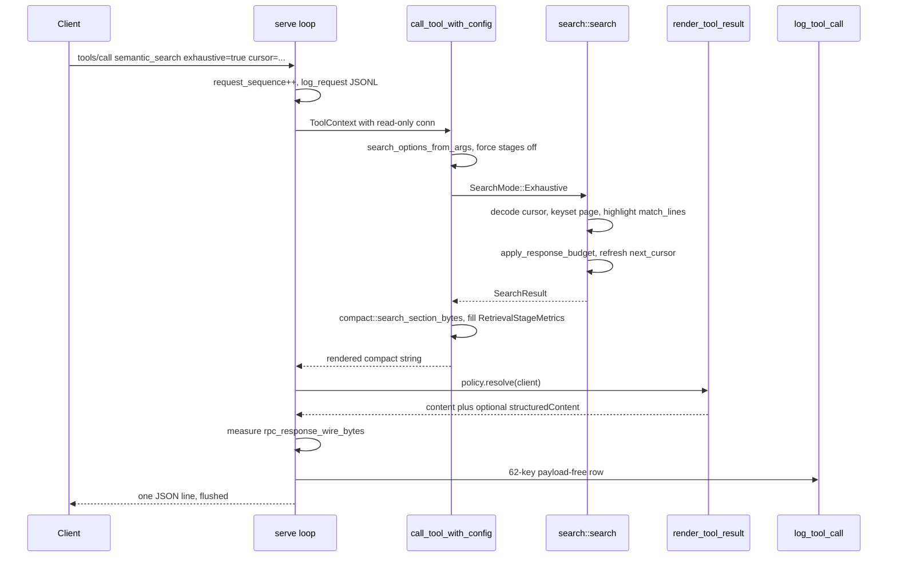

# The MCP surface

`jscout mcp` is a line-oriented JSON-RPC 2.0 server over stdin/stdout that publishes the built index to an agent as twelve tools, eleven of them read-only. `src/mcp.rs` (2,093 lines) holds the whole thing: the transport loop, the five-arm method dispatch, every published JSON Schema, the per-tool argument decoding, two byte-budget helpers, and the writers for two JSONL side-channels. The server opens the database once at startup with `query_only=ON`, reads configuration once, and never reloads either; the only exception to read-only is `annotate`, which opens its own write connection for exactly that one call. The substantive addition since the prior baseline is the `exhaustive` field on `semantic_search`, which turns a ranked hybrid retriever into a paged, cursor-resumable traversal of the complete lexical match set — and which forces four other retrieval stages off before `search::search` ever sees the options.

## Transport: one JSON value per line

`mcp::serve` (`src/mcp.rs:145`) canonicalizes the root, blake3-hashes the running executable into `binary_fingerprint` (`src/mcp.rs:159`, implementation at `1918`), opens the index with `store::open_path_read_only` (`src/store.rs:53`, which sets `query_only=ON` at `src/store.rs:64` and hard-fails on a missing file or schema drift), and builds the embedding provider and reranker from `runtime.effective` rather than the environment (`src/mcp.rs:161-167`). Provider construction is fallible and aborts serve; the reranker is a plain `Option`. Telemetry and request-log files open create-and-append, and `collect_telemetry` is true exactly when a telemetry path was given (`src/mcp.rs:178`).

The loop reads one line at a time (`src/mcp.rs:196`). Blank lines are skipped (`src/mcp.rs:198`), and an unparsable line produces `-32700 parse error: …` with a null id (`src/mcp.rs:203-209`). Both cases return before `request_sequence` is incremented, so the request log has silent gaps relative to the raw stdin stream even though it preserves ordering among the lines that parse. After `id`/`method`/`params` are extracted (`src/mcp.rs:211-213`) the counter increments and `log_request` runs (`src/mcp.rs:214-215`), which is why notifications and unknown methods still appear in the log. The notification drop needs both halves of its guard: `id.is_null() && method.starts_with("notifications/")` (`src/mcp.rs:218`). A non-notification method with a null id still gets a full response, and a `notifications/…` message carrying a non-null id falls through to the catch-all and receives `-32601`. Output framing is `serde_json::to_writer` plus a newline plus a flush (`write_msg`, `src/mcp.rs:380`).

Dispatch is a five-arm match: `initialize` (`src/mcp.rs:222`), `ping` returning `{}` (`263`), `tools/list` returning `{"tools": tool_defs(profile)}` (`264`), `tools/call` (`265`), and everything else `-32601` (`338`). `initialize` echoes the client's requested `protocolVersion`, defaulting to `"2025-06-18"`, without negotiating it, and returns a self-description: `serverInfo` with name, crate version, binary and configuration fingerprints and database path; a `configuration` block whose `reload` field reads `"restart-required"` (`src/mcp.rs:242`); `retrievalDefaults` carrying the effective vector/rerank/memory/expansion/limit/responseBytes values; a `resultTransport` block; and the long profile-specific `instructions` prose from `server_instructions` (`src/mcp.rs:472`). Because almost no tool property publishes a schema `default` — descriptions say "omit to use repository configuration" instead — `retrievalDefaults` is the only place an agent can learn what it will actually get. That keeps one binary honest across repositories with different retrieval policies, at the cost of a `tools/list` output that cannot be read as a contract.

## Tool inventory

| Tool | Notable inputs | Output shape | Backing call | Budget path |
|---|---|---|---|---|
| `semantic_search` | `query` required; `exhaustive`, `cursor`, `limit`, `file_roles`, `origins`, `vector`, `rerank`, `response_bytes`, `debug`, four `memory_*` keys, ten `expand*` keys | compact `{snapshot, …, default_match, hits[]}`; exhaustive adds `effective`, `scope`, `total_chunks`, `returned`, `truncated`, `next_cursor` | `search::search` | compact renderer, fitted to `to_string` |
| `who_uses` | exactly one of `symbol`/`anchor`; `snapshot` (anchor only), `origins`, `response_bytes` (min 256) | `{usage_fields, targets[], response{…}}`, plus `resolution` in anchor mode | `query::who_uses_in_origins` / `who_uses_anchor_in_origins` (`src/mcp.rs:1084-1087`) | compact + `attach_symbol_resolution` |
| `definition` | one of `symbol`/`anchor`; `view` (`full`/`elided`), `source_bytes`, `response_bytes` | `{definitions[{…, source, source_meta}], response{…}}` | tightest-enclosing chunk SQL + `scout::render_source` (`src/mcp.rs:1132-1170`) | compact + `attach_symbol_resolution` |
| `file_outline` | `path` required; `origins`, `response_bytes` | `{outline[], response_budget{…}}`, pretty | inline `chunks JOIN files` SQL (`src/mcp.rs:1214-1225`) | `render_bounded_items` |
| `events` | `name` filter, `origins`, `response_bytes` | `{events[], response_budget{…}}` | `query::events_in_origins` (`src/mcp.rs:1243`) | `render_bounded_items` |
| `calls` | `method` required; `args[]` as `KEY` or `KEY=VALUE`, `arg_position`, `receiver`, `limit` (default 200, capped 1000) | `calls::query` result with bounded `matches[]` | `calls::query` (`src/mcp.rs:1260`) | `render_bounded_object_arrays` |
| `entities` | `query`, `planes[]`, `types[]`, `roles[]`, `file_roles[]`, `limit` ≤100, `occurrences_per_entity` ≤50 | `surface::entities` result with bounded `entities[]` | `surface::entities` (`src/mcp.rs:1282`) | `render_bounded_object_arrays` |
| `paths` | `from`, `to` required; `max_depth` 4, `path_limit` 8, `node_limit` 200, `edge_limit` 800, `direction`, `min_confidence` | `structural::paths` result with bounded `paths[]` | `structural::paths` (`src/mcp.rs:1312`) | `render_bounded_object_arrays` |
| `repository_overview` | `area_limit`, `relation_limit`, `include_semantic`, `semantic_*`, `reconnaissance_*` | pretty-printed overview | `surface::overview_response` (`src/mcp.rs:1355`) | budget passed **into** the library |
| `semantic_memory` | `query`, `artifact` id, `view` (`compact`/`body`/`full`), `anchor`, `file`, `related_to`, `types[]`, `freshness[]`, many limits | pretty-printed `semantic_query::query` result | `semantic_query::query` | budget enforced inside the library |
| `annotate` | `type` (`workflow`/`annotation`), `confidence`, `snapshot`, plus `name`+`participants[]` or `body`+`supports[]`; `supersedes` | pretty-printed publication | `semantic::annotate_request_with_provider` (`src/mcp.rs:1465`) | **no budget at all** |
| `neighborhood` | `anchor` required; `depth`, `direction`, `node_limit`, `edge_limit`, `min_confidence`, `kinds[]`, `file_roles[]` | `compact::render_neighborhood`, or bounded diagnostic under `debug` | `structural::neighborhood` (`src/mcp.rs:1499`) | compact, or `render_bounded_object_arrays` on `["edges","nodes"]` |

Byte defaults are inconsistent in source even though they currently agree in value: `semantic_search`, `who_uses`, `definition` and `file_outline` read `search::DEFAULT_RESPONSE_BYTE_LIMIT` or configuration, while `events`, `calls`, `entities`, `paths`, `repository_overview`, `semantic_memory` and `neighborhood` hard-code the literal `24_000` (`src/mcp.rs:1251, 1275, 1305, 1348, 1373, 1441, 1500`). They match only because that constant is 24,000 (`src/search.rs:11`).

Argument decoding is mostly total and silent — `args["limit"].as_u64().unwrap_or(default)` collapses `"200"`, `200.0` and a misspelled key to the default, and `json_string_array` (`src/mcp.rs:1594`) drops non-string elements — but it is not uniformly so. Hard bails exist for a non-string `cursor` (`src/mcp.rs:838`), exhaustive conflicts (`843-849`), baseline `expand` (`857-859`), `ExpansionProjection::parse`, `SourceView::parse`, `origin::validate_all` (`src/mcp.rs:1206`), `calls::ArgFilter::parse`, `ArtifactViewMode::parse`, `symbol_targets`'s mutual-exclusion checks (`src/mcp.rs:1525-1542`), and the serde decode of `annotate` (`src/mcp.rs:1460`). The published schemas are still never validated against accepted arguments; `annotate` is the only tool whose full shape is enforced, and it is enforced by serde rather than by the schema it publishes.

## Where each tool lands

Look for the fan-out: eleven arms end at library calls that all share one read-only connection, and one arm — `annotate` — reaches a different connection entirely.

`ROC` is opened once in the serve prologue and reused for the whole session. `WC` is opened per call at `src/mcp.rs:270`, only when the tool name is `annotate` and the profile is structural, and it is not a plain writable reopen: `store::open_path` creates missing parent directories and runs migrations (`src/store.rs:112-124`), so the first annotate of a session pays schema-init cost mid-request, and a mistyped `--database` materializes a directory tree. `log_tool_call`'s snapshot fallback still queries `ROC` even on that write call (`src/mcp.rs:320`, `1743`).

## Profile gating

`ToolProfile` is `Baseline` or `Structural`, defaulting to structural (`src/config/load.rs:794`). Baseline removes six tools from `tools/list` — `entities`, `paths`, `repository_overview`, `semantic_memory`, `neighborhood`, `annotate` (`src/mcp.rs:784-800`) — and strips fourteen `semantic_search` properties: the four `memory_*` keys and the ten `expand*` keys (`src/mcp.rs:806-823`). It deliberately keeps `exhaustive` and `cursor`, so a baseline session can still run a full lexical sweep.

Schema removal is not enforcement, so the six structural tools also bail at runtime for a client that bypasses the schema (`src/mcp.rs:1280, 1310, 1353, 1380, 1458, 1470`). The gate is asymmetric for the two stripped key families: `expand: true` under baseline produces a hard bail (`src/mcp.rs:857-859`), while `include_memory: true` is silently forced false by a `profile == Structural &&` conjunct (`src/mcp.rs:893-897`), as are neighborhood follow-up hints (`src/mcp.rs:912`). The stated reason is that expansion changes the answer's shape — an evaluation arm must not silently produce a different contract — while attached memory is additive, so one shared agent prompt stays runnable across both arms. The cost is that a baseline caller passing `include_memory: true` gets neither memory nor a diagnostic, and nothing in the published schema explains the difference.

## `exhaustive`, and what the server neutralizes first

`search_options_from_args` (`src/mcp.rs:829`) resolves the exhaustive contract before building `SearchOptions`. It reads `exhaustive` (default false), rejects a non-string `cursor`, rejects a cursor without `exhaustive: true`, then loops over `["vector", "rerank", "expand", "include_memory"]` and bails on any that the *call* set to `true` (`src/mcp.rs:843-849`). Everything after that treats exhaustive as a hard override: `expand` becomes `false` (`851`), `use_vector` becomes `false` (`866-870`), `include_memory` and `rerank` are `&&`-guarded on `!exhaustive` (`893`, `907`). So a repository whose configuration turns vector search on can still run an exhaustive sweep without editing config, while an agent that explicitly asked for a ranked stage sees a visible contradiction. The same value therefore produces either a silent override or a hard error depending on where it came from, and `tools/list` cannot show that.

Page size goes through `search::resolve_search_limit` (`src/search.rs:22`): an explicit `limit` passes through untouched, an omitted one becomes `configured.min(200)`. `search::search` then re-validates and bails when the page size is outside `1..=200` or any of the four stages is still live (`src/search.rs:1623-1631`). An explicit `limit: 201` is thus accepted by the MCP layer and rejected deep inside search — a split that `src/mcp/tests.rs:125-137` asserts on purpose. Under baseline, `exhaustive: true` together with `expand: true` reports the exhaustive conflict rather than the profile gate, because the conflict loop runs first.

The traversal, the cursor format, the highlight markers, and the shedding order are all [08-retrieval.md](08-retrieval.md)'s subject and behave identically however the call arrives. Three consequences belong to this boundary specifically. An empty query is a quiet success: `args["query"].as_str().unwrap_or("")` plus the early return at `src/search.rs:1364-1375` yields `total_chunks: 0, has_more: false` despite `query` being schema-required — unless a cursor is present, in which case it bails. A cursor argument that is not a string, or is supplied without `exhaustive: true`, is rejected before search runs. And an agent that stores a cursor across a reindex gets a hard failure rather than a resumed sweep, because the cursor binds the structural snapshot.

The response an agent sees differs from a ranked one in key set, not just in content. Compact exhaustive hits are bare locators — `at`, `kind`, `match_lines`, `anchor` or `anchors`, and a `followups` object (`src/compact.rs:288-318`) — where ranked hits carry the symbol under `symbol`, not `name` (`src/compact.rs:243-245`). The envelope adds `effective`, `scope`, `total_chunks`, `returned`, `truncated`, `next_cursor` and sets `default_match: "lexical"` (`src/compact.rs:53-84`), and can also carry `response{rendered_bytes, truncated, omitted{…}}` when shedding occurred (`src/compact.rs:179-184`). Nothing in `tools/list` describes that divergence.

## Response byte budgeting

Three families coexist, and one tool has none. Array-bearing tools go through `render_bounded_object_arrays` (`src/mcp.rs:1631`), which injects `response_budget{byte_limit, rendered_bytes, unbudgeted_bytes, truncated, omitted_items}`, settles the self-referential `rendered_bytes` in at most eight iterations (`settle_value_rendered_bytes`, `src/mcp.rs:1685`), and then pops one tail item per loop until `to_string_pretty` fits — bailing with "below the minimum response envelope" when nothing else can be shed (`src/mcp.rs:1658-1669`). Compact renderers in `src/compact.rs` fit against `to_string` instead, so the same `response_bytes` buys materially different content per tool. Exact-anchor `who_uses` and `definition` reserve envelope room up front (`symbol_content_byte_limit`, `src/mcp.rs:1577`) and splice `resolution` back in afterwards (`attach_symbol_resolution`, `src/mcp.rs:1546`); note that their compact envelope is named `response` (`src/compact.rs:547`), not `response_budget`. `repository_overview` and `semantic_memory` pass their limit into the library and enforce it there; `annotate` has no budget.

Exhaustive search adds a floor. The shedding ladder inside `apply_response_budget_once` (`src/search.rs:2460`) is deliberately ordered so anchor identity is never damaged.

`LOC` is the step that distinguishes an exhaustive page from a ranked one: rather than shorten an anchor — which would silently mis-resolve — the budget strips every follow-up hint and keeps the locators exact (`src/search.rs:2536-2560`). `POP` never leaves zero hits; when even one locator will not fit, `apply_response_budget` (`src/search.rs:2435`) falls to `MIN`, which clones the pre-shedding result and binary-searches the smallest limit for which a pass succeeds (`minimum_exhaustive_response_bytes`, `src/search.rs:2743`), then returns the typed `ResponseBudgetTooSmall` (`src/search.rs:215`). That surfaces to the agent as `error: response_budget_too_small: … minimum_bytes=N`. The probe clones the whole `SearchResult` O(log n) times on the failure path, and the number it reports is valid only for that page's exact content. `refresh_exhaustive_metadata` (`src/search.rs:2410`) recomputes `returned`, `truncated` and `next_cursor` after every pass, so the cursor always names the last hit actually rendered.

## Result transport and error surfacing

`ResultTransportPolicy` is `auto | text | structured` (`src/mcp.rs:43`), from `mcp.result_transport` (default `auto`, `src/config/load.rs:802-810`) or `--result-transport`. MCP publishes no capability bit for `structuredContent`, so `Auto` resolves to structured only by client identity: `clientInfo.name == "codex-mcp-client"` at version ≥ 0.147.0 (`src/mcp.rs:117-127`, with `version_at_least` at `129` stripping a `-prerelease` suffix and requiring all three components to parse). Every other client, and any session where `initialize` never arrived, stays on text. That is an allowlist someone must edit and rebuild to extend.

`render_tool_result` (`src/mcp.rs:405`) re-parses the tool's own rendered string. In structured mode it emits `content[0].text` carrying the original string *and* `structuredContent` carrying the parsed value — no double encoding — and a non-JSON string silently downgrades to text with `structured_parse_failed = true`. Both fields carry the full payload, so the wire counters run roughly twice the text bytes whenever structured applies. Errors become a *successful* JSON-RPC result whose `content[0].text` is `"error: {e}"` with `isError: true` (`src/mcp.rs:445-458`). The rationale is that MCP clients feed tool errors back into the model's context while protocol errors read as transport faults and are usually hidden from it; the cost is that unknown tool names, profile-gate rejections, too-small budgets, invalid cursors and genuine internal failures are indistinguishable at the protocol layer without string matching.

## A call, end to end

Look at the ordering at the end: telemetry is written after the response value exists but before it goes on the wire.

`rpc_response_wire_bytes` is `serde_json::to_vec(&response).len()` (`src/mcp.rs:315-316`), which excludes the newline `write_msg` appends — off by one byte per response. `log_request` (`src/mcp.rs:345`) writes eight fields including the complete unredacted `arguments`, natural-language queries included, and can be enabled by `.jscout.toml` alone through `telemetry.request_log` with no flag. `log_tool_call` (`src/mcp.rs:1713`) writes a 62-key payload-free row (`src/mcp.rs:1846-1909`). Its shape metrics are recovered by re-parsing the server's own rendered text (`definition_source_metrics` at `1947`, `expansion_role_metrics` at `1986`, `semantic_artifact_metrics` at `2036`), so a response-shape change degrades them to zeros rather than failing; the stage timings that compact projections deliberately omit are threaded in-process through a `RefCell<RetrievalStageMetrics>` on `ToolContext` (`src/mcp.rs:961`, `975`). The `profile` field in both streams is overridden by `JSCOUT_PROFILE_LABEL` when set, making it an evaluation label rather than the MCP profile; telemetry carries the true value separately as `tool_profile`.

## Tests, and what they do not reach

`src/mcp/tests.rs` holds 24 `#[test]` functions across 1,534 lines, all calling internal functions directly through a `#[cfg(test)] call_tool` shim (`src/mcp.rs:2064`) that builds a `ToolContext` with default search settings, no reranker and telemetry off. Coverage includes config-defaults-versus-explicit resolution, the new exhaustive option resolution (page-size clamping only when `limit` is omitted, explicit oversized limits passing through, cursor round-trip, per-field conflict errors, cursor-without-exhaustive), the transport allowlist across client identities, structured/text equal-payload rendering and both downgrades, request-log ordering and exact arguments, schema-shape assertions including `exhaustive` default false and `cursor` present in both profiles, the baseline retain list and stripped properties, runtime bails for a schema-bypassing client, byte budgets across six tools, and the three telemetry extractors.

Nothing drives the stdio loop, so `-32700`, notification dropping, `-32601`, the `protocolVersion` echo, the whole `initialize` block, the lazy annotate write-connection branch and the 62-key telemetry record are untested here. No test executes an end-to-end exhaustive `tools/call`: cursor issuance, `match_lines`, the scope echo, `exhaustive_locator_only` degradation and the `ResponseBudgetTooSmall` surface are exercised in `src/search/tests.rs` and `src/compact/tests.rs`, not through the MCP arm. And no test validates a `tools/call` payload against the schema the server itself published — which matters most precisely because those schemas are documentation rather than enforcement.

Two further limits are worth naming. `file_outline` resolves `path` with `f.path = ?1 OR f.path LIKE '%' || ?1` (`src/mcp.rs:1218`), which does not enforce uniqueness; a short suffix silently matches several files and the outline interleaves them, so the schema's "unique suffix" wording is prose, not behavior. And `debug: true` bypasses the compact renderer everywhere it is accepted, returning a different shape on a different budget path under the same tool name — for search it also flips `options.compact`, so the budget is fitted against pretty-printed diagnostic JSON.
