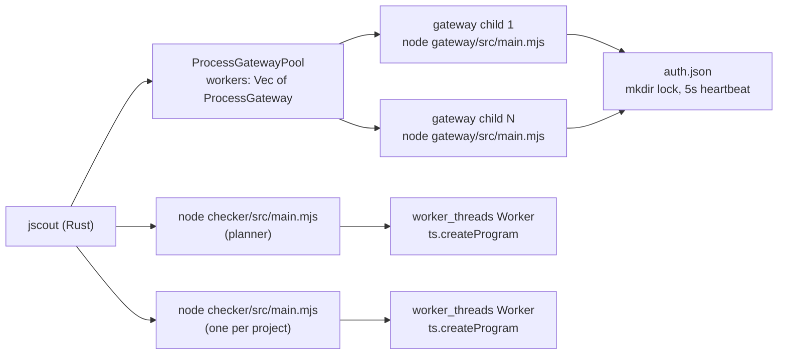
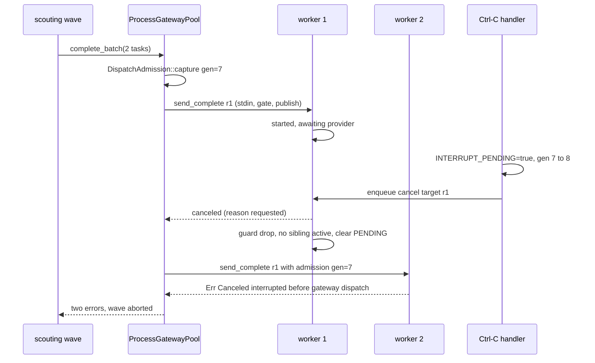
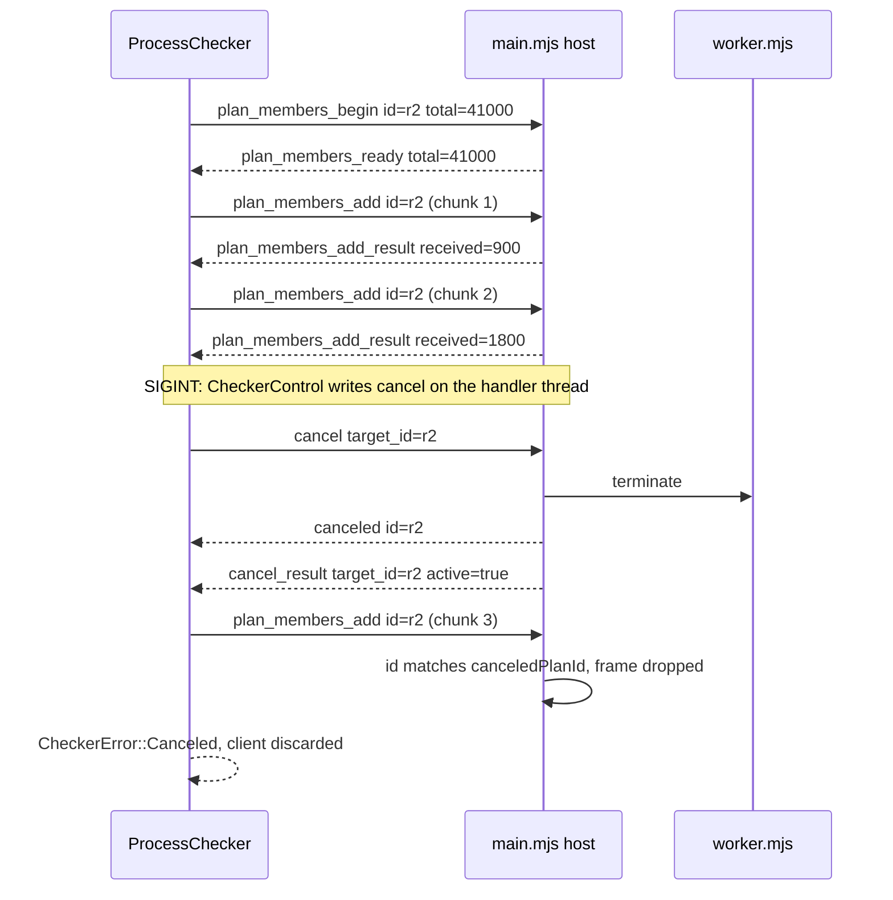

# Sidecar processes: the TypeScript checker and the LLM gateway

jscout links neither a provider SDK nor the TypeScript compiler. Both live behind Node child processes that speak one JSON object per line over stdio, and Rust keeps the parts that must stay deterministic — prompt construction, JSON-schema validation, SQLite transactions, hashing, admission policy. The two sidecars share a framing convention (`protocol`, `id`, `kind` on every frame, sanitized human text on stderr, a hard byte cap per line) and diverge sharply everywhere else: the gateway is a stateless one-request-at-a-time responder that this cycle learned to be run N-up, while the checker is a protocol host that offloads all compiler work to a `worker_threads` worker so that `cancel` stays answerable while `ts.createProgram` blocks. Neither protocol version moved at `823b836` — the gateway is still 1 (`src/llm/protocol.rs:8`), the checker still 4 (`src/checker/protocol.rs:3`) — and `git diff 4de5622..823b836 -- gateway/ checker/` is empty: no sidecar JavaScript changed at all. Everything new in this subsystem is on the Rust side of the pipe.

## The two sidecars at a glance

| | pi-ai gateway | TypeScript checker |
|---|---|---|
| Entry | `node gateway/src/main.mjs` | `node checker/src/main.mjs <root>` |
| Protocol version | 1 (`src/llm/protocol.rs:8`) | 4 (`src/checker/protocol.rs:3`) |
| Rust client | `ProcessGateway`, `ProcessGatewayPool` (`src/llm/process.rs:48`) | `ProcessChecker` (`src/checker/process.rs`) |
| Line cap | 16 MiB, fatal on overflow (`gateway/src/protocol.mjs:9`) | 4 MiB, plus a 1 MiB cap per plan frame (`checker/src/protocol.mjs:4`, `src/checker/process.rs:23`) |
| Threading inside the child | single-threaded Node event loop | protocol host + one `worker_threads` Worker |
| Process lifetime | one per pool slot, lives for the whole scout run | one per project, plus one planner |
| Concurrency | N processes, 1 in-flight request each | strictly one process, one request |
| Owns | credentials, provider SDK calls, retry | `ts.createProgram`, config discovery, symbol resolution |

Both clients treat the child as disposable. `Drop` sends `shutdown`, polls `try_wait` for a 500 ms grace, then kills (`src/llm/process.rs:750`, `src/checker/process.rs:797`); a *poisoned* client skips the graceful frame and goes straight to kill, because a client that has already seen a malformed frame cannot trust the child to answer one more.

### Process topology

Look at how many arrows leave the Rust box, and at where the fan-out is a process and where it is a thread.

`POOL` fans out to *processes*; `PLAN` and `PROJ` fan out to a single *thread* each. `AUTH` is the one shared mutable resource in the picture and the reason a filesystem lock exists at all (`gateway/src/registry.mjs:367`).

## Gateway wire protocol, version 1

Every frame is a serde-tagged enum in `src/llm/protocol.rs:9` (outbound) and `:64` (inbound), so the Rust and JS message sets are one list.

| Direction | Kind | Payload | Answered by |
|---|---|---|---|
| → | `hello` | — | `ready` |
| ← | `ready` | `versions{gateway, pi_ai, node, protocol}` | — |
| → | `capabilities` | `model?` | `capabilities_result` |
| ← | `capabilities_result` | `providers{builtin, custom[]}`, `model?` | — |
| → | `complete` | `model`, `reasoning?`, `system?`, `messages[]`, `tool{name,description,parameters}`, `timeout_ms?`, `max_tokens?`, `session_id?`, `provider_options{service_tier?}` | `started` then `result`/`error`/`canceled` |
| ← | `started` | `provider`, `model`, `api`, `base_url?`, `billing_path`, `auth_source` | — |
| ← | `result` | `tool_call`, `stop_reason`, `usage`, `attempts`, `response_model?` | — |
| ← | `error` | `error{code, message, retryable, capacity}` | — |
| ← | `canceled` | `reason?` | — |
| → | `cancel` | `target_id` | `cancel_result` (+ `canceled` for the target) |
| ← | `cancel_result` | `target_id`, `active` | — |
| → | `shutdown` | — | `shutdown_result`, then exit 0 |

Three details are load-bearing. `started` is emitted before the provider completion call (`gateway/src/server.mjs:170`), so the run ledger records provider, api, `billing_path` and `auth_source` even for a request that then times out — but not before *all* network activity, since `startCompletion` awaits `models.getAuth(model, {signal})` first (`gateway/src/completion.mjs:383`), which may refresh a token; the timeout timer is armed before that, so it covers it. `auth_source` is a category label, never a credential. And a second overlapping `complete` on one process is refused with error code `busy` (`gateway/src/server.mjs:147`) — the constraint the concurrency work had to route around.

The `id`-non-empty rule holds only for frames the sidecar *receives*: on a parse failure or a line overflow the gateway answers `{id: "", kind: "error", ...}` (`gateway/src/main.mjs:74`, `:89`), and the checker does the same (`checker/src/main.mjs:311`). Rust's `receive_for` will never match that id, so such a frame surfaces as an unexpected-id protocol poison rather than a targeted error. The JS `complete` handler also accepts a `cache_retention` option (`gateway/src/completion.mjs:379`) that Rust's `CompleteRequest` never sends; the wire surface is wider than the Rust client uses.

## The concurrency rework: N processes, not multiplexed ids

`src/llm/process.rs` grew by 603 lines this cycle, and it is worth stating plainly what that did *not* do. There is no request table, no id demultiplexer, and no per-id timer wheel. Each gateway process still serves one `complete` at a time; `receive_for` still poisons the client on any frame whose id is not the awaited one (`src/llm/process.rs:506`); ids are still `r1`, `r2`, … from a per-process `AtomicU64` (`:208`). Concurrency is process-level: `ProcessGatewayPool::launch` performs one node-version check and one gateway-path resolution, then spawns exactly `max_concurrency` independent children and registers all their controls as one interrupt group (`:558`). The rationale is in the struct comment at `:45` — overlapping provider waits without turning the gateway protocol or the semantic database into a concurrent surface. The cost is N Node processes, N pi-ai registry builds, memory linear in `max_concurrency`, and N writers contending for one `auth.json`.

`complete_batch` is the only method that uses more than one worker (`:603`). It captures **one** `DispatchAdmission` for the whole batch, chunks the task slice by `self.workers.len()`, and for each chunk opens a `std::thread::scope` zipping `workers[i]` to `batch[i]`; every handle is joined before the next chunk starts, and a panicked worker thread becomes `GatewayError::Io` rather than unwinding the batch. `capabilities` and `complete` hard-delegate to `self.workers[0]` (`:592`, `:600`), so for a single completion the other N−1 children sit idle.

Backpressure is therefore not in the client at all — it is the scouting wave. `src/scouting/mod.rs:642` fills a wave up to `options.policy.max_concurrency`, claims a ledger run per member, dispatches the wave through `complete_batch`, and only then validates and publishes. Model calls overlap; database writes do not. Chunk-and-join also means one slow request stalls its entire chunk: there is no work stealing.

Deadlines stay per request. `CompletionTask` carries its own `Duration`, and `complete_with_grace_and_admission` allows `timeout + 5 s` for each of the two receives (`src/llm/process.rs:693`) so the gateway's own `error{code:"timeout", retryable:true}` — classified for the run ledger — wins over a local one. The local timeout is a backstop for a wedged child and permanently poisons the client.

Crash handling is per worker. The stdout reader thread (`:334`) forwards each parsed line over an mpsc channel and returns on EOF or first error; the receiver then observes a disconnect, and `exit_error()` distinguishes "exited with status" from "closed stdout while still running". `Timeout`, `Protocol`, `ChildExited` and `Io` all set `poisoned`. `ProcessGatewayPool` does not inspect that flag, so a poisoned worker keeps receiving tasks in later waves and keeps failing them.

### Cancellation under Ctrl-C with a wave in flight

The hardest part of the rework is not the fan-out, it is the interrupt. Three process-global statics interact: `INTERRUPT_CONTROL` holding an `InterruptControl { gateways: Vec<GatewayControl> }` (`:31`, `:68`), `INTERRUPT_PENDING`, and the new monotonic `INTERRUPT_GENERATION` (`:33`).

`GatewayControl::cancel_active` no longer writes anything (`:84`). It reads the published active id and pushes it onto a `Sender<String>`; a dedicated per-gateway writer thread drains that channel into `Outbound::Cancel` (`:365`). Previously the handler called `writer.send`, which takes the child-stdin mutex — if the main thread held stdin, the signal callback blocked and a second Ctrl-C could not force an exit. Queuing makes cancellation asynchronous, which then requires `send_complete` to take stdin *first*, then `INTERRUPT_CONTROL`, then `active_request`, and to perform the pipe write only after both global locks are released (`:430`). That order guarantees a Cancel queued after the active id is published cannot overtake the Complete it names, and that the interrupt callback never waits on a pipe.

`DispatchAdmission { generation, interrupted }` (`:77`, captured at `:129`) is what stops a *late* worker. When the first worker in an interrupted wave finishes, `ActiveRequestGuard::drop` clears `INTERRUPT_PENDING` — but only if no gateway in the registered group is still active (`:249`). A sibling that had not yet dispatched would otherwise see a clean bit and start a fresh provider call after the operator pressed Ctrl-C. The generation counter never goes backwards, so a stale admission ticket is detectable: `send_complete` refuses when `admission.interrupted`, or the pending bit is set, or `admission.generation != INTERRUPT_GENERATION`. The refusal is guarded by `interrupt_applies` — it fires only when *this* gateway's writer is in the currently registered group, so an unregistered gateway is never refused.

A second interrupt, or an interrupt with nothing active, exits 130 (`:151`, `:157`).

Look at where the wave splits and where the two workers diverge after the signal.

`W2` is the failure case that motivated the generation latch: the pending bit it checks is already clean, and only `gen=7 != 8` refuses the dispatch. Note also that `W1` and `W2` each number their own request `r1` — ids are per process, never global.

## Checker wire protocol, version 4

The checker's message set is larger because one of its requests does not fit in a line.

| Direction | Kind | Payload | Notes |
|---|---|---|---|
| → | `hello` | — | `ready{versions{sidecar,node,protocol}}` |
| → | `capabilities` | — | `capabilities_result{typescript, projects[], configuration_problems[], question}` |
| → | `plan_members_begin` | `total_files`, `refresh_config` | this frame's id becomes the whole session id |
| ← | `plan_members_ready` | `total_files` | must equal the declared total |
| → | `plan_members_add` | `files[]` | repeated; ≤900 KiB payload per frame |
| ← | `plan_members_add_result` | `received_files` | running count, checked each time |
| → | `plan_members_finish` | — | switches the session to `processing` |
| ← | `plan_members_page` | `page{typescript?, totals?, files[], projects[], configuration_problems[], next_cursor}` | cursors are `section:index` |
| → | `plan_members_next` | `cursor` | until `next_cursor` is null |
| → | `resolve_members` | `project_id`, `project_files[]`, `queries[]` | ≤128 queries, frame ≤1 MiB |
| ← | `resolve_members_result` | `project_id`, `typescript`, `checker_input_fingerprint`, `results[]`, `resources` | |
| → | `validate_project` | `project_id`, `fingerprint` | must follow `resolve_members` in the same worker |
| ← | `validate_project_result` | `valid`, `inputs[]` | |
| →/← | `cancel` / `cancel_result` / `canceled` / `error` / `shutdown` / `shutdown_result` | | |

The plan session exists because a monorepo inventory of tens of thousands of paths does not fit one JSON line, and an oversized line is unrecoverable framing corruption rather than a recoverable error. It must also be *one* snapshot: splitting membership into independent calls would make configured ownership and inferred grouping chunk-relative. So the upload streams with acknowledgements and the result pages back with cursors, all under one request id.

Rust verifies far more than it strictly needs. `plan_members_with_refresh` (`src/checker/process.rs:431`) normalizes and sorts the file list, chunks it, and then checks: the accepted total equals the declared total, each `received_files` matches the running sum, cursors never repeat, a non-final page is never empty, project ids are unique, declared totals match exactly, and the returned file set equals the requested set. The reason is that everything downstream — the package gate, project fingerprints, the activation transaction — is derived from this one membership snapshot, and a silently truncated page would produce a plausible-looking but wrong project graph.

Cancellation is where the two sidecars are most asymmetric. On the checker side `CheckerControl::cancel_active` calls `self.writer.send(...)` directly (`src/checker/process.rs:201`), taking the stdin mutex on the signal thread — exactly the pattern the gateway was reworked to avoid. Three flags carry the state (`src/checker/process.rs:32`): `interrupt` for operator SIGINT, `operation` for a watcher generation cancel via `cancel_active_operation` (`:253`), and `operation_delivered` so one watcher cancel is sent at most once. `begin_interrupt_scope` (`:268`) resets all three once per top-level enrichment; each per-project sidecar's `register_interrupts` *replaces* the single registered control without clearing the scope's pending bits, and `enrich` polls `cancellation_pending()` at every project boundary (`src/checker/enrich.rs:717`) and again before activation (`:830`).

Inside the child, `cancel` is implemented as `worker.terminate()` (`checker/src/main.mjs:279`) — the only way to stop a synchronous `ts.createProgram`. That leaves a race: the canceled response is already queued for the session id, so the host drops every subsequent frame whose id equals `canceledPlanId` and whose kind starts with `plan_members_` (`checker/src/main.mjs:247`), clearing that latch only in `beginPlanMembers`. Without it a reused Rust client would see two terminal responses for one id and poison itself.

Look at the second `plan_members_add` below — it is acknowledged, then the cancel lands, and the client's next frame arrives into a dead session.

The dropped `chunk 3` is the point: the host answers nothing, and the client has already unwound on the `canceled` frame. Had the host replied with an `error` instead, the client would have received a second terminal response for `r2`.

## The package gate: admission decided in Rust, before any compiler work

Enrichment must decide which files without a `tsconfig` owner still deserve an inferred project. That decision is made entirely in Rust from SQLite, with no TypeScript involved (`src/checker/package_gate.rs:166`). It reads the repository/workspace inventory, finds the nearest `package.json` per file, and admits an unowned file when its package is *js-first* — `unowned_default * 2 > total_default` (`:111`) — or when it is runtime-reachable by BFS over non-type `module_edges` from manifest entry points (`:754`). Entry points come from `main`/`exports`/`bin` and from ad-hoc tokenization of `scripts` (`:525`), resolved through source-mirror variants so `dist/esm/x.js` maps back to `src/x.ts` (`:692`). Asking the sidecar instead would mean building Programs for scopes that will be rejected.

Every manifest probe becomes a `ManifestObservation`, including *absent* ones hashed as `absent:v1`. A `package.json` that appears after planning changes both the majority calculation and the inferred grouping, so absence has to be part of the identity. `validate_fresh` re-reads every present manifest and re-stats every absent probe, and it runs four times: after final ownership planning (`src/checker/enrich.rs:495`), before reuse and staging (`:611`), inside `revalidate_package_gate` (`:1610`), and inside the activation transaction (`:3319`). `revalidate_package_gate` goes further than a freshness check — it relaunches a planner, re-runs a full `evaluate`, and compares fingerprints (`:1595-1614`).

This cycle's one substantive change on the checker side is a schema retarget: `INVENTORY_SQL` and `current_dirty_source_files` now read `FROM code_files file` instead of `FROM files` (`src/checker/package_gate.rs:12`, `src/checker/enrich.rs:1541`). `code_files` is the view filtered to `corpus='code'`, so the new documentation plane is excluded from the checker inventory, the package gate, and the dirty-file set. A regression test (`checker_inventory_excludes_documentation_corpus_files`) pins that.

## Enrichment lifecycle

`enrich` (`src/checker/enrich.rs:374`) runs one planner sidecar and then one sidecar per project:

1. Select eligible occurrences; return early if none. Install the interrupt scope.
2. `plan_members` over the **whole** first-party inventory — configuration-only ownership.
3. `package_gate::evaluate`, then `gate_inferred_projects` to drop occurrences in rejected scopes.
4. `plan_members_cached` over admitted orphans + eligible files + dirty files, reusing the first pass's config discovery. Cross-check that TypeScript identity and configured ownership are identical between the two views, or bail.
5. `validate_fresh`, plan fingerprint. On `--dry-run`, stop here.
6. Reuse: `reusable_completed_batch` (`:1758`) can return an already-active batch or a completed zero-fact marker whose inputs are all still fresh. Otherwise open staging; when carry-forward is off, `deactivate_stale_active_batch` runs first and may itself trigger a projection rebuild (`:668`).
7. Per project: spawn a **fresh** sidecar (`:2718`), send ≤128 queries per frame, halve on an oversized encoded frame or a remote `oversized_batch` code (`:2781`), stage answers, then `validate_project`.
8. `revalidate_package_gate`, then `activate_staging_batch` inside `BEGIN IMMEDIATE` (`:3308`), which re-validates the gate, re-reads the structural snapshot, re-verifies every recorded input hash against disk, rejects pending or malformed project runs, demotes over-broad cross-project candidates to `confidence='possible'`, and swaps publication. The caller — not the transaction — triggers `structural::rebuild_projection` when `activation.publication_changed` (`:852`, `:871`).

One TypeScript Program per worker is enforced in the child: a second project id throws `project_switch` and changed membership for the same id throws `project_mismatch` (`checker/src/worker.mjs:709`, `:714`). Holding several overlapping Programs alive made peak memory proportional to every configured project a run touched. The price is a process spawn plus full Program construction per project, and `validate_project` must be issued to the same worker or it throws `project_not_loaded` (`checker/src/worker.mjs:1096`).

Failures are graded rather than fatal. A file whose span or checker call faults is quarantined without discarding its sibling roots; a project failure is retryable or terminal; a run with some failed projects still activates its healthy part and raises `PartialEnrichmentError`, which watch treats as terminal when nothing is retryable (`src/checker/enrich.rs:165`). The alternative — discarding the whole run — would let one broken `tsconfig` block all enrichment.

## Limits

| Limit | Where |
|---|---|
| `ProcessGatewayPool` never detects a poisoned worker; it keeps handing it tasks in later waves | `src/llm/process.rs:603` |
| Dropping any one pool worker unregisters the *whole* interrupt group, leaving the survivors without Ctrl-C coverage; `ProcessGateway::launch` (the `llm doctor` path) likewise evicts a pool registration | `src/llm/process.rs:196`, `:403` |
| `llm.max_concurrency` has no upper clamp; the only guard is the per-command `min(call_capacity)` in `launch_scout_gateway` | `src/config/load.rs:798`, `src/commands/scout.rs:9` |
| The lock order in `send_complete` (stdin → `INTERRUPT_CONTROL` → `active_request`, write after both are released) is documented only in comments | `src/llm/process.rs:430` |
| Interrupt statics have no test isolation; `process.rs` tests serialize on a private `INTERRUPT_TEST_LOCK`, and a new test that forgets it will flake | `src/llm/process.rs:825` |
| The checker's Ctrl-C path writes child stdin from the signal thread — the exact pattern the gateway removed | `src/checker/process.rs:201` |
| The oversized-batch retry halves down to a single occurrence; a lone query whose answer exceeds 1 MiB has no escape | `src/checker/enrich.rs:2781` |
| `execute_project` allows exactly one restart on fingerprint drift (plus an earlier reset when staged fingerprints already disagree at entry); a second drift fails the project | `src/checker/enrich.rs:2680` |
| `script_path_tokens` skips tokens containing `$`, `{`, `}` or `//`, so an entry point behind a shell variable is invisible to reachability | `src/checker/package_gate.rs:525` |
| `classifyProviderFailure` is keyword-based and order-sensitive (billing before capacity before auth); novel wording falls into the non-retryable `provider` bucket | `gateway/src/completion.mjs:210` |
| The gateway's error sanitizer is defense-in-depth by its own comment — truncation is not redaction, and it covers only well-known token shapes | `gateway/src/protocol.mjs:58` |
| N gateway processes share one `auth.json`; correctness rests on a `mkdir` lock directory with a 5 s heartbeat and 60 s stale takeover | `gateway/src/registry.mjs:367` |
| The registry is built lazily, so a bad custom-provider configuration still lets `hello`/`ready` succeed and only surfaces on the first real request | `gateway/src/server.mjs:44` |
| Dev sidecar discovery walks up from `target/{debug,release}`; installed binaries have no such fallback, so a working dev setup can hide a broken install layout | `src/checker/mod.rs` |

## Testing

The Rust-side sidecar tests avoid Node entirely: they write an executable `/bin/sh` script that answers canned frames and inject it as the `node` binary (`src/llm/process.rs:800`, mirrored in `src/checker/process.rs:847`). The LLM suite covers pool overlap through a two-process filesystem rendezvous, late-worker interrupt refusal with a shared admission ticket, idle interrupt forcing exit 130, the handler not blocking on stdin, remote error codes and retryability, cancel-while-waiting, a mismatched active cancel acknowledgement failing closed, child death mid-request, and malformed frames. `package_gate`'s fixture now builds a real store via `crate::store::open` (`src/checker/package_gate.rs:876`), which is what made the `code_files` retarget testable at all. The sidecars carry their own `node --test` suites — `gateway/test/gateway.test.mjs` and `checker/test/sidecar.test.mjs` — neither of which changed this cycle.
