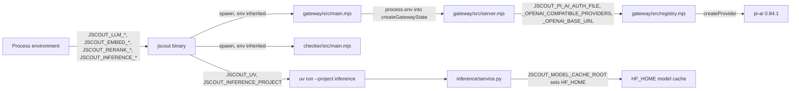
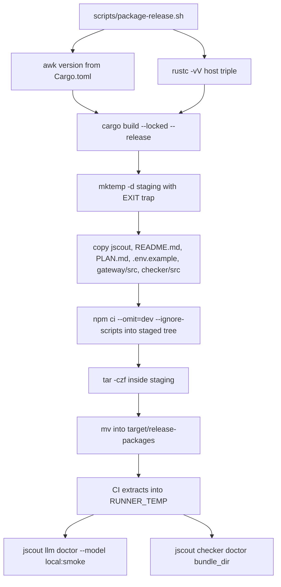

# Build, configuration, and CI

jscout ships as one Rust binary that carries its own SQLite, its own vector extension, and two Node sidecar trees copied in beside it, plus an optional Python service that is *not* shipped. Nothing in the system reads a config file: every knob is a process environment variable, resolved at the point of use by `std::env::var` in Rust, by `process.env` inherited through the spawned gateway, or by `os.environ` in the Python service. This part of the repository is the machinery that pins those three runtimes, assembles them into a relocatable tarball, and decides which failures block a merge — including several that do not.

## Crate shape, and what it forces

`Cargo.toml` declares a single package: `jscout` 0.2.0, `edition = "2024"`, `license = "MIT OR Apache-2.0"` (`Cargo.toml:1-5`), with 20 runtime dependencies and one dev-dependency. There is no `[lib]` section, no `src/lib.rs`, no `[features]` table, and no `[[bench]]`. The only crate root is `src/main.rs`, which sets `#![recursion_limit = "256"]` on line 1 and then declares 32 top-level modules on lines 3–34.

That choice determines the whole Rust test strategy. A binary-only crate cannot be linked by an external `tests/` directory, so there is none — every one of the 319 `#[test]` functions lives in an inline `#[cfg(test)] mod` inside the module it exercises, and 41 of the 48 `.rs` files under `src/` carry such a block. Measured from each file's first `#[cfg(test)]` marker to EOF, roughly 29,000 of about 57,800 Rust lines — just over half — are test code interleaved with production code. Tests reach private items directly with no visibility scaffolding; the cost is that nothing exercises the crate through a public seam, every production file is roughly double its functional length, and `cargo test` compiles one large unit.

## Dependencies and why each is present

| Crate | Version | Where it is used | Why |
| --- | --- | --- | --- |
| `anyhow` | 1.0.104 | pervasive | `Result` + `Context` error plumbing; no custom error enum at the top level |
| `blake3` | 1.8.5 | `src/chunk.rs`, `src/embed.rs`, `src/store.rs`, `src/semantic.rs`, `src/calls.rs` | the content-identity primitive for chunk hashes, embedding cache keys, and staleness guards that re-hash source before trusting an indexed row |
| `clap` (derive) | 4.6.5 | `src/main.rs` only | the entire CLI, including four nested subcommand enums |
| `ctrlc` | 3.5.2 | `src/llm/process.rs:71`, `src/checker/process.rs:146` | a `OnceLock`-guarded SIGINT handler so Ctrl-C cancels an in-flight sidecar request instead of orphaning a child |
| `ignore` | 0.4.33 | `src/walk.rs:3` | `WalkBuilder` gives gitignore semantics for free |
| `notify` | 8.2.0 | `src/watch.rs` | filesystem events into an `mpsc` receiver |
| `oxc_allocator`, `oxc_ast`, `oxc_ast_visit`, `oxc_parser`, `oxc_semantic`, `oxc_span`, `oxc_syntax` | 0.143.0 (matched set) | `src/parse.rs`, `src/chunk.rs`, `src/graph.rs`, `src/scout.rs`, `src/heur.rs`, `src/calls.rs` | arena, AST types, visitor traversal, scope/symbol tables, byte spans |
| `oxc_resolver` | 11.24.2 | `src/indexer.rs:5`, `src/workspace.rs:15`, `src/dependency.rs:12` | intra-repo import resolution, tsconfig path aliases, and `node_modules` resolution respectively |
| `rusqlite` (`bundled`) | 0.40.1 | `src/store.rs` | `bundled` pulls `libsqlite3-sys` 0.38.1 (`Cargo.lock:692-693`), so no system SQLite is needed |
| `sqlite-vec` | 0.1.9 | `src/store.rs:11-25` | vector search, registered statically rather than loaded |
| `serde` + `serde_json` (`preserve_order`) | 1.0.229 / 1.0.151 | pervasive | `preserve_order` matters because MCP payloads and eval fixtures are compared as text |
| `ureq` | 3.3.0 | `src/embed.rs`, `src/inference.rs`, `src/search.rs` | blocking HTTP for embeddings, local-inference health, and reranking |
| `unicode-normalization` | 0.1.24 | `src/scouting/concept.rs:16` | normalizes concept surface forms before matching |
| `tempfile` (dev) | 3.23.0 | 25 test-bearing files | real directories and real SQLite files in tests |

Two details there are load-bearing. First, the seven `oxc_*` AST crates must move as a unit — they share arena and AST types, so a split version set does not compile. `oxc_resolver` is interleaved alphabetically at `Cargo.toml:18` but sits on an unrelated 11.x line and shares none of those types; it is not version-locked to the rest. Second, `sqlite-vec` is not a loadable `.so`. `src/store.rs:11-25` guards a `Once`, transmutes `sqlite_vec::sqlite3_vec_init` into an extension entry-point function pointer, and passes it to `rusqlite::ffi::sqlite3_auto_extension`. Because that registration is process-global, every `Connection` opened afterwards gets `vec0` for free; the two openers that call it are `open_path_read_only` (`:60`) and `open_path` (`:106`), which the public `open` (`:42`) and `open_read_only` (`:49`) delegate to. The tradeoff is an `unsafe` transmute plus a pinned pair — upgrading `libsqlite3-sys` or `sqlite-vec` independently risks an ABI mismatch. There is also no async runtime: blocking `ureq` makes all network work synchronous request/response, which keeps concurrency to threads and channels but rules out overlapping in-flight HTTP without spawning threads explicitly.

`Cargo.lock` (227 packages), `gateway/package-lock.json`, `checker/package-lock.json`, and `inference/uv.lock` are all committed. There is no root `package-lock.json` because the root `package.json` declares zero dependencies — it exists only to hold scripts.

## Toolchain pinning

| Runtime | Pinned where | Value | Enforced how |
| --- | --- | --- | --- |
| Rust | `rust-toolchain.toml:2` | 1.97.1, components `clippy` + `rustfmt`, `profile = "minimal"` | rustup reads the file locally; CI restates the literal |
| Rust (CI) | `.github/workflows/ci.yml:15` and `:58` | 1.97.1 | `dtolnay/rust-toolchain@master` with an explicit `toolchain:` input |
| Node (manifest) | `gateway/package.json:7-9`, `checker/package.json:7-9` | `>=22.19.0` | npm `engines` advisory only |
| Node (Rust-side) | `src/llm/config.rs:18` | `MINIMUM_NODE_VERSION = (22, 19, 0)` | `verify_node_version` runs `node --version` before spawning either sidecar |
| Node (gateway-side) | `gateway/src/main.mjs:32` | `MINIMUM_NODE = [22, 19, 0]` | checked in `main()` *before* the dynamic `import("./server.mjs")` |
| Node (CI) | `ci.yml:30,44,61` | 22.19.0 exactly | `actions/setup-node@v4` |
| Python | `inference/pyproject.toml:6` | `>=3.11,<3.13` | uv, with `[tool.uv] package = false` |

The gateway's own version gate is placed ahead of the pi-ai import deliberately (`gateway/src/main.mjs:52-53`): an unsupported runtime should produce one controlled diagnostic on stderr, not a syntax error from an adapter using newer language features. The Rust version, by contrast, is written in three independent places and nothing cross-checks them — bumping `rust-toolchain.toml` alone leaves both CI jobs silently on the old compiler.

There is no `rustfmt.toml`, no `clippy.toml`, and no `.cargo/config.toml`; all three tools run on defaults.

## Configuration surface

`.env.example:1-2` states the contract in its first two lines: jscout reads process environment variables and does not auto-load the file. That is accurate — no dotenv crate appears in `Cargo.toml`. Variables split across three consumers, and roughly a third of the ones the code actually reads are absent from `.env.example`.

Read by the Rust binary:

| Variable | Read at | Default | Effect |
| --- | --- | --- | --- |
| `JSCOUT_LLM_MODEL` | `src/llm/config.rs:12,46` | `openai-codex:gpt-5.6-terra` (`:16`) | `provider:model` spec for scouting; `--model` wins; malformed values bail (`:31-36`) |
| `JSCOUT_LLM_REASONING` | `src/llm/config.rs:13` | provider default | forwarded to the gateway, which rejects values outside `REASONING_EFFORTS` (`gateway/src/registry.mjs:17-26`) |
| `JSCOUT_PI_AI_GATEWAY` | `src/llm/config.rs:14` | companion discovery | absolute path to `main.mjs`; must be an existing file |
| `JSCOUT_CHECKER_SIDECAR` | `src/checker/mod.rs:13,19` | companion discovery | same, for the checker |
| `JSCOUT_NODE` | `src/llm/config.rs:15,151` | `node`/`node.exe` on `PATH` | node executable; shared by both sidecars |
| `JSCOUT_EMBED_PROVIDER` | `src/embed.rs:154` | unset ⇒ embeddings off | `local` \| `voyage` \| `openai` \| `none`; anything else bails with the list (`:222`) |
| `VOYAGE_API_KEY` | `src/embed.rs:182` | — | required when provider is `voyage` |
| `OPENAI_API_KEY` | `src/embed.rs:206` | — | required for `openai` **only** when `JSCOUT_EMBED_URL` is unset |
| `JSCOUT_EMBED_URL` | `src/embed.rs:195` | provider endpoint | custom OpenAI-compatible endpoint, validated by `validate_endpoint` |
| `JSCOUT_EMBED_KEY` | `src/embed.rs:203` | — | the only credential ever sent to a custom URL |
| `JSCOUT_EMBED_MODEL` | `src/embed.rs:162` | per-provider default | model override |
| `JSCOUT_QUERY_PREFIX` | `src/embed.rs:164` | `default_query_prefix(model)` | asymmetric-model query prefix — undocumented |
| `JSCOUT_INFERENCE_URL` | `src/inference.rs:10` | `http://127.0.0.1:8792` | highest precedence; suppresses HOST/PORT |
| `JSCOUT_INFERENCE_HOST` / `_PORT` | `src/inference.rs:13-26` | `127.0.0.1` / `8792` | consulted only when URL is unset and at least one is set; bind-only addresses are rewritten for dialing |
| `JSCOUT_RERANK_URL` | `src/search.rs:325` | derived as `<inference base>/rerank` **only** when `JSCOUT_EMBED_PROVIDER` case-insensitively equals `local` (`:326-330`) | cross-encoder endpoint; otherwise reranking is off |
| `JSCOUT_RERANK_MODEL` | `src/search.rs:333` | `BAAI/bge-reranker-v2-m3` | model name in the rerank request |
| `JSCOUT_RERANK_TOP` / `_CHARS` | `src/search.rs:815,820` | 50 (`.min(100)`) / 4000 | rerank pool size and per-candidate truncation — undocumented, but the quality/latency trade is spelled out at `src/search.rs:811-813` |
| `JSCOUT_TIMING` | 7 sites (`src/embed.rs:1452,1499`; `src/structural.rs:493`; `src/search.rs:300,787`; `src/indexer.rs:377,389`) | off | presence-only (`var_os(...).is_some()`); per-stage timings to stderr |
| `JSCOUT_DEBUG` | `src/indexer.rs:272` | off | presence-only; prints `extracting <rel>` per file — undocumented |
| `JSCOUT_TELEMETRY_FILE` | `src/mcp.rs:56` | — | MCP telemetry JSONL append target when no `--telemetry` flag — undocumented |
| `JSCOUT_SESSION_ID` / `_TASK_ID` / `_PROFILE_LABEL` | `src/mcp.rs:202-206`, `:1262-1301` | `pid-<pid>` / none / active profile string | stamped into telemetry and request-log records so the eval harness can tag runs by arm — undocumented |
| `JSCOUT_UV` | `src/inference.rs:31` | `uv` | path to the `uv` executable; failure message at `:40` — undocumented |
| `JSCOUT_INFERENCE_PROJECT` | `src/inference.rs:7` | walks cwd ancestors then `current_exe` ancestors | directory containing `inference/pyproject.toml` — undocumented |

Read only inside the Node gateway (`gateway/src/server.mjs:19-21`), never by Rust:

| Variable | Default | Effect |
| --- | --- | --- |
| `JSCOUT_PI_AI_AUTH_FILE` | `~/.pi-ai/auth.json` | pi-ai OAuth credential store; tilde expanded in `gateway/src/registry.mjs` |
| `JSCOUT_PI_AI_OPENAI_COMPATIBLE_PROVIDERS` | — | JSON array of custom provider definitions, parsed on first request (`gateway/src/server.mjs:54`) |
| `JSCOUT_PI_AI_OPENAI_BASE_URL` | — | overrides the built-in `openai` base URL (`gateway/src/registry.mjs:161`) |
| `NODE_EXTRA_CA_CERTS` | — | documented at `.env.example:22` and described at `README.md:682`, but implemented nowhere in this repo — it works only because `gateway/src/main.mjs:61` hands `process.env` to the child Node runtime, which honors it natively |

Read by the Python service: `JSCOUT_INFERENCE_HOST` (`inference/service.py:53`), `JSCOUT_INFERENCE_PORT` (`:57`, rejected above 65535 at `:59`), `JSCOUT_MODEL_CACHE_ROOT` (`:64`, used to `os.environ.setdefault("HF_HOME", ...)` at `:70`), `JSCOUT_EMBED_MODEL` (`:108`), `JSCOUT_RERANK_MODEL` (`:114`), `JSCOUT_EMBED_REVISION` / `JSCOUT_RERANK_REVISION` (`:115-116`, immutable Hugging Face commit SHAs so embedding output stays reproducible), `JSCOUT_INFERENCE_BATCH_SIZE` (`:117`, default 16), `JSCOUT_INFERENCE_MAX_LENGTH` (`:118`, default 4096), and `JSCOUT_INFERENCE_ALLOW_REMOTE` (`:430-435`).

Three configuration rules are enforced rather than merely documented. `validate_endpoint` (`src/embed.rs`) requires an absolute http/https URL with a host and rejects any `@`, so credentials cannot be smuggled into an embeddings endpoint. `normalizeBaseUrl` (`gateway/src/registry.mjs:237-258`) throws a `RegistryError` for any `JSCOUT_PI_AI_OPENAI_BASE_URL` that is non-http(s) or carries `username`, `password`, `search`, or `hash` — which is what makes `.env.example:13` a real constraint. And `src/embed.rs:198-208` refuses to read `OPENAI_API_KEY` at all when a custom URL is configured, on the stated grounds that a custom server has a separate credential namespace; the cost is that an operator pointing at a proxy which genuinely accepts the OpenAI key must set the value twice. Against that, `JSCOUT_INFERENCE_ALLOW_REMOTE` — which `inference/service.py:430-435` requires before binding the model service to a non-loopback address — appears nowhere in `.env.example`.

## How configuration reaches each runtime

The diagram below traces where each family of variables is actually read — note that the Rust process never parses the `JSCOUT_PI_AI_*` names, it only passes its environment through.

`RUST` reads roughly two dozen names directly, but the three `JSCOUT_PI_AI_*` names travel to `SRV` untouched — Rust never validates them, which is why malformed provider JSON surfaces as a gateway error and not a CLI error. `CHK` receives the same inherited environment but reads none of it; the checker sidecar is configured entirely through its spawn arguments and the JSONL protocol. `PY` is reached only through `UV`, and only when the operator runs `jscout inference serve`.

## CI gates

`.github/workflows/ci.yml` is the only file under `.github/` — there is no release workflow, no dependabot config, no CODEOWNERS, and no `permissions:` block, so jobs run with the repository-default `GITHUB_TOKEN` scope. It fires on push to `main` and on every pull request (`ci.yml:3-6`), with four independent `ubuntu-latest` jobs and no `concurrency` group, so successive pushes to a branch run overlapping builds rather than cancelling stale ones.

| Job | Steps | What it proves |
| --- | --- | --- |
| `rust` (`:9-22`) | `cargo fmt --all -- --check`, `cargo test --all-targets --all-features`, `cargo clippy --all-targets --all-features -- -D warnings` | formatting, all 319 inline tests, and zero clippy warnings |
| `gateway` (`:24-36`) | `npm ci --prefix gateway`, `npm test --prefix gateway` | gateway protocol and registry against pi-ai's own test doubles |
| `checker` (`:38-50`) | `npm ci --prefix checker`, `npm test --prefix checker` | the real sidecar against real TypeScript 5.9.3 |
| `release-package` (`:52-76`) | `scripts/package-release.sh`, extract to `$RUNNER_TEMP`, `jscout llm doctor`, `jscout checker doctor` | the packaged bundle self-locates and starts both sidecars outside any checkout |

Several things about the `rust` job are worth naming. `--all-features` is inert because `Cargo.toml` declares no `[features]`, and `--all-targets` reduces to the single bin target because there is no lib, no registered examples, no benches, and no `tests/`. Tests run before clippy, so a lint-only regression pays the full test compile-and-run cost before failing. And neither `cargo test` nor `cargo clippy` passes `--locked`: cargo still honors the committed `Cargo.lock`, but it silently updates the lockfile in place rather than failing when manifest and lock have drifted. The only `--locked` build is inside `scripts/package-release.sh` (lines 22 and 26), which the `release-package` job does run — so CI exercises a locked build, just not in the job that runs the tests.

`npm test` in both sidecars is `node --test` with no path arguments (`gateway/package.json:12`, `checker/package.json:12`), which recursively scans the prefix directory using Node's default test-file patterns; each currently holds exactly one such file, but any `*.test.mjs` added anywhere under `gateway/` or `checker/` would be picked up automatically. The npm cache in the `release-package` job keys on `gateway/package-lock.json` only (`ci.yml:62-63`) even though `package-release.sh:65` also runs `npm ci` for the checker, so that install is uncached every run.

## Release packaging and the smoke test

The diagram below follows one `release-package` run from lockfile to a binary that finds its own sidecars in a directory it has never seen before.

`BUILD` has two branches: with an explicit target triple as `$1` it runs `cargo build --locked --release --target "$target"` (`package-release.sh:22`); without one it takes the host branch at `:26`. CI takes the host branch. `STAGE` creates the staging directory *inside* `target/release-packages` and installs an `EXIT` trap that removes it, and `TAR` writes the archive into that same staging directory before `MV` renames it into place (`:66-68`) — the atomicity comes from same-filesystem placement, not from a `.partial` extension. `NPM` is where the bundle stops needing a network: `npm ci --omit=dev --ignore-scripts` installs the exact committed lockfiles into the staged tree with a staging-local cache, and `--ignore-scripts` means no dependency postinstall can execute during packaging. Neither sidecar currently has one; a dependency that genuinely required a native postinstall build would ship broken.

The script refuses to overwrite an existing archive (`:44-47`), turning a repeated run into an explicit failure rather than a silent republish. `inference/` is never copied (`:52-59` lists only gateway and checker), so a packaged install has no local embedding or reranking service and therefore no path to `JSCOUT_EMBED_PROVIDER=local` without a source checkout — while `PLAN.md`, a 1,873-line internal planning document, is copied to every end user (`:54`).

The smoke test is what makes the flat bundle layout an enforced invariant rather than a convention.

```mermaid
sequenceDiagram
  participant CI as CI runner
  participant B as extracted jscout
  participant G as bundle gateway
  participant C as bundle checker
  CI->>B: llm doctor --model local:smoke
  B->>B: resolve node, verify >= 22.19.0
  B->>B: companion candidate binary_dir/gateway/src/main.mjs
  B->>G: spawn, hello handshake
  G-->>B: ready with gateway, pi-ai, node versions
  B->>G: capabilities for provider local
  G-->>B: model entry with auth_configured
  CI->>B: checker doctor bundle_dir
  B->>C: spawn, capabilities
  C-->>B: sidecar and TypeScript versions
```

`B` probes `<binary_dir>/gateway/src/main.mjs` first (`src/llm/config.rs:109`) and `<binary_dir>/checker/src/main.mjs` first (`src/checker/mod.rs:28`); the `target/{debug,release}` parent-walk fallback (`src/llm/config.rs:110-123`) fires only when the binary's directory is literally named `debug` or `release` under a directory named `target`, with the stated rationale that installed binaries must not discover an unrelated gateway in an arbitrary parent. Since `package-release.sh:51-59` is the only thing producing that layout and `ci.yml:66-76` the only thing testing it, breaking either breaks every packaged install. `G` never contacts the network: the synthetic provider in `ci.yml:73` points at `127.0.0.1:11434` and is never dialed, because `doctor` stops at capabilities. It is not purely a discovery test — `src/llm/mod.rs:199-200` bails when `!model.auth_configured` — but it does not prove a real model request can complete. Both `doctor` paths share Node resolution and the 22.19.0 floor via `resolve_node_for` and `verify_node_version` (`src/checker/mod.rs:68-69`).

## Test inventory

| Suite | Count | Runner | Gated in CI |
| --- | --- | --- | --- |
| Rust inline | 319 `#[test]` across 41 of 48 files | `cargo test --all-targets --all-features` (`ci.yml:20`) | yes |
| Gateway | 20 cases in `gateway/test/gateway.test.mjs` | `node --test` (`ci.yml:36`) | yes |
| Checker | 13 cases in `checker/test/sidecar.test.mjs` | `node --test` (`ci.yml:50`) | yes |
| Eval harness | 52 cases across 16 listed `scripts/*.test.mjs` | root `npm test` (`package.json:9`) | **no** |
| Demo | 4 cases in `examples/graph-memory/demo.test.mjs` | root `npm test` | **no** |
| Unlisted | 1 case in `scripts/eval-workflow-scope-report.test.mjs` | nothing | **no** |
| Python | 7 `def test_` in `inference/test_service.py` | `npm run test:inference` (`package.json:8`) | **no** |
| Packaged bundle | 2 doctor invocations | `ci.yml:66-76` | yes |

The Rust suite is fully hermetic — no Node, no network, no credentials — because both sidecar clients are tested against executable `/bin/sh` doubles. `write_fake_gateway` (`src/llm/process.rs:468-474`, inside `mod fake` at `:460-475`) writes a script, chmods it `0o755`, and returns `("/bin/sh", script)` so `ProcessGateway::spawn` treats `/bin/sh` as the node binary with the script as the gateway path. The checker's `fake_sidecar` (`src/checker/process.rs:561-587`) is shaped differently — it returns `(TempDir, PathBuf)` and the caller supplies `/bin/sh` at `src/checker/process.rs:604` — but the technique is the same, and its doc comment at `:556-560` states the intent: keep the default `cargo test` suite runnable without Node, since these tests exercise the Rust client and not the TypeScript worker. The fakes answer the JSONL protocol from shell `case` patterns, which makes crash (`exit 3`), timeout (answer with silence), and cancel deterministic. Both use `std::os::unix::fs::PermissionsExt`, so the Rust test suite is Unix-only — while `package-release.sh:17-19` explicitly supports building a `jscout.exe`, meaning any Windows artifact ships untested.

Test density tracks the newest and most semantic subsystems: `src/scouting/mod.rs` 42, `src/structural.rs` 22, `src/checker/enrich.rs` 20, `src/mcp.rs` 17, `src/indexer.rs` 16, `src/watch.rs` 13, `src/search.rs` 13, `src/semantic.rs` 12, `src/embed.rs` 12, `src/compact.rs` 12. Seven files contain no `#[test]` at all: `src/walk.rs`, `src/graph.rs`, `src/heur.rs`, `src/query.rs`, `src/llm/mod.rs`, `src/checker/mod.rs`, `src/scouting/workflow.rs`. `src/walk.rs` is the file walker that decides what gets indexed at all; `src/llm/mod.rs` and `src/checker/mod.rs` hold the two `doctor` entry points whose only check is the release smoke test. Seven more have exactly one test each: `src/agent.rs`, `src/origin.rs`, `src/package_exports.rs`, `src/stats.rs`, `src/scouting/refresh.rs`, `src/llm/protocol.rs`, `src/checker/protocol.rs`.

The two Node suites cover complementary halves. `gateway/test/gateway.test.mjs` drives `handleMessage` directly plus a real spawned process, using pi-ai's own `fauxProvider`/`fauxAssistantMessage` doubles, so no model is ever called. `checker/test/sidecar.test.mjs` spawns the real sidecar against `fs.mkdtempSync` fixtures and independently recomputes blake3 with `@noble/hashes` to verify the source-hash contract end to end. Neither covers — and CI never runs — the real Rust client speaking to the real Node sidecar beyond a handshake.

## Coverage gaps and repository conventions

The root `npm test` list at `package.json:9` is hand-enumerated, not globbed. Adding a `scripts/*.test.mjs` file without editing that line means it never runs anywhere — already true of `scripts/eval-workflow-scope-report.test.mjs`. The gap is wider than one file: `scripts/eval-hidden-tests.mjs`, `eval-pr-grade.mjs`, `eval-pr-mine.mjs`, `eval-pr-prepare.mjs`, `eval-pr-snapshot.mjs`, `eval-run-codex.mjs`, and `eval-tree-clone.mjs` have no `.test.mjs` counterpart at all. And no workflow job invokes the root `npm test` or `npm run test:inference`, so 56 Node cases and 7 Python cases sit outside the merge gate entirely. There is also no JavaScript tooling of any kind — no eslint config, no prettier config, no format check for the roughly twenty `.mjs` files across `gateway/`, `checker/`, `examples/`, and `scripts/`. Rust gets `cargo fmt --check` plus `clippy -D warnings`; JS gets nothing.

`bench/` is not `cargo bench` — there is no `benches/` directory. It holds two ad-hoc Python harnesses that shell out to `$JSCOUT_BIN` (default `target/release/jscout`) against `$JSCOUT_BENCH_REPO`, whose defaults are author-machine absolute paths: `/Users/cristian/git/bvb` (`bench/bench.py:16`) and `/Users/cristian/git/ai-pipe` (`bench/bench-aipipe.py:16`). They hardcode an LM Studio endpoint and a rerank endpoint (`bench/bench.py:17-18`), sweep three embedding models, warm each before timing, and score each query by regexing the result text for an expected identifier (`bench/bench.py:26-35`) — which measures whether a symbol name appears anywhere in the output, not whether the right definition ranked first. Three `results-*.log` files from 2026-08-06 are committed beside them, and nothing in CI runs either script.

`.gitignore` is 13 lines, covering `/target`, `/.worktrees/`, `.venv/`, `__pycache__/`, the `.jscout.db` WAL triple (`:8-10`), `.jscout-telemetry.jsonl` (`:11`), and `.env` (`:12`) — committing the last three would leak indexed source content, session telemetry, and credentials. The `node_modules` handling is asymmetric: root line 3 covers `/checker/node_modules/` only, while the gateway relies on its own `gateway/.gitignore`. Neither `eval/` nor `output/` is ignored, and 86 files under `eval/` are tracked, so evaluation fixtures, protocols, and results accumulate in version control. Branches follow `<type>/<slug>` and land via GitHub PR merge commits; commit subjects are mostly Conventional-Commits-shaped with scopes, and reference the numbered gates that `PLAN.md` tracks.

Related: [`09-sidecars.md`](09-sidecars.md) for the two JSONL protocols these jobs smoke-test, [`10-cli-and-mcp.md`](10-cli-and-mcp.md) for the command inventory `clap` defines, [`06-semantic-layer.md`](06-semantic-layer.md) for how the embedding provider variables are consumed, and [`17-sharp-edges.md`](17-sharp-edges.md) for the wider risk inventory.
