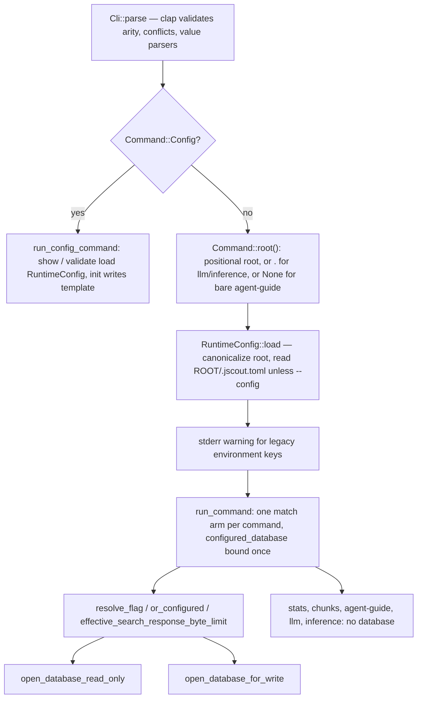
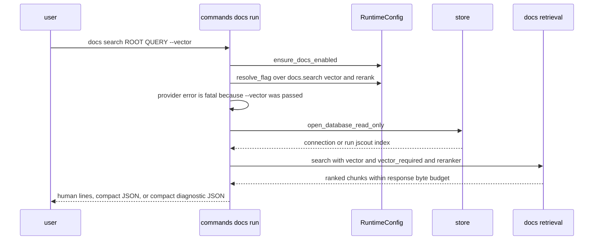

# Command line: cli.rs, commands, and dispatch

`jscout` is one clap 4 derive tree of 23 top-level commands (33 leaves once the six subcommand groups are expanded), declared in `src/cli.rs` and dispatched by an 81-line `src/main.rs` that does exactly one thing before delegating: it asks the parsed command which repository root it names, loads `ROOT/.jscout.toml` from there, and hands both the command and the resolved `RuntimeConfig` to `run_command`. Everything downstream of that — which default a flag falls back to, whether the database is opened through the version-checking read gate or the creating write gate, and what exit code a failure produces — is decided inline in `src/commands/mod.rs` rather than by a central resolver, so the rules are legible per command but not uniform across commands. This document inventories the surface, names where each default actually lives, and covers the new `jscout docs` group, the database gates, the exit-code paths, and the compiled-in agent guide.

## Dispatch

`main` (`src/main.rs:53`) calls `Cli::parse()` and then splits once. `Command::Config` goes straight to `run_config_command(command, cli.config.as_deref())` (`src/main.rs:56`); every other variant first calls `config::RuntimeConfig::load(command.root(), cli.config.as_deref())` (`src/main.rs:58`).

The split exists because the config commands *are* the configuration diagnostics. `config show` and `config validate` each load a `RuntimeConfig` from their own positional root (`src/commands/mod.rs:29,38`) so a bad file surfaces as their own output rather than killing a shared loader; `config init` never loads configuration at all — `config::init` (`src/config/load.rs:975`) canonicalizes the root, picks `--config` if given or else `ROOT/.jscout.toml`, and opens with `create_new(true)`, so it refuses to overwrite an existing file and must work on a repository that has none. `validate` prints `<none>` for the path when no file was found, alongside the configuration fingerprint. The cost of the early split is a dead arm: `run_command` carries `unreachable!("configuration commands are dispatched first")` (`src/commands/mod.rs:168`) for a case the enum still permits.

`Command::root()` (`src/commands/mod.rs:58-88`) is what makes a repository-local config file work without a global `--root` flag. Sixteen variants return their own positional root directly; group variants delegate to `DocsCommand::root` (`:92`), `ConfigCommand::root` (`:102`), `ScoutCommand::root` (`:112`), and the `Checker::Doctor` root inline (`:77-79`). Two answers are invented. `Llm` and `Inference` have no root argument at all (`src/cli.rs:917-943`), so they get `Path::new(".")` (`src/commands/mod.rs:84`) — their configuration comes from the *current working directory*, not from anything the command names. `AgentGuide { install: None }` returns `None` (`:85`), the only command that runs with no repository context; `RuntimeConfig::load` with `root: None` then consults only `--config`, and `database.path` falls back to the bare relative `.jscout.db` (`src/config/load.rs:405-407`). The `Config` arm (`:86`) is present and exhaustive but dead, since `main` already routed those.

`RuntimeConfig::load` canonicalizes the root (`src/config/load.rs:366-372`), so a typo'd root fails with "repository root does not exist" before any command body runs. `--config` is resolved with `absolute_from_cwd` (`:373`) — relative to the shell's directory, not to the root. After loading, `main` prints a stderr warning naming any legacy environment keys still supplying values (`src/main.rs:59-66`) and calls `run_command`.

The first diagram traces that path. Look at how many arrows converge on `RUN` versus how few bypass it.

`CFGRUN` is the only branch that never touches `LOAD`'s result; `ROOT` is the sole input that decides which file `LOAD` reads.

## Command inventory

| Command | Leaves | Database | Where the defaults come from |
| --- | --- | --- | --- |
| `config` | `show`, `validate`, `init` | none | n/a; each loads or writes its own file |
| `docs` | `embed`, `search`, `status` | `--database`, all three | `RuntimeConfig.docs.search.*`, `embedding.batch` |
| `stats` | — | none (walks the checkout) | n/a |
| `chunks` | — | none (walks the checkout) | `--filter` only |
| `index` | — | `--database` | `index.dependencies`, `docs.indexing_include/exclude` |
| `embed` | — | `--database` | `embedding.batch`, `embedding.origins` |
| `search` | — | `--database` | `search.*` throughout (26 clap fields) |
| `events` | — | **no flag**; configured path | clap `origin::defaults()` |
| `calls` | — | `--database` | clap `--limit 200`, `origin::defaults()` |
| `mcp` | — | `--database` | `mcp.profile/source_view/result_transport`, `telemetry.*` |
| `annotate` | — | `--database` (write) | n/a |
| `memory` | — | `--database` | all clap `default_value_t` |
| `overview` | — | `--database` | all clap `default_value_t` |
| `workflow-candidates` | — | `--database` | clap `default_value_t` |
| `watch` | — | `--database` (write) | `watch.*`, `docs.indexing_*`, `sidecars.checker` |
| `who-uses` | — | **no flag**; configured path | clap `origin::defaults()` |
| `neighborhood` | — | **no flag**; configured path | clap `default_value_t` throughout |
| `agent-guide` | — | none | n/a |
| `enrich` | — | `--database` | clap `--timeout 300` |
| `checker` | `doctor` | `--database` | clap `--timeout 30` |
| `llm` | `doctor` | n/a | `llm.*`, config read from cwd |
| `inference` | `serve`, `doctor` | n/a | `inference.*`, config read from cwd |
| `scout` | `repository`, `workflows`, `cards`, `summaries`, `concepts`, `refresh` | `--database` (write) | clap timeouts/budgets; `llm.model`, `llm.reasoning`, `llm.max_concurrency` |

`--database` appears at exactly 20 declaration sites in `src/cli.rs` and is consumed at 20 sites with the identical expression `database.as_deref().unwrap_or(configured_database)` — 17 in `src/commands/mod.rs`, where `configured_database` is bound once at `src/commands/mod.rs:166`, and 3 in `src/commands/docs.rs`. The framing "every command that takes `--database`" hides a real asymmetry: `events` (`:331`), `who-uses` (`:639`), and `neighborhood` (`:654-656`) pass `configured_database` directly and have no flag, so they cannot be pointed at an alternate index; `stats` and `chunks` take no database at all and re-parse the checkout (`src/commands/core.rs:520,488`).

## Where a default lives: clap or RuntimeConfig

There is no "resolve all defaults" pass. Layering is done per arm with three combinators declared at `src/commands/mod.rs:127-147`:

- `resolve_flag(enable, disable, configured)` — `if disable { false } else { enable || configured }`. A `--no-X` beats a configured `true`; a `--X` beats a configured `false`; neither leaves configuration standing. Clap's `conflicts_with` already rejects both explicit forms together, so the function only encodes precedence.
- `or_configured(explicit, configured)` — a non-empty CLI list *replaces* the configured list wholesale and never appends; empty means "unspecified".
- `effective_search_response_byte_limit(requested, configured, debug_json)` — explicit `--response-bytes` wins; otherwise `--debug-json` yields `usize::MAX`. Diagnostic JSON that silently truncates is worse than diagnostic JSON that is large, so the unbounded case is deliberate (`src/commands/core.rs:53-54` does the same for `neighborhood`, `src/commands/docs.rs:173-177` for `docs search`).

The convention that decides *which* source a flag reads is visible in the clap attribute. A flag with `default_value_t`/`default_value` never consults `RuntimeConfig`, because clap would make "unspecified" indistinguishable from "explicitly set to the default" and silently mask repository configuration. That covers `calls --limit` (200, `src/cli.rs:217`), all of `memory`'s and `overview`'s numeric bounds (`:273-331`, `:344-368`), every `neighborhood` bound (`:465-477`), `enrich --timeout` (300, `:506`), `checker doctor --timeout` (30, `:657`), and every scout `--timeout` (300) and `--context-bytes` (240,000). Conversely, `Option<T>` flags are the config-backed ones: `search`'s entire body (`src/commands/mod.rs:253-324`), `embed --batch`, `mcp --profile/--source-view/--result-transport` (`:370-376`), `watch`'s timings (`:584-586`), and `docs search --limit/--response-bytes`.

`--origin` straddles both conventions and is the sharpest instance. `events`, `calls`, `memory`, `overview`, `who-uses`, and `neighborhood` bake `default_values_t = origin::defaults()` into clap (`src/cli.rs:194,214,318,341,452,486`) — the hard-coded `["repository","workspace"]`. Only `search` and `embed` read `search.origins` / `embedding.origins` (`src/commands/mod.rs:261,207`). Setting an origin allowlist in `.jscout.toml` therefore moves search but not `events`.

Two list arguments are three-way rather than `or_configured`: `index --deps/--no-deps` (`src/commands/mod.rs:178-184`) and `watch`'s equivalent (`:577-583`) resolve `--no-deps` to empty, an empty `--deps` to the configured list, and otherwise to the CLI list. `embed --origin` (`:207-211`) inlines the same fallback instead of calling the helper.

`--exhaustive` overrides all of this. `src/commands/mod.rs:254-261` prefixes vector, rerank, memory attach, and expansion with `!exhaustive &&`, so a completeness traversal runs with every ranking stage off even when configuration enables them. Clap's `conflicts_with_all` at `src/cli.rs:103` rejects the explicit enables and produces a usage error; it cannot neutralize a configured `true`, which is why the prohibition is stated twice.

## The `docs` command group

`Command::Docs` routes to a dedicated module (`src/commands/mod.rs:169` → `src/commands/docs.rs:10`). Three leaves (`src/cli.rs:563-626`), all sharing the same `.jscout.db` as the code planes:

`docs status` is the only leaf that runs on a disabled corpus. It short-circuits before opening a database and prints `{"enabled": false, "active_corpus": false}` or a single human line. This is the explicit no-database/no-identity exception: it emits neither `snapshot` nor `publication_snapshot` and describes configured policy only. Otherwise it opens read-only and renders `store::status` with both identities, canonical root, corpus counts, admission decisions, and malformed-front-matter diagnostics.

`docs embed` is the only path that calls a provider for documentation vectors. `jscout index` can materialize a complete current generation provider-free from the durable cache when extraction reset or readiness is absent; ordinary `jscout embed` still targets code/semantic vectors. `docs embed` requires the shared provider unconditionally, so a repository with no configured provider is a hard error rather than a no-op. Its report carries the documentation digest as `snapshot` and the publication fold as `publication_snapshot`. The consequence to know: `[docs.search] vector = true` on a repository whose cache has never been populated by `docs embed` yields BM25-only results with a not-ready vector generation, silently.

`docs search` resolves vector and rerank against `runtime.effective.docs.search` and then carries a semantics unique to this command. `--vector` means *required* participation, not merely enabled. The resolved `use_vector` turns the stage on, but the raw flag is forwarded separately as `vector_required` (`src/commands/docs.rs:185-186`), and a provider-resolution failure is downgraded to `warning: documentation vectors unavailable (…); using BM25` only when `--vector` was absent (`:136-151`). `search --vector` and `docs search --vector` are the same spelling with different failure modes.

`ensure_docs_enabled` (`src/commands/docs.rs:203`) fails `embed` and `search` when `[docs] enabled = false`, pointing at the flag and at `jscout index`. Note that `src/commands/docs.rs:212` re-declares a private `resolve_flag` byte-identical to the one at `src/commands/mod.rs:127` rather than importing it.

The sequence below is `docs search` end to end. Watch which participant the required-vector decision is made against.

`ensure_docs_enabled` runs before any database work, and `vector_required` is set from the raw flag rather than from the resolved one — that pairing is the whole difference from code search.

## Database acquisition

Two thin helpers choose between root-relative and explicit-path opens (`src/commands/core.rs:11-29`): `open_database_for_write` routes to `store::open` / `store::open_path`, `open_database_read_only` to `store::open_read_only` / `store::open_path_read_only`. The asymmetry lives in `src/store.rs`.

`open_path_read_only` (`src/store.rs:63`) refuses to create a file — a missing database bails with "run `jscout index` first" — sets `query_only`, and then rejects in a fixed order: schema version against `SCHEMA_VERSION = "34"`, a published projection marker matching `structural::PROJECTION_VERSION`, all producer contracts, then the complete identity quartet. `Identities::read` requires `code_digest`, `documentation_digest`, `documentation_provenance_digest`, and `snapshot`, and verifies that `snapshot` is the fold of the other three. Every rejection names `jscout index` as the repair. The comment at `src/store.rs:56-58` states the reason plainly: a typo or an unindexed checkout must not silently create a database that looks usable.

`open_path` (`src/store.rs:153`) creates parent directories, and when the durable schema version sits between `DURABLE_SCHEMA_FLOOR = 16` (`:9`) and the current `SCHEMA_VERSION` it rebuilds the disposable tables in place rather than refusing, then runs `init_schema`. It performs **none** of the read-path contract checks. That is the sharp edge: `docs embed`, `annotate`, and every `scout` leaf call the write helper, so running one against an unindexed root creates an empty `.jscout.db` and then fails somewhere downstream on missing snapshot data rather than on the read path's clear "run `jscout index`" message.

Read surfaces on the gated path: `search`, `memory`, `overview`, `calls`, `events`, `who-uses`, `neighborhood`, `workflow-candidates`, `docs search`, `docs status`. Write surfaces on the creating path: `index`, `embed`, `annotate`, `watch`, `docs embed`, all six scout leaves.

## Errors and exit codes

`main` returns `anyhow::Result<()>`, so any `Err` is rendered by Rust's `Termination` impl as `Error: <chain>` on stderr with exit status 1. Two paths bypass that.

`cmd_who_uses` calls `std::process::exit(1)` directly after `eprintln!("no symbol found for '{spec}'")` (`src/commands/core.rs:422-424`) — an unresolved symbol is treated as a query outcome, not an error chain, so it carries no `Error:` prefix and no caller can add context to it.

Ctrl-C exits 130 through two independent handlers with the same shape. `src/llm/process.rs:151-154` and `src/checker/process.rs:226-229` both read `if !request_interrupt_cancellation() { std::process::exit(INTERRUPTED_EXIT_CODE) }`. The predicate returns false when nothing is registered, nothing is in flight, or an interrupt is *already* pending (`INTERRUPT_PENDING.swap`, `src/llm/process.rs:162-164,177-179`) — so the first interrupt during a live model call requests cancellation and the process continues, while a second one exits immediately. The checker path is reachable from `enrich`, `watch`, and `checker doctor`, not only from scouting.

Scout commands convert report *content* into exit status. `scout_batch_exit` (`src/commands/scout.rs:238-251`) prints the full batch first, then bails if any subject's `status == "failed"`; the comment above it states the contract — scripts and agents key on exit status, while incomplete model refusals and reported policy skips are designed outcomes that exit zero. The tradeoff is that one failure in fifty exits nonzero even though forty-nine artifacts published, so callers must read the report rather than the status alone.

A number of validations live in the CLI layer rather than in the callee, producing jscout errors (exit 1) instead of clap usage errors (exit 2). `watch` rejects product-only without embed, a zero enrich timeout, a zero debounce, and a nonzero reconcile interval that does not exceed debounce (`src/commands/mod.rs:587-600`). `scout workflows|cards|concepts` take `--max-calls` as `Option<usize>` and derive it when omitted: workflows bails on empty seeds else defaults to `1` (`:823-829`); cards bails when anchors are empty *or* `--file`/`--subject` was used, else defaults to `anchors.len()` (`:872-884`); concepts bails on empty terms else defaults to `terms.len()` (`:963-969`). `scout repository`, `summaries`, and `refresh` take a required `usize` instead (`src/cli.rs:685,833,900`), and only `repository`'s goes through `parse_positive_count_or_all` (`src/cli.rs:945`), which maps case-insensitive `all` to `usize::MAX` and rejects zero — the same parser backs `--max-subjects`, whose clap default is the string `"all"` (`:690-695`).

Gateway pool sizing is where the config-only `llm.max_concurrency` (default 1, `src/config/load.rs:798-803`, no CLI flag anywhere) meets the per-command budget. `launch_scout_gateway` (`src/commands/scout.rs:9-23`) computes `max_concurrency.min(call_capacity.max(1))`, and each caller supplies a different capacity: `policy.max_calls.min(plan.items.len())` for workflows, cards, and concepts (`:48,155,179`), `policy.max_calls.min(selection.targets.len())` for refresh (`:228`), and bare `policy.max_calls` for repository (`:91`) and summaries (`:124`). Those last two size the pool purely from `--max-calls`, so `--max-calls all` gives `max_concurrency` Node workers regardless of how many subjects exist. Every scout leaf builds `RequestPolicy::new(timeout, max_calls, context_bytes)?.with_max_concurrency(runtime.effective.llm.max_concurrency)?`. `scout repository --dry-run` takes a different path entirely (`src/commands/scout.rs:79`): it launches a single `ProcessGateway`, not a pool, and uses it for model-capability and billing-path lookups — the report says it makes no generation calls, which is true, but the gateway is contacted. `scout refresh` also returns early with a printed line and no gateway when the selection is empty (`:224-227`).

## Agent guide

`src/agent.rs` embeds the two tiered skills, `integrations/jscout/core/SKILL.md` and `integrations/jscout/full/SKILL.md`, as `CORE_GUIDE` and `FULL_GUIDE` (G28). `agent-guide` prints the selected `--tier` (default `core`) to stdout; `agent-guide --install ROOT --dest agents|claude|codex` canonicalizes the root, creates the destination's `skills/jscout/` directory, and opens the target with `create_new(true)`, so an existing project-local guide is an error, never an overwrite. A repository may have edited its copy, and discarding that silently would be worse than requiring a manual delete before upgrading.

The guide's **Investigation loop** covers known identifiers, conventions, and blast radius: start with `semantic_search` at `exhaustive: true`, treat `limit` as a page size and never as a completeness boundary, traverse pages by echoing `next_cursor` unchanged, and stop only when `truncated` is false *and* the summed page-local `returned` equals `total_chunks`. It also pins deterministic budget recovery. The **Inquiry loop** covers causal and cross-file questions through semantic memory and localization. "Authored repository documentation" states that `documentation_search` has a separate documentation snapshot and ranking corpus, and that a documentation hit is authored prose rather than runtime proof. For exact follow-on calls, the guide now tells agents to combine a returned anchor with the single top-level code `snapshot` and to preserve explicitly supplied origins/formats; responses no longer emit per-hit `followups` argument objects.

`src/agent.rs:38-71` pins 26 exact substrings of that contract as a unit test and additionally asserts the retired advice "initial result limit at 10" is *absent*. The guide is prose compiled into a binary, and a substring test is the cheap way to stop an edit from dropping a load-bearing rule; the cost is that rewording any pinned phrase breaks the build, so the test both protects and freezes the wording.

## Testing and its gaps

CLI coverage is parse-level. `src/main_tests.rs` (591 lines, included at `src/main.rs:81`) drives `Cli::try_parse_from` and destructures the resulting variant. It pins the full `resolve_flag` truth table and `or_configured` semantics (`:14`, `:36`), the config subcommands and the global `--config` selector (`:47`), `--lexical-only` acting independently of explicit `--no-vector`/`--no-rerank` (`:103`), exhaustive cursor paging with `--cursor` requiring `--exhaustive` and explicit stage enables rejected (`:251`), `docs search` parsing plus rejection of `--vector --lexical-only` and `--json --debug-json` (`:193`), `scout repository --max-calls all --max-subjects all` mapping to `usize::MAX` while `--warn-subjects` stays 512 (`:291`), `--database` on search and embed with the embed mode conflicts (`:326`), unbounded response bytes under `--debug-json` (`:459`), watch enrichment control independence (`:491`), and the enrich plan controls (`:539`).

One behavioral test exists: `src/commands/core_tests.rs` (51 lines, `#[path]`-included at `src/commands/core.rs:485`) indexes a temp repository with two same-named `run` methods and asserts `cli_who_uses_for_target` gives each target exactly one `likely` usage and one `possible` — that resolved calls do not leak into another target's candidate set. `src/agent.rs:73` asserts install writes `GUIDE` verbatim once and refuses the second attempt.

Nothing runs the built binary and checks an exit code. The exit-status contracts described above — `scout_batch_exit`, the `who-uses` `process::exit(1)`, the 130 interrupt paths — are unverified by the test suite; they are readable from source but not pinned.

## Known rough spots

- `docs search --lexical-only` conflicts with `--vector` and `--rerank` (`src/cli.rs:591,600`) but not with `--no-vector`/`--no-rerank`, so `--lexical-only --no-vector` parses and is merely redundant.
- The `Search` variant is 26 clap fields wide (`src/cli.rs:91-186`) and is destructured by name at `src/commands/mod.rs:219-252`; the declaration order in `cli.rs` is not the resolution order in `mod.rs`, so adding a field means touching two distant sites.
- `Command::root()` is a 30-line match that must be extended for every new command, and rootless commands need invented answers. That is the price of not having a global `--root`, which would create a second source of truth about which repository is being operated on.
- Documentation admission has no CLI flag at all. `cmd_index` takes `&runtime.effective.docs` (`src/commands/mod.rs:189`) and `watch` passes `docs.indexing_include()`/`indexing_exclude()` into `WatchOptions` (`:617-618`); with `[docs] enabled = false` those accessors return empty slices (`src/config/model.rs:58-64`), which starves the index pass of documentation globs without any caller re-checking the flag. There is no `--docs`/`--no-docs` anywhere.
