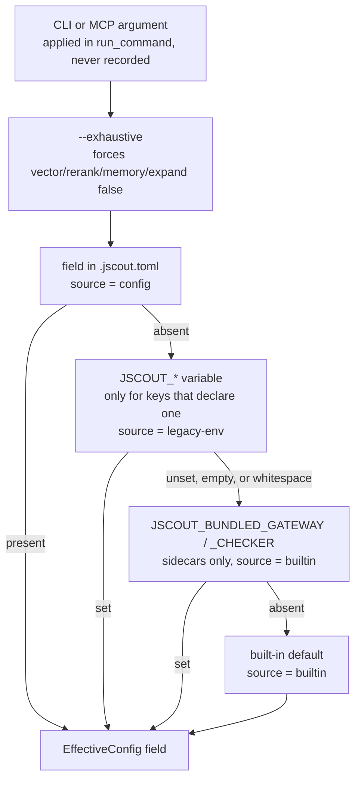
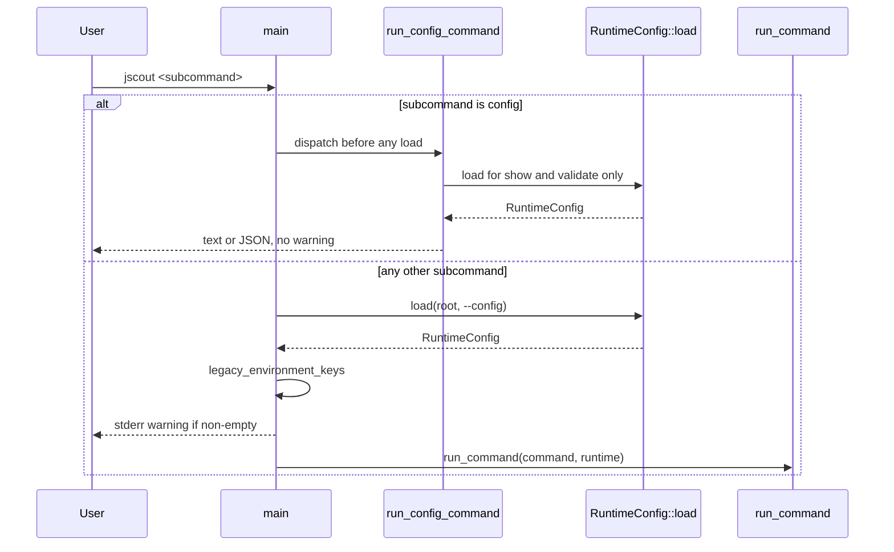
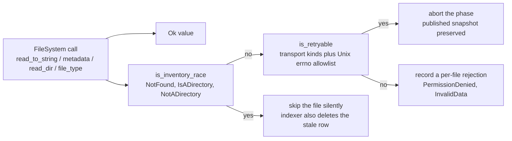

# Configuration and the I/O seam

jscout reads at most one repository-local TOML file, `.jscout.toml`, and turns it into a fully-typed `EffectiveConfig` before any database is opened or sidecar spawned. Each of 67 dotted keys is resolved by walking a fixed chain — the file, then a legacy `JSCOUT_*` environment variable if that key has one, then a built-in default — and the level that supplied the value is recorded in a `sources` map so `jscout config show` can say where every setting came from. Command-line flags sit above all of that but are applied at the call site and never recorded. The resolved struct is JSON-encoded and blake3-hashed into a fingerprint that identifies the runtime policy independent of its provenance. A separate, much smaller seam — `io_policy` for classifying `std::io::Error`, `fs_ops` for injecting the filesystem, `test_fs` for arming faults — decides which filesystem failures skip a file, which abort a whole indexing phase, and lets tests prove the distinction.

## Three type layers

`src/config.rs` is a 22-line module root with no `mod.rs`. It pins the contract in two constants, `FILE_NAME = ".jscout.toml"` and `SCHEMA_VERSION: u32 = 1` (`src/config.rs:16-17`), and compiles the repository's own documented example into the binary as `TEMPLATE = include_str!("../.jscout.toml.example")` (`src/config.rs:19`). Three private modules do the work: `load.rs` (1,217 lines) holds the file-shaped deserialization structs, the `Resolver`, `RuntimeConfig::load`, every validator, and `init`; `model.rs` (221 lines) holds the post-resolution types; `display.rs` (125 lines) renders `config show`.

The file layer is `FileConfig` plus twelve section structs (`src/config/load.rs:18-204`). Every leaf is `Option<T>` and every struct carries `#[serde(deny_unknown_fields)]`. The optionality is load-bearing: "absent" has to be distinguishable from "explicitly set to the same value as the default", or the provenance map could not be computed at all. `version: u32` is the single required field (`src/config/load.rs:21`), so a file that omits it fails inside `toml::from_str` with a missing-field error before the explicit `version != SCHEMA_VERSION` bail at `src/config/load.rs:360-367` ever runs — two different error messages for what a user experiences as the same mistake.

The effective layer (`src/config/model.rs:27-41`) mirrors the same twelve sections with the `Option`s collapsed and every path already an absolute `PathBuf`. Optionality that survives is semantic rather than syntactic: `EmbeddingSettings::provider: Option<String>` being `None` means embeddings are off, and `TelemetrySettings::file: Option<PathBuf>` being `None` means telemetry is disabled, which `display_optional_path` renders as `<disabled>` (`src/config/load.rs:948-954`). `SearchSettings` and `ExpansionSettings` additionally carry hand-written `Default` impls (`src/config/model.rs:63-113`) restating the same defaults `load` applies — a second copy that nothing forces to stay in sync with the first.

The envelope is `RuntimeConfig { root, config_path, config_loaded, config_explicit, fingerprint, effective, sources }` (`src/config/model.rs:16-25`). `sources` is a `BTreeMap<String, ValueSource>` over `Config | LegacyEnv | Builtin`, serialized kebab-case so JSON shows `legacy-env` (`src/config/model.rs:8-14`); the `BTreeMap` makes both the text and the JSON output deterministically ordered. There is deliberately no `Cli` variant, which is the subsystem's central tradeoff: `config show` describes the file-plus-environment layer accurately and can never describe what a specific invocation will actually do.

## The precedence chain

Look at how many arrows bypass the environment level — that is the shape of the migration, not an oversight.

`Resolver`'s four generic helpers — `string`, `optional_string`, `bool`, `usize` (`src/config/load.rs:230-339`) — each walk `TOML` → `ENV` → `DEF` and stamp `sources` on whichever branch fires. But `configured_or` (`src/config/load.rs:217-228`) is a two-level variant with no environment probe at all, and it backs every list-valued key plus the three `watch` numerics. So the `ENV` node in the diagram is skipped entirely for the whole `search.*`, `mcp.*`, `watch.*`, `index.dependencies`, `database.path`, `embedding.batch`, `embedding.origins`, and `telemetry.request_log` surface. Two keys never touch `Resolver` at all: `inference.port` goes through `resolve_port` (`src/config/load.rs:1001-1024`), which has its own u16 parse and its own `JSCOUT_INFERENCE_PORT` branch, and `llm.openai_compatible_providers` goes through `resolve_compatible_providers` (`src/config/load.rs:1105-1127`), which parses a JSON array out of `JSCOUT_PI_AI_OPENAI_COMPATIBLE_PROVIDERS`. `embedding.api_key_env` writes its own `sources` entry by hand (`src/config/load.rs:575-583`) because its default depends on `embedding.provider` and `embedding.url`.

`nonempty_env` trims and treats empty or whitespace-only as unset (`src/config/load.rs:955-960`), so `JSCOUT_RERANK_TOP=""` falls through silently rather than erroring. `Resolver::usize` runs `positive()` on both the configured and the environment branch (`src/config/load.rs:317-339`), which makes every `usize`-resolved key strictly positive; `configured_or` does not, which is exactly why the `watch` zero checks are written out by hand at `src/config/load.rs:876-881`.

The `BUNDLED` node exists for `sidecars.gateway` and `sidecars.checker` only. `optional_string_with_internal` (`src/config/load.rs:271-294`) probes the user-facing legacy variable, then an internal one, and labels the internal hit `Builtin` rather than `LegacyEnv`. The npm launcher passes bundled sidecar paths through the environment; labelling them `Builtin` stops an installed-package run from printing a migration warning on every single invocation, at the cost of `config show` reporting `builtin` for a value that demonstrably came from the environment. The comment at `src/config/load.rs:287-288` says so outright.

Above all of it sits the flag layer in `src/commands/mod.rs`. `resolve_flag(enable, disable, configured)` is `if disable { false } else { enable || configured }` (`src/commands/mod.rs:115-117`); `or_configured` replaces a configured list wholesale when the CLI list is non-empty (`src/commands/mod.rs:121-127`); `effective_search_response_byte_limit` lets `--debug-json` promote the budget to `usize::MAX` (`src/commands/mod.rs:129-135`). G22's `--exhaustive` sits above even that, computing `vector`, `rerank`, `include_memory`, and `expand` as `!exhaustive && resolve_flag(...)` (`src/commands/mod.rs:240-247`), so a configured `search.vector = true` is silently ignored under `--exhaustive`; the limit likewise routes through `search::resolve_search_limit`, which clamps a configured limit to `MAX_EXHAUSTIVE_PAGE_SIZE = 200` (`src/search.rs:13`, `src/search.rs:22-31`). Clap only conflicts the explicit flags (`src/cli.rs:97-98`); the configured values are suppressed in code with no diagnostic.

## Every key

Defaults are the ones `load` applies; "—" in the env column means that key has no environment level at all. Paths resolve against the canonicalized root unless marked `~`, which means `resolve_path(..., allow_tilde = true)`.

| TOML path | Legacy env | Default |
|---|---|---|
| `database.path` | — | `.jscout.db` (`store::DB_FILE`) |
| `search.vector` | — | `true` |
| `search.rerank` | — | `true` |
| `search.attach_memory` | — | `false` |
| `search.limit` | — | `10` |
| `search.response_bytes` | — | `24000` |
| `search.file_roles` | — | `[]` (no role filter) |
| `search.origins` | — | `["repository", "workspace"]` |
| `search.memory_limit` | — | `4` (≤ 100) |
| `search.memory_depth` | — | `2` (≤ 8) |
| `search.memory_nodes` | — | `2000` (≤ 20000) |
| `search.expansion.enabled` | — | `false` |
| `search.expansion.mode` | — | `"paths"` |
| `search.expansion.min_confidence` | — | `"likely"` |
| `search.expansion.depth` | — | `1` |
| `search.expansion.seeds` | — | `3` |
| `search.expansion.paths` | — | `8` (≤ 50) |
| `search.expansion.nodes` | — | `40` |
| `search.expansion.edges` | — | `120` |
| `search.expansion.bytes` | — | `24000` |
| `search.expansion.file_roles` | — | `["production", "unknown"]` |
| `embedding.provider` | `JSCOUT_EMBED_PROVIDER` | none (embeddings off) |
| `embedding.model` | `JSCOUT_EMBED_MODEL` | provider-dependent: `BAAI/bge-m3` / `voyage-code-3` / `text-embedding-3-small` |
| `embedding.url` | `JSCOUT_EMBED_URL` | none |
| `embedding.api_key_env` | — | `VOYAGE_API_KEY`, `JSCOUT_EMBED_KEY`, or `OPENAI_API_KEY` by provider |
| `embedding.revision` | `JSCOUT_EMBED_REVISION` | none |
| `embedding.query_prefix` | `JSCOUT_QUERY_PREFIX` | none |
| `embedding.batch` | — | `64` |
| `embedding.origins` | — | `["repository", "workspace"]` |
| `inference.host` | `JSCOUT_INFERENCE_HOST` | `127.0.0.1` |
| `inference.port` | `JSCOUT_INFERENCE_PORT` | `8792` |
| `inference.url` | `JSCOUT_INFERENCE_URL` | derived `http://<host>:<port>` |
| `inference.project` | `JSCOUT_INFERENCE_PROJECT` | none |
| `inference.model_cache_root` | `JSCOUT_MODEL_CACHE_ROOT` | none (`~`) |
| `inference.allow_remote` | `JSCOUT_INFERENCE_ALLOW_REMOTE` | `false` |
| `inference.uv` | `JSCOUT_UV` | `uv` |
| `inference.batch_size` | `JSCOUT_INFERENCE_BATCH_SIZE` | `16` |
| `inference.max_length` | `JSCOUT_INFERENCE_MAX_LENGTH` | `4096` |
| `reranker.url` | `JSCOUT_RERANK_URL` | none |
| `reranker.top` | `JSCOUT_RERANK_TOP` | `50` (≤ 100) |
| `reranker.model` | `JSCOUT_RERANK_MODEL` | `BAAI/bge-reranker-v2-m3` |
| `reranker.revision` | `JSCOUT_RERANK_REVISION` | none |
| `reranker.max_chars` | `JSCOUT_RERANK_CHARS` | `4000` |
| `llm.model` | `JSCOUT_LLM_MODEL` | `openai-codex:gpt-5.6-terra` (`src/llm/config.rs:12`) |
| `llm.reasoning` | `JSCOUT_LLM_REASONING` | none |
| `llm.openai_base_url` | `JSCOUT_PI_AI_OPENAI_BASE_URL` | none |
| `llm.api_key_env` | — | `OPENAI_API_KEY` |
| `llm.auth_file` | `JSCOUT_PI_AI_AUTH_FILE` | `~/.pi-ai/auth.json` (`~`) |
| `llm.openai_compatible_providers` | `JSCOUT_PI_AI_OPENAI_COMPATIBLE_PROVIDERS` (JSON) | `[]` |
| `sidecars.node` | `JSCOUT_NODE` | `node` |
| `sidecars.gateway` | `JSCOUT_PI_AI_GATEWAY`, then `JSCOUT_BUNDLED_GATEWAY` | none (`~`) |
| `sidecars.checker` | `JSCOUT_CHECKER_SIDECAR`, then `JSCOUT_BUNDLED_CHECKER` | none (`~`) |
| `mcp.profile` | — | `structural` |
| `mcp.source_view` | — | `full` |
| `mcp.result_transport` | — | `auto` |
| `telemetry.file` | `JSCOUT_TELEMETRY_FILE` | none (disabled) |
| `telemetry.request_log` | — | none (disabled) |
| `diagnostics.timing` | `JSCOUT_TIMING` | `false` |
| `diagnostics.debug` | `JSCOUT_DEBUG` | `false` |
| `index.dependencies` | — | `[]` |
| `watch.embed` | — | `false` |
| `watch.product` | — | `false` |
| `watch.dependencies` | — | `[]` |
| `watch.enrich` | — | `false` |
| `watch.enrich_timeout_seconds` | — | `300` |
| `watch.debounce_ms` | — | `2000` |
| `watch.reconcile_seconds` | — | `600` |

That is 67 entries. A grep for quoted dotted literals in `load.rs` returns 68; the extra one is `llm.openai_compatible_providers.base_url` (`src/config/load.rs:1182-1185`), which is a validation-error label, not a key that lands in `sources`.

## Validation

Validation is a load-time gate, not a runtime check, and it runs section by section in the order database → search → embedding → inference → reranker → llm → sidecars → mcp → telemetry → diagnostics → index → watch. Enumerations fail closed naming the offending key: `search.expansion.min_confidence` against `certain|likely|possible` (`src/config/load.rs:412-414`), `search.expansion.mode` through `ExpansionProjection::parse` (`src/config/load.rs:421-422`), the three `mcp.*` enums (`src/config/load.rs:794-810`), and `embedding.provider` normalized lowercase with `""` and `none` both meaning off (`src/config/load.rs:1031-1039`). Ceilings are checked after `SearchSettings` is constructed (`src/config/load.rs:512-532`). `validate_string_list` rejects empty entries and duplicates in `index.dependencies` and `watch.dependencies` (`src/config/load.rs:992-1002`). `validate_endpoint` (`src/config/load.rs:1041-1056`) rejects query strings, fragments, non-http(s) schemes, an empty authority, and an authority containing `@` — which is what keeps credentials out of any configured URL.

Cross-key checks run immediately after the sections they depend on. `embedding.url` is legal only under `provider = "openai"` (`src/config/load.rs:561-563`). A non-loopback `inference.host` bails unless `inference.allow_remote = true` — but the guard is written as `resolver.sources["inference.host"] == ValueSource::Config` (`src/config/load.rs:649-656`), so a host supplied through `JSCOUT_INFERENCE_HOST` skips the check entirely. `sidecars.gateway` and `sidecars.checker` must name existing files (`src/config/load.rs:780-781`, `src/config/load.rs:1065-1072`). The `watch` block carries four hand-written checks: `product` requires `embed`, `enrich_timeout_seconds` and `debounce_ms` must each be non-zero, and `reconcile_seconds` must either be zero or satisfy `reconcile_seconds * 1000 > debounce_ms` — a unit-converting comparison, not a bare one (`src/config/load.rs:873-886`). `reranker.top > 100` is asymmetric on purpose: a configured value errors, an environment value clamps to 100 (`src/config/load.rs:691-697`), preserving the historical env surface while making the new file surface fail closed. The same number therefore behaves differently depending on which level supplied it.

Path resolution is `resolve_path` (`src/config/load.rs:1084-1104`): trim, reject empty, expand `~`/`~/` from `HOME` only where `allow_tilde` is set, pass absolutes through, otherwise join against the canonicalized root and error if there is no root. The explicit `--config` path goes through `absolute_from_cwd` instead (`src/config/load.rs:1106-1111`), so it resolves against the invocation directory while every path *inside* the file resolves against the repository — same-looking relative strings landing in different places.

## Fingerprint and secrets

`serde_json::to_vec(&effective)` then `blake3` (`src/config/load.rs:903-904`). It covers `EffectiveConfig` only — not `sources`, not `root`, not `config_path`. Flipping `search.rerank` changes the fingerprint; moving a value from an environment variable into the file without changing it does not, which is asserted directly by `fingerprint_changes_with_runtime_policy_not_source_labels` (`src/config/tests.rs:174-183`). The consequence is that a matching fingerprint does not prove the environment is clean.

Secrets never enter this system at all. The file holds only variable *names* — `embedding.api_key_env`, `llm.api_key_env`, and the per-provider `apiKeyEnv` — and the values are read at their point of use, in `src/embed.rs:197` and `src/embed.rs:219` for embedding keys and `src/llm/process.rs:183-190` for the gateway key. They are consequently absent from `sources`, from `show_json`, and from the fingerprint, which is what makes all three safely loggable. The cost is that a missing secret surfaces far from config load: at embedding-provider construction or at gateway spawn. `gateway_environment` (`src/llm/process.rs:161-193`) runs the pipeline backwards, re-exporting the typed non-secret LLM settings to the Node gateway as `JSCOUT_PI_AI_*` variables and copying a non-default `llm.api_key_env` value into `OPENAI_API_KEY` for the child process only.

## Dispatch, the migration warning, and the subcommands

`main` matches on the subcommand at `src/main.rs:54`; the `Command::Config` arm calls `run_config_command` at `src/main.rs:55`, before anything else. Every other command loads at `src/main.rs:57`, calls `legacy_environment_keys()` — which filters `sources` for `ValueSource::LegacyEnv` in `BTreeMap` order (`src/config/display.rs:119-124`) — prints a single stderr line naming those keys and `.jscout.toml` if the list is non-empty (`src/main.rs:58-65`), and only then runs the command (`src/main.rs:66`). The `C->>L` arrow in the diagram is not a shortcut: `run_config_command` does load the runtime for both `Show` (`src/commands/mod.rs:28`) and `Validate` (`src/commands/mod.rs:37`); only `Init` skips it. What the early dispatch actually costs is the warning — `jscout config show` never prints it, even though its own `sources:` block lists the same keys as `legacy-env`.

`ConfigCommand` has exactly three variants, all taking a root positional (`src/cli.rs:557-577`), with `--config` a global flag (`src/cli.rs:13-16`). `Show` prints `show_text` or, under `--json`, `serde_json::to_string_pretty(self)` over the whole `RuntimeConfig`. `show_text` is not one line per section: it emits root, config path with loaded state, fingerprint, and then eight setting lines — database, search, embedding, inference, reranker, llm, mcp, sidecars — before the `sources:` map (`src/config/display.rs:20-112`). `telemetry.file` and `telemetry.request_log` are folded into the `mcp:` line, and `diagnostics`, `index`, and `watch` are not printed at all; the only way to see them is `--json` or the `sources:` block, which lists the keys but not their values. `Validate` prints `configuration valid: <path> (<fingerprint>)`. `Init` calls `config::init` (`src/config/load.rs:917-938`), which opens the target with `create_new(true)` so it can never overwrite, and writes `TEMPLATE` verbatim.

## Configured-database parent creation

New at `4de5622`, and the only change to this area since the previous baseline. `store::open_path` now takes the path's parent, filters out an empty one so a bare relative filename creates nothing, and `create_dir_all`s it before `Connection::open` (`src/store.rs:111-124`). A configured `database.path = ".jscout/jscout.db"` therefore needs no preparatory `mkdir`. `store::open_path_read_only` was deliberately left alone: it still bails when the file is absent, and `writer_open_creates_a_missing_database_parent` (`src/store.rs:1213-1229`) asserts the asymmetry by checking that the read-only open fails first *and leaves the directory absent*. The tradeoff is real — a typo in `database.path` no longer errors on the first index run; it creates a directory tree.

Read-only opening is a much stronger gate than "the file exists": `open_path_read_only` also sets `query_only=ON`, requires `meta.schema_version == "29"`, requires a published `snapshot` key, and requires `projection_version` to match `structural::PROJECTION_VERSION`, each with its own "run `jscout index`" message (`src/store.rs:53-107`). `open_database_for_write` / `open_database_read_only` route to `open_path*` only on the `Some(database)` branch and fall back to `store::open(root)` / `store::open_read_only(root)` otherwise (`src/commands/core.rs:11-29`) — in practice `run_command` always passes `Some(database.as_deref().unwrap_or(configured_database))`, so the fallback is dead in the CLI. MCP does not use these helpers at all: `mcp::serve` calls `store::open_path_read_only` directly at startup (`src/mcp.rs:160`) and opens a *write* connection through `store::open_path` only when the `annotate` tool is actually selected (`src/mcp.rs:274`).

## The I/O seam

The three-way fork below is the whole of `io_policy`'s reason to exist. Note which branch is the silent one.

`io_policy` (106 lines) is pure classification over `std::io::Error`. `is_inventory_race` covers exactly three kinds (`src/io_policy.rs:6-11`) — a file that moved after the inventory was taken, which watcher events or periodic reconciliation will converge on. `is_retryable` returns `false` for anything `is_inventory_race` claims (`src/io_policy.rs:17-19`), then matches transport and interruption kinds, then falls through to a Unix errno allowlist including `EIO`, `EMFILE`, `ENFILE`, `ENOMEM`, and `ESTALE` (`src/io_policy.rs:37-59`). On non-Unix `retryable_os_error` is a constant `false` (`src/io_policy.rs:61-64`), so a Windows resource exhaustion carrying only an errno is classified permanent and becomes a `REJECT` rather than an `ABORT`. Two inline tests assert the mutual exclusion and that `PermissionDenied` is not retryable (`src/io_policy.rs:70-105`).

Four call sites consume the fork identically in shape. `workspace::classified_io` (`src/workspace.rs:337-357`) returns `Ok(None)`, an error, or a pushed `WorkspaceRejection`. The two indexer read loops match the same three arms (`src/indexer.rs:408-425` for repository sources, `src/indexer.rs:1034-1049` for dependency files); the repository loop's `REJECT` branch does slightly more than record — it inserts into `seen` and calls `store::delete_file` on the previously indexed row before recording. `walk.rs` unwraps `ignore::Error` recursively through `retryable_ignore_error` and `only_inventory_races` (`src/walk.rs:152-174`) so the same policy applies to directory traversal.

`fs_ops` (42 lines) is a four-method trait — `read_to_string`, `metadata`, `read_dir`, `file_type` — with a zero-sized `OsFileSystem` delegating straight to `std::fs` (`src/fs_ops.rs:16-42`). Its doc comment names both the scope (source publication, classified workspace discovery, selected-dependency discovery and planning) and the exclusions (canonicalization and existence probes, `package_entry_paths` traversal, resolver internals, `ignore` walking). It is threaded by generic parameter — `IndexOperation<'a, F: FileSystem>` is a single-field struct holding `&'a F` (`src/indexer.rs:278-286`) — so the replaceable runtime seam stays separate from `IndexOptions`, which remains plain user policy. The cost is 26 sites across the crate carrying an `impl FileSystem` bound or parameter.

That doc comment is now an incomplete description of the seam. `src/checker/package_gate.rs` (1,398 lines, new since the prior baseline) reads `package.json` boundaries with bare `fs::symlink_metadata`, `fs::metadata`, and `fs::read` under its own fail-closed policy — a manifest that appeared or changed after checker planning is a hard error, not a rejection (`src/checker/package_gate.rs:38-70`, `src/checker/package_gate.rs:318-350`). It uses neither `fs_ops` nor `io_policy`, and it is not in the exclusion list.

`test_fs` (66 lines, `#[cfg(test)]`-gated at `src/main.rs:39-40`) layers one-shot failures over the real filesystem. `FaultFileSystem` holds two maps, one path-addressed and one `(FileOperation, path)`-addressed (`src/test_fs.rs:22-25`); `take_failure` consults the operation-specific map first, then the general one, and removes whichever entry it used (`src/test_fs.rs:38-43`). The operation dimension exists so an earlier `metadata` probe cannot consume a fault intended for a later content read. Fifteen references across `dependency.rs`, `workspace/tests.rs`, and `indexer/tests.rs` use it to prove the classification end to end: a `NotFound` on one file yields `removed == 1` and `rejected == 0` with the other file retained (`src/indexer/tests.rs:42-56`), while an `EMFILE` aborts with a "retryable read failure" and leaves the previously published hash intact (`src/indexer/tests.rs:59-90`).

## Sharp edges

| Edge | Where |
|---|---|
| `jscout config show` never prints the legacy-env migration warning, because config subcommands are dispatched before the load-and-warn path | `src/main.rs:54-55` |
| A non-loopback `inference.host` from `JSCOUT_INFERENCE_HOST` bypasses the `allow_remote` guard, which only fires for config-sourced hosts | `src/config/load.rs:649` |
| `reranker.top = 150` in TOML errors; `JSCOUT_RERANK_TOP=150` clamps to 100 | `src/config/load.rs:691-697` |
| `SearchSettings::default()` / `ExpansionSettings::default()` duplicate the defaults `load` applies; nothing enforces agreement | `src/config/model.rs:63-113` |
| A configured sidecar path must exist on *every* load, so a moved gateway breaks read-only commands that never spawn it | `src/config/load.rs:780-781` |
| `or_configured` cannot clear a configured list; `--no-deps` on `index` and `watch` are the only escape hatches, and `--file-role` / `--file-origin` / `--expand-file-role` have none | `src/commands/mod.rs:121-127`, `src/cli.rs:56`, `src/cli.rs:416` |
| `--config` resolves against cwd while paths inside the file resolve against the root | `src/config/load.rs:1106-1111` |
| `--exhaustive` silently suppresses configured `search.vector`, `search.rerank`, `search.attach_memory`, and `search.expansion.enabled` with no diagnostic | `src/commands/mod.rs:240-247` |
| A configured `search.response_bytes` below the exhaustive-mode floor yields a typed `ResponseBudgetTooSmall` with a `minimum_bytes` retry value; the floor is query-dependent so load-time validation cannot catch it | `src/search/tests.rs` |
| A typo in `database.path` now creates a directory tree on the first index run instead of failing | `src/store.rs:111-124` |
| The 11 config tests read the process environment implicitly; a `JSCOUT_*` variable set in the test runner would change results and nothing isolates that | `src/config/tests.rs` |
