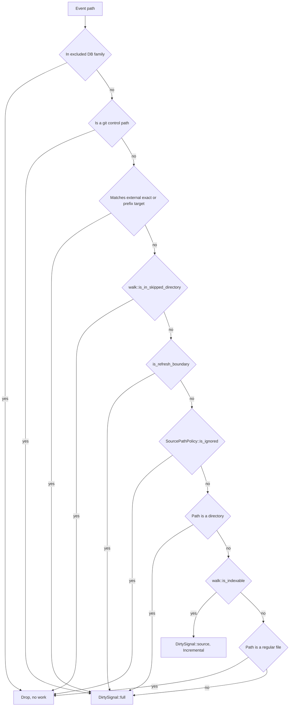
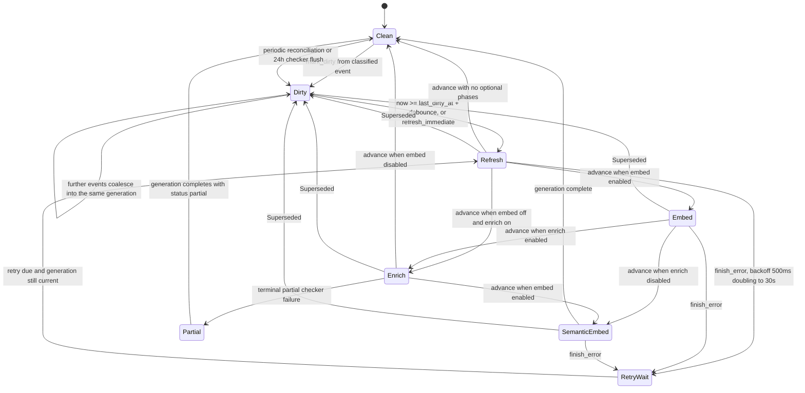
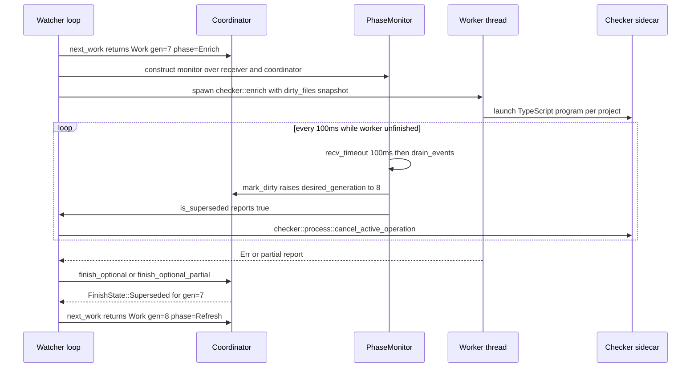

# Incremental indexing and the file watcher

`jscout watch` turns raw `notify` filesystem events into a debounced, monotonically numbered sequence of *generations*. Each generation begins with a structural refresh and then optionally chains embedding, checker enrichment, and semantic embedding onto the snapshot that refresh published. Two things distinguish it from a loop that re-runs `jscout index`: the refresh has two modes, and the cheaper one — `IndexMode::Incremental` — reuses the database rows of every source file whose content hash did not change, while still publishing a snapshot digest byte-identical to what a full rebuild of the same checkout would produce. The scheduling logic lives in a pure state machine with no clock and no filesystem access, so debounce, coalescing, retry backoff, and supersession are all testable without sleeping.

## The incremental path is production, not test scaffolding

`indexer::incremental_refresh_repo_with_options` is a plain `pub fn` with no `#[cfg(test)]` attribute (`src/indexer.rs:209`), and `watch::run_refresh` dispatches to it on every `RefreshScope::Incremental` generation (`src/watch.rs:1091-1096`). The `#[cfg(test)]` wrappers that remain in the module — `index_repo` (`src/indexer.rs:154`), `index_repo_with_options` (`src/indexer.rs:160`), the two `_with_fs` variants (`src/indexer.rs:177`, `src/indexer.rs:187`), and `index_repo_without_extraction_reset` (`src/indexer.rs:290`) — are test conveniences layered over a live entry point, not the only doors into an otherwise unreachable algorithm.

Four callers share one body, `index_repo_impl` (`src/indexer.rs:307`), parameterized by two orthogonal enums: `IndexMode` decides how much of the disposable structural plane is truncated up front, and `CheckerRetention` decides what happens to the optional checker plane after the new snapshot is computed (`src/indexer.rs:262-272`).

| Entry point | `IndexMode` | `CheckerRetention` | Caller |
| --- | --- | --- | --- |
| `incremental_refresh_repo_with_options` (`src/indexer.rs:209`) | `Incremental` | `PreserveActiveForWatch` | watch, `RefreshScope::Incremental` |
| `watch_full_refresh_repo_with_options` (`src/indexer.rs:246`) | `FullRefresh` | `PreserveActiveForWatch` | watch, `RefreshScope::Full` |
| `refresh_repo_with_options` (`src/indexer.rs:227`) | `FullRefresh` | `Drop` | `jscout index` (`src/commands/core.rs:245`) |
| `index_repo_without_extraction_reset` (`src/indexer.rs:290`) | `Incremental`, reset disabled | `Drop` | differential tests only |

Manual `jscout index` deliberately stays full-refresh-only so there is one unambiguous rebuild-from-scratch recovery command. The cost of that asymmetry shows in the output line: `cmd_index` omits `unchanged` from its print because for a full refresh it would always read zero and look like broken change detection (`src/commands/core.rs:255-266`).

## What "incremental" does and does not skip

Mechanically, `IndexMode::Incremental` means one thing: the `existing` map of `path -> (id, hash, role)` loaded from `files` is retained rather than replaced with an empty map (`src/indexer.rs:375-382`). Everything upstream of that is identical between modes. `walk::source_inventory` re-traverses the entire tree and re-applies ignore policy (`src/indexer.rs:317`, `src/walk.rs:98`), every inventoried file is read in full and re-hashed with blake3 (`src/indexer.rs:405-425`), and workspace discovery runs over the complete file list (`src/indexer.rs:319`). The doc comment on the entry point states this plainly (`src/indexer.rs:203-208`).

What is skipped is parse, chunk, graph extraction, and row insertion for files whose hash matches. Those files keep their `files.id` and every derived rowid; only `role` is `UPDATE`d when `file_role::classify` now disagrees (`src/indexer.rs:427-436`). Changed files are `store::delete_file`d and re-inserted (`src/indexer.rs:440-458`), and paths present in `existing` but never marked `seen` are deleted in a sweep (`src/indexer.rs:467-471`). `outcome.removed` is computed as `previous_paths.difference(&published)` (`src/indexer.rs:472`), so it counts both genuine disappearances and fail-closed removals: a file that became unreadable or unparseable loses its structural row rather than keeping a stale one (`src/indexer.rs:417-423`, `src/indexer.rs:459-464`; test at `src/indexer/tests.rs:1404`).

Two costs survive in both modes. `resolve_module_edges` issues `DELETE FROM module_edges` and re-resolves every `(file, request)` pair on every generation regardless of scope (`src/indexer.rs:1161-1236`), and the entire selected dependency corpus is re-read and re-hashed by `prepare_dependency_files` (`src/indexer.rs:904-957`). Incremental refresh removes extraction cost, not resolution cost.

There is also an escalation hatch. If `allow_extraction_reset` is set, `existing` is non-empty, and at least half the stored hashes are blank, the incremental path calls `store::reset_extraction_state` and clears `existing`, degrading itself into a truncate-and-refill (`src/indexer.rs:389-401`). Blank hashes come from `ensure_extraction_version`, which `UPDATE files SET hash=''` when `EXTRACTION_VERSION` moves (`src/indexer.rs:633-660`). The threshold is `cleared * 2 >= existing.len()` — exactly 50%, not 100% — so a partial invalidation touching half the tree silently promotes to a full rebuild (`src/indexer/tests.rs:1799`).

## Classifying events into a refresh scope

`EventClassifier::classify` (`src/watch.rs:465-537`) is where Full-versus-Incremental is decided. It walks every path in one `notify` event batch, merges the resulting signals with `DirtySignal::merge` (`src/watch.rs:110-116`), and returns `None` when the batch produced no work at all. Precedence matters, and the ordering encodes deliberate policy rather than convenience.

The first branch is self-trigger prevention: the classifier excludes the database plus its `-wal`, `-shm`, and `-journal` companions (`src/watch.rs:440-445`), otherwise every refresh would immediately re-dirty the coordinator. `absolute_database_path` canonicalizes that path, falling back to canonical-parent plus filename for a database that does not exist yet, so the exclusion set matches the paths `notify` actually reports (`src/watch.rs:1318-1334`).

`walk::is_in_skipped_directory` runs *before* `is_refresh_boundary`, which means a `package.json` under `node_modules/`, `dist/`, `.next/`, `coverage/`, or `out/` is silently dropped unless that root was registered as an explicit external target (`src/watch.rs:498-507`, `src/walk.rs:11`). Without that ordering, `npm install` noise would trigger endless full refreshes. The price is that a workspace package living under a directory named `out` is invisible to the watcher.

The full-refresh trigger list is small and explicit (`src/watch.rs:1338-1361`):

| Trigger | Why it forces Full |
| --- | --- |
| `package.json`, `pnpm-workspace.yaml` | workspace membership and package ownership |
| `package-lock.json`, `pnpm-lock.yaml`, `yarn.lock`, `bun.lock`, `bun.lockb` | dependency selection |
| `tsconfig*.json`, `jsconfig*.json` | module resolution and checker project ownership |
| `.gitignore`, `.ignore` | the corpus boundary itself |
| `.gitmodules` | submodule layout |
| `*.d.ts`, `*.d.mts`, `*.d.cts` | not indexed by `walk::is_indexable` (`src/walk.rs:13-20`) but they change resolution and checker projects |
| any directory event, or a path that is neither file nor directory | fail-open; the backend gave too little type information |

The last row is the main remaining source of wasted work: a directory rename or a transient path forces a full rebuild because the classifier cannot tell what happened.

## The 256-path cap and the two independent flags

`Coordinator::mark_dirty` merges each signal's scope with `max`, so `RefreshScope::Full` is sticky within a coalesced generation and no later source event can downgrade it (`src/watch.rs:222`, ordering from `src/watch.rs:59-62`). Source paths accumulate into `dirty_source_paths` until they hit `MAX_INCREMENTAL_SOURCE_PATHS = 256` (`src/watch.rs:22`); the 257th distinct path sets `source_overflow`, promotes the scope to `Full`, and adds the reason `mass-source-change` (`src/watch.rs:230-245`). Beyond a few hundred files the per-file delete/insert path loses to a truncate-and-refill, and unbounded reason strings would bloat the status line. Because `dirty_source_paths` is a `BTreeSet`, the 256 that survive an overflow are a lexicographic prefix, not the most recently or most frequently edited files.

Crucially, promoting the scope does not clear the dirty paths. Refresh scope and enrichment affinity are independent: a boundary change forces a full structural rebuild, but the checker still benefits from knowing which files actually changed (test at `src/watch/tests.rs:276`). Readers of the coordinator must therefore not infer scope from path emptiness.

`force_full_enrichment` is the second independent flag. `DirtySignal::checker_drift_flush` produces `Incremental` scope with `force_full_enrichment = true` (`src/watch.rs:99-107`), armed only when `enrich_on_change` is set and fired at most every 24 hours (`CHECKER_DRIFT_FLUSH_INTERVAL`, `src/watch.rs:20`, `src/watch.rs:691-693`, `src/watch.rs:714-718`). It exists because carry-forward deliberately ignores some ambient type drift, so that window needs a bound independent of the much more frequent structural reconcile. The requirement is preserved across superseding generations (`src/watch.rs:199`, `src/watch.rs:217-219`) and the timer is re-armed from generation *completion*, not from timer fire (`src/watch.rs:1022-1029`).

## Generations, phases, and cancellation

The coordinator is a private struct with no `Instant`, no filesystem, and no database; the driver supplies monotonic `Duration`s and executes the returned `Work` (`src/watch.rs:140-163`). `Work` carries `{generation, phase, refresh_scope, force_full_enrichment}` (`src/watch.rs:118-124`), and the generation stamp *is* the cancellation mechanism: `finish_refresh`, `finish_optional`, `finish_optional_partial`, and `finish_error` all return `Superseded` the moment `work.generation != desired_generation` (`src/watch.rs:326-364`).

Note the `Refresh --> Clean` edge: with neither embed nor enrich enabled, a generation is one phase long. The chaining table in `advance` is hard-coded (`src/watch.rs:388-396`), and it has one asymmetry worth naming — `Enrich` reaches `SemanticEmbed` only when `embed` is on, so enrich-without-embed ends the generation at `Enrich`. Generation 1 is special: `Coordinator::new` synthesizes a `startup` dirty mark and sets `refresh_immediate = true`, so the first refresh is Full and skips debounce entirely (`src/watch.rs:166-190`). The OS watcher subscribes recursively to the root *before* that first pass so edits during a long initial index are queued rather than lost (`src/watch.rs:663-669`).

Retry backoff doubles from 500ms and caps at 30s, with per-phase attempt counters cleared on success (`src/watch.rs:371-386`, `src/watch.rs:17-19`). It is uncapped in attempt count — a permanently failing refresh retries forever at 30s intervals.

## Supersession while a phase is running

Refresh runs to completion uninterrupted; the optional phases each spawn a worker thread and poll for supersession from the main thread. The ordering around `drain_events` after the refresh is the load-bearing detail.

`PhaseMonitor::poll` blocks up to `OPTIONAL_PHASE_POLL` (100ms) in `recv_timeout` and then drains the rest of the queue (`src/watch.rs:1218-1234`); the caller sleeps another 100ms per iteration (`src/watch.rs:1123`, `src/watch.rs:1151`, `src/watch.rs:1202`), so supersession is observed at roughly 5 Hz. Embed and SemanticEmbed cancel by flipping an `AtomicBool` the embedding loop reads at batch boundaries (`src/watch.rs:1110-1126`); Enrich cancels by calling `checker::process::cancel_active_operation()` (`src/watch.rs:1200`). A cancel that lands mid-provider-batch or mid-TypeScript-program still pays for that unit of work.

For Refresh there is no monitor. Instead, `drain_events` runs again *after* `run_refresh` returns and *before* `coordinator.finish_refresh(work)` (`src/watch.rs:793-805`). Without that call, an edit landing during the refresh could not raise `desired_generation` in time, and the generation would chain Embed and Enrich onto a snapshot that no longer matches disk. Optional phases need no equivalent, because `finish_optional` only sets `ready`, and `next_work` discards a `ready` or `retry` belonging to a stale generation at the top of the next iteration (`src/watch.rs:269-280`).

The Enrich error path distinguishes four outcomes (`src/watch.rs:926-960`): operator SIGINT (`checker::process::interrupt_pending()`, which returns `Ok(())` and exits the watcher), supersession (logged `canceled`), a terminal partial failure (`finish_optional_partial`, which still advances the generation but reports `status=partial`), and ordinary failure (backoff retry). `Partial` and `Complete` both anchor the next reconciliation deadline (`src/watch.rs:1276-1290`).

## The publication window and the identity fast path

One transaction spans extraction, the removal sweep, dependency discovery/planning/reading, and the deletion of the three publication markers (`BEGIN` at `src/indexer.rs:356`, `COMMIT` at `src/indexer.rs:507`). Dependency acquisition sits deliberately *before* the marker delete so a transient dependency read rolls the whole thing back instead of invalidating a live snapshot (comment at `src/indexer.rs:484-487`; test `dependency_failure_rolls_back_before_snapshot_invalidation` at `src/indexer/tests.rs:1834`). The price is that every selected dependency file's full source text is held in memory as a `PreparedDependencyFile` before commit (`src/indexer.rs:944-953`).

Because `store::open_path_read_only` refuses to open a database missing `snapshot` or `projection_version` (`src/store.rs:84-98`), readers are locked out from COMMIT until republication. Everything after COMMIT runs unpublished: `dependency::synchronize_instances`, `index_dependency_files`, `materialize_cached_embeddings` (only when `indexed > 0`, so a no-op generation does no vector work), `resolve_module_edges`, the `meta('root')` upsert, and both digest computations (`src/indexer.rs:512-525`). This applies to *every* generation, including a no-op incremental refresh — there is still no read-your-last-good-snapshot mode, so queries and MCP clients get hard failures during that window.

`ProjectionIdentity` is the escape from a full projection rebuild. It bundles `snapshot`, `projection_version`, and `resolution_hash` (`src/indexer.rs:591-631`), is read before the marker DELETE, and is zeroed when `extraction_reset` fired because the rows it would republish were just truncated (`src/indexer.rs:474-482`). When `previous == current` and no checker batch row changed, the three markers are simply re-upserted inside `BEGIN IMMEDIATE` and `projection_rebuilt` is set false (`src/indexer.rs:541-565`). The comment there states the justification: the projection is a pure function of the canonical tables, the snapshot covers every extracted row, and the resolution hash covers module edges whose inputs live outside indexed content.

That equality only holds because both digests are content-addressed. `compute_resolution_hash` joins `files` and `package_instances` and hashes `(source.path, request, target.path, package, resolution, package.canonical_root, type_only)` with explicit length prefixes (`src/structural.rs:383-424`), and `compute_snapshot_with_resolution` hashes path/hash/role/origin plus package identity ordered by path (`src/structural.rs:427-467`). An earlier version keyed the resolution hash on `from_file`/`to_file`/`package_instance_id` integers, which differ between a truncate-and-refill full refresh (rowids reassigned) and an incremental refresh (rowids preserved) — the same checkout produced two different snapshots depending on how it was reached. The differential oracle for the fix applies an edit, a delete, a rename, and an add to two databases, refreshes one incrementally and one fully, and asserts equal resolution hash, equal snapshot, and equal rowid-free `canonical_dump` (`src/indexer/tests.rs:1429-1512`, dump helper at `src/indexer/tests.rs:1090`). The tradeoff is real: the digest queries now sort by string tuples instead of scanning by integer key, and the `ORDER BY` must be kept in lockstep with the `SELECT` list.

## Checker retention as a two-step handshake

`CheckerRetention` splits into two store verbs. `store::clear_checker_batches` deletes every batch, including one whose `source_snapshot` equals the newly computed snapshot (`src/store.rs:982-985`; pinned by `src/indexer/tests.rs:1515`). `store::preserve_active_checker_batch_for_watch` deletes only `active=0` staging rows, keeping the single previously active batch as a hidden carry source (`src/store.rs:991-994`). Both return whether they changed any rows, and a `true` forces a projection rebuild through the `!checker_batches_changed` guard (`src/indexer.rs:529-541`).

Retirement is enforced by the projection, not by the indexer. `checker_occurrence_coverage` and `project_checker_enrichments` both require `batch.active=1 AND batch.source_snapshot=?1`, and additionally join `member_calls` on `call.rowid = enrichment.member_call_id` plus source path, source hash, and all six call/receiver/property offsets (`src/structural.rs:2110-2129`, `src/structural.rs:2185-2207`). A preserved batch from the previous snapshot therefore projects nothing — `src/indexer/tests.rs:1374` asserts one retained batch and zero batches matching the current snapshot. It becomes useful only in the following Enrich phase, where `carry_forward_projects` (`src/checker/enrich.rs:1639`) matches old facts by content-addressed `OccurrenceIdentity{file, hash, call_start..property_end}` (`src/checker/enrich.rs:181-190`), revalidates per-project fingerprints and external input freshness, and re-stages survivors under the *current* `occurrence.id`, which is the current `member_calls.rowid` (`src/checker/enrich.rs:1913-1938`). That re-staging is what satisfies the rowid predicate even after a full refresh reassigned every rowid. Because `hash` is the source file's content hash, an edited file misses every previous key and its facts are silently retired.

The conservatism has a cost: `preserve_active_checker_batch_for_watch` returns `true` merely for having deleted inactive staging rows that are never projected anyway, so any generation following an interrupted enrichment pays for a full projection rebuild.

## IO failure classification

`src/io_policy.rs` gives every read failure one of three dispositions, and the indexer branches on them identically for source files (`src/indexer.rs:405-424`) and dependency files (`src/indexer.rs:923-937`).

| Classification | Predicate | Effect |
| --- | --- | --- |
| Inventory race | `NotFound`, `IsADirectory`, `NotADirectory` (`src/io_policy.rs:6-12`) | `continue` without marking `seen`; the path becomes a removal |
| Retryable | `Interrupted`, `WouldBlock`, `TimedOut`, connection/pipe errors, or a retryable `errno` (`src/io_policy.rs:16-35`) | `Err` out; the transaction rolls back and the phase retries |
| Permanent | everything else | delete the old row, record a `read` rejection, continue |

The reasoning splits cleanly. Resource and transport errors can affect an arbitrary slice of the corpus, so publishing "clean" would publish a random subset. Permanent errors are corpus facts, and leaving a stale structural row live would be worse than removing it. The visible costs are that a file briefly locked by a build tool costs a whole generation retry, and that a permanently unparseable file vanishes from the index with only an stderr rejection line. Rejections are explicitly diagnostics that never affect scheduling (`src/watch.rs:330-334`), which means a permanently broken file emits its rejection line on every generation forever rather than being latched.

## Watch targets, reconciliation, and configuration

`collect_watch_targets` always seeds with `git_watch_targets(root)` and then adds dependency package canonical roots (recursive prefix targets), their locators, and active-batch checker inputs — the last only when the input lies outside the root (`src/watch.rs:1411-1457`). Configured `--deps` package directories under `node_modules/` come from `selector_watch_targets` (`src/watch.rs:1399`). On a read failure the whole set collapses to git targets only (`src/watch.rs:680`, `src/watch.rs:776-779`). `WatchRegistry::reconcile` registers only targets whose `watch_path` is outside the root, since the root is already watched recursively (`src/watch.rs:584-588`); it unwatches removed paths and counts per-path failures, logging `status=degraded ... recovery=target-reconciliation` (`src/watch.rs:626-639`). The Enrich success path re-collects and re-registers targets too (`src/watch.rs:909-917`), which is how a newly discovered `tsconfig.json` outside the root enters coverage.

After a successful refresh the watcher re-collects targets, carries `TargetSource::Checker` targets forward when enrich is on, reconciles the registry, and calls `classifier.reload_source_policy()` (`src/watch.rs:775-792`) so new ignore rules take effect at the same publication boundary as the new inventory. Between an ignore-file edit and completion of the refresh it triggers, events are still classified under the old policy — mitigated by `.gitignore` and `.ignore` being refresh boundaries.

Periodic reconciliation is anchored from generation completion, never from timer fire, and `clear_reconciliation_deadline_if_dirty` drops the deadline whenever the coordinator is not clean (`src/watch.rs:728`, `src/watch.rs:1299-1306`); retaining an overdue deadline would collapse `recv_timeout` to its 1ms floor for the whole retry wait. Under continuous edits reconciliation never fires, so degraded external coverage can stay stale indefinitely on a busy repository. With `reconcile_seconds = 0` there is no periodic reconciliation at all, and the watcher warns about it at startup (`src/watch.rs:706-710`).

Settings arrive from `[watch]` in `.jscout.toml` and are overridden per-flag by the CLI (`src/commands/mod.rs:532-604`). Defaults: `debounce_ms = 2000`, `reconcile_seconds = 600` (`src/config/load.rs:865-870`). The same invariants — `--product` requires embed, non-zero enrich timeout, non-zero debounce, `reconcile > debounce` or zero — are checked twice, once in `commands::mod` and again in `watch::validate_options` (`src/watch.rs:1060-1074`, called at `src/watch.rs:649`).

## Coverage and gaps

Coordinator tests drive the pure state machine with synthetic `Duration`s and never sleep: phase ordering with and without embed/enrich, terminal-partial survival through the semantic tail, supersession followed by a re-debounced generation, retry doubling with a parked retry gating fresh work, a failed Full refresh whose scope and reasons survive a superseding source event (`src/watch/tests.rs:125`), the independent 24h drift flush and its `force_full_enrichment` carry (`src/watch/tests.rs:194`), and the 256-path overflow promotion (`src/watch/tests.rs:276`). Two tests call the real `run_refresh` against a tempdir database — `refresh_phase_replaces_the_complete_file_set` (`src/watch/tests.rs:517`) and `incremental_refresh_reuses_unchanged_source_rows` (`src/watch/tests.rs:573`), which asserts `(indexed, unchanged) == (1, 1)` after editing one of two files.

What is not covered: no test drives the real `watch()` loop against live `notify` events, so the classifier-to-coordinator wiring and the post-refresh `drain_events` ordering are verified only by reading; there is no test of the `WatchRegistry` degraded-coverage path; and no test asserts that a `.gitignore` edit both promotes to Full and reloads the matcher within the same generation. The Embed and SemanticEmbed cancellation contract is enforced only by `debug_assert!(!report.canceled || coordinator.is_superseded(work))` (`src/watch.rs:857`, `src/watch.rs:996`), so in a release build a spurious `canceled` would be reported as a clean generation. `git_control_paths` is computed once at `EventClassifier::new` and never recomputed (`src/watch.rs:452`, `src/watch.rs:1362-1390`), so switching git worktrees leaves the HEAD watch pointed at the old resolved gitdir until the process restarts. And `run_enrichment_interruptible` snapshots `dirty_source_paths` at thread-spawn time (`src/watch.rs:1169-1175`): events arriving during enrichment supersede the generation but do not extend the dirty set the running checker sees, so the current run's project ordering is based on stale affinity.

Related: [12-configuration.md](12-configuration.md) for the `[watch]` settings surface, [05-storage-schema.md](05-storage-schema.md) for the publication markers and truncation primitives, [09-sidecars.md](09-sidecars.md) for the checker process the Enrich phase cancels, and [19-sharp-edges.md](19-sharp-edges.md).
