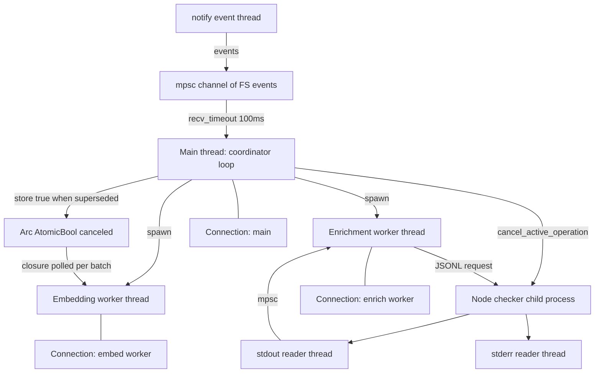
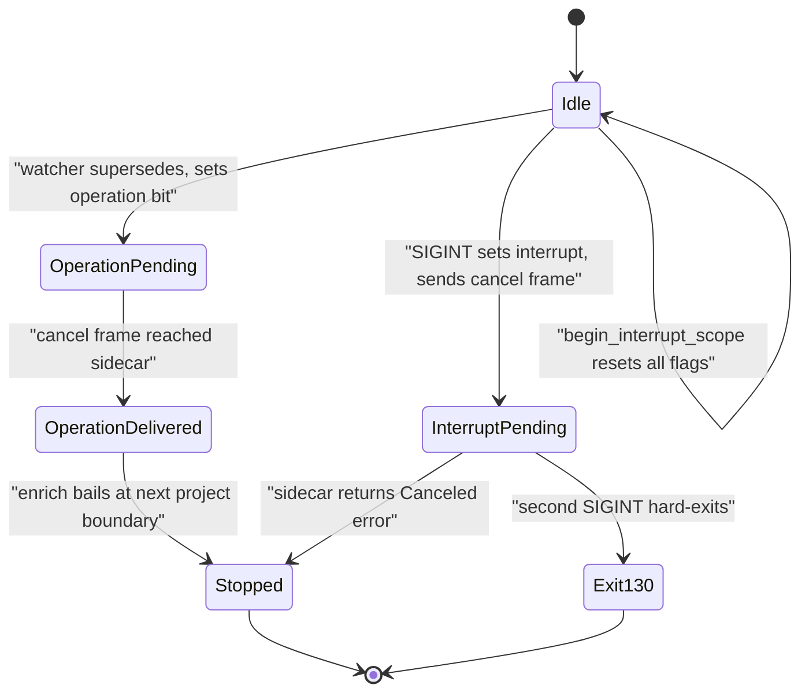
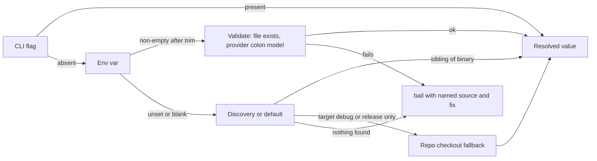

# Cross-cutting concerns

Some of jscout's most consequential decisions are not in any one module: how work is spread across threads (barely), how a Ctrl-C reaches into a Node child process, how a CLI flag beats an environment variable beats a discovered path, how every write is wrapped in a hand-rolled transaction, and what the codebase records about its own behaviour. This document collects those, with the source that implements them. Read it alongside [11-incremental-and-watch.md](11-incremental-and-watch.md) for the watcher's own state machine and [09-sidecars.md](09-sidecars.md) for the sidecar wire protocols; here the concern is the shared idioms those subsystems all use.

## Telemetry: two append-only JSONL streams

Only the MCP server emits telemetry. Nothing in the indexer, embedder, scouting, or watch paths writes a structured record. `serve()` resolves the sink as `--telemetry` flag, then `JSCOUT_TELEMETRY_FILE`, then disabled, and opens it once with `create(true).append(true)` (`src/mcp.rs:60-66`). A second, independent sink — `--request-log` — is opened the same way (`src/mcp.rs:68-76`).

| Stream | Opened at | Written by | One record per | Contains |
|---|---|---|---|---|
| Tool telemetry (`.jscout-telemetry.jsonl`) | `src/mcp.rs:60` | `log_tool_call` (`src/mcp.rs:1248`) | `tools/call` | counts, timings, snapshot id — no payloads |
| Request log | `src/mcp.rs:68` | `log_request` (`src/mcp.rs:190`) | every inbound JSON-RPC message | `method`, `tool`, and the full `arguments` object |

The design decision worth naming is that tool telemetry is **derived by re-parsing the response the tool already produced**, not by instrumenting internal code paths. `log_tool_call` receives `result: &Result<String>`, runs `serde_json::from_str` over the rendered text, and pulls counts out of the JSON: `definition_source_metrics` (`src/mcp.rs:1338`) sums `rendered_bytes`/`original_bytes` and counts budget truncations; `expansion_role_metrics` (`src/mcp.rs:1377`) walks either the object form `graph.nodes` or the array form `expansion.nodes` and buckets by role; `semantic_artifact_metrics` (`src/mcp.rs:1427`) tries three response shapes and buckets `freshness`. The upside is that zero call sites need instrumenting and telemetry can never diverge from what the agent actually saw. The downside is that every metric is coupled to response JSON layout — the three-shape fallback in `semantic_artifact_metrics` exists precisely because that layout drifted.

The record is counts only. The test `telemetry_counts_expansion_file_roles_without_recording_payloads` (`src/mcp.rs:2323`) asserts this for the expansion path. Each row also carries `snapshot`, taken from the response's own `snapshot` field or falling back to `structural::current_snapshot(conn)` (`src/mcp.rs:1265-1270`), which makes rows joinable against index state. Write failure is non-fatal: it prints `warning: failed to write jscout MCP telemetry` (`src/mcp.rs:1334`) and the request still returns normally.

Three environment variables let the eval harness relabel rows without changing behaviour: `JSCOUT_SESSION_ID` (default `pid-<pid>`), `JSCOUT_TASK_ID`, and `JSCOUT_PROFILE_LABEL`, which overrides the recorded `profile` while the true `ToolProfile` is still emitted separately as `tool_profile` (`src/mcp.rs:1301-1308`). Keeping both fields is what lets an eval arm be named freely without losing the ground truth of which tool set was served.

The request log is the opposite trade: it records `params.arguments` verbatim (`src/mcp.rs:214`), so it is a raw protocol trace and is *not* payload-free — which is why it is off by default behind its own flag. A third, unstructured channel exists: `JSCOUT_TIMING` prints per-stage `eprintln!("timing: …")` lines from the indexer, projection, embedder, and search (`src/indexer.rs:377`, `src/structural.rs:493`, `src/embed.rs:1452`, `src/search.rs:300`), and `JSCOUT_DEBUG` prints extraction diagnostics (`src/indexer.rs:272`). Neither is machine-readable.

## Threading: no async runtime, no data parallelism

`Cargo.toml` has no `tokio`, no `rayon`, no `futures`; HTTP is blocking `ureq 3.3.0`. Index, extraction, projection, embedding, and retrieval all run on one thread, sequentially. Threads exist in exactly three roles, all for I/O framing or cancellation, never for throughput.

| Threads | Where | Purpose | Communication |
|---|---|---|---|
| 2 per checker sidecar | `src/checker/process.rs:259`, `:274` | drain child stdout / stderr | `mpsc::Receiver<Result<Inbound, CheckerError>>` |
| 2 per gateway sidecar | `src/llm/process.rs:179`, `:196` | same | `mpsc` |
| 1 per watch session | `src/watch.rs:501` | receives OS filesystem events from `notify` | `mpsc::channel::<notify::Result<notify::Event>>` |
| 1 per optional watch phase | `src/watch.rs:813`, `:841` | run embedding or checker enrichment interruptibly | `JoinHandle` + `Arc<AtomicBool>` |

Writes to a sidecar go the other way, through a `Mutex<ChildStdin>` guarded by an `AtomicU64` counter, so request ids are `r1`, `r2`, … per process (`src/checker/process.rs:101-118`, `src/llm/process.rs:119-136`). The mutex is what makes the writer `Sync` so an interrupt handler on another thread can send a `cancel` frame while the main thread blocks on a read.

The diagram below shows which threads exist during a `jscout watch` run with embedding and enrichment enabled — note that no two of them share a `rusqlite::Connection`.



`MAIN` never blocks on `join`. Both `run_embedding_interruptible` (`src/watch.rs:802`) and `run_enrichment_interruptible` (`src/watch.rs:830`) spin on `while !worker.is_finished()`, calling `monitor.poll()` and sleeping `OPTIONAL_PHASE_POLL` (100 ms, `src/watch.rs:19`) each round. That keeps the coordinator draining filesystem events during a long phase, at the cost of up to 100 ms of latency on noticing completion and a busy-ish loop. `EMBW` and `ENRW` cancel by different mechanisms because only one of them is cancellable in-process: embedding gets the `CANCEL` flag as a closure passed into `embed::embed_missing_interruptible` (`src/watch.rs:818-820`), while enrichment is blocked inside a sidecar RPC and can only be stopped by reaching across into it (`src/watch.rs:861`). A panicking worker is downgraded to an ordinary `anyhow` error rather than propagating — `"embedding worker panicked"` (`src/watch.rs:827`), `"checker enrichment worker panicked"` (`:867`).

`DBM`, `DBE`, `DBN` are three separate connections opened by `open_phase_database` (`src/watch.rs:959`), each with a 5 s `busy_timeout`. Because a connection is never shared across threads, no `Send`/`Sync` wrapper around `rusqlite::Connection` exists anywhere in the tree. The cost is that concurrent phases contend for the WAL write lock instead of sharing a transaction.

## Signals and the two-stage interrupt

Both sidecar modules install a process-global `ctrlc` handler, guarded by `INTERRUPT_HANDLER: OnceLock<Result<(), String>>` so installation happens once per process and the failure is remembered (`src/checker/process.rs:145`, `src/llm/process.rs:69`). The handler shape is identical in both:

```rust
fn handle_interrupt() {
    if !request_interrupt_cancellation() {
        std::process::exit(INTERRUPTED_EXIT_CODE);   // 130
    }
}
```

First Ctrl-C sets a pending bit and sends a `cancel` frame naming the in-flight request id. A second Ctrl-C finds the bit already set, `request_interrupt_cancellation` returns `false`, and the process hard-exits 130 (`src/checker/process.rs:155-158`, `src/llm/process.rs:80-83`). The cancel target lives in `INTERRUPT_CONTROL: Mutex<Option<…Control>>`; deregistration compares `Arc::ptr_eq` on the writer (`src/checker/process.rs:220-227`, `src/llm/process.rs:108-117`) so an older sidecar tearing down cannot clear a newer sidecar's registration.

The two diverge in what pending state they keep, and the divergence is deliberate.

| | Gateway (`src/llm/process.rs`) | Checker (`src/checker/process.rs`) |
|---|---|---|
| Pending state | one `INTERRUPT_PENDING: AtomicBool` (`:29`) | `CancellationFlags { interrupt, operation, operation_delivered }` (`:24-68`) |
| Cleared by | `ActiveRequestGuard::drop` (RAII, `:149-157`) and on register/unregister | `begin_interrupt_scope()` per top-level operation (`:194`) |
| Non-SIGINT cancel | none | `cancel_active_operation()` (`:178`) |

The extra `operation` bit exists because the watcher needs to cancel a superseded enrichment generation *without impersonating operator SIGINT* — the comment at `src/checker/process.rs:175-177` says exactly this. If it reused the `interrupt` bit, a subsequent real Ctrl-C would see the bit already set and immediately hard-exit. The `operation` bit also does useful work when no sidecar request is in flight: `checker::enrich` checks `cancellation_pending()` at each project boundary and bails with `"checker enrichment interrupted; staged work retained"` (`src/checker/enrich.rs:339-341`), so a cancel between projects still stops the run and preserves resumable staging. `operation_delivered` prevents a repeated poll from re-sending the same cancel frame every 100 ms.



`InterruptPending` and `OperationPending` are separate states, which is why arriving in `OperationPending` never arms the second-Ctrl-C hard exit at `Exit130`. `Stopped` is reached from both, and the watcher distinguishes them after the fact by calling `checker::process::interrupt_pending()` to label the phase `interrupted` versus `canceled` versus `failed` in its stderr line (`src/watch.rs:715-727`).

## Configuration precedence

The rule is uniform and stated nowhere in one place: **CLI flag, then environment variable (only if non-empty after trim), then discovery or a compile-time default, then an actionable error.** `src/llm/config.rs` is the reference implementation.



The `VAL` node is where the two settings differ from a plain string read: `resolve_gateway` routes both the flag and the env value through `existing_file`, which names the source in the failure — `"--gateway-path does not name an existing gateway file: …"` or the same message with `JSCOUT_PI_AI_GATEWAY` (`src/llm/config.rs:127-136`). The `REPO` branch is narrowed on purpose: the development walk-up to a repo checkout fires only when the binary's own directory is literally `debug` or `release` beneath a `target` directory (`src/llm/config.rs:105-120`), with the comment "Installed binaries must not discover an unrelated gateway in an arbitrary parent directory." Failure at `ERR` produces a three-option remediation ending in "run `jscout llm doctor` after installing" (`:88-93`).

| Resolver | Order | Default / failure |
|---|---|---|
| `resolve_model` (`:46`) | `--model`, `JSCOUT_LLM_MODEL` | `openai-codex:gpt-5.6-terra`; must be `provider:model` with non-empty halves (`:29-41`) |
| `resolve_reasoning` (`:64`) | `--reasoning`, `JSCOUT_LLM_REASONING` | `None`, meaning *provider default* — not a value |
| `resolve_gateway` (`:77`) | `--gateway-path`, `JSCOUT_PI_AI_GATEWAY`, sibling `gateway/src/main.mjs` | three-option error |
| `resolve_node_for` (`:146`) | `JSCOUT_NODE`, then `node`/`node.exe` on `PATH` | error naming the sidecar the caller wanted, not always "the gateway" |
| `inference::base_url` (`src/inference.rs:9`) | `JSCOUT_INFERENCE_URL`, then `HOST`+`PORT`, then `http://127.0.0.1:8792` | no error path |

`resolve_model` splits into a pure `resolve_model_values(cli, configured)` (`src/llm/config.rs:51`) so precedence is unit-testable without mutating process environment; the other resolvers read `env::var` inline and are therefore harder to test in isolation. The precedence rule is also not perfectly uniform: `inference::base_url` accepts `JSCOUT_INFERENCE_URL` via `if let Ok(url)` with no emptiness check (`src/inference.rs:10`), so an exported-but-empty variable yields an empty base URL rather than falling through to the default.

Both gateway settings "name a file path, never a shell command string" (`src/llm/config.rs:74-76`) — there is no shell interpolation anywhere in sidecar launch; every child is spawned with an argv vector. `.env` is never auto-loaded: there is no `dotenv` dependency, and `.env.example:1` says so outright ("jscout reads process environment variables; it does not auto-load this file"). Twenty-five of the thirty-four `JSCOUT_*` variables are read by the Rust binary itself, split across embedding and rerank, sidecar paths, local inference, and observability; the rest are read only inside the gateway or the Python service. [13-build-config-ci.md](13-build-config-ci.md) carries the full inventory with defaults and consumers.

Credential selection has its own precedence quirk: `Provider::from_env` requires `JSCOUT_EMBED_PROVIDER` to be set explicitly — unset or `"none"` returns `Ok(None)` (`src/embed.rs:154-160`) — so an API key alone never silently enables embeddings. When an OpenAI-compatible provider points at a custom `JSCOUT_EMBED_URL`, the key comes from `JSCOUT_EMBED_KEY` instead of `OPENAI_API_KEY`, with the comment naming the failure it prevents: leaking an OpenAI secret to LM Studio, vLLM, a gateway, or a mistyped host (`src/embed.rs:199-209`).

## Transactions and connection policy

There are 25 `BEGIN IMMEDIATE` sites across 11 files and **zero** uses of `Connection::transaction()` or `unchecked_transaction()`. The shape is always the same, with `src/indexer.rs:454-476` as the canonical instance: `BEGIN IMMEDIATE`, an immediately-invoked closure returning `Result<()>` so `?` is usable inside, then a `match` that commits on `Ok` and does a best-effort `ROLLBACK` on `Err` before returning the error. The closure is doing the job `Transaction`'s `Drop` would do, written out by hand. `BEGIN IMMEDIATE` rather than `DEFERRED` takes the write lock up front, which matters because `jscout watch` and an MCP session routinely hold the same WAL database open at once. Nested scopes use named savepoints instead — `SAVEPOINT jscout_vector_sync` (`src/embed.rs:1100`), `jscout_vector_materialize` (`:1220`), `jscout_semantic_vector_sync` (`:983`).

Connection policy is split by intent. Writers set `journal_mode=WAL`, `synchronous=NORMAL`, `foreign_keys=ON` (`src/store.rs:144-146`). Readers open with `SQLITE_OPEN_READ_ONLY` and additionally set `query_only=ON` and `foreign_keys=ON` (`src/store.rs:62-64`), then refuse to proceed unless the schema version matches exactly and `meta.snapshot` and `meta.projection_version` both exist (`src/store.rs:77-99`) — an unindexed checkout gets `"index database … has no published structural snapshot; run `jscout index`"` rather than empty results. The MCP server exploits the split: it holds one read-only connection for the whole session and opens a writer only when the single write-capable tool `annotate` is actually invoked, with the comment "Keep schema writes and writer locks out of every retrieval-only MCP session" (`src/mcp.rs:129-137`).

## Caching layers and the version lattice

Seven independent version constants each invalidate a different plane, and no module owns the set.

| Constant | Value | Location | Invalidates |
|---|---|---|---|
| `SCHEMA_VERSION` | `"23"` | `src/store.rs:8` | the whole database; hard gate on open |
| `EXTRACTION_VERSION` | `"5"` | `src/entity.rs:14` | all per-file extraction |
| `PROJECTION_VERSION` | `"11"` | `src/structural.rs:12` | the projected graph, via the snapshot digest |
| `PROMPT_VERSION` | `card-scout/v1`, `workflow-scout/v1`, `repository-recon/v2`, `summary-scout/v1`, `concept-scout/v1` | `src/scouting/{card,workflow,repository,summary,concept}.rs` | one artifact kind each |
| `NORMALIZER_VERSION` | `"concept-normalizer/nfkc-lower-ws-v1"` | `src/scouting/concept.rs:23` | concept alias clustering |
| `PROTOCOL_VERSION` | `2` checker, `1` gateway | `src/checker/protocol.rs:3`, `src/llm/protocol.rs:8` | wire compatibility |
| `SIDECAR_VERSION` | `"0.2.0"` | `checker/src/main.mjs:17` | sidecar identity in `hello` |

`EXTRACTION_VERSION` fires through `ensure_extraction_version` (`src/indexer.rs:443`): on mismatch it runs `UPDATE files SET hash=''`, deletes `resolved_edges` and `graph_nodes`, and drops `meta.snapshot` and `meta.projection_version` inside one `BEGIN IMMEDIATE`. Blanking the hash is the whole trick — the next pass sees every file as changed and re-extracts. `PROJECTION_VERSION` is mixed directly into the snapshot digest (`src/structural.rs:394`), which is a `blake3` over the domain-separated literal `b"jscout-structural-snapshot-v2\0"`, the version, and a per-file tuple of path, hash, role, origin, package path and the package instance's origin/name/version/locator/manifest hash/status, ordered by path (`src/structural.rs:392-403`). Bumping the version therefore changes every snapshot id, and every snapshot-keyed cache misses.

Caching sits in four layers with different lifetimes. Embeddings are content-addressed: `embeddings` is keyed `(chunk_hash, profile_id)` so identical chunks in different files share one vector, while `embedding_index_entries` materializes each *current* occurrence for `sqlite-vec` (`src/store.rs:476-500`); `semantic_embeddings` is the same idea in a separate document namespace so unchanged cards and summaries reuse vectors across snapshots. The cache refuses to be ambiguous: if one chunk hash maps to more than one content it bails with "refusing to cache an ambiguous embedding" (`src/embed.rs:618-622`). Checker enrichment batches survive a full refresh when the snapshot still matches (`retain_checker_batches_for_snapshot`, `src/indexer.rs:350`) because they are expensive and exactly reproducible. Module resolution uses an in-memory `HashMap<(PathBuf, String), Resolved>` for one indexing pass (`src/indexer.rs:969`), and `prepare_cached` backs every hot insert.

The skip decision that ties the layers together is `ProjectionIdentity { snapshot, projection_version, resolution_hash }` (`src/indexer.rs:352-356`), compared against the stored triple. Two hashes are needed rather than one because, as the comment at `src/indexer.rs:360-367` states, the snapshot covers extracted file content while `resolution_hash` covers module edges whose inputs — tsconfigs, manifests, `node_modules` layout — live outside indexed content and are never files the walker sees.

## Byte budgets and resource limits

Two distinct budgeting mechanisms exist. `render_bounded_object_arrays` (`src/mcp.rs:1183`) sheds whole items, and its subtlety is that the `response_budget` object sits *inside* the payload being measured, so writing `rendered_bytes` changes `rendered_bytes`. `settle_value_rendered_bytes` (`src/mcp.rs:1237`) iterates to a fixed point bounded at 8 rounds, returning the current length if it has not converged — an accepted approximation, not a proof. The shed loop pops one item off the tail of each listed field per round, sets `truncated: true`, recomputes `omitted_items`, and if nothing can be popped while the envelope still exceeds the limit it fails with the measured minimum (`src/mcp.rs:1215-1220`). Separately, `fit_text_budget` (`src/scout.rs:185`) truncates source by reserving the marker length, walking `cut` backwards to a UTF-8 `char_boundary`, and appending `"\n/* … jscout source response truncated to byte budget … */"` — a valid JS comment, so truncated source stays syntactically plausible to whatever reads it.

Every module declares its caps as named `const`s near the top of the file rather than inlining magic numbers.

| Area | Constants |
|---|---|
| Response budgets | `DEFAULT_RESPONSE_BYTE_LIMIT` 24 000 (`src/search.rs:10`, duplicated in `src/semantic_query.rs`), `DEFAULT_SOURCE_BYTE_LIMIT` 12 000 (`src/scout.rs:12`) |
| Sidecar batching | `MAX_BATCH_ITEMS` 128, `MAX_REQUEST_BYTES` 1 MB (`src/checker/enrich.rs:1317-1318`) |
| Wire framing | `MAX_LINE_BYTES` 16 MB gateway (`gateway/src/protocol.mjs:9`) vs 4 MB checker (`checker/src/protocol.mjs:4`) |
| Process | `HELLO_TIMEOUT` 30 s (`src/checker/process.rs:17`, `src/llm/process.rs:23`), `SHUTDOWN_GRACE` 500 ms (`src/checker/process.rs:18`), `INTERRUPTED_EXIT_CODE` 130 |
| Embedding | `DEFAULT_LOCAL_DEADLINE_MS` 120 000 (`src/embed.rs:6`) |
| Watcher | `DEFAULT_BUSY_TIMEOUT` 5 s, retry 500 ms → 30 s, `OPTIONAL_PHASE_POLL` 100 ms, `STABLE_FAILURE_THRESHOLD` 3 (`src/watch.rs:16-20`) |

The line-overflow policy is stated once, in the gateway framing header, and applies to both sidecars: an over-length line "is unrecoverable corruption: the reader cannot know where the next message begins, so the process reports and exits instead of resynchronizing" (`gateway/src/protocol.mjs:3-6`). The 4× difference between the two limits is unexplained in source; the checker's traffic is member-resolution batches already capped at 1 MB, so its lower ceiling is at least consistent with its own batching.

## Error handling conventions

`anyhow::Result` is used in every module. The tree contains 366 `bail!`, **0** `ensure!`, 62 `.context()`, 57 `.with_context()`, and no `thiserror` dependency. Typed errors exist in exactly two places, both sidecar boundaries where the caller must match on failure kind rather than print it: `CheckerError` with `Spawn/Protocol/Io/ChildExited/Timeout/Canceled/Remote{code,message}` (`src/checker/process.rs:71-95`) and `GatewayError` (`src/llm/mod.rs`), both with hand-written `Display` and `std::error::Error` impls. `Canceled` is the variant that makes the watcher's supersession path distinguishable from a genuine failure (`src/checker/enrich.rs:445`).

Error messages follow a house style: state the fact, then the fix, in one sentence. `"index database `{}` uses schema v{version}, but this jscout requires v{SCHEMA_VERSION}; run `jscout index`"` (`src/store.rs:78-81`); `"node not found on PATH: install Node >= 22.19.0 or set JSCOUT_NODE; {sidecar} is a Node sidecar and cannot run without it"` (`src/llm/config.rs:167-170`); `"checker enrichment interrupted; staged work retained"` (`src/checker/enrich.rs:340`). Context strings are lowercase verb phrases — `"open telemetry file {}"`, `"open index database {} read-only"` — so they read correctly when anyhow chains them.

Panics are confined to a small, enumerable set of sites. Of 51 `.unwrap()` occurrences, five sit outside `#[cfg(test)] mod tests`, all in `src/structural.rs` and all on `confidence_rank`. Four are `confidence_rank("likely").unwrap()` on a literal the same file's match arm defines (`:2656, 2741, 2818, 2901`) and are provably total. The fifth, `confidence_rank(&options.min_confidence).unwrap()` at `:2408`, is total only because `:2388` already returned an error when the same call is `is_none()` — safe, but the guarantee lives twenty lines away rather than in the type. `.expect()` (245 occurrences) is essentially test-only, with the exception of `child.stdout.take().expect("piped stdout")` immediately after configuring `Stdio::piped()` (`src/checker/process.rs:256-257`). Panics that genuinely can occur are converted at thread boundaries into `anyhow` errors.

The gateway sidecar adds output redaction the Rust side does not have: `sanitizeErrorMessage` (`gateway/src/protocol.mjs:58`) runs four passes over every outbound error — bearer/basic tokens, `api_key`/`access_token`/`password`/`secret` assignments, a token-shape regex covering `sk-`/`gh?_`/`github_pat_`/`xox?-`/`AIza`, and every URL through `sanitizeUrl` (`:76`) — then truncates to 2000 bytes. Its own header comment declines to overclaim: "truncation alone is not redaction" (`:91-92`). The checker sidecar has no redaction code, which is coherent rather than an oversight — it never receives credentials.

## Codebase conventions

jscout is a binary crate with no `lib.rs`, no `[lib]` section, and no `tests/` directory. `src/main.rs:3-34` declares 32 flat modules in alphabetical order; only `checker`, `llm`, and `scouting` are directories. `#![recursion_limit = "256"]` at `src/main.rs:1` is needed for the depth of the `clap` derive. Because there is no library target, no API is externally consumable and the CLI and MCP server are the only entry points — which is why refactors can move types between modules freely, and why nothing in the tree is versioned as a public interface.

Tests are colocated in `#[cfg(test)] mod tests` at the bottom of each file; `src/main.rs:2132` uses `mod main_tests`, the sole naming exception. The ratio is roughly 29 000 test lines against 28 800 production lines — just over half the tree is tests — and `tempfile` is the only dev-dependency, so every test needing a database builds a real SQLite file. Seven files carry no tests: `src/graph.rs`, `src/heur.rs`, `src/query.rs`, `src/walk.rs`, `src/checker/mod.rs`, `src/llm/mod.rs`, `src/scouting/workflow.rs`. Most are visitors or thin façades exercised through their callers, but `query.rs` (646 lines of export-chain resolution) and `scouting/workflow.rs` (448 lines) are genuine untested surface. Test names are full sentences asserting behaviour — `read_only_open_never_creates_or_migrates_an_index`, `defaults_exclude_dependencies_and_reject_empty_allowlists` (`src/origin.rs:30`).

Comments carry reasoning, not mechanics: 24 of 48 Rust files open with a `//!` header, and inline comments name the failure they prevent rather than restating the code. `src/package_exports.rs:3-5` records that "declaration order in a condition object is semantically significant", which is why `serde_json`'s `preserve_order` feature (`Cargo.toml:24`) is load-bearing for correctness rather than cosmetic. The gateway sidecar writes Rust-style `///` doc comments in JavaScript — 29 across its five files, zero JSDoc `/**` blocks; the checker sidecar uses neither.

String enums are hand-rolled with `parse(&str) -> Result<Self>` plus `as_str() -> &'static str`, never `serde` derive, because the same strings are both persisted in SQLite and emitted in JSON responses — `ToolProfile` (`src/mcp.rs:23-38`) and `scout::SourceView` (`src/scout.rs:15-35`). Pure validators follow the same shape without a type: `origin::{ALL, DEFAULT, validate_all}` (`src/origin.rs:3-23`), whose default allowlist is `["repository", "workspace"]` — dependency files stay out of retrieval unless a caller asks for them.

One environmental trap worth knowing when reading this tree: `.claude/worktrees/` and `.codex/worktrees/` hold full stale checkouts at older commits. They are excluded via `.git/info/exclude` rather than `.gitignore`, so `git status` is clean but a repo-wide `grep -r` or `find` roughly doubles every match count against files that are not the current source.
