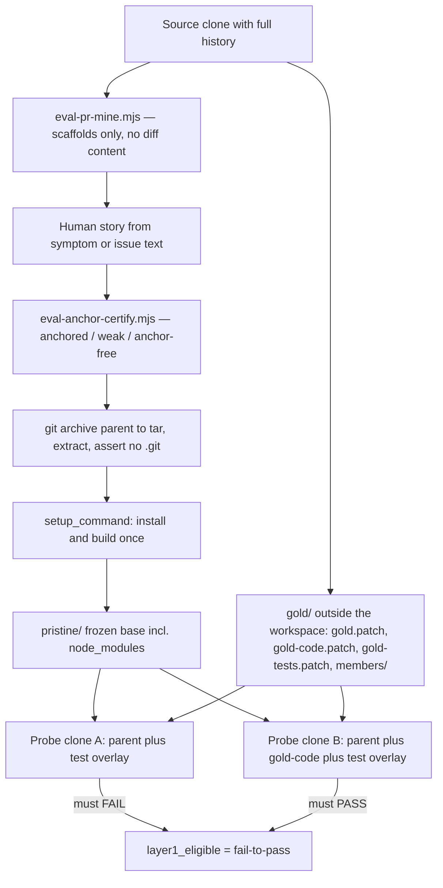
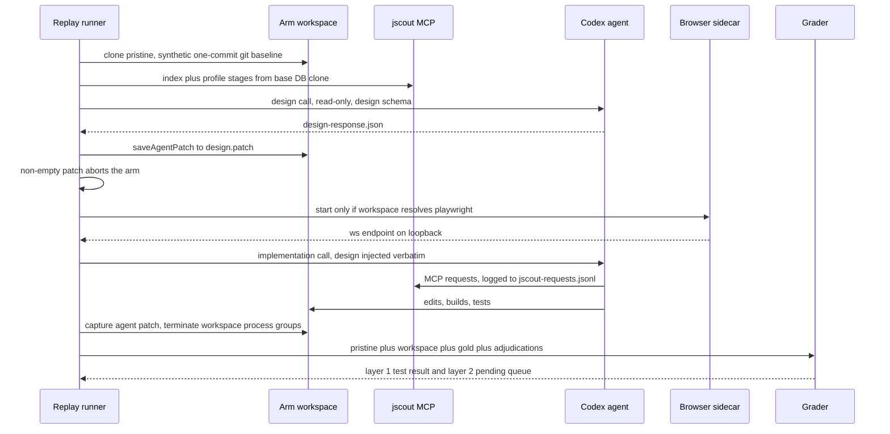

# Evaluation harness and methodology

jscout ships with an experiment program, not a benchmark score. `eval/` holds task sets, pre-registrations, JSON response schemas, protocol documents, and 35 dated result write-ups; `scripts/eval-*.mjs` holds 24 executable stages (plus 18 `node:test` files) that mine change candidates out of a real repository's history, certify that the prompt does not leak a lexical handle into the answer, prove the model cannot answer from memory, export a history-free workspace, run a Codex agent inside it with and without jscout mounted as an MCP server, apply the real project's own tests, and adjudicate every gold file the agent did not touch before any rate is computed. The whole apparatus exists because the naive measurement — "does the agent find the right file faster with an index" — is dominated by grep on tasks whose prompt contains an identifier, and by training-set recall on tasks whose code predates the model cutoff. Almost every mechanism below is a control for one of those two confounds.

## Arms, profiles, and treatments

Two runners exist because two question shapes need different sandboxes. `scripts/eval-run-codex.mjs` is the read-only localization runner: it launches Codex with `--sandbox read-only`, disables multi-agent, apps, browser use, computer use, plugins, and web search through explicit `--config` flags (`scripts/eval-run-codex.mjs:184-197`), and passes `--ignore-user-config` unless `--load-user-config true` (`:199`) so the operator's own Codex profile cannot leak into an arm. `scripts/eval-run-replay.mjs` is the write-sandbox implementation runner, 1,647 lines, which additionally exports a workspace, installs dependencies, indexes per arm, and grades a patch.

The localization arms are `grep` (no jscout MCP server at all), `baseline` (indexed search/definition/usage tools, no `neighborhood`, no search expansion), and `structural` (the same tools plus `neighborhood` and opt-in expansion) — `eval/README.md:5-10`. The replay runner instead varies how much of the jscout pipeline was actually run against the workspace before the agent starts, expressed as a stage plan:

| Profile | Preparation stages (`scripts/eval-run-replay.mjs:379-401`) | Base it clones from (`:403-410`) |
|---|---|---|
| `grep` | none; no MCP server | — |
| `structural` | parse/index only | — |
| `checker` | `enrich` | `structural` |
| `checker-embed` | `enrich`, `embed` | `checker` |
| `checker-scout` | `enrich`, `scout` | `checker` |
| `checker-scout-embed` | `enrich`, `scout`, `embed-product` | `checker-scout` |
| `production-order` | `scout`, `enrich`, `embed-product` | none, deliberately |
| `memory` | `enrich`, `scout`, `workflows`, `cards`, `summaries` | `checker-scout` |
| `memory-embed` | the above plus `embed-product` and `embed-semantic` | `checker-scout-embed` |

The `PROFILE_BASES`/`PROFILE_INCREMENT` pair (`:403-419`) exists so a five-profile matrix does not re-run enrichment and scouting five times: each profile copies its base's prepared database and applies only its increment. `production-order` opts out of that (`:386-389`) with a comment stating why — it runs reconnaissance before enrichment, so a corpus built by cloning an additive profile would carry state that the production ordering would never have produced.

Orthogonal to profile is the *treatment*, which controls what the agent is told. `skill` installs the shipped project-local skill and says nothing further; `forced` requires jscout for repository-wide discovery while still permitting direct reads of localized files, edits, builds, and tests (`:1049-1084`). Both are validated at `:1127-1134`, and a `grep` arm is always a single `control` treatment (`:1199`). The two jscout treatments reuse a copy-on-write clone of the same prepared database, so embeddings and scout generations cannot vary between them. Profile order is counterbalanced by task index (`:1196`), which is a weak control — it alternates rather than randomizes — but it prevents a systematic position effect.

## Task admission: three gates before a model sees the prompt

**Anchor certification.** `scripts/eval-anchor-certify.mjs` tokenizes the prompt, splits tokens into identifier-like (camelCase, PascalCase, snake_case, dotted or path-like, mixed alphanumeric, or quoted) and plain content words, then whole-token-searches each against the gold file contents. A task is `anchored` if any identifier hits, `weak` if only prose words hit, `anchor-free` if nothing hits (`scripts/eval-anchor-certify.mjs:74-93`). The header states the motivation plainly: post-cutoff mining selects tasks around newly introduced symbols, which guarantees a greppable handle, so a suite built that way cannot measure what structural retrieval adds. `--require anchor-free` is the gate for graph-discriminating suites; `eval/README.md:177-180` records that the 2026-08-09 Twenty pilot tasks all certify only `weak`.

**Contamination probing.** For post-cutoff repositories, `scripts/eval-contamination-probe.mjs` re-runs the same execution model in an empty workspace with no repository and no tools, under the same `features.*=false` / `tools.web_search=false` lockdown (`:180-187`). The no-tool rule is then *verified* rather than trusted: `toolKinds` (`:93`) walks the Codex JSONL event stream for any of eight item types — `command_execution`, `mcp_tool_call`, `web_search_call`, `file_change`, and four more (`:10-19`) — and `classifyProbe` (`:110-113`) returns `invalid` if the run errored or used a tool, `contaminated` if file recall is 1.0, and `review` on any partial file or symbol overlap. Only `clean` sets `admitted: true` (`:229`). Partial overlap is explicitly *not* auto-admitted.

**Fail-to-pass.** For implementation tasks, `scripts/eval-pr-snapshot.mjs` clones the prepared parent twice, overlays the exact post-change test files onto the first, and requires the test command to FAIL there; if it passes, the task is `rejected` with the reason "reference tests pass on the parent; they do not encode the new behavior" (`:211`). It then applies the gold *code-only* patch to the second clone, overlays the same tests, and requires a pass. Only that combination sets `layer1_eligible` (`:227`, `:257`). Exact file overlay is used rather than `git apply` because an agent may legitimately edit the same public test file, which would make a patch application conflict rather than a measurement.

A fourth gate applies only to the two-session memory suite: `scripts/eval-memory-transfer-probe.mjs` rejects a session-2 task whose gold files and symbols can be produced from session 1's final answer text by a no-repository, no-tools model call (`eval/protocols/two-session-memory.md:44-48`). Memory helping through retrieved evidence is the product; memory helping by copying an answer key is a broken task.

## Isolation: `git archive`, not a checkout

The single most load-bearing decision in the replay harness is that the agent workspace is a `git archive` tar export of the parent commit, extracted into an empty directory, with an assertion that no `.git` survived (`scripts/eval-pr-snapshot.mjs:126-131`). The header comment gives the reason: a parent *checkout* still holds the real commit in its object store, one `git log` away from the answer key (`:5-8`). The setup command runs inside that tree and is re-checked for having introduced a `.git` (`:151`), because `pnpm install` in a monorepo can and does create one. All gold material — full patch, code-only patch, test-only patch, per-member patches, `task.json` — goes to a separate directory that `assertDisjoint` (`:59-67`) refuses to nest inside the workspace in either direction.

Arc mode is the second half of that isolation. The task unit is a *change arc*: a seed commit plus every semantically related follow-up until the feature stabilized. Diffing the arc's first parent against its last member on a busy repository would sweep in every unrelated interleaved commit, so `--members <sha,...>` builds `arcScope` from each member's own diff and restricts the gold diff to that path set (`:109-122`, `:156-162`), with per-member patches written to `gold/members/` as adjudication provenance (`:164-172`).

The first diagram shows the preparation pipeline for one task; look for where the two throwaway probe clones branch off, and note that the gold bundle never touches the workspace path.

`MINE` deliberately emits scaffolds without diff content so the story author is never staring at the answer (`eval/README.md:393-395`). `CERT` runs against `GOLD`, not against the workspace. `PRIS` is what every execution arm clones — copy-on-write where the filesystem supports it, because a prepared Next.js tree is gigabytes and every arm needs its own.

## Pre-registration

`eval/prereg/` holds five dated documents that fix the expected effect before implementation. `eval/prereg/file-roles-2026-08-09.md` is the template: it names the change under test, quotes the motivating measurement (structural retrieval's only statistically stable effect in the 72-run suite was harm — "+6.38 irrelevant inspected files vs grep, 95% CI [+1.00, +12.38]"), registers a primary success threshold, lists three secondary invalidation conditions, states explicitly what is *not* expected ("a correctness gain (the suite is at ceiling)"), and pre-commits the consequences of failure so they cannot be re-litigated afterward — including that one post-hoc-informed revision may be re-registered, and a second failure closes L1 retrieval investment entirely. `eval/prereg/arc-replay-2026-08-09.md` registers minimum interesting effects for the arc suite (15 absolute points on the pooled confirmed-omission rate) and pre-labels the multi-commit missed-edge-case outcome as directional-not-powered so it cannot be upgraded later. `eval/README.md:191-192` makes registration mandatory: a retrieval change re-runs a recorded suite only with a document in `eval/prereg/`.

## Grading layers and blind adjudication

`scripts/eval-pr-grade.mjs` grades in two layers with different epistemics. Layer 1 applies the admitted fail-to-pass test patch to the agent's workspace and runs the project's own test command — a mechanical pass/fail. Layer 2 exists because the real merged patch is one valid implementation, not the mandatory affected set. Every gold code file the agent did not patch becomes a *pending* row, and `scoreCoverage` (`:74-115`) leaves `confirmed_omission_rate` at `null` while any row is pending (`:90-91`). Rates cannot be computed by ignoring the queue.

`patched` (files actually changed on disk, via a content-hash tree diff at `:43-57`) and `plan_mentioned` (files the answer claims to have considered) are reported separately and never blended, with the stated reason that blending them makes recall gameable by narrating (`:14-16`).

The adjudication rubric (`eval/protocols/adjudication-rubric.md`) is unusually explicit about its own conflict of interest. The judge is Claude, registered before any guided-session output existed, and the document states outright that this judge is not neutral because it authored both the tool under evaluation and the eval program. The controls are: every verdict row cites evidence and is invalid without it; "could plausibly be fine" is not evidence for `alternative_covered`; and an asymmetric default — **when uncertain between `omission` and either other verdict, rule `omission`** — so all uncertainty resolves against the tool author's interest. Live observation of a session is recorded as a blindness failure on every result that used it. For multi-commit arcs there is a second verdict axis over follow-up member hunks (`covered` / `missed`, same asymmetric default), and the comparison line is stated frankly: the human's own first attempt scored `missed` on all of its follow-up content by construction.

Six response and verdict shapes are pinned as JSON Schemas with `additionalProperties: false`, so a malformed structured output is a run failure rather than a silently missing field:

| Schema | Required fields | Consumer |
|---|---|---|
| `eval/agent-response.schema.json` | `answer`, `files`, `symbols`, `inspected_files` | localization runs |
| `eval/design-response.schema.json` | `mechanism`, `constraints`, `implementation_plan`, `files`, `symbols`, `validation_plan`, `uncertainties` | two-phase design call |
| `eval/contamination-probe.schema.json` | `answer`, `files`, `symbols`, `confidence` in `known\|partial\|guess\|unknown` | contamination probe |
| `eval/adjudication-response.schema.json` | `verdict` in `correct\|acceptable_alternative\|incorrect`, `reason`, boundary lists | exact-set disagreements |
| `eval/pr-omission-adjudication.schema.json` | per-file `omission\|alternative_covered\|not_required` plus an overall verdict | layer 2 |
| `eval/memory-staleness-adjudication.schema.json` | `stale_reverified`, `reason` | staleness sub-arm |

## Pooling discipline

`scripts/eval-pooled-report.mjs` refuses to pool responses from different `model/reasoning` combinations unless `--allow-cross-model true` is passed and the result is labelled (`:130-140`), with the comment that pooling across models silently blends incomparable cost and behavior distributions. Intervals are task-clustered bootstrap: `clusterBootstrapMean` (`:102-119`) resamples whole task clusters with replacement, 10,000 iterations, seeded `20260808` by default (`:22`), and reports the 2.5th and 97.5th percentiles — clustering by task because trials within a task are not independent. `scripts/eval-report.mjs:103-109` adds a second refusal: single-phase and two-phase responses cannot be pooled in one report.

The MCP result transport is treated as an execution treatment in its own right. Because `auto` selects structured results for verified Codex clients and text results for Claude and unknown clients, cross-client comparisons must either force `mcp.result_transport` in repository configuration or stratify by the telemetry fields `mcp_client_name`, `mcp_client_version`, and `mcp_result_transport`; otherwise a client-visible byte comparison is confounded by transport as well as model (`eval/README.md:184-192`). See [11-mcp-surface.md](11-mcp-surface.md) for the transport itself and [12-configuration.md](12-configuration.md) for where that key lives.

## One replay arm, end to end

The second diagram traces a single (task × profile × treatment × trial) arm. Watch the order: the design phase runs and is proven non-mutating *before* the browser sidecar starts, and the gold bundle enters only at grading.

The two-phase workflow (`--workflow design-implement`, validated at `scripts/eval-run-replay.mjs:1136-1137`) exists for complex implementation tasks where a single call conflates "did it understand the system" with "did it write the code". The runner dispatches a read-only design call, validates the structured response against `eval/design-response.schema.json`, saves the workspace patch, and sets `designError` to "design phase modified the source snapshot" if that patch is non-empty (`:1391-1395`). Any failed, invalid, timed-out, or mutating design phase prevents implementation for that arm and skips grading. The design is then injected verbatim into the normal implementation prompt (`:896-908`), and the run directory retains `design-prompt.txt`, `design-response.json`, `design-events.jsonl`, `design.patch`, and matching implementation files with per-phase token, command, duration, and jscout-request counts. `eval/README.md:502-504` is careful to say what this is not: harness orchestration, not a jscout design-memory product surface.

The browser sidecar is capability-aware as of `d6c3014`. Chromium cannot launch inside Codex's seatbelt sandbox (no mach-register), so a Playwright browser server runs *outside* it and the workspace's own e2e harness connects over a loopback WebSocket endpoint that Next.js natively supports (`scripts/eval-run-replay.mjs:667-670`). `resolveBrowserServerPolicy` (`:606-612`) reads `browser_server` from task then suite, defaulting to `auto`; `browserServerCapability` (`:614-639`) builds a `createRequire` rooted at the workspace's own `package.json` and tries to resolve `playwright` from there. `auto` starts the sidecar only on success, `required` throws when Playwright is absent, `disabled` never starts it. Resolving from the workspace rather than the runner is the fix's substance — before it, a suite without Playwright in its prepared tree either failed opaquely or started a sidecar bound to the wrong module. Every arm records the decision in `browser-server.json` (`:1625-1626`). Suites additionally declare an `execution_environment` map of string variables validated at `:595-603` and forwarded identically to setup, agent, jscout preparation, and grading; `eval/tasks/next-calibration.json` and `eval/tasks/next-stale-dev-cache.json` both set `WATCHPACK_POLLING=250` because native Watchpack watchers exhaust the sandbox's descriptor allowance.

## Result index

| Date | File | Subject |
|---|---|---|
| 2026-08-07 | `ai-pipe-p0-2026-08-07.md` | first representative-repository P0 localization run |
| 2026-08-07 | `ai-pipe-sc1-2026-08-07.md` | SC-1 source-compression gate; kept full source as default |
| 2026-08-07 | `ai-pipe-discriminating-2026-08-07.md` | harder three-arm task set |
| 2026-08-09 | `n8n-twenty-post-cutoff-2026-08-09.md` | three-seed post-cutoff suite; source of the irrelevant-reads finding |
| 2026-08-09 | `file-roles-rerun-2026-08-09.md` | the pre-registered file-roles re-run |
| 2026-08-09 | `twenty-memory-gate-2026-08-09.md` | SC-2a two-session workflow-memory gate |
| 2026-08-09 | `twenty-memory-budget-replay-2026-08-09.md` | first fixed-snapshot memory replay |
| 2026-08-09 | `twenty-workflow-candidate-gate-2026-08-09.md` | failed Stage A, resolver diagnosis, repair rerun |
| 2026-08-09 | `workflow-scope-preflight-2026-08-09.md` | preflight that blocked a full treatment run |
| 2026-08-09 | `guided-sessions-2026-08-09.md` | guided arcs; per-session grades under `results/guided-sessions/` |
| 2026-08-10 | `runtime-boundary-entities`, `contract-plane`(+`-followups`), `general-entities`(+`-followups`), `agent-surfaces`(+`-followups`), `workflow-logical-routing`(+`-followups`), `dependency-indexing`, `workspace-resolution-edges` | eleven implementation-and-regression checks |
| 2026-08-14 | `affine-reranker-context-2026-08-14.md`, `next-calibration-live-headers-2026-08-14.md` | reranker smoke; first Next.js PR-replay calibration |
| 2026-08-15 | `next-stale-development-cache-2026-08-15.{md,json}` | stale-dev-cache replay matrix with machine-readable grades |
| 2026-08-15 | `next-optimistic-prefetch-2026-08-15.md` | largest replay write-up; 39 blind-adjudicated arms |
| 2026-08-17 / 08-18 | `next-root-params-types`, `next-root-layout-param-types`, `next-g17-g18-real-corpus` | feature replays and G17/G18 real-corpus validation |
| 2026-08-19 / 08-20 | `workflow-architecture-inquiry`, `targets-queue-problem-investigation`, `retrieval-cross-trace-synthesis`, `mcp-telemetry-first-window` | production call traces and the first measured telemetry window |
| 2026-08-21 | `g20b-mcp-structured-content`, `g20b-n8n-path-transport-proxy`, `g20b-next-full-posture` | structured-content transport compatibility checks |

Eight machine-readable companions sit alongside: adjudication and contamination JSONL from 2026-08-09, transfer certificates, and the registered expansion-role backfill baseline.

## Limits the harness does not hide, and one it does not state

Four caveats are recorded in the harness itself. Network access stays enabled in replay runs because Next.js dev tests need loopback and Codex's macOS no-network sandbox blocks loopback too; the policy object `REPLAY_EXECUTION_POLICY` (`scripts/eval-run-replay.mjs:29-33`) records this as `prompt-restricted-external; loopback-required` — external access is prompt-restricted and auditable, not technically isolated. Navigation metrics inherit an instrumentation caveat: self-reported `inspected_files` must be audited against Codex event artifacts before any registered claim. Layer 1 is deferred for the older pilots whose task files declare no setup command. And `eval/README.md:11-13` says the bundled `eval/fixtures/structural` fixture validates the protocol and "is not evidence that jscout improves behavior on a large real repository"; `eval/tasks/ai-pipe-replay-pilot.json` carries the same disclaimer because ai-pipe is mostly AI-generated code.

The unstated gap is CI coverage. The root `package.json:9` `test` script hand-enumerates 20 `.test.mjs` paths — 18 of them the eval scripts' own tests — and no workflow invokes it: `.github/workflows/ci.yml` runs the Rust suite, the two sidecar suites, `bench/perf/perf.test.mjs`, and the release-package gate, with no reference to `scripts/eval-*` anywhere (see [15-build-config-ci.md](15-build-config-ci.md)). The 18 test files exist and are current, but a regression in the grader, the anchor certifier, or the contamination classifier merges silently. Given that these scripts are the only thing standing between a pre-registration and a wrong number, that is the sharpest edge in this subsystem; it is also the cheapest to close, since the script already exists and needs one job entry.

Related reading: [13-incremental-and-watch.md](13-incremental-and-watch.md) for the indexing paths the profiles drive, [08-scouting.md](08-scouting.md) for the `scout`/`workflows`/`cards`/`summaries` stages, and [19-sharp-edges.md](19-sharp-edges.md) for the broader gap list.
