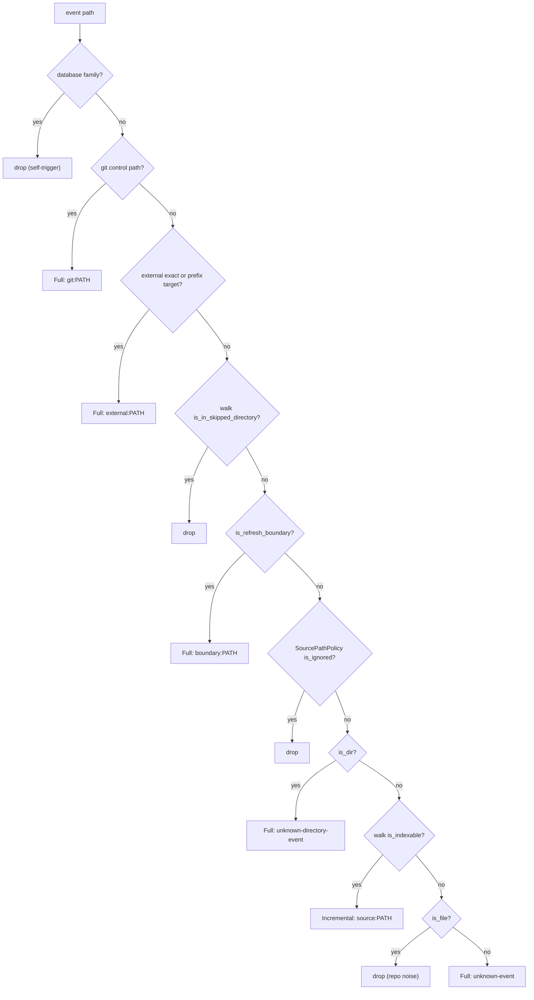
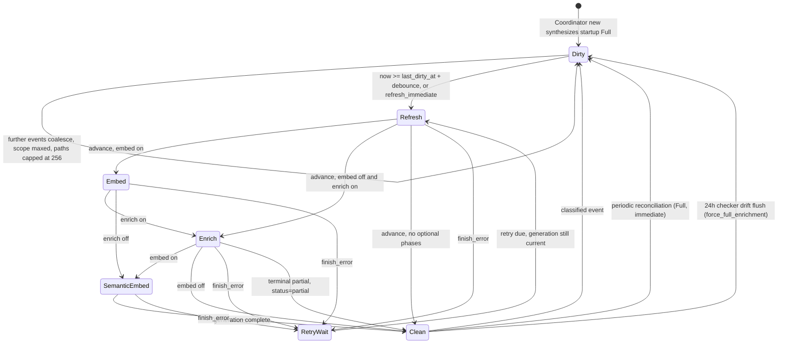
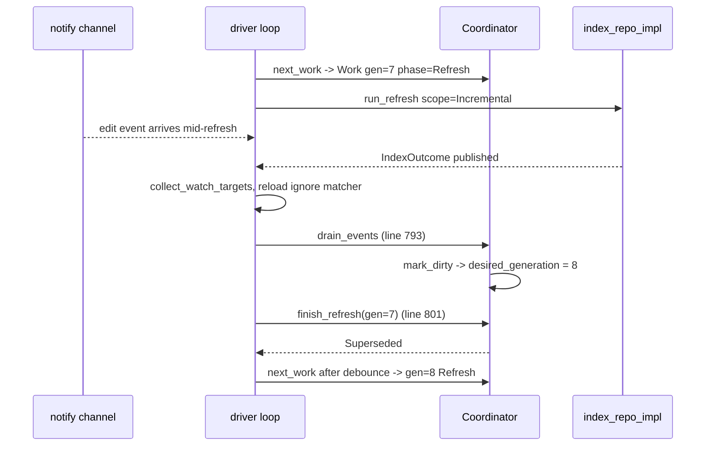

# Incremental indexing and the file watcher

`jscout watch` turns raw `notify` events into a monotonically numbered sequence of *generations*. Each generation begins with a structural refresh — incremental or full — and optionally chains code embedding, checker enrichment, and semantic embedding onto the snapshot that refresh published. The scheduling logic lives in a pure state machine (`Coordinator`, `src/watch.rs:144`) that never reads a clock or the filesystem; the driver loop supplies monotonic `Duration`s and executes the work it hands back. The incremental refresh path is real and production-reachable, but only from here: `indexer::incremental_refresh_repo_with_options` has exactly one non-test caller, `run_refresh` at `src/watch.rs:1093`. Manual `jscout index` always calls `refresh_repo_with_options` (`src/commands/core.rs:279`) and always rebuilds the whole snapshot.

## Two enums, four doors

One function body, `index_repo_impl` (`src/indexer.rs:308`), serves every indexing path. It is parameterized by `IndexMode` — how much of the disposable plane is truncated before extraction — and `CheckerRetention` — what happens to the optional checker plane after the new snapshot digest is computed (`src/indexer.rs:263-273`). Four wrappers pick the combinations.

| Entry point | `IndexMode` | `CheckerRetention` | Caller |
| --- | --- | --- | --- |
| `incremental_refresh_repo_with_options` (`src/indexer.rs:210`) | `Incremental` | `PreserveActiveForWatch` | `src/watch.rs:1093` only |
| `watch_full_refresh_repo_with_options` (`src/indexer.rs:247`) | `FullRefresh` | `PreserveActiveForWatch` | `src/watch.rs:1095` only |
| `refresh_repo_with_options` (`src/indexer.rs:228`) | `FullRefresh` | `Drop` | `cmd_index`, `src/commands/core.rs:279` |
| `index_repo_without_extraction_reset` (`src/indexer.rs:292`) | `Incremental`, reset disabled | `Drop` | `#[cfg(test)]` differential oracle |

The manual/watch split is deliberate. `jscout index` is the one unambiguous rebuild-from-scratch recovery command, and the comment at `src/commands/core.rs:290-292` makes that visible in the output format: `cmd_index` omits an `unchanged` count because on a full refresh it would always read 0 and look like broken change detection. The cost of that clarity is that a user who wants a fast re-index has no CLI door to one, and the incremental code path is exercised in production only by long-lived `watch` sessions.

## What "incremental" actually skips

Mechanically the incremental mode is one branch. `index_repo_impl` loads a `stored` map of `path -> (id, hash, role)` from `files WHERE origin!='dependency'`, then either keeps it or discards it: `let mut existing = if mode == IndexMode::FullRefresh { HashMap::new() } else { stored }` (`src/indexer.rs:379-383`). Everything upstream is identical in both modes. `walk::source_inventory` re-walks the entire tree (`src/indexer.rs:318`), workspace discovery runs over the complete file list (`src/indexer.rs:319`), and every inventoried file is read in full and re-hashed with blake3 (`src/indexer.rs:408-426`). What incremental skips is parse, chunk, graph-extract, and insert for hash-matching files, which keep their `files.id` and every derived rowid; only `role` is `UPDATE`d when it disagrees (`src/indexer.rs:428-437`). The doc comment at `src/indexer.rs:205-209` states this plainly: it is a latency optimization, not incremental I/O.

Two costs survive both modes. `resolve_module_edges` issues `DELETE FROM module_edges` and re-resolves every `(file, request)` pair on every generation (`src/indexer.rs:1273`), because its inputs — tsconfigs, manifests, `node_modules` layout — live outside indexed content. And the entire selected dependency corpus is re-read, re-hashed, and held in memory as `PreparedDependencyFile` source strings before COMMIT (`src/indexer.rs:1015`, `src/indexer.rs:1057-1065`).

There is an escalation hatch. In `Incremental` mode, if at least half the stored hashes are blank — `allow_extraction_reset && !existing.is_empty() && cleared * 2 >= existing.len()` (`src/indexer.rs:390-393`) — the run calls `store::reset_extraction_state` and clears `existing`, degrading into truncate-and-refill. Blank hashes come from `ensure_extraction_version` (`src/indexer.rs:634`), which `UPDATE files SET hash=''` when `EXTRACTION_VERSION` moves; at that scale per-file delete-then-insert is pathological. In `FullRefresh` mode `extraction_reset` is unconditionally true and the truncation is wider: `store::reset_snapshot_state` (`src/store.rs:1091`), which also drops `package_instances` and the three publication markers. `reset_extraction_state` (`src/store.rs:1047`) now truncates the six value-flow tables added by the receiver-flow work — `receiver_value_flows`, `function_return_flows`, `value_binding_flows`, `instance_method_value_flows`, `class_member_value_flow_blockers`, `class_value_flows` — in child-before-parent order for foreign-key enforcement.

The indexing half of the G22 exhaustive-search landing sits in this same file: `fts_content` (`src/indexer.rs:676-685`) replaces embedded NULs with spaces before the `chunks_fts` insert, because FTS5 indexes text past an embedded NUL but `highlight()` can omit the bytes between that NUL and a later match. Every incremental generation that re-extracts a file writes both the value-flow rows (`src/indexer.rs:862-958`) and the NUL-scrubbed FTS content.

## Classifying an event into a scope

`EventClassifier::classify` (`src/watch.rs:465-537`) is the whole incremental-versus-full decision. It walks each path in a `notify` event through an ordered ladder and merges the resulting per-path signals with `DirtySignal::merge`. Read the diagram for the ordering, especially where the two "drop" exits sit relative to `is_refresh_boundary`.

The `SKIP` node sitting above `BOUND` is load-bearing and commented as such (`src/watch.rs:494-497`): `package.json` and `tsconfig.json` are refresh boundaries, so without that ordering every manifest `npm install` writes under `node_modules` would promote to a full refresh and wedge the watcher in a rebuild loop. The price is that a workspace package living under a directory literally named `dist`, `out`, or `coverage` is invisible to the watcher. `DROP4` covers ordinary repository noise — README edits, editor metadata — while `FULL5` stays conservative for paths that are neither file nor directory, because a backend may be reporting a delete or rename without enough type information. An empty `paths` slice also yields `unknown-event`, and a `notify::Error` becomes `full("watch-error:…")` (`src/watch.rs:1247-1250`).

`is_refresh_boundary` (`src/watch.rs:1345-1360`) covers manifests, all five lockfiles, `tsconfig.*.json`/`jsconfig.*.json`, `.gitignore`, `.ignore`, `.gitmodules`, and `.d.ts`/`.d.mts`/`.d.cts`. Declaration files reach `FULL3` before `IDX` ever runs — they are not excluded by extension, since `walk::is_indexable` sees `ts` for `ambient.d.ts`.

## The generation state machine

`Coordinator::mark_dirty` (`src/watch.rs:192-249`) folds each classified signal into the current generation or starts a successor. A successor is created when the current generation is complete or still has work (`active`, `ready`, or a parked `retry` at the desired generation); on that bump it clears reasons and paths and resets scope to `Incremental` — *unless* a parked `Phase::Refresh` retry belongs to the current generation, in which case the old scope and reasons carry forward, because a failed refresh has not consumed its inventory requirement. `force_full_enrichment` is sticky by a separate rule: it survives supersession and re-inserts the `checker-drift-flush` reason. Every `mark_dirty` also drops `ready`, `retry`, and all `retry_attempts`.

Within a generation, `RefreshScope` merges with `max` and derives `Ord` with `Incremental < Full` (`src/watch.rs:59-63`, `src/watch.rs:222`), so no later source event can downgrade a pending full refresh. Distinct source paths accumulate in `dirty_source_paths` until `MAX_INCREMENTAL_SOURCE_PATHS = 256` (`src/watch.rs:22`); the 257th sets `source_overflow`, which promotes the scope to `Full` and adds a `mass-source-change` reason (`src/watch.rs:230-245`). Promotion does **not** clear the recorded paths, and that is the point: refresh scope and checker affinity are independent flags on the same generation, because the checker still benefits from knowing which files changed even during a full structural rebuild (pinned by `src/watch/tests.rs:276`). Because `dirty_source_paths` is a `BTreeSet`, the 256 survivors after an overflow are a lexicographic prefix, not the most recent edits — the affinity handed to the checker is then arbitrary with respect to what the developer was working on.

`Coordinator::new` (`src/watch.rs:166`) seeds the machine by calling `mark_dirty` with `DirtySignal::full("startup")` and then setting `refresh_immediate = true`, so generation 1 is Full and skips debounce entirely. The chain in `advance` (`src/watch.rs:388-396`) has one asymmetry worth naming: `Enrich -> SemanticEmbed` fires only when `embed` is also on. Running `watch --enrich` without `--embed` ends the generation at `Enrich`, which is correct — there is no provider — but easy to misread. `RetryWait` uses `schedule_retry` (`src/watch.rs:371-386`): the delay doubles from `DEFAULT_RETRY_INITIAL` 500 ms and caps at `DEFAULT_RETRY_MAX` 30 s, tracked per phase, cleared on any success or any `mark_dirty`. Attempt count is uncapped, so a permanently failing refresh retries forever at 30 s intervals with no escalation.

Reconciliation and the drift flush are armed only from a clean coordinator; the runtime guard is `&& coordinator.is_clean()` in the main loop (`src/watch.rs:713`, `src/watch.rs:719`) — the `debug_assert!` inside `mark_reconciliation`/`mark_checker_drift_flush` (`src/watch.rs:253`, `src/watch.rs:259-260`) is a debug-build precondition only. Both are anchored at generation *completion*, not timer fire: `report_finish` sets `next_reconcile = Some(now + interval)` on `Complete` or `Partial`, and only when `reconcile_interval` is non-zero — a zero interval sets it to `None` and disables reconciliation outright, warned at startup (`src/watch.rs:1278-1284`, `src/watch.rs:706-709`). The checker flush deadline re-arms from the same point (`src/watch.rs:1022-1029`). `clear_reconciliation_deadline_if_dirty` (`src/watch.rs:1299-1306`) drops a pending deadline whenever the coordinator is dirty; otherwise an overdue deadline would collapse `recv_timeout` to its 1 ms floor for the whole retry wait.

## Supersession as the cancellation mechanism

The generation stamp *is* the cancellation token. All four `finish_*` methods compare `work.generation` against `desired_generation` and return `FinishState::Superseded` when they differ (`src/watch.rs:326-364`). Refresh itself runs uninterrupted — there is no monitor around it. What makes that safe is the ordering after it returns: `drain_events` runs at `src/watch.rs:793`, *before* `coordinator.finish_refresh(work)` at `src/watch.rs:801`, so an edit that landed during the refresh raises `desired_generation` in time to stop Embed and Enrich from chaining onto a snapshot that is already stale.

The `drain_events` step between the refresh returning and `finish_refresh` is the entire mechanism; move it after the finish call and generation 7 would chain Embed onto a corpus it no longer describes. Note also that the watch-target re-collection and `classifier.reload_source_policy()` (`src/watch.rs:792`) sit inside this window, so new ignore rules take effect at the same instant as the new inventory — classification and corpus never disagree about repository membership, at the cost of events between an ignore-file edit and its refresh being classified under the old policy.

Optional phases do get a monitor. Each spawns a worker thread and loops on `PhaseMonitor::poll` (`src/watch.rs:1209-1239`), which blocks up to `OPTIONAL_PHASE_POLL` (100 ms) on `recv_timeout` and then drains; the caller sleeps another 100 ms (`src/watch.rs:1118-1124`), so supersession is observed on a ~100–200 ms cadence. Embed and SemanticEmbed cancel by storing `true` into an `AtomicBool` the embedding loop reads at batch boundaries; Enrich calls `checker::process::cancel_active_operation()` (`src/watch.rs:1200`). A cancel landing mid-provider-batch or mid-TypeScript-program still pays for that unit of work.

The Enrich error path (`src/watch.rs:926-960`) distinguishes three outcomes, not four: operator SIGINT (`checker::process::interrupt_pending()`, which returns `Ok(())` and exits the watcher at `src/watch.rs:944-947`), terminal partial failure (`checker::is_terminal_partial_failure`, `src/checker/enrich.rs:165`, routing to `finish_optional_partial` so the generation still completes with `status=partial`), and everything else, which goes to `finish_error`. Supersession is not a branch here — `superseded` only picks the log label; `finish_error` detects the generation mismatch itself and returns `Superseded` without scheduling a retry.

## The publication window

One transaction spans extraction, the removal sweep, dependency discovery/plan/read, and the delete of the three publication markers: `BEGIN` at `src/indexer.rs:357`, `COMMIT` at `src/indexer.rs:508`. Dependency acquisition sits deliberately *before* the marker delete (comment at `src/indexer.rs:485-488`) so a transient dependency read rolls the transaction back and leaves the previously published snapshot intact rather than invalidating a live one — pinned by `retryable_dependency_read_preserves_the_published_snapshot` (`src/indexer/tests.rs:1924`). Read failures on source files split three ways via `io_policy` (`src/io_policy.rs:6`, `:16`): an inventory race continues without marking the path seen so it becomes a removal; a retryable error returns `Err` and the phase retries; a permanent error deletes the old row, records a `read` rejection, and continues.

Everything after COMMIT — dependency instance sync, dependency file indexing, cached-vector materialization, `resolve_module_edges`, digest computation, projection — runs with the database unpublished (`src/indexer.rs:513-526`). `store::open_path_read_only` hard-fails a database lacking `snapshot` or `projection_version` (`src/store.rs:84-98`), so during that window queries and MCP clients get an error rather than the last good snapshot. This applies to every generation, including a completely no-op incremental refresh.

`ProjectionIdentity` (`src/indexer.rs:592-632`) bundles `snapshot`, `projection_version`, and `resolution_hash`; it is read before the marker delete and zeroed when `extraction_reset` fired, because the rows it would republish were just truncated (`src/indexer.rs:475-483`). When `previous == current` **and** no checker batch row changed, the three markers are re-upserted together inside `BEGIN IMMEDIATE` and `projection_rebuilt` is set false, skipping the rebuild (`src/indexer.rs:542-566`). On the rebuild path the write is not atomic across all three: `structural::rebuild_projection_with_timing` commits `snapshot` and `projection_version` in its own transaction, and `resolution_hash` follows as a separate autocommit upsert (`src/indexer.rs:568-572`). No reader can observe a half-published generation anyway, because `open_path_read_only` gates on the first two and never inspects `resolution_hash`.

Both digests are content-addressed — `compute_resolution_hash` over path/request/target/package/resolution/canonical-root/type-only (`src/structural.rs:385`) and `compute_snapshot_with_resolution` over path/hash/role/origin plus package identity (`src/structural.rs:429`) — which is exactly what lets an incremental refresh (rowids preserved) and a full refresh (rowids reassigned) publish the same snapshot.

## Checker retention and the drift flush

After the snapshot is computed, `checker_retention` forks (`src/indexer.rs:530-535`). `Drop` calls `store::clear_checker_batches` (`src/store.rs:1104`) — `DELETE FROM checker_enrichment_batches`, unconditionally, including a batch whose `source_snapshot` equals the freshly computed one. `PreserveActiveForWatch` calls `store::preserve_active_checker_batch_for_watch` (`src/store.rs:1113`), which deletes only `active=0` staging rows and leaves the one previously active batch behind. Both return `Result<bool>`; a `true` forces a projection rebuild through the `!checker_batches_changed` guard at `src/indexer.rs:542`.

Retirement of the preserved batch is enforced by the projection queries, not by indexer bookkeeping. `checker_occurrence_coverage` (`src/structural.rs:2136`) and `project_checker_enrichments` (`src/structural.rs:2218`) both require `batch.active=1 AND batch.source_snapshot=?1`, join `files` on path *and* hash, and join `member_calls` on rowid plus all six call/receiver/property offsets. A batch from the previous snapshot therefore projects nothing (`src/indexer/tests.rs:1411` asserts one retained, zero matching). It becomes useful only in the next Enrich phase, where `carry_forward_projects` matches old facts by content-addressed occurrence identity and re-stages the survivors under current rowids.

`run_enrichment_interruptible` (`src/watch.rs:1168-1191`) is the whole policy surface into the checker: it snapshots `coordinator.dirty_source_paths` into `EnrichOptions.dirty_files` at thread-spawn time and passes `carry_forward: !force_full, force_full`. Carry runs only when `carry_forward && !force_full` (`src/checker/enrich.rs:687`). `DirtySignal::checker_drift_flush` (`src/watch.rs:101-108`) is an `Incremental`-scope signal with `force_full_enrichment = true`, armed only when `enrich_on_change` is set and fired at most every `CHECKER_DRIFT_FLUSH_INTERVAL` = 24 h (`src/watch.rs:20`). Carry-forward deliberately ignores ambient type drift; the flush is the bound on that window, and it discards exact-snapshot batch reuse, staging resume, and carry in one move. Both sides of the tradeoff are real: an incorrect carried fact can survive up to 24 hours, and the flush costs a full checker pass at an unpredictable moment.

Note that `dirty_files` is a snapshot, not a live view — events arriving during enrichment supersede the generation but do not extend the dirty set the running checker sees, so the current run's project ordering is based on stale affinity. The downstream meaning of that set is also narrower than it once was: dirty files enter `planning_files` only when the file has a configured owner or is an admitted orphan under the new package gate (`src/checker/enrich.rs:457-462`), and intra-project ordering is now a stable partition putting dirty occurrences first rather than a comparator sort (`src/checker/enrich.rs:744-749`). The package gate also introduces a new failure source: `validate_fresh()` (`src/checker/package_gate.rs:38`) returns a plain `anyhow` error when a package boundary changes between planning and execution, which is neither SIGINT nor a `PartialEnrichmentError`, so the watcher routes it to `finish_error` and backoff retry.

## External watch coverage

The root is subscribed recursively once, before the startup refresh, so edits during a long first pass are queued (`src/watch.rs:669`). Everything else is reconciled per generation. `collect_watch_targets` (`src/watch.rs:1411`) opens the database read-only and assembles git control paths, dependency package canonical roots as recursive prefix targets plus their locators (`package_instances WHERE origin='dependency'`), and active-batch checker inputs that fall outside the root (`checker_project_inputs JOIN checker_enrichment_batches WHERE active=1`); `selector_watch_targets` adds configured `--deps` directories. `WatchRegistry::reconcile` (`src/watch.rs:583-637`) then registers only targets whose `watch_path` is outside the root — `filter(|target| !target.watch_path.starts_with(root))` — since the root is already covered. Failed `watch()` calls increment a per-path counter and log `status=degraded`, recovering on a later reconciliation; nothing fails the phase.

The two degradation paths differ. On the refresh path, a read failure in `collect_watch_targets` falls back to `git_watch_targets(&root)` (`src/watch.rs:775-779`), collapsing the whole target set to git controls and silently dropping external dependency and checker coverage until the next successful collect; the enrich path's identical call falls back to the *previous* target list instead (`src/watch.rs:911-919`). Separately, `git_control_paths` is computed once in `EventClassifier::new` (`src/watch.rs:449`, `src/watch.rs:1363`) and never recomputed, so switching git worktrees leaves the HEAD watch pointed at the old resolved gitdir until the process restarts.

## Testing

Both test modules are in-crate; there is no `tests/` directory. `src/watch/tests.rs` holds 26 tests, most driving the pure `Coordinator` with synthetic `Duration`s and no sleeping or filesystem: phase ordering with and without embed/enrich (`:22`, `:60`), terminal-partial survival through the semantic tail (`:42`), supersession followed by a re-debounced generation (`:75`), retry doubling with a parked retry gating fresh work (`:88`), a failed Full refresh whose scope and reasons survive a superseding source event (`:125`), the drift flush and its `force_full_enrichment` carry (`:194`, `:219`), and the 256-path overflow promotion (`:276`). Classifier tests run against real tempdirs (`:369`, `:412`, `:439`), and four tests call the real `run_refresh` (`:517`, `:552`, `:573`).

The central indexer oracle is `incremental_and_full_refresh_publish_the_same_structural_identity` (`src/indexer/tests.rs:1466`): it applies an edit, a delete, a rename, and an add to two databases, refreshes one incrementally and one fully, then asserts equal resolution hash, equal snapshot, and equal rowid-free `canonical_dump` (`:1090`). That dump now includes six value-flow sections and the `member_calls` receiver/property offsets, so the differential covers the new value-flow plane too. Retention asymmetry is pinned from both sides (`:1411`, `:1552`), and the reset threshold at `:1836`.

The gap is the driver. No test drives the real `watch()` loop against live `notify` events, so the classifier-to-coordinator wiring and the post-refresh `drain_events` ordering — the two places where a mistake silently corrupts a generation's meaning — are verified by reading only. There is also no test for the `WatchRegistry` degraded-coverage path, and none asserting that a `.gitignore` edit both promotes to Full and reloads the matcher within one generation.

## Sharp edges

- Incremental refresh removes extraction cost only. It re-walks, re-reads, and re-hashes the whole source tree and the whole selected dependency corpus, and rebuilds every `module_edges` row (`src/indexer.rs:1273`).
- The unpublished window applies to every generation, including a no-op one. Readers get a hard error between `src/indexer.rs:508` and marker republication.
- Any directory event, and any path that is neither file nor directory, forces a full refresh (`src/watch.rs:515-518`, `src/watch.rs:532-534`). Directory renames are the main remaining source of wasted rebuilds.
- Rejections are never latched: a permanently unparseable file emits its `[extract]` line on every generation forever (`src/indexer.rs:460-465`, reported at `src/watch.rs:755`).
- The Embed/SemanticEmbed cancellation contract is enforced only by `debug_assert!(!report.canceled || coordinator.is_superseded(work))` (`src/watch.rs:857`, `src/watch.rs:996`). In a release build a spurious canceled report records as a clean generation.
- Under continuous edits reconciliation never fires, since the deadline is dropped whenever the coordinator is dirty, so degraded external coverage can stay stale indefinitely on a busy repository.
- `RefreshResult.snapshot` comes from a second read — `structural::current_snapshot(&conn)` on the phase connection after the index call (`src/watch.rs:1097`) — not from `IndexOutcome`.
