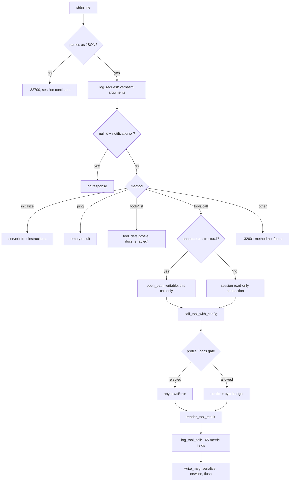
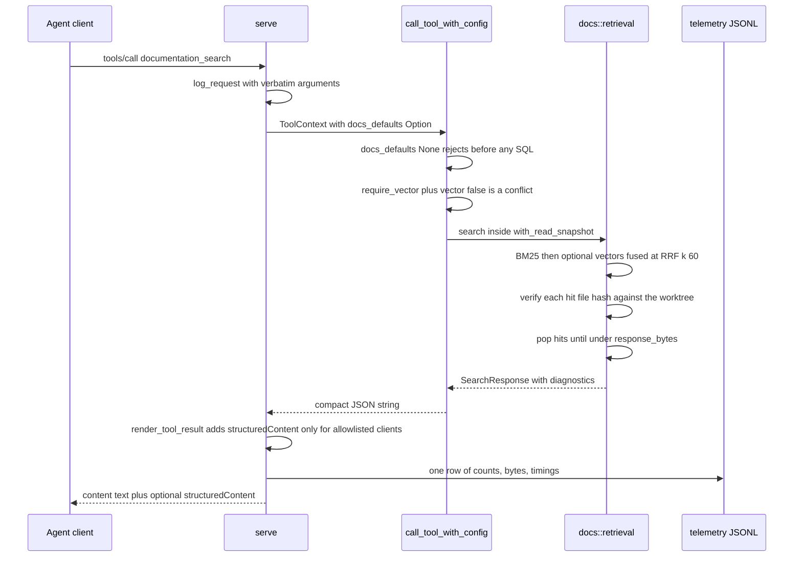

# The MCP surface

`jscout mcp` runs a newline-delimited JSON-RPC 2.0 server over stdio that exposes the index to agents as thirteen tools. The server holds the read loop, every tool's JSON Schema, three gating axes, three byte-budgeting families, the result-transport decision, and two independent JSONL log writers. Its shape is dictated by one constraint that runs through everything: an agent has a finite context window, so bounded responses must say when content was omitted. The G24 documentation subsystem arrives here as `documentation_search`, gated independently of the profile and reachable from both profiles. Successful atomic query/read responses and `annotate` carry exactly one top-level plane `snapshot` plus one top-level `publication_snapshot`; machine-readable JSON is compact.

## Transport

`serve` (`src/mcp.rs:146`) locks stdin and stdout for the process lifetime and iterates `stdin.lock().lines()` (`:197`). Blank lines are skipped. A `serde_json` parse failure writes `{"code":-32700,"message":"parse error: …"}` against a null id and *continues* the session (`:200-211`) — a malformed line does not kill the connection. There is no `Content-Length` framing; the wire format is strictly one JSON object per line, written by `write_msg` (`:401`), which serializes, appends `\n`, and flushes every message.

Two failure modes do abort. A stdin read error propagates through `let line = line?` (`:198`), and a `write_msg` failure propagates from `:361`; only clean EOF returns `Ok(())`. Because `stdout.lock()` is held for the session, anything else in the binary writing to stdout would deadlock — which is why every warning in this file goes to `eprintln!`.

Startup establishes five session-scoped things before the first message: `root.canonicalize()`, a blake3 fingerprint of the running executable read in 64 KiB chunks (`current_binary_fingerprint`, `:2037`), a **read-only** SQLite connection (`store::open_path_read_only`, `:161`), an `embed::Provider` plus optional `search::Reranker` built from runtime config (`:162-171`), and the telemetry and request-log files opened in append mode. The read-only connection is the load-bearing choice: it keeps schema migrations and writer locks out of every retrieval-only session.

The CLI subcommand is `jscout mcp ROOT` (`src/cli.rs:226-247`), with `--database`, `--telemetry`, `--request-log`, `--profile`, `--source-view`, `--result-transport`; each flag falls back to the corresponding config key in `src/commands/mod.rs:361-392`. `serve` is the function, not a subcommand name.

## Request lifecycle

Look at where `LOGREQ` sits relative to `DISPATCH`, and at the fork at `ANNOTATE`.

`LOGREQ` runs *before* dispatch (`:216`), so the request log records attempts that were subsequently rejected. `ERRSTR` and `BUDGET` converge on the same `RENDER` node because tool errors are not JSON-RPC errors — see *Error surfacing* below.

## Dispatch

`match method` (`:222`) has exactly four arms plus a catch-all. `initialize` (`:223`), `ping` (`:271`, returning `{}`), `tools/list` (`:272`), `tools/call` (`:275`); anything else returns `-32601 method not found`. A message with a null id whose method starts with `notifications/` is consumed with no response (`:219`).

`initialize` captures `clientInfo` into `McpClientInfo`, echoes the client's requested `protocolVersion` verbatim (defaulting to `2025-06-18`, `:226-232`) — there is no negotiation — advertises only `capabilities.tools`, and returns a `serverInfo` block considerably richer than the spec requires (`:234-266`):

| serverInfo field | Content |
| --- | --- |
| `binaryFingerprint` | blake3 of the running executable |
| `configurationFingerprint` | `runtime.fingerprint` |
| `database` | the index database path |
| `configuration` | `{path, loaded, reload: "restart-required"}` |
| `retrievalDefaults` | effective code-search vector/rerank/memory/expansion/limit/responseBytes |
| `documentationRetrievalDefaults` | `{enabled, vector, rerank, limit, responseBytes}` from `[docs]` |
| `resultTransport` | `{policy, selected, textFallback: true}` |

`"reload": "restart-required"` is an advertised contract: the runtime config is read once at startup, so editing `jscout.toml` mid-session changes nothing. `instructions` carries one of two long prose strings, discussed under *G23 posture*.

## Tool inventory

Thirteen tools are declared in one `json!` literal (`:526-844`). Backing modules are where the actual work happens; `src/mcp.rs` only marshals arguments and budgets output.

| Tool | Profile | Required input | Notable optional input | Output shape | Backing module |
| --- | --- | --- | --- | --- | --- |
| `semantic_search` | both (reduced schema on Baseline) | `query` | `exhaustive`, `limit`, `cursor`, `file_roles`, `origins`, `formats`, `vector`, `rerank`, `debug`, `response_bytes`; Structural-only `include_memory`/`memory_*` and ten `expand*` keys | compact `{snapshot, publication_snapshot, effective, scope, total_chunks, returned, truncated, next_cursor, hits[], …}`; `debug:true` returns the compact-serialized diagnostic struct | `search`, projected by `compact::search_string` |
| `documentation_search` | both (only when `docs.enabled`) | `query` | `limit` 1–100, `vector`, `require_vector`, `rerank`, `response_bytes` ≥256, `debug` | `{snapshot, publication_snapshot, hits[], truncated, retrieval:{vector, reranker, freshness, max_rank_movement}}` | `docs::retrieval` |
| `who_uses` | both | `symbol` XOR `anchor` | `snapshot` (anchor mode only), `origins`, `formats`, `response_bytes`, `debug` | usage sites by confidence; `resolution` appears whenever exact-anchor handling is not exact-current | `query` + `compact::who_uses_string` |
| `definition` | both | `symbol` XOR `anchor` | `snapshot`, `origins`, `formats`, `view` (`full`/`elided`), `source_bytes`, `response_bytes`, `debug` | rendered definition bodies, at most five targets | `query`/`scout` + `compact::definition_string` |
| `file_outline` | both | `path` | `origins`, `response_bytes` | `{outline[], response_budget}` | inline SQL over `code_chunks`/`code_files` (`:1336`) |
| `events` | both | — | `name`, `origins`, `response_bytes` | `{events[], response_budget}` | `query::events_in_origins` |
| `calls` | both | `method` | `args[]` (`KEY` or `KEY=VALUE`), `arg_position`, `receiver`, `origins`, `limit` (`.min(1000)`), `response_bytes` | `{matches[], …, response_budget}` | `calls::query` |
| `entities` | Structural | — | `query`, `planes`, `types`, `roles`, `file_roles`, `origins`, `limit`, `occurrences_per_entity`, `response_bytes` | `{entities[], response_budget}` | `surface` |
| `paths` | Structural | `from`, `to` | `snapshot`, `max_depth`, `path_limit`, `node_limit`, `edge_limit`, `direction`, `min_confidence`, `kinds`, `file_roles`, `origins`, `response_bytes` | `{paths[], response_budget}` | `structural` |
| `repository_overview` | Structural | — | `origins`, `area_limit`, `relation_limit`, `include_semantic`, `semantic_*`, `reconnaissance_*`, `response_bytes` | compact-serialized `surface::overview_response` | `surface` |
| `semantic_memory` | Structural | — | `query`, `artifact`, `view`, `anchor`, `file`, `related_to`, `types`, `freshness`, `vector`, `limit`, `include_source`, `source_*`, `response_bytes` | artifact projections at three view depths | `semantic_query` |
| `annotate` | Structural | `type`, `confidence`, `snapshot` (+ conditional `name`/`participants` or `body`/`supports`) | `supersedes` | compact publication record with code and publication identities | `semantic::annotate_request_with_provider` |
| `neighborhood` | Structural | `anchor` | `snapshot`, `depth`, `direction`, `node_limit`, `edge_limit`, `min_confidence`, `kinds`, `file_roles`, `origins`, `response_bytes`, `debug` | compact projection, or debug `{nodes[], edges[], response_budget}` | `structural::neighborhood` |

Two things the schemas advertise but the server does not do. There is **no server-side JSON-Schema validation** anywhere: `minimum`, `maximum`, `required`, and `additionalProperties` are published for the client's benefit and never enforced. Some limits are clamped in Rust (`calls.limit`, `entities`, `paths`, `repository_overview`, `semantic_memory`), others pass straight through — `documentation_search.limit` (schema says max 100), `definition.source_bytes`, `neighborhood.node_limit`/`edge_limit`, and `semantic_search.limit`. And `semantic_search`'s `limit` is not clamped to the exhaustive page size: `search::resolve_search_limit` (`src/search.rs:22-32`) returns an explicitly requested limit unchanged and applies `MAX_EXHAUSTIVE_PAGE_SIZE` only to the *configured default*, so `{exhaustive: true, limit: 500}` is rejected downstream (`src/search.rs:1643-1646`) rather than silently reduced.

`tools/list` also advertises `inputSchema` but never `outputSchema`, while the server can return `structuredContent` — a combination some MCP clients treat as unexpected.

## The write-connection carve-out

`tools/call` has exactly one special case: when the tool is `annotate` *and* the profile is Structural, `serve` opens a second, writable connection via `store::open_path` for that call alone. The server stays read-only until the one write-capable tool is selected, keeping schema writes and writer locks out of retrieval-only sessions. A failed open surfaces as a tool error rather than at startup. Annotation reads the code and publication identities inside its `BEGIN IMMEDIATE` publication transaction, so the echoed envelope cannot pair a validated write with identities observed before a concurrent index commit.

## Profile gating, twice

`ToolProfile` is `Baseline | Structural` (`:22`), parsed from `--profile` or `mcp.profile` (config default `"structural"`, `src/config/load.rs:850-853`, which duplicates the same `matches!` validation with its own message). Gating is enforced at two independent layers, deliberately:

1. **Schema-level**, in `tool_defs` (`:851-889`). Baseline `retain`s away six tools — `entities`, `paths`, `repository_overview`, `semantic_memory`, `neighborhood`, `annotate` — then reaches into `semantic_search`'s `inputSchema.properties` and `remove`s fourteen keys: the four memory controls and the ten expansion controls. A Baseline agent never sees a knob it cannot turn.
2. **Call-level**, at the head of each structural arm in `call_tool_with_config` (`:1399`, `:1429`, `:1472`, `:1499`, `:1577`, `:1589`): `bail!("… is unavailable in the baseline MCP profile")`. `src/mcp/tests.rs:1040` exists specifically to prove a client that ignores the advertised schema is still rejected.

Beyond removal, Baseline **forces** stages off rather than erroring on them. `search_options_from_args` (`:914-926`) rejects only an *explicitly* supplied `expand: true`, and otherwise coerces `expand` to false whenever the profile is Baseline; `include_memory` is forced the same way (`:960-964`). Before commit `d3d34de` the code computed `expand` from configuration and then bailed if it was true, which broke every Baseline ranked search in a repository whose config set `search.expansion.enabled = true`. The tradeoff is a visible asymmetry — the same value behaves differently depending on whether it was supplied or defaulted — which is why the instruction strings state it in words ("Baseline forces unavailable expansion and attached memory off").

Exhaustive mode applies a parallel override on both profiles: `vector`, `rerank`, `expand`, and `include_memory` are all forced false, and an explicit `true` on any of the four is rejected up front (`:907-913`). A `cursor` without `exhaustive: true`, or a non-string cursor, is rejected (`:899-906`).

## Documentation retrieval is a tool, not a field

`documentation_search` is a **thirteenth top-level tool** (`:563-579`), not a flag on `semantic_search`. Nothing in `semantic_search`'s schema mentions the docs corpus; its `file_roles` enum does contain `"documentation"`, but that is a *code* file role and is unrelated to `files.corpus='docs'`.

The reason is score comparability. Documentation ranks in its own BM25 corpus (`docs_fts`, never `chunks_fts`) so that admitting Markdown leaves code ranking byte-identical, and a single fused tool would have had to reconcile two incomparable score spaces while placing authored prose on the same evidential footing as parsed structure — which both instruction strings explicitly deny ("authored prose is not runtime proof"). The cost is that there is no unified "search everything": agents must know to make a second call, which both instruction blocks compensate for by naming the tool in their second sentence.

Its gate is a **third axis, orthogonal to profile**: `runtime.effective.docs.enabled` (default true, `src/config/load.rs:411`). That single boolean threads through three places. `tool_defs` retains the tool away when false (`:848-850`). `server_instructions` string-replaces the documentation sentence out of *both* prose blocks (`:516-523`), so the server never advertises a tool it does not expose. And `ToolContext.docs_defaults` is an `Option<&DocsSettings>` built via `runtime.effective.docs.enabled.then_some(…)` (`:296-300`), so the dispatch arm's `context(…)?` on the Option *is* the check — the arm cannot forget it. It is available in **both** profiles.

Watch the three gates and the dual encoding.

The dispatch arm (`:1140-1190`) resolves a three-way vector decision: `use_vector = require_vector || configured_vector`, with the contradictory pair `require_vector: true, vector: false` rejected up front (`:1151`). Note that `require_vector: true` *forces* vectors on regardless of repository configuration; it is not merely a "fail instead of degrade" flag. The `ensure!(defaults.enabled)` immediately above (`:1144-1147`) is unreachable in production — `docs_defaults` is `Some` only when enabled — and exists for the `#[cfg(test)]` entry point `call_documentation_tool` (`:2213`).

Every read-only MCP tool is wrapped by `call_tool_with_config` in one outer `store::with_read_snapshot("jscout_mcp_response")`; module-local pins may nest inside it. The response therefore reads its identity block and payload from one SQLite view even when indexing commits during a provider-backed call. Code and semantic surfaces put the code digest in `snapshot`; `documentation_search` puts the documentation digest there. `publication_snapshot` is the fold of code, documentation, and provenance components. It is not itself a freshness, write, or invalidation gate and does not cover later checker, semantic, reconnaissance, or vector maintenance.

The documentation compact projection emits `{snapshot, publication_snapshot, hits[], truncated, retrieval:{vector, reranker,freshness,max_rank_movement}}`. Each hit carries rank/movement, path, title metadata, heading and line range, content, freshness, and source-state diagnostics. It no longer repeats snapshot, indexed file hash, or byte offsets per hit. `source_state` is `current` or `source_mismatch`: the served `content` is the indexed rendered body, and a hash mismatch against the working tree is reported rather than hidden. This is the opposite of how `definition` handles the same situation, which silently falls back to stored chunk content with no field saying so.

`documentation_search` is the only tool that sets `"additionalProperties": false` at the top level of its `inputSchema` (`:577`) — `annotate` sets it too, but on a nested `participants` item schema (`:778`).

### The corpus boundary is narrower than the views suggest

`src/store.rs:429-436` defines `code_files` and `code_chunks` as views filtering `files.corpus='code'`, and docs ingestion does insert rows into both `files` and `chunks` with `corpus='docs'` (`src/docs/store.rs:368-395`). But only three MCP read paths actually go through the views: `semantic_search` (`src/search.rs:598-599`), `file_outline` (`src/mcp.rs:1336`), and symbol lookup (`src/query.rs:98`). `definition`'s source fetch joins base tables (`FROM chunks c JOIN files f`, `:1253-1254`), and `who_uses`, `events`, and `calls` read `refs`, `events`, and `member_calls` joined to `files` (`src/query.rs:648, 704, 764`). Their isolation from documentation rests on those relation tables never being populated for docs files, plus file ids arriving from code-view lookups — not on the views themselves. The end-to-end guarantee is real and tested (`src/mcp/tests.rs:297` re-indexes with an added README and MDX file and asserts every code-read surface is byte-equal); the mechanism is not uniform.

## Byte budgeting

There is no single budgeter. Three families coexist because they budget different shapes:

1. **`render_bounded_object_arrays`** — `file_outline`, `events`, `calls`, `entities`, `paths`, and debug-mode `neighborhood`. It injects a `response_budget` object, then pops elements from the **tail** of each named array until compact `to_string(...).len() <= byte_limit`, setting `truncated: true` and accumulating `omitted_items`. `unbudgeted_bytes` records the pre-truncation size. Writing size fields changes the measured length, so the settling helper iterates to a fixed point. When nothing more can be popped it bails with `"response byte limit N is below the minimum response envelope (M bytes)"`.
2. **`compact.rs` final-envelope settle/pop loops** — `who_uses` and `definition` pass the identity block and any visible anchor resolution into their compact builders, which budget the complete response. The previous post-budget append plus guessed reservation no longer exists. `resolution` is omitted only for exact-current anchors; stale same-anchor re-resolution remains visible. If stale re-resolution finds same-scope overloads, resolution still fails closed but the error now identifies stale re-resolution and tells the caller to relocalize with the current response `snapshot`.
3. **Callee-owned budgets** — `semantic_search`, `semantic_memory`, `repository_overview`, compact `neighborhood`, and `documentation_search` pass `response_byte_limit` into their modules. `documentation_search` budgets by popping hits and incrementing `diagnostics.budget_dropped`; its failure message is the `response_budget_too_small: … minimum_bytes=N` form that both instruction blocks tell agents to retry with.

All public machine-readable surfaces now serialize with `serde_json::to_string`, including debug output. The budget envelope is still not uniformly present — compact `semantic_search` inserts its `response` block only when truncation occurred, and `annotate` returns a publication with no budget field. Caller-supplied `byte_limit`/`response_bytes` values are inputs and are not echoed back; `rendered_bytes`, `unbudgeted_bytes`, truncation, and omission counts remain where the surface has a budget block. Truncation is never silent.

Non-search tools now share `compact::DEFAULT_TOOL_RESPONSE_BYTES` (24,000) across MCP schema defaults, runtime fallbacks, and the corresponding CLI/module defaults. This replaces the formerly scattered literals and non-search reuse of the search constant. `semantic_search` and `documentation_search` still resolve their independent configured budgets, whose built-in defaults are 30,000 and 24,000 bytes respectively.

## Result transport

`ResultTransportPolicy` is `Auto | Text | Structured` (`:45`), default `"auto"`. `resolve` (`:76`) maps Auto by *client identity*, not capability: `supports_structured_results` (`:121`) requires `clientInfo.name == "codex-mcp-client"` and version ≥ 0.147.0, with `version_at_least` (`:130`) hand-stripping a prerelease suffix such as `-dev.1` and returning false for anything it cannot parse into three numeric components. The doc comment is explicit about why — MCP has no structured-result capability bit, so unknown clients stay on text. It is an allowlist of exactly one, and it ages: a new client that handles `structuredContent` correctly gets text until someone edits the constant.

`render_tool_result` (`:426`) always emits `content[0].text` with the full JSON string, and *additionally* emits `structuredContent` when Structured is selected and the text parses as JSON. If the text is not valid JSON it silently downgrades to text-only and records `structured_parse_failed`. The `"textFallback": true` advertised in `serverInfo` is this guarantee: enabling the feature can never lose information. The cost is that the payload is carried twice on the wire, measured per call as `mcp_fallback_text_bytes` versus `mcp_structured_content_bytes` and asserted at `src/mcp/tests.rs:727`.

## Error surfacing

Two levels, and they do not overlap. JSON-RPC error objects are used only for `-32700` (parse) and `-32601` (unknown method). Everything else — unknown tool name, profile rejection, docs gate rejection, argument contradiction, budget-too-small, SQL failure — is an `anyhow::Error` returned from `call_tool_with_config` and rendered by `render_tool_result` as `{"content":[{"type":"text","text":"error: …"}],"isError":true}` inside a JSON-RPC *success* response (`:474-489`). `tools/call` never produces a JSON-RPC error member, and errors never render as `structuredContent`. Some messages are load-bearing contracts rather than diagnostics: `response_budget_too_small: … minimum_bytes=N` is what the instruction strings tell agents to parse and retry with.

One rejection reads as two conditions to an agent: `docs_defaults` being `None` yields "documentation_search is unavailable without documentation retrieval configuration", while present-but-disabled yields "disabled by repository configuration" — a distinction that exists only because of the test entry point.

## Telemetry: two streams with different privacy properties

**Request log** (`log_request`, `:366`, enabled by `--request-log`) is written *before* dispatch and records `sequence`, `method`, `tool`, and the **verbatim `arguments`** — query text included. **Telemetry** (`log_tool_call`, `:1832`, enabled by `--telemetry`) is written after and emits roughly 65 fields of counts, byte sizes, timings, and status strings but never query text or results; only this one is described in the CLI help as "privacy-minimal … (no queries or results)" (`src/cli.rs:233`). Both stamp `JSCOUT_SESSION_ID` (falling back to `pid-<n>`), `JSCOUT_TASK_ID`, and `JSCOUT_PROFILE_LABEL` from the environment, and both degrade to an `eprintln!` warning on write failure rather than failing the call.

Facts reach telemetry two ways. In-band, `RetrievalStageMetrics` (`:1043`) is a `RefCell` scratchpad that the `semantic_search` and `semantic_memory` arms write vector/reranker timings and expansion path counts into — data that cannot be recovered afterwards because timings and pre-truncation candidate counts never appear in the agent-facing projection. Out-of-band, `log_tool_call` re-parses the *rendered result string* back into JSON and mines it: `definition_source_metrics` (`:2066`), `expansion_role_metrics` (`:2105`, which handles both the compact `graph.nodes` map and the diagnostic `expansion.nodes` array), and `semantic_artifact_metrics` (`:2155`, which probes four alternative field paths). That makes one extraction path work across compact and debug projections of several tools and captures what the agent actually received — at the price of structural coupling to output field names, where any projection rename silently zeroes a column.

Two consequences worth naming. `documentation_search`'s compact output happens to expose a top-level `retrieval.vector`/`retrieval.reranker`, so docs-vocabulary statuses (`not_configured`, `not_ready`, `degraded`) land in the same `retrieval_vector`/`retrieval_reranker` columns as code statuses with only the `tool` field to discriminate. And `requested_retrieval` is emitted only for `semantic_search` and `semantic_memory` (`:1931-1948`). Collecting telemetry also changes behavior: `collect_telemetry` gates an extra `search::approximate_name_usage_occurrences` query per search (`:1096`).

## G23 posture

G23 is guidance, not schema. It lives in the two server instruction strings and in the installed skill, which encode the Investigation loop (exhaustive lexical, copy the exact `next_cursor` until `truncated=false`, then `definition` on a returned `sym:` anchor with the response's top-level code snapshot) and, for Structural only, the Inquiry loop. Search hits no longer emit `followups`; the anchor is the handoff. When constructing the next call, preserve the original explicit `origins` and `formats` allowlists unchanged, keep either omitted when it was omitted, and never synthesize them from echoed scope. The scope object still reports `corpus`, `file_roles`, `origins`, and `formats`, but no longer repeats the snapshot.

The rationale for prose over schema is that none of this is expressible in JSON Schema: sequencing, cursor discipline, and the separation of convention from correctness are all about *how* calls are ordered and what may be claimed from them. The tradeoff is that prose contracts can only be tested by substring assertion — `src/mcp/tests.rs:567` asserts 19 shared contract markers appear in both strings and that Baseline mentions none of the six unavailable tools nor `include_memory`/`expand=true`, which catches deletion but not meaning drift.

[`PLAN.md`](../../PLAN.md) is the normative source for current numbered-gate and acceptance status; this chapter does not duplicate that ledger.

## Sharp edges

| Edge | Where |
| --- | --- |
| `definition` renders at most 5 targets while reporting the full `matched_targets` count | `src/mcp.rs:1250` |
| `definition` silently swaps live source for stored chunk content on a hash mismatch, with no field saying which was served | `src/mcp.rs:1262-1291` |
| `file_outline` matches `f.path = ?1 OR f.path LIKE '%' \|\| ?1`, so `service.ts` also matches `my-service.ts` — nothing enforces a path-separator boundary | `src/mcp.rs:1337` |
| `semantic_memory`'s `vector` argument falls back to the *code* search setting | `src/mcp.rs:1526` |
| Debug `neighborhood` pops `edges` before `nodes`, so truncation can leave dangling references in either direction | `src/mcp.rs:1621` |
| The `rendered_bytes` fixed point gives up after 8 rounds and reports a possibly stale count rather than failing | `src/mcp.rs:1804-1813` |
| A malformed client version string silently falls back to text transport | `src/mcp.rs:130-144` |
| `ToolProfile::parse` and `config/load.rs:851` validate the same two values with two different error messages | `src/mcp.rs:28`, `src/config/load.rs:851` |

## Tests

`src/mcp/tests.rs` exercises tool definitions, instructions, search-option resolution, result transport, logging, and budgeting helpers, plus test harnesses for code and documentation calls. The structurally important differential test indexes one repository without docs and again with Markdown/MDX containing code identifiers, captures every code/semantic read surface, requires exactly one top-level `snapshot` and `publication_snapshot` in each response, normalizes only those two identity values, then compares compact serialized bytes. That is the whole-system assertion that documentation admission cannot leak into a code surface; the probed set is checked against the registered structural tool inventory so a newly added read surface cannot silently escape the test.
