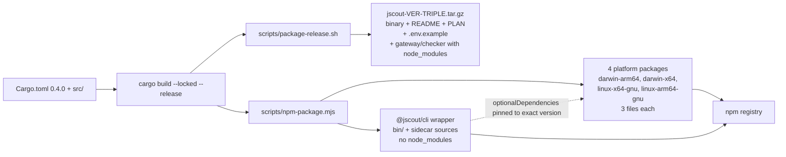
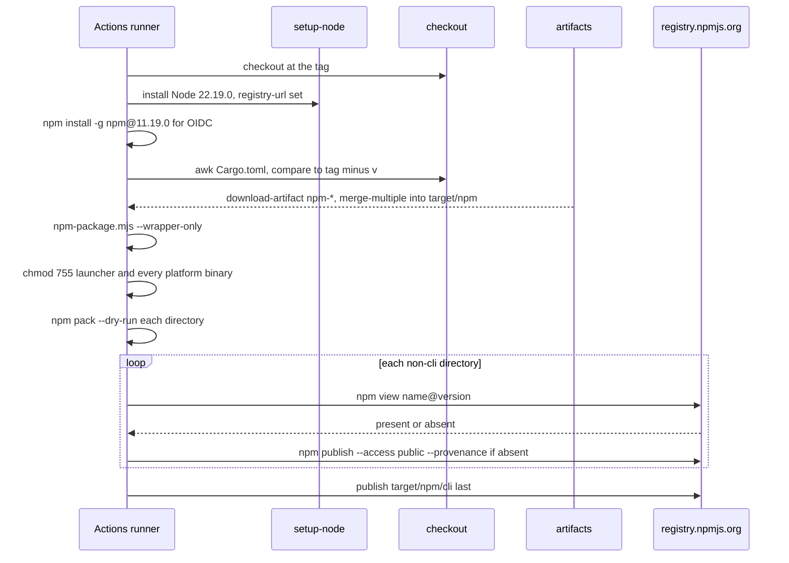
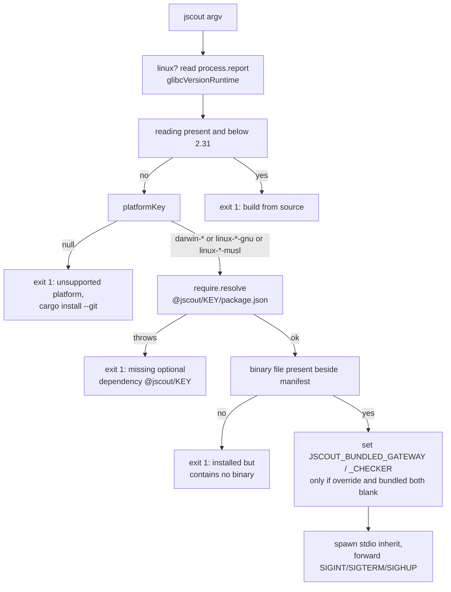

# Build, CI, and distribution

jscout is a single binary-only Rust crate — no `src/lib.rs`, no `[lib]`, no `[features]`, no `tests/` directory — compiled by a toolchain pinned to 1.97.1 in five separate places, linted by an opt-in list of 35 named clippy lints rather than `pedantic`, and gated by five GitHub Actions jobs that run with no dependency edges between them. The same crate leaves the repository in two shapes with different vendoring strategies: a self-contained `.tar.gz` that carries fully installed sidecar `node_modules`, and a family of five npm packages where the wrapper `@jscout/cli` ships sidecar *sources* and lets npm resolve their dependencies. Tests are 474 Rust `#[test]` functions compiled into that one binary, plus 36 Node cases for the checker sidecar, 24 for the gateway, 10 for the performance harness, and 3 for the npm launcher — and a further ~71 Node and Python cases that no workflow runs at all.

## Crate shape and the dependency set

`Cargo.toml:1-5` declares `name = "jscout"`, `version = "0.4.0"`, `edition = "2024"`, `license = "MIT OR Apache-2.0"`. There is no library target, so `cargo test --all-targets --all-features` (`.github/workflows/ci.yml:20`) compiles exactly one unit-test binary rooted at `src/main.rs`, and every `#[test]` is a private-item test inside it — no test reaches the crate through a public seam. `--all-features` is inert: the manifest has no `[features]` section. Twenty-two runtime dependencies (`Cargo.toml:7-29`) and one dev dependency, `tempfile 3.23.0` (`Cargo.toml:31-32`), resolve to 234 `[[package]]` entries in a `version = 4` `Cargo.lock` — 233 dependencies, since one entry is `jscout` itself.

| Dependency | Version | Why it is here |
| --- | --- | --- |
| `oxc_allocator`, `oxc_ast`, `oxc_ast_visit`, `oxc_parser`, `oxc_semantic`, `oxc_span`, `oxc_syntax` | `0.143.0` | The parser and AST. All seven share arena and AST types, so they move as one version. |
| `oxc_resolver` | `11.24.2` | Node/TS module resolution; separate release line from the AST crates. |
| `rusqlite` (`bundled`) | `0.40.1` | Storage. `bundled` compiles `libsqlite3-sys` from source, which is why the release tarball needs no system SQLite. |
| `sqlite-vec` | `0.1.9` | Vector index extension, ABI-coupled to that exact bundled SQLite build. |
| `serde`, `serde_json` (`preserve_order`) | `1.0.229`, `1.0.151` | Wire formats. `preserve_order` keeps emitted JSON key order stable. |
| `toml` | `0.9.8` | `.jscout.toml` parsing (see [13-configuration.md](13-configuration.md)). |
| `clap` (`derive`) | `4.6.5` | The CLI surface. |
| `ureq` | `3.3.0` | Blocking HTTP for embedding calls; deliberately no async runtime anywhere in the tree. |
| `notify`, `ignore` | `8.2.0`, `0.4.33` | Filesystem watching and gitignore-aware walking. |
| `blake3` | `1.8.5` | Content hashing for the freshness manifest. |
| `ctrlc`, `libc` | `3.5.2`, `0.2.189` | Signal handling and process-level calls. |
| `unicode-normalization` | `0.1.24` | Identifier and text normalization before indexing. |
| `anyhow` | `1.0.104` | Error propagation. |

## The clippy ratchet

`Cargo.toml:41-89` enables exactly 35 named clippy lints at `warn`, grouped by comment into seven bands: lint policy (2), formatting and allocation (8), iteration and collections (6), control flow and bindings (6), API shape (5), style and correctness hazards (7), docs (1). The rationale is written into the manifest at `Cargo.toml:34-40`: turning `pedantic` on wholesale emits roughly 780 warnings on this tree, dominated by `i64`/`usize` casts inherent to the rusqlite boundary, and blanket-allowing those would bury the handful of genuine findings among them. Every lint on the list is one the tree passes today, so the list is a regression ratchet rather than a backlog — `cargo clippy --all-targets --all-features -- -D warnings` is green at this commit. The cost is that new lint categories never surface on their own; the list must be hand-extended and nothing prompts anyone to do it.

A 36th lint is scoped rather than global. `src/main.rs:3` reads `#![cfg_attr(not(test), warn(clippy::redundant_clone))]`, with the reason on line 2 — test fixtures favor reorderable inputs over last-use clone elimination. The consequence is that genuinely redundant clones inside roughly 27,000 lines of test code are never flagged.

`clippy.toml` exists for a single setting: `doc-valid-idents` extended with `SQLite`, `CommonJS`, `JavaScript`, `TypeScript`, `WebAssembly`, plus the `".."` sentinel that appends to clippy's own default list instead of replacing it, so `doc_markdown` stops demanding backticks around product names in doc comments.

## Toolchain pinning, written five times

`rust-toolchain.toml` pins `channel = "1.97.1"`, `components = ["clippy", "rustfmt"]`, `profile = "minimal"` — what a local `cargo build` picks up. CI never reads that file. `dtolnay/rust-toolchain@master` is handed the literal `1.97.1` twice in `ci.yml` (`:15`, `:68`), once through `RUST_TOOLCHAIN` in `.github/workflows/release-npm.yml:23`, and a fifth copy is baked into the digest-pinned container tag `rust:1.97.1-bullseye@sha256:02d78ca…` (`release-npm.yml:76`). Nothing cross-checks the five: bumping `rust-toolchain.toml` alone silently leaves every CI and release build on the previous compiler. Note also that the action reference itself is `@master`, an unpinned mutable ref, in both workflows, while every other action is version-pinned (`@v7`, `@v8`) and the Linux container is digest-pinned. There is no `rustfmt.toml`, so `cargo fmt --check` enforces stock defaults.

Node 22.19.0 is repeated even more widely — four times in `ci.yml` (`:30`, `:44`, `:58`, `:71`), once as `NODE_VERSION` in `release-npm.yml:24`, and in three manifests (`npm/cli/package.json:29`, `gateway/package.json:8`, `checker/package.json:8`). Only the ninth copy is enforced against a running process: `MINIMUM_NODE_VERSION: (u64, u64, u64) = (22, 19, 0)` at `src/llm/config.rs:14`. npm itself is pinned to 11.19.0 in the publish job (`release-npm.yml:25`), with the reasoning inline at `:133-136` — Node 22.19.0 ships npm 10.x, OIDC trusted publishing needs ≥ 11.5.1, and `@latest` would resolve to npm 12, which requires a Node newer than `NODE_VERSION`.

## CI: five jobs, no ordering, no concurrency

`.github/workflows/ci.yml` fires on push to `main` (`:4-5`) and on every pull request (`:6`). Five `ubuntu-latest` jobs run fully independently: no `needs:` edges, no `concurrency:` group, no `permissions:` block anywhere in the file, and no `timeout-minutes` on any job. Successive pushes to a branch therefore run overlapping builds, and jobs inherit the default `GITHUB_TOKEN` scope.

| Job | Lines | What it runs | What it gates |
| --- | --- | --- | --- |
| `rust` | `:9-22` | `cargo fmt --all -- --check`, `cargo test --all-targets --all-features`, `cargo clippy --all-targets --all-features -- -D warnings` | 474 Rust tests, formatting, the 35-lint ratchet |
| `gateway` | `:24-36` | `npm ci --prefix gateway`, `npm test --prefix gateway` | 24 cases in `gateway/test/gateway.test.mjs` |
| `checker` | `:38-50` | `npm ci --prefix checker`, `npm test --prefix checker` | 36 cases in `checker/test/sidecar.test.mjs` |
| `performance-harness` | `:52-60` | `node --test bench/perf/perf.test.mjs` | 10 cases; no `npm ci` — the harness uses local mock sidecars |
| `release-package` | `:62-95` | tarball build, launcher tests, npm assembly, two dry-packs, `node --check`, out-of-checkout smoke | Both packaging shapes end to end |

The `rust` job's step order costs real time: tests run before clippy, so a lint-only regression pays a full compile-and-run of the 474-test binary before failing. Neither cargo invocation passes `--locked`, and cargo rewrites `Cargo.lock` in place when manifest and lock drift, so lock drift is caught only downstream in `release-package`, where `scripts/package-release.sh:22,26` builds `--locked`. Both sidecar `test` scripts are a bare `node --test` (`gateway/package.json:12`, `checker/package.json:12`), so file discovery is implicit rather than enumerated.

`release-package` is the widest gate. It builds the tarball, runs the three launcher tests, assembles the npm tree with a bare `node scripts/npm-package.mjs`, dry-packs `target/npm/cli` and `target/npm/linux-x64-gnu`, and `node --check`s the bootstrap publisher — with the reason inline at `:82-83`: that script only ever runs during a release, so a syntax error would otherwise surface at the worst possible moment. It then extracts the archive into `$RUNNER_TEMP` and runs `jscout llm doctor --model local:smoke` and `jscout checker doctor <bundle_dir>` against it (`:85-95`), proving the packaged binary self-locates both sidecars with no source checkout present. The smoke test injects a fabricated provider pointing at `127.0.0.1:11434` through `JSCOUT_PI_AI_OPENAI_COMPATIBLE_PROVIDERS` (`:92`) — nothing is served there, so this validates wiring, not a model, and it exercises the legacy-environment branch of the config resolver rather than a `.jscout.toml` (see [13-configuration.md](13-configuration.md)).

## Two artifact shapes from one crate

The artifacts named from here on are build outputs — a tarball, an npm tree, a CI upload — not the LLM-generated semantic artifacts of [09-scouting.md](09-scouting.md).

Read the diagram left to right: one crate, two packaging scripts, and two distribution shapes whose vendoring strategies are deliberate opposites. Note that only `scripts/npm-package.mjs` fans out per target, and that the wrapper node carries sidecar sources while the tarball node carries an installed tree.

`PKGREL` (`scripts/package-release.sh`) reads the version by awk at `:8`, builds `--locked`, then stages the binary, `README.md`, `PLAN.md`, `.env.example`, both sidecars' `src/`, `package.json` and `package-lock.json` (`:52-59`), runs `npm ci --omit=dev --ignore-scripts` into the staged tree for each sidecar (`:64-65`), tars inside a `mktemp` staging directory under an `EXIT` trap, and moves the result into place (`:49-50`, `:66-68`). The archive is therefore never visible half-written, and the script refuses to overwrite an existing one (`:44-47`). One ordering wart: `cargo build` runs at `:22`/`:26`, before the `command -v npm` check at `:35-38`, so a missing npm is not detected until after a full release build has completed.

`NPMPKG` (`scripts/npm-package.mjs`) holds `TARGETS` at `:21-32`, the single map from Rust triple to npm key plus `os`/`cpu`/`libc` selectors. Presence of `libc` is what distinguishes the two Linux packages from the two Darwin ones and drives the generated description text (`:116-118`). Platform manifests set `preferUnplugged: true` (`:130`) so Yarn PnP does not zip the binary, declare no `exports` map and no install scripts, and list exactly `["jscout", "LICENSE-MIT", "LICENSE-APACHE"]` (`:128`). The wrapper vendors sidecar sources plus their manifests but no `node_modules` (`:171-184`) — the opposite of the tarball — because npm already has a resolver at the far end and duplicating it would inflate the published tree. That is precisely why `:186-201` exists: sidecar dependency pins now live in three manifests, so packaging hard-fails if `gateway/package.json` or `checker/package.json` pins `@earendil-works/pi-ai`, `typescript` or `@noble/hashes` at a version different from `npm/cli/package.json` (currently `0.84.1`, `5.9.3`, `2.0.1`). That check lives inside `buildWrapperPackage`, which `--platform-only` skips (`:213`), so it never runs on the release matrix legs — only in the publish job, in bootstrap, and in the plain CI invocation.

Version authorship is messier than the workflow comment claims. `release-npm.yml:5-6` calls `Cargo.toml` "the single source of version truth", and four consumers do read it back — `npm-package.mjs:62-67` and `npm-bootstrap-publish.mjs:63-68` by regex, `package-release.sh:8` by awk, and `release-npm.yml:141-149` by awk plus tag equality. But `npm/cli/package.json:3` authors `"0.4.0"` and `:44-47` author it four more times as the `optionalDependencies` pins, and `checker/package.json:4` authors it again. `npm-package.mjs:149-158` overwrites the wrapper version and all four pins at assembly time but only *warns* on disagreement, so the five hardcoded strings in that file are free to rot; and the checker manifest is copied verbatim at `:180-183` with no rewrite, so the checker sidecar's authored `0.4.0` is what actually ships. The gateway is on an unrelated line entirely at `0.1.0` (`gateway/package.json:4`).

## Release and the OIDC publish

`release-npm.yml` triggers on `v*` tags or manual dispatch with `dry-run` defaulting to true, and sets a top-level `permissions: contents: read` (`:19-20`). `macos-binaries` builds both Apple targets on `macos-15`; `linux-binaries` runs both GNU targets inside the digest-pinned Bullseye container (`x86_64` on `ubuntu-latest`, `aarch64` on `ubuntu-24.04-arm`) and asserts `test "$(getconf GNU_LIBC_VERSION)" = "glibc 2.31"` (`:91-94`). That assertion is a tripwire that the container is actually in effect, not a floor in its own right — the container image *is* the floor, and moving it means changing the base image. Each leg builds `--locked --release --target T`, assembles its platform package with `--platform-only --target T`, smoke-tests with `--version` and `index . --database "$RUNNER_TEMP/smoke.db"`, and uploads `target/npm` whole so the artifact root stays stable for the merge (`:111-113`). The exception is `x86_64-apple-darwin`: its smoke step is `if: matrix.native` (`:56`), so the cross-compiled binary is never executed anywhere in the automated path.

The sequence below is the publish job's actual step order. Watch for the npm upgrade landing *before* the tag check, and for the artifact download landing *after* it.

Three details in that flow matter. The `chmod 755` step (`:160-168`) exists because `upload-artifact` does not preserve file modes, so without it every published binary would be non-executable. The `npm view` guard (`:192-195`) makes the loop resumable — a release that partially failed re-runs cleanly with ordering preserved, though nothing detects the mixed registry state automatically. And the wrapper publishes last (`:198-202`) because its `optionalDependencies` must already resolve the moment anyone installs it. Authentication is OIDC trusted publishing: `id-token: write` (`:124`), no token and no `NODE_AUTH_TOKEN`, which requires a trusted publisher configured per package at `npmjs.com/package/<name>/access`.

That per-package requirement is why `scripts/npm-bootstrap-publish.mjs` exists at all: a trusted publisher can only be configured on a package that already exists, so the *first* publish cannot use OIDC. The script wipes and recreates `target/npm` first (`:74-75`), downloads artifacts via `gh run download` into a separate `target/npm-artifacts` staging directory (`:86-95`), flattens them into the publish tree, builds the wrapper, restores executable bits (`:121-127`), and runs a preflight (`:129-200`) checking set equality between declared `optionalDependencies` and present artifacts, version equality against `Cargo.toml`, a ≥ 1 MiB size floor, the executable bit, and `file -b` output against `EXPECTED_ARCHITECTURE` (`:29-34`). That last check is the only machine-type verification anywhere in the repository — it exists because a cross-compile that silently produced host architecture would install cleanly and then fail on every user's machine. It runs exclusively in the one-time bootstrap path, so the cross-built `x86_64-apple-darwin` artifact has no architecture check on any normal release. The script's only automated coverage is the `node --check` at `ci.yml:84`.

## The launcher's decision path

`npm/cli/bin/jscout.mjs` is what `@jscout/cli` puts on `PATH`. Follow the three distinct failure exits — they emit different messages, and the musl branch reaches the middle one for a package that was never built.

`RESOLVE` goes through `package.json` rather than a bare specifier (`:76-83`) because the binary is not a module and platform packages deliberately declare no `exports` map — resolving the manifest and joining the sibling filename is the only path that works under both npm and Yarn PnP. `ENV` (`:96-115`) encodes a three-way precedence in one table: an explicit `JSCOUT_PI_AI_GATEWAY` / `JSCOUT_CHECKER_SIDECAR` override wins, an already-set `JSCOUT_BUNDLED_*` value wins, and only otherwise does the launcher point the Rust process at the vendored sources. The distinct variable name matters — it keeps the launcher's transport from being recorded as user legacy-environment policy. `SPAWN` (`:117-142`) forwards terminal signals while the child lives, exits with the child's code on normal exit, and on signal death removes the forwarder and re-raises the signal on its own pid so the parent's exit status reflects the child's real death.

`KEY` is where the musl gap lives. `platformKey` returns `linux-<cpu>-musl` when the glibc reading is absent (`:46-48`) — and absence *is* the musl signal, so the floor check at `:59-64` never fires there. But `TARGETS` has four entries and none is musl, and `npm/cli/package.json:43-48` declares only the four GNU/Darwin packages, so a musl user gets `missing optional dependency @jscout/linux-x64-musl` for a package that was never published and is not even declared. The informative glibc message is unreachable on exactly the platform that needs it.

The glibc floor itself is restated in four places that must stay in sync: `npm/cli/bin/jscout.mjs:21` (enforced at launch), `scripts/npm-package.mjs:19` (description text only), `release-npm.yml:93` (the container tripwire), and `npm/cli/README.md:64`.

## Test organization

474 `#[test]` functions live in one binary across 82 `.rs` files totalling 79,963 lines. The convention is `#[cfg(test)] mod tests;` in a production module resolving to a path-sibling file — a child module by path has the same private-item visibility an inline block had, so nothing about test access changed when roughly 23,000 lines left the production files. Twenty sibling files hold 367 tests in 23,326 lines; 26 modules still carry an inline `#[cfg(test)] mod tests { … }` block holding the remaining 107 tests in roughly 3,685 lines. Test code is therefore about 27,000 of 79,963 lines, near 34% of the tree.

| Sibling file | Tests | Lines |
| --- | --- | --- |
| `src/checker/enrich/tests.rs` | 44 | 3,614 |
| `src/scouting/tests.rs` | 43 | 3,267 |
| `src/structural/tests.rs` | 38 | 2,438 |
| `src/search/tests.rs` | 29 | 2,099 |
| `src/indexer/tests.rs` | 26 | 1,978 |
| `src/watch/tests.rs` | 26 | 604 |
| `src/mcp/tests.rs` | 24 | 1,534 |
| `src/embed/tests.rs` | 17 | 909 |
| 12 more siblings | 120 | 6,883 |

The declaration is usually the last statement of the module — `src/search.rs:3508` of 3,508 lines, `src/checker/enrich.rs:3934` of 3,934, `src/scouting/mod.rs:3365` of 3,365 — but not always: `src/commands/core.rs:481-483` sits mid-file with `cmd_chunks` defined right after it, and it is the only `#[path]` rename in the entire tree (`#[path = "core_tests.rs"]` at `:482`). `src/main.rs` declares two test-only modules by plain name: `mod test_fs;` at `:39-40` and `mod main_tests;` at `:79-80`. `main_tests.rs` is the odd one out structurally — it reaches `src/cli.rs` and `src/commands/` through `#[cfg(test)] use` re-exports at `src/main.rs:71-77`, because neither module has a `#[test]` of its own.

The sibling-file convention is not winning uniformly. The newest large module, `src/checker/package_gate.rs` (1,398 lines), was written with an inline block — 14 tests starting at `:858`. And the two newest bounded-value-flow modules, `src/value_flow.rs` (838 lines) and `src/structural/receiver_flow.rs` (936 lines), contain zero `#[test]` functions of their own; whatever covers them lives in `src/structural/tests.rs`.

Test infrastructure is deliberately thin. `tempfile 3.23.0` is the only dev dependency. `src/test_fs.rs` (66 lines, `#[cfg(test)]`-only) supplies `FaultFileSystem`: a `RefCell<HashMap<PathBuf, io::Error>>` for the next operation on a path plus a `RefCell<HashMap<(FileOperation, PathBuf), io::Error>>` for one exact kind of operation, layered over the real filesystem behind the injected `fs_ops::FileSystem` trait. The operation-keyed second map exists so an earlier metadata probe cannot consume a fault intended for a later content read. No Rust test mutates the process environment — `set_var`/`remove_var` appear nowhere under `src/` — which keeps the suite parallel-safe under edition 2024's unsafe-env rules, at the cost of leaving the legacy-environment branch of the config resolver and the startup deprecation warning at `src/main.rs:59-65` with no Rust coverage at all; the tarball smoke test at `ci.yml:92` is the only thing that exercises that path.

Outside Rust, the gated suites are `gateway/test/gateway.test.mjs` (24), `checker/test/sidecar.test.mjs` (36), `bench/perf/perf.test.mjs` (10, covering nearest-rank statistics, child-environment isolation asserting that `OPENAI_API_KEY`, `NODE_OPTIONS`, `LD_PRELOAD` and `TMPDIR` do not leak into benchmark children, path-containment guards, and MCP shutdown), and `npm/cli/test/launcher.test.mjs` (3, one skipped off Linux). Ungated by any workflow: 18 `scripts/*.test.mjs` files holding 60 cases, `examples/graph-memory/demo.test.mjs` (4), and `inference/test_service.py` (7). The root `package.json:9` `test` script hand-enumerates 20 `.test.mjs` paths instead of globbing, and `scripts/eval-workflow-scope-report.test.mjs` is on disk but not on the list — so it runs nowhere — and no workflow invokes root `npm test` regardless.

## Known gaps in this machinery

There is no eslint, prettier, or any format check for the roughly 30 `.mjs` files across the repository, while Rust gets `cargo fmt --check` plus `clippy -D warnings`. `.github/` contains only `workflows/` — no dependabot config, no CODEOWNERS, no issue templates. The tag-equals-`Cargo.toml` check is guarded by `if: startsWith(github.ref, 'refs/tags/v')` (`release-npm.yml:142`), so a `workflow_dispatch` run skips the only hard version gate. `ci.yml:81` hardcodes `npm pack --dry-run target/npm/linux-x64-gnu`, correct only because the job happens to run on an x86_64 runner, and it relies on `npm-package.mjs:94-95` falling back to `target/release/jscout` when target equals host — that is, on the binary `package-release.sh` already built in the previous step. The npm cache for `release-package` keys on `gateway/package-lock.json` alone (`ci.yml:72-73`), but `package-release.sh:65` also runs `npm ci` for the checker, so that install is uncached every run. Finally, neither packaging path ships a `.jscout.toml` example even though that file is now the configuration source of truth: `package-release.sh:55` copies `.env.example`, whose own header says jscout never auto-loads it and that it exists for secrets and legacy migration, and `npm-package.mjs` ships no example configuration at all.
