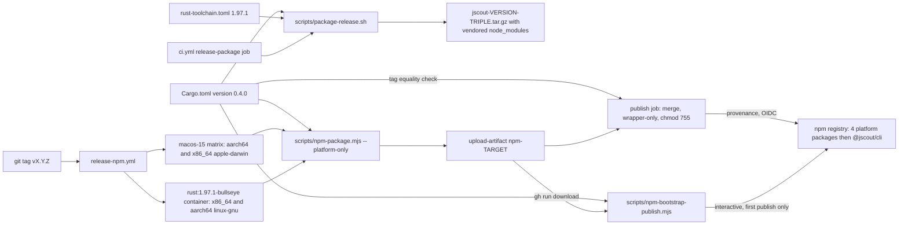
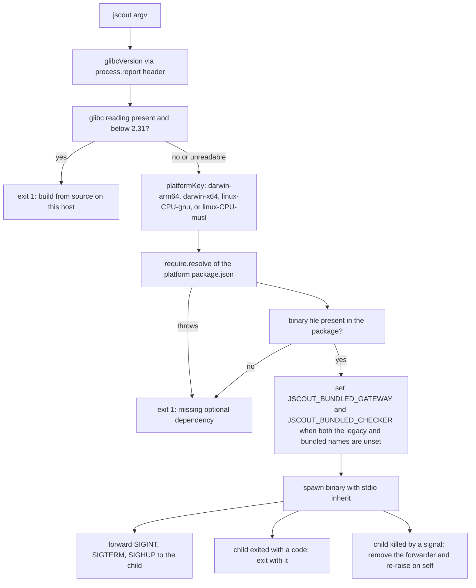
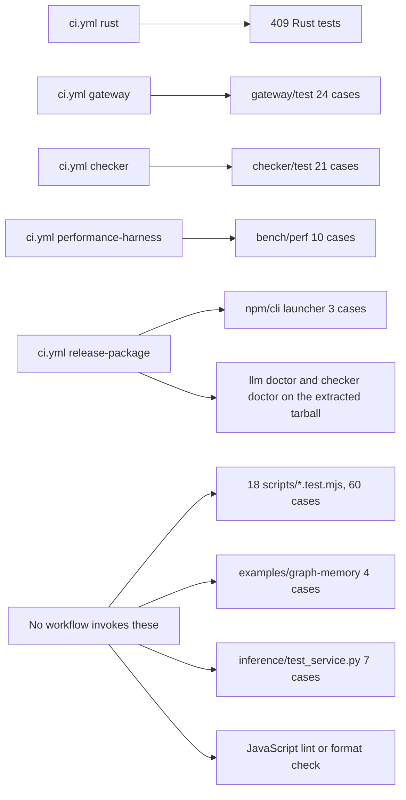

# Build, CI, and distribution

`jscout` compiles from one binary-only Rust crate and ships in two shapes: a self-contained tarball that carries the binary plus both Node sidecars with their `node_modules` already installed, and a family of five npm packages (`@jscout/cli` plus four per-platform binary packages) that let `npx -y @jscout/cli mcp /repo` work with no compile step. `Cargo.toml` is the only place a version number is authored; four scripts and one workflow read it back out and refuse to proceed when anything disagrees. Everything around that — a 35-lint clippy ratchet, a pinned 1.97.1 toolchain, five CI jobs, a digest-pinned Debian Bullseye container that fixes the glibc floor, and an OIDC publish that never touches a token — exists to make the two artifact shapes reproducible and to keep a cross-compile that silently produced the wrong machine code from reaching a user. Runtime policy is no longer part of this story: `.jscout.toml` replaced the environment as the configuration source, and that mechanism is described in [12-configuration.md](12-configuration.md) rather than here.

## Crate shape and what each dependency buys

The manifest declares `name = "jscout"`, `version = "0.4.0"`, `edition = "2024"`, `license = "MIT OR Apache-2.0"` (`Cargo.toml:1-5`). There is no `[lib]`, no `[features]`, no `benches/`, and no top-level `tests/` directory. Three consequences follow and all of them show up in CI: `cargo test --all-targets --all-features` compiles exactly one unit-test binary rooted at `src/main.rs`, `--all-features` is inert over an empty feature set, and no test can reach the crate through a public seam — every one of the 409 tests is a private-item test inside that binary. 22 runtime dependencies and one dev dependency resolve to 234 packages in a `version = 4` `Cargo.lock`.

| Dependency | Version | Why it is there |
| --- | --- | --- |
| `oxc_allocator`, `oxc_ast`, `oxc_ast_visit`, `oxc_parser`, `oxc_semantic`, `oxc_span`, `oxc_syntax` | `0.143.0` | The parser and AST stack. All seven share arena and AST types, so they must move as one version (`Cargo.toml:15-22`). |
| `oxc_resolver` | `11.24.2` | Module specifier resolution. On its own release line — not version-locked to the seven above. |
| `rusqlite` | `0.40.1`, feature `bundled` | SQLite access. `bundled` compiles `libsqlite3-sys` from source (`Cargo.toml:23`), which is why a release archive needs no system SQLite. |
| `sqlite-vec` | `0.1.9` | Vector index, registered process-globally through `sqlite3_auto_extension` (`src/store.rs:13-23`), so it is ABI-coupled to that exact bundled `libsqlite3-sys`. |
| `ureq` | `3.3.0` | Blocking HTTP to embedding, inference and rerank endpoints. There is deliberately no async runtime anywhere in the tree. |
| `blake3` | `1.8.5` | Chunk content hashing and the config fingerprint (`src/config/load.rs:904-905`). |
| `serde`, `serde_json` | `1.0.229`, `1.0.151` | Every wire format; `serde_json` carries `preserve_order` so emitted JSON is stable. |
| `toml` | `0.9.8` | Only consumer is `src/config/load.rs`. |
| `clap` | `4.6.5`, `derive` | The whole CLI surface in `src/cli.rs`. |
| `notify` | `8.2.0` | Filesystem events for `src/watch.rs`. |
| `ignore` | `0.4.33` | Gitignore-aware repository walking in `src/walk.rs`. |
| `libc` | `0.2.189` | The Unix errno table that classifies retryable I/O (`src/io_policy.rs:37-59`). |
| `ctrlc` | `3.5.2` | Interrupt handling in the two sidecar drivers. |
| `unicode-normalization` | `0.1.24` | Only consumer is `src/scouting/concept.rs`. |
| `anyhow` | `1.0.104` | Error type throughout. |
| `tempfile` (dev) | `3.23.0` | The only dev dependency; used by roughly a third of the test files. |

## Lints as a ratchet

`Cargo.toml:41-89` turns on 35 individually named clippy lints at `warn`, grouped by comment into lint policy, allocation, iteration, control flow, API shape, style hazards, and docs. The rationale is written into the manifest at `Cargo.toml:34-40`: enabling `pedantic` wholesale emits roughly 780 warnings on this tree, dominated by `i64`/`usize` casts that are unavoidable at the rusqlite boundary, and blanket-allowing those would bury the handful of genuine findings among them. Every lint on the list is one the tree already passes, so the list functions as a regression ratchet rather than a backlog. A 36th lint, `clippy::redundant_clone`, is scoped to non-test builds at the crate root (`src/main.rs:3`) with the reason that test fixtures favor reorderable inputs over last-use clone elimination.

`clippy.toml` exists for one setting: `doc-valid-idents` is extended with `SQLite`, `CommonJS`, `JavaScript`, `TypeScript`, `WebAssembly` and the `".."` sentinel, so `clippy::doc_markdown` stops demanding backticks around product names while keeping clippy's own default identifier list. The tradeoff of the opt-in approach is that new lint categories never surface on their own — the list has to be extended by hand as the tree gets cleaner, and nothing reminds anyone to do it.

## Toolchain pinning, written five times

`rust-toolchain.toml` pins `channel = "1.97.1"` with `components = ["clippy", "rustfmt"]` and `profile = "minimal"`, which is what a local `cargo build` picks up. CI does not read that file: `dtolnay/rust-toolchain@master` is given the literal `1.97.1` twice in `ci.yml` (`:15`, `:68`) and once through `RUST_TOOLCHAIN` in `release-npm.yml:23`, and the Linux release legs get a fifth copy embedded in the container tag `rust:1.97.1-bullseye` (`release-npm.yml:76`). Nothing cross-checks the five. Bumping `rust-toolchain.toml` alone leaves every CI and release build on the previous compiler, silently.

Node 22.19.0 is repeated even more widely: four times in `ci.yml` (`:30`, `:44`, `:58`, `:71`), once as `NODE_VERSION` in `release-npm.yml:24`, and in three manifests (`npm/cli/package.json:29`, `gateway/package.json:8`, `checker/package.json:8`). Only the ninth copy is enforced against a running process — `MINIMUM_NODE_VERSION = (22, 19, 0)` in `src/llm/config.rs:14`, checked when the Rust host starts a sidecar. npm itself is pinned to 11.19.0 in the publish job (`release-npm.yml:25`) with the reasoning spelled out at `:133-136`: Node 22.19.0 ships npm 10.x, OIDC trusted publishing needs ≥ 11.5.1, and `@latest` would resolve to npm 12, which requires a newer Node than `NODE_VERSION` provides.

## CI: five jobs, one gate

`.github/workflows/ci.yml` triggers on push to `main` (`:4-5`) and on every pull request (`:6`). Five `ubuntu-latest` jobs run independently — no `needs:` between them, no `concurrency` group, and no `permissions:` block, so jobs inherit the default `GITHUB_TOKEN` scope and successive pushes to the same branch run overlapping builds. All actions are on v7 (`actions/checkout@v7`, `actions/setup-node@v7`), with `dtolnay/rust-toolchain@master` floating.

| Job | Steps | What it actually gates |
| --- | --- | --- |
| `rust` (`:9-22`) | `cargo fmt --all -- --check`, `cargo test --all-targets --all-features`, `cargo clippy --all-targets --all-features -- -D warnings` | Formatting, all 409 tests, the 35-lint policy. Neither cargo invocation passes `--locked`. |
| `gateway` (`:24-36`) | `npm ci --prefix gateway`, `npm test --prefix gateway` | 24 `node:test` cases; `npm test` maps to a bare `node --test` (`gateway/package.json:12`), so discovery is implicit. |
| `checker` (`:38-50`) | `npm ci --prefix checker`, `npm test --prefix checker` | 21 cases, same bare-`node --test` indirection (`checker/package.json:12`). |
| `performance-harness` (`:52-60`) | `node --test bench/perf/perf.test.mjs` | 10 cases over the provider-free ai-pipe harness — statistics, environment isolation, path guards, mock sidecars, MCP shutdown. The only `bench/` code under CI. |
| `release-package` (`:62-95`) | `scripts/package-release.sh`, npm assembly validation, out-of-checkout smoke test | Both packaging paths end to end. |

The ordering inside `rust` costs something: tests run before clippy (`:19-22`), so a lint-only regression pays the full compile-and-run of the test binary before failing. Neither `cargo test` nor `cargo clippy` passes `--locked`, and cargo will quietly rewrite `Cargo.lock` in place when the manifest and lock drift, so lock drift is caught only in `release-package`, where `scripts/package-release.sh:22/26` builds with `--locked`.

`release-package` is the widest gate. After building the tarball it runs the launcher tests, assembles the npm tree, dry-packs two of the five packages, and syntax-checks the bootstrap publisher (`ci.yml:76-84`) — with the reason for that last step written inline: the script only ever runs during a release, so a syntax error in it would otherwise surface at the worst possible moment. It then extracts the tarball into `$RUNNER_TEMP`, and runs `jscout llm doctor --model local:smoke` and `jscout checker doctor` against the extracted bundle (`ci.yml:85-95`), proving the packaged binary self-locates both sidecars with no source checkout in sight. Note that the smoke test injects its synthetic provider through `JSCOUT_PI_AI_OPENAI_COMPATIBLE_PROVIDERS` (`ci.yml:92`) — the release smoke test exercises the legacy-environment branch of the config resolver, not a config file.

## Build and release topology

The diagram below traces version truth (left) into the two artifact shapes (right). Look for the fact that only one node authors a version, and that the two publish paths — the OIDC workflow and the one-time bootstrap script — converge on the same `target/npm` tree assembled by the same script.

`CARGO` fans out to four consumers: `scripts/npm-package.mjs:62-67` and `scripts/npm-bootstrap-publish.mjs:63-68` both regex the version out of the manifest, `scripts/package-release.sh:8` awks it, and `release-npm.yml:141-149` fails the release when the tag minus its `v` prefix does not equal it. That last check is conditional on `if: startsWith(github.ref, 'refs/tags/v')` (`:142`), so a `workflow_dispatch` run skips it entirely. `LIN` builds inside a digest-pinned Bullseye image and asserts `getconf GNU_LIBC_VERSION` is exactly `glibc 2.31` (`release-npm.yml:91-94`) — a tripwire that the container is actually in effect rather than a floor in its own right; the floor is the container. `MAC` builds both Apple targets but smoke-tests only `if: matrix.native` (`:56`), so the cross-compiled `x86_64-apple-darwin` binary is never executed in the automated path. `PUBJOB` re-chmods 755 because `upload-artifact` drops file modes (`:160-168`), publishes each platform package before the wrapper so the wrapper's `optionalDependencies` resolve on its very first install, and skips any `name@version` npm already has (`:187-201`), making a re-run after a partial failure idempotent. The whole publish step is gated on `github.event_name == 'push' || inputs.dry-run == false` (`:184`), so a manual dispatch with the default `dry-run: true` builds and packs without publishing.

## The npm family

`scripts/npm-package.mjs:21-32` holds `TARGETS`, the single map from Rust triple to npm platform key and npm's `os`/`cpu`/`libc` selectors. Presence or absence of `libc` is what distinguishes the Darwin packages from the GNU ones and drives the generated `description` string (`:117-119`).

| Package | Rust target | `os` / `cpu` / `libc` | Contents |
| --- | --- | --- | --- |
| `@jscout/darwin-arm64` | `aarch64-apple-darwin` | darwin / arm64 / — | `jscout`, both licenses |
| `@jscout/darwin-x64` | `x86_64-apple-darwin` | darwin / x64 / — | same |
| `@jscout/linux-x64-gnu` | `x86_64-unknown-linux-gnu` | linux / x64 / glibc | same |
| `@jscout/linux-arm64-gnu` | `aarch64-unknown-linux-gnu` | linux / arm64 / glibc | same |
| `@jscout/cli` | — | any | `bin/jscout.mjs`, README, licenses, `gateway/src`, `checker/src` and both sidecar manifests |

Every platform manifest sets `preferUnplugged: true` (`:129`) so Yarn PnP does not zip the binary, declares no `exports` map and no install scripts, and lists exactly three files. The wrapper vendors sidecar *sources* but no `node_modules` (`:171-174`), the opposite of the tarball path, because npm already has a resolver and duplicating it would inflate the published tree. That choice is precisely why `:186-201` exists: the sidecar dependency pins now live in three manifests, so packaging hard-fails if `gateway/package.json` or `checker/package.json` pins `@earendil-works/pi-ai`, `typescript` or `@noble/hashes` at a version different from `npm/cli/package.json`. The version stamping is asymmetric, though — `:149-154` only *warns* when the committed `npm/cli/package.json` version disagrees with `Cargo.toml` before overwriting it, so the five hardcoded `0.4.0` strings in that file are free to rot; only the tag check at release time is a hard gate.

## The launcher

The Rust binary normally finds its sidecars beside its own executable. Under npm the binary lives in a separate package, so `npm/cli/bin/jscout.mjs` bridges the gap. Look for the two independent failure exits and for the fact that the musl branch has no package behind it.

`GLIBC` reads `process.report.getReport().header.glibcVersionRuntime` inside a try/catch (`:23-31`), and `FLOOR` fires only when that reading exists and parses below `[2, 31]` (`:58-64`) — turning the build-time container floor into one clear launch-time message instead of a dynamic-linker error. `RESOLVE` goes through `package.json` deliberately (`:76-83`): the binary is not a module and the platform packages declare no `exports`, so resolving the manifest and joining the sibling filename is the only path that works under both npm and PnP. `ENVINJECT` (`:98-115`) writes the bundled variable only when neither it nor the documented legacy override is already set, which is what keeps the launcher's transport from impersonating user policy — the config resolver records `JSCOUT_BUNDLED_*` as a built-in rather than a legacy environment value for the same reason. `EXITSIG` is the subtle part (`:133-141`): the forwarder is removed to restore Node's default disposition and the signal is re-raised on the launcher's own pid, so `Ctrl-C` on `jscout watch` produces the child's real exit status rather than the launcher's. That dance has its own test (`npm/cli/test/launcher.test.mjs:101`).

The launcher's musl branch is a dead end by construction. `platformKey` returns `linux-<cpu>-musl` when the glibc reading is absent (`:42-51`), but no musl package is ever built, so a musl user gets "missing optional dependency @jscout/linux-x64-musl" instead of the glibc message. `MINIMUM_GLIBC` also exists in four places that must stay in sync: `npm/cli/bin/jscout.mjs:21`, `scripts/npm-package.mjs:19` (used only in the package description), the literal in `release-npm.yml:93`, and the prose in `npm/cli/README.md:64`.

## Bootstrap publish

`scripts/npm-bootstrap-publish.mjs` exists for a single structural reason, documented at `:8-13`: an npm trusted publisher is configured per package at `npmjs.com/package/<name>/access`, which requires the package to already exist, so the *first* publish of each of the five packages cannot use OIDC. The script pulls CI artifacts by `--run-id` (via `gh run download`) or takes a `--from` directory, wipes `target/npm` first so a stale platform directory cannot be republished with whatever binary it happens to hold (`:69-76`), reuses `npm-package.mjs --wrapper-only` for the wrapper, restores executable bits, then preflights. The preflight (`:129-200`) checks that the wrapper's declared `optionalDependencies` and the present artifact directories are the same set, that every manifest version equals `Cargo.toml`, that each binary is executable and at least 1 MiB, that no `name@version` is already on the registry (a bootstrap-specific inversion of the OIDC path's skip-if-present), and — the check that matters most — runs `file -b` on each binary against a per-platform regex in `EXPECTED_ARCHITECTURE` (`:29-34`). That is the only place in the repository that inspects a binary's machine type, and the normal release path never runs it, so the unsmoked cross-compiled `x86_64-apple-darwin` artifact has no automated architecture verification at all.

## The tarball path

`scripts/package-release.sh` builds `--locked --release` (host or `$1` triple), stages into `target/release-packages/.jscout-package.XXXXXX` under an EXIT trap (`:49-50`), copies the binary plus `README.md`, `PLAN.md` and `.env.example` (`:52-55`), copies both sidecars' `src/` trees and lockfiles, and runs `npm ci --omit=dev --ignore-scripts` into the staged tree with a staging-local cache (`:63-65`). It tars inside staging and `mv`s the result to the final path (`:66-68`) so a partial archive never appears where a consumer might find it, and it refuses outright to overwrite an existing archive (`:44-47`). `--ignore-scripts` means no dependency postinstall executes during packaging. Two artifacts of this path are worth naming: `PLAN.md` is a 168 KB internal planning document shipped to every end user, and `inference/` is never staged, so a tarball install has no local embedding or reranking service and no route to `embedding.provider = "local"`.

## Test strategy after the extraction

409 `#[test]` functions live in one unit-test binary across 78 `.rs` files totaling 70,445 lines. The organizing convention is `#[cfg(test)] mod tests;` as the last statement of a production module, with the body in a path-sibling file — a child module by path has the same private-item visibility an inline one had, so nothing about test access changed when the bodies moved. `src/compact.rs:1248-1249` resolves to `src/compact/tests.rs`, `src/search.rs:2733-2734` to `src/search/tests.rs`, `src/scouting/mod.rs` to `src/scouting/tests.rs`, `src/checker/enrich.rs` to `src/checker/enrich/tests.rs`.

| Layout | Files | `#[test]` | Lines |
| --- | --- | --- | --- |
| Sibling files named `tests.rs` | 18 | 311 | 19,253 |
| `src/main_tests.rs` (same idea, different name) | 1 | 11 | 493 |
| Inline `#[cfg(test)] mod tests { … }` blocks | 25 | 87 | ~2,960 |
| **Total test code** | **44** | **409** | **~22,700 of 70,445** |

The heaviest extracted files are `src/scouting/tests.rs` (3,267 lines, 43 tests), `src/indexer/tests.rs` (1,941 / 26), `src/checker/enrich/tests.rs` (1,822 / 27), `src/structural/tests.rs` (1,707 / 23) and `src/mcp/tests.rs` (1,437 / 23). `src/main_tests.rs` is the odd one out: it is declared at `src/main.rs:78-79` and covers `src/cli.rs` and `src/commands/` through `#[cfg(test)] use` re-exports at `src/main.rs:70-76`, because neither of those has a `#[test]` of its own. The refactor's cost is that a module is now two files and the `foo.rs` + `foo/tests.rs` pairing is invisible to anyone grepping for `mod tests {`; the split is also incomplete, with 87 tests still inline in 25 modules.

Two seams were added to make failure paths testable: the injected `fs_ops::FileSystem` trait and the `#[cfg(test)]` `test_fs::FaultFileSystem` that layers one-shot faults over it, both described in [12-configuration.md](12-configuration.md). What matters for test strategy is the boundary the trait's own doc comment draws (`src/fs_ops.rs:12-15`): canonicalization, existence probes, `package_entry_paths` traversal, resolver internals, and `ignore` walking sit outside the seam, so those failure paths remain untestable and the 409 tests cover the rest of the I/O surface only.

No Rust test mutates the process environment: `set_var` and `remove_var` appear nowhere under `src/`, which keeps the 409 tests parallel-safe under edition 2024's unsafe-env rules. The direct cost is that the legacy-environment branch of the config resolver — 30 accepted variable names, the `ValueSource::LegacyEnv` provenance path, and the startup deprecation warning at `src/main.rs:57-64` — has no Rust coverage at all.

## What CI does not cover

The final diagram maps every test suite in the repository to the job that runs it, or to nothing. Look for the right-hand column.

`EVAL60`, `DEMO4` and `PY7` are reachable only through the private root `package.json`, whose `test` script hand-enumerates 20 `.test.mjs` paths (`package.json:9`) and whose `test:inference` script shells out to `uv`. No workflow calls either. Because the list is hand-written rather than globbed, `scripts/eval-workflow-scope-report.test.mjs` exists on disk, is not in the list, and its single case therefore runs nowhere. `JSLINT` is empty: there is no eslint, no prettier, and no format check anywhere for roughly thirty `.mjs` files across `gateway/`, `checker/`, `npm/`, `bench/`, `examples/` and `scripts/`, while Rust gets `cargo fmt --check` plus `clippy -D warnings`.

Three smaller gaps sit in the same region. `ci.yml:81` hardcodes `target/npm/linux-x64-gnu` for its dry-pack, correct only because the job runs on an x86_64 runner. The npm cache in `release-package` keys on `gateway/package-lock.json` alone (`ci.yml:72-73`) even though `scripts/package-release.sh:65` also installs the checker, so that install is uncached on every run. And `.github/` contains nothing but `workflows/` — no dependabot config, no CODEOWNERS — while `.gitignore` is thirteen lines that ignore `/target` and `checker/node_modules/` but not `eval/` or `output/`, so 97 of the repository's 293 tracked files are evaluation fixtures.
