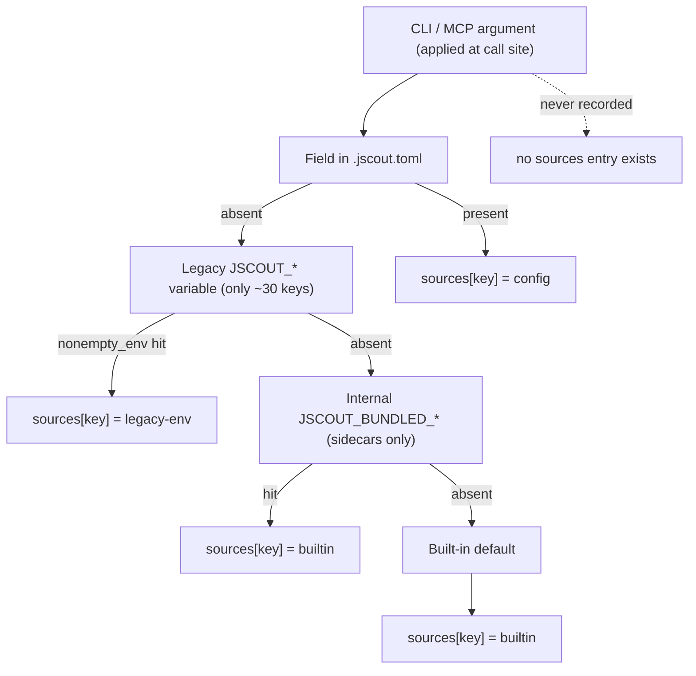
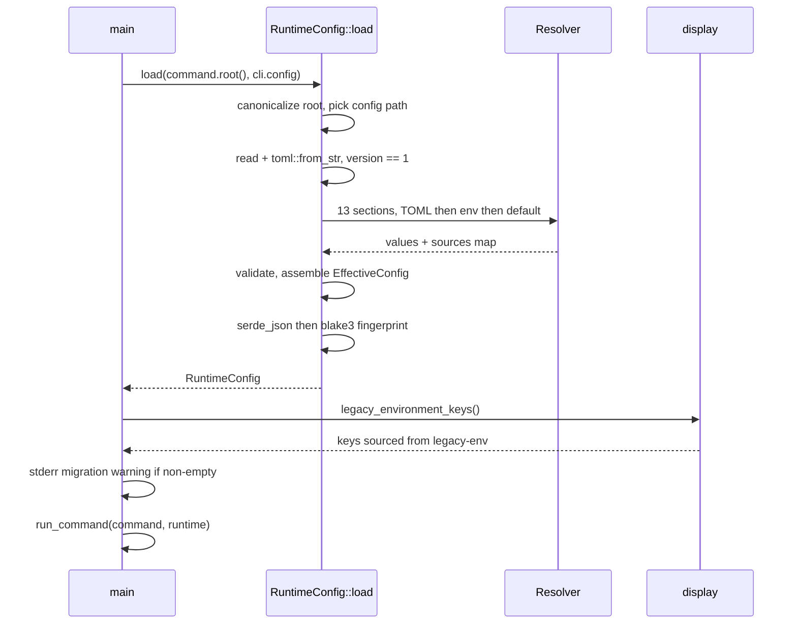
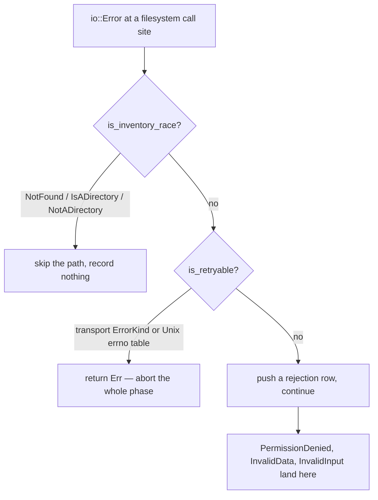

# Configuration and the I/O seam

Two small subsystems sit under everything else jscout does. The first turns one repository-local `.jscout.toml`, a shrinking set of legacy `JSCOUT_*` environment variables, and a table of built-in defaults into a fully-typed, fully-validated `EffectiveConfig` — plus a per-key provenance map recording which of those three layers actually supplied each of 75 keys, and a blake3 hash of the policy itself. The second decides, at every filesystem call site in the indexer, whether a `std::io::Error` means "skip this path", "abort this phase", or "record a rejection and keep going", behind a four-method filesystem trait that tests can fault-inject. They are unrelated in purpose and joined only by their position: both are load-bearing beneath every command, and both fail in ways that are easier to reason about when written down.

## Three type layers

`src/config.rs` is a 22-line module root with no `mod.rs`. It pins the contract in two constants — `FILE_NAME = ".jscout.toml"` and `SCHEMA_VERSION: u32 = 1` (`src/config.rs:16-17`) — and compiles the repository's own documented example into the binary, `TEMPLATE = include_str!("../.jscout.toml.example")` (`src/config.rs:19`). Note that this `SCHEMA_VERSION` is the *config file* schema and is still 1; the database `SCHEMA_VERSION` is at "31" and moves independently. Three private modules do the work: `load.rs` (1,274 lines — deserialization structs, the `Resolver`, `RuntimeConfig::load`, every validator, `init`), `model.rs` (251 lines — post-resolution types), `display.rs` (139 lines — `config show` rendering and the legacy-key query).

The file layer is `FileConfig` plus thirteen section structs (`src/config/load.rs:19-227`); every leaf is `Option<T>` and every struct carries `#[serde(deny_unknown_fields)]`. The optionality is load-bearing: "absent" must be distinguishable from "explicitly set to the value that happens to be the default", or per-key provenance could not be computed at all. `version: u32` is the one required field, so *omitting* it fails inside `toml::from_str` with a serde missing-field error, while setting it wrong hits the explicit bail at `load.rs:383-390` — two different messages for what a user experiences as one mistake.

The effective layer (`src/config/model.rs`) mirrors the same thirteen sections with the `Option`s collapsed and every path already an absolute `PathBuf`. Surviving optionality is semantic, not "unset": `EmbeddingSettings::provider = None` means embeddings are off; `TelemetrySettings::file = None` means telemetry is disabled, rendered `<disabled>` by `display_optional_path` (`load.rs:1006-1011`). The envelope is `RuntimeConfig { root, config_path, config_loaded, config_explicit, fingerprint, effective, sources }`, where `sources: BTreeMap<String, ValueSource>` and `ValueSource = Config | LegacyEnv | Builtin` is serialized kebab-case, so JSON prints `legacy-env`. The `BTreeMap` gives both `show_text` and `show_json` a deterministic key order for free.

## Precedence, per key

Look at the dashed edge. `CLI` sits above the chain but never reaches a `sources` entry: there is deliberately no `ValueSource::Cli` variant. Command-line and MCP arguments are folded in at the call site — `resolve_flag(enable, disable, configured)` (`src/commands/mod.rs:127-129`), `or_configured` for list arguments (`mod.rs:133-139`), and `--debug-json` promoting a response-byte budget to `usize::MAX` (`src/commands/docs.rs:173-177` for docs search, `effective_search_response_byte_limit` at `mod.rs:141-147` for code search). Recording those would mean threading provenance through every command; the price is that `config show` describes the file-plus-environment layer accurately and can never describe what a specific invocation will actually do.

Four generic `Resolver` helpers walk the chain and stamp `sources` on whichever branch fires: `string`, `optional_string`, `bool`, `usize` (`load.rs:253-362`). A fifth, `configured_or` (`load.rs:240-251`), is a two-level variant with no environment probe at all, and it backs every list-valued key plus the three `watch` numerics. `nonempty_env` trims and treats empty-or-whitespace as unset (`load.rs:1013-1018`), so `JSCOUT_RERANK_TOP=""` silently falls through to the default rather than erroring.

Three keys bypass the helpers entirely. `inference.port` goes through `resolve_port` (`load.rs:1060-1086`) with its own u16 parse and zero check. `llm.openai_compatible_providers` goes through `resolve_compatible_providers` (`load.rs:1170-1192`), whose legacy environment form is a JSON array parsed by `parse_legacy_compatible_providers`. `embedding.api_key_env` writes its `sources` entry by hand (`load.rs:620-632`) — it has *no* legacy-env branch at all, because its default is computed from the already-resolved `embedding.provider` and `embedding.url`.

A fourth resolver method breaks the three-branch story a second time. `optional_string_with_internal` (`load.rs:294-317`) probes the user-facing legacy variable, then an internal one, and labels an internal hit `Builtin` rather than `LegacyEnv`. The npm launcher passes bundled sidecar paths through the environment; labelling them `Builtin` stops an installed-package run from printing a migration warning on every invocation. The comment at `load.rs:310-311` says so outright. The cost is that `config show` reports `builtin` for exactly two keys whose value demonstrably came from the environment.

`Resolver::usize` runs `positive()` on both the config and the environment branch (`load.rs:349`, `:358`), so every usize-resolved key is strictly positive by construction. `configured_or` does not, which is why the `watch` floor checks are written out by hand at `load.rs:932-937`.

## Every key

Column three is the legacy `JSCOUT_*` name; an em dash means the key has no environment level and is config-or-default only.

| TOML path | Legacy env | Default |
| --- | --- | --- |
| `database.path` | — | `".jscout.db"` (`store::DB_FILE`) |
| `docs.enabled` | — | `true` |
| `docs.include` | — | `["**/*.md", "**/*.mdx"]` (`src/docs/mod.rs:7`) |
| `docs.exclude` | — | `[]` |
| `docs.search.vector` | — | `true` |
| `docs.search.rerank` | — | `true` |
| `docs.search.limit` | — | `10` |
| `docs.search.response_bytes` | — | `24000` |
| `search.vector` | — | `true` |
| `search.rerank` | — | `true` |
| `search.attach_memory` | — | `false` |
| `search.limit` | — | `10` (`search::DEFAULT_RESULT_LIMIT`) |
| `search.response_bytes` | — | `30000` (`search::DEFAULT_RESPONSE_BYTE_LIMIT`) |
| `search.file_roles` | — | `[]` |
| `search.origins` | — | `["repository", "workspace"]` (`origin::DEFAULT`) |
| `search.memory_limit` | — | `4`, ceiling 100 |
| `search.memory_depth` | — | `2`, ceiling `MAX_MEMORY_GRAPH_DEPTH` = 8 |
| `search.memory_nodes` | — | `2000`, ceiling 20000 |
| `search.expansion.enabled` | — | `false` |
| `search.expansion.mode` | — | `"paths"` (parsed by `ExpansionProjection::parse`) |
| `search.expansion.depth` | — | `1` |
| `search.expansion.seeds` | — | `3` |
| `search.expansion.paths` | — | `8`, ceiling `MAX_EXPANSION_PATH_LIMIT` = 50 |
| `search.expansion.nodes` | — | `40` |
| `search.expansion.edges` | — | `120` |
| `search.expansion.bytes` | — | `24000` |
| `search.expansion.min_confidence` | — | `"likely"` (`certain\|likely\|possible`) |
| `search.expansion.file_roles` | — | `["production", "unknown"]` (`file_role::DEFAULT_EXPANSION`) |
| `embedding.provider` | `JSCOUT_EMBED_PROVIDER` | none (`local\|voyage\|openai\|none`) |
| `embedding.model` | `JSCOUT_EMBED_MODEL` | provider-derived: `BAAI/bge-m3`, `voyage-code-3`, `text-embedding-3-small` |
| `embedding.revision` | `JSCOUT_EMBED_REVISION` | none |
| `embedding.url` | `JSCOUT_EMBED_URL` | none (rejected unless provider is `openai`) |
| `embedding.api_key_env` | — | derived: `VOYAGE_API_KEY` / `JSCOUT_EMBED_KEY` / `OPENAI_API_KEY` |
| `embedding.query_prefix` | `JSCOUT_QUERY_PREFIX` | none |
| `embedding.batch` | — | `64` |
| `embedding.origins` | — | `["repository", "workspace"]` |
| `inference.host` | `JSCOUT_INFERENCE_HOST` | `"127.0.0.1"` |
| `inference.port` | `JSCOUT_INFERENCE_PORT` | `8792` |
| `inference.url` | `JSCOUT_INFERENCE_URL` | derived `client_url(host, port)` (`load.rs:1131-1139`) |
| `inference.project` | `JSCOUT_INFERENCE_PROJECT` | none |
| `inference.uv` | `JSCOUT_UV` | `"uv"` |
| `inference.allow_remote` | `JSCOUT_INFERENCE_ALLOW_REMOTE` | `false` |
| `inference.batch_size` | `JSCOUT_INFERENCE_BATCH_SIZE` | `16` |
| `inference.max_length` | `JSCOUT_INFERENCE_MAX_LENGTH` | `4096` |
| `inference.model_cache_root` | `JSCOUT_MODEL_CACHE_ROOT` | none (tilde expansion allowed) |
| `reranker.url` | `JSCOUT_RERANK_URL` | none |
| `reranker.model` | `JSCOUT_RERANK_MODEL` | `"BAAI/bge-reranker-v2-m3"` |
| `reranker.revision` | `JSCOUT_RERANK_REVISION` | none |
| `reranker.top` | `JSCOUT_RERANK_TOP` | `50`, ceiling 100 (asymmetric — see below) |
| `reranker.max_chars` | `JSCOUT_RERANK_CHARS` | `4000` |
| `llm.model` | `JSCOUT_LLM_MODEL` | `"openai-codex:gpt-5.6-terra"` (`llm/config.rs:12`) |
| `llm.reasoning` | `JSCOUT_LLM_REASONING` | none |
| `llm.max_concurrency` | — | `1`, no ceiling |
| `llm.openai_base_url` | `JSCOUT_PI_AI_OPENAI_BASE_URL` | none |
| `llm.api_key_env` | — | `"OPENAI_API_KEY"` |
| `llm.auth_file` | `JSCOUT_PI_AI_AUTH_FILE` | `"~/.pi-ai/auth.json"` (tilde allowed) |
| `llm.openai_compatible_providers` | `JSCOUT_PI_AI_OPENAI_COMPATIBLE_PROVIDERS` (JSON array) | `[]` |
| `sidecars.node` | `JSCOUT_NODE` | `"node"` |
| `sidecars.gateway` | `JSCOUT_PI_AI_GATEWAY`, then `JSCOUT_BUNDLED_GATEWAY` as *builtin* | none |
| `sidecars.checker` | `JSCOUT_CHECKER_SIDECAR`, then `JSCOUT_BUNDLED_CHECKER` as *builtin* | none |
| `mcp.profile` | — | `"structural"` (`baseline\|structural`) |
| `mcp.source_view` | — | `"full"` (`full\|elided`) |
| `mcp.result_transport` | — | `"auto"` (`auto\|text\|structured`) |
| `telemetry.file` | `JSCOUT_TELEMETRY_FILE` | none |
| `telemetry.request_log` | — | none |
| `diagnostics.timing` | `JSCOUT_TIMING` | `false` |
| `diagnostics.debug` | `JSCOUT_DEBUG` | `false` |
| `index.dependencies` | — | `[]` |
| `watch.embed` | — | `false` |
| `watch.product` | — | `false` (requires `watch.embed`) |
| `watch.dependencies` | — | `[]` |
| `watch.enrich` | — | `false` |
| `watch.enrich_timeout_seconds` | — | `300` (must be > 0) |
| `watch.debounce_ms` | — | `2000` (must be > 0) |
| `watch.reconcile_seconds` | — | `600` (0 allowed = no periodic reconcile) |

That is 75 keys, all stamped unconditionally on every successful load. The whole of `[database]`, `[docs]`, `[search]`, `[mcp]`, `[index]`, `[watch]` plus `embedding.api_key_env`, `embedding.batch`, `embedding.origins`, `llm.max_concurrency`, `llm.api_key_env` and `telemetry.request_log` have no environment level — those surfaces were born in the config file, so there is no legacy behavior to preserve.

`llm.max_concurrency` (`load.rs:798-803`) is the newest of them. It is the ceiling on in-flight scouting model requests; model execution may overlap, validation and database publication do not (`model.rs:178-181`). It defaults to 1 because scouting was serialized before wave execution landed, and the sustainable value depends entirely on the operator's provider and account, which jscout cannot know. It is also uncapped — nothing rejects 128, and `tests.rs:290-298` pins that. The zero check is duplicated downstream at `llm/config.rs:203-205` and again at `llm/process.rs:563-565`, three copies of one rule.

## Validation, fingerprint, warning

Validation is a load-time gate running in section order database → docs → search → embedding → inference → reranker → llm → sidecars → mcp → telemetry → diagnostics → index → watch. Enumerations fail closed naming the offending key. `validate_endpoint` (`load.rs:1098-1113`) rejects query strings, fragments, non-http(s) schemes, empty authorities, and any `@` in the authority — that last clause is what keeps embedded credentials out of `inference.url`, `embedding.url`, `reranker.url`, `llm.openai_base_url` and every compatible-provider `base_url`. Documentation globs go to `docs::corpus::validate_patterns` (`load.rs:419-420`), which rejects a leading `!`, a trailing `/`, and unescaped brace alternation (`docs/corpus.rs:688-699`) — the config layer calls into the docs subsystem for its own shape rules rather than restating them.

Cross-key rules are the interesting ones. `embedding.url` is rejected unless the provider is `openai` (`load.rs:611-613`), and a custom URL flips the derived `embedding.api_key_env` default from `OPENAI_API_KEY` to `JSCOUT_EMBED_KEY` (`load.rs:614-618`) so a proxy endpoint does not silently consume your OpenAI credential. Two checks are *source-sensitive*: a non-loopback `inference.host` bails only when it came from config and `allow_remote` is false (`load.rs:699-706`), and `reranker.top > 100` bails from config but is silently clamped to 100 from `JSCOUT_RERANK_TOP` (`load.rs:741-747`, with a comment). The asymmetry preserves existing environment-driven deployments while making the new config surface strict — but it means the same value produces different behavior depending on where it came from, exactly the provenance-sensitivity the fingerprint design otherwise avoids.

`RuntimeConfig::load` is all-or-nothing: any failure returns before `EffectiveConfig` is assembled, so no partially-resolved config is observable. Validation also touches the filesystem beyond the config file — `validate_optional_file` (`load.rs:1122-1129`) fails the whole load if a configured `sidecars.gateway` or `sidecars.checker` path does not name an existing file, so a stale sidecar path blocks every command including `jscout stats`.

The fingerprint is `blake3(serde_json::to_vec(&effective))` (`load.rs:961-962`), computed over `EffectiveConfig` only. `sources`, `root`, `config_path`, `config_loaded` and `config_explicit` are all outside the hash, so identical policy reached through the file or through the environment hashes identically — pinned by `tests.rs:300-309`. It identifies behavior, not provenance, which also means a telemetry row cannot tell you whether a run was configured or environment-driven. It is never persisted; it is surfaced by `config validate` (`commands/mod.rs:38-48`), by MCP `initialize` as `configurationFingerprint` (`mcp.rs:238`), and by telemetry records as `config_fingerprint` (`mcp.rs:1969`).

Follow the last three messages. `legacy_environment_keys()` (`display.rs:133-138`) filters `sources` for `LegacyEnv` in `BTreeMap` order, and `main.rs:59-66` prints one line: `warning: legacy environment configuration supplied …; migrate these settings to .jscout.toml`. Because `main.rs:56` matches `Command::Config` *first* and returns without loading anything, the warning never fires for `jscout config show|validate|init` — the exact commands a user runs while migrating are the ones that stay silent about legacy usage. (`config show` and `config validate` do load a `RuntimeConfig` of their own at `commands/mod.rs:29` and `:38`; they just skip the warning branch. `config init` loads nothing.) Secrets are absent from `sources` by construction: only variable *names* are configured, and the values are read at point of use (`llm/process.rs:289-296`, `embed.rs:197`).

The three subcommands are declared at `cli.rs:628-648`, each taking a positional ROOT and honoring the global `--config` flag (`cli.rs:14-16`). `show [--json]` prints root, config path with loaded state, fingerprint, one line per rendered section, then the full `sources:` block; `--json` is `serde_json::to_string_pretty` over the whole `RuntimeConfig`, absolute local paths included, which makes it a poor thing to paste into an issue unedited. `validate` prints `configuration valid: <path> (<fingerprint>)` and does no other work. `init` opens with `create_new(true)` and writes `TEMPLATE` verbatim (`load.rs:983-992`), so a second run errors with `(refusing to overwrite)`.

`show_text` is not complete. There is no telemetry, diagnostics, index or watch line — the telemetry paths ride along on the `mcp:` line (`display.rs:108-115`), and the `diagnostics`, `index` and `watch` sections of `EffectiveConfig` are visible only through `--json` or by reading their entries in the `sources:` block.

## One flag, two shapes: `docs.enabled`

`docs.enabled = false` is not carried downstream as a boolean. `DocsSettings::indexing_include()` and `indexing_exclude()` return `&[]` when disabled (`model.rs:57-65`); the command layer passes those into `IndexOptions` (`commands/core.rs:285-286`) or `WatchOptions` (`commands/mod.rs:617-618`), the indexer copies them into `CorpusOptions` (`indexer.rs:387-391`), and the shared repository walk sets `documentation_active = !include.is_empty()` (`docs/corpus.rs:335`). One gate, no second code path in the walker. The gap: `IndexOptions::default()` still populates the full default globs (`indexer.rs:40-41`), so any caller constructing options directly rather than through the command layer indexes documentation regardless of config. MCP gates differently again — `docs.enabled.then_some(&runtime.effective.docs)` (`mcp.rs:296-300`, `:320-324`) — and `jscout docs embed|search` bail with an explicit message (`commands/docs.rs:203-210`).

`docs.enabled` (admission) and `docs.search.vector` (retrieval) are deliberately orthogonal; `tests.rs:92-121` asserts that `enabled = false` with `search.vector = true` loads cleanly and that `docs.include` is preserved for when it is re-enabled. The consequence is that `docs.search.*` values are validated and inert at the same time, which is easy to misread.

## The I/O seam

`io_policy.rs` is 106 lines of pure classification over `io::Error`, with no state and two inline tests.

`is_inventory_race` (`io_policy.rs:6-11`) matches a race observed after an inventory was taken: the file is simply treated as absent, and watcher events or periodic reconciliation converge later. `is_retryable` (`:16-33`) first excludes races outright — so the two predicates are mutually exclusive by construction, asserted at `:70-81` — then matches nine transport and interrupt `ErrorKind`s, then falls through to a fifteen-entry Unix errno table (`:37-58`: `EIO EINTR EAGAIN ENOMEM EBUSY EMFILE ENFILE ETIMEDOUT ENETDOWN ENETUNREACH ENETRESET ECONNABORTED ECONNRESET ENOBUFS ESTALE`). On non-Unix `retryable_os_error` is unconditionally `false` (`:61-64`), so Windows gets only the `ErrorKind` tier. `PermissionDenied` sits in neither class deliberately: it is a durable property of the checkout, so retrying would loop and skipping would silently shrink the snapshot. It becomes a recorded rejection instead. The three-way split is what lets indexing publish a snapshot that is either complete or aborted — never a clean-looking random subset.

Call sites include `indexer.rs:497-514` (repository source reads), `indexer.rs:1424-1439` (dependency reads), `workspace.rs:337-358` (the `classified_io` helper), `walk.rs:197-219` (recursing into `ignore::Error`'s `Partial`/`WithPath`/`WithLineNumber`/`WithDepth` variants), and `docs/corpus.rs:385-404`. Ordering is *not* universal. `docs/corpus.rs:522-540` (`handle_walk_error`) inverts it: retryable is tested first, and any error at the repository root — inventory race included — is escalated to a hard phase failure, on the reasoning that a root that cannot be listed is not a repository worth publishing.

`fs_ops.rs` is 42 lines: a `FileSystem` trait with exactly four methods — `read_to_string`, `metadata`, `read_dir`, `file_type` — and `OsFileSystem` delegating to `std::fs`. Its doc comment (`fs_ops.rs:5-14`) is unusual in naming its *exclusions*: canonicalization, existence probes, `package_entry_paths` traversal, resolver internals, and repository walking through `ignore` keep their existing owners. That is what stops the seam from creeping into a general VFS. It is threaded through `workspace::discover_with_fs`, `dependency`'s discovery and planning, and `indexer::IndexOperation<'a, F>`.

`test_fs.rs` (66 lines, `#[cfg(test)]`-only) layers one-shot faults over the real filesystem. `fail(path, err)` arms the next operation on a path; `fail_operation(FileOperation, path, err)` arms one exact operation kind. `take_failure` checks the operation-keyed map first and only then the path map (`test_fs.rs:38-43`) and removes the entry on a hit, so a fault fires exactly once and an earlier `metadata` probe cannot consume one armed for a later `read_to_string`. `file_type` keys off `entry.path()` rather than the parent directory (`:63`). Interior mutability via `RefCell` keeps all of this out of production modules. Consumers arm `ReadDir`/`ReadToString`/`Metadata` faults in `dependency.rs` and `workspace/tests.rs` to prove that a traversal failure aborts planning with the directory path in the message, that a manifest read failure is not silently dropped, and that a metadata failure preserves the zero-byte fallback.

The new documentation scanner reuses `io_policy` but not `fs_ops`. It walks with `std::fs` directly and injects faults through a function parameter instead — `capture: &dyn Fn(&Path, u64) -> io::Result<CapturedFile>` (`docs/corpus.rs:168-172`) — because its reads open with `O_NOFOLLOW | O_NONBLOCK` (`corpus.rs:626-649`), which the four-method trait cannot express. Two filesystem-injection idioms now coexist in one crate.

## Limits

`SearchSettings` and `ExpansionSettings` carry hand-written `Default` impls (`model.rs:90-140`) restating the same defaults `load` applies, with nothing forcing the two copies to stay in sync; `llm.max_concurrency`'s default of 1 lives in a third place (`llm/config.rs:199`) and its zero check in a fourth. `resolve_flag` is defined twice with identical bodies (`commands/mod.rs:127-129` and a copy at `commands/docs.rs:212-214`). `Command::root()` has a `Self::Config` arm (`commands/mod.rs:86`) that `main` can never reach. With `root = None` — only `jscout agent-guide` without `--install` — an unconfigured `database.path` stays the relative literal `.jscout.db` (`load.rs:405-409`) while any *configured* relative path bails `relative configuration paths require a repository root` (`load.rs:1159`). `resolve_path` with tilde expansion requires `HOME` (`load.rs:1146-1153`), so an unset `HOME` turns the default `llm.auth_file = "~/.pi-ai/auth.json"` into a hard load failure for every command. And the explicit-path bail at `load.rs:377-395` fires for a path that exists but is a directory, since `:378` requires `is_file()` — the message "explicit configuration does not exist" is then inaccurate.

Coverage is 15 tests in `src/config/tests.rs`, all driving the real `RuntimeConfig::load` against `tempfile` roots with a physically written `.jscout.toml` — no mocking of the file layer. They pin defaults including all seven `docs.*` keys and `llm.max_concurrency = 1`, provenance stamps alongside `show_text`/`show_json` rendering, `enabled = false` collapsing `indexing_include()` to empty, fingerprint movement under policy change and stability under source change, `deny_unknown_fields` in both `[search]` and `[docs]`, glob-shape rejection, the search ceilings, a table of fail-closed cases, `init` idempotence, and legacy camelCase provider JSON round-tripping. One assertion is a design guard rather than a behavior check: `!TEMPLATE.contains(".jscout-docs.db")`, which stops the rejected separate-documentation-database design from reappearing in the shipped template.
