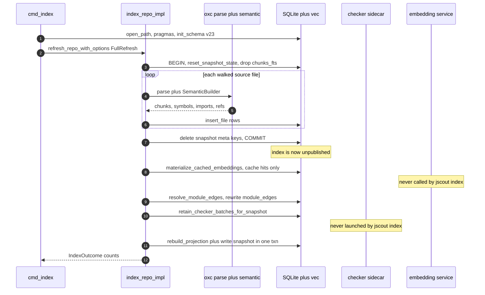
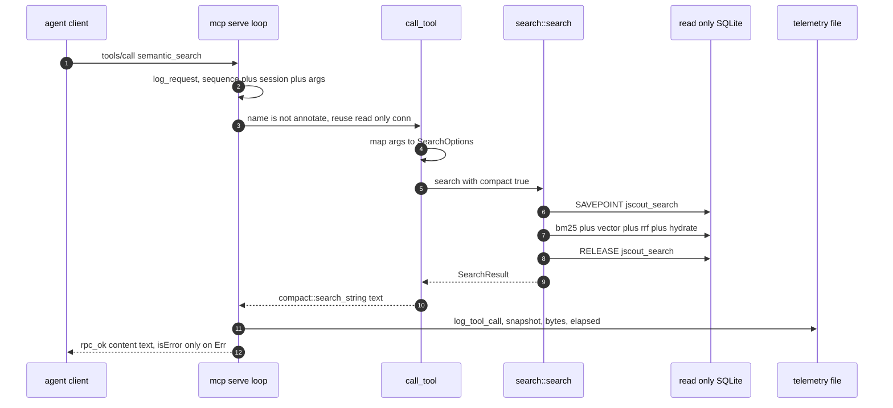
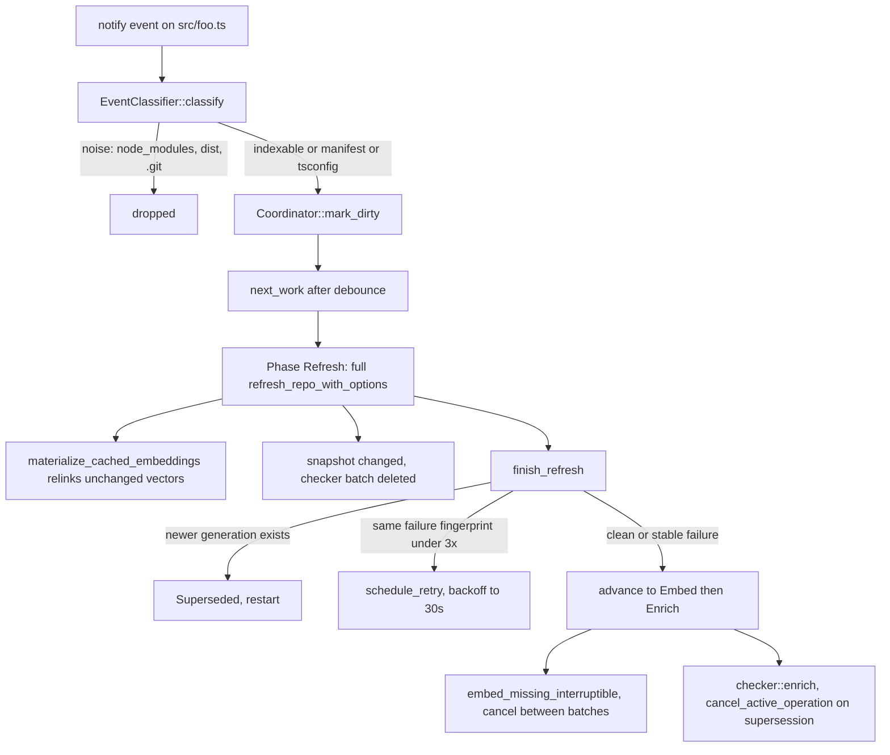

# End-to-end execution traces

This part walks four real control paths through jscout from the first line of `main` to the last row committed or the last byte written to stdout: a cold index of an unseen repository, a lexical+vector search from the CLI, one `semantic_search` call arriving over MCP stdio, and a single file edit picked up by the watcher. The module-by-module descriptions elsewhere in this folder each own one stage, and the interesting behaviour — when the snapshot marker disappears, which failures degrade versus abort, which sidecars are actually contacted — only becomes visible when the stages are laid end to end. Line numbers are from the working tree at commit `a102597`.

## Trace 1 — cold index (`jscout index <root>`)

The clap-derived `Cli::parse()` at `src/main.rs:798` produces `Command::Index { root, database, dependencies }`, dispatched to `cmd_index` at `src/main.rs:803`.

1. `cmd_index` starts a wall clock and calls `open_database_for_write` (`src/main.rs:1569`, `src/main.rs:1382`), which resolves to `store::open(root)` → `store::open_path(root/.jscout.db)` (`src/store.rs:42`, `src/store.rs:105`).
2. `open_path` calls `register_sqlite_vec` (`src/store.rs:13`), which uses a `std::sync::Once` and an unsafe transmute of `sqlite_vec::sqlite3_vec_init` into `sqlite3_auto_extension`, so sqlite-vec is registered once per process and applies to every later connection.
3. If a `meta` table already exists, `open_path` reads `schema_version` (`src/store.rs:117`). A version below `DURABLE_SCHEMA_FLOOR = 16` or above `SCHEMA_VERSION = "23"` bails; anything in between runs `rebuild_legacy_disposable_schema`, which drops every source-derived table and empties (but keeps) the dynamic `vec_*` tables (`src/store.rs:127`, `src/store.rs:156`).
4. Pragmas `journal_mode=WAL`, `synchronous=NORMAL`, `foreign_keys=ON`, then `init_schema` (`src/store.rs:143-151`, `src/store.rs:234`).
5. `indexer::refresh_repo_with_options` (`src/main.rs:1571`) is a thin wrapper over `index_repo_impl(root, conn, options, true, IndexMode::FullRefresh)` (`src/indexer.rs:150`). The whole loop below is single-threaded on one connection.
6. `root.canonicalize()` (`src/indexer.rs:184`), then `ensure_extraction_version` (`src/indexer.rs:443`) compares `meta.extraction_version` against `entity::EXTRACTION_VERSION`; a mismatch blanks every `files.hash` and drops `resolved_edges`/`graph_nodes` plus the snapshot meta keys.
7. `walk::source_files` (`src/walk.rs:22`) runs an `ignore::WalkBuilder` honoring gitignore/global/exclude, prunes `node_modules, dist, build, .next, coverage, out` (`src/walk.rs:9`), and keeps only extensions in `EXTENSIONS` while rejecting `*.d.ts/.d.mts/.d.cts` — pure type declarations have no runtime and are dropped outright (`src/walk.rs:11-18`).
8. Because `mode == FullRefresh`, the `existing` map is left empty (`src/indexer.rs:203`) and `extraction_reset` is forced true (`src/indexer.rs:230`). There is no per-file diffing on this path at all.
9. `BEGIN`, then `store::reset_snapshot_state` (`src/indexer.rs:240`, `src/store.rs:954`): `reset_extraction_state` deletes vec rows and then children before parents across the disposable tables, `DROP TABLE chunks_fts` and recreates it from the single `CHUNKS_FTS_CREATE` constant (`src/store.rs:31`), after which `package_instances` and the `root/snapshot/projection_version/resolution_hash` meta keys go. The comment at `src/indexer.rs:224-231` names the reason: FTS5 is not FK-aware and per-file `store::delete_file` cascades through fully populated evidence tables, which is pathological at ~100% invalidation.
10. Per file, in path order: `fs::read_to_string` (failures recorded via `record_failure(rel, "read", …)` and skipped, `src/indexer.rs:254`), `blake3::hash` for content identity (`src/indexer.rs:261`), `file_role::classify` into `generated/fixture/test/documentation/production` (`src/indexer.rs:262`).
11. `extract_file` (`src/indexer.rs:480`) calls `parse::with_parsed`, which allocates, derives `SourceType::from_path`, parses with oxc, and returns `anyhow!("parser aborted: …")` when `ret.panicked`. Inside the closure three producers run against the same allocation: `Chunker::chunk_program`, `graph::extract(ret, semantic)`, and `LineIndex::new(source)` (`src/indexer.rs:481-489`).
12. `insert_file` (`src/indexer.rs:493`) writes one `files` row, then `chunks` plus the mirrored `chunks_fts` row (rowid = chunk id, maintained by hand), then `symbols`, `imports`, `exports`, `contract_imports`, `contract_exports`, `events`, `member_calls`, `entity_sites`, `refs`. Each span-bearing row gets its `chunk_id` from a linear scan over the chunk span list.
13. Deleted files are removed (`src/indexer.rs:299`; a no-op here, the tables are already empty), then `DELETE FROM meta WHERE key IN ('snapshot','projection_version','resolution_hash')` and `COMMIT` (`src/indexer.rs:322-327`). **This is the publication boundary**: from here until step 18 the database has rows but is not readable by any query surface.
14. `workspace::WorkspaceMap::build` (`src/indexer.rs:329`), then `dependency::discover` / `plan_packages` / `synchronize_instances` / `index_dependency_files` (`src/indexer.rs:330-333`). Without `--deps`, discovery is effectively a no-op.
15. `embed::materialize_cached_embeddings` (`src/indexer.rs:335`) re-links already-cached vectors — `embeddings` is keyed by `chunk_hash + profile_id` and survived step 9 — into `embedding_index_entries` and `vec_embeddings_<dim>`. On a truly cold repository `embedding_profiles` is empty and this returns immediately.
16. `resolve_module_edges` (`src/indexer.rs:338`, defined at `src/indexer.rs:860`) builds three `oxc_resolver::Resolver`s: workspace-aliased with `TsconfigDiscovery::Auto`, workspace-aliased with no tsconfig (fallback when a tsconfig's `extends` chain fails to load), and an alias-free one for dependency-origin importers. It collects every distinct `(file_id, request)` from a five-way UNION over `imports`, `exports.from_request`, `refs.target_request`, `contract_imports`, `contract_exports`, then `BEGIN`, `DELETE FROM module_edges`, resolves each pair through a memo cache, `COMMIT`.
17. `compute_resolution_hash` (`src/indexer.rs:344`) blake3-hashes every `module_edges` row; `compute_snapshot_with_resolution` (`src/indexer.rs:345`) hashes per-file identity plus package provenance and folds in the resolution hash. Resolution is hashed separately because its inputs — tsconfigs, manifests, `node_modules` layout — are not indexed content. `store::retain_checker_batches_for_snapshot` (`src/indexer.rs:350`, `src/store.rs:967`) then deletes every checker batch whose `source_snapshot` differs.
18. The identity fast path at `src/indexer.rs:358-381` republishes the three meta keys under `BEGIN IMMEDIATE` when nothing changed — never taken on a cold index, since step 9 wiped the previous identity. Otherwise `structural::rebuild_projection` (`src/indexer.rs:383`, `src/structural.rs:431`) loads files, `ModuleGraph::load_with_contracts` and symbols, then under one `BEGIN IMMEDIATE` deletes `resolved_edges`/`graph_nodes`/`entities`, inserts a `file:` node per file and a `sym:` node per symbol, runs six projectors in order (`project_module_edges` `:651` → `project_references` `:838` → `project_entities` `:1031` → `project_member_calls` `:1924` → `project_checker_enrichments` `:2103` → `project_events` `:2271`), and upserts `meta.snapshot` and `meta.projection_version` **inside the same transaction** (`src/structural.rs:542-550`).
19. `meta.resolution_hash` is written *after* that commit (`src/indexer.rs:384`), then `recon::reconcile_file_policy_after_index` (`src/indexer.rs:395`) — infallible by design, clearing `repository_file_policy` and falling back to neutral defaults rather than failing the index.

Two sidecars exist in this system and neither is contacted here. The diagram below shows the cold index as the sequence actually executes; look at the two participants that receive no messages.

The `EMB` and `CHK` notes are the load-bearing part. Vector production only happens in `cmd_embed` (`src/main.rs:1418`) or the watcher's embed phase; the checker only launches from `checker::enrich` via `checker::launch` (`src/checker/enrich.rs:209`, `src/checker/mod.rs:60`), reached from `jscout enrich` (`src/main.rs:1136`) or the watcher's enrich phase. `jscout index` reads whatever checker batch survived step 17 and re-links whatever vectors were already cached; it produces neither.

### Where this fails

| Failure | Mechanism | What the user sees |
|---|---|---|
| Durable schema below the floor | `src/store.rs:135` | `uses unsupported durable schema v<N>; preserve the old file if its embedding cache or semantic memory matters, then create a fresh index`; exits before any work |
| Root does not exist | `src/indexer.rs:184` | raw `No such file or directory (os error 2)` |
| Unreadable or non-UTF-8 file | `src/indexer.rs:254` | counted in `failed`, printed by `report_failures` as `[read] path: …`; index completes |
| Fatal oxc parse error | `src/parse.rs` `panicked` branch | `[extract] path: parser aborted: <diagnostic>`; index completes |
| Yarn PnP with `--deps` | `src/dependency.rs` PnP bail | hard error, and step 13 has already removed the snapshot marker, so the DB is left unpublished |
| Crash between step 13 and step 18's commit | intentional | rows exist, `meta.snapshot` does not; every reader gets `has no published structural snapshot; run jscout index` (`src/store.rs:96`) |

The tradeoff in step 13 is deliberate and worth naming: deleting the snapshot marker before the fallible resolution and projection phases guarantees a partial rebuild is never queryable, at the cost of a hard availability gap — a repository under `jscout index` is unsearchable for the whole duration, not just at the swap.

## Trace 2 — query (`jscout search "<q>"`)

1. `Command::Search` maps to `cmd_search(root, database, query, no_vector || lexical_only, json, debug_json, SearchOptions{..})` (`src/main.rs:1384`); defaults come from `search::DEFAULT_RESULT_LIMIT = 10` (`src/search.rs:11`) and `origin::defaults()`.
2. `open_database_read_only` → `store::open_path_read_only` (`src/main.rs:1389`, `src/store.rs:53`): the file must already exist, is opened `SQLITE_OPEN_READ_ONLY` with `query_only=ON`, `schema_version` must equal `23`, and **both** `meta.snapshot` and `meta.projection_version` must be present. An unindexed checkout can never look usable.
3. Unless `--no-vector`, `embed::Provider::from_env()` (`src/embed.rs:153`) resolves `JSCOUT_EMBED_PROVIDER` ∈ `local | voyage | openai`; empty or `none` yields `Ok(None)`.
4. `search::search` (`src/search.rs:390`) validates roles, origins and memory bounds, then runs everything inside `store::with_read_snapshot(conn, "jscout_search", …)` (`src/store.rs:843`) — a named SAVEPOINT pinning one SQLite read view across the dozens of queries that follow, which nests safely when expansion re-enters neighborhood traversal.
5. `ranked_hits` (`src/search.rs:778`) computes `candidate_pool_limits` (`src/search.rs:896`): `pool = max(limit,10)*5`, and `vector_pool = pool*4` when a role filter is active, because sqlite-vec applies `k` before jscout can join `files.role`.
6. BM25 first: `fts_query` (`src/search.rs:242`) splits on non-`[alnum_$]`, quotes each token and joins with ` OR `; the statement scores `bm25(chunks_fts, 2.0, 4.0, 3.0, 1.0)` — content 2, name 4, symbols 3, path 1.
7. If a provider exists, `vector_ranking` (`src/search.rs:291`) → `embed::vector_search` (`src/embed.rs:1445`) → `ready_search_profile` (`src/embed.rs:1272`, which requires a profile row, a synced index and an existing `vec_embeddings_<dim>` table) → `embed_query` → `exact_vector_search` (`src/embed.rs:1492`), one KNN statement per requested origin, scored `1.0 - distance`.
8. Failures here do not abort: `record_vector_ranking` (`src/search.rs:1015`) prints `vector search unavailable: {e}` to stderr and sets `RetrievalStatus::vector_degraded` with a remediation string from `embed::code_vector_failure_action` (`src/embed.rs:118`).
9. Each ranking is role-prefiltered and truncated to `pool` (`src/search.rs:805-807`), then fused by `rrf(&rankings, 60.0)` (`src/search.rs:378`) — raw BM25 and cosine magnitudes are discarded, only rank position survives.
10. With `rerank` and a configured `Reranker::from_env()`, the top `JSCOUT_RERANK_TOP` (default 50, capped 100) candidates become documents truncated to `JSCOUT_RERANK_CHARS` (default 4000) and are POSTed as one batch (`src/search.rs:813-846`). The response is strictly validated — every candidate id exactly once — and on any error the code prints `rerank unavailable, using RRF order: {e}` and keeps the RRF order.
11. When no explicit role filter was given, `apply_repository_policy_penalty` (`src/search.rs:868`) reweights each candidate by `recon::chunk_policy_penalty(conn, chunk_id) / (rank+1)` and re-sorts, ties broken by original rank.
12. `load_hit` (`src/search.rs:1031`) hydrates each surviving id: path, role, origin, kind, name, line range, content, symbols, plus `project_chunk_anchors` (`src/search.rs:1393`), a bounded `uses` list and `used_by` counts. Hydration stops at `limit`.
13. If `include_memory`, `semantic::search_with_provider` ranks artifacts and `select_attached_memory` (`src/search.rs:481`) drops every artifact not reachable from the returned code — tier 0 shares an anchor or evidence file, tier 1 is within `memory_depth` likely/certain hops in `resolved_edges`, tier 2 is related through `semantic_relations`.
14. `apply_response_budget` (`src/search.rs:1124`) renders the payload and sheds content in a fixed priority order until it fits, calling `settle_rendered_bytes` (`src/search.rs:1320`) to re-render up to eight times, since `rendered_bytes` is itself part of the serialized payload. The top hit is never dropped; if even the minimum envelope exceeds the limit it errors (`src/search.rs:1259`).

### Where this fails

| Failure | Where | What the user sees |
|---|---|---|
| Repo never indexed | `src/store.rs:55` | `index database … does not exist; run 'jscout index' first` |
| Stale schema | `src/store.rs:87` | `uses schema v<N>, but this jscout requires v23` |
| Index left unpublished | `src/store.rs:96` | `has no published structural snapshot; run 'jscout index'` |
| Garbage `JSCOUT_EMBED_PROVIDER` | `src/embed.rs:210` | hard error naming the four accepted values |
| Provider set, never embedded | `src/embed.rs:1272` | degrades: `vector=degraded`, results from BM25 alone, remediation `run jscout embed <root>` |
| Embedding service down | `src/embed.rs:118` | degrades: action string `start or repair the configured embedding service` |
| Reranker down or malformed | `src/search.rs:840` | degrades: `reranker=degraded`, RRF order kept |
| `--response-bytes` too small | `src/search.rs:1259` | hard error naming the minimum envelope |

The split is consistent and intentional: index-integrity and budget-impossibility conditions are errors, external-service outages are status fields.

## Trace 3 — one MCP `semantic_search` call

`mcp::serve` (`src/mcp.rs:40`) canonicalizes the root, opens the connection **read-only** (`src/mcp.rs:49-52`), resolves the embedding provider once, opens optional telemetry and request-log files in append mode, and then reads newline-delimited JSON from `stdin.lock().lines()` (`src/mcp.rs:83`). The sequence below is one `tools/call` round trip; watch where the write connection does *not* appear.

The `CT` step matters: the write connection is opened lazily and only when `name == "annotate"` *and* the profile is `Structural` (`src/mcp.rs:132-138`), so a retrieval-only session never takes a writer lock or triggers schema creation. `call_tool` maps arguments to `SearchOptions` at `src/mcp.rs:597-663`, defaulting `limit` to 10, `expand` to false, `rerank` to true, `memory_limit` to 4, `response_bytes` to `DEFAULT_RESPONSE_BYTE_LIMIT`, and gating both `include_memory` and `include_neighborhood_followups` on `profile == ToolProfile::Structural`. `expand` in the baseline profile bails with `structural expansion is unavailable in the baseline MCP profile` (`src/mcp.rs:604`). From there the pipeline is byte-identical to Trace 2 with `compact = true`.

Rendering goes through `compact::search_string` (`src/compact.rs:15`) unless `debug` is set, in which case the full pretty-printed `SearchResult` is returned. `compact_hit` (`src/compact.rs:136`) emits `at`, `symbol`, `kind`, `snippet`, anchors and `followups` — the follow-ups carry the exact anchor and snapshot string, so the agent's next call cannot fabricate an identifier. The semantic-memory block is labelled `"trust": "untrusted"` and emitted header-only.

The final response shape is the notable part. `Ok(text)` and `Err(e)` both produce a JSON-RPC **success** (`src/mcp.rs:170-179`); the error case sets `"isError": true` with the message as text. Tool failures are MCP tool failures, not transport failures, so a bad query never looks like a dead server.

### Where this fails

| Failure | Where | What the agent sees |
|---|---|---|
| Unindexed repo at startup | `src/mcp.rs:49` → `src/store.rs:55` | the server fails to start; the client reports a dead server |
| Unknown method | `src/mcp.rs:180` | JSON-RPC `-32601 method not found: <m>` |
| Malformed line | `src/mcp.rs:89` | `-32700 parse error: …` with `id: null` |
| `expand` in baseline | `src/mcp.rs:604` | `isError: true` with the profile message |
| Vector or rerank service down | `src/search.rs:1015` | not an error — `retrieval.vector = "degraded"` plus a remediation string in the payload |
| Telemetry write failure | `src/mcp.rs:210` | stderr warning only; the call still returns its result |

## Trace 4 — one file edited under `jscout watch`

There is no incremental indexing. `index_repo_with_options`, the per-file incremental entry point, is `#[cfg(test)]` only (`src/indexer.rs:139`), and `cmd_index` carries a comment explaining that it omits an "unchanged" count because that count would always read 0 (`src/main.rs:1577-1579`). Every watcher generation is a full disposable-snapshot rebuild; what makes it cheap is that the durable planes survive it.

1. `Command::Watch` → `watch::watch` (`src/watch.rs:489`), which runs `validate_options` (`src/watch.rs:771`), resolves the provider eagerly when `--embed` is set — bailing with `--embed requires JSCOUT_EMBED_PROVIDER=local, voyage, or openai` (`src/watch.rs:495`) — and calls `watcher.watch(&root, Recursive)` **before** the startup refresh so edits during a long first pass are queued (`src/watch.rs:507`).
2. `Coordinator::new` (`src/watch.rs:94`) marks generation 0 dirty with reason `startup` so generation 1 runs without waiting out the debounce.
3. A notify event reaches `ingest_event` (`src/watch.rs:902`) → `EventClassifier::classify` (`src/watch.rs:343`). Paths in `node_modules/.git/dist/build/.next/coverage/out` are noise (`src/watch.rs:1029`); indexable files, `package.json`, lockfiles, `tsconfig*.json`, `.gitmodules` and `.d.ts` variants are relevant (`src/watch.rs:1005`). `src/foo.ts` yields the reason string `source:src/foo.ts`.
4. `Coordinator::mark_dirty` (`src/watch.rs:119`) bumps `desired_generation` when the current one is already complete or in flight and resets the ready/retry state. Multiple edits inside one debounce window coalesce into a single successor generation.
5. `next_work` (`src/watch.rs:149`) returns `Work{generation, phase: Refresh}` once `now >= last_dirty_at + debounce`, and `run_refresh` (`src/watch.rs:784`) opens a phase connection with a 5 s `busy_timeout` (`src/watch.rs:959`) and calls the same `indexer::refresh_repo_with_options` as Trace 1.
6. Two things survive the reset and one does not. Content-addressed `embeddings` rows survive `reset_extraction_state`, so `materialize_cached_embeddings` (`src/indexer.rs:335`) re-links every unchanged chunk's vector with no provider call — only `src/foo.ts`'s new chunk hashes are missing. Checker facts survive only if the recomputed snapshot is byte-identical (`src/indexer.rs:350`); editing a file changes `files.hash`, changes the snapshot, and therefore deletes the entire checker batch until an enrich phase reruns.
7. `failure_fingerprint` (`src/watch.rs:987`) blake3-hashes the sorted `(path, stage, error)` triples of every per-file failure. `finish_refresh` (`src/watch.rs:208`) returns `Superseded` when a newer generation exists, schedules a retry with `500ms << (attempts-1)` capped at 30 s while the same fingerprint repeats fewer than `STABLE_FAILURE_THRESHOLD = 3` times (`src/watch.rs:20`), and otherwise accepts the failure as stable and completes the generation degraded.
8. Watch targets are re-collected and `drain_events` runs once more *before* the coordinator judges the generation (`src/watch.rs:600`), so an edit that landed during the refresh is counted against the same decision.
9. `advance` (`src/watch.rs:278`) moves Refresh → Embed (if `--embed`) → Enrich (if `--enrich`). `run_embedding_interruptible` (`src/watch.rs:803`) spawns a worker with its own connection running `embed::embed_missing_interruptible`, while the main thread polls at `OPTIONAL_PHASE_POLL = 100ms` and flips an `AtomicBool` on supersession. The worker checks that flag only between provider batches, which means completed vectors are already committed to the durable cache and are reused by the next generation.
10. `run_enrichment_interruptible` (`src/watch.rs:831`) spawns `checker::enrich`; on supersession the main thread calls `checker::process::cancel_active_operation` (`src/checker/process.rs:182`), which sends `{"kind":"cancel","target_id":…}` over stdin. The Node host matches it against its single in-flight request, terminates the worker thread and replies with `canceled` for the target plus `cancel_result` for the cancel itself (`checker/src/main.mjs:113-123`).
11. `activate_staging_batch` (`src/checker/enrich.rs:1619`) re-checks `current_snapshot(conn) == snapshot` inside `BEGIN IMMEDIATE` and bails with `staged work retained` if the watcher refreshed underneath it. Staged rows persist so the next run resumes rather than restarting.

The consistency point is precise: the database becomes readable again the instant `rebuild_projection`'s transaction commits, because `meta.snapshot` and `meta.projection_version` are written in the same transaction as `graph_nodes` and `resolved_edges` (`src/structural.rs:542-550`) and every read surface requires both. A concurrent reader holding `open_read_only` plus `with_read_snapshot` sees either the old snapshot or the new one, never a mixture. What it cannot see is the window between `src/indexer.rs:327` and that commit, during which the marker is absent and reads fail outright.

### Where this fails

| Failure | Where | What the user sees |
|---|---|---|
| Bad flag combination | `src/watch.rs:771` | startup bail, e.g. `--reconcile-seconds must exceed --debounce-ms or be zero` |
| `--embed` without provider | `src/watch.rs:495` | startup bail naming the three accepted providers |
| Refresh throws | `src/watch.rs:620` | `phase=refresh status=failed … error=…` then `status=retry-wait`; the DB stays without `meta.snapshot`, so every reader gets `no published structural snapshot` until a retry succeeds |
| Persistent parse failure | `src/watch.rs:225` | two retry-wait cycles, then `status=degraded` — the generation completes with that file missing rather than retrying forever |
| Sidecar missing | `src/checker/mod.rs:44` | `TypeScript checker sidecar not found: pass --sidecar-path, set JSCOUT_CHECKER_SIDECAR, …` as an enrich-phase failure |
| Sidecar unresponsive | `src/checker/process.rs:493` | after `--enrich-timeout` the child is killed and the error is a timeout |
| Sidecar protocol drift | `src/checker/process.rs:298` | `checker speaks protocol N, jscout requires 2` |
| DB busy | `src/watch.rs:965` | 5 s `busy_timeout`, then a phase error and backoff retry |
| Channel disconnect | `src/watch.rs:745` | the loop returns `Ok(())` and `jscout watch` exits silently — a genuine gap, since a dropped watcher is indistinguishable from a clean shutdown |

The recurring shape across all four traces is that the snapshot marker is the only publication switch, and everything expensive hangs off it: the fast path in Trace 1 step 18 exists because recomputing an identical snapshot proves the projection rows are already correct; checker batch retention in step 17 exists because that same equality proves type facts are still valid; and the watcher's cost model in Trace 4 rests on the durable `embeddings` cache outliving a truncation that wipes everything else. See [`05-storage-schema.md`](05-storage-schema.md) for the table split, [`07-retrieval.md`](07-retrieval.md) for ranking internals, [`11-incremental-and-watch.md`](11-incremental-and-watch.md) for the coordinator state machine, and [`17-sharp-edges.md`](17-sharp-edges.md) for the risks these traces expose.
