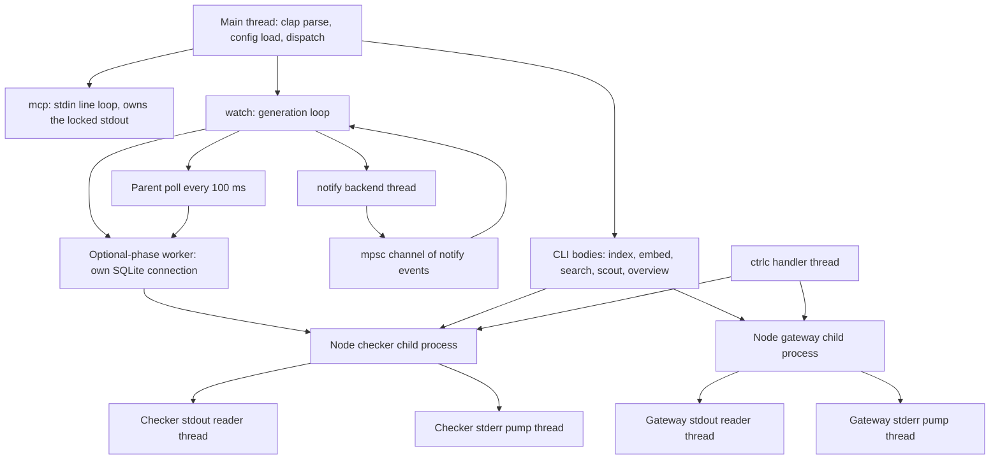
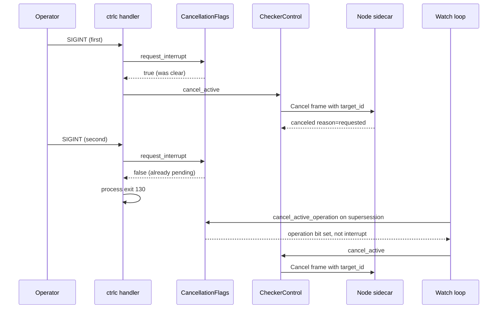

# Cross-cutting concerns

Some of jscout's behavior belongs to no module. The process has no async runtime, so every long operation is a blocking call on a thread that something else must poll to interrupt; sidecar child processes need drained pipes, so reader threads exist whether or not anything else is concurrent; stdout is a JSON-RPC frame stream under `jscout mcp`, so the entire library writes to stderr by convention rather than by type; a Ctrl-C during enrichment must reach a Node subprocess and then, if pressed again, kill the process outright. This document covers those seams — threading, signals and cancellation, the two telemetry sinks, error conventions, transaction and read-snapshot discipline, hard resource ceilings, the injected filesystem, and the source conventions the recent restructure settled on. Configuration precedence is not covered here; see [12-configuration.md](12-configuration.md).

## There is no async runtime

`Cargo.toml` lists 22 runtime dependencies and none of them is `tokio`, `async-std`, `smol`, or `futures`; `src/` contains zero `async fn` and zero `.await`. Every I/O call in the crate blocks: `rusqlite` (bundled SQLite) blocks, `ureq` blocks, `oxc` parsing is CPU-bound and synchronous, and both sidecars are ordinary child processes talking newline-delimited JSON over pipes. There is also no work-stealing pool — no `rayon`, no `std::thread::scope` fan-out — so indexing walks and parses files one at a time on the main thread. That is a real throughput ceiling on large repositories and it is not mitigated anywhere in the crate; the design buys determinism and a single `&Connection` threaded through every function signature instead.

Threads exist for exactly two reasons: a child process's `stdout` and `stderr` must be drained or the child blocks on write, and a blocking phase that the watcher may need to abandon must run somewhere the watcher can outlive. Seven `thread::spawn` calls exist in production code — three in `src/watch.rs` (`:1112`, `:1140`, `:1176`), two in `src/llm/process.rs` (`:228`, `:245`), two in `src/checker/process.rs` (`:259`, `:274`) — plus whatever backend thread the `notify` crate starts for filesystem events.

Look at where the arrows fan out below: every branch from `MAIN` is a mode, and only the `watch` and sidecar branches produce additional threads at all.

`MAIN` is `src/main.rs:51-68`: parse, split `Command::Config` out before any config load, otherwise load `RuntimeConfig`, warn about legacy environment keys, dispatch. `NOTIFY` and `CHAN` come from `src/watch.rs:663-668`, where a `mpsc::channel::<notify::Result<notify::Event>>()` is created and the watcher subscribes to the root *before* the startup refresh, so edits during a long first pass are queued rather than lost. `WORKER` and `POLL` are the interruptible-phase shape: `run_embedding_interruptible` (`src/watch.rs:1101`) moves owned `PathBuf`s and an `Arc<embed::Provider>` into a thread that opens its *own* database handle (`open_phase_database`, `src/watch.rs:1113`) and passes `embed_missing_interruptible` a `|| worker_canceled.load(Ordering::SeqCst)` closure; the parent then spins `while !worker.is_finished()`, calling `monitor.poll()` and sleeping `OPTIONAL_PHASE_POLL = 100ms` (`src/watch.rs:21`). `run_semantic_embedding_interruptible` (`:1131`) is the same shape, and `run_enrichment_interruptible` (`:1159`) is the same loop with a different cancel action. A worker panic is converted, not propagated: `.map_err(|_| anyhow::anyhow!("embedding worker panicked"))`.

The consequence nobody states in the code: a watch generation running embedding, semantic embedding, and enrichment holds up to four SQLite connections to the same WAL database — the coordinator's plus one per worker — and burns a thread spinning at 10 Hz for the duration. That is the price of not having a runtime with cancellation tokens.

## stdout is a protocol; stderr is the log

`jscout mcp` takes `std::io::stdout().lock()` once at `src/mcp.rs:192-194` and holds it for the life of the server, framing JSON-RPC through `write_msg` (`src/mcp.rs:380`). Any library module that printed a line to stdout would corrupt a frame. The discipline is enforced by convention only — no newtype, no `#[deny]` — but it holds: real `println!` calls exist in exactly six files, `src/commands/core.rs` (43), `src/commands/scout.rs` (23), `src/llm/mod.rs` (11), `src/commands/mod.rs` (10), `src/checker/mod.rs` (9), and `src/inference.rs` (6). The last three are `doctor` subcommand bodies that live next to their protocol clients rather than under `commands/`. Every retrieval, indexing, and storage module writes only to stderr.

There is no logging crate. Sixty `eprintln!` calls in production code are the entire logging system, and they speak three incompatible dialects: `timing <key>=<value>` (`src/structural.rs:543,555,568,573,586`, `src/indexer.rs:561`), `timing: <label> <value>` (`src/search.rs:1453,1462,1498`), and a watch-specific `key=value` line shape (`src/watch.rs:1277`, `:777`). Both timing dialects are gated on `runtime.effective.diagnostics.timing`, threaded into MCP at `src/mcp.rs:285,304` and into the CLI at `src/commands/mod.rs:276,600`. Only seven stderr writes carry a `warning: ` prefix (`src/main.rs:60`, `src/watch.rs:708`, `src/mcp.rs:376,994,1876`, `src/commands/scout.rs:57,81`); the rest are unprefixed, so machine-parsing jscout's stderr means matching per-site shapes.

## Signals and the two-stage interrupt

Both sidecar clients install a `ctrlc` handler exactly once, through a `OnceLock` that memoizes the installation *result* so a second attempt reports the original failure rather than re-registering (`src/checker/process.rs:144-152`, `src/llm/process.rs:72-81`). The handler itself is four lines and identical in both: if `request_interrupt_cancellation()` returns false — meaning the pending bit was already set — call `std::process::exit(130)` (`src/checker/process.rs:155-159`, `src/llm/process.rs:83-86`; `INTERRUPTED_EXIT_CODE` at `src/checker/process.rs:19` and `src/llm/process.rs:26`). First Ctrl-C sends a `Cancel` frame to the child and lets the request unwind through `CheckerError::Canceled` / `GatewayError::Canceled`; second Ctrl-C abandons cleanup.

Trace the two `request_interrupt` messages below — the first returns true and reaches the sidecar, the second returns false and the handler exits the process.

The checker's state is not one boolean. `CancellationFlags` (`src/checker/process.rs:25-29`) holds three `AtomicBool`s — `interrupt`, `operation`, `operation_delivered` — in a `static`, and the separation is documented at `src/checker/process.rs:179-181`: the watcher must cancel a superseded generation *without* impersonating an operator SIGINT, because an operator SIGINT means "stop the whole process on the next one." `cancel_active_operation()` (`:182`) sets the `operation` bit, returns early if the cancel was already delivered, and marks delivery on success — which is what stops a 10 Hz polling loop from spamming `Cancel` frames at the sidecar. `begin_interrupt_scope()` (`:197`) resets all three at the start of a top-level operation so per-project sidecars can replace the cancel target without clearing an interrupt that already canceled an earlier project. `cancellation_pending()` (`:207`) is the OR of both bits, and enrichment consults it at project boundaries so a generation can stop even when no sidecar request is in flight.

The gateway client is the simpler half: a single `INTERRUPT_PENDING: AtomicBool` (`src/llm/process.rs:32`), no operation tier, because nothing supersedes an LLM call from inside the process. Pure-Rust phases have no sidecar to cancel at all, which is why embedding gets the polled `AtomicBool` closure described above — three unrelated cancellation mechanisms, chosen by what the phase happens to be blocked on.

## Telemetry and the request log

Two append-only JSONL sinks exist, both opt-in, both opened once at MCP startup with `OpenOptions::new().create(true).append(true)` (`src/mcp.rs:168-187`). They differ in what they are allowed to contain.

| Sink | Flag / config | Written by | Fields | Contains arguments? |
|---|---|---|---|---|
| Telemetry | `--telemetry PATH`, or `telemetry.file` | `log_tool_call`, `src/mcp.rs:1675` | 62 | No — counts, timings, byte totals |
| Request log | `--request-log PATH`, or `telemetry.request_log` | `log_request`, `src/mcp.rs:345` | 8 | Yes — full `arguments` object |

The CLI flag and the config value are OR'd at `src/commands/mod.rs:355-360`, flag first. The telemetry record (`src/mcp.rs:1808-1872`) stamps `jscout_version` from `env!("CARGO_PKG_VERSION")`, `binary_fingerprint` (a 64 KiB-chunked blake3 of `current_exe()`, `src/mcp.rs:1880`), `config_fingerprint` from the loaded `RuntimeConfig`, the database path, the current snapshot hash, MCP client name and version, the applied result transport and four wire-byte counts, per-stage retrieval timings, expansion and semantic-artifact counts, and the four canonical section byte totals (`hits_bytes`, `graph_bytes`, `memory_bytes`, `envelope_bytes`) plus `canonical_rendered_bytes`. The checked-in sample at `.jscout-telemetry.jsonl` is one line with seven fields, so it is a shape hint, not a schema.

Session identity is the one place the environment still wins. `JSCOUT_SESSION_ID` (defaulting to `pid-<pid>`), `JSCOUT_TASK_ID`, and `JSCOUT_PROFILE_LABEL` are read directly at `src/mcp.rs:357-361` and again at `:1697-1699,1772`, produce no legacy-migration warning, and have no `.jscout.toml` equivalent. `.env.example:16-18` gives the reason: these "describe an invocation and are intentionally not durable repository policy" — an evaluation arm relabels telemetry rows without changing behavior. Note also that jscout never loads `.env` itself; there is no `dotenv` dependency.

Both writers fail soft. A serialization or write error prints one `warning:` line to stderr (`src/mcp.rs:376`, `:1876`) and the tool call still returns its result. Both `flush()` on every record, so a killed process loses at most the line in flight — at the cost of an fsync-shaped syscall per tool call.

## Error handling

`anyhow::Result` is the only result type in the crate. There is no `thiserror`, zero `ensure!`, 418 `bail!` in production code, and 150 `.context()` / `.with_context()` calls. Six concrete error types exist across five files, and every one of them is reached by `downcast_ref` for *control flow*, not for display.

| Type | Defined | Downcast at | Decides |
|---|---|---|---|
| `CheckerError` | `src/checker/process.rs:72` | `src/checker/enrich.rs:753,758` | terminal vs retryable sidecar failure |
| `GatewayError` | `src/llm/mod.rs:40` | matched directly; `code()` at `:59` | the stable ledger error code |
| `VectorFailure` | `src/embed.rs:66` | `src/embed.rs:114` | which repair hint to print |
| `PartialEnrichmentError` | `src/checker/enrich.rs:86` | `src/checker/enrich.rs:130` | whether a partial batch is terminal |
| `ContextBudgetExceeded` | `src/scouting/mod.rs:277` | 7 sites in `scouting/{mod,repository}.rs` | degrade or fail an automatic run |
| `UnresolvableRefresh` | `src/scouting/mod.rs:290` | `src/scouting/mod.rs:959` | whether a refresh is skippable |

`VectorFailure` carries a `plane: &'static str` ("code" or "semantic") alongside a `kind` of `Inference | Index`, and `vector_failure_action` (`src/embed.rs:112`) maps that kind to operator instructions: an `Inference` failure yields "start or repair the configured embedding service, then retry", anything else falls back to the plane-specific repair command (`src/embed.rs:128-134`). It implements `Error::source()` so the anyhow chain still reaches the transport error underneath. `GatewayError::code()` (`src/llm/mod.rs:59-74`) exists so the scouting run ledger stores a stable string per failure class and a ledger row survives message-text edits.

Panics are nearly absent from production paths. Five real `.unwrap()` calls survive outside test modules, all in `src/structural.rs` on `confidence_rank`: `:2466` is total only because `src/structural.rs:2446-2448` already `bail!`ed on an unrecognized value, and `:2724`, `:2809`, `:2889`, `:2972` unwrap `confidence_rank("likely")` on a literal the same file's match arm defines. The crate's only `unsafe` block is the sqlite-vec registration at `src/store.rs:14-24`, which `transmute`s the extension's C init symbol into `sqlite3_auto_extension` behind a `static SQLITE_VEC: Once`.

## Transactions, snapshots, and connection policy

`rusqlite`'s RAII `Transaction` type is never used — zero occurrences of `.transaction()` or `unchecked_transaction()`. All 24 write transactions are hand-rolled in one shape: `conn.execute_batch("BEGIN IMMEDIATE")?`, an immediately-invoked closure returning `Result<()>` so `?` works inside, then a `match` that runs `COMMIT` or `ROLLBACK`. The reason is structural rather than stylistic: `Transaction` borrows the connection mutably, and every function in the crate takes `&Connection`. Adopting RAII would mean rewriting those signatures.

Multi-statement reads get a separate primitive. `store::with_read_snapshot(conn, savepoint, read)` (`src/store.rs:858-874`) wraps the read in a named `SAVEPOINT`, `RELEASE`s on success, and `ROLLBACK TO … ; RELEASE`s on error. Its doc comment names why savepoints and not `BEGIN`: they nest safely "when search expansion calls neighborhood traversal." Eight call sites use seven distinct hardcoded names — `jscout_search` (`src/search.rs:1047`), `jscout_neighborhood` (`src/structural.rs:2433`), `jscout_semantic_query` (`src/semantic_query.rs:530`), `jscout_repository_overview_pack` (`src/surface.rs:590`), and four planner scopes in `src/scouting/plan.rs:70,264,608,1448` — so a nested pair is unambiguous in a SQLite trace. `store::open_path_read_only` (`src/store.rs:53`) refuses to create a file, opens `SQLITE_OPEN_READ_ONLY`, sets `query_only=ON`, then hard-fails on a schema-version mismatch against `SCHEMA_VERSION = "26"` (`src/store.rs:8`).

## Resource limits

Ceilings are `const`s scattered across the modules that enforce them; there is no policy object and most are not configurable.

| Ceiling | Value | Site |
|---|---|---|
| Search response bytes | 24,000 | `src/search.rs:11` |
| Semantic query response bytes | 24,000 | `src/semantic_query.rs:19` |
| Scout source render bytes | 12,000 | `src/scout.rs:12` |
| Semantic source bytes (default / max) | 2,000 / 16,000 | `src/semantic_query.rs:20`, `:26` |
| Semantic artifact body bytes | 12,000 | `src/semantic.rs:11` |
| Workflow traversal nodes / edges | 100 / 400 | `src/semantic.rs:16-17` |
| Path traversal nodes / edges / states | 200 / 800 / 50,000 | `src/structural.rs:296-298` |
| Memory graph nodes (default / max) | 2,000 / 20,000 | `src/search.rs:14,16` |
| Dependency ingestion bytes / per file | 100 MiB / 2 MiB | `src/dependency.rs:23-24` |
| Watch busy timeout, retry floor / ceiling | 5 s, 500 ms / 30 s | `src/watch.rs:17-19` |
| Optional-phase poll | 100 ms | `src/watch.rs:21` |
| Sidecar hello timeout / shutdown grace | 30 s / 500 ms | `src/llm/process.rs:24-25` |

The two 24,000-byte response limits are independent constants that happen to agree; so are the two 125-second HTTP deadlines. There is no shared HTTP layer at all — three `ureq::Agent`s are built at three sites with unrelated policies: `src/inference.rs:105` uses a flat 10 s for `inference doctor`; `src/embed.rs:332` uses `DEFAULT_LOCAL_DEADLINE_MS + 5_000` (125 s) with the crate's only retry ladder; `src/search.rs:982` hardcodes 125 s with `"deadline_ms": 120_000` in the request body (`:976`) and no retry. The ladder at `src/embed.rs:326-331` is protocol-conditional: `Local` gets `[(0,0)]`, a single attempt, while remote gets `[(0,0),(1,2000),(2,8000),(3,20000)]`. The implicit rationale is that a local sidecar that is down stays down, whereas a remote provider is rate-limited — reasonable, but it means a transient local hiccup fails the whole embedding pass.

One budget is deliberately removable: `effective_search_response_byte_limit` (`src/commands/mod.rs:129-135`) resolves to `usize::MAX` when `--debug-json` is set, so debugging output is unbounded by design.

## The injected filesystem and I/O classification

`fs_ops::FileSystem` (`src/fs_ops.rs:16-21`) is a four-method trait — `read_to_string`, `metadata`, `read_dir`, `file_type` — threaded as `&impl FileSystem` (monomorphized, never `dyn`, never thread-local) through `indexer.rs`, `workspace.rs`, and `dependency.rs`. Its doc comment enumerates what it excludes and why: canonicalization, existence probes, diagnostic entry-path traversal, resolver internals, and repository walking through `ignore` "retain their existing owners and error policies" (`src/fs_ops.rs:11-15`). The exclusion is visible — 14 direct `std::fs::read_to_string` calls survive outside the seam, and several of them are freshness re-reads (`src/calls.rs:117`, `src/semantic.rs:732`, `src/semantic_query.rs:1639`, `src/mcp.rs:1109`, `src/scouting/evidence.rs:63`) where reading the *live* file is the entire point and a fake would defeat the check.

`test_fs::FaultFileSystem` (`src/test_fs.rs:22-25`) is the other half, gated `#[cfg(test)]` at `src/main.rs:39-40`, and `io_policy` (`src/io_policy.rs`, 64 lines of logic ahead of its inline test module) classifies the errors that result into inventory race, retryable, and permanent. Both are described in full in [12-configuration.md](12-configuration.md), which owns this seam. The property that matters at this level is that the three dispositions are process-wide policy rather than per-module habit: the same two predicates decide whether a failed read is skipped, aborts the phase, or is recorded as a rejection, at every call site in [02-ingestion.md](02-ingestion.md) and [13-incremental-and-watch.md](13-incremental-and-watch.md). One asymmetry follows the crate everywhere: `retryable_os_error` is `#[cfg(not(unix))] → false` (`src/io_policy.rs:60-63`), so Windows loses the errno tier entirely.

## Conventions after the restructure

The crate is a binary with no `src/lib.rs`, no `[lib]`, and no `tests/` directory. `src/main.rs` is 79 lines: `#![recursion_limit = "256"]` for clap's derive depth (`:1`), a production-only `warn(clippy::redundant_clone)` (`:3`), 37 production `mod` declarations plus `#[cfg(test)] mod test_fs`, and a `main` that dispatches. Five directory modules carry real submodules (`checker/`, `commands/`, `config/`, `llm/`, `scouting/`), plus directories that exist only to hold a sibling test file.

The dominant test layout is now `foo.rs` + `foo/tests.rs`, declared with a bare `mod tests;` at the bottom of `foo.rs`. Eighteen modules use it; twenty-five still carry inline `#[cfg(test)] mod tests { … }` blocks, and the split was made on size rather than principle. `src/main_tests.rs` is the one exception to the sibling rule, and for a mechanical reason: `main.rs` is the crate root, so `mod main_tests;` resolves to `src/main_tests.rs`, not `src/main/main_tests.rs`. A second trap: not everything under `#[cfg(test)]` is a test. Several *production* helpers are gated on it because only tests call them — `indexer::index_repo` and its three siblings (`src/indexer.rs:155,161,178,187`), `structural::compute_snapshot` (`:374`), `structural::clear_checker_plane` (`:616`), `semantic::search` (`:1209`), `semantic::concept_child_set_current` (`:1476`).

Test reach is bought with visibility ladders rather than widened APIs. `src/main.rs:70-76` re-imports five names from `cli` and `commands` under `#[cfg(test)]` so `main_tests.rs` can reach them through `super::`; those names are `pub(super)` in `src/commands/mod.rs:115,121,129`, visible to the crate root and nothing else. `src/commands/mod.rs:137-151` adds two `#[cfg(test)] pub(super) fn` shims that forward to `core::render_cli_neighborhood` and `core::render_semantic_memory_text`, keeping `core`'s real functions private to `commands`. Declaration and behavior are also split: `src/cli.rs` is 878 lines of clap derives with **zero** `impl` blocks, and the `root()` accessors `main.rs:53` needs live in `src/commands/mod.rs:56-105`.

The lint policy is a ratchet, not a blanket. `Cargo.toml` lists 35 individual `[lints.clippy]` rules in seven commented groups, with a header explaining that `pedantic = "warn"` would emit roughly 780 warnings "dominated by i64/usize casts that are inherent to the rusqlite boundary." Two of the 35 make the rest self-enforcing: `allow_attributes` and `allow_attributes_without_reason`. The verified consequence is 0 `#[allow(...)]` anywhere in `src/` and 23 `#[expect(...)]`, each carrying a `reason` string — for example `reason = "response builder keeps result selection and complete byte-budget accounting explicit"` (`src/compact.rs:478-481`). Because `#[expect]` warns when its lint stops firing, a stale suppression becomes a build warning. `clippy.toml` extends `doc-valid-idents` with `SQLite, CommonJS, JavaScript, TypeScript, WebAssembly` plus `".."`, which preserves clippy's defaults rather than replacing them. The toolchain is pinned to 1.97.1 in `rust-toolchain.toml`; there is no `rustfmt.toml`, and import grouping is therefore unenforceable since `group_imports` remains nightly-only.

Naming leans on full-sentence test names that read as specifications — `inventory_races_are_not_phase_failures` (`src/io_policy.rs:71`), `javascript_extensions_enable_jsx_but_typescript_remains_extension_strict` (`src/parse.rs:59`), `flag_resolution_covers_every_truth_table_row` (`src/main_tests.rs:13`) — and comments that record the failure a design prevents rather than restating the mechanism. Twenty-four of the 78 `.rs` files open with a `//!` header. String enums are hand-rolled `as_str() -> &'static str` plus `parse(&str) -> Result<Self>` rather than serde-derived, because the same strings are both persisted in SQLite and emitted in JSON, and a derive would couple those two lifetimes.

The restructure also created coverage holes. Fourteen files carry no test module at all, inline or sibling, totaling roughly 5,200 lines — including the entire new `commands/` tree (`mod.rs` 982, `core.rs` 533, `scout.rs` 312), `src/cli.rs` (878), and `src/config/{load,model,display}.rs`. Most are covered indirectly at a facade: `config/tests.rs` exercises `RuntimeConfig::load`, `main_tests.rs` round-trips `Cli::parse`. Two are not covered even indirectly in any meaningful sense: `src/graph.rs` (369 lines, three oxc visitors) is referenced by name in no test file, and `src/query.rs` (646 lines of export-chain resolution) is reached only transitively. Both are load-bearing for [03-structural-extraction.md](03-structural-extraction.md) and [04-call-graph-and-surface.md](04-call-graph-and-surface.md).

One last trap for anyone grepping this repository: `find . -name '*.rs'` returns roughly 1,198 files while `find src -name '*.rs'` returns 78. The difference is 17 full checkouts under `.claude/worktrees/`, excluded through `.git/info/exclude` rather than `.gitignore`, so `git status` stays clean and nothing warns. Any tooling that walks the repository root reports about 15× the true match count, against stale source.
