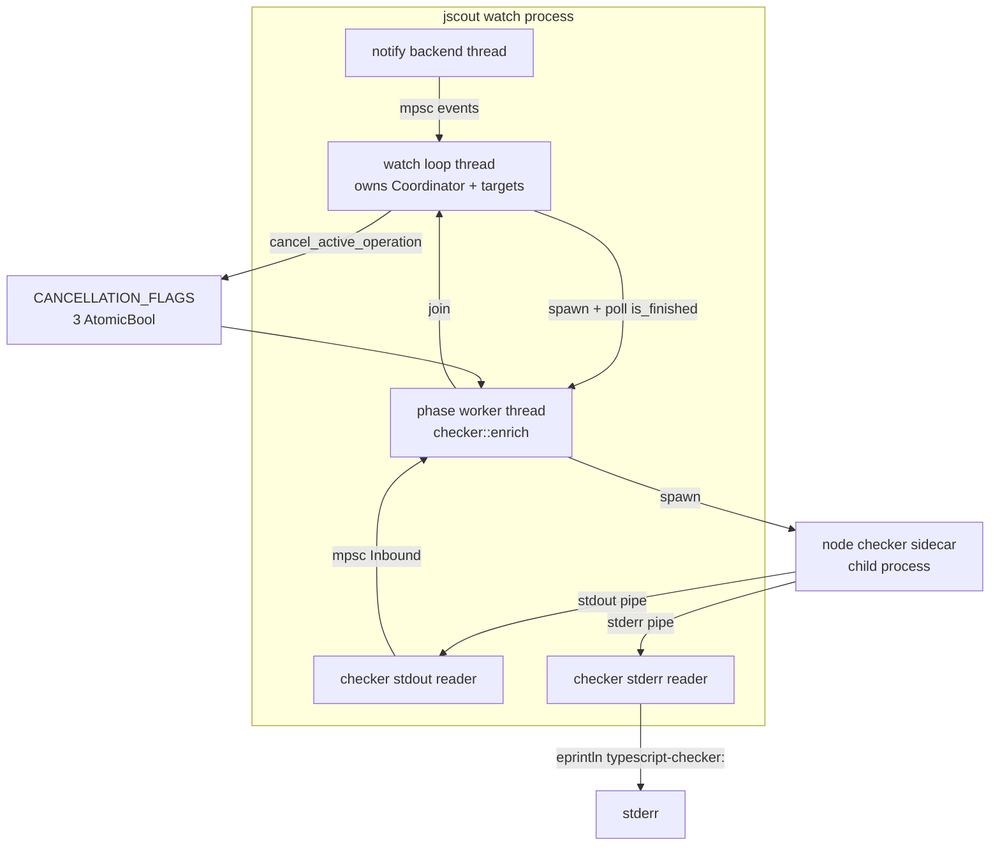
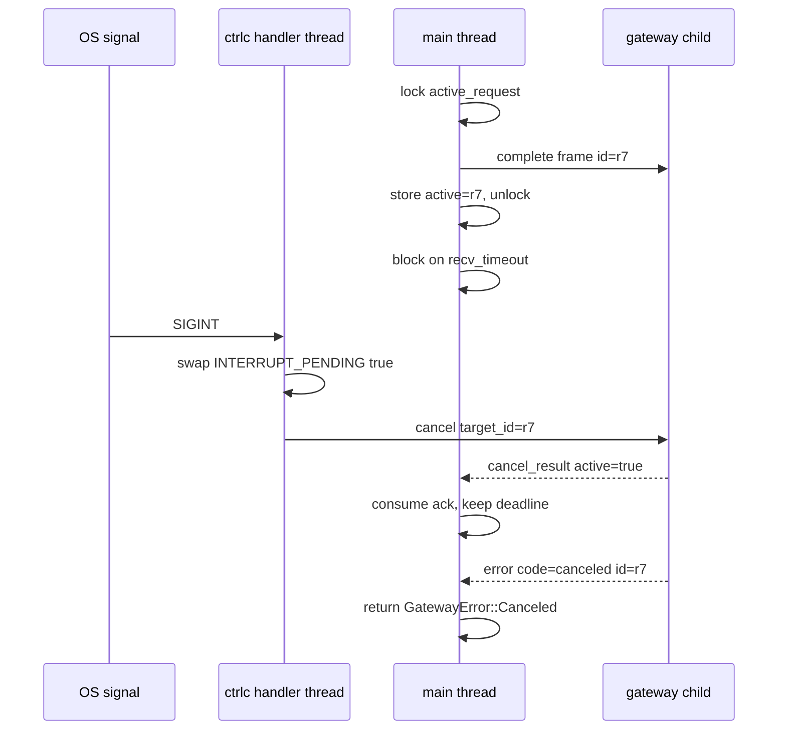

# Cross-cutting concerns

jscout has no framework layer: there is no async runtime, no logging crate, no error type hierarchy, no dependency-injection container. What holds the twenty-odd modules together is a small set of repeated decisions — one blocking thread of control per command, two process-global Ctrl-C registries at the sidecar seams, `anyhow::Result` everywhere except those seams, byte budgets declared as named constants next to the code that spends them, hand-rolled `BEGIN IMMEDIATE` transactions instead of RAII, and observability that goes to stderr because stdout is the JSON-RPC frame stream. Several of those decisions are implemented twice in different places, and several are enforced by nothing but habit. Configuration precedence — how a CLI flag, an environment variable, a `.jscout.toml` key, and a built-in default resolve against one another — belongs to [13-configuration.md](13-configuration.md).

## Two observability streams under `jscout mcp`

Telemetry is not a crate-wide facility. It exists in exactly one place: the MCP server loop in `src/mcp.rs`, and only when the operator supplies a path. `serve` opens two append-mode files up front, one for tool-call telemetry and one for a raw request log (`src/mcp.rs:168-186`), and each remains `None` when its path is absent. The two are deliberately asymmetric in what they record.

| | Telemetry (`--telemetry`) | Request log (`--request-log`) |
|---|---|---|
| Written by | `log_tool_call` (`src/mcp.rs:1713`) | `log_request` (`src/mcp.rs:345`) |
| Trigger | after each `tools/call` completes | before dispatching *every* JSON-RPC message |
| Records arguments | no | yes, verbatim (`src/mcp.rs:370`) |
| Records result text | no — only `result_bytes`, `ok`, section byte splits | no |
| CLI help wording | "privacy-minimal tool-call metrics as JSONL (no queries or results)" (`src/cli.rs:228`) | "including tool arguments" (`src/cli.rs:231`) |
| Failure mode | `eprintln!("warning: …")`, never fatal (`src/mcp.rs:1914`) | same (`src/mcp.rs:376`) |

The telemetry record (`src/mcp.rs:1841-1912`) is a single flat JSON object per call, flushed line by line. It carries build and configuration identity (`binary_fingerprint` is a blake3 of the running executable computed at startup, alongside `config_fingerprint`, `database`, `snapshot`); session identity read from the environment (`JSCOUT_SESSION_ID`, falling back to `pid-<pid>`, plus optional `JSCOUT_TASK_ID` and `JSCOUT_PROFILE_LABEL` at `src/mcp.rs:1735-1737`, `:1810`); and measurement — elapsed milliseconds, result bytes, per-stage retrieval timings, transport section byte splits, expansion node counts by file role, semantic-artifact freshness counts, and result-transport metrics. The environment indirection exists so the evaluation harness can tag every call from an agent session without changing the server's arguments; `scripts/eval-run-memory.mjs:349-351` sets all three through the MCP client's env block.

Two consequences follow from the shape rather than the content. First, `collect_telemetry` is a boolean threaded into every `ToolContext` (`src/mcp.rs:178`, `:286`, `:305`), because some metrics cost a query to produce — the name-only usage count runs an extra lookup and is skipped entirely when telemetry is off, warning rather than failing if it errors (`src/mcp.rs:1028-1033`). Second, both writers are best-effort: a full disk degrades the server to a warning on stderr, never an RPC error. Nothing rotates, size-caps, or garbage-collects either file.

Outside MCP there is no structured logging at all. The tree contains 169 `println!` (stdout — the actual command output) against 62 `eprintln!` (stderr — diagnostics), and the stderr side has four uncoordinated dialects: three `warning: …` lines, all in `src/mcp.rs`; structured `key=value` lines used only by the watcher (`watch generation={} phase=enrich status=… elapsed_ms=…` at `src/watch.rs:896`, `watch status=stopped reason=interrupt` at `:945`); timing lines in two spellings, `timing: bm25 {:?}` in search (`src/search.rs:2069`) versus `timing project-modules={:?}` in the structural projection, both gated on `diagnostics.timing` (`src/config/load.rs:832-834`, threaded to MCP at `src/mcp.rs:285`); and sidecar passthrough, where a reader thread prefixes each child stderr line with `pi-ai-gateway: ` (`src/llm/process.rs:248`) or `typescript-checker: ` (`src/checker/process.rs:347`). Everything diagnostic goes to stderr because under `jscout mcp` stdout carries newline-delimited JSON-RPC frames (`src/mcp.rs:380-385`); a stray `println!` in any module reachable from a tool call would corrupt the stream. That constraint is enforced by convention alone — no wrapper, no lint.

## Threading model

There is no async runtime. `src/` contains zero `async fn` and zero `.await`, and `Cargo.toml`'s 22 runtime dependencies include neither tokio nor rayon. Every command is one blocking thread that owns a `rusqlite::Connection` and threads `&Connection` through every function signature; the payoff is that indexing produces byte-identical output run to run, with no interleaving to reason about. The cost is that a multi-core machine indexes no faster than a single-core one, and that the only way to make a long phase abandonable is to move it onto a thread and poll it.

Seven `thread::spawn` calls exist in production code, serving exactly two purposes.

| Site | Purpose | Lifetime |
|---|---|---|
| `src/llm/process.rs:228` | drain gateway stdout, decode `Inbound`, forward over an `mpsc` channel | until EOF or first decode error |
| `src/llm/process.rs:245` | drain gateway stderr, prefix and re-emit | until EOF |
| `src/checker/process.rs:330` | drain checker stdout, same shape | until EOF or first error |
| `src/checker/process.rs:345` | drain checker stderr, same shape | until EOF |
| `src/watch.rs:1112` | run a code-embedding pass abandonably | joined by the watch loop |
| `src/watch.rs:1140` | run a semantic-embedding pass abandonably | joined by the watch loop |
| `src/watch.rs:1176` | run a checker enrichment pass abandonably | joined by the watch loop |

The `notify` crate contributes one more, its own backend watcher thread, whose callback does nothing but forward events into an `mpsc::channel` (`src/watch.rs:663-666`) so all classification happens on the watch thread.

The reader threads exist because a child process can block writing to a full pipe while the parent blocks waiting for a reply — draining both pipes concurrently is the only way to avoid the deadlock. They are strictly one-way: the stdout reader owns the `Sender` half and returns on the first `Err`, so an EOF or a malformed frame reaches the main thread as a channel disconnect, which `receive_for` reports as `ChildExited` (`src/llm/process.rs:238-243`). The stderr reader never sends anything; it only prints.

The three watcher workers exist for a different reason: `embed::embed_missing_interruptible` and `checker::enrich` are blocking calls that can run for minutes, and the watcher must keep ingesting filesystem events during them or lose edits. `run_embedding_interruptible` (`src/watch.rs:1101`) spawns the pass with its own database connection, then spins on `worker.is_finished()` at a 100 ms cadence (`OPTIONAL_PHASE_POLL`, `src/watch.rs:21`), calling `monitor.poll()` each round to drain events and, if the generation has been superseded, flipping an `AtomicBool` the embedding loop checks between batches. Enrichment is cancelled differently — through `checker::process::cancel_active_operation()` (`src/watch.rs:1202`) — because the work is inside a child process. Each worker opens its own connection via `open_phase_database` with a 5-second busy timeout (`src/watch.rs:1308-1314`, `:17`), the only place in the crate where two connections to one database are live at once.

The diagram below shows one `jscout watch` process at the moment an enrichment phase is running. Look for which arrows are channels, which are shared atomics, and which cross a process boundary.

`MAIN` never blocks on `WORKER` except at `join`, and it never touches `CHILD` directly — the cancel path goes through `FLAGS` and the process-global control slot, not through a handle the watch loop owns. `RDOUT` and `RDERR` are owned by `WORKER`'s sidecar client and die with the child. `NOTIFY` is the only thread jscout does not create itself.

## Signals and cancellation

`ctrlc::set_handler` can succeed at most once per process. jscout installs it from two places with near-identical implementations and no shared abstraction.

| | `src/llm/process.rs` | `src/checker/process.rs` |
|---|---|---|
| Handler once-cell | `INTERRUPT_HANDLER: OnceLock<Result<(),String>>` (`:30`) | same (`:28`) |
| Cancel target slot | `Mutex<Option<GatewayControl>>` (`:31`) | `Mutex<Option<CheckerControl>>` (`:29`) |
| Pending state | one `AtomicBool` (`:32`) | `CancellationFlags`: interrupt / operation / operation_delivered (`:30-56`) |
| Installer | `install_interrupt_handler` (`:72`) | `install_interrupt_handler` (`:215`) |
| First Ctrl-C | cancel the active request (`:83-90`) | same (`:226-236`) |
| Second Ctrl-C | `exit(130)` (`:85`) | `exit(130)` (`:228`) |
| Registration point | unconditional in `launch` (`:300`) | explicit `register_interrupts()` (`:392-395`) |

The duplication is real but currently harmless, and the reason is disjointness rather than design. `checker::process` installs its handler only through `begin_interrupt_scope` / `register_interrupts`, which are reached from `checker::enrich` (`src/checker/enrich.rs:428`, `:434`, `:1598`, `:2721`) — that is, from `jscout enrich` (`src/commands/mod.rs:680`) and from the watcher (`src/watch.rs:1176`), neither of which launches a gateway. `ProcessGateway::launch` registers unconditionally (`src/llm/process.rs:300`), so `jscout scout` installs the gateway handler. The repository scout is the one command that runs both sidecars in one process — a gateway from `src/commands/scout.rs:32` and a checker from `src/scouting/repository.rs:385` — but it calls `crate::checker::launch` without `register_interrupts()`, so the second install never happens. If it ever did, the loser would surface as `Spawn("failed to install Ctrl-C handler: …")`. Nothing in the code states or tests that invariant.

The checker's three-flag structure exists because the watcher needs a cancellation that is not an operator interrupt. `cancel_active_operation` (`src/checker/process.rs:252-263`) sets the `operation` bit and, if a cancel has not already been delivered, forwards a `Cancel` frame to the sidecar; enrichment separately checks `cancellation_pending()` at project boundaries (`src/checker/enrich.rs:726`, `:830`) so a superseded generation stops even when no request is in flight. `interrupt_pending()` stays distinct so the watch loop can tell an operator Ctrl-C (print `watch status=stopped reason=interrupt` and return, `src/watch.rs:944-946`) from a supersession (record `canceled` and continue). `begin_interrupt_scope` resets all three once per enrichment pass (`:268-274`), while `register_interrupts` deliberately does *not* — a per-project worker re-registering must not erase an interrupt that already cancelled an earlier project, a subtlety documented only in the comment at `src/checker/process.rs:390-394`.

The sequence below is one Ctrl-C arriving while a gateway completion is outstanding. Look at where the mutex is held.

`send_complete` writes the frame and publishes the cancel target under the same lock (`src/llm/process.rs:313-325`), so the handler can never see a sent completion without also seeing the id it must cancel. `receive_for` consumes the acknowledgement inline rather than treating it as an out-of-order message, and preserves the completion's original deadline while doing so (`src/llm/process.rs:330-360`); an acknowledgement that reports `active` for a *different* id is a protocol violation that poisons the client. Both clients' `Drop` impls unregister the control slot, send `shutdown` unless poisoned, poll `try_wait` for 500 ms, then `kill()` and `wait()` (`src/llm/process.rs:488-504` at 20 ms intervals; `src/checker/process.rs:797-813` at 10 ms) — the child never outlives its client.

## Error conventions

`anyhow::Result` is the crate-wide return type, with `.with_context(|| format!(…))` at every I/O boundary; the resulting messages are the operator's only diagnostic for most failures. Exactly two typed error enums exist, both at sidecar seams, both with the same seven variants — `Spawn`, `Protocol`, `Io`, `ChildExited`, `Timeout`, `Canceled`, `Remote { code, message }` — and both exposing a stable short `code()` string that is persisted into the scouting run ledger: `GatewayError` (`src/llm/mod.rs:40-53`) and `CheckerError` (`src/checker/process.rs:79-87`). The reason for the typing is that these two failures need to be *classified* downstream — a timeout should be retried, a `Protocol` error should poison the client, a `Canceled` should not be recorded as a failure — and a string message cannot carry that.

Between the two sits `src/io_policy.rs` (106 lines), the only place in the crate that distinguishes an *inventory race* from a *retryable resource failure*. `is_inventory_race` matches `NotFound`, `IsADirectory`, `NotADirectory` and means "the file went away after we listed it — treat it as absent and let the next reconciliation converge." `is_retryable` matches transport and resource kinds plus a Unix `errno` allowlist including `EMFILE`, `ENFILE`, `ENOMEM`, `EIO` and `ESTALE`, and means "abort the phase rather than publish a clean-but-random subset." `PermissionDenied` and `InvalidData` fall through both and are treated as durable facts about the file. That policy governs ingestion, workspace discovery, and dependency planning, and is documented only in that file's doc comments.

`std::process::exit` appears three times: the two second-Ctrl-C paths with code 130, and `src/commands/core.rs:421`, where `jscout who-uses` exits 1 after printing `no symbol found for '<spec>'`. Everything else propagates to `main`, which returns `Result<()>` and lets anyhow print the chain (`src/main.rs:50-69`).

## Resource limits

Budgets are named constants next to the code that spends them rather than magic numbers or configuration. The set that matters across modules:

| Constant | Value | Meaning |
|---|---|---|
| `src/checker/process.rs:22` `MAX_PROTOCOL_LINE_BYTES` | 4 MiB | largest checker frame accepted |
| `src/checker/process.rs:23-26` `PLAN_FRAME_MAX_BYTES` / `PLAN_FILE_PAYLOAD_BYTES` | 1 MiB / 900 KiB | payload headroom for the JSON envelope and escaping |
| `gateway/src/protocol.mjs:9` `MAX_LINE_BYTES` | 16 MiB | gateway line cap; overflow is unrecoverable |
| `src/scout.rs:12` `DEFAULT_SOURCE_BYTE_LIMIT` | 12,000 | rendered source per `definition` result |
| `src/semantic.rs:11` `MAX_BODY_BYTES` | 12,000 | annotation body |
| `src/search.rs:11` / `src/semantic_query.rs:19` `DEFAULT_RESPONSE_BYTE_LIMIT` | 24,000 | search and memory response transport |
| `src/dependency.rs:22-24` | 10,000 files / 100 MiB / 2 MiB per file | dependency ingestion ceilings |
| `src/structural.rs:298-300` | 200 nodes / 800 edges / 50,000 states | path search bounds |
| `src/watch.rs:22` `MAX_INCREMENTAL_SOURCE_PATHS` | 256 | above this an incremental pass becomes a full one |

Response budgeting is the one case where the accounting is part of the payload it measures, so it is solved by iteration rather than arithmetic. `settle_search_response` (`src/search.rs:2712`) alternates between computing compact section byte splits and re-rendering, up to 8 rounds, bailing out to a final render if it has not converged; `capture_unbudgeted_bytes` (`src/search.rs:2729`) wraps that in another 8-round loop, and `settle_value_rendered_bytes` (`src/mcp.rs:1685`) does the same for the MCP envelope. The exhaustive mode's advertised retry floor is a binary search over that same fitting function (`minimum_exhaustive_response_bytes`, `src/search.rs:2741`) — it clones the baseline result and probes byte limits until it finds the smallest one where budgeting still succeeds, which is more expensive than an estimate but cannot advertise a floor the server would then reject.

## Transactions

The crate never uses `rusqlite::Transaction`. Every write batch is hand-rolled: `conn.execute_batch("BEGIN IMMEDIATE")`, a closure returning `Result<T>` so `?` is safe inside it, then `COMMIT` on `Ok` and a best-effort `ROLLBACK` on `Err`. There are 26 such sites in production code across 11 modules — 11 in `src/checker/enrich.rs`, 5 in `src/scouting/mod.rs`, 2 each in `src/structural.rs` and `src/embed.rs`, and singletons in `store.rs`, `recon.rs`, `semantic.rs`, `indexer.rs`, `scouting/ledger.rs` and `scouting/repository.rs`. `IMMEDIATE` rather than `DEFERRED` takes the write lock at `BEGIN`, so a second writer fails fast at the busy timeout instead of mid-batch. Against RAII the tradeoff is visibility versus omission: the rollback path is spelled out at every site, and it can be forgotten at any of them. One site deviates — `src/checker/enrich.rs:1844-1845` assigns a single `conn.execute(...)` result directly instead of wrapping a closure.

## Conventions

**Test layout.** Modules with small test bodies use an inline `#[cfg(test)] mod tests { … }`; modules whose tests grow past roughly 300 lines declare `#[cfg(test)] mod tests;` and move them into a sibling file. There are 19 such declarations, 18 resolving to a `foo/tests.rs` beside `foo.rs` (`src/search.rs:3508` → `src/search/tests.rs`, `src/checker/enrich.rs:3934` → `src/checker/enrich/tests.rs`, and so on). The nineteenth uses an explicit `#[path = "core_tests.rs"]` (`src/commands/core.rs:481-483`). `src/main.rs` is the exception in kind: it declares `mod main_tests;` and re-imports crate-private helpers under `#[cfg(test)]` (`src/main.rs:70-80`) purely so `src/main_tests.rs` can exercise CLI flag resolution against private functions. The 474 `#[test]` functions all compile into one binary; there is no `tests/` integration directory. Filesystem faults are injected through the `FileSystem` trait in `src/fs_ops.rs:16-21`, whose test double stores one-shot path-addressed failures in `RefCell` (`src/test_fs.rs:22-25`) — thread-local state would be unnecessary given that nothing under test is multi-threaded.

**Doc comments state constraints, not restatements.** Nearly every module opens with the reason its design has the shape it does: `src/llm/mod.rs:1-6` ("Rust owns prompts, schemas, validation, persistence, and lifecycle; the Node sidecar owns providers, credentials, and request execution"), `src/fs_ops.rs:11-15` on what the seam deliberately *excludes*, `src/io_policy.rs:3-6` on why a race is not a failure. Negative-space comments — what is not done and why — are pervasive.

**Lints force justified exceptions.** `Cargo.toml:41-42` sets `allow_attributes = "warn"` and `allow_attributes_without_reason = "warn"`, so the tree contains zero `#[allow(...)]` and 31 `#[expect(..., reason = "…")]`, each with prose. The clippy list is 35 opt-in lints rather than `pedantic = "warn"`, and `Cargo.toml:33-38` explains why: the group emits roughly 780 warnings here, dominated by i64/usize casts inherent to the rusqlite boundary, and blanket-silencing those hides the real findings. `clippy.toml` exists solely to teach `doc_markdown` that SQLite, CommonJS, JavaScript, TypeScript and WebAssembly are prose.

**Determinism is structural.** `BTreeMap`/`BTreeSet` appear in 27 modules against `HashMap` in 19 (generally for interior lookup, not iteration); SQL statements whose order can matter carry `ORDER BY`; `serde_json` is compiled with `preserve_order` because package.json `exports` condition order is semantically significant.

**Content identity is blake3 with a versioned domain tag.** Nineteen distinct tags exist — `jscout-structural-snapshot-v2`, `jscout-resolution-hash-v2`, `jscout-checker-plan-v5`, `jscout-checker-package-gate-v1`, `jscout-exhaustive-request-v1`, `jscout-semantic-artifact`, `jscout-workflow-candidates-v1`, and so on — hashed by 22 modules. The convention goes past a prefix: `evidence_fingerprint` (`src/recon.rs:189-225`) separates fields with `\0` and marks section boundaries with `\x02` and `\x01`, so a member-path list and a representative-file list cannot be confused for one another. The rule that a semantic change to any producer must bump its tag's `-vN` is stated nowhere central and is enforced only by review.

**Version constants are independent.** Thirteen of them coexist, each covering a different contract: `SCHEMA_VERSION = "29"` (`src/store.rs:8`), `PROJECTION_VERSION = "12"` (`src/structural.rs:13`), `EXTRACTION_VERSION = "7"` (`src/entity.rs:14`), config `SCHEMA_VERSION = 1` (`src/config.rs:16`), gateway `PROTOCOL_VERSION = 1` (`src/llm/protocol.rs:8`), checker `PROTOCOL_VERSION = 4` (`src/checker/protocol.rs:3`), `EVIDENCE_ALGORITHM` (`src/recon.rs:13`), five scouting `PROMPT_VERSION` constants, and a concept `NORMALIZER_VERSION`. Only two are enforced mechanically: `open_path_read_only` rejects a schema mismatch and a projection mismatch with distinct "run `jscout index`" errors (`src/store.rs:78-83`, `:99-105`). The rest fail at the seam they describe, or silently do not fail at all.

**Naming.** Identifiers are unabbreviated (`gateway_client`, `deterministic_counts`, `selected_keep`) and loop variables spelled out. Single-letter bindings survive only in `src/graph.rs`, the oldest module.

## Where the seams are thin

The interrupt duplication is the clearest one: two ~90-line registries that must never both install, guarded by nothing. The `sqlite-vec` extension registration is process-global through a `Once` (`src/store.rs:11-25`) and involves a `transmute` of a function pointer — correct, but a second such extension would need the same hand-written dance. Both observability streams are unbounded append-only files with no rotation. And the whole-crate rule that keeps `jscout mcp` usable — nothing may write to stdout below the RPC loop — is a convention with no compile-time or test-time guard, which is exactly the kind of rule that survives until the module that breaks it is written by someone who has not read this page.
