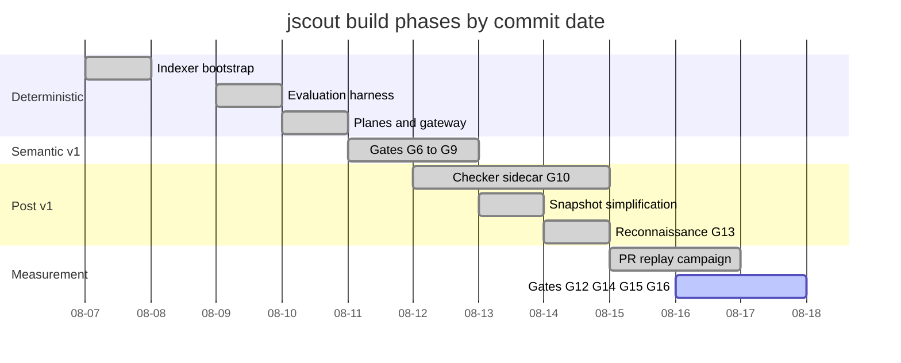
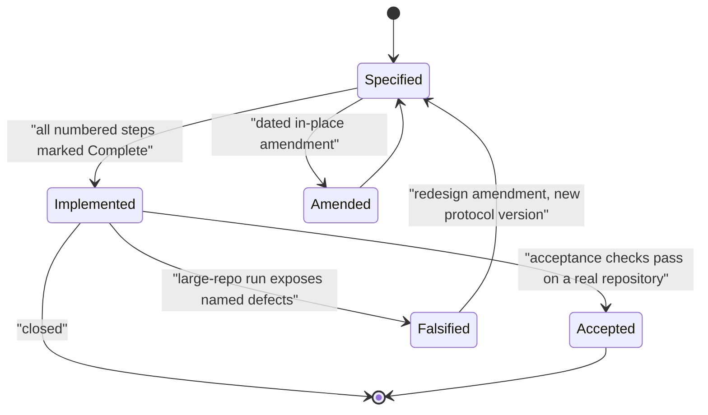
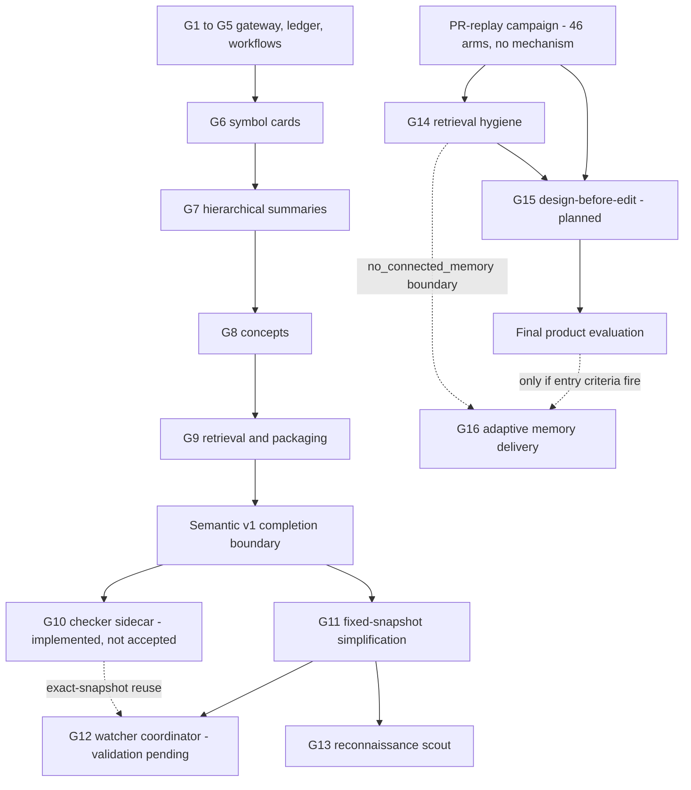

# Development history and roadmap

jscout was written in ten calendar days by one person, and the shape of the code is a direct print of how it was built: a deterministic Rust indexer first, an evaluation harness immediately after it, then a numbered sequence of self-contained plan sections — "gates" — each of which specifies a contract, an ordered implementation list, falsifiable acceptance checks, and an explicit out-of-scope list before any code is written. `PLAN.md` is the single normative document for that sequence and declares itself so at `PLAN.md:14`; every other plan that once existed was deleted from the working tree and left in git history. This part describes the phases, the gate model and its current status, what is specified but unbuilt, and the directions that were tried and abandoned.

Everything below reflects the repository as of **2026-08-17 at commit `a102597`** ("Merge pull request #38 from iantocristian/feat/g12-watcher-coordinator"), the tip of `main`. At that commit the history holds 292 commits by a single author (Cristian Ianto), 48 merge commits of which 44 merge pull requests numbered #1–#44, spanning 2026-08-07 to 2026-08-17 with no commits on 08-08.

## Commit density

| Date | Commits | What landed |
|---|---|---|
| 2026-08-07 | 14 | Initial Rust indexer, five plan documents, rename to jscout, first evaluations |
| 2026-08-09 | 18 | File roles, workflow memory, two-session memory gate, preregistration discipline |
| 2026-08-10 | 65 | Workspace/dependency resolution, runtime + contract + entity planes, agent surfaces, pi-ai gateway, CI |
| 2026-08-11 | 37 | G1–G9 numbering born, five plans consolidated into one, cards, hierarchy, local inference, call-site queries |
| 2026-08-12 | 31 | Concepts, semantic retrieval, checker sidecar protocol |
| 2026-08-13 | 31 | Three-plane simplification (G11), checker scale redesign, dual license |
| 2026-08-14 | 33 | Reconnaissance scout (G13), compact transport, checker batching |
| 2026-08-15 | 18 | PR-replay harness, stale-cache replay, MCP audit logs |
| 2026-08-16 | 29 | Optimistic-prefetch campaign, semantic memory retrieval, watcher coordinator |
| 2026-08-17 | 16 | G14 handoff, G15/G16 plan sections, watcher fixes and merge |

## Phases

The gantt below plots the eight build phases against real commit dates; look at where the deterministic work stops (08-11) and where the day count starts going into evaluation and correction rather than new planes.



**Phase 0 — bootstrap (08-07).** `f382cef` is not a skeleton: 27 files and 6,252 lines already containing `src/{chunk,embed,graph,heur,indexer,mcp,parse,query,search,stats,store,walk,watch}.rs`. It ships with `bench/` Python harnesses whose result logs are dated 2026-08-06, so measurement predates the repository. `32b240e` renames the project to jscout the same day; the `js-rag` checkout directory is the only surviving trace. `5abcacd` lands five competing plans, and by end of day `src/structural.rs` (`d24b2be`), `src/scout.rs` response budgeting (`1730c98`), and `src/agent.rs` plus `integrations/jscout/SKILL.md` (`04204fb`) exist alongside the first result file, `eval/results/ai-pipe-p0-2026-08-07.md`.

**Phase 1 — evaluation before features (08-09).** The pattern that governs the rest of the project appears here: preregister, gate, record. `eval/prereg/` gains five dated preregistrations, `eval/protocols/two-session-memory.md` defines the two-session memory harness, and the adjudication scripts (`scripts/eval-memory-transfer-probe.mjs`, `eval-memory-staleness-adjudicate.mjs`, `eval-memory-correctness-adjudicate.mjs`) land with JSON schemas. Features arrive attached to a gate: `src/file_role.rs` (`fce27b7`) with `eval/results/file-roles-rerun-2026-08-09.md`, `src/semantic.rs` (`76f65f7`) with the workflow memory gate.

**Phase 2 — the deterministic planes (08-10, 65 commits).** PRs #1–#9, most on `codex/*` branches. Workspace and module resolution (`src/workspace.rs`), the dependency boundary (`src/dependency.rs`, `src/origin.rs`, `src/package_exports.rs`, PR #2), runtime boundaries (PR #3), the contract plane (PR #4), general entities (`src/entity.rs` at `64f01ab`, PR #5), agent surfaces (`src/surface.rs` at `f1d6398`, PR #6), workflow candidate routing (PRs #7/#8), then the entire semantic scouting stack in one PR #9 — `gateway/` (`2880ac3`), `src/llm/` (`3d14d65`), `src/scouting/` run ledger and workflows. CI arrives the same day (`f56d60f`).

**Phase 3 — semantic v1, G6–G9 (08-11 → 08-12).** `3f4a8e2` adds `PLAN-SEMANTIC-SCOUTING.md` carrying the first G1–G9 status table; this is where the current numbering originates. `de311f9` then deletes all five legacy plans plus the semantic-scouting plan and folds 588 lines into `PLAN.md`, establishing the one-document rule. Cards (PR #16), hierarchical summaries (PR #17), concepts (PR #20), and retrieval/packaging (`src/semantic_query.rs`, PR #19) complete the semantic-v1 boundary at `PLAN.md:536`. In parallel, `701a853` adds `inference/` (BGE-M3 plus reranker) and `src/inference.rs` with sqlite-vec KNN, and `e00adbd` adds `src/calls.rs`.

**Phase 4 — the checker sidecar and its scale falsification (08-12 → 08-14).** `ddb5704` adds the bounded TypeScript sidecar protocol and `checker/`. The deferral of typed enrichment was pulled deliberately by `cad51ff` because receiver identity (`dbs.wave.card` → which table class) was the recurring gap (`PLAN.md:582`). Then a real repository run planned 150,213 eligible member-call occurrences, crawled through 10,900 one-at-a-time queries, and lost the run to a worker crash (`PLAN.md:599`). `f4a2db1` redesigns for scale — protocol v2 and schema v19 with batching, resume, one disposable `Program` per project, and Rust-owned budgets. The post-correction n8n dry run selects 121,060 of 284,183 discovered occurrences across 234 projects in 5.6 s (`PLAN.md:763`).

**Phase 5 — three logical planes (08-13).** PR #23 collapses lifecycle machinery into one SQLite file with three logical lifecycles — disposable structural snapshot, durable content cache, durable semantic memory — recorded as an amendment authoritative over older text (`PLAN.md:83`). `65ffa1d` removes cross-snapshot freshness machinery, `b2d6dba` opens query surfaces read-only, `c4dbfb0` rejects legacy v15 durable schemas.

**Phase 6 — reconnaissance (08-14).** `f02b18b` adds `src/recon.rs` and `src/scouting/repository.rs` (PRs #28, #30, #31), replacing path-noun heuristics with an evidence-backed semantic policy overlay. `6c01f35` adds `src/compact.rs`; `4ed1ee1` contextualizes reranking.

**Phase 7 — the PR-replay campaign (08-15 → 08-16).** `8366bab` adds the prepared PR-replay harness (`eval-pr-prepare.mjs`, `eval-tree-clone.mjs`, `eval-hidden-tests.mjs`), `44488ac` admits stale-development-cache replay, `f63170a` adds exact MCP request audit logs. The Next.js optimistic-prefetch campaign follows: trials 001 and 002, a cross-model arm, `c534865` blind omission adjudication across all 39 arms, `501a799` a read-only architecture probe, and memory trials `sol-mem-001…004` (PR #43). This campaign produced the negative result that reshaped the roadmap.

**Phase 8 — G12/G14/G15/G16 (08-16 → 08-17).** `ec5852e` coordinates full-snapshot watch generations, followed by `06ca205`, `16ba76c`, and `7c98074` fixing generation scheduling, exact-snapshot checker reuse, and cancellation. `1a71dbf` implements G14 handoff discipline; `192a7d1` and `dbea473` record the G15 and conditional G16 sections.

## The gate model

Three numbering schemes were used in sequence, and only the third survives.

| Scheme | Introduced | Fate |
|---|---|---|
| `M0`–`M6` ("M0 — Skeleton", "M3 — Retrieval", "M6 — Agent interface") | original `PLAN.md`, `5abcacd`, 08-07 | superseded; deleted by `de311f9` |
| `KG-1`–`KG-4` over `T1`/`T2`/`T3` trust tiers | `PLAN-KG.md`, `5abcacd`, 08-07 | superseded; the trust tiers survive as `R0`–`R3` at `PLAN.md:47` |
| `G1`, `G2`, `G3`… | `PLAN-SEMANTIC-SCOUTING.md`, `3f4a8e2`, 08-11 | current |

A gate is a plan section with four fixed parts: a shape or contract, a numbered **implementation order** whose steps are individually annotated `**Complete.**` (see `PLAN.md:1018`), a list of falsifiable **acceptance checks** (`PLAN.md:1284` for G12), and an explicit **out of scope** list (`PLAN.md:1321`). Gates are amended in place with dated headings — `**Amendment — watch replenishment (2026-08-13).**` at `PLAN.md:588` — rather than rewritten, so the reasoning history stays readable. Branch names encode the gate: `feat/g12-watcher-coordinator`, `feat/g14-retrieval-handoff`, `codex/g13-reconnaissance`, `codex/g8-concepts`.

The state machine below is what "complete" actually means here; note that `Implemented` and `Accepted` are separate states, and that G10 is the one gate that transited `Falsified`.



`Implemented --> Falsified` is not hypothetical: the G10 exhaustive path reached `Implemented`, then the 150,213-occurrence run listed five specific defects (`PLAN.md:779` onward) and forced a return to `Specified` as protocol v2. G12 currently sits on the `Implemented` node — the plan says implementation is complete but "sustained-churn validation on a large real repository remains pending" (`PLAN.md:1064`).

## Gate status at `a102597`

| Gate | Scope | Status in `PLAN.md` |
|---|---|---|
| G1–G5 | pi-ai gateway, Rust client, run ledger, candidate-closed workflows, refresh/supersession | Implemented (`PLAN.md:326`) |
| G6 | selected symbol cards | Implemented (`PLAN.md:352`) |
| G7 | hierarchical child-cited summaries | Implemented (`PLAN.md:381`) |
| G8 | concepts | Implemented (`PLAN.md:432`) |
| G9 | retrieval, packaging, operations | Implemented (`PLAN.md:489`); closes the semantic-v1 boundary (`PLAN.md:536`) |
| G10 | TypeScript checker enrichment sidecar | Implemented, **not accepted** for large repositories; scale correction shipped in protocol v2/schema v19, "full real n8n/Twenty runs and sustained-churn G12 coordinator gate remain open" (`PLAN.md:766`) |
| G11 | fixed-snapshot simplification | Steps 1–5 complete; step 5 has a named residue — `scout --dry-run` still opens a writer (`PLAN.md:1037`) |
| G12 | watcher coordinator | Implementation complete 2026-08-16; sustained-churn validation pending (`PLAN.md:1064`) |
| G13 | repository reconnaissance scout | Implemented (`PLAN.md:1330`) |
| G14 | retrieval handoff and relevance discipline | Implemented (`PLAN.md:1457`) |
| G15 | design-before-edit task memory | **Parked** as of 2026-08-18 — see the amendment below |
| G16 | adaptive memory delivery | **Conditional decision gate**, entered only if entry criteria fire; not triggered by the 2026-08-18 replay |
| G17 | exact-identifier dominance | **Planned** — added 2026-08-18 |
| G18 | task-directed semantic coverage and selection | **Planned** — added 2026-08-18 |

One inconsistency is worth naming: the status block at the top of the plan still reads "G12 watcher coordination remains planned" (`PLAN.md:7`), while the G12 section at `PLAN.md:1063` declares implementation complete and PR #38 is the merge that produced the current tip. The header was written on the G14 branch line (`dbea473`) before the G12 branch merged and was never reconciled.

## Dependency structure of the gates

The flowchart shows what actually depends on what, including the two gates that exist because measurement said retrieval was not the bottleneck.



`BND` is the hard divider: everything above it is semantic v1 and is declared closed, everything below is post-v1. The dotted edge from `G10` to `G12` is the exact-snapshot batch reuse amendment recorded in G11 step 4. `CAMP` feeding both `G14` and `G15P` is the campaign's split verdict — the transport defects it exposed became G14, and the missing-hypothesis result became a different product surface. `G16` hangs off two dotted edges because it is a decision gate, not a commitment.

## Specified but unbuilt

**G15 — design-before-edit task memory** (`PLAN.md:1553`–1707) is the largest pending item. Its surface is one command and two MCP tools:

```text
jscout scout design ROOT --task TEXT [--seed ANCHOR ...] [--dry-run]

design_task(task, seeds?, budgets?) -> validated design artifact
implementation_brief(design_id, response_bytes?) -> compact pinned handoff
```

The schema carries no diff and no replacement-code field, and forces reasoning in a fixed order: candidate mechanisms with falsifying evidence, selected mechanism, runtime detection signals, cure semantics and invariants, affected touchpoints, cross-file propagation. The motivation is a measured failure (`PLAN.md:1559`): across 46 implementation arms, two models, multiple retrieval profiles, forced and unforced use, and live semantic memory, the mechanism was never generated, while one read-only architecture probe on the same anchor-free task story produced it.

**G16 — adaptive memory delivery** (`PLAN.md:1709`) is explicitly not committed. It enters implementation only if repeated task evidence shows either independently-adjudicated-useful artifacts rejected by the evidence-connection join, or agents repeatedly ignoring the `no_connected_memory` → `semantic_memory` handoff. The plan pre-commits against weaker triggers: "A low attachment count, a high vector score, or one agent declining a follow-up is not sufficient" (`PLAN.md:1738`), and if neither criterion fires, G14 selection is final and G16 closes unimplemented.

The remaining open work is acceptance rather than construction: full real n8n and Twenty enrichment runs for G10 (`PLAN.md:766`), sustained-churn validation of the watcher through branch switches and ordinary edits (`PLAN.md:1064`), the `scout --dry-run` writer-authority cleanup (`PLAN.md:1037`), and the final three-arm product evaluation comparing implementation-only, single-agent two-phase, and persisted designer-to-implementer handoff, with correctness and mechanism retention primary and token/wall-time secondary (`PLAN.md:1694`).

## Abandoned and superseded directions

| Direction | How it ended |
|---|---|
| Five parallel plan documents | All deleted in `de311f9`; the governing rule is now "Superseded plans and critiques remain available through Git history" (`PLAN.md:24`) |
| `M0`–`M6` and `KG-1`–`KG-4` | Died with those documents on 08-11 |
| The `js-rag` name | Retired on day one by `32b240e` |
| v1→v18 in-place migration ladder | Retired for a v16 durable-format floor: compatible schemas keep embeddings and semantic memory and drop the disposable plane once, older formats fail loudly (`PLAN.md:126`, `c4dbfb0`) |
| Cross-snapshot checker freshness machinery | Removed by `65ffa1d`; the 08-13 amendment is declared authoritative over older text (`PLAN.md:83`) — no version ladder, no transitive input manifest, only exact-snapshot batch reuse |
| Incremental watch indexing | Removed by G12: "The production watcher now has no reachable incremental-indexing path" (`PLAN.md:1065`), pinned by the acceptance check "no reachable G12 code path invokes incremental indexing" (`PLAN.md:1307`) |
| Physical database splitting | Rejected: "adds backup, transaction, and deployment complexity without improving this contract and is not planned" (`PLAN.md:97`) |
| L1 retrieval investment | Closed — grep, baseline, and structural arms hit the same correctness ceiling while structural retrieval read more irrelevant files (`PLAN.md:1782`) |
| Elided source / custom behavioral IR | Tested and dropped; full versus elided retained quality without reducing bytes or calls (`PLAN.md:1785`) |
| Standalone `neighborhood` as a product surface | Demoted to drill-down plumbing after showing no natural agent selection (`PLAN.md:1788`) |
| Path-specific role exceptions | Replaced wholesale by the G13 overlay rather than accumulating repository rules (`PLAN.md:1783`) |

Two reversals deserve more than a table row. The G10 deferral was pulled deliberately by `cad51ff`, then the exhaustive implementation it authorized was itself falsified at scale and rebuilt — a deferral reversed and then partially re-imposed as an acceptance condition. And the most consequential turn is recorded at `PLAN.md:1787`: the optimistic-prefetch replays delivered fresh vector-backed context and the agents still collapsed into an edit/verify loop around one file, so G14 was demoted in its own opening line to "retrieval hygiene, not a claim that more retrieval will solve complex implementation tasks" (`PLAN.md:1459`) and hypothesis generation was split out as G15.

Beyond specific reversals, `PLAN.md:1828` maintains a standing exclusion list that no gate may quietly reintroduce: cross-edit stable symbol identity, runtime traces, checker work beyond occurrence-scoped receiver/member resolution, learned compression or traversal policy, LLM pseudocode as source truth, one model call per chunk, embedding clusters presented as domain concepts, semantic claims modifying deterministic facts, hidden model spending during index or watch, autonomous tool-using agents inside the gateway, automatic provider/model/billing fallback, blanket dependency indexing, and Yarn Plug'n'Play archive indexing.

Related reading: [`01-system-overview.md`](01-system-overview.md) for what these gates produced, [`12-evaluation.md`](12-evaluation.md) for the harness behind the campaign that reshaped the roadmap, [`11-incremental-and-watch.md`](11-incremental-and-watch.md) for G12 as built, and [`17-sharp-edges.md`](17-sharp-edges.md) for the residues listed above as they appear in code.

## Amendment — G15 parked, G17 and G18 added (2026-08-18)

This document describes the repository at commit `a102597`. One day later, at `26d5303`, the roadmap changed enough that the G15 entry above would otherwise mislead.

The two-phase design-then-implement treatment G15 proposed was built as an evaluation harness (PR #46) and run as a full matrix on a Next.js feature task. Design-then-implement passed 3 of 6 arms against 5 of 6 for single phase, cost 91% more non-cached input, 45% more wall time and 55% more output, and twice preserved a coherent but wrong output contract through implementation. `PLAN.md`'s decision amendment of that date reads: *"do not ship G15 as a jscout product surface. PR #45 is blocked."* Two-phase execution remains an optional evaluation-harness treatment; no design artifact, command, MCP tool, semantic-plane write, or agent-guide change is added to jscout.

Two new gates replace it as the next fixed-snapshot retrieval milestones, both repairs to defects the same replay surfaced:

- **G17 — exact-identifier dominance.** Hybrid retrieval currently lets rank fusion, the cross-encoder, and repository policy place a partial-name or vector match above an exact symbol definition; a search for `createRouteTypesManifest` returned an unrelated `createRoute` helper first. Exact identifier lookup becomes a deterministic tier ahead of learned ranking.
- **G18 — task-directed semantic coverage and selection.** Whole-repository weight ordering is recorded as unworkable for completeness: 448 card calls still missed the relevant type-generation surface, and three broad `semantic_memory` calls returned 26 mostly unrelated artifacts from candidate pools of 93–270.

The evidence is in [`eval/results/next-root-layout-param-types-2026-08-18.md`](../../eval/results/next-root-layout-param-types-2026-08-18.md) and [`eval/results/next-root-params-types-2026-08-17.md`](../../eval/results/next-root-params-types-2026-08-17.md), and is reported in full in the [publication set](../publication-2026-08-17/README.md).
