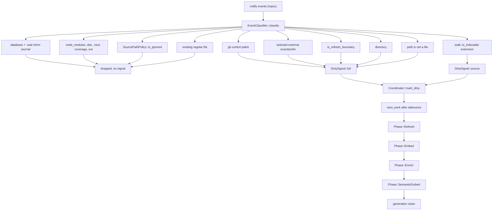
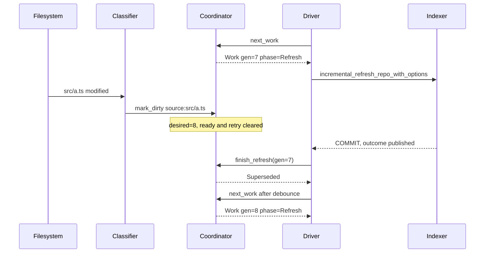

# Incremental indexing and the file watcher

`jscout watch` turns filesystem notifications into numbered *generations*, each of which runs a fixed phase chain — Refresh, then optionally Embed, Enrich, and SemanticEmbed — against the same indexer entry points that `jscout index` uses. The decision logic (debounce, retry backoff, scope escalation, supersession, phase ordering) lives in a `Coordinator` that touches neither the clock nor the disk: the driver loop hands it a monotonic `Duration` and executes the `Work` it hands back. Around that core sit an event classifier that reuses the inventory walker's own ignore policy, a registry of narrow `notify` watches for paths outside the repository root, a latch that suppresses repeated rejection detail, and a per-phase cancellation contract. The one thing the watcher does *not* see is documentation: a `.md` edit produces no signal at all, because classification funnels source events through `walk::is_indexable`, whose extension list is JS/TS only.

## The loop in one picture

Read the diagram as a funnel: notify events on the left, a classifier that returns `Option<DirtySignal>` in the middle, and a coordinator that either opens a new generation or folds the signal into the pending one. `DROP` is where most events die.

Two nodes carry most of the surprise. `REG` — an existing regular file with an extension the code walker does not accept — falls all the way to `src/watch.rs:534`, `if !path.is_file()`, which is false, so no signal is emitted at all; that is the documentation gap discussed below. `MISS` is the opposite: any path the backend reports that is not currently a file escalates the whole event to `DirtySignal::full("unknown-event")`, because a delete, rename, or rescan cannot be classified safely from the path alone.

The ladder order at `src/watch.rs:467-536` is load-bearing in one place: `walk::is_in_skipped_directory` (`:500`) is checked *before* `is_refresh_boundary` (`:506`), so `node_modules/**/package.json` does not promote ordinary dependency churn to a full refresh, while the selected-external check (`:487`) sits *above* the skip check so a dependency root the user explicitly selected still does.

## What promotes to a full refresh

| Class | Where | Scope |
|---|---|---|
| `.git` control paths, `.gitmodules` | `git_control_paths`, `src/watch.rs:477` | Full |
| Selected external dependency / checker roots | `external_exact` / `external_prefixes`, `:487` | Full |
| `package.json`, `pnpm-workspace.yaml` | `is_refresh_boundary`, `src/watch.rs:1382` | Full |
| `package-lock.json`, `pnpm-lock.yaml`, `yarn.lock`, `bun.lock`, `bun.lockb` | same | Full |
| `tsconfig.json` / `jsconfig.json` and their `tsconfig.*.json` variants | same | Full |
| `.gitignore`, `.ignore` | same | Full |
| Any `.d.ts` / `.d.mts` / `.d.cts` | same | Full |
| Directory event that survives the ignore policy | `:518` | Full |
| Any reported path that is not currently a file | `:534` | Full |
| A JS/TS file edit | `:521` | Incremental, one `source:<rel>` path |

Declaration files are worth calling out: they satisfy `walk::is_indexable` too, but the boundary check runs first, so editing a `.d.ts` costs a full refresh rather than an incremental one. That is deliberate — declarations change module resolution, not just their own extraction.

## The coordinator is pure state

`Coordinator` (`src/watch.rs:146`) holds `desired_generation` and `completed_generation`; the gap between them is "dirty". `Coordinator::new` (`:168`) seeds `DirtySignal::full("startup")` and then sets `refresh_immediate` (`:189-190`), so process start is indistinguishable from a full reconciliation and nothing about watcher progress is persisted anywhere.

`mark_dirty` (`:194`) is where the policy sits. It increments `desired_generation` only when the current generation is either complete or still owns work — `active`, `ready`, or `retry` at that generation (`:203-212`). A *second* signal arriving during the same phase does not bump again: `active.generation` no longer equals `desired_generation`, `ready` and `retry` are `None`, so the signal merges into the already-opened successor. On a rollover, accumulated reasons and paths are cleared and `refresh_scope` drops back to `Incremental` — *unless* a parked `Phase::Refresh` retry belongs to the current generation (`preserve_refresh_requirement`, `:198`). That refresh never consumed its inventory/config requirement, so letting an ordinary source event downgrade a failed *full* refresh to incremental would silently skip re-reading a changed `tsconfig.json`. `src/watch/tests.rs:179` pins this.

`force_full_enrichment` carries by a separate rule (`:201`, `:219-220`): the flag itself survives rollover and the `checker-drift-flush` reason is re-inserted into every successor generation, and the flag clears only when a generation runs to completion in `advance` (`:405`). A drift flush interrupted by edits therefore keeps forcing full enrichment across generations rather than being lost.

Two further details in the same function. Reasons beginning with `source:` are filtered out of the incoming signal (`:230`) and re-derived from `dirty_source_paths`, so a path dropped by the cap leaves no orphan reason. And the cap itself, `MAX_INCREMENTAL_SOURCE_PATHS = 256` (`:22`): once the set is full, further distinct paths set `source_overflow`, which escalates the whole generation to `RefreshScope::Full` and adds a `mass-source-change` reason (`:237-246`). A branch switch or codemod produces thousands of events; per-path bookkeeping and dirty-first checker ordering stop paying off well before that, and a full refresh is the more predictable path. The cost is that the retained set is the first 256 paths in arrival order, so the checker's priority set after a bulk change is an arbitrary truncation.

`RefreshScope` derives `Ord` with `Incremental < Full` (`src/watch.rs:60-64`), and `mark_dirty` does `self.refresh_scope.max(signal.scope)` (`:224`), which is what makes a full-scope signal sticky for the rest of the generation.

## Debounce, retry, and three independent timers

`next_work` (`:267`) is trailing-edge: it refuses to start fresh work while `now < last_dirty_at + debounce` (`:298`), so a continuous stream of saves never starts a refresh at all. `refresh_immediate` bypasses the wait for startup, periodic reconciliation (`mark_reconciliation`, `:254`), and the drift flush (`:260`). A parked retry gates fresh work even after debounce elapses (`:288-294`). `next_deadline` (`:312`) exports the same arithmetic to the driver, which mins it against the other deadlines and passes the result to `recv_timeout`, floored at one millisecond (`:1091-1094`).

Defaults are 2000 ms debounce and 600 s reconcile (`src/config/load.rs:921`, `:925`); `validate_options` (`src/watch.rs:1112`) requires debounce > 0 and reconcile either zero or strictly greater than debounce.

The three timers do not behave alike:

| Timer | Armed | Fires | Cleared |
|---|---|---|---|
| Debounce | On every `mark_dirty` (`:222`) | In `next_work` (`:298`) | Superseded by the next event |
| Periodic reconcile | In `report_finish` on `Complete`/`Partial`, and only when the interval is non-zero (`:1322`, `:1328`) | Only when `coordinator.is_clean()` (`:761`) | `clear_reconciliation_deadline_if_dirty` (`:1343`) nulls it whenever dirty |
| Checker drift flush | At **process start**, anchored to `started` (`:733-735`); re-armed via `checker_flush_pending` after a phase completes clean (`:1074-1082`) | Only when clean (`:755`) | Never cleared while dirty |

The asymmetry is visible in the deadline min at `:1087-1094`: `checker_deadline` is gated on `is_clean()`, while `phase_deadline` and `next_reconcile` are not. Anchoring reconciliation on *completion* rather than on timer fire is what stops a long generation from producing a back-to-back refresh loop; dropping an overdue deadline while dirty is what stops the retry wait from polling at the one-millisecond floor.

Retry is exponential and unbounded in count: `schedule_retry` (`:373`) doubles from 500 ms, caps at 30 s (`DEFAULT_RETRY_INITIAL`/`DEFAULT_RETRY_MAX`, `:18-19`), tracks attempts per phase, and any `mark_dirty` clears `retry_attempts` wholesale (`:251`).

## Phases, supersession, and what cancellation actually means

`advance` (`:390`) encodes the chain with conditional skips: `Refresh if embed → Embed`, `Refresh if enrich → Enrich`, `Embed if enrich → Enrich`, `Embed → SemanticEmbed`, `Enrich if embed → SemanticEmbed`. On the last phase it sets `completed_generation`, clears the dirty sets and `force_full_enrichment`, and returns `Complete` or `Partial`.

The sequence below shows what a mid-phase event does. Watch that the refresh transaction is *not* rolled back.

`Superseded` means only that the coordinator declines to advance generation 7 to its next phase. By the time `finish_refresh` is called at `src/watch.rs:846`, the SQLite transaction has already committed, the rejection latch has been updated, the summary line has been printed, watch targets have been re-collected and reconciled, and the ignore matcher has been reloaded (`:795-845`). Nothing is discarded. The same holds for a cancelled embed pass: it returns `Ok(report)` with whatever it wrote persisted.

Cancellation is per-phase and Refresh has none. It is one `BEGIN IMMEDIATE` transaction and is allowed to finish; the driver instead drains events immediately afterwards (`:841-845`) so the supersession check sees the freshest state. Embed and SemanticEmbed run on a worker thread with an `AtomicBool` the batch loop checks between batches of 64 (`:1152-1158`, `:1195-1200`). Enrich cancels by calling `checker::process::cancel_active_operation()` (`:1244`), which aborts the in-flight sidecar request. The driver polls with `PhaseMonitor::poll` — a 100 ms `recv_timeout` plus a drain (`:1262-1279`) — and then *also* sleeps `OPTIONAL_PHASE_POLL` (`:1167`, `:1195`, `:1246`), so supersession is noticed up to roughly 200 ms late.

Ctrl-C is only observed inside Enrich: `checker::process::interrupt_pending()` at `:979` routes to a bare `eprintln!("watch status=stopped reason=interrupt")` and `return Ok(())` at `:997-998` — the one exit path that calls no `finish_*` and no `report_finish`. During Refresh, Embed, or SemanticEmbed the process relies on default SIGINT termination. A `checker::is_terminal_partial_failure` error (`:981`) instead routes to `finish_optional_partial`, closing the generation as `Partial` and re-arming reconciliation rather than retrying a failure that will not heal.

## What "incremental" actually buys

`run_refresh` (`:1128`) opens a fresh connection per phase (`open_phase_database`, `:1352`, 5 s busy timeout) and dispatches on scope to `indexer::incremental_refresh_repo_with_options` (`src/indexer.rs:246`) or `watch_full_refresh_repo_with_options` (`:283`). Both funnel into `index_repo_impl` (`:374`).

Incremental means **extraction reuse and nothing else**. The pass still calls `corpus::repository_inventory` over the whole tree (`src/indexer.rs:385`), which runs the shared `walk::repository_inventory` traversal (`src/walk.rs:187`) with a `DocumentationCollector` riding it, re-reads and re-hashes every file, re-runs workspace discovery, dependency discovery and planning, module resolution, and snapshot computation. Reuse for a code file requires `hash == old_hash && old_corpus == CODE_CORPUS && old_format == format` (`:519-522`); a role-only change is an in-place `UPDATE` and still counts as `unchanged` (`:523-527`). Documents have a fourth gate: `!documentation_format_changed` (`:566`), so a bump of `docs::CHUNK_FORMAT_VERSION` (`ensure_documentation_chunk_format`, `:822`) forces re-extraction of every document while leaving code rows untouched.

One escape hatch avoids a pathological case. When an extractor-version bump clears file hashes (`ensure_extraction_version`, `:790`), per-file replacement is quadratic-ish churn, so if `cleared * 2 >= existing.len()` the pass truncates the disposable plane wholesale via `store::reset_extraction_state` and inserts as if fresh (`:478-491`). The denominator counts *all* non-dependency rows while the numerator counts only `corpus='code'` rows with empty hashes (`:476-479`) — a repository with a large documentation corpus dilutes the ratio and can suppress a reset the version bump intended.

Publication is two closures inside one `BEGIN IMMEDIATE` (`:440`). The preparation closure extracts, sweeps unseen rows (`:606-610`), runs dependency discovery and reads *before* deleting the three publication markers (`:634-639`), and only then `DELETE`s `snapshot`, `projection_version`, and `resolution_hash` (`:636-639`). The publication closure synchronizes dependency instances, indexes dependency files, materializes cached embeddings when `outcome.indexed > 0` (`:657-659`), resolves module edges, computes the resolution hash and snapshot, applies checker retention, then either republishes the identical `ProjectionIdentity` or rebuilds the projection (`:684-706`), and rematerializes documentation vector generations when the snapshot changed (`:717-720`). Any error rolls the whole thing back; WAL readers keep the previous snapshot throughout.

## Checker retention and the drift flush

Both watch refresh entry points pass `CheckerRetention::PreserveActiveForWatch`; manual `jscout index` passes `Drop` (`src/indexer.rs:264-280`). `store::preserve_active_checker_batch_for_watch` (`src/store.rs:1283`) deletes only `active=0` batches, keeping the one active batch as a hidden carry source for the following Enrich phase. Projection still refuses it, because its `source_snapshot` no longer matches the freshly computed snapshot. The boolean it returns feeds `checker_batches_changed`, which forces a projection rebuild even when snapshot, projection version, and resolution hash are all unchanged (`src/indexer.rs:684`). This also means a restart is not a clean checker slate: the startup full refresh preserves the *previous process's* active batch.

On the enrich side, `run_enrichment_interruptible` (`src/watch.rs:1202`) sets `carry_forward = !force_full`, `force_full = Work.force_full_enrichment`, and `dirty_files` copied from `coordinator.dirty_source_paths` (`:1214-1219`). The checker intersects those against current code files (`src/checker/enrich.rs:1532`), derives `dirty_projects` (`:1617`), and orders dirty occurrences first. The snapshot is taken at spawn time, so a full-scope generation triggered by `package.json` hands the checker an *empty* dirty set and gets no prioritization even though the corpus may have changed substantially.

`CHECKER_DRIFT_FLUSH_INTERVAL` is a fixed 24 hours (`src/watch.rs:20`). It produces an *incremental*-scope generation carrying `force_full_enrichment`, so only enrichment recomputes everything — carry-forward deliberately tolerates some ambient type drift, and this bounds that window without paying for a full structural refresh. Up to a day of drift can be served before the flush fires.

## Rejection-detail deduplication

Rejections are corpus exclusions, not phase failures: a binary file with a `.ts` extension or a permission-denied read produces an `IndexRejection` (`src/indexer.rs:78`) while the refresh still publishes a clean snapshot. That is exactly why they reappear on every generation, including every 600 s reconcile, and why printing details every time floods a long-lived watch log.

`RejectionReportLatch::observe` (`src/watch.rs:665`) sorts the current rejections by `(path, stage, error)` and compares against the previous vector. Equal yields `Silent`; changed and empty yields `Cleared { previous }`, a single line; changed and non-empty yields `Details`, which calls `indexer::report_rejections` (`src/indexer.rs:104`). Sorting makes the comparison independent of inventory ordering. The `rejected=N` field stays in every refresh summary (`src/watch.rs:809`) — the latch gates only the multi-line block.

Its limits are structural: the latch lives on `watch()`'s stack (`:717`), so a restart re-prints the whole block once; it is updated only on *successful* refreshes, so a stretch of failures leaves it holding a stale set; and `Cleared` reports a count, not which paths recovered.

## Documentation files do not trigger generations

State this plainly, because a ~5,700-line documentation subsystem now feeds `repository_inventory` and none of it is wired to the watcher. `EventClassifier::classify` has no documentation branch. Source events are gated on `walk::is_indexable` (`src/walk.rs:14`), whose `EXTENSIONS` list is `js, jsx, ts, tsx, mjs, cjs, mts, cts` (`src/walk.rs:9`). An edited or newly created `README.md` passes the skip-directory, boundary, and ignore checks, is not a directory, is not indexable, and reaches `if !path.is_file()` at `src/watch.rs:534` — which is false. No signal is produced and `ingest_event` never calls `mark_dirty`. `src/watch/tests.rs:493` (`irrelevant_regular_files_are_ignored_but_uncertain_shapes_rebuild`) pins `README.md` to `None`.

What *does* reach the index is `docs_include`/`docs_exclude`: `WatchOptions` carries them (`src/watch.rs:30-31`) from `runtime.effective.docs.indexing_include()/indexing_exclude()` (`src/commands/mod.rs:617-618`) into the per-generation `IndexOptions` (`src/watch.rs:789-790`), which `index_repo_impl` turns into `CorpusOptions` for `corpus::repository_inventory` (`src/indexer.rs:385-392`). So a generation started by *anything else* does reindex documentation in full. Three indirect routes exist:

1. Any code event, refresh boundary, or the periodic reconcile starts a generation whose Refresh phase re-reads, re-hashes, and re-parses every admitted Markdown/MDX file — so a doc edit lands up to `reconcile_seconds` late.
2. *Deleting* a document makes `path.is_file()` false, yielding `DirtySignal::full("unknown-event")` and a full refresh. Creates and edits are silent; deletes force the most expensive scope. That asymmetry is an accident of the classifier ladder, not a design.
3. `doc_inventory` is `DELETE`d and fully reinserted on every refresh regardless of scope (`replace_documentation_inventory`, `src/indexer.rs:889-907`).

The gap is scheduled, not overlooked: `PLAN.md:3334` reads "phase 4 adds documentation-aware watch classification". Phases 1 and 2 of G24 are merged; phase 4 is genuinely absent from `src/watch.rs`. When it lands it cannot simply reuse `SourcePathPolicy`, because the documentation scanner walks with `hidden(false)` (`src/docs/corpus.rs:188`) while the source walker uses `hidden(true)` (`src/walk.rs:107`) — the two planes do not share a hidden-file policy.

## Other rough edges

- `.jscout.toml` is not a refresh boundary (`src/watch.rs:1382`) and `watch()` reads configuration once at startup, so changing `[docs].include`, `watch.debounce_ms`, or `watch.reconcile_seconds` requires a restart.
- `WatchRegistry::reconcile` filters out every target under the repository root (`:588-590`). In-root coverage rests entirely on the single recursive root watch registered at `:709`; if that degrades, only the periodic reconcile recovers.
- `reconcile_seconds = 0` disables that recovery. `watch()` prints a warning and proceeds (`:747-751`).
- Registration failures for external targets are counted per path and retried at every target reconciliation with a `status=degraded attempt=N` line rather than an abort.
- `debug_assert!(!report.canceled || coordinator.is_superseded(work))` after both embedding phases (`:909`, `:1048`) is debug-only; in release a cancelled-but-not-superseded pass would be treated as a completed phase.
- `SourcePathPolicy::is_ignored` returns `false` on an ignore-loading error *and* when `strip_prefix(root)` fails (`src/walk.rs:79-85`), so out-of-root paths are conservatively not ignored.

## Testing

`src/watch/tests.rs` holds 28 `#[test]` functions in three groups. Coordinator tests (`:76-347`) build a `Coordinator` directly and drive it with synthetic `Duration`s — no sleeping, no filesystem — covering startup immediacy, phase ordering under each embed/enrich combination, supersession mid-refresh, capped exponential retry, scope preservation across a failed refresh (`:179`), the drift flush and its survival of supersession (`:248`, `:273`), event coalescing, full-scope stickiness, and the 256-path promotion (`:330`). Classifier tests (`:350-527`) build tempdir repositories with real `.gitignore` files and assert database-family exclusion, selected-external override of `node_modules` noise, boundary dominance within one event, ignore-rule reload after a refresh, and the `README.md → None` case (`:493`). Three integration tests (`:575-652`) call the private `run_refresh` against a real SQLite file. The latch has two dedicated tests (`:32`, `:58`) covering order-insensitivity, error-text changes, the single clear line, and re-reporting after reappearance.

On the indexer side the relevant coverage among 36 tests is `watcher_incremental_refresh_preserves_old_checker_batch_as_hidden_carry_source` (`src/indexer/tests.rs:2152`), `incremental_read_failure_removes_the_stale_file_row` (`:2182`), `incremental_and_full_refresh_publish_the_same_structural_identity` (`:2207`), `forced_reextraction_reset_matches_per_file_replacement` (`:2433`), and `extraction_reset_triggers_only_at_majority_cleared` (`:2577`). No test asserts anything about a documentation edit beyond the `README.md` classifier case.
