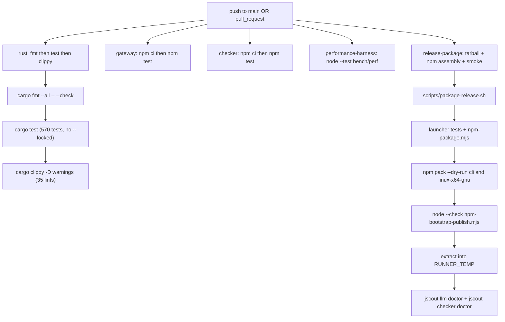
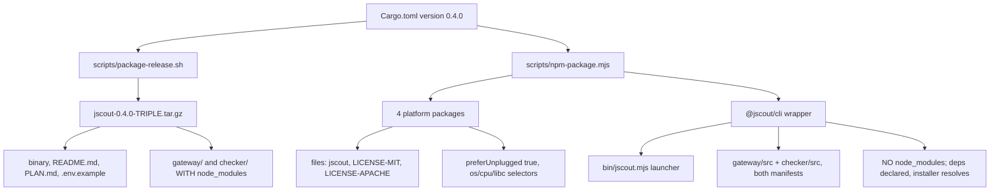
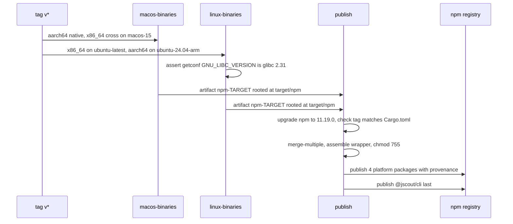

# Build, CI, and distribution

jscout is a single binary-only Rust crate — no `src/lib.rs`, no `[lib]`, no `[features]`, no `tests/` directory — pinned to toolchain 1.97.1, ratcheted by 35 hand-picked clippy lints rather than a `pedantic` block-list, and gated by five GitHub Actions jobs that share a trigger and nothing else. It ships in two shapes with opposite vendoring strategies: a self-contained `.tar.gz` whose sidecars carry fully installed `node_modules`, and five npm packages where a Node launcher resolves a per-platform binary and the installer resolves the sidecar dependencies. Its 570 Rust tests all compile into one unit-test binary rooted at `src/main.rs`; another 73 Node cases run in CI and 71 Node/Python cases run nowhere. The documentation subsystem that landed for G24 touched the build surface in exactly two places — four new crates in `Cargo.toml`, three new keys in `.jscout.toml.example` — and gained no CI gate beyond `cargo test`.

## Crate shape and why each dependency is there

`Cargo.toml:1-5` declares `name = "jscout"`, `version = "0.4.0"`, `edition = "2024"`, `license = "MIT OR Apache-2.0"`. Twenty-six runtime dependencies (`Cargo.toml:8-33`) and one dev dependency, `tempfile 3.23.0` (`Cargo.toml:35-36`), resolve to 240 `[[package]]` entries in a `version = 4` `Cargo.lock` — 239 transitive crates plus `jscout` itself.

| Crate(s) | Version | Why it is in the tree |
| --- | --- | --- |
| `oxc_allocator`, `oxc_ast`, `oxc_ast_visit`, `oxc_parser`, `oxc_semantic`, `oxc_span`, `oxc_syntax` | 0.143.0 | JS/TS parse and scope resolution. Held lockstep because they share arena and AST types across crate boundaries. |
| `oxc_resolver` | 11.24.2 | Module specifier resolution; a separate release line from the AST crates. |
| `rusqlite` (`bundled`) | 0.40.1 | Storage. `bundled` compiles `libsqlite3-sys` from source, which is why the release tarball needs no system SQLite. |
| `sqlite-vec` | 0.1.9 | Vector index extension loaded into that same connection. |
| `blake3` | 1.8.5 | Content hashing for file identity and staleness. |
| `ignore` | 0.4.33 | Gitignore-aware traversal underneath the single repository walk. |
| `notify` | 8.2.0 | Filesystem events for `jscout watch`. |
| `clap` (`derive`) | 4.6.5 | The CLI grammar. |
| `serde`, `serde_json` (`preserve_order`) | 1.0.229 / 1.0.151 | JSONL protocols to both sidecars and MCP output; `preserve_order` keeps emitted key order stable. |
| `toml` | 0.9.8 | `.jscout.toml` parsing (see `15-configuration.md`). |
| `ureq` | 3.3.0 | Blocking HTTP to the embedding endpoint. |
| `anyhow` | 1.0.104 | Error context throughout. |
| `ctrlc`, `libc` | 3.5.2 / 0.2.189 | Signal handling and process-level primitives. |
| `unicode-normalization` | 0.1.24 | Identifier and text normalization before hashing/indexing. |
| **`pulldown-cmark`** | **0.13.0** | **New with the docs subsystem.** Markdown/MDX event parsing in `src/docs/corpus.rs:13`. |
| **`serde_yaml_ng`** | **0.10.0** | **New with the docs subsystem.** YAML frontmatter, `src/docs/corpus.rs:15`, used at `:893`, `:920`, `:929`. |
| **`globset`** | **0.4.20** | **New with the docs subsystem.** Compiles the `[docs] include`/`exclude` patterns, `src/docs/corpus.rs:8`. |
| **`base64`** | **0.22.1** | **New with the docs subsystem.** Encodes non-UTF-8 paths and byte payloads, `src/docs/corpus.rs:805`, `:819`, `:827`, `:2190`. |

All four new crates are imported by one file. `globset` and `pulldown_cmark` have exactly one `use` site each in production code and no other qualified references; `base64` and `serde_yaml_ng` are also confined to `src/docs/corpus.rs`. Because the manifest has no `[features]` table, there is no way to build jscout without the Markdown pipeline — adding documentation retrieval added four crates to every build of every target, including the release binaries for users who never touch a `.md` file. The tradeoff is deliberate in the other direction too: no feature flags means no combinatorial build matrix and no `--no-default-features` variant to keep green.

## Toolchain pinning and the constants that must move together

`rust-toolchain.toml` pins `channel = "1.97.1"`, `components = ["clippy", "rustfmt"]`, `profile = "minimal"`. CI never reads it — both workflows install a toolchain explicitly. That makes `1.97.1` a literal that appears in five places which must change together, with nothing cross-checking them:

| Constant | Sites |
| --- | --- |
| Rust `1.97.1` | `rust-toolchain.toml:2`, `.github/workflows/ci.yml:15`, `ci.yml:68`, `release-npm.yml:23` (`RUST_TOOLCHAIN`), `release-npm.yml:76` (baked into the digest-pinned `rust:1.97.1-bullseye@sha256:02d78ca…`) |
| Node `22.19.0` | `ci.yml:30,44,58,71`, `release-npm.yml:24` (`NODE_VERSION`), `npm/cli/package.json:29`, `gateway/package.json:8`, `checker/package.json:8` — and `src/llm/config.rs:14` `MINIMUM_NODE_VERSION: (u64, u64, u64) = (22, 19, 0)`, the only site that enforces it against a running process |
| glibc `2.31` | `npm/cli/bin/jscout.mjs:21` (as `[2, 31]`, not a dotted string), `scripts/npm-package.mjs:19`, `release-npm.yml:93`, `README.md:28`, `npm/cli/README.md:64`, and `npm/cli/test/launcher.test.mjs:173` inside an assertion regex |
| npm `11.19.0` | `release-npm.yml:25` |

Bumping `rust-toolchain.toml` alone silently leaves every CI and release build on the old compiler. `dtolnay/rust-toolchain@master` is itself an unpinned mutable ref in both workflows while every other action is `@v7`/`@v8` — a supply-chain asymmetry that the container digest pin on the Linux legs partly compensates for and the macOS legs do not. There is no `rustfmt.toml`, so `cargo fmt --check` enforces stock defaults.

The npm pin carries its own reasoning inline at `release-npm.yml:133-136`: Node 22.19.0 ships npm 10.x, OIDC trusted publishing needs ≥ 11.5.1, and `@latest` now resolves to npm 12, whose engine range (`^22.22.2 || ^24.15.0 || >=26`) no longer matches `NODE_VERSION`. Pinning is the cheaper failure mode than a release job that breaks the day npm 12 becomes latest.

## The clippy policy

`Cargo.toml:45-93` enables exactly 35 named clippy lints at `warn`, in seven commented bands: lint policy (2), formatting and allocation (8), iteration and collections (6), control flow and bindings (6), API shape (5), style and correctness hazards (7), docs (1). The rationale is written into the manifest at `Cargo.toml:38-44`: turning `pedantic` on wholesale emits roughly 780 warnings here, dominated by `i64`/`usize` casts inherent to the rusqlite boundary, and blanket-allowing that category would bury the handful of real findings inside it. The list is a regression ratchet, not a backlog — `Cargo.toml:44` states it plainly: adding a lint means the tree is clean for it today.

Both sides of that tradeoff are real. The opt-in list gives `-D warnings` teeth without a wall of `#[allow]` attributes (two of the 35 lints, `allow_attributes` and `allow_attributes_without_reason`, exist specifically to keep suppressions honest). The cost is that a newly-useful lint category never surfaces on its own; someone has to notice it upstream and add the line. `clippy.toml` supplies the only tool setting — `doc-valid-idents = ["SQLite", "CommonJS", "JavaScript", "TypeScript", "WebAssembly", ".."]` — where the trailing `".."` preserves clippy's default list rather than replacing it.

A 36th lint is scoped rather than global. `src/main.rs:3` reads `#![cfg_attr(not(test), warn(clippy::redundant_clone))]`, with the reason on the line above: test fixtures favor reorderable inputs over last-use clone elimination. The consequence is that redundant clones across roughly 32,000 lines of test code are never flagged.

## Five CI jobs, no edges

`ci.yml` runs on pushes to `main` and on every pull request. Look at how little the jobs know about each other — there is no `needs:` anywhere, so all five start at once and a green run is the conjunction of five independent verdicts.

`RUST`'s internal order is fmt → test → clippy (`ci.yml:17-22`), which means a lint-only regression pays a full compile-and-run of the 570-test binary before failing. Neither cargo invocation passes `--locked`, and cargo rewrites `Cargo.lock` in place on manifest drift, so lock drift is caught only downstream at `P1`, where `scripts/package-release.sh:22,26` builds `--locked`. `GW` and `CHK` each `npm ci --prefix` then `npm test --prefix`, keyed on their own `package-lock.json` for the npm cache; both sidecar `test` scripts are a bare `node --test`, so file discovery is implicit and a new test file is picked up without touching a manifest. `PERF` runs `node --test bench/perf/perf.test.mjs` with no `npm ci` at all — the harness drives local mock sidecars.

`REL` (`ci.yml:62-95`) is the widest gate and the only job that touches both distribution shapes. `P6` extracts the archive into `$RUNNER_TEMP` and runs `jscout llm doctor --model local:smoke` and `jscout checker doctor <bundle_dir>` against it, proving the packaged binary self-locates both sidecars with no source checkout present. `P4` exists for a stated reason (`ci.yml:82-83`): `npm-bootstrap-publish.mjs` only ever runs during a release, so a syntax error in it would otherwise surface at the worst possible moment. `P3` is quietly host-dependent — `node scripts/npm-package.mjs` with no `--target` resolves the host triple via `rustc -vV` (`scripts/npm-package.mjs:52-58`), so `target/npm/linux-x64-gnu` exists only because the job runs on an x86_64 Linux runner. Nothing in `REL` exercises `jscout docs`, `jscout index`, or the Markdown pipeline; the entire docs subsystem is gated by `cargo test` alone.

One caching wart: `package-release.sh` runs `npm ci` for both sidecars (`:64-65`), but `REL` sets `cache-dependency-path: gateway/package-lock.json` only (`ci.yml:73`), leaving `checker`'s install uncached in the job that performs it.

## Two distribution shapes from one crate

The tarball and the npm tree vendor in opposite directions, for the same reason from two sides: the tarball has no installer at the far end, so it must carry everything; npm has a resolver at the far end, so carrying `node_modules` would be waste and a lockfile conflict.

`scripts/package-release.sh` reads the version by awk (`:8`), builds `--locked` (`:22`/`:26`), stages `T1` and `T2` (`:52-59`), then runs `npm ci --omit=dev --ignore-scripts` into the staged tree for each sidecar (`:64-65`) with a staging-local cache at `$staging/.npm-cache` that sits beside the bundle directory and is therefore excluded by `tar -C "$staging" … "$bundle"` (`:67`). It works inside a `mktemp` staging directory under an `EXIT` trap and moves the finished tar into place (`:49-50`, `:66-68`), so the archive is never visible half-written, and it refuses to overwrite an existing one (`:44-47`). One ordering wart survives: `cargo build` runs at `:22`/`:26` before the `command -v npm` check at `:35-38`, so a missing npm is only reported after a full release build.

`scripts/npm-package.mjs` drives `PLAT` and `WRAP` from one `TARGETS` map (`:21-32`) that maps Rust triple to npm key plus `os`/`cpu`/`libc` selectors. The presence of `libc` is what distinguishes the two Linux packages from the two Darwin ones and also drives the generated description (`:117-119`). Platform manifests set `preferUnplugged: true` (`:129`) so Yarn PnP does not zip the binary, declare no `exports` map, run no install scripts, and list exactly three files (`:128`). The wrapper's version and all four `optionalDependencies` are rewritten from `Cargo.toml` (`:155-158`), with drift in `npm/cli/package.json` reported as a warning rather than a failure (`:149-154`).

The one hard consistency check is narrower than it looks. `scripts/npm-package.mjs:186-201` compares each sidecar manifest against the **wrapper only**: `gateway/package.json` must pin `@earendil-works/pi-ai` (0.84.1) as `npm/cli/package.json` does, and `checker/package.json` must pin `typescript` (5.9.3) and `@noble/hashes` (2.0.1) the same way. The two sidecars declare no overlapping dependency and are never compared to each other. That check lives inside `buildWrapperPackage`, which `--platform-only` skips (`:212-213`), so it never runs on the release matrix legs — only in the publish job, in bootstrap, and in plain CI.

Both sidecar manifests are copied verbatim (`:180-183`, inside the loop at `:175-184`) because `gateway/src/main.mjs` reads `../package.json` for the version it reports (`:171-174`). The consequence is that `gateway/package.json` sits at `0.1.0` while `checker/package.json` and `npm/cli/package.json` are `0.4.0`: Cargo.toml is the version authority for the wrapper and the four platform packages, not for the sidecar manifests, and the shipped gateway reports 0.1.0.

Windows is dead code in two places. `package-release.sh:17-19` selects `jscout.exe` for `*windows*` triples and `npm/cli/bin/jscout.mjs:82` joins `jscout.exe` on `win32`, but `TARGETS` has no Windows entry and `platformKey()` (`jscout.mjs:42-51`) returns `null` there first, so the launcher fails with the unsupported-platform message before the Windows branch is reachable.

Neither packaging path ships `.jscout.toml.example`, which now carries the `[docs]` and `[docs.search]` blocks (`:9-18`) and `llm.max_concurrency = 1` (`:78`). Users of either distribution get the configuration surface described in `15-configuration.md` with no template in the box.

## Releasing: four targets, one publish, no preflight

`release-npm.yml` triggers on `v*` tags or manual dispatch with `dry-run` defaulting to true; the `Publish` step alone carries `if: github.event_name == 'push' || inputs.dry-run == false` (`:184`), so a manual run exercises the whole pipeline through `npm pack --dry-run` and then stops. `permissions` is `contents: read` workflow-wide (`:19-20`); only `publish` adds `id-token: write` for provenance (`:124`). Authentication is OIDC trusted publishing — no token, no `NODE_AUTH_TOKEN`.

`Lin` runs two targets on **two different runners** under the same job-level digest-pinned container, and asserts `test "$(getconf GNU_LIBC_VERSION)" = "glibc 2.31"` before any build (`:91-94`) — a tripwire that the container is in effect, not a floor in itself. Each leg uploads `target/npm` whole, not a glob, so the artifact root stays stable for `merge-multiple` (`:111-113`). `Pub` restores executable bits (`:160-168`) because `upload-artifact` does not preserve modes, guards each package with `npm view` so a partially-failed release re-runs cleanly (`:192-195`), and publishes the wrapper last (`:198-202`) so its `optionalDependencies` already resolve on the first install.

The gap worth naming: **the release workflow has no preflight.** Set equality between declared `optionalDependencies` and present artifact directories, per-package version equality, the ≥ 1 MiB size floor, the exec bit, and `file -b` architecture verification against `EXPECTED_ARCHITECTURE` all live exclusively in `scripts/npm-bootstrap-publish.mjs` — a one-time manual script (`:129-200`) that accumulates every problem into a `problems[]` array and reports them together, and that will never run again now that the packages exist. `release-npm.yml`'s publish loop iterates `target/npm/*/` and publishes whatever directories the artifact merge happened to produce. A matrix leg whose artifact failed to download, or a cross-compile that silently emitted a host-architecture binary, publishes without complaint.

That gap has a specific victim: **`x86_64-apple-darwin` is never executed anywhere.** It is cross-compiled on an arm64 `macos-15` runner, its smoke test is skipped by `if: matrix.native` (`:56`), and no CI step checks its architecture. The one mechanism designed to catch a bad Darwin cross-compile is the bootstrap script's `file -b` regex, which the release path does not run.

The launcher itself is well covered by comparison. `npm/cli/bin/jscout.mjs` reads `process.report.getReport()?.header?.glibcVersionRuntime` (`:23-31`), fails below the floor with an actionable message (`:59-64`), treats the *absence* of a glibc reading on Linux as the musl signal (`:48`) — for which no package exists, so the next step fails with a less specific message — resolves the binary through `require.resolve('@jscout/<key>/package.json')` and joins the sibling filename (`:79-83`) because the binary is not a module and platform packages declare no `exports`, sets `JSCOUT_BUNDLED_*` only when neither the user override nor the bundled variable is already set (`:111-115`), and forwards `SIGINT`/`SIGTERM`/`SIGHUP` before re-raising the child's terminating signal on itself (`:122-142`) so `jscout watch` and the stdio MCP server shut down cleanly instead of being orphaned.

## Test organization

570 `#[test]` functions live in one binary across 88 `.rs` files totalling 91,282 lines. `cargo test --all-targets --all-features` (`ci.yml:20`) compiles exactly one unit-test binary rooted at `src/main.rs`; every test is a private-item test inside it, and `--all-features` is inert because there is no feature table.

| Shape | Modules | Tests | Lines |
| --- | --- | --- | --- |
| Sibling `tests.rs` files | 20 | 398 | 25,325 |
| Inline `#[cfg(test)] mod tests { … }` | 29 | 172 | ~6,950 |
| **Total Rust** | — | **570** | ~31,700 test lines of 91,282 (~35%) |

The largest sibling files are `src/checker/enrich/tests.rs` (45 tests / 3,638 lines), `src/scouting/tests.rs` (45 / 3,428), `src/indexer/tests.rs` (36 / 2,719), `src/structural/tests.rs` (39 / 2,465), `src/search/tests.rs` (31 / 2,178) and `src/mcp/tests.rs` (28 / 1,993). The newest subsystems did not adopt the sibling convention: all 44 docs tests are inline blocks — `src/docs/corpus.rs` (27 tests / 817 lines), `src/docs/retrieval.rs` (14 / 990), `src/docs/store.rs` (3) — and `src/commands/docs.rs` has none. Scout concurrency landed the same way, with 13 inline tests in `src/scouting/repository.rs` and 11 in `src/llm/process.rs`. `src/commands/core.rs:485-486` is the only `#[path]` rename in the tree; `src/main.rs` declares `mod test_fs;` (`:40-41`) and `mod main_tests;` (`:80-81`) by plain name, with `#[cfg(test)] use` re-exports at `:72-78` letting `main_tests` reach `src/cli.rs` and `src/commands/` because neither carries a `#[test]` of its own.

Test infrastructure is deliberately thin: `tempfile 3.23.0` is the only dev dependency, `src/test_fs.rs` (66 lines) supplies a `FaultFileSystem` with injectable one-shot filesystem faults, `src/llm/process.rs` has a `#[cfg(test)] mod fake` that writes an executable `/bin/sh` fake gateway so the process client is exercised without Node or a network, and `src/indexer.rs` carries `#[cfg(test)]` fault-injection entry points such as `index_repo_with_post_replacement_failure`.

Outside Rust, CI gates 73 cases: `checker/test/sidecar.test.mjs` (36), `gateway/test/gateway.test.mjs` (24), `bench/perf/perf.test.mjs` (10 — nearest-rank statistics, child-environment isolation asserting `OPENAI_API_KEY`/`NODE_OPTIONS`/`LD_PRELOAD`/`DYLD_INSERT_LIBRARIES`/`TMPDIR` do not leak into benchmark children, path containment, MCP shutdown), and `npm/cli/test/launcher.test.mjs` (3, one skipped off Linux). A further 71 run in no workflow: 60 cases across 18 `scripts/*.test.mjs`, `examples/graph-memory/demo.test.mjs` (4), and `inference/test_service.py` (7). The root `package.json:9` `test` script hand-enumerates 20 `.test.mjs` paths instead of globbing — and `scripts/eval-workflow-scope-report.test.mjs` is on disk but absent from that list. No workflow invokes root `npm test` anyway, so the omission costs nothing today and would cost a silent gap the day someone wires it up.
