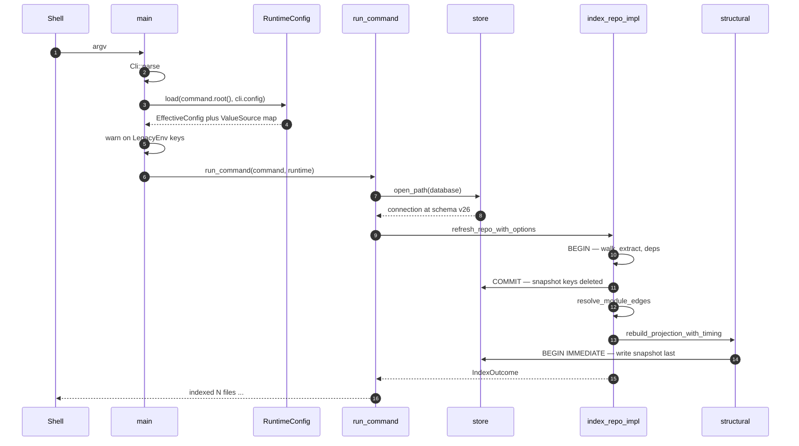
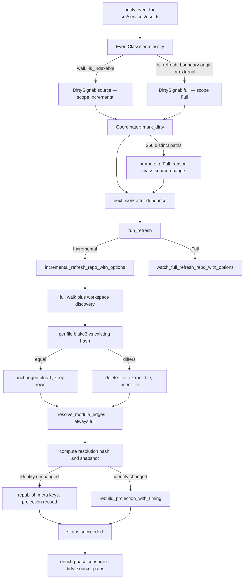

# End-to-end execution traces

This document follows four control paths from process entry to the byte the user or agent sees, in the order the code actually runs them, rather than describing subsystems in isolation. The point is to locate the seams: where configuration stops being consulted, where a transaction opens, where readers become able to observe a new snapshot, and where an error kills the command versus where it is recorded as an exclusion and the run continues. Each trace ends with the failure modes reachable along that specific path.

## Trace 1 — cold index of a fresh repository

`jscout index <root>` on a repository with no `.jscout.db` and no `.jscout.toml`. What to look for in the diagram: configuration is resolved once, in `main`, before any command body exists; and the single long transaction that spans source extraction *and* dependency reads.



1. `main` calls `Cli::parse()` (`src/main.rs:52`) over the clap tree in `src/cli.rs`. `Command::Config` is dispatched *before* configuration loads (`src/main.rs:54`) — it is the one command allowed to run against an unparseable file.
2. `RuntimeConfig::load(command.root(), cli.config.as_deref())` (`src/main.rs:56`, `src/config/load.rs:343`). **This is the only place configuration resolves.** It canonicalizes the root, reads `root/.jscout.toml` (`FILE_NAME`, `src/config.rs:16`) unless `--config` names another path, requires `version = 1` (`src/config.rs:17`), and then resolves every key through a `Resolver` (`src/config/load.rs:206`) with three tiers: file value, then `JSCOUT_*` legacy environment variable, then built-in default. Each key records a `ValueSource`.
3. The resolved struct is serialized and `blake3`-hashed into `runtime.fingerprint` (`src/config/load.rs:905`). Nothing downstream re-reads the environment or the file; every command body treats `runtime.effective.*` as plain data.
4. `runtime.legacy_environment_keys()` filters for `ValueSource::LegacyEnv`; a non-empty list prints `warning: legacy environment configuration supplied …; migrate these settings to .jscout.toml` on stderr (`src/main.rs:57-64`). Non-fatal.
5. `run_command` (`src/commands/mod.rs:153`) binds `configured_database = runtime.effective.database.path` and enters the `Index` arm (`:159-178`). Dependency selection is decided here: `--no-deps` wins, an empty `--deps` falls back to `runtime.effective.index.dependencies`, and a non-empty `--deps` replaces the configured list wholesale rather than appending.
6. `cmd_index` (`src/commands/core.rs:237`) starts a wall clock and calls `open_database_for_write` (`:11`) → `store::open_path` (`src/store.rs:105`). This registers the sqlite-vec extension, creates the file, sets `journal_mode=WAL` / `synchronous=NORMAL` / `foreign_keys=ON`, runs `init_schema` (`:234`) for the base tables plus the `chunks_fts` virtual table, and stamps `meta.schema_version = "26"` (`src/store.rs:8`).
7. `indexer::refresh_repo_with_options` (`src/indexer.rs:227`) enters `index_repo_impl` with `IndexMode::FullRefresh`, `CheckerRetention::Drop`, and `IndexOperation::new(&OsFileSystem)` — the filesystem seam from `src/fs_ops.rs` that lets tests substitute failing reads.
8. `walk::source_inventory` (`src/indexer.rs:317`, `src/walk.rs:98`) traverses with `ignore::WalkBuilder`, rejects anything under `SKIP_DIRS` (`src/walk.rs:11`), keeps the eight JS/TS extensions (`src/walk.rs:8`), and sorts the result. The sort is what makes chunk ids and therefore the snapshot digest reproducible.
9. `conn.execute_batch("BEGIN")` (`src/indexer.rs:356`). The comment above it states the intent: source extraction and every selected-dependency read happen before the publication boundary, so a transient corpus failure rolls back and leaves the previously published snapshot intact.
10. Because `mode == FullRefresh`, the loaded `path → (id, hash, role)` map is discarded (`src/indexer.rs:378-382`) and `store::reset_snapshot_state` truncates the disposable plane instead of cascading per-file deletes (`src/indexer.rs:391-401`). Content-addressed `embeddings`, `semantic_*`, and `scout_runs` survive.
11. Per file: `operation.fs.read_to_string`, then a three-way error triage (`src/indexer.rs:412-423`) — `io_policy::is_inventory_race` skips silently (the inventory was never atomic), `is_retryable` aborts the phase, anything else becomes a `read` rejection. Surviving files go through `extract_file` (`:440`) — one `oxc` arena, `Parser::parse`, `SemanticBuilder`, `Chunker`, `graph::extract` — and `insert_file` (`:453`), which writes `files`, the fact tables, and a parallel explicit row into `chunks_fts` because FTS5 is not foreign-key aware.
12. Dependency discovery, planning, and file preparation run inside the same transaction (`src/indexer.rs:489-492`), then the three publication meta keys are deleted and `COMMIT` runs (`:494-510`).
13. `dependency::synchronize_instances` and `index_dependency_files` take their own transactions (`src/indexer.rs:512-513`); `embed::materialize_cached_embeddings` (`:515`) rebuilds the `vec0` tables from the surviving embedding cache, which is why a full re-index does not force re-embedding.
14. `resolve_module_edges` (`src/indexer.rs:521`) rebuilds `module_edges` from scratch with three resolvers — first-party with workspace aliases, a no-tsconfig fallback so a broken `extends` degrades instead of dropping every edge, and an alias-free resolver for dependency importers.
15. `compute_resolution_hash` and `compute_snapshot_with_resolution` (`src/indexer.rs:526-527`, `src/structural.rs:383`, `:427`) produce the identity pair. The resolution hash exists separately because module resolution reads tsconfigs, manifests, and `node_modules` layout — inputs that are not indexed content and therefore not covered by the file digest.
16. `rebuild_projection_with_timing` (`src/indexer.rs:566`, `src/structural.rs:474`) opens `BEGIN IMMEDIATE`, deletes and rebuilds `graph_nodes` / `resolved_edges` / `entities`, runs six projection stages, and writes `meta.snapshot` and `meta.projection_version` as the **last two statements before COMMIT** (`src/structural.rs:589-598`). Readers require both keys (`src/store.rs:83-97`), so this is the moment a concurrent reader can observe the new index.
17. `recon::reconcile_file_policy_after_index` (`src/indexer.rs:578`) rebuilds the reconnaissance acceleration tables and swallows its own errors by design. `cmd_index` then prints `indexed N files (removed=R, rejected=J) — C chunks, F refs in …` and, since `extraction_reset` is always true here, `snapshot refresh: rebuilt disposable structural state` (`src/commands/core.rs:258-268`).

### Where this fails

A non-existent root fails in step 2 with `repository root does not exist: <path>`, before SQLite is touched. Unparseable TOML, an unknown key (every config struct is `deny_unknown_fields`), or a wrong `version` also fail in step 2. An existing database below `DURABLE_SCHEMA_FLOOR = 16` or above 26 fails in step 6 with a message that tells the user to preserve the old file if its embedding cache matters (`src/store.rs:129-139`). A retryable read error anywhere between steps 9 and 12 rolls the whole transaction back, so the previously published snapshot survives a partial run. Corpus-level problems are deliberately *not* failures: an unreadable file, an unparseable file, or an inaccessible subtree become rejection rows printed to stderr by `indexer::report_rejections` (`src/indexer.rs:79`) and counted in `rejected`. The `unchanged` counter is deliberately not printed here — the comment at `src/commands/core.rs:255-257` notes it would always read 0 and misreport a rebuild as broken change detection.

## Trace 2 — an identifier-shaped query

`jscout search "getUserProfile"`. The interesting part is that the exact-identifier tier (G17) is the *first* thing the ranker does, and its output occupies the head of the result list regardless of what BM25, the vector index, or the cross-encoder produced.

1. Same `main` preamble; the `Search` arm destructures roughly thirty flags (`src/commands/mod.rs:205-236`). Each tri-state pair resolves through `resolve_flag(enable, disable, configured)` (`:115`) where disable wins; `--lexical-only` folds into both `no_vector` and `no_rerank` (`:237-238`). List arguments *replace* the configured default via `or_configured` (`:121`); they never append.
2. `embed::Provider::from_settings` is constructed only if vector retrieval survived (`src/commands/mod.rs:245-251`). `effective_search_response_byte_limit` (`:129`) yields `usize::MAX` for `--debug-json` without an explicit `--response-bytes`, otherwise the configured `search.response_bytes` (default 24 000, `src/search.rs:11`).
3. `cmd_search` opens read-only (`src/commands/core.rs:124`, `src/store.rs:53`). This path never creates or migrates: the schema version must equal 26 exactly, and both `meta.snapshot` and `meta.projection_version` must exist (`src/store.rs:83-97`).
4. `search::search` (`src/search.rs:1024`) validates arguments and wraps the entire multi-statement read in `store::with_read_snapshot` — `SAVEPOINT jscout_search` (`src/search.rs:1047`) — pinning one SQLite snapshot across ranking, memory attachment, and expansion.
5. `ranked_hits` (`src/search.rs:1428`) computes pool sizes (`candidate_pool_limits`, `:1560`) and then calls `exact_intent_candidates` (`:1436`, defined `:428`) **before** `bm25_ranking` and before any vector call.
6. `exact_intent_tokens` (`src/search.rs:371`) splits the query on anything outside `[A-Za-z0-9_$]`. A single-token query that starts with a letter, `_`, or `$` is a pure identifier intent (`is_identifier_token`, `:402`), so every token is admitted. In a mixed natural-language query only `is_code_shaped_identifier` tokens qualify (`:413`) — leading or embedded `_`/`$`, a leading capital, or an internal capital — so plain English words never enter this tier.
7. `occurrence_limit` is the full per-identifier window for a pure identifier lookup and `1` otherwise (`src/search.rs:440-444`). The comment there names the tradeoff: a bare identifier is an explicit request for every exact usage, but in a mixed query one occurrence per identifier establishes coverage without letting a common incidental type consume the result budget.
8. `exact_definition_chunks` (`src/search.rs:481`) runs two `COLLATE BINARY` queries — chunks whose `name` equals the identifier, and chunks containing a `symbols` declaration of that name — then sorts by name priority, export priority, and span so the smallest enclosing exported declaration wins.
9. `exact_occurrence_chunks` (`src/search.rs:596`) unions `refs.target_name`, `member_calls.prop`, and `entity_sites.target_name`, ordered by path and position so results are deterministic rather than score-dependent. If that yields fewer rows than requested, an FTS5 candidate window runs and each candidate is verified by `contains_code_identifier` (`:705`) — a hand-rolled six-state lexer that admits a match only in code state, outside strings and comments, with non-identifier bytes on both sides. Occurrences are fetched at the full window and only truncated *after* definition chunks are subtracted (`:456-470`), because limiting first could hide a real occurrence behind a definition-overlapping row.
10. Only now do `bm25_ranking` (`src/search.rs:884`), `record_vector_ranking` (`:1679`), RRF fusion at k=60 (`:1012`), the optional cross-encoder rerank (`:1472-1502`), and the repository-policy penalty (`:1503-1505`) run. Vector and reranker failures degrade rather than abort: stderr carries `vector search unavailable: …` or `rerank unavailable, using RRF order: …` and the response records a degraded status.
11. `tiered_candidates` (`src/search.rs:790`) assembles the final order. Exact occurrence lists are stably re-sorted so peers that also survived the hybrid pool inherit reranker order among themselves, while exact-only chunks keep their structural order. `append_exact_tier` (`:847`) emits all `ExactDefinition` chunks, then all `ExactOccurrence` chunks, walking breadth-first over depth then identifier so multi-identifier queries stay fair. Remaining fused hits are appended last with `MatchReason::Hybrid` (`:832-843`). Scores on exact hits are inherited from the hybrid map when available and `0.0` otherwise — descriptive, not the ordering key.
12. `apply_response_budget` (`src/search.rs:1793`) sheds content in a fixed order until the rendered payload fits: semantic artifacts, then expansion edges before nodes, then follow-up argument objects, then lower-ranked hits — never the top hit (`:1881-1887`) — then `used_by`/`uses`/anchors, then snippet truncation.

### Where this fails

A missing or stale database fails at step 3 with an explicit `run 'jscout index'` instruction. A configured embedding provider with a missing API key fails at step 2, naming the exact environment variable. The exact tier's precision has a cost that is not a failure but is worth stating: it is byte-exact and case-sensitive, so `getuserprofile` matches nothing in tiers 1 and 2 and falls through to hybrid retrieval alone. The FTS fallback in step 9 is bounded at `clamp(limit*32, 32, 4096)` candidates, so an identifier that appears thousands of times can have real occurrences outside the window. And if the byte limit is below what the minimum envelope needs, step 12 gives up and returns `response byte limit <N> is below the minimum search envelope (<M> bytes)` (`src/search.rs:1936-1938`).

## Trace 3 — an MCP `semantic_search` call

What to look for: the server holds one read-only connection for its whole life, and the byte budget is enforced against the *compact* rendering — the same bytes that actually go back over the wire.

```mermaid
sequenceDiagram
    autonumber
    participant Agent
    participant Loop as serve loop
    participant Args as search_options_from_args
    participant Search as search::search
    participant Budget as apply_response_budget
    participant Render as render_tool_result
    Agent->>Loop: tools/call semantic_search
    Loop->>Loop: log_request with full arguments
    Loop->>Args: profile, args, runtime.effective.search
    Args-->>Loop: SearchOptions with response_byte_limit
    Loop->>Search: read-only connection
    Search->>Budget: shed until compact bytes fit
    Budget-->>Search: ResponseBudget counters
    Search-->>Loop: SearchResult
    Loop->>Loop: compact::search_section_bytes
    Loop->>Render: transport policy resolve
    Render-->>Loop: content plus structuredContent
    Loop-->>Agent: rpc_ok with wire bytes recorded
```

1. `serve` (`src/mcp.rs:145`) canonicalizes the root and opens `store::open_path_read_only(database_path)` once (`:160`). A retrieval-only session therefore never takes a writer lock and never migrates schema.
2. The provider, reranker, telemetry file, and request log are constructed once from `runtime` (`src/mcp.rs:161-187`), then the process enters a single-threaded loop over `stdin.lock().lines()` (`:196`) handling one newline-delimited JSON-RPC message at a time.
3. A malformed line becomes `rpc_error(Null, -32700, "parse error: …")` (`src/mcp.rs:206`) and the loop continues — the connection is not dropped. `log_request` (`:345`) appends a JSONL record containing the **full arguments**, unlike telemetry, which carries no queries.
4. `tools/call` extracts the name and arguments (`src/mcp.rs:265-267`). Only `annotate` under the structural profile opens a second, write-capable connection (`:270-273`); everything else runs on the shared read-only one.
5. `search_options_from_args` (`src/mcp.rs:827`) resolves every field as `args[...].unwrap_or(defaults.<field>)` against `runtime.effective.search`. An omitted MCP argument means "use repository configuration", not "use a hardcoded default". Two hard gates: `expand` under the baseline profile bails (`:835-836`), and `include_memory` is forced false unless the profile is structural (`:857-860`).
6. **Byte budgeting enters here**: `response_byte_limit = args["response_bytes"].as_u64().unwrap_or(defaults.response_bytes)` (`src/mcp.rs:875-878`). Expansion carries its own nested `byte_limit`.
7. `call_tool_with_config` injects the server reranker and calls `search::search` (`src/mcp.rs:966-972`) — the identical pipeline as Trace 2, exact-identifier tier included. Because `compact = !debug` (`src/mcp.rs:873`), `rendered_bytes` measures `compact::search_rendered_bytes` (`src/search.rs:2048-2053`, `src/compact.rs:19`), so the budgeted number is the returned number.
8. `compact::search_section_bytes` (`src/compact.rs:23`) then splits the rendered value into `hits_bytes` / `graph_bytes` / `memory_bytes` / `envelope_bytes` by serializing each sub-value, and the counts land in a `RetrievalStageMetrics` cell (`src/mcp.rs:1000-1026`).
9. `render_tool_result` (`src/mcp.rs:405`) resolves the transport: `auto` picks structured content only when the declared client name and version support it, and silently falls back to text if the payload does not parse as JSON. A tool `Err` becomes `{"isError": true}` with `error: <chain>` as text — an in-band tool error, not a JSON-RPC error.
10. `rpc_response_wire_bytes` is measured on the final envelope (`src/mcp.rs:314-315`), so the recorded count includes JSON-RPC framing and the duplicated text-plus-structured payload. `log_tool_call` (`:1675`) then appends the privacy-minimal telemetry record.

### Where this fails

The budget in step 6 governs the compact payload, not the wire envelope measured in step 10 — under the structured transport the payload is serialized twice, so actual bytes on the wire roughly double a value the agent set expecting a ceiling. An unknown method returns `-32601`. Anything raised inside the tool — unpublished snapshot, a byte limit below the minimum envelope, baseline-profile expansion — arrives as `isError: true`, which means an agent that only checks for JSON-RPC errors will treat a failure as a successful result. Degraded vector or reranker stages are not errors at all; they surface as a `retrieval` block inside an otherwise successful payload, and `compact::search_value` suppresses that block entirely when every stage succeeded (`src/compact.rs:60-62`).

## Trace 4 — one file edited under `jscout watch`

This is the real incremental path. It is a latency optimization, not a scope reduction: the doc comment at `src/indexer.rs:204-208` states that the incremental refresh still scans and hashes the complete source tree, re-evaluates dependency ownership and module resolution, and publishes the same snapshot contract as a full refresh. What it skips is parsing unchanged files.



1. `watch` (`src/watch.rs:648`) canonicalizes the root and subscribes `notify::recommended_watcher` to the tree **before** the startup refresh (`:669`), so edits during a long first pass are queued and force a later generation.
2. `Coordinator::new` (`src/watch.rs:166`) seeds a full-scope dirty signal for generation 1; `EventClassifier::new` (`src/watch.rs:440-454`) excludes the database and its `-wal`/`-shm`/`-journal` siblings (`:441-445`) and builds a `walk::SourcePathPolicy` from the same ignore configuration the walker uses (`:452`). Both are constructed in the watch loop prologue (`src/watch.rs:672-677`).
3. The loop blocks in `receiver.recv_timeout` against the minimum of the phase, reconcile, and checker-flush deadlines (`src/watch.rs:1039-1047`), then hands the event to `ingest_event` (`:1053`).
4. `EventClassifier::classify` (`src/watch.rs:465`) runs ordered gates. For an ordinary `.ts` edit the path clears the database, git-control, external-target, skipped-directory, refresh-boundary, and ignore gates and reaches `walk::is_indexable`, producing `DirtySignal::source` with `RefreshScope::Incremental` (`:519-525`). A `package.json`, lockfile, `tsconfig*.json`, `.gitignore`, or any `.d.ts` would instead hit `is_refresh_boundary` (`:1338`) and force `Full`.
5. `Coordinator::mark_dirty` (`src/watch.rs:192`) takes `refresh_scope = max(current, signal.scope)`, so a single full-scope event in the same debounce window promotes the whole generation. Paths accumulate in `dirty_source_paths`; at `MAX_INCREMENTAL_SOURCE_PATHS = 256` (`:22`) the generation is promoted to `Full` with reason `mass-source-change` (`:235-244`).
6. `next_work` (`src/watch.rs:265`) withholds work until `now >= last_dirty_at + debounce` (`:296`), then emits one `Work` carrying the generation, phase, and scope. Every event queued in between has already been folded in by `drain_events` (`:1256`).
7. `run_refresh` (`src/watch.rs:1076`) opens a write connection with a five-second busy timeout and dispatches on scope: `Incremental` → `indexer::incremental_refresh_repo_with_options` (`src/indexer.rs:209`), `Full` → `watch_full_refresh_repo_with_options` (`:246`). Both are `pub`, non-`cfg(test)`, and reachable from the watch loop.
8. Inside `index_repo_impl`, `mode == IndexMode::Incremental` means the `path → (id, hash, role)` map is **kept** (`src/indexer.rs:378-382`), and `extraction_reset` fires only when at least half the existing rows have an empty hash — an extractor-version bump, not a one-file edit (`:388-397`).
9. **The reuse itself** is `src/indexer.rs:427-436`: if `existing[rel].hash == blake3(source)`, only `files.role` is updated when `file_role::classify` now disagrees, `unchanged` increments, and the loop continues without parsing. The edited file falls through to `store::delete_file` plus `extract_file` plus `insert_file` (`:440-458`). One edit costs one `oxc` parse.
10. Dependency synchronization, embedding materialization, and `resolve_module_edges` still run in full (`src/indexer.rs:512-521`), because tsconfigs, manifests, and `node_modules` layout are not indexed content and cannot be diffed from the file hashes.
11. `CheckerRetention::PreserveActiveForWatch` deletes only inactive checker staging rows (`src/indexer.rs:531`, `src/store.rs:991`), keeping the one active batch as a hidden carry source for the enrichment phase.
12. If `previous == current` — same snapshot, same `PROJECTION_VERSION`, same resolution hash — and checker batches were unchanged, the projection is provably identical and only the three meta keys are republished under `BEGIN IMMEDIATE` (`src/indexer.rs:541-563`). Otherwise `rebuild_projection_with_timing` runs (`:566`). Either way the snapshot key is written atomically with the graph it describes.
13. The watcher prints `watch generation=N phase=refresh refresh_scope=incremental status=succeeded snapshot=… indexed=1 unchanged=842 removed=0 … projection=rebuilt|reused elapsed_ms=…` (`src/watch.rs:756-772`), re-collects watch targets from the freshly published database, and calls `classifier.reload_source_policy()` so ignore-file edits take effect at the same publication boundary as the new inventory.
14. The dirty-path set is consumed later, in enrichment: `dirty_files` is copied out of the coordinator (`src/watch.rs:1170-1175`) and passed into `checker::enrich`, where `current_dirty_source_files` intersects it with indexed files (`src/checker/enrich.rs:381`), `dirty_projects` marks the owning TypeScript projects (`:463`), those projects move to the front of the execution order (`:598`, `:611`), and pending occurrences in dirty files sort first within a project (`:633-634`).

### Where this fails

The incremental path does not reduce I/O — it still stats and reads every source file in the tree to compute hashes, so on a very large repository the floor is a full read pass regardless of how few files changed. Module resolution is re-run in full every generation, which for a repository with many tsconfig projects can dominate the saved parse time. A refresh error prints `status=failed` and `finish_error` schedules an exponential retry capped at 30 seconds (`src/watch.rs:807-820`); the database still holds the previous consistent snapshot because the extraction transaction rolled back. Missed filesystem notifications are covered only by the periodic `reconcile_interval` full refresh, and setting `reconcile_seconds = 0` disables that safety net — the watcher warns about exactly this at startup (`src/watch.rs:706-710`). Checker carry-forward can ignore ambient type drift indefinitely; the bound is `CHECKER_DRIFT_FLUSH_INTERVAL = 24 h` (`src/watch.rs:20`), which issues an incremental-scope generation with `force_full_enrichment = true`.

Related: [02-ingestion.md](02-ingestion.md), [07-retrieval.md](07-retrieval.md), [11-mcp-surface.md](11-mcp-surface.md), [13-incremental-and-watch.md](13-incremental-and-watch.md).
