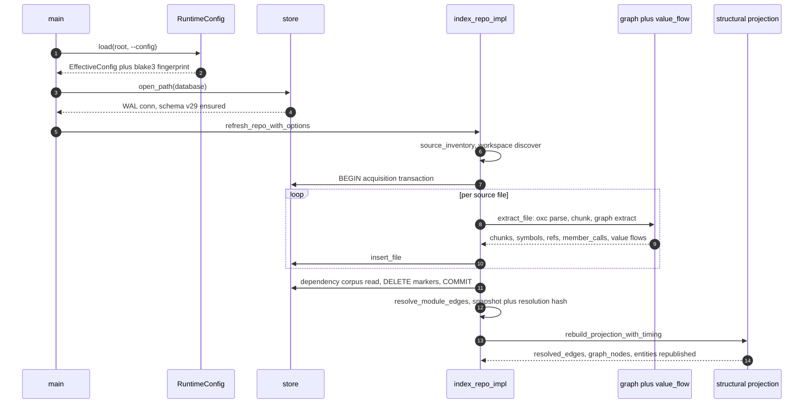
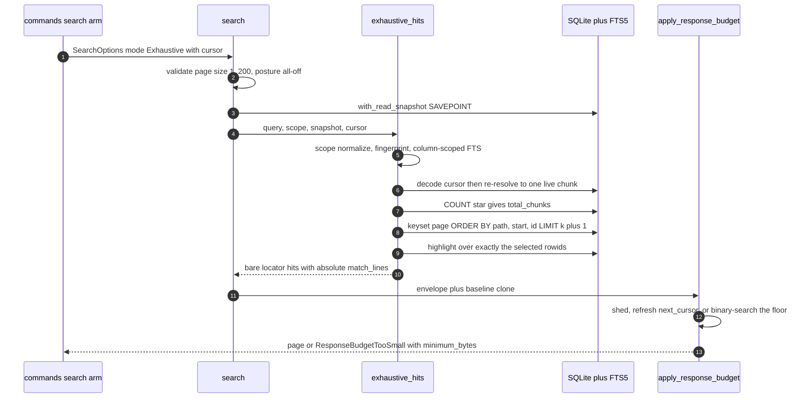
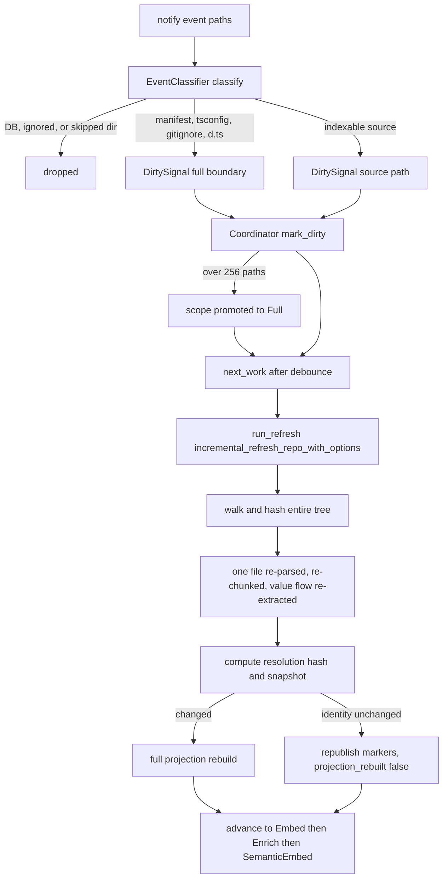

# End-to-end execution traces

Four control paths carry almost all of jscout's behaviour: a cold index that walks a repository and publishes a structural snapshot, an exhaustive lexical query that pages a complete match set under a byte budget, a ranked query whose exact tier runs ahead of the hybrid pipeline, and a single-file edit arriving through `notify` while `watch` runs. Each is followed step by step at commit `4de5622`, naming the function and line that does the work, and each ends with where the path breaks. The traces are deliberately concrete about ordering — several correctness properties (transaction boundaries, cursor stability, tier-before-fusion) are properties of *when* things happen, not of what they compute.

---

## Trace 1 — Cold index: `jscout index /repo`

Look for two boundaries: config resolves once in `main`, before any database file exists, and everything that can fail on I/O sits inside a single `BEGIN` so a transient read never destroys a published snapshot.

`RuntimeConfig` resolves before `store` is touched, so a malformed `.jscout.toml` fails without creating a database file. `graph plus value_flow` runs inside the per-file loop — receiver value flow is extraction-time data, not a later pass. `structural projection` runs *after* `COMMIT`, on committed canonical tables, which is why the checker plane can re-run it independently.

| # | Step | Location |
|---|---|---|
| 1 | `Cli::parse()` builds the command from `enum Command`; `--deps`/`--no-deps` are `conflicts_with`, so contradictions are clap errors. `Command::Config` dispatches *before* config load — the one command that must work on a broken config file. | `src/main.rs:53-55`, `src/cli.rs:42` |
| 2 | **Config resolves here, once.** `RuntimeConfig::load(command.root(), cli.config.as_deref())` canonicalizes the root, reads `ROOT/.jscout.toml`, rejects on `version != SCHEMA_VERSION`, records a `ValueSource` per key, validates every enumerated value, and materializes `EffectiveConfig` — which is then blake3-hashed into `fingerprint` with provenance labels excluded, so the fingerprint tracks policy, not origin. | `src/main.rs:57`, `src/config/load.rs:343-905` |
| 3 | `cmd_index` → `store::open_path`: `create_dir_all` on the parent, register sqlite-vec, open, then the one-boundary migration — if `meta.schema_version != "29"` and the parsed version falls below `DURABLE_SCHEMA_FLOOR` or above 29, hard bail; otherwise `rebuild_legacy_disposable_schema`. Then WAL, `foreign_keys=ON`, `init_schema`. | `src/commands/core.rs:271-277`, `src/store.rs:111-167` |
| 4 | `refresh_repo_with_options` → `index_repo_impl(..., IndexMode::FullRefresh, CheckerRetention::Drop)`. Manual `index` is always a full snapshot refresh, which is why its printed line carries no "unchanged" count. Then `root.canonicalize()`, `walk::source_inventory` (`ignore::WalkBuilder` pruning `node_modules, dist, .next, coverage, out`), and `WorkspaceMap::discover_with_fs`. | `src/indexer.rs:228`, `:317-321`, `src/walk.rs:98-140` |
| 5 | `conn.execute_batch("BEGIN")` opens the acquisition transaction; source reads *and* the dependency corpus both live inside it. `ensure_extraction_version` follows: on `extraction_version != "7"` it blanks every `files.hash` and drops the graph tables, inside the caller's transaction so a later failure restores extractor version and snapshot together. | `src/indexer.rs:357-359`, `:634` |
| 6 | `files` where `origin!='dependency'` is read; `FullRefresh` sets `existing` empty and makes `extraction_reset` unconditional → `store::reset_snapshot_state`. Semantic memory, the embedding cache, and checker facts survive. | `src/indexer.rs:368-400`, `src/store.rs:1091` |
| 7 | Per-file loop: `fs.read_to_string`; `io_policy::is_inventory_race` → silent skip; `is_retryable` → abort the whole phase; anything else → a `"read"` rejection row and continue. Then `blake3::hash(source)` and `file_role::classify`. | `src/indexer.rs:403-441`, `src/io_policy.rs:6,16` |
| 8 | `extract_file` → `parse::with_parsed`: one `oxc_allocator::Allocator` per file, `Parser::parse`, then `SemanticBuilder::new().with_build_nodes(true)` — the node store is required because reference classification walks ancestors. A parser panic becomes an `"extract"` rejection. Inside the arena: `Chunker::chunk_program`, then `graph::extract`. | `src/indexer.rs:663-675` |
| 9 | **Value flow runs here**, inside `graph::extract`: `value_flow::extract(semantic)`, splayed into `receiver_flows / function_flows / binding_flows / class_flows`. It bails on the *whole file* given a `WithStatement` or any `eval` identifier reference — sloppy-mode dynamic scoping can invalidate every binding conclusion. Then `collect_member_writes` → `collect_function_returns` → `extract_classes` → `extract_functions` → `extract_bindings` → `extract_receivers`, each output sorted. | `src/graph.rs:177-181`, `src/value_flow.rs:82-113` |
| 10 | `insert_file` writes `files`, `chunks` + `chunks_fts` (NUL-scrubbed), `symbols`, imports/exports, `events`, `member_calls`, the value-flow tables, then `entity_sites` and `refs`. A linear `chunk_for(offset)` scan assigns each ref and call to its chunk. | `src/indexer.rs:687-993` |
| 11 | Files in `existing` but not `seen` are `delete_file`d. `dependency::discover` runs against the just-extracted uncommitted importer rows; `plan_packages` and `prepare_dependency_files` read and hash the corpus — still inside the transaction. Then the three projection markers are deleted from `meta` and the transaction commits; failure rolls back. | `src/indexer.rs:461-511` |
| 12 | Post-commit: `synchronize_instances` → `index_dependency_files` → `embed::materialize_cached_embeddings`. Then `resolve_module_edges` builds three `oxc_resolver::Resolver`s — workspace-aliased with tsconfig auto-discovery, a no-tsconfig fallback (a broken `extends` degrades resolution rather than dropping a file's edge set), and an alias-free resolver for third-party source. | `src/indexer.rs:512-518`, `:1173-1190` |
| 13 | `compute_resolution_hash` (blake3 over ordered `module_edges` joined to `package_instances`) → `compute_snapshot_with_resolution` (blake3 over `PROJECTION_VERSION = "12"`, ordered file identity, package identity, and the resolution hash). `CheckerRetention::Drop` clears every checker batch. | `src/indexer.rs:525-536`, `src/structural.rs:385`, `:429` |
| 14 | `rebuild_projection_with_timing`: in one `BEGIN IMMEDIATE`, delete `resolved_edges`/`graph_nodes`/`entities`, insert file and symbol nodes, then the fixed stage order `project_module_edges` → `project_references` → `project_entities` → `project_member_calls` → **`receiver_flow::project_receiver_value_flows`** → `project_checker_enrichments` → `project_events`, then upsert the markers and `COMMIT`. | `src/structural.rs:476-624`, `:577` |
| 15 | That stage joins `receiver_value_flows` to `member_calls` on exact `(file_id, call_start, call_end)`. `resolve_receiver_classes` walks the module/export graph at depth ≤ 2, abandoning above 3 candidate classes; non-`this` receivers also require `construction_identity_is_safe`. `resolve_flow_methods` demands `class_chain_allows_property`, exactly one own method per class, and no blocker row. Survivors emit `member_call` edges at `likely`, provenance `"receiver-value-flow"`, `source_ref_id` = the member-call rowid. | `src/structural/receiver_flow.rs:740`, `:586`, `:292`, `:655`, `:927` |
| 16 | `meta.resolution_hash` upsert, then `recon::reconcile_file_policy_after_index` — a policy failure clears the policy tables and warns rather than failing the index. | `src/indexer.rs:568-579` |

The flow edge is *additive*: `project_member_calls` still emits a `member_hub` node and a `possible` edge for every member call. Suppression is read-side and happens three times — `load_occurrences` excludes flow-resolved member calls from the checker's candidate set (`src/checker/enrich.rs:1109-1116`), `project_checker_enrichments` drops checker facts already flow-resolved (`src/structural.rs:2192-2199`), and `who_uses` carries a `NOT EXISTS` hiding `member_candidate` hops already closed at `certain`/`likely` (`src/query.rs:515-523`). Three places must stay in agreement; each sits on a different plane and none sees the others' inputs.

### Where this fails

| Failure | Behaviour |
|---|---|
| Root missing, or `.jscout.toml` malformed / wrong `version` | Hard bail before any DB open (`src/config/load.rs:343-366`). |
| Existing DB at unsupported durable schema | Bail advising the user to preserve the old file and index fresh (`src/store.rs:143-157`). |
| Retryable read (EMFILE/ENOMEM/EAGAIN) on a source or dependency file | The acquisition transaction rolls back; the published snapshot is untouched (`src/indexer.rs:409-411`, `:501-506`). |
| Permission-denied or non-UTF8 read | A `"read"` rejection; the file's old rows are dropped; the index continues. |
| oxc parse panic | An `"extract"` rejection; the index continues. |
| Ignore-file read error at depth 0, or a retryable walk error | The whole inventory aborts. |
| `with` or `eval` anywhere in a file | Zero value-flow rows from it; its member calls stay on the hub/checker path. |

---

## Trace 2 — Exhaustive query with paging: `jscout search /repo "createSession" --exhaustive -k 50 --cursor …`

Look for the two guards that make paging honest: the cursor is bound to both the snapshot and a query+scope fingerprint, and the byte budget re-derives `next_cursor` *after* shedding so a shed tail is re-served rather than lost.

`with_read_snapshot` wraps the count, the page, the cursor re-resolution, and the highlight pass in one savepoint, so `total_chunks` and the page cannot disagree. `highlight over exactly the selected rowids` is a hard requirement, not best-effort. `binary-search the floor` is the fallback when every shedding lever is exhausted.

| # | Step | Location |
|---|---|---|
| 1 | clap declares `--exhaustive` `conflicts_with_all = ["vector","rerank","expand","memory"]` and `--cursor` `requires = "exhaustive"`. The `Search` arm then forces posture: each of `vector`, `rerank`, `include_memory`, `expand` is `!exhaustive && resolve_flag(...)`, so even a *configured* `search.vector = true` is overridden. No provider is constructed — no network I/O at all. | `src/cli.rs:97-102`, `src/commands/mod.rs:239-257` |
| 2 | `resolve_search_limit(true, requested, configured)` clamps an *omitted* `-k` to `MAX_EXHAUSTIVE_PAGE_SIZE = 200` and passes an explicit `-k` through unclamped so the validator can reject it. `open_database_read_only` refuses to create a file, sets `query_only=ON`, and rejects a wrong `schema_version`, a missing `snapshot`, or `projection_version != "12"`. | `src/search.rs:13`, `:22-33`, `src/store.rs:53-105` |
| 3 | In `search`: page size must be in `[1, 200]`; a provider, `rerank`, `expand`, or `include_memory` each bail — belt-and-braces behind the CLI and MCP filtering. Then `store::with_read_snapshot(conn, "jscout_search", …)` and `structural::current_snapshot`. | `src/search.rs:1620-1636`, `src/store.rs:974` |
| 4 | `exhaustive_scope` normalizes roles/origins into canonical order; selecting *all* roles normalizes to "no role filter", so the echoed scope is byte-identical to an unfiltered request. `exhaustive_request_fingerprint` blake3-hashes a domain-separated prefix plus the raw query, roles, and origins. `exhaustive_fts_query` builds `content:"tok" OR …` — **column-scoped**, matching stored source content only, never `name`/`symbols`/`path`. | `src/search.rs:1350-1352`, `:1159-1204` |
| 5 | `decode_exhaustive_cursor` requires six dot-separated parts: prefix `jscout-exhaustive-v2`, 64-hex snapshot, 64-hex fingerprint, hex path, 16-hex start, 64-hex chunk hash. `exhaustive_cursor_position` then re-resolves it against the live index — exactly one row must match `(path, start, hash)` **and** still satisfy the FTS match, origin flags, and role filter. | `src/search.rs:1044`, `:1245-1341` |
| 6 | `COUNT(*)` over `chunks_fts ⋈ chunks ⋈ files` under the same predicates gives `total_chunks`, the completeness denominator returned on every page. The page query adds `LEFT JOIN repository_file_policy`, the keyset predicate `(file.path, chunk.start, chunk.id) > (?,?,?)`, matching `ORDER BY`, and `LIMIT limit + 1` — the one-row over-fetch decides `has_more` without a second count. | `src/search.rs:1379-1458` |
| 7 | `exhaustive_highlights` issues one `highlight(chunks_fts, 0, ?, ?)` over exactly the selected rowids. Markers start at `\u{1e}jscout-match-start\u{1f}` and grow a `-` suffix until no selected chunk's source contains them. **If the highlight set misses any selected chunk the whole search fails** rather than under-reporting. | `src/search.rs:1079-1127` |
| 8 | `exhaustive_match_lines` counts newlines between consecutive start markers from `chunk.start_line`, deduping — absolute, unique, ascending source lines. `project_exhaustive_anchors` batches chunks→symbols→`graph_nodes`, preferring symbols whose name *and* scope chain match, else all overlaps, else `file:<path>`. Each `Hit` is then a bare locator: `score = 0.0`, empty snippet, no `uses`/`used_by`; only the first page marks one single-anchor hit with `include_followups = true`. | `src/search.rs:1130-1150`, `:2842-2888`, `:1468-1500` |
| 9 | `apply_response_budget` clones the whole result into `exhaustive_baseline` **before** any shedding. `apply_response_budget_once` recomputes `returned`, `truncated`, and `next_cursor = encode_exhaustive_cursor(snapshot, fingerprint, selected_positions[returned-1])` on every turn — the cursor always names the last hit that survived the byte budget. | `src/search.rs:2435-2463` |
| 10 | Shedding order: semantic artifacts → artifact supports → expansion edges then orphan nodes → non-seed nodes → follow-up hints → `exhaustive_locator_only = true` (one-shot) → pop hits from the tail, never below one → `used_by`/`uses` → *(ranked only)* anchors → truncate the longest snippet. An exhaustive page never shortens an anchor. Each turn re-settles the exact transport via `settle_search_response`. | `src/search.rs:2478-2610`, `:2712-2737` |
| 11 | **Budget floor.** When every lever is exhausted, `minimum_exhaustive_response_bytes` probes at `usize::MAX` for an upper bound, then binary-searches `[1, upper]`, replaying `apply_response_budget_once` on a fresh clone of the baseline at each candidate. The caller gets `ResponseBudgetTooSmall { byte_limit, minimum_bytes }` — a machine-parseable retry instruction. Ranked search has no such floor. | `src/search.rs:2445-2456`, `:2743-2762` |

Rendering diverges by transport. `--json` forces `default_match: "lexical"` and emits `{at, kind, match_lines, anchor|anchors}`, adding `followups` only when `!locator_only && anchors.len() <= 1` (`src/compact.rs:288-318`). The human CLI prints an `exhaustive: returned=… total_chunks=… truncated=… page_size=…` header, the scope, the next cursor, then two lines per hit and no snippets (`src/commands/core.rs:139-193`). MCP re-applies the same filtering and surfaces the typed budget error as `isError: true` text (`src/mcp.rs:834-880`, `:445-457`).

### Where this fails

| Failure | User-visible |
|---|---|
| `-k 0` or `-k 201` | `exhaustive search page size must be between 1 and 200` |
| Index re-published between pages | `exhaustive search cursor snapshot changed: expected X, current Y` — paging is deliberately not resumed across snapshots |
| Same snapshot, different query/roles/origins | `exhaustive search cursor does not match the query and scope` |
| Cursor chunk edited, deleted, or filtered out of scope | `exhaustive search cursor does not identify one matching chunk in scope` (`src/search.rs:1338`) |
| FTS `highlight()` misses a selected chunk | `exhaustive search could not highlight every selected chunk` — hard fail, not a partial page |
| `response_bytes` too small | `response_budget_too_small: … minimum_bytes=M` |
| Query with no identifier-shaped tokens | Empty page, `total_chunks: 0`, `next_cursor: null` |

The cost is real: an agent that reindexes mid-traversal loses its position and must restart, and nothing resumes a partially consumed page against a newer snapshot. The alternative — silently continuing across snapshots — would make `total_chunks` a lie.

---

## Trace 3 — Identifier query through the G17 exact tier: `jscout search /repo "createSession"`

Steps 1–2 of Trace 2 apply, except `mode = SearchMode::Ranked` and an `embed::Provider` is constructed when `vector` resolves true (`src/commands/mod.rs:250-256`). `search` skips the exhaustive validation and calls `ranked_hits` (`src/search.rs:2044`).

| # | Step | Location |
|---|---|---|
| 1 | `candidate_pool_limits(limit, role_filtered)` → `pool = max(limit,10) * 5`; `vector_pool = pool * 4` under a role filter, because sqlite-vec applies `k` before `files.role` is visible and a selective filter would otherwise starve the vector arm and tilt RRF toward BM25. | `src/search.rs:2050`, `:2176-2188` |
| 2 | **`exact_intent_candidates` runs first — before BM25 and before the vector call.** The exact tier is not a re-rank of hybrid output. | `src/search.rs:2051-2057`, `:530` |
| 3 | `exact_intent_tokens` splits on non-`[A-Za-z0-9_$]`. A single-token query is admitted unconditionally; in a multi-token query only code-shaped tokens qualify — leading or interior `_`/`$`, leading uppercase, or any interior uppercase. Plain English words are never treated as identifiers. | `src/search.rs:473-528` |
| 4 | `occurrence_limit` is the full per-identifier limit when `is_single_identifier_intent`, otherwise **1**: a pure identifier lookup is an explicit request for every exact usage, while in a mixed query one occurrence per identifier establishes coverage without a common incidental type eating the budget. | `src/search.rs:499`, `:538-545` |
| 5 | `exact_definition_chunks` unions two `COLLATE BINARY` queries — chunks whose `chunks.name` equals the identifier, and chunks containing a `symbols` row of that name via `chunk.start <= symbol.decl_start < chunk.end` — ordered by `(name_priority, export_priority, span, path, start, id)`. | `src/search.rs:583-694` |
| 6 | `exact_occurrence_chunks` runs a `UNION ALL` over `refs.target_name`, `member_calls.prop`, and `entity_sites.target_name`, grouped by chunk. Below `limit` chunks, FTS is used **only as a bounded candidate generator** (`limit*32` clamped to `[32, 4096]`) and every candidate must pass `contains_code_identifier` — a lexer walking `Code / SingleQuoted / DoubleQuoted / Template / LineComment / BlockComment` states that requires a case-sensitive, boundary-delimited hit in code. That recovers object-literal keys and non-call member reads the structured tables omit. | `src/search.rs:698-890` |
| 7 | Occurrences are filtered against the definition set **before** the mixed-query truncation — limiting first could discard the one definition-overlapping row and wrongly hide the next real occurrence. | `src/search.rs:558-571` |
| 8 | Only now does the hybrid arm run: `bm25_ranking` with column weights `bm25(chunks_fts, 2.0, 4.0, 3.0, 1.0)` over `(content, name, symbols, path)`, plus origin-partitioned sqlite-vec KNN when a provider exists (a failure folds into `vector_degraded` rather than failing the search). Rankings are role-prefiltered, truncated to `pool`, fused by `rrf(&rankings, 60.0)`, optionally cross-encoder reranked (on error the RRF order stands), and — absent an explicit role filter — reordered by `chunk_policy_penalty / (rank+1)`, a rank-decaying nudge rather than a rescore. | `src/search.rs:986-1024`, `:2071-2119`, `:1585-1595`, `:2150-2175` |
| 9 | **`tiered_candidates` merges.** Occurrence lists are stably re-sorted by hybrid position (`(0, position)` if the hybrid pipeline also surfaced the chunk, `(1, usize::MAX)` otherwise), so exact-only peers keep structural order while hybrid-visible peers inherit the reranker's judgment *within their tier*. `append_exact_tier` round-robins `ExactDefinition` across identifiers by depth, then `ExactOccurrence`, then remaining fused ids as `Hybrid`. **Rank is tier-then-position, never score.** | `src/search.rs:892-982` |
| 10 | `load_hit` per candidate until `limit`: chunk row plus policy join, `project_chunk_anchors`, `uses` (distinct `certain` call/render/extend refs, ≤6), and `used_by` computed **only** when the chunk resolves to exactly one `sym:` anchor, cross-file, via `query::who_uses_anchor_in_origins`. A repo-wide same-name count is refused as `used_by`. Snippet is the first 4 lines. | `src/search.rs:2313-2408` |

A `score=0.0000` on a top hit in text output is the visible signature of an exact-tier chunk the hybrid pool never produced (`src/commands/core.rs:194-217`).

### Where this fails

| Failure | Behaviour |
|---|---|
| Vector provider unreachable or dimension mismatch | `retrieval.vector = "degraded"` plus a `vector_action`; BM25 and the exact tier still serve the query. |
| Reranker unreachable | `reranker = "degraded"`, stderr note, RRF order retained. |
| Identifier appears only in comments or string literals | `contains_code_identifier` rejects it; no false exact-occurrence hit. |
| Query is a lowercase English word inside a sentence | Not code-shaped; no exact tier, pure hybrid. |
| Identifier with tens of thousands of occurrences | FTS candidate generation capped at 4096 rows, per-identifier results at `limit` — the exact tier is *bounded*, not exhaustive. That is what `--exhaustive` exists for. |
| `--response-bytes` too small | A generic envelope message; ranked search has no binary-searched floor. |

---

## Trace 4 — One file edited under `jscout watch /repo --enrich`

Look for where an edit stops being a filesystem event and becomes a generation: `classify` decides scope, `mark_dirty` folds it into a generation, and `next_work` releases it only after the debounce.

`classify` is the only place scope is decided, and it consults `walk::is_in_skipped_directory` *before* boundary detection so a `node_modules/**/package.json` write cannot promote to a full refresh. `walk and hash entire tree` is the honest shape of "incremental" here: incremental mode narrows re-extraction, not the walk. `full projection rebuild` has no partial path — the projection is a pure function of the canonical tables.

| # | Step | Location |
|---|---|---|
| 1 | The `Watch` arm resolves flags and timeouts, enforcing cross-field rules (product requires embed; non-zero reconcile must exceed debounce; `src/commands/mod.rs:543-615`). `watch::watch` canonicalizes root, builds the `notify` watcher, and **subscribes recursively before** the startup refresh so edits during a long first pass are queued. `Coordinator::new` marks generation 1 dirty with `refresh_immediate = true`. `EventClassifier::new` excludes the DB and its `-wal`/`-shm`/`-journal` siblings, snapshots git control paths, and builds a `walk::SourcePathPolicy` from the same ignore configuration as the inventory walker. | `src/watch.rs:648-684`, `:166-190` |
| 2 | On the edit, `classify` walks the paths in order — excluded DB paths ignored, git control paths → `full("git:…")`, selected external roots → `full("external:…")`, anything inside a skipped directory ignored, `is_refresh_boundary` (manifests, lockfiles, `tsconfig.*`/`jsconfig.*`, `.gitignore`, `.gitmodules`, any `.d.ts`) → `full("boundary:…")`, ignore-file match ignored, directories → `full("unknown-directory-event")`, `walk::is_indexable` → **`DirtySignal::source("source:src/a.ts", "src/a.ts")`**. | `src/watch.rs:465-537` |
| 3 | `mark_dirty`: if the current generation already has work, bump `desired_generation`, clear reasons/paths, reset scope to `Incremental` — **unless** a *failed* refresh retry is parked on this generation, in which case its scope and reasons carry into the successor, since a failed refresh has not consumed its requirement. `refresh_scope = max(current, signal.scope)`. Past `MAX_INCREMENTAL_SOURCE_PATHS = 256` distinct paths, scope is promoted to `Full` with reason `mass-source-change`. | `src/watch.rs:192-249`, `:22` |
| 4 | `next_work` refuses while a phase is active, drops stale work from superseded generations, honours a parked retry's `due`, and otherwise requires `desired > completed` and `now >= last_dirty_at + debounce`. `run_refresh` then opens a fresh phase connection and calls `incremental_refresh_repo_with_options` → `index_repo_impl(..., IndexMode::Incremental, CheckerRetention::PreserveActiveForWatch)`. | `src/watch.rs:265-308`, `:1076-1099`, `src/indexer.rs:210-226` |
| 5 | `Incremental` keeps `stored` as `existing`. It **still walks and hashes the complete tree** and re-evaluates dependency ownership and module resolution — a latency optimization, not a narrowed contract. Hash-matched files bump `unchanged` and update only `files.role` if reclassified; the edited file takes `delete_file` + `extract_file` + `insert_file`, so it is re-parsed by oxc, re-chunked, and **its value-flow rows are re-extracted**. | `src/indexer.rs:368-461`, `src/graph.rs:177` |
| 6 | `extraction_reset` fires here only when `cleared * 2 >= existing.len()` — an extractor-version bump that blanked at least half the hashes, at which point per-file replacement is pathological and `reset_extraction_state` truncates instead. `CheckerRetention::PreserveActiveForWatch` deletes only `active=0` batches, keeping the previously active batch hidden as a carry source for the enrich phase. | `src/indexer.rs:389-400`, `:531-536`, `src/store.rs:1047`, `:1113` |
| 7 | Because one file's content hash changed, the new snapshot differs and the **full** projection rebuilds, including `project_receiver_value_flows` over the whole repository. If identity is unchanged and no checker batch changed, the `previous == current` branch republishes the three markers in a `BEGIN IMMEDIATE` and reports `projection_rebuilt = false`. | `src/indexer.rs:544-567`, `src/structural.rs:577` |
| 8 | Post-refresh: recollect watch targets (falling back to git targets on read failure), re-add checker-sourced targets when enrich is on, re-reconcile the registry, and **`classifier.reload_source_policy()`** — a `.gitignore` edit takes effect at exactly the same publication boundary as the new inventory. Then `drain_events` immediately, so events that arrived during the refresh are folded in before `finish_refresh` decides supersession. | `src/watch.rs:779-800`, `:456` |
| 9 | `finish_refresh` → `advance` walks `Refresh → Embed → Enrich → SemanticEmbed`, skipping disabled phases. Both optional phases run interruptibly: a worker thread with its own connection and an `AtomicBool` cancel flag, polled every 100 ms while the main thread keeps ingesting events. | `src/watch.rs:326-416`, `:1101-1128` |
| 10 | Enrichment receives `dirty_files = coordinator.dirty_source_paths`. Inside `checker::enrich`: `load_occurrences` (excluding deterministically resolved *and* receiver-flow-resolved member calls) → `select_eligible` → Node sidecar → `plan_inventory_ownership` → `package_gate::evaluate` → `gate_inferred_projects` → a second `plan_members_cached` over the admitted scope, which must return identical TypeScript identity and ownership or the run bails. | `src/watch.rs:1158-1207`, `src/checker/enrich.rs:374-500`, `:1099-1116` |
| 11 | `plan_fingerprint` folds snapshot, selection, project plan, per-project fingerprints, TS identity, protocol version, the package-gate fingerprint, and options; `reusable_completed_batch` can return an existing batch outright without spawning project work. Otherwise a staging batch opens, `carry_forward_projects` reuses answers whose freshness manifest still holds, and `projects_in_execution_order` runs **dirty projects first**. | `src/checker/enrich.rs:560-614`, `:688-722` |
| 12 | After all projects, `revalidate_package_gate` re-checks the gate, then `activate_staging_batch`; if publication changed, `structural::rebuild_projection` republishes the graph with the new checker facts. Partial failure activates the healthy subset first, then returns `PartialEnrichmentError`. | `src/checker/enrich.rs:833-872` |
| 13 | `advance` on the last phase sets `completed_generation`, clears dirty state, and anchors the next reconciliation deadline **from completion, not from timer fire** — a long generation cannot create a back-to-back refresh loop. | `src/watch.rs:388-416` |

Two ambient timers sit outside the event path. Periodic reconciliation injects `full("periodic-reconciliation")` only when the coordinator is clean, and any ordinary generation clears the pending deadline so retry-waits do not poll at the 1 ms floor. `CHECKER_DRIFT_FLUSH_INTERVAL = 24 h` sets `force_full_enrichment`, which survives generation bumps via `preserve_checker_flush_requirement` — it bounds how long carry-forward can ignore ambient type drift (`src/watch.rs:20`, `:194-218`).

### Where this fails

| Failure | Behaviour |
|---|---|
| Refresh error (retryable read, etc.) | `phase=refresh status=failed`; `schedule_retry` with `500ms << (attempts-1)` capped at 30 s (`src/watch.rs:371-386`). |
| A new edit lands during a retry-wait | The generation bumps but the failed refresh's scope and reasons carry forward. |
| A new edit lands mid-phase | The cancel flag or sidecar cancellation fires; the phase reports `canceled`, `finish_optional` sees a generation mismatch and returns `Superseded`; the newer generation restarts from `Refresh`. |
| Ctrl-C during enrichment | `checker::process::interrupt_pending()` → `watch status=stopped reason=interrupt` and a clean exit; staged checker work is retained for resume. |
| More than 256 distinct dirty source paths | Scope promoted to `Full`; refresh uses `watch_full_refresh_repo_with_options`. |
| Any `.gitignore`, manifest, tsconfig, or `.d.ts` touched | `is_refresh_boundary` forces `RefreshScope::Full` regardless of how small the edit was. |
| `notify` channel disconnects | Clean `Ok(())` exit — the watcher does not attempt to re-establish. |

The dominant cost is step 7: a one-character edit rebuilds the entire projection, including receiver-flow resolution across every member call in the repository. The tradeoff is deliberate — a partial projection would need its own invalidation model, and the snapshot/resolution-hash pair exists precisely so the *no-op* case stays cheap. Edits that genuinely change content pay full projection cost every time.
