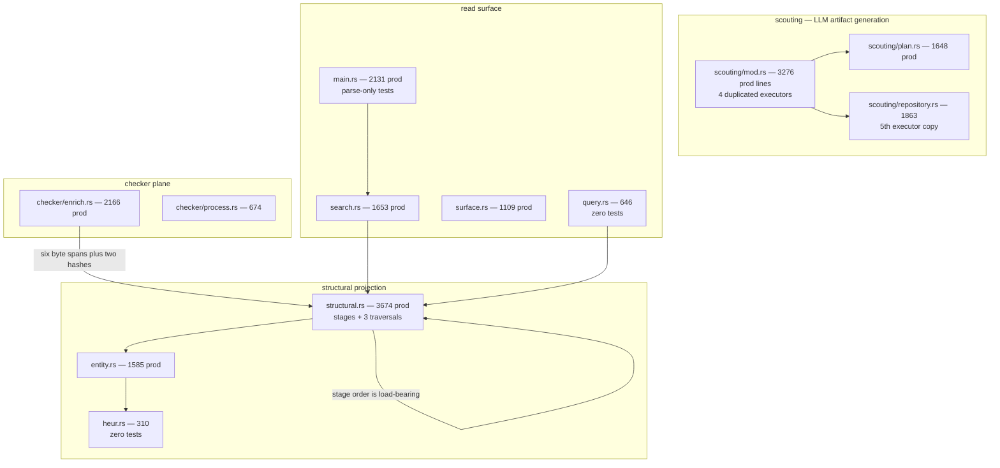
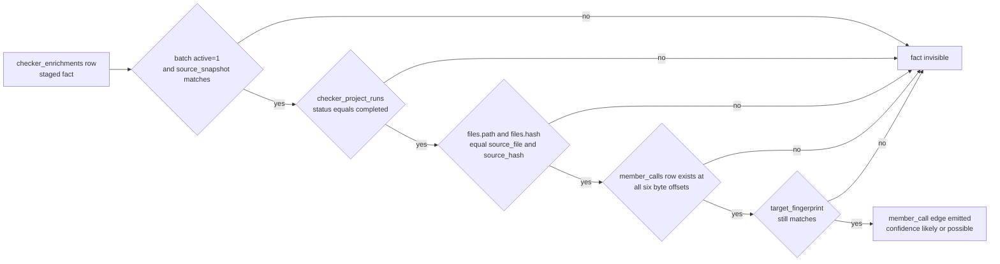

# Sharp edges, complexity hotspots, and risks

This document collects the places in jscout where the code is hard to change safely, where a rule is enforced by nothing but habit, where a number that reads like a measurement is actually an estimate, and where the test suite does not reach. It is organized by hazard rather than by subsystem, because most of these hazards recur: the same "no foreign key, just two statements that must agree" pattern binds FTS5 to chunks and sqlite-vec to embedding entries, and the same copy-paste growth affects both scouting and structural projection. Every item names what breaks and roughly what fixing it would cost.

## Complexity hotspots

Six files carry most of the risk. Line counts below are total, with the `#[cfg(test)] mod tests` boundary broken out because in this codebase the test half is often larger than the production half.

| File | Total | Production | Tests start | Why it is large |
|---|---:|---:|---:|---|
| `src/scouting/mod.rs` | 6523 | 3276 | `:3277` | Four near-identical family executors plus the ledger/budget plumbing |
| `src/structural.rs` | 5265 | 3674 | `:3675` | Projection stages, key formats, ranking weights, three traversal algorithms |
| `src/checker/enrich.rs` | 3297 | 2166 | `:2167` | Occurrence selection, batching, staging, activation validation |
| `src/semantic.rs` | 2999 | 2033 | `:2034` | Artifact validation, freshness rules, lexical ranking |
| `src/indexer.rs` | 2574 | 1084 | `:1085` | Two index algorithms, one of which is test-only |
| `src/main.rs` | 2403 | 2131 | `:2132` | Full clap surface plus every command handler; the test module covers argument parsing only |

The worst offender is `src/scouting/mod.rs` (detailed in [08-scouting.md](08-scouting.md)). Its four prepared-execution functions — workflow, card, concept, summary — repeat the same block: gateway-error triage, `usage_json` construction, billing-path update, tool-contract check, schema check, validation check, incomplete branch, publication transaction. The duplication is literal down to the comment text; the `remote_timeout(&error)` guard appears at `src/scouting/mod.rs:1133`, `:1449`, `:1808`, and `:2366`, and `src/scouting/repository.rs` carries a fifth partial copy. Any fix to the error triage has to land five times. Consolidating means abstracting over four differently shaped `Validated*` types with different publication rules — concepts pin their predecessor before the model call and re-check it at `:1980-1988`, while cards and summaries assign `supersedes` inside the publication transaction. That is a real refactor, not a mechanical one.

`src/structural.rs` is large for a different reason: the projection stages are separate functions but their *order* is load-bearing and nothing declares that. `project_entity_callers` queries `resolved_edges` for `kind='call'` (`src/structural.rs:1872-1875`), which only returns rows because `project_references` ran earlier in the same transaction. Reordering the stages produces zero `produces_*_via` edges with no error and no failing test that names the dependency. Splitting the file is easy; splitting it without encoding the stage order is how you lose those edges.

The following diagram groups the hotspots by subsystem with production line counts, and marks the two cross-file coupling edges that make them hard to split independently.

The `C1 --> G1` edge is the checker re-anchoring join described below, and it is the single most fragile cross-file contract in the repository. The self-loop on `G1` is the stage-ordering dependency. `G3` and `R3` are annotated with their test counts because both sit directly under code that is heavily tested — `heur.rs` produces the `member_calls` spans that the entire checker plane joins on, and `query.rs` holds the export-chain resolver, yet neither has a single `#[test]`.

## Invariants held together by convention

SQLite enforces some of jscout's structure with foreign keys and CHECK constraints ([05-storage-schema.md](05-storage-schema.md)). The rules below are not among them; they are maintained by two pieces of code agreeing, and violating them produces wrong answers rather than errors.

| Invariant | Where it lives | What breaks | Fix cost |
|---|---|---|---|
| `chunks_fts.rowid == chunks.id` | two `prepare_cached` statements in `insert_file`, `src/indexer.rs:521-547` | FTS hits join to the wrong chunk; search returns unrelated code | low — one insert helper |
| `vec_embeddings_{N}.rowid == embedding_index_entries.id` | `src/embed.rs:1184-1197` | KNN results attach to the wrong chunk/artifact | low |
| FTS5 column order matches the bm25 weight tuple | `src/store.rs:33` vs `src/search.rs:263` | symbols get scored with the name weight; silent relevance shift | low, but needs a test |
| Checker facts re-anchor on six byte offsets plus two hashes | `src/structural.rs:2129-2143`, fingerprint recheck `:2199-2209` | every stored checker batch is discarded silently | high — see below |
| Projection stage order | `src/structural.rs:1872-1875` depends on `project_references` | `produces_*_via` edges vanish | medium |
| `is_noise` list matches `walk::SKIP_DIRS` | `src/watch.rs:1030-1043` vs `src/walk.rs:8` | watcher ignores a directory the indexer walks, or vice versa | low |
| Release bundle keeps `gateway/src/main.mjs` and `checker/src/main.mjs` as siblings of the binary | probed at `src/llm/config.rs:109`, `src/checker/mod.rs:28`; produced only by `scripts/package-release.sh:51-59` | packaged binary cannot find its sidecars | low |
| Schema version string appears three times | `src/store.rs:8` constant, hardcoded `'23'` at `:220` and `:238` | bumping the constant alone leaves migrated databases stamped with the old version, stuck in a migration loop | trivial, unfixed |
| Rust toolchain pinned in three files | `rust-toolchain.toml:2`, `.github/workflows/ci.yml:15`, `:58` | CI silently builds on a different compiler than local | trivial |
| MCP schema property names match the `args["…"]` reads | `src/mcp.rs` `tool_defs` vs `call_tool` | a renamed property falls through to its `unwrap_or` default with no error | medium |

The checker re-anchoring join deserves its own picture, because it is the one place where a change in an unrelated file (`src/heur.rs`, which computes call/receiver/property spans) invalidates expensive work — a full TypeScript program build per project — with no diagnostic at all.

Five gates, and failing any one of them drops the fact by producing no row — never an error. The `E` gate is the fragile one: the six offsets are `call_start`, `call_end`, `receiver_start`, `receiver_end`, `property_start`, `property_end`, recorded by `src/heur.rs:237-242` and stored in the columns declared at `src/store.rs:375-390`. If anyone changes what a "call span" means — for instance to include or exclude an optional-chaining `?.` — every previously staged batch stops projecting and the repository loses its only non-heuristic call resolution, appearing simply as fewer edges ([04-call-graph-and-surface.md](04-call-graph-and-surface.md)). Fixing this means adding a span-format version to the batch row so a mismatch is loud: a small schema change plus a migration.

Two more conventions worth naming. `member_calls.rowid` is disposable and reassigned on every full refresh — identity is the `(source path, source hash, offsets)` tuple. That invariant was actually violated in production until commit `7c98074`. And `structural::rebuild_projection` deletes only three tables (`resolved_edges`, `graph_nodes`, `entities` at `src/structural.rs:447-449`); `entity_occurrences` and `entity_edges` disappear through `ON DELETE CASCADE`. Drop those FKs and the projection silently accumulates orphans.

## Approximations that read like measurements

Several numbers surfaced to users and to other documents are estimates, heuristics, or plain miscounts. Ranked by how misleading they are:

1. **`Hit.score` is two incomparable scales in one field, and the returned order is not score order.** After `merge_reranked_prefix` (`src/search.rs:909-921`) the reranked prefix carries raw cross-encoder logits while the tail carries RRF scores in the ~0.016 range. Then `apply_repository_policy_penalty` (`src/search.rs:870-893`) sorts by `chunk_policy_penalty/(rank+1)` and writes the rows back **without touching `score`**. Any consumer that thresholds or re-sorts on `score` is broken by construction. Fixing it properly means publishing a rank plus a separate calibrated score; fixing it cheaply means documenting that `score` is diagnostic only.
2. **Context budgeting measures bytes and calls them tokens.** `enforce_context_budget` (`src/scouting/mod.rs:2937-2942`) uses the serialized request's UTF-8 byte length as an upper bound on input tokens, because pi-ai exposes no tokenizer. This over-rejects by roughly 3–4x on real prompts, and the refusal message quotes a "token count" that is a byte count. Packs that would comfortably fit a smaller-context model are refused.
3. **`who_uses` tier 3 returns name collisions as usage.** `who_uses_in_origins` falls back to matching `member_calls.prop = name` (`src/query.rs:553`) with no receiver, no type, and no callee origin. Every `.get()`, `.run()`, and `.handle()` in the repository comes back as a "possible" usage of any symbol with that name. Tier 2 is separately expensive: it scans every cross-file ref row (`src/query.rs:513-514`) with no target-name predicate and resolves each in Rust, once per matched target.
4. **`used_by` counts are global by name.** `load_hit` counts refs with `WHERE target_name = ?1 AND chunk_id != ?2` (`src/search.rs:1092`) — no origin, role, or resolution filter. The code comment claims the count is "from other files", but the predicate excludes only the current chunk, so other chunks of the same file are included. Common names produce wildly inflated "N sites" figures.
5. **`files_scanned` is a candidate count.** `CallQueryResult.files_scanned` is set to `files.len()` at `src/calls.rs:170`, after the loop may have broken early on truncation. It reports files that were never opened.
6. **Absence of a member hub is not evidence of no call.** A `member:unknown:<prop>` hub exists only if at least one indexed symbol is named exactly `prop` (`src/structural.rs:1965-1971`). Calls into a method with no namesake anywhere are absent from the graph entirely.
7. **Rendered byte counts are not fixed points.** Every `rendered_bytes` settling loop caps at 8 iterations and returns the last value on non-convergence (`src/mcp.rs:1237-1246`, `src/compact.rs:363-392`, `src/surface.rs:1073-1082`). The published byte count can disagree with the actual serialized length.
8. **`matched_targets` in the MCP `definition` response is pre-truncation.** The renderer takes at most 5 (`src/mcp.rs:729`) but reports the full count; the cap appears in neither the tool description nor the schema.
9. **Evaluation navigation metrics are model self-reports.** `inspected_files` is not traced from Codex event artifacts, yet `scripts/eval-report.mjs` computes `mean_inspected_files` and `mean_irrelevant_files` from it and the results tables print those numbers ([12-evaluation.md](12-evaluation.md)).
10. **Benchmark correctness is a regex over output text.** `bench/bench.py:25-35` scores a query correct if an expected identifier appears anywhere in the result — name presence, not ranking. Both harnesses also default to the author's machine paths (`bench/bench.py:16`, `bench/bench-aipipe.py:16`) and a fixed LM Studio endpoint.

## Footguns for a new contributor

**Naming traps.** `src/scout.rs` is a source renderer used by the MCP `definition` tool; the generative scouting subsystem is `src/scouting/`. `src/surface.rs` is entity lookup and repository overview, not public-API-surface computation — the word "exported" appears there only as a per-symbol boolean. `src/compact.rs` is agent-facing JSON projection and `src/stats.rs` is an oxc AST counter; neither has anything to do with storage compaction.

**Half of `src/indexer.rs` never runs in production.** `index_repo` and `index_repo_with_options` (`src/indexer.rs:129-146`) are both `#[cfg(test)]`. The only production entry point is `refresh_repo_with_options` (`:150-156`), and both callers pass `IndexMode::FullRefresh`. Consequently the "at least half of files have an empty hash" truncation heuristic (`:229-235`), the unchanged-file skip branch, the `delete_file` path in the first-party loop, and the `ProjectionIdentity` republish shortcut are all unreachable outside tests — see [11-incremental-and-watch.md](11-incremental-and-watch.md). `IndexMode` itself carries `#[cfg_attr(not(test), allow(dead_code))]` at `:159` because `Incremental` is unconstructible outside tests.

**Concurrency is unguarded.** No store connection sets `busy_timeout` except the watcher's, at `src/watch.rs:965`. Running `jscout index` while `jscout watch` is running gives an immediate `SQLITE_BUSY` rather than a retry. Worse, `open_staging_batch` executes `DELETE FROM checker_enrichment_batches WHERE active=0` (`src/checker/enrich.rs:1126`) before inserting, so two concurrent `enrich` runs with different plans destroy each other's staged work; nothing beyond `BEGIN IMMEDIATE` prevents it.

**Ctrl-C only exists during enrichment.** The `ctrlc` handler is installed lazily inside `checker::enrich` (`src/checker/enrich.rs:206`). Without `--enrich`, `jscout watch` has no handler and dies on default SIGINT semantics; with `--enrich`, the handler only exists after the first enrichment pass begins. Interrupting during a Refresh or Embed phase kills the process outright rather than draining to the clean-shutdown return at `src/watch.rs:729-732`.

**CLI asymmetries.** `events`, `who-uses`, and `neighborhood` accept no `--database` and hardcode `store::open_read_only(root)` (`src/main.rs:1669`, `:1695`, `:1403`), while `search`, `calls`, `memory`, `overview`, `enrich` and the scout commands all accept one — an evaluation harness pointing at an external database silently gets the repo-local one for those three. `cmd_who_uses` calls `std::process::exit(1)` on no-match (`src/main.rs:1700`) instead of returning an error, skipping every Drop. `scout repository --dry-run` still spawns the Node gateway (`src/main.rs:1894`) even though it makes no model calls, so a dry run fails on a machine without Node.

**Two penalty tables that look alike.** `recon::policy_penalty` (runtime 1.0 / tooling 0.45 / documentation 0.4 / test 0.3 / generated 0.1) drives retrieval ranking; `file_role::penalty` (production 1.0 / unknown 0.75 / documentation 0.4 / test 0.3 / fixture 0.2 / generated 0.1) drives graph traversal. Different role vocabularies, different values, similar names. Related: role *filtering* everywhere tests the deterministic `files.role`, but compact output renders the reconnaissance-assigned `repository_role` (`src/compact.rs:175-178`). Because the two vocabularies do not overlap, a file the reconnaissance scout reclassified as `test` still passes a `production` allowlist while displaying as `test`.

**Omitting `--deps` deletes the dependency corpus.** `synchronize_instances` treats the run's selector list as authoritative and deletes any instance not in it, along with its files (`src/dependency.rs:190-219`).

## Dead and vestigial code

There are zero `TODO`, `FIXME`, or `XXX` markers anywhere in `src/`, `gateway/src/`, `checker/src/`, or `inference/`. That is not the absence of deferred work — it is deferred work encoded where grep will not find it, in `#[allow(dead_code)]` attributes and PLAN.md gate numbers.

| Item | Location | Note |
|---|---|---|
| `ProcessGateway::poisoned()` | `src/llm/process.rs:320` | `#[allow(dead_code)]` with the comment "consumed by the sidecar restart policy (follow-up layer)". No restart policy exists in either sidecar. |
| `IndexMode::Incremental` | `src/indexer.rs:159` | An entire algorithm branch kept only to diff tests against. |
| `scouting::scout_workflows` | `src/scouting/mod.rs:281` | `#[cfg(test)]`; the live path is always `scout_workflow_plan`. |
| `structural::clear_checker_plane` | `src/structural.rs:563` | `#[cfg(test)]`, yet its doc comment describes production watch behavior. Either the path moved or the comment is stale. |
| `heur::span_of` | `src/heur.rs:307` | `#[allow(unused)]`. |
| `Coordinator::cycle_snapshot` | `src/watch.rs:83` | Assigned at `:235`, cleared at `:139` and `:294`, never read. The refresh snapshot is threaded through `finish_refresh`'s signature purely to be discarded. |
| Redundant `selected_keep` block | `src/scout.rs:144-146` | `position(|_| true)` is always 0, and the next line sets `selected_keep[0] = true` unconditionally. |
| `semantic_relations.relation = 'names_concept'` | `src/store.rs:762-766` | Reserved by comment for a future feature; current concepts use `related_to` in the opposite direction. |
| `validate_inputs`, singular `resolve_member` | `checker/src/main.mjs:110`, `worker.mjs:720`/`:773` | Fully implemented in Node, `#[cfg(test)]` on the Rust side (`src/checker/protocol.rs:13`); `resolve_member` duplicates ~50 lines of `resolveInProject`. |
| `resolve_module_edges` visibility | `src/indexer.rs:860` | `pub` with no caller outside its own module. |
| `concept::normalize_text` | `src/scouting/concept.rs:50-52` | A bare alias for `normalize_display`; the indirection anticipates a divergence that never happened. |
| `--all-features` / `--all-targets` in CI | `.github/workflows/ci.yml:20,22` | Inert: `Cargo.toml` declares no `[features]` table, and there is no lib, no registered examples, no benches, and no `tests/` directory. |

## Testing and CI gaps

Ranked by exposure:

1. **Seven Rust modules have zero `#[test]` functions**: `src/walk.rs` (the file walker, so extension and skip behavior is only covered transitively), `src/graph.rs`, `src/heur.rs` (which produces the spans the entire checker plane joins on), `src/query.rs` (646 lines holding the export-chain resolver, the three-tier `who_uses`, and the hub-traversal SQL), `src/scouting/workflow.rs` (448 lines), and the two `doctor` façades `src/checker/mod.rs` and `src/llm/mod.rs`. `src/main.rs` has a test module but it asserts only on parsed clap variants, so all 2131 production lines of command handling are untested. `src/agent.rs`, `src/origin.rs`, `src/package_exports.rs`, `src/stats.rs`, and `src/scouting/refresh.rs` have exactly one test each.
2. **CI runs neither the JavaScript nor the Python suite.** `.github/workflows/ci.yml` has four jobs — `rust`, `gateway`, `checker`, `release-package`. The root `npm test` (`package.json:9`, 17 hand-enumerated files covering the entire eval, replay, and grading harness) gates nothing, and `test:inference` (7 tests in `inference/test_service.py`) is invoked by no job. The `gateway` and `checker` jobs run `node --test` and today find exactly one test file each.
3. **`scripts/eval-workflow-scope-report.test.mjs` runs nowhere.** The test list in `package.json:9` is hand-enumerated rather than globbed, and this one file — 1 of the 17 in `scripts/` — is missing from it. Seven other eval scripts have no `.test.mjs` counterpart at all.
4. **The watcher-cancel-during-enrich path has no end-to-end test.** Correctness depends on the ordering of `cancellation_pending()` checks relative to per-project sidecar spawn, and `execute_project` re-registers the interrupt control for each new sidecar. That interaction is only reasoned about, not exercised.
5. **Windows release artifacts ship untested.** `scripts/package-release.sh:16-19` supports building a `jscout.exe` for Windows targets, but the `/bin/sh` test doubles at `src/llm/process.rs:468-474` and `src/checker/process.rs:561-587` use `std::os::unix::fs::PermissionsExt`, making the Rust suite Unix-only.
6. **The release smoke test never makes a model call.** `llm doctor` stops at capabilities and the synthetic provider points at `127.0.0.1:11434`, which is never contacted. The job proves the bundle starts, not that it can complete a request.
7. **No JavaScript linting or formatting anywhere** — no eslint or prettier configuration for the roughly twenty `.mjs` files across `gateway/`, `checker/`, `examples/`, and `scripts/`. Rust gets `fmt --check` plus `clippy -D warnings`.
8. **`cargo test` and `cargo clippy` run without `--locked`** (`.github/workflows/ci.yml:20,22`). Cargo still honors the committed `Cargo.lock`; the difference is that `--locked` *fails* on a stale lock instead of updating it in place. Only `scripts/package-release.sh` passes `--locked`, so the `rust` job and the `release-package` job can disagree about dependency versions.
9. **No `concurrency` group in the workflow**, so successive pushes to a branch run overlapping builds instead of cancelling stale ones.
10. **Thirteen environment variables are read by code and absent from `.env.example`**: `JSCOUT_DEBUG`, `JSCOUT_QUERY_PREFIX`, `JSCOUT_RERANK_TOP`, `JSCOUT_RERANK_CHARS`, `JSCOUT_TELEMETRY_FILE`, `JSCOUT_SESSION_ID`, `JSCOUT_TASK_ID`, `JSCOUT_PROFILE_LABEL`, `JSCOUT_UV`, `JSCOUT_INFERENCE_PROJECT`, `JSCOUT_INFERENCE_BATCH_SIZE`, `JSCOUT_INFERENCE_MAX_LENGTH`, and `JSCOUT_INFERENCE_ALLOW_REMOTE`. The last is security-relevant: `inference/service.py:430-436` refuses a non-loopback bind unless it is set, and warns to enable it only on a trusted network. An operator reading `.env.example` alone would never learn it exists.
11. **`scripts/package-release.sh` does not bundle `inference/`** (it copies only `gateway/` and `checker/`), so a user of the packaged tarball has no local embedding or reranking service and therefore no path to `JSCOUT_EMBED_PROVIDER=local` without a source checkout. It does ship `PLAN.md`, a 109 KB internal planning document with gate numbering, to every end user.

Two smaller repository-hygiene items: `.gitignore:3` covers only `/checker/node_modules/`, with `gateway/node_modules` handled by a separate `gateway/.gitignore` and the root `node_modules/` covered by neither; and 49 files under `eval/results/` are tracked in git, so evaluation output accumulates in version control by design rather than by accident.

## Operational edges in the read path

Three behaviors will surprise anyone tuning retrieval (see [07-retrieval.md](07-retrieval.md) for the pipeline itself). The reranker is auto-enabled only when `JSCOUT_EMBED_PROVIDER` is literally `local` (`src/search.rs:325-330`); a remote embedding provider silently gets no reranker unless `JSCOUT_RERANK_URL` is set, and `RetrievalStatus` reports `disabled` rather than `unavailable`. Its request carries `deadline_ms: 120000` under a 125-second HTTP timeout, and that blocking network call happens *inside* the `jscout_search` savepoint — the read snapshot is held open for up to two minutes. A rerank service returning an empty score array degrades silently: the `Ok(_)` arm at `src/search.rs:838` does nothing, leaving the status indistinguishable from "not configured".

Response-budget shedding is quadratic in the wrong direction. The shed loop re-serializes the entire envelope on every iteration and removes exactly one item per pass (`src/search.rs:1142`, `:1322`; `src/surface.rs:998-1059`). A response ten times over budget performs hundreds of full JSON serializations, and `expand_hits` clones the full candidate node and edge vectors and re-serializes them for every admission trial (`src/search.rs:1571-1637`).

Finally, `calls.rs` re-parses every candidate file on every query with no caching, and aborts the *entire* query on the first file whose on-disk blake3 differs from the indexed hash (`src/calls.rs:119-124`). Candidates are ordered by path, so which drift error a user sees is path-dependent, and one edited file makes the whole `calls` tool unavailable until the next index.
