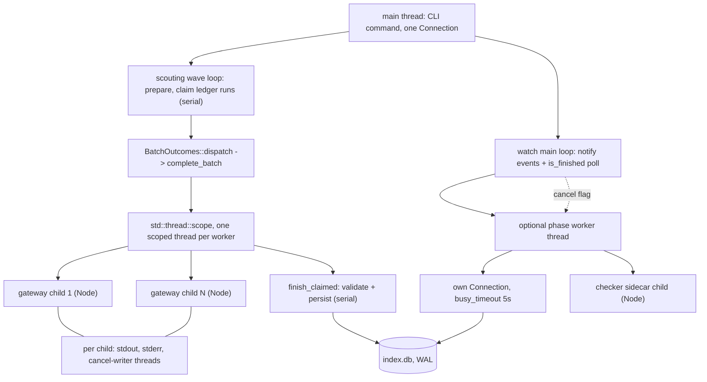
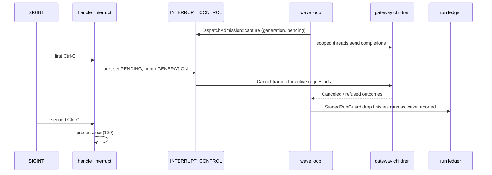

# Cross-cutting concerns

Everything in this document is a decision that no single subsystem owns and every subsystem inherits: how threads and child processes are arranged, how a Ctrl-C reaches a sidecar mid-request, what gets written to stderr versus a JSONL file, how errors carry category information across a process boundary, where the hard byte ceilings live, and the small set of house conventions — versioned hash prefixes, `#[expect]` with a reason, `BTreeMap` over `HashMap` — that the rest of the tree assumes without restating. The single most important correction relative to earlier readings of this codebase: jscout still has **no async runtime**, but it is **no longer single-threaded**. Since the gateway pool landed, a scouting wave runs `max_concurrency` Node child processes in parallel under `std::thread::scope`, on top of the watch worker threads that already existed. What has not changed — and is the invariant that makes the rest safe — is that no `rusqlite::Connection` ever crosses a thread boundary.

## The threading model, as it actually is

Start from what is absent. There is no `async fn` and no `.await` anywhere under `src/` — the only `async` tokens in the tree are JS test fixtures, the `function_async` column at `src/store.rs:604`, and `value_flow` fields. `Cargo.toml` lists no tokio, no rayon, no crossbeam. HTTP is blocking `ureq` in exactly three call sites: `src/embed.rs:336`, `src/inference.rs:105`, and `src/search.rs:1559`. Concurrency here is OS threads and OS processes, nothing else.

Three distinct arrangements exist, and they were built at different times for different reasons.

| Arrangement | Where | Unit of parallelism | Cancellation channel |
|---|---|---|---|
| Gateway pool | `src/llm/process.rs:558` (`ProcessGatewayPool::launch`), `:603` (`complete_batch`) | N Node child processes, driven by scoped threads | `DispatchAdmission` snapshot + per-gateway `Cancel` frames |
| Watch optional phases | `src/watch.rs:1156`, `:1184`, `:1220` | One `thread::spawn` per phase | `Arc<AtomicBool>` (embedding) or `checker::process::cancel_active_operation()` (enrichment) |
| Sidecar I/O pumps | `src/llm/process.rs:334,351,365`; `src/checker/process.rs:330,345` | One stdout, one stderr, one cancel-writer thread per child | Channel disconnect on child exit |

`ProcessGatewayPool::launch` spawns `max_concurrency` *independent* `ProcessGateway` children, each its own Node process with its own stdin/stdout pipes; it is not one process multiplexing requests. `complete_batch` (`src/llm/process.rs:603`) then chunks the task slice by `self.workers.len()`, and for each chunk enters `std::thread::scope`, spawning one scoped thread per `(worker, task)` pair and joining every handle before the chunk returns. A panicking worker thread is caught at the join and converted to `GatewayError::Io("gateway worker thread panicked")` rather than unwinding the caller. The scope guarantees no thread outlives the chunk, which is why the borrow of `&mut self.workers` is legal at all.

The wave structure above it lives in `src/scouting/repository.rs:1077`, whose inner admission loop is `src/scouting/repository.rs:1080`. The loop fills `scheduled` up to `options.policy.max_concurrency` by preparing subjects and claiming ledger runs *serially* on the main thread, collects the resulting `CompletionTask` values, hands the whole slice to `BatchOutcomes::dispatch` (`src/scouting/mod.rs:282`), and only then walks the outcomes one at a time through `finish_claimed`. So model calls overlap; preparation, validation, persistence, and subdivision do not. `BatchOutcomes` also enforces that the gateway returned exactly as many outcomes as tasks — `cardinality_error` (`src/scouting/mod.rs:297`) turns a mismatch into a hard error, and `next_or_protocol` (`:307`) turns a short vector into `GatewayError::Protocol`, so a miscounting gateway can never silently pair a response with the wrong claim.

The default `LlmGateway::complete_batch` (`src/llm/mod.rs:134`) is a serial `map` over `complete`. Its doc comment states the reason plainly: test doubles and non-process implementations keep deterministic serial behavior unless they explicitly provide concurrent transport. Concurrency is opt-in at the implementation, not a property of the trait.

`llm.max_concurrency` defaults to 1 (`src/llm/config.rs:199`); `with_max_concurrency` rejects zero (`:203-207`) and applies **no upper clamp**. The comment above `launch` says why: increasing it is an explicit operator choice. The tradeoff is real in both directions — a clamp would silently cap an operator who has provisioned for it, and its absence means a mistyped value spawns that many Node processes with no guard rail.

The watch phases are a different shape. Each optional phase (`run_embedding_interruptible`, `run_semantic_embedding_interruptible`, `run_enrichment_interruptible`) moves owned `PathBuf`s into a thread, and the thread calls `open_phase_database` (`src/watch.rs:1352`) to get its **own** `Connection` with a 5-second `busy_timeout` (`src/watch.rs:17`). The main thread does not block on `join`; it spins on `worker.is_finished()` with a 100 ms `OPTIONAL_PHASE_POLL` sleep, calling `monitor.poll()` each pass so filesystem events keep being drained while the phase runs. If the monitor reports supersession, the main thread sets the cancel flag and keeps polling. That polling loop, rather than a channel, is what lets an in-flight embedding pass be abandoned the moment a newer generation is queued.

The invariant that ties all three together, and that the code relies on everywhere without stating: **no SQLite connection and no `&mut Connection` is ever shared across threads.** Parallelism is always either separate child processes talking JSON over pipes, or a worker thread that opens its own connection. The write database is WAL with `synchronous=NORMAL` (`src/store.rs:205-206`); read surfaces open read-only with `query_only=ON` (`src/store.rs:73-74`), so a concurrent reader cannot promote itself to a writer.

Look at how the two halves of the diagram differ: the gateway side fans out to processes and joins inside a scope, while the watch side spawns one thread and polls it.

`SCOPE` joins before `FINISH` runs — that ordering is what keeps validation and publication serial. `PCONN` is the point to notice on the other branch: the connection is created *inside* `PHASE`, never handed to it.

## Signal handling and cancellation

There are two process-global Ctrl-C handlers, and nothing coordinates them. `src/checker/process.rs:215` and `src/llm/process.rs:140` each hold a `static INTERRUPT_HANDLER: OnceLock<Result<(), String>>` and each calls `ctrlc::set_handler` inside `get_or_init`. `ctrlc::set_handler` fails if called twice in one process, so whichever installs first wins and the second returns `GatewayError::Spawn`/`CheckerError::Spawn`. In practice no command path installs both, but that is an unenforced, undocumented property of the command wiring rather than a checked invariant.

The two mechanisms differ in shape because they solve different problems.

The checker uses `CANCELLATION_FLAGS`, a three-atomic struct (`src/checker/process.rs:32-37`) that separates *interrupt* (operator SIGINT) from *operation cancel* (watcher supersession), plus a `delivered` bit. `cancel_active_operation` (`src/checker/process.rs:253`) exists so the watcher can stop a generation without impersonating a Ctrl-C — its doc comment notes the separate pending bit also stops enrichment at its next project boundary when no sidecar request is currently active. `begin_interrupt_scope` (`:268`) resets all three per top-level pass, with the stated rule that per-project sidecars may replace the active cancel target but must not clear an interrupt that already canceled an earlier project in the same operation.

The LLM side uses `INTERRUPT_CONTROL: Mutex<Option<InterruptControl>>` holding every gateway's control handle, plus `INTERRUPT_PENDING` and `INTERRUPT_GENERATION`. `DispatchAdmission::capture()` (`src/llm/process.rs:129`) reads both atomics *while holding the control lock*, before any fan-out; the comment at `src/llm/process.rs:158-160` explains the race it closes — either a completion publishes its request id first and the interrupt cancels it, or the interrupt transition wins and that completion is refused before it is ever sent. Every worker in the wave carries the same snapshot, so an interrupt arriving mid-wave refuses every not-yet-dispatched request in that wave uniformly. A second Ctrl-C is fatal: `handle_interrupt` (`:150`) calls `std::process::exit(130)` when `request_interrupt_cancellation` reports the first one was already pending. Both handlers share that shape.

Interrupting a wave leaves ledger rows claimed. `StagedRunGuard` closes that: its `Drop` (`src/scouting/mod.rs:269`) calls `cleanup` (`:256`), which finishes every still-unresolved run with `RunOutcome::Failed` and the reason code `wave_aborted` (`:263`), so an abandoned wave is distinguishable in the ledger from a model failure. `staged_runs.resolve(run_id)` (`src/scouting/repository.rs:1188`) removes a run from the guard only after `finish_claimed` succeeded.

The sequence below is a Ctrl-C landing between admission capture and the second worker's send.

Note that `capture` precedes the sends: a worker whose thread has not yet reached `send_complete` compares its snapshot against the bumped `INTERRUPT_GENERATION` and refuses rather than issuing a request that would immediately need cancelling.

## Telemetry, logging, and the request log

There is no logging framework. No `log`, no `tracing`, no `env_logger` in `Cargo.toml`. Outside the sibling test files the entire diagnostic surface is roughly 185 `println!` (stdout — the command's answer) and 67 `eprintln!` (stderr — diagnostics). Exactly three of those carry a `warning: ` prefix, all in `src/mcp.rs` (`:397`, `:1100`, `:2033`); the rest use ad-hoc phrasing, so nothing downstream can filter by severity. `src/watch.rs` accounts for about a third of the stderr lines in a semi-structured `key=value` shape — `watch generation=N status=clean` (`src/watch.rs:1321`), `watch status=stopped reason=interrupt` (`:997`), `watch coverage status=read-failed error=...` (`:829`) — a format nothing in the tree parses.

Timing diagnostics are a plumbed `timing: bool` threaded through call signatures (`src/structural.rs:511`, `src/search.rs:120`, `src/indexer.rs:31`, `src/watch.rs:36`), sourced from `diagnostics.timing` in the config (`src/config/model.rs:233`). It is not an env var or a log level, which means enabling it for one subsystem means passing it down every intervening function — a visible cost of the "thread state explicitly" style discussed below.

The only machine-readable telemetry is the MCP server's two JSONL files, both opened append-only at startup (`src/mcp.rs:180-189`) and configured as `telemetry.file` and `telemetry.request_log` (`src/config/load.rs:873-884`). `log_request` (`src/mcp.rs:366`) writes one record per JSON-RPC request: timestamp, monotonic sequence, session, task, profile, method, tool name, raw arguments. `log_tool_call` (`src/mcp.rs:1832`) writes the far richer per-call record — elapsed time, ok flag, result bytes, snapshot digest, per-stage retrieval timings (`embedding_query_ms`, `vector_index_ms`, `reranker_ms`), transport section byte counts, and semantic-artifact counters. Both flush after every line and both degrade to a `warning:` on stderr rather than failing the request.

Session identity is the one place the codebase reads `std::env` for behavior rather than configuration: `JSCOUT_SESSION_ID` (falling back to `pid-<pid>`), `JSCOUT_TASK_ID`, and `JSCOUT_PROFILE_LABEL`, read at the call site in both writers (`src/mcp.rs:378-382`, `:1854-1856`, `:1929`). That is deliberate for A/B evaluation runs, where the harness wants to relabel a profile without rewriting a config file.

The limitation to state plainly: **everything outside the MCP server is invisible to instrumentation.** A `jscout index`, a `jscout scout`, a `jscout watch` session produce human-readable stderr and nothing else. There is no equivalent of the tool-call record for the indexing pipeline.

## Error conventions

`anyhow` is the universal return type; `main` returns `anyhow::Result<()>` (`src/main.rs:52`), so any escaped error becomes exit code 1 with a rendered cause chain. Outside the sibling test files: 480 `bail!`, 216 `.context()`/`.with_context()`, 107 `.expect()`, 23 `.unwrap()`, 16 `panic!`/`unreachable!`. The `.expect()` uses are concentrated at points the code treats as structurally impossible — `child.stdin.take().expect("piped stdin")` (`src/llm/process.rs:329`) after `Stdio::piped()`.

Two enums break the convention, both at sidecar boundaries where the error *category* drives control flow rather than just the message: `CheckerError` (`src/checker/process.rs:78-87`, with `Spawn | Protocol | Io | ChildExited | Timeout | Canceled | Remote{code,message}`) and `GatewayError`. A `Timeout` must be retried; a `Remote` must not; a `Canceled` must not be reported as a failure at all.

Everywhere above those boundaries, category is recovered by **string-matching the rendered anyhow chain**. `project_was_interrupted`, `canceled_checker_error`, and `project_failure_is_retryable` (`src/checker/enrich.rs:914-930`), and `is_terminal_partial_failure` (`:165`), all inspect error text rather than a type. That is the codebase's clearest design tension: `anyhow` bought uniform propagation and cheap `.context()` chaining across 87 files, and the price is that the two places needing categorical decisions re-derive the category from prose that any `.context()` call upstream could reword.

A third classifier is orthogonal to both and applies to raw `std::io::Error`. `src/io_policy.rs` splits I/O failures two ways with the rationale in its doc comments: `is_inventory_race` (`:6` — `NotFound | IsADirectory | NotADirectory`) treats a post-inventory race as absence, because a race "does not make that inventory atomic"; `is_retryable` (`:16` — nine `ErrorKind`s plus fifteen Unix errnos including `EMFILE`, `ENOMEM`, `ESTALE`) aborts the whole phase, because a resource failure "must abort the current phase so it can be retried without publishing a clean-but-random subset." `PermissionDenied` and `InvalidData` are deliberately in neither bucket — they are per-file facts, not phase failures.

## Resource limits

Ceilings are per-module `const`s, never a policy object. `search::DEFAULT_RESPONSE_BYTE_LIMIT = 24_000` and `semantic_query::DEFAULT_RESPONSE_BYTE_LIMIT = 24_000` (`src/semantic_query.rs:19`) are two constants that happen to agree, not one shared value. Traversal caps follow the same pattern: `WORKFLOW_TRAVERSAL_NODE_LIMIT = 100` and `EDGE_LIMIT = 400` (`src/semantic.rs:16-17`), `MAX_EVIDENCE_RELATION_PATHS = 2_000` (`src/semantic_query.rs:28`), `FRESHNESS_RELATION_DEPTH = 8` (`src/semantic.rs:21`), `INFERRED_ROOT_CAP = 150` (`src/checker/enrich.rs:21`), `MAX_PROTOCOL_LINE_BYTES = 4 MiB` and `PLAN_FRAME_MAX_BYTES = 1 MiB` (`src/checker/process.rs:22-24`). Only a handful are configurable; the rest are compile-time. Retry policy is equally local — `src/embed.rs:329-330` hard-codes the backoff schedule for the remote provider and a single attempt for the local one. The upside is that each limit sits next to the code that can justify it; the cost is that "what does jscout cap?" has no single answer to read.

## Conventions the rest of the tree assumes

**Fingerprint discipline.** 23 non-test files call `blake3`. Every fingerprint follows three rules: a domain-separated versioned prefix of the form `jscout-<domain>-v<N>\0` (17 distinct tags, from `jscout-structural-snapshot-v4` to `jscout-semantic-context-v1`); a NUL byte between every field, with `\x01`/`\x02` reserved as section separators where a hash has heterogeneous sections (`src/recon.rs:211,219`; `src/store.rs:1194`); and, where a version is at stake, hashing both the producer's compiled constant and the value stored in `meta`, so an interrupted or pre-upgrade mismatch fails closed (`src/structural.rs:461-463`). Bumping a suffix *is* the invalidation mechanism — there is no separate cache-clear path. `artifact_fingerprint` (`src/store.rs:1170`) is the canonical example: sort the supports, hash seven provenance fields NUL-separated, then each support terminated by `\x01`.

**Fourteen independent contract clocks.** `store::SCHEMA_VERSION = "31"` (`src/store.rs:8`), `structural::PROJECTION_VERSION = "12"` (`src/structural.rs:13`), `entity::EXTRACTION_VERSION = "7"` (`src/entity.rs:14`), `docs::CHUNK_FORMAT_VERSION = "documentation-v1"` (`src/docs/mod.rs:11`), `config::SCHEMA_VERSION = 1` (`src/config.rs:17`), `checker::protocol::PROTOCOL_VERSION = 4` (`src/checker/protocol.rs:3`), `llm::protocol::PROTOCOL_VERSION = 1` (`src/llm/protocol.rs:8`), `recon::EVIDENCE_ALGORITHM = "repository-recon-evidence/v3"` (`src/recon.rs:13`), plus five scouting `PROMPT_VERSION` constants and `concept::NORMALIZER_VERSION` (`src/scouting/concept.rs:23`). Only `store::open_path_read_only` checks several together at open time (`src/store.rs:88-134`), each with its own repair sentence pointing at `jscout index`.

**Lint policy as a ratchet.** Zero `#[allow]` in the tree; 31 `#[expect]`, every one with a `reason` — enforced by `allow_attributes` and `allow_attributes_without_reason` in `Cargo.toml`. Almost all are `too_many_arguments`, a direct consequence of threading state explicitly instead of carrying an ambient context struct, and the reasons read as design notes ("recursive freshness keeps artifact inputs and shared memoization state explicit"). The clippy list is opt-in rather than `pedantic = "warn"`; the `Cargo.toml` comment justifies that choice by noting the group would emit roughly 780 warnings dominated by `i64`/`usize` casts inherent to the rusqlite boundary, and blanket-silencing them would hide the real findings.

**Determinism by construction.** `BTreeMap`/`BTreeSet` appear in more files than `HashMap`/`HashSet`, roughly 140 `ORDER BY` clauses appear in non-test SQL, and every fingerprint iterates a sorted collection. This is not stylistic: reuse decisions are fingerprint equality, so iteration order is correctness.

**Fault injection over mocking.** One four-method trait, `fs_ops::FileSystem` (`src/fs_ops.rs:16`), whose doc comment names what it deliberately *excludes* — canonicalization, existence probes, `package_entry_paths` traversal, resolver internals, `ignore` walking — and why: those "retain their existing owners and error policies." Tests use `src/test_fs.rs` rather than thread-local state, and sidecar/HTTP tests spawn real in-process servers on a `TcpListener` (`src/docs/retrieval.rs:1432`) instead of stubbing a client.

**Configuration is a value, not ambient state.** `RuntimeConfig` is loaded once in `main` (`src/main.rs:58`) and passed by reference thereafter. There are 13 direct `std::env` reads outside tests, and they fall into four groups, none of which is a hard-coded secret name: the config loader's own legacy-env resolution (`src/config/load.rs:1014`) and `HOME` expansion (`:1148`); `PATH` for locating node (`src/llm/config.rs:120`); the three MCP session labels; and API-key lookups by a *configured* variable name (`src/embed.rs:198,227,229`; `src/llm/process.rs:290`).

**`store.rs` is a schema module, not a data-access layer.** 26 non-test files execute raw SQL directly against a `Connection`. The only shared helpers are `with_read_snapshot` (`src/store.rs:1138`, a named `SAVEPOINT` whose comment notes it "nests safely when search expansion calls neighborhood traversal") and `artifact_fingerprint`. Corpus safety after G24 is therefore enforced at the schema level instead — the `code_files`/`code_chunks` views (`src/store.rs:429-437`) plus four `RAISE(ABORT)` triggers (`:382-425`) — because there is no Rust chokepoint to put it in.
