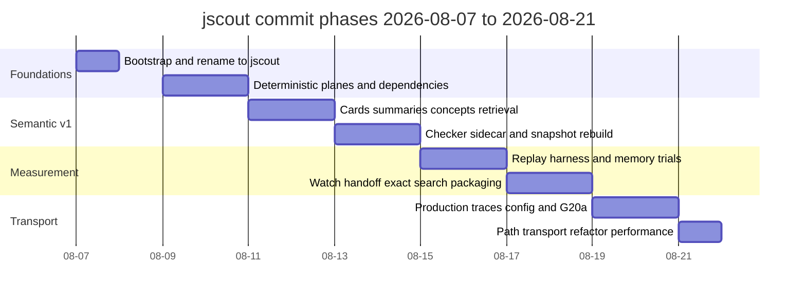
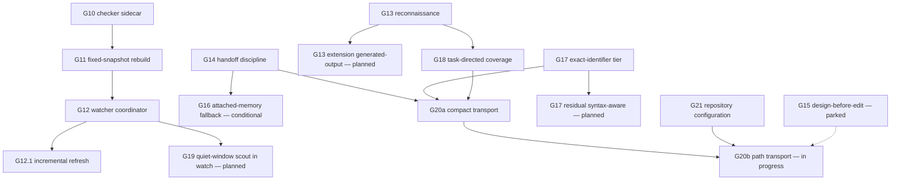

# Development history and roadmap

jscout was written in fifteen calendar days by one author, and the record of how it got here lives in two places: 452 commits across 71 merged pull requests, and a single 2,823-line `PLAN.md` that is declared the only normative architecture and roadmap document (`PLAN.md:25`). The plan does not describe an aspirational architecture. It is organized as a numbered ladder of gates — G1 through G21 — where each gate states a specific defect, the evidence that exposed it, the mechanism change, and an explicit acceptance list, and where the heading itself carries the current status word. This document reconstructs the timeline from the git record, explains the gate mechanism, and separates what is built from what is written down but unbuilt.

## The shape of the record

Every commit on `main` is authored by Cristian Ianto; `git shortlog -sn` reports a single name and 452 commits. Work lands through merge commits from feature branches whose prefixes are themselves a provenance signal: 37 merges come from `codex/*` branches, 13 from `feat/*`, 6 from `fix/*`, 4 each from `rust/*` and `docs/*`, 3 from `eval/*`, and one each from `claude/*`, `chore/*`, `perf/*`, and `npm-packaging`. PR numbers run 1 through 73 with two absent from the merge log: #45, which `PLAN.md:1832` explicitly records as blocked when G15 was parked, and #63. There is no `CHANGELOG.md`; two tags exist, `v0.3.0` and `v0.4.0`, matching the two `chore(release)` commits on 2026-08-18 and 2026-08-21. Version 0.4.0 is carried identically in `Cargo.toml`, `npm/cli/package.json`, and `checker/package.json`, which is what the commit `chore(release): align bundled package versions` did.

Commit density is extremely uneven: 65 commits on 2026-08-10, 59 on 2026-08-20, 51 on 2026-08-21, but zero on 2026-08-08 and only 11 on 2026-08-19. The heavy days are gate-implementation days where a whole subsystem lands as a run of `feat:` commits followed by a run of `fix:` commits addressing review findings on the same branch — the `codex/g10-checker-enrichment` branch alone contributed the entire 2026-08-13 checker block.

## Timeline by phase

The diagram below groups the 452 commits into eight phases. Look at the durations: no phase runs longer than two days, and the last phase — a refactor and performance pass — consumed a ninth of all commits in the project's history in a single day.

`p1` is 2026-08-07 and 14 commits: the initial implementation, `Rename project to jscout`, snapshot-safe structural neighborhoods, opt-in structural expansion, and — already — a paired agent evaluation harness plus `Reorder roadmap around measured agent value`. The measurement-first posture is present on day one. `p2` (2026-08-09 to 2026-08-10, 83 commits) built the deterministic substrate in five back-to-back PRs: dependency indexing (#2), runtime boundary entities (#3), the contract plane (#4), general entities (#5), and agent surfaces over MCP (#6), each followed by a `docs: record ... validation` commit and a follow-up PR fixing review findings (#7, #8). CI arrived mid-phase with `ci: enforce Rust formatting and validation`. The phase closes with #9, the pi-ai gateway sidecar and the first candidate-closed workflow generation.

`p3` (2026-08-11 to 2026-08-12, 68 commits) completed semantic v1 against the boundary at `PLAN.md:558`: symbol cards G6 (#16), hierarchical summaries G7 (#17), concepts G8 (#20), and retrieval/packaging/operations G9 (#19), with local inference and sqlite-vec landing in parallel (#18). `p4` (2026-08-13 to 2026-08-14, 64 commits) is the checker sidecar G10 (#21) plus its immediate scale redesign (#25), the fixed-snapshot simplification G11 (#23) which removed cross-snapshot freshness machinery outright, the watcher specification (#24), and reconnaissance G13 in two rounds (#28, #31). The MIT-OR-Apache-2.0 dual license landed here (#22).

`p5` (2026-08-15 to 2026-08-16, 47 commits) is almost entirely evaluation infrastructure — the prepared PR-replay harness (#35), the optimistic-prefetch results (#34), blind omission adjudication for 39 arms — plus scout subject weighting fixes (#36, #39, #40, #41). `p6` (2026-08-17 to 2026-08-18, 55 commits) landed G14 retrieval handoff (#44), the G12 watcher coordinator (#38), its incremental refresh G12.1 (#47), npm distribution as `@jscout/cli` (#48), the G17/G18 pair (#50), and release 0.3.0 (#52); it also parked G15. `p7` (2026-08-19 to 2026-08-20, 70 commits) is watch recovery hardening (#54, #55), the semantic vector tail (#56), checker carry-forward across watch generations (#58), G21 repository configuration (#59), and G20a compact transport (#60). `p8` is 2026-08-21 alone: G20b path transport (#62), release 0.4.0 (#64), a four-PR lint and test-extraction ladder (#65–#68), the CLI and config module splits (#69), the filesystem test seam (#70, #72), and index/benchmark performance work (#71, #73). The current branch `codex/performance-budget-freshness-sync` carries six further unmerged commits past #73 (`b888889`, `66ac26d`, `9553693`, `4d7d916`, `b968145`, `854bff1`), ending at `854bff1`.

## How a gate works

A gate is not a task. Reading the implemented sections, the recurring structure is: a paragraph naming the concrete failure (usually with the evaluation run that exposed it), a numbered list of mechanism changes, an acceptance list of falsifiable checks, and an out-of-scope list. G17 is the clearest instance — `PLAN.md:2077` opens with the specific defect ("RRF discards BM25 score magnitude, and the reranker can then demote the remaining exact hit"), gives five numbered mechanism steps, and closes with seven acceptance bullets at `PLAN.md:2148` naming actual identifiers from a real repository (`createRouteTypesManifest`, `NextTypesPlugin`) that must outrank unrelated chunks. The acceptance list is written before implementation and is what "implemented" is measured against.

Status is encoded in the heading word, and five distinct words are in use. Some gates additionally carry per-step completion markers rather than a whole-gate verdict: G11's six implementation steps at `PLAN.md:1069` each end in **Complete.**, with step 5 qualified as "Complete for retrieval surfaces" and an explicitly named remaining defect (`scout --dry-run` opening a writer before planning). Two gates are qualified even where implemented: G10 has functional code but is "not accepted for large-repository operation until its required scale correction passes" (`PLAN.md:780`), and G12 is "Implementation complete (2026-08-17); sustained-churn validation on a large real repository remains pending" (`PLAN.md:1119`).

The feedback loop between evidence and gates is written down as a table at `PLAN.md:2706` mapping each dated evaluation finding to the design consequence it forced. That table is why G17 and G18 exist at all: "Root-layout searches ranked partial example and Sitecore chunks above exact identifiers" produced "Implement G17 deterministic exact-identifier tiers before adding retrieval surface". The evaluation files under `eval/` — 35 dated result write-ups plus their machine-readable companions — are declared historical evidence that must not be rewritten to match later decisions (`PLAN.md:32`).

| Gate | Subject | Status | Plan anchor |
|---|---|---|---|
| G1–G5 | Workflow scouting | Implemented | `PLAN.md:348` |
| G6 | Selected symbol cards | Implemented | `PLAN.md:374` |
| G7 | Hierarchical summaries | Implemented | `PLAN.md:403` |
| G8 | Concepts | Implemented | `PLAN.md:454` |
| G9 | Retrieval, packaging, operations | Implemented | `PLAN.md:511` |
| G10 | Checker enrichment sidecar | Implemented; scale correction required for acceptance | `PLAN.md:594`, `PLAN.md:780` |
| G11 | Fixed-snapshot simplification | Complete per step; one command-authority cleanup named | `PLAN.md:1069` |
| G12 | Watcher coordinator | Implemented; sustained-churn validation pending | `PLAN.md:1119` |
| G13 | Repository reconnaissance scout | Implemented | `PLAN.md:1484` |
| G13 extension | Generated-output boundary reconnaissance | Planned | `PLAN.md:1611` |
| G14 | Retrieval handoff and relevance discipline | Implemented | `PLAN.md:1684` |
| G15 | Design-before-edit task memory | Parked; PR #45 blocked | `PLAN.md:1830` |
| G16 | Independent attached-memory fallback | Conditional, not entered | `PLAN.md:1998` |
| G17 | Exact-identifier dominance | Implemented | `PLAN.md:2077` |
| G17 residual | Syntax-aware exact occurrences | Planned | `PLAN.md:2106` |
| G18 | Task-directed semantic coverage and selection | Implemented | `PLAN.md:2169` |
| G19 | Quiet-window repository scouting in watch | Planned | `PLAN.md:2237` |
| G20a / G20b | Compact transport / path transport | G20a merged (#60); G20b in progress | `PLAN.md:2267` |
| G21 | Repository runtime configuration | Implemented | `PLAN.md:2651` |

## Gate dependencies

The next diagram shows which gates enable or constrain which. Look for the two nodes with no outgoing implementation edge — `G15` and `G16` — and for `G21`, which feeds measurement rather than features.

`G11` sits at the centre of the deterministic side: its step 1 pulls occurrence-specific checker `member_call` edges from `G10` into workflow traversal, and its step 6 explicitly defers watch to `G12`. `G12` then splits — `G121` is the real incremental path (`src/indexer.rs:209` exposes `pub fn incremental_refresh_repo_with_options`, non-test, and it is the default watch path), while `G19` remains the deliberately unbuilt semantic phase. On the retrieval side, `G14`, `G17`, and `G18` all converge on `G20a`, which `PLAN.md:2347` describes as carrying a decision amendment to G14 rather than a new surface. The dashed `G15` edge is a non-dependency the plan states explicitly: "This milestone is independent of G15 and does not trigger G16" (`PLAN.md:2647`). `G21` connects to `G20b` because the replays that must validate G20b use G21's non-secret configuration and build fingerprints plus per-stage retrieval timings to tell binaries and postures apart.

## In progress: G20b

G20b is the only gate whose heading currently says "In progress" (`PLAN.md:2267`). G20a merged in PR #60 and shipped cross-origin exact follow-ups, opt-in search-attached memory, bounded receiver display, compact/body/full artifact views, and per-section byte telemetry. G20b adds path-shaped expansion — landed on 2026-08-20/21 as `feat(search): project expansion as ranked paths` and three follow-up fixes — then the MCP structured-content compatibility experiment (`feat(mcp): profile structured result transport`), and only then the registered replays. The central number is explicitly not yet earned: acceptance requires aggregate inner JSON bytes to fall by at least 60% on a fixed-call transport replay at equal fact coverage, and the plan states "The reported 65–75% reduction remains a hypothesis until measured" (`PLAN.md:2608`). The two historical workloads — the 42-call architecture inquiry estimated at 460–510 KiB and the 19-call TargetsQueue investigation measured at 228.5 KB — must be reported separately so a win on one cannot hide a regression in the other.

## Planned but unbuilt

Three items are written in full and have no code. **G19** (`PLAN.md:2237`) would add `watch --scout` with the fixed phase order `refresh -> embed(code) -> enrich -> scout(stale delta) -> embed(semantic)`, throttled by quiet time rather than by a hidden spend limit, superseded first by any filesystem event, and required to report lag plus the exact manual command instead of queuing generations. The plan states that until fixtures exist for quiet completion, continuous supersession, subject-local resume, partial failures, gateway retry, and semantic-vector tail convergence, "no `--scout` flag is shipped". **The G13 extension** (`PLAN.md:1611`) would add exact generated-output candidate subjects discovered from `tsconfig` `outDir`, `package.json` publication boundaries, build scripts, and generated headers — deliberately treating directory names such as `build` or `lib` as weak labels only, because Next.js and Twenty both contain authored code under `build`. **The G17 residual** (`PLAN.md:2106`) would order occurrences inside the exact tier by syntax kind — definition, then executable use, then contract, then import/export — so an import specifier cannot consume an identifier's one reserved slot ahead of the call that gives it runtime meaning.

## Parked, conditional, and superseded

G15 is the project's one explicit product retreat. A read-only design phase looked promising in the optimistic-prefetch campaign, where a single architecture probe found a mechanism that 46 implementation arms never produced. The root-layout replay then reversed the verdict: two-phase arms "cost more, passed less often, and twice preserved a coherent but wrong output contract through implementation" (`PLAN.md:1832`). PR #45 was blocked, the full design proposal was retained in place as a bounded proposal, and two-phase execution survives only as an optional evaluation-harness treatment. G16 is a different kind of non-decision: a written correction to G14's evidence-connection boundary that enters implementation only if repeated task evidence shows useful artifacts being rejected by the join, or agents repeatedly ignoring the `semantic_memory` handoff (`PLAN.md:2017`). Neither the root-layout replay nor the configuration-publish review triggered it, and the plan says the gate closes without implementation if the criteria are never met.

Other directions were superseded rather than parked. Cross-snapshot freshness machinery was deleted in `refactor(snapshot): remove cross-snapshot freshness machinery` on 2026-08-13. The historical in-place schema migration ladder was retired by G11 step 5 in favour of durable-compatible schemas that rebuild the disposable plane and fail loudly on incompatible durable ones. `JSCOUT_*` environment variables lost primacy to `.jscout.toml` under G21; `src/config/load.rs:275` carries the legacy fallback path that emits the migration warning. A custom elided-source behavioral IR was tested and dropped — "Full source remains the default; custom behavioral IR is not earned". Standalone `neighborhood` was demoted to drill-down plumbing after evaluation showed it had no natural selection. And broad similarity-based memory previews were replaced by G14's evidence-connected selection. `PLAN.md:2778` lists what will not be attempted at all, including learned compression or traversal policy, one model call per chunk, blanket dependency indexing, and Yarn Plug'n'Play archive indexing.

## What the record does not establish

The history is a single-author record with no external review in it: all 71 merges come from branches on the same account, so "review findings" in commit messages are the author's own or agent-produced, not an independent party's. Fifteen days across nine gates means acceptance lists substantially outnumber measured results — G19, the G13 extension, and the G17 residual each have complete acceptance criteria and zero implementation, and G20b's headline byte reduction is a hypothesis by the plan's own words. Two implemented gates carry named unfinished validation (G10 at large-repository scale, G12 under sustained churn on a real repository). `PLAN.md` also lags its own content slightly: the status header declares it "authoritative plan as of 2026-08-20" while the file was last modified on 2026-08-21 by the G20b corpus-check commit. The one durable structural guarantee in the process is negative and holds so far — superseded plans are not kept in the working tree, so there is exactly one document to disagree with the code, and no competing roadmap to reconcile.

See [15-build-config-ci.md](15-build-config-ci.md) for the release and packaging mechanics behind the 0.3.0 and 0.4.0 tags, [14-evaluation.md](14-evaluation.md) for the replay harness that produced the evidence table, and [20-delta-since-2026-08-17.md](20-delta-since-2026-08-17.md) for what the last four phases changed in the tree.
