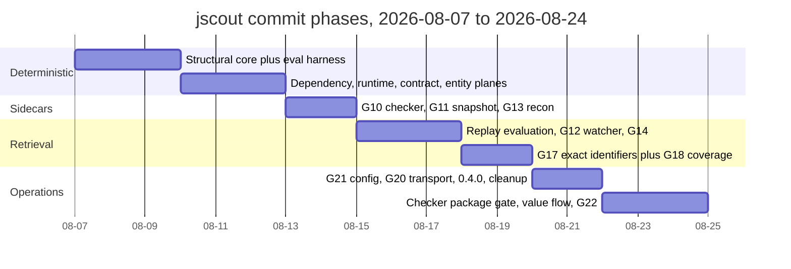
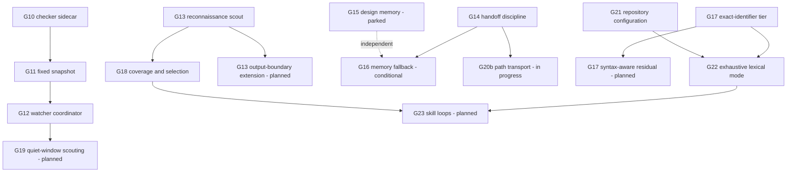

# Development history and roadmap

jscout is seventeen days old at commit `4de5622`: 500 commits between 2026-08-07 and 2026-08-24, 84 of them arriving through merged pull requests, crate version 0.4.0, on branch `codex/close-g20b`. The project has no issue tracker in the tree and no separate design docs competing for authority — `PLAN.md` (3,293 lines) declares itself "the only normative architecture and roadmap document" (`PLAN.md:29`) and carries the entire roadmap as numbered gates G1 through G23, each stamped with a status word in its own heading. What follows is the phase structure the commit log actually shows, the mechanics of a gate — how one opens, what closes it, and what a status word commits the author to — and the split between what is built, what is written down but unbuilt, and what was tried and abandoned.

## Timeline

Development is dense and unevenly distributed: no commits landed on 2026-08-08, while 2026-08-10 alone carries 65. The phases below are inferred from commit subjects and merge boundaries, not from any declared milestone list.

| Phase | Dates | Commits | What landed |
|---|---|---|---|
| Structural core and evaluation harness | 08-07 – 08-09 | 32 | Initial implementation, rename to jscout, snapshot-safe neighborhoods, file-role classification, opt-in structural expansion, evidence-backed workflow memory, and the paired agent evaluation harness |
| Repository planes | 08-10 – 08-12 | 133 | Dependency indexing (PR #2), runtime boundary entities (PR #3), the contract plane, canonical general entities, and the pi-ai model gateway sidecar |
| Checker, snapshot, reconnaissance | 08-13 – 08-14 | 64 | G10 checker enrichment at repository scale, G11's disposable-snapshot lifecycle, the G12 watcher specification, and the G13 reconnaissance scout |
| Replay evaluation and retrieval hygiene | 08-15 – 08-17 | 82 | The PR-replay harness and the optimistic-prefetch trials, the G12 watcher coordinator (PR #38), G14 retrieval handoff (PR #44), G15 parked, G16 opened as conditional |
| Exact-identifier retrieval | 08-18 – 08-19 | 31 | G17 and G18 together (PR #50), monorepo call-trace capture, watch failure-recovery semantics |
| Configuration, transport, cleanup | 08-20 – 08-21 | 111 | G21 repository configuration (PR #59), G20a compact transport (PR #60), G20b path transport (PR #62), release 0.4.0, a lint/refactor ladder and a performance pass |
| Checker precision and exhaustive search | 08-22 – 08-24 | 47 | Per-package checker admission, bounded receiver value flow, and G22 exhaustive lexical search across PRs #91–#93 |

The gantt below plots those phases; look for the two long bars — the repository-planes phase and the configuration phase — which together carry roughly half the commits, and for how late the retrieval-quality gates (G17, G22) arrive relative to the structural work they depend on.

Two structural facts about the history are worth naming. First, the semantic layer came early: G1–G9 were declared complete against the "Semantic-v1 completion boundary" (`PLAN.md:568`) by roughly 2026-08-12, before the checker sidecar, the watcher, or any of the retrieval-quality gates existed. Second, the last four days are almost entirely correctness and precision work on already-shipped subsystems — the checker's project admission and overload grouping, and search's completeness contract — rather than new planes.

## How a gate works

A gate is a numbered section in `PLAN.md` whose heading carries its status: `## Implemented G21 — repository runtime configuration` (`PLAN.md:2982`), `## Parked G15 — design-before-edit task memory` (`PLAN.md:2161`), `## Planned G19 — quiet-window repository scouting in watch` (`PLAN.md:2568`). The status word is load-bearing — it is the only place the project records whether a described behavior exists, and the document policy states that when code and the plan disagree, one of them is fixed explicitly rather than a second plan being written (`PLAN.md:42`).

Gates are not feature requests. Each one opens from recorded evidence and states the failure it corrects. G17 opens because RRF discards BM25 magnitude and a cross-encoder can then demote the one exact definition (`PLAN.md:2408`). G22 opens because a 2026-08-22 production investigation ran twelve `vector: false` searches at `limit: 10`, missed a literal occurrence that `rg` listed, and reported the comparison as complete — "The miss was truncation, not ranking" (`PLAN.md:3043`). G18 opens because 448 card calls in a Next.js run still missed the relevant surface (`PLAN.md:2503`). The evidence lives under `eval/results/` as dated files that the document policy forbids rewriting to match later decisions (`PLAN.md:33`).

The body of a gate is a numbered contract followed by an explicit acceptance list. G22's contract has eight clauses covering mode precedence, continuation fields, the chunk as the unit of completeness, paging, byte shedding, scope echo, locator-heavy hits, and a refusal to add a regex tool "until G22 proves insufficient on a real completeness question" (`PLAN.md:3115`). Its acceptance names concrete checks: a rare identifier returning one page with `returned == total_chunks`, two occurrences on one line collapsing to a single `match_lines` entry, a snapshot change between pages failing the continuation (`PLAN.md:3119`). Implementation then lands on a branch named for the gate — `codex/g22-mode-paging-scope`, `codex/g22-match-lines-locator-hits`, `codex/g22-strict-exhaustive-budget` — and the plan is edited in `docs(plan):` commits both before and after, which is why eight consecutive plan-only commits precede the first G22 code commit.

The mechanism's real cost is that the contract keeps moving while the gate is open. G22 was revised four times in one day on 2026-08-23 — from "exhaustive lexical search" to "an exhaustive mode with chunk-level completeness, paging, scope echo", then to add "precedence over configuration, continuation fields, line-coverage claim, forward-progress budget rule" — and the code followed with a paging commit, a cursor fix, a match-line commit, a losslessness fix, and a budget-floor commit plus its correction. The clause that survived is narrow and honest: the claim is chunk coverage plus unique matching-line coverage, and "the contract does not say that every literal occurrence is recovered from `match_lines`" (`PLAN.md:3082-3083`). That is the pattern across gates — the shipped promise is smaller than the opening ambition, and the plan records the shrinkage rather than the ambition.

## Gate status at `4de5622`

| Gate | Status | `PLAN.md` | Subject |
|---|---|---|---|
| G1–G9 | Implemented | :358, :384, :413, :464, :521 | Workflow scouting, symbol cards, hierarchical summaries, concepts, semantic retrieval |
| G10 | Implemented, scale-gated | :604 | Checker enrichment sidecar; not accepted for large-repository operation until the scale correction passes (`PLAN.md:5`) |
| G11 | Complete | :1400 | Fixed-snapshot simplification; removed cross-snapshot freshness machinery |
| G12 | Complete 2026-08-17 | :1450 | Watcher coordinator; sustained-churn validation on a large real repository still pending |
| G13 | Implemented | :1815 | Repository reconnaissance scout, with one planned extension |
| G14 | Implemented | :2015 | Retrieval handoff and relevance discipline |
| G15 | Parked | :2161 | Design-before-edit task memory; PR #45 blocked |
| G16 | Conditional | :2329 | Independent fallback for G14 attached-memory delivery |
| G17 | Implemented | :2408 | Exact-identifier dominance, with a planned residual |
| G18 | Implemented | :2500 | Task-directed semantic coverage and selection |
| G19 | Planned | :2568 | Quiet-window repository scouting in watch |
| G20b | In progress | :2598 | Path transport and measured compatibility |
| G21 | Implemented | :2982 | Repository runtime configuration |
| G22 | Implemented | :3037 | Exhaustive lexical search contract |
| G23 | Planned | :3133 | Skill: investigation and inquiry loops |

G24 existed for one commit. It was added on 2026-08-23 as a vector-latency gate and dropped the same day — "drop G24; the vector-path latency is the external embedding call" — because the measurement pointed at a cost jscout does not own.

The merged-PR sequence records the same discipline negatively: PRs 1–44, 46–62, 64–74, 76–80, and 87–93 merged, and #45 is absent because the plan blocked it. Gaps at #63, #75, and #81–86 are unmerged work with no surviving statement in the plan.

## Dependencies between gates

The diagram below traces which gates enable which. Look for `G22` having two upstream edges — one from the exact-match tier it extends and one from the configuration resolution it must override — and for `G16` and `G19` hanging off implemented gates without being scheduled.

`G21` reaches `G22` because exhaustive mode resolves after repository configuration and then forces `vector`, `rerank`, `expand`, and `include_memory` off, so that a bare `exhaustive: true` works on a repository whose defaults turn vector and rerank on (`PLAN.md:3059`, implemented at `src/search.rs:23`). `G17` reaches `G22` because the exact tier established that identifier-shaped queries need their own handling; exhaustive mode is the completeness answer for that same query shape, and its ordering is deliberately unranked — path, chunk start, chunk id (`PLAN.md:3092`). `G22` reaches `G23` because G23 is skill text and server instructions only, with no tool changes, and its investigation loop is written around the fields G22 emits (`PLAN.md:3146`). The dotted edge from `G15` records the plan's explicit statement that G16 "is independent of G15" (`PLAN.md:2340`) — parking one did not close the other.

## Planned but unbuilt

Five items are specified and absent from the tree. **G19** would add `watch --scout`, running `refresh -> embed(code) -> enrich -> scout(stale delta) -> embed(semantic)` in quiet windows at lowest priority (`PLAN.md:2572`); the plan requires stale-delta scoping to be designed first and states that until the fixtures exist, "no `--scout` flag is shipped" — no such flag appears in the CLI. **G23** would rewrite the agent skill around two loops, an investigation loop keyed on `exhaustive: true` and a conditional inquiry loop led by `semantic_memory`, and update both MCP server instruction strings in the same change (`PLAN.md:3168`). **The G13 extension** would add exact output-candidate subjects for unignored generated directories without requiring their parent scope to be classified `mixed` (`PLAN.md:1942`). **The G17 residual** would distinguish kinds of exactness so an import specifier cannot consume the one reserved occurrence slot ahead of a call site (`PLAN.md:2437`). **G16** is not scheduled at all: it enters implementation only if repeated task evidence shows the evidence-connection join producing measured false negatives, or agents repeatedly ignoring the `no_connected_memory` handoff — and "a low attachment count, a high vector score, or one agent declining a follow-up is not sufficient" (`PLAN.md:2380`).

G20b is the one gate whose status is a bookkeeping problem rather than missing code. Its transport work shipped in PRs #60 and #62, and the structured-content experiment exists as a profiled MCP transport (`src/mcp.rs:62`). The plan states it "remains open only because the historical 60% fixed-call replay is unreachable" and closes with a newly registered reproducible workload plus the staged-session replay (`PLAN.md:3050-3053`). The current branch is named `codex/close-g20b`, and its only commits are plan edits and unrelated fixes — the closing evidence has not been produced.

## Superseded directions

**G15 was parked after measurement, not after debate.** A two-phase design-then-implement arm was evaluated on a Next.js root-layout replay; it "cost more, passed less often, and twice preserved a coherent but wrong output contract through implementation" (`PLAN.md:2163`). PR #45 was blocked, no design command, MCP tool, or semantic-plane write was added, and the proposal is retained only to reconsider if a read-only design phase is later shown to find mechanisms implementation-only agents miss. The evidence that motivated it is not disputed — one read-only architecture probe produced the mechanism that 46 implementation arms never generated — but the handoff did not survive contact with implementation.

**Cross-snapshot freshness machinery was removed.** G11 made the disposable structural plane real and deleted the lifecycle code that tried to preserve cheap derived facts across rebuilds (`refactor(snapshot): remove cross-snapshot freshness machinery`, 2026-08-13). The current rule is that `jscout index` always clears checker facts, including on an identical rebuild, and only `watch --enrich` may retain a prior batch as a hidden input (`PLAN.md:100`). Full rebuild became the primary correctness path, and incremental state is explicitly not the product's correctness model (`PLAN.md:1462`).

**The reranker default did not change despite production telemetry.** G21 records that deployed rows mix binaries and retrieval postures, every vector-active row also has the reranker active, and no relevance labels were recorded — so a product-wide change "requires a fixed-query comparison on one binary, database, snapshot, and embedding profile with only reranking toggled" (`PLAN.md:3027-3029`). The gate shipped the configuration surface and left the default alone.

The permanent exclusions are listed rather than argued: diagnostics, rename safety, and call hierarchy are deferred to an LSP; learned compression, learned traversal policy, one model call per chunk, embedding clusters presented as concepts, blanket dependency indexing, and Yarn Plug'n'Play archive indexing are out of scope (`PLAN.md:3248`). Two of the ten non-negotiable invariants exist to keep money and truth separate — indexing and watch never make model calls (`PLAN.md:91`), and semantic claims never modify deterministic structural facts.

The limit of this record is that status words are self-reported. G10 carries a functional implementation but is not accepted for large-repository operation, G12 is complete but its sustained-churn validation on a real repository is still pending, and G20b's "in progress" describes missing measurement rather than missing behavior. The plan is candid about each of these, but nothing in the repository enforces the correspondence.
