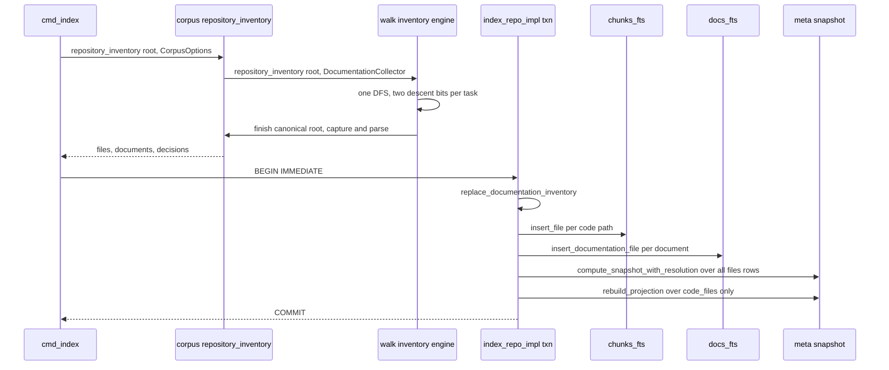
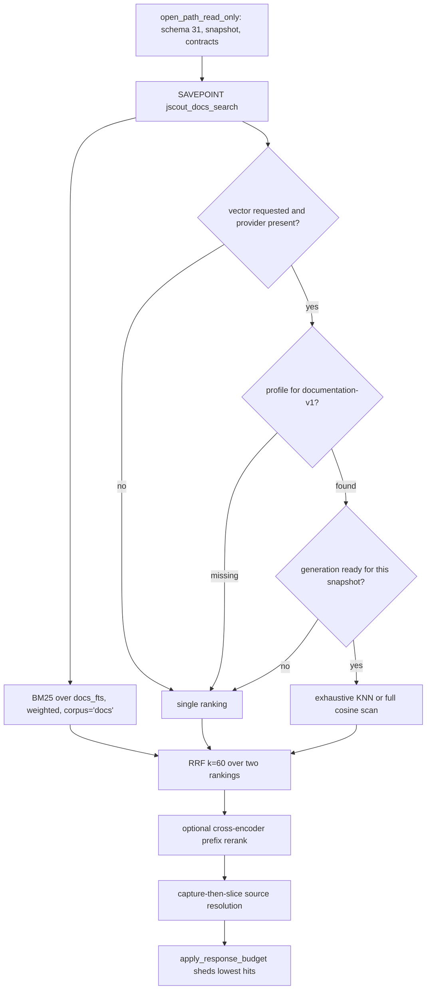
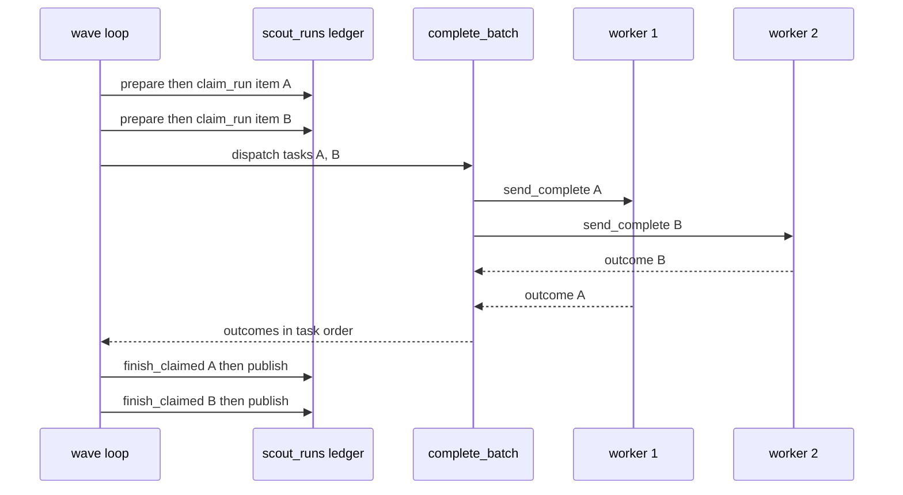

# End-to-end execution traces

Four traces follow one request each from process entry to the bytes the caller reads, naming the function and line that does the work at commit `03d5b50`. The first walks a cold index of a repository containing both JavaScript and Markdown, where a single filesystem traversal feeds two admission policies and two storage shapes that meet again only at one `meta` row. The second follows a documentation query through the read-only gate, BM25, an optional vector generation, fusion, and a byte budget. The third follows a single-identifier code query through the exact tier computed beside the hybrid pipeline. The fourth follows a scouting wave with `max_concurrency` above one, where exactly one region of the loop overlaps and everything touching the database does not. Each trace ends with how it fails.

---

## Trace 1 — Cold index of a repository with code and Markdown

Command: `jscout index /repo`, with no `.jscout.db` present.

### Entry and gate

| # | Step | Location |
|---|---|---|
| 1 | `main` parses one clap tree; `Command::Index` is not `Config`, so configuration loads first | `src/main.rs:52` |
| 2 | `Command::root()` returns the subcommand's own `root`, so config resolves against the target repo rather than the cwd | `src/commands/mod.rs:57` |
| 3 | `RuntimeConfig::load` reads `<root>/.jscout.toml`; `docs.enabled` defaults true and `docs.include` defaults to `["**/*.md","**/*.mdx"]` (`src/docs/mod.rs:7`), globs shape-validated at load | `src/config/load.rs:411` |
| 4 | `cmd_index` opens the write-authority gate `store::open(root)` → `open_path`. No `meta` table means no version check; WAL, `synchronous=NORMAL`, `foreign_keys=ON`, then `init_schema` creates the 47 tables, both FTS5 virtual tables, the `code_files`/`code_chunks` views, the four corpus-guard triggers, and stamps `schema_version='31'` | `src/commands/core.rs:279`, `src/store.rs:153`, `:312` |
| 5 | `IndexOptions` carries `docs_include`/`docs_exclude`. If `[docs] enabled = false`, `indexing_include()` returns `&[]` (`src/config/model.rs:58`) and the documentation plane is inert with no further branching | `src/commands/core.rs:280` |

### One traversal, two planes — outside the transaction

| # | Step | Location |
|---|---|---|
| 6 | `corpus::repository_inventory` builds a `DocumentationCollector` and hands it to `walk::repository_inventory`, which is generic over `RepositoryInventoryConsumer` and forwards to the traversal engine in `src/walk/inventory.rs`. The walk owns the run's only filesystem traversal; the documentation module rides it as one consumer | `src/indexer.rs:385`, `src/docs/corpus.rs:156`, `:172`, `src/walk.rs:187`, `src/walk/inventory.rs:28` |
| 7 | The engine uses an explicit heap stack, children pushed in reverse `file_name()` order so popping reproduces sorted DFS. Each `WalkTask` carries two independent descent bits, `source_active` and `consumer_active` | `src/walk/inventory.rs:11`, `:55`, `:63`, `:99` |
| 8 | Per entry: `symlink_metadata`; an inventory race is skipped silently, a retryable I/O error aborts the whole inventory, anything else records a `walk` rejection. `is_hard_skip` prunes `.git` and `walk::SKIP_DIRS` for both planes | `src/walk/inventory.rs:110`, `:131`, `:242` |
| 9 | **Plane divergence, hidden files.** The code plane keeps hidden entries out unless an ignore-file whitelist re-includes them (`src/walk/inventory.rs:158-160`); the consumer applies its own rule through `hidden_path_is_excluded`, which for documentation is a fixed root allowlist `[".github",".claude",".agents"]` with no whitelist escape | `src/walk/inventory.rs:169`, `src/docs/corpus.rs:290`, `:564`, `:25` |
| 10 | Regular file, code plane: `walk::is_indexable` (extension in `js jsx ts tsx mjs cjs mts cts`) pushes the absolute path into `files` | `src/walk.rs:15`, `src/walk/inventory.rs:199` |
| 11 | Regular file, documentation plane: `inspect_regular_file` receives the relative path by value; non-UTF-8 path, unsupported extension, `exclude` hit, or no `include` match each become a typed decision; otherwise the path is queued as a candidate. Neither branch is an `else` of the other | `src/docs/corpus.rs:310`, `src/walk/inventory.rs:202` |
| 12 | `finish` runs after the stack drains, under the canonical root: `acquire_candidates` sorts by normalized path and captures each with `capture_file` — `O_NOFOLLOW|O_NONBLOCK`, re-verify regular file, read at most `max_file_bytes+1`. All documentation I/O is deferred out of the traversal loop | `src/walk/inventory.rs:214`, `src/docs/corpus.rs:337`, `:354`, `:475` |
| 13 | `parse_document` runs on the captured buffer, never a re-read: blake3, BOM strip, front matter, protected code ranges from pulldown-cmark, comment removals, heading-stack breadcrumbs, and for `.mdx` an oxc-checked ESM preamble drop | `src/docs/corpus.rs:892`, `:1184` |
| 14 | `build_chunks` merges consecutive blocks inside one heading section under `TARGET_BYTES=2400`, splits anything past `HARD_MAX_BYTES=24000` on parser-native boundaries, and sets `embedding_identity = blake3(domain ‖ heading ‖ body)` — path-independent by construction, so renames reuse cached vectors | `src/docs/corpus.rs:1315`, `:228` |
| 15 | `WorkspaceMap::discover_with_fs(root, &inventory.files, fs)` sees code paths only, so dependency discovery is untouched by docs admission | `src/indexer.rs:400` |

### The single publication transaction

| # | Step | Location |
|---|---|---|
| 16 | `BEGIN IMMEDIATE`; every write below lands in one commit and WAL readers keep the last good snapshot | `src/indexer.rs:440` |
| 17 | `ensure_documentation_chunk_format` writes `meta['documentation_chunk_format_version']`. This clock is separate from the code extraction clock, so a docs-contract bump reprocesses docs without invalidating code rows | `src/indexer.rs:822` |
| 18 | `replace_documentation_inventory` rewrites `doc_inventory` **before** either file loop, so the membership diagnostic is a pure function of the traversal | `src/indexer.rs:492`, `:889` |
| 19 | Code loop: read, blake3, `file_role::classify`, `code_format` by extension, unchanged-hash fast path, else `extract_file` (one oxc parse feeding `Chunker` and `graph::extract`) and `insert_file`, which asserts `corpus == "code"` and writes `files`, `chunks` **and `chunks_fts`**, `symbols`, imports/exports, events, member calls, five value-flow tables, `entity_sites`, `refs` | `src/indexer.rs:495`, `:1070` |
| 20 | Docs loop: `insert_documentation_file` re-verifies the captured buffer against the parser metadata, writes `chunks` rows with `name=NULL`, `symbols=''`, kind `markdown_section`/`markdown_document`, plus `doc_chunk_meta`, and writes **`docs_fts`, never `chunks_fts`**. It re-derives `embedding_identity` and fails the transaction on skew | `src/indexer.rs:909`, `:955` |
| 21 | `DELETE FROM meta WHERE key IN ('snapshot','projection_version','resolution_hash')` — the index is explicitly unpublished mid-transaction | `src/indexer.rs:637` |
| 22 | `materialize_cached_embeddings` joins `code_chunks`/`code_files` only, so cold-index vector materialization is code-only | `src/indexer.rs:659`, `src/embed.rs:1451` |
| 23 | `compute_snapshot_with_resolution` hashes `PROJECTION_VERSION`, the code extraction contract, and the docs chunk-format contract — each as both the binary constant and the persisted `meta` value — then every `files` row including `corpus` and `format`. Docs files do move the shared digest | `src/structural.rs:429` |
| 24 | `rebuild_projection_with_timing` loads `code_files` only (`src/structural.rs:688`), so no docs row becomes a graph node, and writes `meta['snapshot']` and `meta['projection_version']` inside its own savepoint | `src/structural.rs:641` |
| 25 | `rematerialize_cached_generations` clears and rebuilds docs vector generations from the durable cache, provider-free; a cold DB has no profiles, so nothing happens | `src/indexer.rs:719`, `src/docs/retrieval.rs:815` |
| 26 | `COMMIT`, then, after it, best-effort `recon::reconcile_file_policy_after_index` | `src/indexer.rs:725`, `:735` |

Publication is a *replaced* digest, not an appended record. There is no snapshot log in the binary: no `.rs` file mentions `snapshot_log`, and `init_schema` creates no such table. `PLAN.md:3263` scopes that ledger out of the numbered G24 phases.

The diagram below traces where the two planes separate and where they rejoin. Watch that only one arrow leaves `Walk`, and that `DocsFts` and `CodeFts` are distinct destinations that never converge before `Snapshot`.

`Walk` receives exactly one call and returns both lists — the code file list directly, the documentation half through the consumer's `finish`; the split into `CodeFts` and `DocsFts` happens after the walk, inside one transaction. `Snapshot` is reached twice by different mechanisms — the digest covers docs rows, the projection rebuild does not read them.

### Where this fails

| Failure | Mechanism | Caller sees |
|---|---|---|
| Root not a directory | the walk engine bails after canonicalizing (`src/walk/inventory.rs:35-40`) | `repository root is not a directory: …`, exit 1 |
| Retryable I/O in traversal or capture | `io_policy::is_retryable` returns `Err` before `BEGIN` | context-wrapped error, exit 1, database untouched |
| Unreadable ignore file hit during matching | `matched_with_errors` error is fatal to the pass (`src/walk/inventory.rs:139-143`) | `load ignore rules while matching …`, exit 1 — no membership set is published from rules that could not be read |
| One unreadable subdirectory | `handle_walk_error` records a rejection unless it is the root (`src/walk/inventory.rs:222-240`) | that subtree missing, plus a stderr rejection line |
| One oversized, non-UTF-8, or unreadable `.md` | decision row only | `jscout docs status` shows the reason; the index still succeeds |
| Malformed globs in config | `validate_patterns` at load | fails before the database is opened |
| Any error inside the transaction | `ROLLBACK` at `src/indexer.rs:730` | the previous complete snapshot stays active; never a partial mixture |
| Parser/writer identity skew | `ensure!` in `insert_documentation_file` (`src/indexer.rs:1021`) | `Markdown embedding identity mismatch`, whole index rolls back |
| A `.md` edited under `jscout watch` | `src/watch.rs:521` signals only for `walk::is_indexable`; a `README.md` edit falls to the `is_file()` branch at `:534` and produces no signal | **Silent staleness** — docs results keep serving the last `jscout index`. Documentation-aware watch classification is G24 phase 4, unbuilt |

---

## Trace 2 — A documentation query

Command: `jscout docs search /repo "how do I configure the reranker"`. The MCP tool `documentation_search` converges on the same `docs::retrieval::search` after `src/mcp.rs:1140`, and is stripped from `tools/list` entirely when docs are disabled (`src/mcp.rs:849`).

| # | Step | Location |
|---|---|---|
| 1 | `ensure_docs_enabled` — `[docs] enabled=false` is a hard error naming the key, not an empty result | `src/commands/docs.rs:203` |
| 2 | `resolve_flag(vector, no_vector ‖ lexical_only, defaults.vector)`. `--vector` means *required*, carried separately as `vector_required`. Without it, a provider failure degrades to a stderr warning and `None` | `src/commands/docs.rs:136`, `:186` |
| 3 | `open_database_read_only` → `open_path_read_only`: `query_only=ON`, `schema_version` must equal `"31"`, `meta['snapshot']` and `meta['projection_version']` must exist and match, and `validate_published_contracts` requires both the extraction and documentation-chunk-format versions to match this binary | `src/store.rs:63`, `:123` |
| 4 | `search` rejects an empty query, `limit==0`, `response_bytes==0`, and `vector_required && !vector`, then pins one read snapshot via `SAVEPOINT jscout_docs_search`; `candidate_limit = max(limit*8, reranker.candidate_limit(), limit)` | `src/docs/retrieval.rs:357`, `:394` |
| 5 | **Lexical always runs.** `fts_query` splits on non-`[alnum_$]` and joins quoted terms with ` OR `, so FTS5 syntax is never exposed; weighted BM25 `(4.0 title, 2.0 metadata, 2.0 breadcrumb, 1.0 body, 0.25 path)` joined to `chunks`, `files`, `doc_chunk_meta` under `f.corpus='docs'`. Ties break on the source key `(path, source_start, source_end, blake3(rendered_body))` **before** truncation | `src/docs/store.rs:180`, `:287` |
| 6 | Vector branch, only with `options.vector` and a provider: `provider.profile_for("documentation-v1")`, then `generation_is_ready` against `doc_vector_generations` for `(snapshot, profile_id, dimensions, "documentation-v1")` | `src/docs/retrieval.rs:421`, `:985` |
| 7 | `vector_search` adds an exactness gate — `COUNT(doc_embedding_index_entries)` must equal the count of docs chunks with a non-null `embedding_identity` | `src/docs/retrieval.rs:1007` |
| 8 | At or below `SQLITE_VEC_MAX_K = 4096`, KNN runs with `k = occurrence_count` (exhaustive, not top-k) and asserts it got exactly `k` back; above it, `full_distance_vector_search` computes `vec_distance_cosine` over the durable cache. Both exist because sqlite-vec applies `k` before any relational filter | `src/docs/retrieval.rs:1063` |
| 9 | `finish_search` builds source keys, stable-sorts each ranking, and runs `reciprocal_rank_fusion` with `RRF_K = 60.0` over one ranking or two, the second only when `vector_status == Active` | `src/docs/retrieval.rs:514`, `:1240` |
| 10 | Optional cross-encoder rerank of the fused prefix; the reranker document carries path, title, description, tags, breadcrumb and body, and **no temporal metadata**. The prefix merges through the shared `search::merge_reranked_prefix` | `src/docs/retrieval.rs:547`, `src/search.rs:2209` |
| 11 | `resolve_hit_sources` captures at most one buffer per file with `O_NOFOLLOW`, compares blake3 against the indexed `files.hash`, and only then slices the recorded byte span out of that same buffer — a separate check-then-read is structurally impossible | `src/docs/retrieval.rs:1180` |
| 12 | `apply_response_budget` renders the actual output shape and pops the lowest-ranked hit until it fits, incrementing `truncated` and `diagnostics.budget_dropped` | `src/docs/retrieval.rs:1264` |

Follow the two branches below and note that the vector branch has three independent exits into `Lexonly`, none of which is an error.

`Lexonly` is reached whenever the provider, the profile, or the generation is absent, and in every case `Fuse` still runs over the lexical ranking alone. The only path that turns a missing generation into a failure is `vector_required`, checked back at step 4.

### Where this fails

| Failure | Result |
|---|---|
| Not indexed, wrong schema, or stale contract | fails at the read-only gate with a `run jscout index` instruction (`src/store.rs:63`) |
| `[docs] enabled=false` | CLI hard error naming the key; MCP omits the tool from `tools/list` |
| No provider, no `--vector` | stderr `warning: documentation vectors unavailable (…); using BM25`; full lexical results |
| No provider **with** `--vector` | error resolving the required vector provider |
| Provider present, `jscout docs embed` never run | `vector_status=NotReady`, detail `the configured profile has no documentation embeddings`, lexical results. Not an error; with `--vector` the same state bails |
| Provider call fails mid-query without `--vector` | `vector_status=Degraded`, detail carries the error, lexical results still returned |
| Document edited since indexing | hit renders from the stored `rendered_body` with `source_state=source_mismatch`, `source_detail=hash_mismatch` |
| `response_bytes` too small | hits shed one at a time; at the floor, `response_budget_too_small` with `minimum_bytes` |

The docs response surface shares no serializer with code search — `src/docs/retrieval.rs:145` emits its own compact JSON shape.

---

## Trace 3 — A code query through the exact tier

Query: `resolveWorkspaceAlias`, a single identifier, which is the case that maximally exercises the G17 exact tier. CLI enters at `src/commands/mod.rs:219` → `cmd_search` (`src/commands/core.rs:115`); MCP enters through `search_options_from_args` (`src/mcp.rs:893`) → `search::search` (`src/mcp.rs:1078`).

| # | Step | Location |
|---|---|---|
| 1 | Guardrails: roles and origins validated twice, memory depth ≤ 8, node limit 1..=20000, memory limit 1..=100. `SearchMode::Exhaustive` additionally requires page size 1..=200 and vector, rerank, expand and memory all off — it is a deterministic lexical traversal, not a posture of the hybrid pipeline | `src/search.rs:1623`, `:1640` |
| 2 | `with_read_snapshot(conn, "jscout_search", …)` pins one SQLite snapshot across the whole multi-statement read and nests safely under graph expansion | `src/search.rs:1656`, `src/store.rs:1138` |
| 3 | `candidate_pool_limits`: `pool = max(limit,10)*5`, and `vector_pool = pool*4` when a role filter is active, because sqlite-vec applies `k` before the role join and a selective filter would otherwise starve the vector ranking and tilt RRF toward BM25 | `src/search.rs:2070`, `:2196` |
| 4 | `exact_intent_tokens` splits on non-`[A-Za-z0-9_$]`. A **single** identifier token is admitted unconditionally; in a multi-token query only code-shaped tokens survive, which keeps `how does the parser work` from firing an exact tier on `parser` | `src/search.rs:473`, `:515` |
| 5 | `occurrence_limit` is the full `limit` for a single-identifier intent and **1 per identifier** otherwise, so a common incidental type cannot consume the whole budget | `src/search.rs:541` |
| 6 | `exact_definition_chunks` unions two `code_chunks`/`code_files` queries in memory — chunks whose `name = ?1 COLLATE BINARY`, and chunks containing a declaration of that name joined on `chunk.start ≤ decl_start < chunk.end` — ranked by `(name_priority, export_priority, span, path, start, id)` | `src/search.rs:583` |
| 7 | `exact_occurrence_chunks` groups `refs ∪ member_calls` by `target_name`, then adds a bounded `chunks_fts` fallback of `clamp(limit*32, 32, 4096)` candidates, admitting each only if `contains_code_identifier` finds a case-sensitive, boundary-respecting hit in real code — its lexer skips string, template, line-comment and block-comment states | `src/search.rs:698`, `:807` |
| 8 | Occurrences already present as definitions are filtered out and *then* truncated, so a definition chunk that also contains an occurrence cannot hide the next distinct occurrence | `src/search.rs:559` |
| 9 | Hybrid pipeline, independent of the above: `bm25_ranking` with `(2.0 content, 4.0 name, 3.0 symbols, 1.0 path)`, optional `vector_ranking` through `embed::exact_vector_search` (one KNN per requested origin, merged), role prefilter, `rrf(&rankings, 60.0)`, optional prefix rerank | `src/search.rs:986`, `:2091`, `:2105` |
| 10 | `apply_repository_policy_penalty` runs **only when no explicit role filter was given**, dividing the reconnaissance penalty by `(rank+1)` so its effect decays with depth instead of multiplying a fusion score | `src/search.rs:2137`, `src/recon.rs:624` |
| 11 | `tiered_candidates` re-orders exact occurrences *inside their tier* by hybrid position, then `append_exact_tier` interleaves breadth-first across identifiers by depth. Definitions tier, occurrences tier, then the rest of `fused` as `MatchReason::Hybrid` | `src/search.rs:892`, `:949` |
| 12 | `load_hit` per candidate: path, role, origin, kind, name, lines, content, effective policy role, anchors, up to six certain outgoing `call`/`render`/`extend` refs, and `used_by` only when the chunk has exactly one `sym:` anchor | `src/search.rs:2336` |
| 13 | `apply_response_budget` sheds in priority order — extra semantic artifacts, redundant supports, the last artifact, expansion edges tail-first, orphaned nodes, expansion nodes, and only then code hits | `src/search.rs:2458`, `:2483` |

Docs rows cannot leak into steps 6 through 9: the definition query reads the `code_chunks`/`code_files` views, the structured occurrence half reads `refs`/`member_calls` which docs rows never produce, and the textual half reads `chunks_fts`, which `insert_documentation_file` never writes. The exclusion is a property of the write path, not a filter in the read path.

### Where this fails

| Failure | Result |
|---|---|
| Unindexed or stale-contract database | read-only gate error with a `run jscout index` instruction |
| Embedding service down | stderr `vector search unavailable: …`, `vector="degraded"`, `vector_action="run jscout embed <root> --repair"`; BM25-only results still returned |
| Reranker down | stderr `rerank unavailable, using RRF order: …`, `reranker="degraded"`, RRF order retained |
| Invalid role or origin string | validated up front, exit 1 |
| `--exhaustive` with `--vector`/`--rerank`/`--expand`/`--memory` | rejected before any query runs (`src/search.rs:1648`) |
| `response_bytes` below the envelope | ranked mode reports the minimum envelope size; exhaustive mode returns the typed `ResponseBudgetTooSmall` |
| Query that tokenizes to nothing | empty BM25 ranking and empty exact tier: zero hits, no error |

---

## Trace 4 — A scouting wave with `max_concurrency = 4`

Command: `jscout scout repository /repo --max-calls 12`, with `[llm] max_concurrency = 4`.

| # | Step | Serial or overlapped | Location |
|---|---|---|---|
| 1 | `cmd_scout_repository` opens the write gate, plans deterministically, warns above `--warn-subjects` without truncating | serial | `src/commands/scout.rs:62` |
| 2 | `launch_scout_gateway` = `ProcessGatewayPool::launch(…, min(llm.max_concurrency, max(call_capacity,1)))`; concurrency is clamped by the call budget, so `--max-calls 1` never pays for four children | serial | `src/commands/scout.rs:9`, `:89` |
| 3 | `launch` rejects 0, resolves and version-checks Node once, builds the environment once, spawns N independent `ProcessGateway` children, and registers all N controls as one `InterruptControl`. Configuration applies **no upper clamp** | serial | `src/llm/process.rs:559`, `:582` |
| 4 | `sweep_orphaned_runs` clears abandoned in-flight claims older than `ORPHAN_SWEEP_MINUTES` | serial, once | `src/scouting/repository.rs:1063` |
| 5 | `while scheduled.len() < max_concurrency` — **wave setup is strictly sequential** | serial | `:1080` |
| 6 | `prepare` per item builds evidence and the request; `PreparationCache::model` calls `gateway.capabilities`, which the pool routes to `self.workers[0]` (`src/llm/process.rs:586`), so probing is serial by construction and cached per model spec | serial | `:1085`, `src/scouting/mod.rs:510` |
| 7 | `ContextBudgetExceeded` turns the item into `ScheduledRepository::ContextOverBudget` carrying its deterministic `subdivide` children rather than dropping it; `ledger::reusable_run` runs *before* the budget check, so reuse never consumes `--max-calls` | serial | `:1087`, `:1106` |
| 8 | `ledger::claim_run` has its own `BEGIN IMMEDIATE`/`COMMIT`, one per item; a unique-index violation on in-flight `(scout_kind, input_fingerprint)` is the cross-process mutex. `model_calls` increments here, not at completion | serial, one txn per item | `:1118`, `src/scouting/ledger.rs:72` |
| 9 | **`BatchOutcomes::dispatch` → `LlmGateway::complete_batch` is the only overlapped region.** `DispatchAdmission::capture()` latches `(generation, interrupted)`; tasks are chunked by `workers.len()` and each chunk runs in a `std::thread::scope`, one worker per task, joined before the next chunk. A panicked worker becomes `GatewayError::Io` rather than unwinding the process | **OVERLAPPED** | `:1161`, `src/llm/process.rs:604` |
| 10 | Each worker's `send_complete` re-checks admission while holding both its stdin lock and `INTERRUPT_CONTROL`; a set interrupt bit, a pending flag, or an advanced generation refuses the request as `Canceled("interrupted before gateway dispatch")` | inside the overlap | `src/llm/process.rs:430` |
| 11 | `cardinality_error("repository")` captures a length mismatch as `first_error` **before** any result is consumed | serial | `:1163` |
| 12 | **Serialization resumes.** `for scheduled in scheduled` walks the wave in scheduling order, pulling outcomes with `next_or_protocol`; reused and over-budget entries occupy their original slots, so ordering survives the concurrent dispatch | serial | `:1165` |
| 13 | `finish_claimed` per item: gateway-error triage, usage accounting, tool-name check, schema parse, `validate` against the candidate-closed evidence, publication. Nothing is validated or published concurrently | serial | `:1321` |
| 14 | Publication: `BEGIN IMMEDIATE`, re-assert `current_snapshot == candidate_set.snapshot`, re-assert every evidence file's `files.hash`, persist, retire the superseded run, record classifications, `finish_run(Completed)`, `COMMIT` | serial, one txn per item | `src/scouting/mod.rs:1856` |
| 15 | Post-wave: `result_subdivisions` (only a `mixed` classification subdivides, only below `max_depth`), dedup by `subject_key`, `prepend_subdivisions` — children run in the **next** wave | serial | `:1206`, `:1275` |

The diagram shows the single overlap. Note that `W1` and `W2` are addressed inside one `Batch` call and that nothing returns to `Ledger` until the batch has joined.

`W1` and `W2` overlap only between `dispatch` and the join; the two `claim_run` messages before it and the two `finish_claimed` messages after it are each one transaction at a time. Outcome B returning before A changes nothing, because `Batch` hands results back in task order.

`scout_refresh` adds one more serialization layer: targets are grouped by `refresh_rank` and each rank fully publishes before the next rank's waves begin (`src/scouting/mod.rs:1270`), because children must refresh before parents.

### Where this fails

`StagedRunGuard` exists precisely because wave setup performs one transaction per input. If item 3 of a 4-item wave fails during setup, items 1 and 2 already hold committed `'running'` claims; `Drop::cleanup` calls `finish_run(run_id, Failed, None, Some("wave_aborted"))` for every still-tracked id (`src/scouting/mod.rs:264`), releasing the unique in-flight slot so a retry is not blocked. Crucially, only ids this wave itself tracked are failed — a competing process's claim keeps `status='running'` and is never stolen (`src/scouting/repository.rs:2020`).

| Failure | Mechanism | Effect |
|---|---|---|
| `llm.max_concurrency = 0` | rejected at config load and again in `launch` (`src/llm/process.rs:563`) | error before any child spawns |
| One of N children fails to spawn | `launch` returns `Err` on first failure | no partial pool; already-spawned children drop |
| Ctrl-C mid-wave | the handler bumps `INTERRUPT_GENERATION`, sets `INTERRUPT_PENDING`, and enqueues cancellation to every registered control | active requests return `Canceled`; not-yet-dispatched siblings are refused at the admission gate; a second Ctrl-C exits with `INTERRUPTED_EXIT_CODE` |
| Gateway returns fewer outcomes than tasks | `cardinality_error` plus `next_or_protocol` | every unmatched item gets a `Protocol` error; the wave fails after all finishes run |
| One subject times out or violates the tool contract | `subject_local_gateway_failure` (`src/scouting/mod.rs:3842`) | that subject reports `failed`; the wave and batch continue |
| Any other gateway error | propagates as `first_error` | the wave completes every finish step, then fails as a unit (`:1203`) |
| Model invents a non-candidate anchor | `validate` fails, `finish_run(Failed, "validation")` | `failed` report; nothing published |
| Snapshot or evidence file changed between preparation and publication | the in-transaction recheck bails | `Incomplete`, deliberately not `Failed` — the user is told to re-index and re-run |
| Concurrent process holds the same fingerprint | unique index on in-flight `scout_runs` | `another <kind> scout run is already in progress for these inputs` |

The report carries `model_calls`, `skipped_for_call_budget`, `skipped_over_budget`, `skipped_unresolvable`, `auto_limit_reached`, and `subjects_considered`; `--dry-run` reports `max_concurrency` alongside `calls_planned` and `reusable_items` (`src/scouting/repository.rs:1030`).
