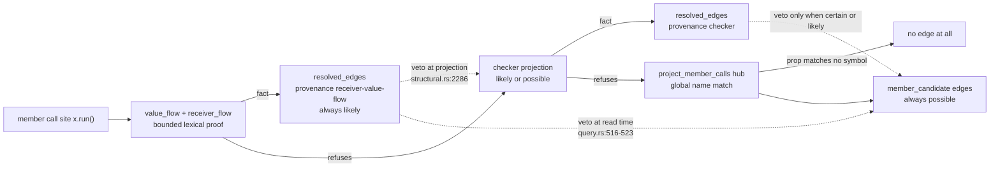
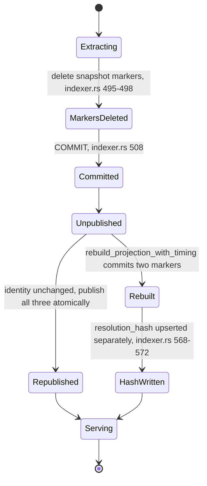

# Sharp edges, complexity hotspots, and risks

jscout's risk profile is not distributed evenly across its 82 Rust files. It concentrates in four places: two modules that have grown past the point where a reader can hold them in one pass (`src/checker/enrich.rs` at 3,934 lines and `src/search.rs` at 3,508), a set of facts that are authored in several files at once and cross-checked in none, a layer of deterministic approximations whose output is indistinguishable at read time from a proof, and a boundary where CLI flags, `.jscout.toml`, and MCP arguments silently overrule each other. The catalog below is organized by theme rather than by subsystem, because the same failure shape recurs across subsystems. Every entry names the file and, where the exact line is load-bearing, the line; severity ordering inside each theme is by what breaks, not by how ugly the code looks.

## Complexity hotspots

Six modules carry most of the reading cost. The sizes below are at `4de5622`; the two largest both grew in the last two days of work.

| Module | Lines | What makes it hard | Where the tests live |
|---|---|---|---|
| `src/checker/enrich.rs` | 3,934 | Two ownership planning passes, staging/resume/carry, per-project execution with two distinct restart paths, and a nine-predicate activation transaction (`src/checker/enrich.rs:3308`) in one file | `src/checker/enrich/tests.rs`, 3,614 lines / 44 tests |
| `src/structural.rs` | 3,799 | Seven projection stages with load-bearing inter-stage ordering (`src/structural.rs:542-604`), plus key encoding and neighborhood traversal | `src/structural/tests.rs`, 2,438 lines / 38 tests |
| `src/scouting/mod.rs` | 3,365 | Six generative families sharing a claim/prepare/execute/publish skeleton with per-family divergences | `src/scouting/tests.rs`, 3,267 lines / 43 tests |
| `src/search.rs` | 3,508 | Two retrieval modes in one function: ranked hybrid plus the new exhaustive locator pager, sharing a triple-nested byte-budget fixed point | `src/search/tests.rs`, 2,099 lines / 29 tests |
| `src/mcp.rs` | 2,093 | Twelve tool arms, three rendering paths, two byte-budget families, two JSONL streams | `src/mcp/tests.rs`, 1,534 lines / 24 tests |
| `src/checker/package_gate.rs` | 1,398 | Manifest reachability heuristics: shell tokenizer, `exports` condition walk, dist→src mirror guessing, hand-rolled glob | inline `#[cfg(test)]` at `:858`, 14 tests |

Two structural observations follow. First, `src/search.rs` now holds ranked and exhaustive retrieval in the same call path, and they shed bytes differently at the same limit: `exhaustive_locator_only` is guarded by `compact` (`src/search.rs:2554`), so a diagnostic-transport request falls straight through to popping whole hits and reports a different minimum floor than the compact one for identical input. Second, the crate has no `lib` target and no `tests/` directory, so all 474 `#[test]` functions compile into the one binary and none of them exercises a public seam. Refactoring any of the six modules above means recompiling and rerunning everything.

The newest large module broke the tree's own convention. `src/checker/package_gate.rs` puts its 14 tests inline while the other five hotspots use sibling `tests.rs` files, and the two newest modules of all — `src/value_flow.rs` (838) and `src/structural/receiver_flow.rs` (936) — contain **zero** `#[test]` functions between them. Their coverage is entirely end-to-end through index-a-temp-repo tests in `src/structural/tests.rs`. A pure-function defect in `statement_terminates` or `mutated_members` is only visible if some behavioral test happens to hit that shape.

## Facts authored in several places, cross-checked in none

These are ranked by what a missed edit costs.

| Fact | Authored in | What breaks on a partial edit |
|---|---|---|
| Schema version `29` | `src/store.rs:8` (const), `:246` (migration `UPDATE`), `:264` (`init_schema` seed) | Missing the `UPDATE` leaves migrated databases stamped at the old version, so they re-enter the legacy rebuild on every open, forever |
| FTS5 column order `(content, name, symbols, path)` | `CHUNKS_FTS_CREATE` at `src/store.rs:31`; addressed positionally by `bm25(chunks_fts, 2.0, 4.0, 3.0, 1.0)` at `src/search.rs:998` and `highlight(chunks_fts, 0, …)` at `src/search.rs:1114` | Reordering columns silently reweights ranking and highlights the wrong column. No compile or runtime error |
| The 3-target closed-candidate threshold | `src/checker/enrich.rs:3644` (`map_occurrence`) and `:3448` (activation SQL) | Divergence admits or drops `likely` checker facts asymmetrically between staging and publication; changing either also requires bumping `CHECKER_SEMANTICS_FINGERPRINT` |
| Crate version `0.4.0` | `Cargo.toml`; re-authored in `npm/cli/package.json:3` and its four `optionalDependencies` pins (`:44-47`), and in `checker/package.json:4` | `scripts/npm-package.mjs:149-154` only **warns** on wrapper mismatch before overwriting, and copies `checker/package.json` verbatim (`:180-183`) with no rewrite — the checker sidecar ships whatever it authored |
| Rust toolchain `1.97.1` | `rust-toolchain.toml:2`, `ci.yml:15`, `ci.yml:68`, `release-npm.yml:23`, and the container tag `release-npm.yml:76` | Bumping the toolchain file alone leaves every CI and release build on the previous compiler with no signal |
| `SKIP_DIRS` | Consulted from eight sites: `src/walk.rs:78`, `src/watch.rs:498`, `src/workspace.rs:544`, `:884`, `:980`, `:1044`, `:1120`, `:1193` | Each has different surrounding logic, so changing the list has non-obvious blast radius |
| Node `22.19.0`, glibc `2.31` | Nine and four places respectively; only `MINIMUM_NODE_VERSION` (`src/llm/config.rs:14`) is checked against a running process | Documentation and launcher gates drift apart from the enforced one |

The version literal at `src/store.rs:246` has a second, subtler hazard: `rebuild_legacy_disposable_schema` writes `UPDATE meta SET value='29'` as a hardcoded string rather than interpolating `SCHEMA_VERSION`. The gate that decides whether to run the rebuild is also string-inequality-first — `version != "29"` and then a numeric bounds check — so a non-canonical stamp like `"029"` parses to 29, passes bounds, and runs the full rebuild anyway.

## Invariants held by convention only

- **`chunks_fts.rowid == chunks.id`.** FTS5 does not participate in SQLite foreign keys, so every deletion path must remove the mirror row by hand. Exactly two do: `store::delete_file` (`src/store.rs:1122`) and the drop-and-recreate in `reset_extraction_state` (`src/store.rs:1078`). A third deletion path added anywhere would leave orphaned FTS rows that surface as hits for deleted code. Hard to fix properly; easy to violate.
- **Children-first deletion.** `reset_extraction_state` deletes `files` (`src/store.rs:1075`) *before* `resolved_edges` and `graph_nodes`. It is safe only because `graph_nodes.file_id` (`src/store.rs:627`) carries no foreign key. The invariant is upheld by a missing constraint, not by the ordering it appears to rely on. Likewise the legacy migration's drop ordering runs before `foreign_keys=ON` is applied (`src/store.rs:166`), so it is unenforced.
- **`ledger::claim_run` callers must not hold a transaction.** It opens its own `BEGIN IMMEDIATE` and documents the constraint in a comment (`src/scouting/ledger.rs:69-72`). Nothing enforces it.
- **The plan_members session reuses one request id** for begin/add/finish/next, breaking the otherwise universal one-id-per-frame rule in the checker protocol. A stray frame carrying that id would poison the reused Rust client; the Node side guards it with `canceledPlanId` (`checker/src/main.mjs:242-247`), which drops *every* subsequent frame with that id until a new `plan_members_begin` arrives.
- **`MAX_PROTOCOL_LINE_BYTES` is outbound-only in Rust.** The check lives in `Writer::send_with_id` (`src/checker/process.rs:122-127`); the stdout reader (`:330-344`) is a plain `BufReader::lines()` with no cap. Only Node caps inbound frames.
- **Watch cancellation contracts are `debug_assert!` only.** `src/watch.rs:857` and `:996` assert that a canceled embed report implies a superseded generation. In a release build a spurious canceled report is recorded as a clean generation.

## Approximations that read like answers

Three planes can close a member call. Their precedence is enforced by two vetoes, both of which remove evidence rather than add it — which is what makes a false positive in the cheapest plane expensive.

The dashed edges are the risk. `EVF` vetoes `CHK` unconditionally and at projection time, so a wrong value-flow answer is never corrected by the TypeScript sidecar — not even with `enrich --all`, which gates on `!occurrence.value_flow_resolved` outside its `include_all` disjunction (`src/checker/enrich.rs:1204`). `EVF` and `ECHK` also veto `ECAND` at read time through a `NOT EXISTS` on `$.memberCallId` (`src/query.rs:516-523`), and that gate carries no `kind` predicate: any future edge kind that writes `memberCallId` would silently blank hub candidates. The `NONE` branch matters too — `project_member_calls` bails before minting anything when the property name matches no indexed symbol (`src/structural.rs:2039-2041`), so "the occurrence keeps its `possible` hub edge" is false for those calls; they keep nothing.

The value-flow plane's own bounds are worth stating plainly, because its output carries `likely` with no marker of them. It is branch-insensitive by construction: `conditional(kind) { return kind ? new A() : new B() }` is rejected as an expression shape, but an `if`-chain factory unions its branches, so `openDatabase(path, {driver})` emits both adapters at `likely`. `this.method()` resolves against the enclosing class's own or inherited method and skips the construction-identity check entirely (`src/structural/receiver_flow.rs:851`); a subclass override is not modelled. One `eval` identifier or one `with` statement anywhere in a file zeroes that file's flow facts. And only `StaticMemberExpression` callees produce a receiver flow (`src/value_flow.rs:617`), so `obj["run"]()` is outside the plane. Measured on ai-pipe, 499 of 557 answered occurrences are in tests and 9 in `server/` — the plane answers construction sites, and construction sites are mostly tests.

Elsewhere the approximations are cheaper but equally invisible:

- `should_skip_minified` inspects only the first five lines (`src/dependency.rs:297`); a bundle whose banner comment occupies line one escapes, and a legitimately long single-line data file is dropped.
- `pnpm_workspace_globs` (`src/workspace.rs:278`) is a hand-rolled YAML subset. Anchors, multi-line scalars, or a nested `packages:` key are mis-parsed rather than reported.
- `file_role::has_file_marker` (`src/file_role.rs:135`) is a substring test over the whole filename, so `manifest.test.helpers.ts` classifies as `test`.
- `contains_code_identifier` (`src/search.rs:807`) models neither regex literals, JSX text, nor `${}` substitutions: an apostrophe inside a regex flips the lexer into single-quote state and swallows following code.
- `reranker.max_chars` (default 4000) is applied by `truncate_utf8` as a **byte** budget (`src/search.rs:2291`), as is `embed_text`'s 24,000 (`src/embed.rs:506`). Multibyte source gets materially less context than either name implies.
- The scouting context ceiling is UTF-8 byte length (`src/scouting/mod.rs:3016`), which systematically over-refuses evidence packs that would fit the model's window.
- `is_in_skipped_directory` matches `SKIP_DIRS` against every root-relative component (`src/walk.rs:74-79`), so an authored source directory named `out` or `dist` is invisible to indexing regardless of gitignore.

Chunking carries two boundary properties that the code comments assert and the code does not deliver. `with_leading_comment` (`src/chunk.rs:388-402`) absorbs a comment backward into the following unit even though `units_for_statement` already emitted a header unit whose span reaches the first body member — so adjacent chunks *can* share bytes, and offset-containment attribution is ambiguous over that overlap. And type erasure is asymmetric: `units_for_function` returns early on `f.declare` (`src/chunk.rs:205`), but `units_for_class` (`:273`) and `units_for_var` (`:318`) have no such check, so `declare class C {}` and `export declare const x: T` do produce chunks with names. A fully ambient `.d.ts` is not empty.

## Silent overrides at the user boundary

Ranked by how surprising the outcome is.

1. **`--exhaustive` overrules configuration, not just flags.** `src/commands/mod.rs:240-247` computes `vector`, `rerank`, `include_memory`, and `expand` as `!exhaustive && resolve_flag(...)`. A user with `search.vector = true` in `.jscout.toml` gets a purely lexical result with no diagnostic saying the config was ignored. Clap only *conflicts* the explicit flags (`src/cli.rs:98`).
2. **`inference.host` loopback enforcement is provenance-dependent.** The guard fires only when `resolver.sources["inference.host"] == ValueSource::Config` (`src/config/load.rs:649`). `JSCOUT_INFERENCE_HOST=0.0.0.0` binds remotely without tripping `allow_remote`; only `inference/service.py:430-436` still catches it.
3. **The MCP request log records complete unredacted tool `arguments`,** including natural-language queries, and is enableable from `.jscout.toml` alone via `telemetry.request_log` (`src/mcp.rs:362-370`) — no flag required.
4. **MCP structured transport is client-sniffed.** `ResultTransportPolicy::Auto` resolves to Structured only for `clientInfo.name == "codex-mcp-client"` at version ≥ 0.147.0 (`src/mcp.rs:117-126`). Every other client, and any session where `initialize` never arrived, silently stays on text.
5. **`reranker.top = 150` errors from the config file but clamps to 100 from legacy env** (`src/config/load.rs:691-697`).
6. **Three commands have no `--database` flag** — `events` (`src/commands/mod.rs:317`), `who-uses` (`:623`), `neighborhood` (`:640`) — yet they use `runtime.effective.database.path`. An eval harness that points `search` at a database cannot point these three at the same file.
7. **`cmd_who_uses` calls `std::process::exit(1)` on "no symbol found"** (`src/commands/core.rs:421`). It is the only command in the binary that reports an empty result as process failure, it runs no destructors, and it prints a bare stderr line instead of an `anyhow` chain.
8. **CLI and MCP resolve `who_uses` differently.** The CLI upgrades a plain name spec to an exact anchor via `unique_anchor_for_symbol_target` (`src/commands/core.rs:474`); MCP's `symbol_targets` (`src/mcp.rs:1515-1543`) does so only when the caller passed `anchor`. Same tool name, two hub-suppression behaviors.
9. **`file_outline` resolves `path` with `f.path = ?1 OR f.path LIKE '%' || ?1`** (`src/mcp.rs:1218`), so a short suffix matches several files and the outline interleaves them. "Unique suffix" is schema prose only.
10. **`--exhaustive --limit 500` is not a clap error.** It fails at `src/search.rs:1623-1627` after the database is already open; only the *omitted*-limit path is clamped by `resolve_search_limit`.

## Durability, concurrency, and operational risk

The `Unpublished` state is the operational sharp edge. Between the `COMMIT` and marker republication, `store::open_path_read_only` hard-fails, so queries and MCP clients get an error rather than the last good snapshot — and this applies to every generation, including a completely no-op incremental refresh. The two exits from `Unpublished` are not symmetric: only the reuse path publishes all three markers inside one `BEGIN IMMEDIATE`, while the rebuild path commits `snapshot` and `projection_version` in the projection transaction and upserts `resolution_hash` afterward as a separate autocommit statement. No reader observes the difference because `open_path_read_only` gates on the first two only (`src/store.rs:84-98`).

Around that: no `busy_timeout` is set anywhere in `src/store.rs` — the only caller that sets one is `src/watch.rs:1314`, on its own writer connection — so with WAL and a concurrent watch, MCP, and CLI on one database, a contending writer gets `SQLITE_BUSY` immediately rather than backing off. There is no `VACUUM`, no `ANALYZE`, and no `INSERT INTO chunks_fts(chunks_fts) VALUES('optimize')` anywhere in the crate: repeated resets leave the file at its high-water page count, the FTS b-tree unmerged, and the planner running without statistics. Watch retry backoff is uncapped in attempt count (`src/watch.rs:371-386`) — a permanently failing refresh retries forever at 30s with no escalation. `register_sqlite_vec` (`src/store.rs:13-25`) installs the vec0 entry point process-wide under a `Once`, so after the first `store::open*` every `Connection::open` in the process has vec0 loaded, including in-memory test fixtures that never asked.

Two silent-degradation paths are worth naming because their symptom is "worse results", not "an error". Any semantic artifact write clears the sync markers for *all* embedding profiles (`src/semantic.rs:860` → `src/embed.rs:1180-1186`), so a scout run leaves semantic vector retrieval in lexical order until `jscout embed --semantic` runs. And vector search does not refuse when unready: `record_vector_ranking` (`src/search.rs:2295-2311`) prints `vector search unavailable: …` and completes BM25-only, so the `bail!`s inside `ready_search_profile` never reach the user as a failed search.

## Dead and vestigial code

| Item | Location | Status |
|---|---|---|
| `checker_input_files` drop | `src/store.rs:210` | Table is not created by `init_schema`. Harmless, but reads as if it exists |
| `validate_inputs` protocol op | `checker/src/main.mjs:263`, `checker/src/worker.mjs:1197-1219` | Implemented on both Node sides; `Outbound` (`src/checker/protocol.rs:7-38`) has no such variant, so Rust never sends it |
| `resolve_member` | `src/checker/protocol.rs:21-24` | `#[cfg(test)]`-only in Rust; the worker's implementation duplicates ~50 lines of `resolveInProject` |
| musl launcher branch | `npm/cli/bin/jscout.mjs:42-51` | `platformKey` can return `linux-x64-musl`, but no musl package is built or declared, so a musl user gets a missing-optional-dependency error instead of the informative glibc message |
| `"unknown"` file role | `src/file_role.rs:11`, `:14`, `:98`; default at `src/store.rs:285` | `classify` never returns it. Rows get it only from a default-valued insert, so `DEFAULT_EXPANSION` carries a slot the classifier cannot fill |
| Method-chunk fallback in `find_symbols_in_origins` | `src/query.rs:590-627` | `src/graph.rs:220-231` already registers every method of a *named* class in `symbols`, and method chunks exist only for oversized classes. Reachable only for methods of anonymous classes |
| `scout_workflows` | `src/scouting/mod.rs:301-326` | `#[cfg(test)]` only; production goes through `scout_workflow_plan` |
| `entity_inventory_truncated` | `src/surface.rs:563` | Hardcoded `false` at construction; there is no inventory limit option, so it flips only via byte-budget shedding at `:1037` |
| `start < 0` cursor guard | `src/search.rs`, `decode_exhaustive_cursor` | Unreachable: `i64::from_str_radix` over 16 unsigned hex digits rejects out-of-range values one line earlier |
| `--arg-position` without `--arg` | `src/calls.rs:337-338` | `match_arguments` returns before the position loop, so `--arg-position 3` alone matches every call |

## Testing gaps

The Rust suite is dense — 474 tests over 82 files — and its gaps are specific rather than general.

- **`src/value_flow.rs` and `src/structural/receiver_flow.rs` have no unit tests at all.** 1,774 lines whose only coverage is behavioral, through temp-repo indexing in `src/structural/tests.rs`. This is the newest plane and the one with veto power over the checker.
- **`scripts/eval-workflow-scope-report.test.mjs` runs nowhere.** The root `package.json` `test` script hand-enumerates twenty `.test.mjs` paths and omits it. Worse, no workflow invokes the root `npm test` at all — `ci.yml:36` and `:50` run `npm test --prefix gateway` and `--prefix checker` only — so all 60 `scripts/*.test.mjs` cases, the 4 `examples/graph-memory` cases, and the 7 `inference/test_service.py` cases are ungated.
- **No JavaScript lint or format check exists** for the ~30 `.mjs` files across `gateway/`, `checker/`, `npm/`, `bench/`, `examples/`, and `scripts/`, while Rust gets `cargo fmt --check` plus `clippy -D warnings`.
- **`x86_64-apple-darwin` is cross-compiled and never executed.** The macOS smoke step is gated `if: matrix.native` (`release-npm.yml:56`), and the only architecture check in the repo — `EXPECTED_ARCHITECTURE` in `scripts/npm-bootstrap-publish.mjs:29-34` — runs exclusively in the one-time bootstrap path.
- **Neither `cargo test` nor `cargo clippy` passes `--locked`** (`ci.yml:20,22`), so lockfile drift is caught only in `release-package`, where `scripts/package-release.sh:22,26` builds `--locked`.
- **No test asserts workflow reuse across an unrelated index change**, unlike the card and summary equivalents — which matters because workflow fingerprints fold in `structural::current_snapshot` (`src/scouting/mod.rs:3039`) while cards, summaries, and concepts are snapshot-free. Every re-index, of any file, invalidates every completed workflow run's reuse.
- **The erasure test at `src/chunk.rs:549` does not cover `declare class` or `declare const`**, which is why the asymmetry above went unnoticed.
- **`ResponseBudgetTooSmall` is downcast only in tests.** `grep` finds `downcast_ref::<ResponseBudgetTooSmall>` nowhere in production; at the MCP boundary the machine-readable `minimum_bytes` floor degrades to a `Display` string.
