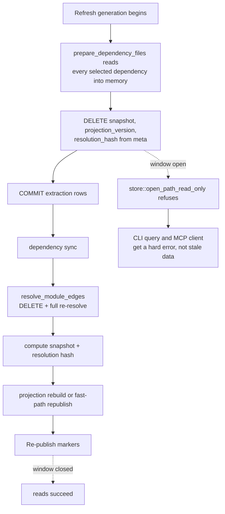
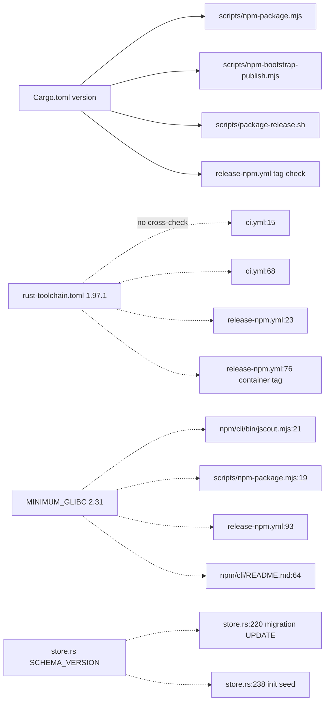

# Sharp edges, complexity hotspots, and risks

This document collects the places where jscout's behavior diverges from what its own interfaces imply: computations that approximate but are rendered as facts, invariants that hold only because two or three files happen to agree, code paths that abort where a degraded answer would serve better, and modules that carry no tests at all. It is organized by failure theme rather than by subsystem, because most of these edges cut across the pipeline — a single hardcoded literal in `src/store.rs` is a migration hazard, a packaging hazard, and a schema hazard at once. Everything here is a property of commit `854bff1`; nothing is speculative.

## Complexity hotspots

The largest production file is now `src/structural.rs` at 3,751 lines, holding module-edge projection, reference resolution, entity and contract projection, member-call hubs, checker-fact projection, event projection, neighborhood and workflow traversal, path search, and every graph key format — six projection stages plus three traversal algorithms in one module. `src/main.rs` has left the list entirely at 79 lines; the clap surface moved to `src/cli.rs` (878 lines) and dispatch to `src/commands/` (1,827 lines). Second is `src/scouting/mod.rs` at 3,365 lines, where the four generative executors (`execute_prepared_workflow` at `src/scouting/mod.rs:1199`, `_card` at `:1509`, `_concept` at `:1825`, `_summary` at `:2397`) plus `repository::execute_one` (`src/scouting/repository.rs:1141`) repeat the same ~250-line skeleton five times: gateway-error block, usage accounting, billing-path correction, tool-name check, deserialization check, validation check, incomplete branch, publication transaction. The duplication is structural, not textual — the publication rechecks genuinely differ per family (summaries re-verify every child's pinned fingerprint at `src/scouting/mod.rs:2592-2611`; concepts re-derive `expected_concept_child_ids`; the card path is the thin one) — which is why the shared helper has not been extracted, and why any change to the call-and-publish contract has to land five times.

Third is `src/checker/enrich.rs` at 3,073 lines, which after the carry-forward rewrite holds planning, project ordering, staging, carry authorization, activation, and re-verification. Its cheapest-to-fix cost is `plan_members`: a single unchunked frame containing every eligible file plus every dirty file (`src/checker/enrich.rs:387-388`) against a 4 MiB line cap (`checker/src/protocol.mjs:4`). An oversized line is answered with `id: ""`, which Rust's `receive_for` treats as a wrong-id reply, poisoning the client with `message for unexpected request id` instead of reporting a size problem. `src/scouting/repository.rs:394` already chunks the same call at 512 files; enrichment does not. That is a ten-line fix.

Expansion admission in retrieval is quadratic by construction: every trial clones the current node and edge vectors and re-serializes the whole set through `expansion_parts_bytes` (`src/search.rs:2065`), once per candidate, for up to `edge_limit` (default 120) candidates. `apply_repository_policy_penalty` issues one SQL query per fused candidate — up to 50 at default limit — and runs after the reranker, so its cost is paid on every unfiltered search whether or not a single policy row exists (`src/search.rs:1503-1504`). Neither is a correctness problem; both are unconditional per-query costs that no flag disables.

## Availability cliffs: hard failure where degradation was available

Look at the dashed edges: the window between marker deletion and republication is where every reader fails. `src/indexer.rs:494-497` deletes the three publication markers inside the committed transaction, and `store::open_path_read_only` refuses to hand out a connection while either `meta.snapshot` or `meta.projection_version` is absent (`src/store.rs:83-96`). That is the intended invariant — no reader ever sees a half-built graph — but the window spans dependency sync, a full `module_edges` DELETE-and-re-resolve (`src/indexer.rs:1161-1236`), snapshot computation, and projection, and it opens even on a no-op incremental generation that will end on the `projection_rebuilt = false` fast path. There is no read-your-last-good-snapshot mode. Under `jscout watch` on a busy repository, an MCP client's `semantic_search` can fail outright because someone saved a file. Fixing this properly means versioned publication (write new markers, swap, delete old) rather than delete-then-rebuild — a substantial change to the projection contract described in [05-storage-schema.md](05-storage-schema.md).

Second: one drifted file aborts an entire `calls` query. `src/calls.rs:119-124` `bail!`s on the *first* candidate whose on-disk blake3 differs from `files.hash`, even when the edit is in an unrelated file and even when that file is a dependency pulled in by `--origin dependency`. This is the only place in the read path that re-reads source from disk, and it is a hard availability property of the subsystem. Downgrading to a per-file skip with a `stale_files` field in the result would be a contained change.

Third: `busy_timeout` is unset — zero milliseconds — on every connection except the watcher's (`src/watch.rs:1314` is the only call site in the crate). A second CLI invocation, or an MCP `annotate` landing while an index runs, gets an immediate `SQLITE_BUSY` rather than waiting. A one-line default on `store::open_path` would remove most of this.

Fourth: byte budgets fail closed everywhere. A too-small `response_bytes` is a hard error in `attach_symbol_resolution`, `symbol_content_byte_limit`, `who_uses_string`, `definition_string`, `render_neighborhood`, and `render_bounded_object_arrays` alike; `attach_symbol_resolution` bails with `response byte limit … is below the exact-anchor response envelope` (`src/mcp.rs:1530-1535`). For an agent that guessed a budget, an error is strictly worse than a truncated answer with a `truncated: true` flag — which the same code already emits in other paths.

Fifth: `cmd_who_uses` calls `std::process::exit(1)` when no symbol matches (`src/commands/core.rs:387`). This bypasses the anyhow chain, runs no destructors, and prints a bare stderr line instead of `Error: …`. Two more direct exits are reachable from ordinary commands: the Ctrl-C handlers at `src/llm/process.rs:85` and `src/checker/process.rs:157`. Related, `ctrlc::set_handler` can only succeed once per process, and each client keeps its own `INTERRUPT_HANDLER` OnceLock (`src/checker/process.rs:21`, `src/llm/process.rs:29`) — whichever subsystem registers first owns SIGINT, so `scout repository`, which uses both sidecars, routes interrupts to only one of them.

## Approximations presented as facts

These are the entries most likely to mislead a consumer reading the output at face value.

| Field / behavior | Site | What it actually is |
|---|---|---|
| `Hit.score` | `src/search.rs:876` | Not a ranking key. Exact-tier hits absent from the hybrid pool report `0.0` while ranked first; after reranking the hybrid tail mixes raw cross-encoder values with RRF values near 0.016. Sorting a response by `score` inverts the intended order. |
| Exact-identifier tier case handling | `src/search.rs` exact-tier SQL vs `chunks_fts` | Exact chunk lookup uses `COLLATE BINARY`; FTS5 uses `unicode61` with case folding. `usestate` BM25-matches `useState` but can never enter the exact tier — the two legs of one query disagree on case sensitivity. |
| Exact tier vs repository policy | `src/search.rs:1503-1506` | The exact tier bypasses `apply_repository_policy_penalty` entirely, so an exact definition in a `generated` or `test` scope outranks every hybrid hit — surfacing exactly the code the policy plane was built to demote. |
| Scouting "token" budget | `src/scouting/mod.rs:2994-3027` | `enforce_context_budget` uses UTF-8 byte length as an upper bound on input tokens: roughly 3-4x conservative, and the error message quotes a byte count as a token count. |
| `E###` citation line ranges | `src/scouting/repository.rs:587` | `MAX_DISK_EVIDENCE_CHARS = 12_000` truncates repository configuration evidence, and `line_count` is computed from the truncated content — the reported range describes the truncation, not the file. |
| `files_scanned` in `calls` | `src/calls.rs:170` | `files.len()`, the candidate count computed before the loop, which may have broken early on `--limit`. Overstates work done. |
| `--arg` filter completeness | `src/calls.rs:236-259` | The FTS pre-filter drops candidate files whose indexed chunks do not FTS-match every alphanumeric term. A call that exists in the AST but is not covered by an indexed chunk is a silent false negative — a soundness risk, not an optimization. |
| `elided` source representation | `src/scout.rs:110-113` | `render_elided` falls back to the full span whenever oxc reports any diagnostic. A file with one type error gets no elision, and the representation still reads `elided`. |
| `entity_occurrences` in overview | `src/surface.rs:446` vs `:503` | The per-file total is counted from `entity_sites` while `entity_inventory` counts `entity_occurrences` — two tables behind similarly named numbers, 1:1 only for sites whose file id is still present. |
| `rendered_bytes` | `src/mcp.rs:1647-1656`, `src/surface.rs:1073-1082`, `src/compact.rs:447-474` | Every settle loop caps at 8 iterations and returns the last value without asserting equality. A non-converging document reports a `rendered_bytes` that disagrees with its real length. |

Two more are worth stating in prose. `contains_code_identifier` (`src/search.rs:705-784`) is a naive byte-state lexer with no model of regex literals, JSX text, or `${}` substitutions; an apostrophe inside a regex flips it into `SingleQuoted` and swallows the following code. It is also applied only to the FTS5 fallback leg, not to the structured UNION over `refs`/`member_calls`/`entity_sites` — the "no string literal can produce an exact occurrence" property holds there because those columns are parser-derived, not because this function checked them. And `who_uses` pass 1 has no kind predicate (`src/query.rs:320-335`), so an `import` or `use` edge is reported as a "usage" beside real calls, while tier 3 has no receiver predicate at all (`src/query.rs:553`) — `who-uses get` returns every `.get()` in the allowed origins as `possible`.

## Invariants enforced only by convention

Solid arrows are checked couplings; dashed arrows are duplicated literals with no verification. The crate version is the one identity that is actually enforced — `scripts/npm-package.mjs` and `scripts/npm-bootstrap-publish.mjs` read it by regex, `scripts/package-release.sh:8` by awk, and `release-npm.yml:141-149` fails a *tag* release when the git tag disagrees. Everything dashed can drift silently. Bumping `rust-toolchain.toml:2` alone leaves CI and the release on the old compiler. `SCHEMA_VERSION` at `src/store.rs:8` is repeated in the migration's `UPDATE meta SET value='26'` (`src/store.rs:220`) and the `init_schema` seed insert (`src/store.rs:238`); bumping only the constant leaves migrated databases stamped at the old value and re-enters the migration on every open.

Inside the crate the same pattern recurs. `file_role::penalty` maps any unrecognized role to `0.0` (`src/file_role.rs:103`), so adding a value to `file_role::ALL` without touching `penalty` silently zeroes those files out of ranking. `SearchSettings::default()` and `ExpansionSettings::default()` (`src/config/model.rs:63-113`) restate the defaults `RuntimeConfig::load` applies and are used by MCP tests — nothing forces the two to agree. `chunks_fts.rowid == chunks.id` is maintained by hand on insert, per-file delete, and drop/recreate, because FTS5 has no foreign-key awareness. Every `vec_*` statement in `src/embed.rs` is a `format!`-built string; safety rests on a `1..=8192` range check on a `usize` (`src/embed.rs:1104`) and a digits-only re-validation in the migration (`src/store.rs:176-180`). `reset_extraction_state` explicitly deletes 19 tables but omits `symbols`, relying on FK cascade from `files` — which breaks the children-before-parents discipline stated in the comment directly above it (`src/store.rs:933-935`) and makes adding a new `files`-referencing table easy to get wrong.

Two schema asymmetries are latent bugs rather than conventions. `semantic_relations.dst_artifact_id` references `semantic_artifacts(id)` without `ON DELETE CASCADE` while `src_artifact_id` has it (`src/store.rs:775-776`): deleting a summarized child fails, deleting the summarizing parent succeeds. And `repository_current_classifications.subject_kind` allows only `('package','area')` while the durable `repository_classifications.subject_kind` also allows `'project'` (`src/store.rs:723` vs `:676`) — a project-kind classification can be recorded but never projected as current.

## Footguns for a new contributor

`register_sqlite_vec` uses `std::mem::transmute` on a function pointer inside `unsafe` and installs the result as a *process-wide* SQLite auto-extension (`src/store.rs:13-25`). Every connection opened anywhere in the process after the first `store::open*` inherits vec0, including ones that never asked for it. Separately, `ensure_vector_table` is called from inside `delete_vector_rows_for_file` and `clear_vector_rows` (`src/embed.rs:1804`, `:1818`), so a code path whose job is deletion can CREATE a virtual table as a side effect.

Every savepoint error arm swallows its unwind: `let _ = conn.execute_batch("ROLLBACK TO …; RELEASE …")` at `src/store.rs:869`, `src/embed.rs:1136-1139`, `:1319-1323`, `:1355-1358`, `:1471-1474`, and elsewhere. A failure to unwind leaves an open savepoint on the connection with no diagnostic.

The module layout will surprise anyone navigating by grep. Eighteen modules are `foo.rs` plus a sibling `foo/tests.rs` (18 files named `tests.rs`, 19,253 lines), with `src/main_tests.rs` a nineteenth sibling file under a different name, while `src/store.rs`, `src/calls.rs`, `src/chunk.rs`, `src/dependency.rs` and others keep inline `#[cfg(test)] mod tests`. `src/commands/` has no `tests.rs` at all; its coverage comes from `src/main_tests.rs` reached through a `#[cfg(test)] use` re-export block at `src/main.rs:70-76` that exists purely so the test file can see `resolve_flag`, `or_configured`, `effective_search_response_byte_limit`, `render_cli_neighborhood`, and `render_semantic_memory_text`.

Configuration has two contributor traps. `--config` is `global = true` (`src/cli.rs:15`) and is the only path resolved against the process cwd rather than the canonical repository root, so `jscout config init /repo --config rel.toml` writes relative to cwd (`src/config/load.rs:919-925`). And `main.rs` dispatches `Command::Config` at `src/main.rs:53-54` *before* `RuntimeConfig::load`, so `jscout config show|validate|init` never emits the legacy-env migration warning at `src/main.rs:57-64` — the exact command you would reach for to debug a broken config deliberately skips the warning path. One key has two behaviors for one value: `reranker.top > 100` is a hard error from the config file but is silently clamped to 100 when it arrives via `JSCOUT_RERANK_TOP` (`src/config/load.rs:691-697`). The non-loopback bind guard fires only when `inference.host` came from the config file (`src/config/load.rs:649-655`), so `JSCOUT_INFERENCE_HOST=0.0.0.0` bypasses the Rust check entirely and leaves the Python service's own `JSCOUT_INFERENCE_ALLOW_REMOTE` check as the only guard. See [12-configuration.md](12-configuration.md) for the full precedence model.

## Dead and vestigial code

There are zero `TODO`, `FIXME`, `XXX`, or `HACK` comments in `src/`, `checker/src/`, `gateway/src/`, or `inference/`. What exists instead is unreachable surface:

| Item | Site | Status |
|---|---|---|
| `clear_checker_plane` | `src/structural.rs:615` | `#[cfg(test)]`, sole caller `src/structural/tests.rs:1416`. Its doc comment at `:611-614` still says "Watch uses this before an explicit enrichment cycle" — stale. |
| `scout_workflows` | `src/scouting/mod.rs:302` | `#[cfg(test)]`-only; production always uses `scout_workflow_plan`. |
| `compute_snapshot` | `src/structural.rs:373` | `#[cfg(test)]`; production uses `compute_snapshot_with_resolution`. |
| `cache_retention` | `gateway/src/completion.mjs:379-380` | Reads a request field that `CompleteRequest` (`src/llm/protocol.rs:26-42`) does not have. Unreachable from Rust. |
| `validate_inputs` | `checker/src/main.mjs:110`, `checker/src/worker.mjs:838` | A wire request kind with no Rust `Outbound` variant at all. `resolve_member` is likewise Rust-side `#[cfg(test)]` only. |
| `names_concept` | `src/store.rs:781` | A reserved CHECK value with no writer; the comment says current concepts use `related_to` in the opposite direction. |
| `config_explicit` | `src/config/load.rs:910`, `src/config/model.rs:21` | Set and serialized, read nowhere in the crate; reaches users only through `config show --json`. |
| `checker_input_files` | `src/store.rs` migration drop list | A `DROP TABLE IF EXISTS` for a table `init_schema` no longer creates. |
| `DependencyLimits` overrides | `src/dependency.rs` | Every construction uses `Default`, so the 10,000-file / 100 MiB / 2 MiB budgets are effectively hardcoded with a struct's worth of ceremony. |
| musl launcher branch | `npm/cli/bin/jscout.mjs:42-51` | `platformKey` returns `linux-<cpu>-musl`, and no `@jscout/linux-*-musl` package is ever built — musl users get a missing-optional-dependency message rather than the glibc error the code was written to produce. |
| `ProcessGateway::poisoned()` | `src/llm/process.rs:390-393` | `#[cfg(test)]`. Neither client restarts a sidecar; "a poisoned client is never reused" is enforced by construction (a fresh sidecar per project), not by any production check. |

## Testing gaps

409 `#[test]` functions cover 78 `.rs` files, but the distribution is uneven in a way that tracks risk poorly. Six modules have no tests whatsoever: `src/heur.rs` (305 lines, the AST heuristics every extractor depends on), `src/graph.rs` (369 lines, the extraction entry point), `src/query.rs` (646 lines, export-chain resolution and all three `who_uses` tiers), `src/checker/mod.rs` (113), `src/llm/mod.rs` (236), and `src/scouting/workflow.rs` (448, the only scouting file without a test module). `src/cli.rs` (878) and `src/commands/` (1,827) contain zero `#[test]` and are reached only through the 11 tests in `src/main_tests.rs`. `src/query.rs` is the sharpest of these: the inferred-flag save/restore, the export-chain visited set, and the hub-attributed dedup are covered only transitively — for instance by `src/mcp/tests.rs:1104-1125`, which pins one `possible` row.

Around the crate: `cargo test` and `cargo clippy` in `ci.yml` do not pass `--locked`, so lock drift surfaces only in the release-package job. `cargo test --all-targets --all-features` runs `--all-features` over an empty feature set — `Cargo.toml` has no `[features]` section, so the flag is inert. No workflow invokes the root `npm test` or `npm run test:inference`, leaving the eval-script cases, demo cases, and Python cases outside the merge gate; and `package.json:9` hand-enumerates test paths instead of globbing, so `scripts/eval-workflow-scope-report.test.mjs` exists on disk and runs nowhere. There is no JavaScript linting or formatting anywhere — no eslint, no prettier — for roughly 30 `.mjs` files, while Rust gets `fmt` plus `clippy -D warnings`. No Rust test exercises the legacy-env branch of the config `Resolver`: `set_var` appears nowhere under `src/`, so all 30 legacy variable mappings in `src/config/load.rs` and the migration warning at `src/main.rs:57-64` are untested. Edition 2024 makes env mutation `unsafe`, which is the reason and also the thing that makes this gap hard to close without a process-spawning integration test. Finally, the scouting prompt strings (`src/scouting/mod.rs:2698-2708`, `:2755-2769`, `:2874-2889`, `:2926-2937`, `src/scouting/repository.rs:826`) are never asserted on anywhere, so a prompt edit that contradicts its own JSON schema would pass the entire suite.
