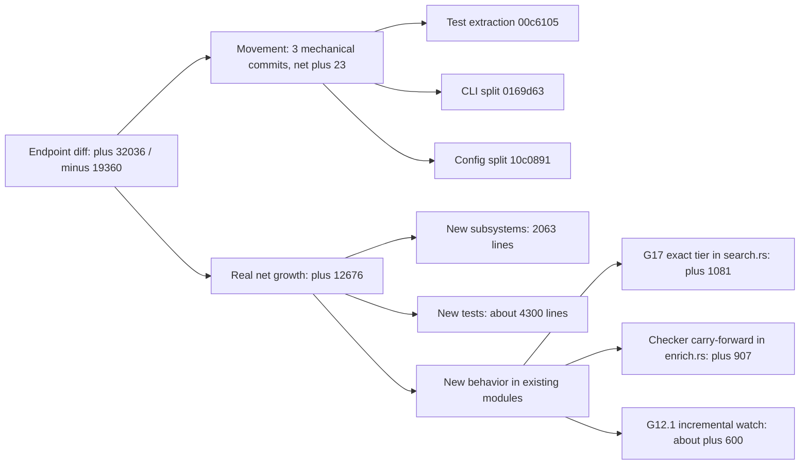
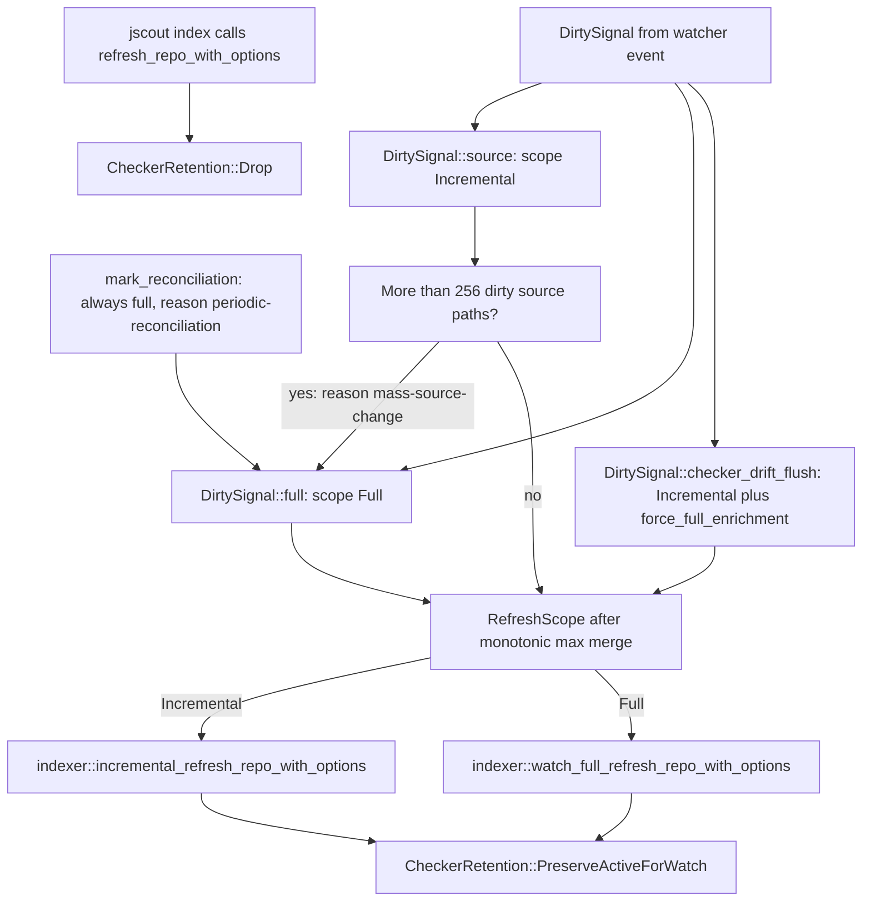

# What changed since the 2026-08-17 analysis

The previous document set describes commit `a102597`. Four days and 160 commits later, `src/main.rs` has shrunk from 2,403 lines to 79, eighteen modules pushed their tests into sibling `tests.rs` files, a typed `.jscout.toml` subsystem displaced point-of-use `std::env::var` reads, and the incremental indexing algorithm the prior analysis repeatedly called dead code became the default watch path. Most of the raw diff is furniture being moved rather than logic being written; this document separates the two so a reader of the older set knows which claims to discard. The per-document staleness table at the end is the part worth reading first.

## Headline figures

| Metric | `a102597` (2026-08-17) | `854bff1` (2026-08-21) | Δ |
|---|---:|---:|---:|
| `.rs` files under `src/` | 48 | 78 | +30 |
| Rust LOC under `src/` | 57,769 | 70,445 | +12,676 |
| `#[test]` functions | 319 | 409 | +90 |
| Production modules declared in `main.rs` | 32 | 37 | +5 |
| `main.rs` lines | 2,403 | 79 | −2,324 |
| Crate version | 0.2.0 | 0.4.0 | — |
| Commits in history | 292 | 452 | +160 |

The five new production modules are `cli`, `commands`, `config`, `fs_ops`, and `io_policy`; a sixth, `test_fs`, is declared under `#[cfg(test)]` (`src/main.rs:39-40`). No source file was deleted. The 30 new files decompose exactly: 19 sibling test files, 4 CLI-split files, 4 config files, 3 I/O seam files. Of the 409 tests, 322 now live in sibling `tests.rs` files and 87 remain in the 25 files that still carry an inline `mod tests {` block — the inline pattern the prior analysis treated as universal is now the minority.

## Pure restructuring: how much of the diff is movement

The two-endpoint diff for `src/` is +32,036 / −19,360 across 70 files. That number badly overstates how much changed, because three commits in the window are mechanical file moves, each committed on its own. Their combined net is **+23 lines**.

| Commit | Subject | Files | Insertions | Deletions | Net |
|---|---|---:|---:|---:|---:|
| `00c6105` | `refactor(tests): move large test modules into sibling files` | 36 | 18,882 | 18,970 | −88 |
| `0169d63` | `refactor: split CLI command modules` | 5 | 2,710 | 2,632 | +78 |
| `10c0891` | `refactor: split configuration modules` | 5 | 1,841 | 1,808 | +33 |
| **Total** | | | **23,433** | **23,410** | **+23** |

So roughly 23,400 lines appear on *both* sides of the endpoint diff purely as movement — more than the entire deletion count, because the endpoint diff collapses lines that were moved and then subsequently edited. About 22,470 of the 32,036 insertions (70%) land in files that exist only because of these two splits. Real net growth is +12,676 lines, of which the restructuring contributed 23.

Diffstats can be gamed by reformatting, so the movement claim is checked a second way: comparing each destination file's nonblank lines against the set of nonblank lines in its pre-split parent. A line counts as verbatim only if it appears unchanged in the old file.

| Extracted file | Nonblank | Verbatim from old parent |
|---|---:|---:|
| `src/scouting/tests.rs` | 3,077 | 3,023 (98%) |
| `src/indexer/tests.rs` | 1,838 | 1,439 (78%) |
| `src/checker/enrich/tests.rs` | 1,734 | 1,178 (68%) |
| `src/structural/tests.rs` | 1,647 | 1,546 (94%) |
| `src/mcp/tests.rs` | 1,375 | 972 (71%) |
| `src/search/tests.rs` | 1,224 | 824 (67%) |
| `src/semantic_query/tests.rs` | 1,026 | 787 (77%) |
| `src/semantic/tests.rs` | 912 | 907 (99%) |
| `src/embed/tests.rs` | 864 | 544 (63%) |
| `src/compact/tests.rs` | 774 | 597 (77%) |
| `src/scouting/plan/tests.rs` | 744 | 622 (84%) |
| `src/workspace/tests.rs` | 601 | 350 (58%) |
| `src/watch/tests.rs` | 551 | 233 (42%) |
| `src/recon/tests.rs` | 521 | 519 (100%) |
| `src/scouting/concept/tests.rs` | 467 | 455 (97%) |
| `src/main_tests.rs` | 462 | 263 (57%) |
| `src/entity/tests.rs` | 355 | 352 (99%) |
| `src/surface/tests.rs` | 342 | 341 (100%) |
| `src/config/tests.rs` | 245 | 0 (new subsystem) |
| **Total** | **18,759** | **14,952 (79.7%)** |

Excluding `config/tests.rs`, which has no pre-split parent, the figure is 80.8% verbatim. The low scorers are low because those modules gained substantial *new* tests after the split — `watch/tests.rs` at 42% is the G12.1 watch tests, `embed/tests.rs` at 63% is the vector-table recovery tests — not because the move rewrote them.

The CLI split behaves the same way. `main.rs` went 2,644 → 12 lines in `0169d63` (it had grown past 2,403 on G17/G18 work before the split) and back to 79 once config bootstrap landed. Destinations: `src/cli.rs` 868 nonblank / 709 verbatim (82%), `src/commands/mod.rs` 968 / 588 (61%), `src/commands/core.rs` 515 / 399 (77%), `src/commands/scout.rs` 300 / 186 (62%) — 70.4% overall. The non-verbatim 30% is mechanical: `pub(super)` markers, `use` re-imports across the new boundary, and threading `&RuntimeConfig` through signatures that previously read `std::env` inline.

Splitting bought navigable files and a review diff honest about what is new, at the cost of one window in which every line citation in the prior analysis went stale at once — 34 `src/main.rs:NNNN` references in prior doc 10 alone. The flowchart below separates the endpoint diff into movement and real growth; note how little of the +32,036 survives to the right.



`MOVE` and its three children account for more lines than `GROW` does, which is why the raw diffstat is misleading. Everything under `BEHAV` is where the system's observable behavior actually changed.

## New subsystems

Four modules exist that had no predecessor: 1,799 production/seam lines plus 264 lines of config tests, about 16% of the real net growth.

`src/config/` (G21) replaced scattered `std::env::var` reads at point of use. `config/model.rs` (221 lines) holds the typed tree — `RuntimeConfig` → `EffectiveConfig` → per-area settings structs for database, search, embedding, inference, reranker, LLM, sidecar, MCP, telemetry, diagnostics, index, and watch — each with a `Default` sourced from the constants the code used to hard-code. `config/load.rs` (1,217 lines) parses `.jscout.toml` against `SCHEMA_VERSION` (`src/config/load.rs:360`), expands `~` against `HOME`, runs per-field validators, records a `sources: BTreeMap<String, ValueSource>` provenance map where `ValueSource` is `Config` / `LegacyEnv` / `Builtin`, blake3-fingerprints the effective config, and implements `init()` writing an embedded template with `create_new` so it refuses to overwrite. Thirty `JSCOUT_*` variables plus `OPENAI_API_KEY` are still recognized as legacy fallbacks: anything sourced from them is tagged `ValueSource::LegacyEnv` and `src/main.rs:57-64` prints a migration warning before dispatch. The direct `env::var` calls left in production read the *named* credential variable (`src/embed.rs`, `src/llm/process.rs`), `PATH` for locating `node` (`src/llm/config.rs`), and the eval-harness labeling variables (`src/mcp.rs`). One new top-level command carries this: `Command::Config` with `show --json`, `validate`, `init` (`src/cli.rs:551-570`); the other 21 are unchanged. See [12-configuration.md](12-configuration.md).

`src/io_policy.rs` (106 lines) replaced ad-hoc `Err(_) => continue` and bare `?` at each read site with two predicates over `std::io::Error`. `is_inventory_race` matches `NotFound | IsADirectory | NotADirectory` — a file that vanished between inventory and read is absence, not error. `is_retryable` matches the transport and resource kinds plus a Unix `raw_os_error` table (`EIO`, `EMFILE`, `ENFILE`, `ENOMEM`, `EBUSY`, `ESTALE`, the network errnos), and excludes `PermissionDenied`, `InvalidData`, `InvalidInput`. Six production call sites consume it: `src/indexer.rs:412-413`, `src/indexer.rs:925-926`, `src/workspace.rs:345-346`, and `src/walk.rs:158,171` wrapping `ignore::Error::Io`. The consequence is specific: a transient `EMFILE` mid-index now aborts the phase for retry instead of publishing a clean-but-random subset of the corpus.

`src/fs_ops.rs` (42 lines) and `src/test_fs.rs` (66 lines, `#[cfg(test)]`) replaced a `thread_local! { static TEST_READ_FAILURES }` plus `inject_read_failure()` that lived inside production `src/indexer.rs`. `fs_ops::FileSystem` is a four-method trait — `read_to_string`, `metadata`, `read_dir`, `file_type` — with `OsFileSystem` delegating to `std::fs`; its doc comment bounds the seam, excluding canonicalization, existence probes, `package_entry_paths` traversal, resolver internals, and `ignore`-based walking. `test_fs::FaultFileSystem` layers one-shot failures keyed either by path or by `(FileOperation, PathBuf)` — the operation-keyed variant exists so an earlier `metadata` probe cannot consume a fault intended for a later `read_to_string`. Consumers: `indexer.rs` via a private `IndexOperation<'a, F: FileSystem>` context struct (`src/indexer.rs:271-276`), `workspace.rs`, `dependency.rs`.

## New behavior in existing modules

**G17, the exact-identifier tier.** `src/search.rs` production grew 1,653 → 2,734 lines. A `MatchReason` enum (`src/search.rs:339`) tags each hit `ExactDefinition` / `ExactOccurrence` / `Hybrid`. `exact_intent_tokens` (`src/search.rs:371`) splits the query on non-identifier bytes and admits a token only if it is identifier-shaped and — unless the whole query is one identifier — *code*-shaped (leading or embedded `_`/`$`, or any uppercase), which keeps ordinary English out of the tier. `exact_intent_candidates` (`src/search.rs:428`) runs two SQL passes per identifier: a definition match on `chunk.name` under `COLLATE BINARY`, and an occurrence match re-verified against stored chunk source with byte-boundary checks, then set-subtracted against the definitions. The occurrence budget is asymmetric — full window for a single-identifier query, **1** otherwise — so one incidental common type in a mixed natural-language query cannot consume the result budget. `tiered_candidates` (`src/search.rs:790`) emits definitions, occurrences, then the hybrid tail, with `append_exact_tier` (`src/search.rs:847`) interleaving round-robin across identifiers by depth so no identifier starves the others, stable-sorting within each tier by hybrid rank where a candidate also survived the hybrid pipeline. The tier sits *above* RRF fusion, so it can place candidates ahead of everything the reranker produced — see [07-retrieval.md](07-retrieval.md). `Reranker::from_env` is gone, replaced by `Reranker::from_settings` (`src/search.rs:955`).

**Checker carry-forward.** `src/checker/enrich.rs` production grew 2,166 → 3,073 lines across roughly a dozen commits: fact-to-call-rowid matching, carry across watch generations, dedup validation, retention boundaries, project-membership validation, and enrichment-input freshness caching (`66ac26d`).

**G20 transports.** `compact.rs` production grew 952 → 1,249. Search expansion gained a `mode` — `paths` (compact default) versus `neighborhood` (diagnostic) — configured under `[search.expansion]`, and `mcp.rs` gained profiled structured result transport. The MCP tool inventory is unchanged at 12 tools; argument and result *shapes* changed substantially. See [11-mcp-surface.md](11-mcp-surface.md).

**npm distribution.** A channel that did not exist before: `@jscout/cli` 0.4.0 with a `bin/jscout.mjs` launcher and four platform `optionalDependencies` (`darwin-arm64`, `darwin-x64`, `linux-arm64-gnu`, `linux-x64-gnu`), assembled by `scripts/npm-package.mjs` and released by `.github/workflows/release-npm.yml` on `v*` tags with `dry-run` defaulting on. `Cargo.toml` is the declared single source of version truth. See [15-build-config-ci.md](15-build-config-ci.md). Alongside it, a 35-lint `[lints.clippy]` block plus `clippy.toml`, `#[expect]` replacing `#[allow]` throughout, GitHub actions bumped `v4 → v7`, and a new `performance-harness` CI job over a new `bench/perf/` tree.

## The flagship correction: incremental indexing is production

The prior analysis stated in seven places that the incremental indexing path was `#[cfg(test)]` and unreachable from any command, and derived a chain of consequences from it. **That is now false.** Commit `248d58a` promoted the algorithm to a `pub`, non-`cfg(test)` entry point:

```rust
pub fn incremental_refresh_repo_with_options(  // src/indexer.rs:209
```

`src/indexer.rs` now exposes three production entry points and a set of test wrappers. The diagram below shows how the watcher chooses between them; note that `RefreshScope` is the selector, not a hard-wired constant.



`INC` is reached from `src/watch.rs:1092-1093` and `WFULL` from `src/watch.rs:1095`. `RefreshScope` (`src/watch.rs:60`) derives `Ord` so `merge` and `mark_dirty` escalate monotonically via `max`; `MAX_INCREMENTAL_SOURCE_PATHS = 256` (`src/watch.rs:22`) is the `CAP` node, degrading a branch switch or codegen burst to a full rebuild rather than tracking ten thousand paths. A second orthogonal axis, `CheckerRetention` (`src/indexer.rs:269`), separates watch from manual indexing: both watch paths pass `PreserveActiveForWatch` so the previous active checker batch survives as a hidden carry source for the next enrichment phase, while `jscout index` passes `Drop`. `IndexMode` (`src/indexer.rs:263`) no longer carries `#[cfg_attr(not(test), allow(dead_code))]`, because `Incremental` is constructible in production now. What remains `#[cfg(test)]` is the differential oracle: `index_repo`, `index_repo_with_options`, `index_repo_with_fs`, `index_repo_with_options_and_fs` (`src/indexer.rs:154-201`). Details in [13-incremental-and-watch.md](13-incremental-and-watch.md).

The limit is worth stating plainly. The doc comment on `incremental_refresh_repo_with_options` says it still scans and hashes the complete current source tree, re-evaluates dependency ownership and module resolution, and publishes the same snapshot contract as a full refresh. It is a latency optimization on row replacement, not a change in scan complexity: watch latency is no longer *purely* proportional to repository size, but scanning still is.

## Per-document staleness of the 2026-08-17 set

| Prior document | What is now wrong |
|---|---|
| `README.md` | "57,769 lines of Rust across 48 files" is stale. The dated amendment naming G17 and G18 as next milestones is superseded: both are implemented, and G19/G20b/G21 exist. |
| `01-system-overview.md` | Line 9 in full (32 modules / 48 files / 57,769 / 319 tests / "test code living in inline `#[cfg(test)]` modules"). Line 137: the incremental path is not `#[cfg(test)]`, and "indexing is proportional to repository size on every run" now holds only for manual `jscout index` and full-scope watch generations. Line 148's "292 commits … ten calendar days" and "G1 through G14 implemented, G15 next". Three planes, type erasure, confidence lattice, threading model, and `DURABLE_SCHEMA_FLOOR = 16` still hold. |
| `02-ingestion.md` | Line 83 is directly wrong on both counts — `refresh_repo_with_options` is not the sole production entry point, and the incremental variants at `src/indexer.rs:132-146` are not all `#[cfg(test)]`. Every `src/main.rs:NNNN` citation now points into a 79-line file; handlers are in `src/commands/core.rs`. Discovery is incomplete: `walk.rs` gained 245 lines retaining authored build and contract surfaces, and routes ignore-walk IO errors through `io_policy`. |
| `03-structural-extraction.md` | Headline claims survive. All `structural.rs` line citations are stale by roughly the 1,591-line removed test module plus ~77 lines of new production code. Neighborhood edge ordering and truncated-selection stability changed (`84bffd9`, `4993b8f`). |
| `04-call-graph-and-surface.md` | Line 217's framing that everything is inline `#[cfg(test)]` no longer describes the tree (`query.rs` still has no tests, which is correct). The checker-enrichment description is materially incomplete — `enrich.rs` gained ~900 production lines. |
| `05-storage-schema.md` | Line 279 is wrong in full, and so is everything derived from it: the truncation heuristic *is* consulted, unchanged files *are* skipped, the orphan sweep is *not* a no-op, and the `ProjectionIdentity` republish shortcut *is* reachable — on the watch incremental path. Line 301's "all tests are inline" is wrong for the tree. `bdcd6c5` and `7cad209` added indexes absent from the schema inventory. `DURABLE_SCHEMA_FLOOR = 16` still holds. |
| `06-semantic-layer.md` | Content-addressing, provider set, and degradation story hold. Line 180's sharp-edge list is partly stale: audit skip for synchronized profiles (`9553693`) and reworked vector-table recovery (`4d7d916`, `b968145`). The `JSCOUT_EMBED_*` variables are now `[embedding]` config keys with env names as legacy fallbacks. |
| `07-retrieval.md` | **Structurally incomplete.** The pipeline diagram and prose show BM25 + vector → RRF → rerank → policy → anchors → expansion with no exact-identifier tier. `tiered_candidates` now sits between fusion and hit construction. `MatchReason` and `matched_identifiers` on hits are undocumented. The reranker config table is stale — `Reranker::from_env` no longer exists. Expansion has a `mode` the doc does not mention. The doc most in need of a rewrite. |
| `08-scouting.md` | Largely intact; `scouting/mod.rs` production grew only 3,276 → 3,365 and the four-duplicated-executor problem is unchanged. `scout_workflows` is still `#[cfg(test)]`-only. All `scouting/mod.rs:NNNN` citations above ~3,276 are stale — that region is now `scouting/tests.rs`. `scouting/plan.rs` gained ~420 lines for task-directed selection. |
| `09-sidecars.md` | Wire protocols hold; the `#[cfg(test)]` `resolve_member` variant note still holds. But `checker/src/worker.mjs`, `checker/test/sidecar.test.mjs`, `gateway/src/completion.mjs`, and `gateway/src/registry.mjs` all changed, and `d717787` / `19022ba` alter the retry semantics the doc describes. |
| `10-cli-and-mcp.md` | **Highest citation churn:** 34 `src/main.rs:NNNN` references, all stale. Handlers are in `src/commands/{mod,core,scout}.rs`, the clap surface in `src/cli.rs`. The command inventory is missing `jscout config {show,validate,init}`. Line 226's test census is wrong on both counts. MCP tool *names* are still accurate; argument and result shapes are not. |
| `11-incremental-and-watch.md` | **The most comprehensively invalidated document.** The section heading "The watch path never diffs" is false. Line 5 (`run_refresh` "hard-wired to `IndexMode::FullRefresh`"), line 11 (the algorithm "only reachable through … `#[cfg(test)]`"), and line 15 ("watch latency scales with repository size, not with change size"; the `ProjectionIdentity` fast path "can never fire under `watch`") are all false. Missing entirely: `RefreshScope`, `MAX_INCREMENTAL_SOURCE_PATHS`, `CheckerRetention`, `force_full_enrichment`, checker-drift flush, transient-IO retry policy, terminal checker-failure handling. |
| `12-evaluation.md` | Stale by repair. Line 191's `startBrowserServer` defect was fixed by `d6c3014`; tasks now declare capabilities. `eval-run-replay.mjs` grew +737. Nine new dated result files are unindexed. |
| `13-build-config-ci.md` | **Second-most invalidated.** Line 3 — "Nothing in the system reads a config file" — is false. The ~25-row `JSCOUT_*` table (lines 58-80) is stale in provenance for every row: those reads are in `src/config/load.rs` now, and each key has a TOML equivalent. Line 9's test-strategy figures are wrong on all counts (409 tests; 25 files with inline blocks plus 19 sibling files; ~22,700 of 70,445 lines). CI tables at lines 131 and 196 are stale — actions are `v7`, a `performance-harness` job exists, and an explicit 35-lint clippy policy plus `clippy.toml` were added. The release-packaging section predates the entire npm channel. |
| `14-cross-cutting.md` | The configuration-precedence section (lines 112-144) is the stale core: "CLI flag, then environment variable, then discovery or compile-time default" is now "CLI flag, then `.jscout.toml`, then legacy environment variable, then builtin default", with per-key provenance surfaced by `jscout config show`. `src/llm/config.rs` is no longer the reference implementation — `src/config/load.rs` is. Line 140's `inference::base_url` emptiness critique is fixed. Line 195's unwrap/expect census is unmeasured against the new tree. Line 203's colocation claim describes a minority pattern now, and its untested-file list is stale (`walk.rs` now has 3 tests). Telemetry, threading, signal handling, and error-message style still hold. |
| `15-end-to-end-traces.md` | Line 152 is wrong. Trace 4, the single-file edit under the watcher, describes a superseded control flow — not merely stale line numbers. All seven `src/main.rs:NNNN` citations are stale. |
| `16-history-and-roadmap.md` | Every count in the second paragraph is superseded: 292 commits → 452, PRs #1–#44 → through #73, end date 2026-08-17 → 2026-08-21. Gate status superseded: `PLAN.md` now carries implemented G17, G18, G21; in-progress G20b; planned G19 and a G13 extension. G15 remains parked and G16 conditional, so the 2026-08-18 amendment is directionally right but not current. |
| `17-sharp-edges.md` | The complexity-hotspot table (lines 9-16) is entirely stale — test extraction is precisely what it measured. Current: `structural.rs` 3,751 (now the largest file, displacing `scouting/mod.rs` at 3,365), `enrich.rs` 3,073, `semantic.rs` 2,043, `indexer.rs` 1,290, `main.rs` 79 and off the list. Line 116's "Half of `src/indexer.rs` never runs in production" is wrong in its entirety, including the `#[cfg_attr(not(test), allow(dead_code))]` claim — that attribute is gone. Line 137's `clear_checker_plane` note needs re-checking against `CheckerRetention`. Lines 136 and 142 still hold. |

Three rows carry most of the risk. Prior doc 11 describes a watcher that no longer exists; prior doc 13 describes a configuration model that was inverted; prior doc 07 is not wrong so much as missing a tier that outranks everything it does describe. Current equivalents: [13-incremental-and-watch.md](13-incremental-and-watch.md), [12-configuration.md](12-configuration.md), [07-retrieval.md](07-retrieval.md). Numbering was reassigned between the two sets, so prior `11-incremental-and-watch.md` and current `11-mcp-surface.md` are unrelated files.
