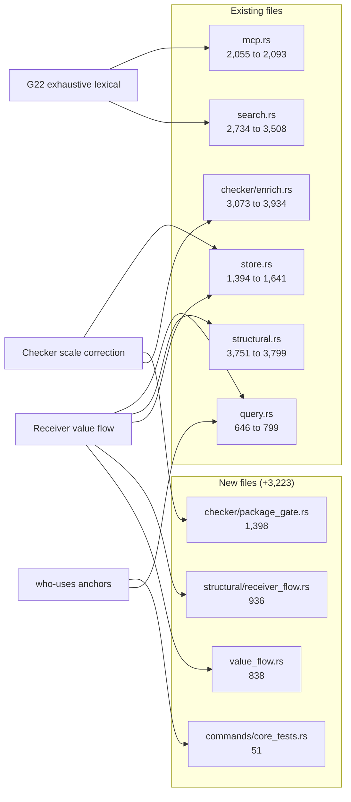
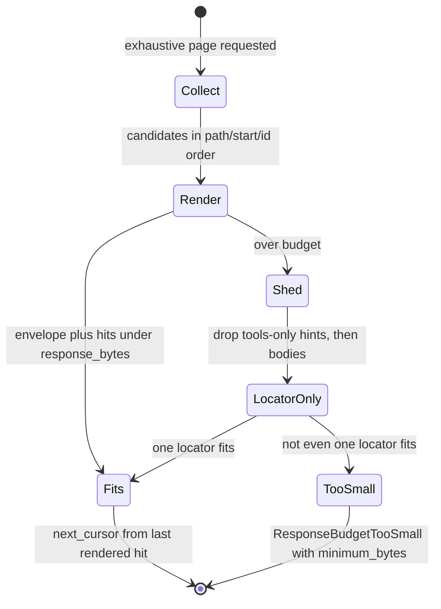

# What changed since the 2026-08-22 analysis

The previous document set describes commit `854bff1`. Forty-eight commits and thirteen merged pull requests later, `src/` has grown by roughly 9,500 lines across four new modules, the schema has moved three versions, the checker protocol has moved two, and lexical search has acquired a second, non-ranked mode that pages through every matching chunk instead of returning a top-k. Nearly all of that growth is concentrated in two campaigns: a scale correction to the TypeScript checker that turned per-file synthetic Programs into grouped inferred scopes with a per-package admission gate, and a new exhaustive search contract built because a top-10 ranked search reported a comparison as complete after missing an occurrence `rg` could find. What moved is separated from what did not, and a per-document table at the end names exactly which claims in the prior set are now false.

## Headline figures

| Metric | `854bff1` (2026-08-21) | `4de5622` (2026-08-24) |
|---|---|---|
| Rust files under `src/` | 78 | 82 |
| Rust LOC under `src/` | 70,445 | 79,963 |
| Rust tests | 409 | 474 |
| Node checker sidecar tests | 21 | 36 |
| `src/main.rs` lines / module declarations | 79 / 39 | 80 / 40 (38 production, 2 test) |
| `store::SCHEMA_VERSION` (`src/store.rs:8`) | `"26"` | `"29"` |
| `entity::EXTRACTION_VERSION` (`src/entity.rs:14`) | `"5"` | `"7"` |
| `structural::PROJECTION_VERSION` (`src/structural.rs:13`) | `"11"` | `"12"` |
| `checker::protocol::PROTOCOL_VERSION` (`src/checker/protocol.rs:3`) | 2 | 4 |
| `llm::protocol::PROTOCOL_VERSION` | 1 | 1 |
| Regular tables in `init_schema` | 37 | 43 |
| Tables dropped on legacy disposable rebuild | 29 | 35 |
| MCP tools | 12 | 12 |
| Crate version | 0.4.0 | 0.4.0 |
| `PLAN.md` lines | 2,823 | 3,293 |

The `git diff --stat` over `src/` is 28 files changed, 9,925 insertions, 407 deletions. That ratio — twenty-four insertions per deletion — is the shape of the range: almost nothing was rewritten, and four modules were added whole.

The diagram below attributes the growth. Look at which existing files absorbed line counts versus which files are new: the checker and search halves grew independently, and the value-flow work arrived as two fresh modules rather than as edits to `structural.rs`.

`SEARCH` and `ENRICH` are the two largest movers and they do not touch each other; `STORE` grew from both `FLOW` (six new tables) and `CHK` (the `'partial'` status). `QUERY` is the only file both `FLOW` and `CLI` edited — `resolve_export_exact` (`src/query.rs:151`) exists for the flow projection, `unique_anchor_for_symbol_target` (`src/query.rs:364`) for the CLI.

## New modules

Full accounts: the two value-flow modules in [04-value-flow.md](04-value-flow.md), the package gate in [10-sidecars.md](10-sidecars.md).

**`src/value_flow.rs` (838 lines)** is the extraction half of bounded receiver value flow: a pure oxc `Semantic` pass recording closed lexical shapes only — `this`, a direct or const-bound `new`, imported and exported const bindings, and synchronous factories whose every return path yields another supported value or factory call. Its header says outright that it is not a type inferrer. It emits `ValueFlows { receivers, functions, bindings, classes }` with `FlowValue.kind` in `{construct, factory, binding}`; awaited values are excluded because thenable assimilation can change runtime identity, and classes or methods with runtime decorators or mutated members are recorded as blockers rather than resolved. It exists to answer the construction-site subset of `obj.method()` in Rust, deterministically, and drop those occurrences from the checker plan.

**`src/structural/receiver_flow.rs` (936 lines)** is the projection half. It loads the six persisted flow tables into a `ValueFlowCatalog`, then walks bindings to classes to factories to receivers to methods through the module/export graph, minting `resolved_edges` with provenance `receiver-value-flow` at confidence `likely` (`src/structural/receiver_flow.rs:927`). It uses `resolve_export_exact` — no heuristic module edges, no arbitrary `export *` branch — because the result suppresses a later checker pass and so needs a closed binding, not the graph's best guess. A follow-up merged two full-AST scans and cached the exact-ref statement, cutting the isolated n8n projection from 906 ms to 380–385 ms with an unchanged target-set digest.

**`src/checker/package_gate.rs` (1,398 lines)** replaces a binary "inferred projects on/off" switch with per-package admission for files no `tsconfig` owns. A package whose production and unknown-role indexed sources are more than half unowned is JS-first and admits all of its unowned default-role sources; a TS-first package admits an unowned file only when the import graph reaches it over non-type module edges from a `main`, an `exports` condition, `bin`, or a `scripts` manifest target. It also owns freshness: `GatePlan::validate_fresh` (`src/checker/package_gate.rs:38`) rehashes every observed `package.json` and re-probes every absent-manifest boundary via `ABSENT_INPUT_HASH = "absent:v1"` (`src/checker/package_gate.rs:11`), because a newly created closer `package.json` changes both the package majority and scope membership. Drift retains staging and forces a retry instead of activating.

**`src/commands/core_tests.rs` (51 lines)** is the first direct `#[test]` coverage anywhere under `src/commands/`, which previously had none. It covers the new CLI `who-uses` anchor path.

## G22 — exhaustive lexical search

What follows is the shape of the change; the mechanism is [08-retrieval.md](08-retrieval.md).

`PLAN.md:3037` now reads `## Implemented G22 — exhaustive lexical search contract`. The recorded motivation is a production investigation on 2026-08-22 in which twelve `vector: false` searches at `limit: 10` missed a literal occurrence `rg` listed, and the comparison was reported as complete. The miss was truncation, not ranking, so the fix is a mode that never truncates silently.

`SearchMode::{Ranked, Exhaustive{cursor}}` (`src/search.rs:155`) is resolved after repository configuration, and `exhaustive: true` forces `vector`, `rerank`, `expand`, and `include_memory` off; only an explicitly supplied conflicting `true` is rejected. The response echoes an `effective` posture block and a `scope { corpus, file_roles, origins, snapshot }` (`src/search.rs:182`) alongside completeness fields `total_chunks`, `returned`, `truncated`, `next_cursor`. The CLI gains `--exhaustive` and `--cursor`, the latter declared `requires = "exhaustive"` at the clap level (`src/cli.rs:99-102`); MCP gains the same two arguments on `semantic_search` — no new tool. Ordering is deterministic and unranked (path, chunk start, chunk id), so no tie-breaker is needed.

Three properties took separate work. The cursor is row-id independent: `ExhaustiveCursorPosition { path, start, hash }` under prefix `jscout-exhaustive-v2` (`src/search.rs:1044`), bound to the snapshot plus a blake3 request fingerprint over query, normalized roles, and origins (`src/search.rs:1186`), so a snapshot change between pages fails the continuation rather than skipping or duplicating rows. `Hit.match_lines` (`src/search.rs:409`) carries the unique absolute lines inside a chunk where a query term matched — not multiplicity, not spans — and exhaustive hits skip the per-hit `used_by` resolution so a high-frequency identifier does not become thousands of lookups. `exhaustive_highlight_markers` (`src/search.rs:1079`) picks delimiters against the complete page text so source bytes cannot be mistaken for markers, and a chunk that cannot be highlighted is a hard error, not a silent empty list.

The budget interaction is the subtlest part. Read the diagram for the order of degradation: hints shed first, then locators become the whole hit, and only then does the request fail.

`Shed` never shortens a retained locator, and `LocatorOnly` sets `exhaustive_locator_only` (`src/search.rs:338`, `src/search.rs:2557-2559`). `TooSmall` is a typed `ResponseBudgetTooSmall` (`src/search.rs:215`) carrying an exact computed `minimum_bytes`, not an estimate. Crucially, `next_cursor` advances from the last hit actually rendered rather than from the pre-budget candidate count, and always differs from the input cursor — forward progress is guaranteed under any budget that admits a page at all. `MAX_EXHAUSTIVE_PAGE_SIZE = 200` (`src/search.rs:13`) and `resolve_search_limit` (`src/search.rs:22`) clamps a configured `search.limit` to that ceiling when no explicit limit is supplied; an explicit limit passes through and is rejected inside `search::search` instead (`src/search.rs:1623-1627`). Matching is scoped to the content column only, so the ranked-only `name`, `symbols`, and `path` columns cannot manufacture a hit with no source line.

## The checker campaign

Seven landings, all under `PLAN.md`'s "Required G10 scale correction", with an independent validation record at `docs/checker-stack-validation-2026-08-23.md` (ai-pipe and n8n, scratch databases, no billed calls).

| Change | Mechanism | Recorded effect |
|---|---|---|
| Closed candidate sets | Keep a fully mapped closed set of one to three declarations at `likely` instead of demanding a single target; record `candidateCount`. Batch reuse and watch carry are versioned so rows from the old rule cannot resume | More occurrences answered without loosening confidence semantics |
| Grouped inferred scopes | Per-file synthetic Programs replaced by scopes grouped on nearest `package.json` + compiler family + deterministic directory bins, capped at 150 roots; `checker_project_runs.status` gains `'partial'` (`src/store.rs:680`) so one bad root cannot fail its scope | ai-pipe: all 1,412 mapped fact payloads identical; 587 occurrences moved from `unknown` to `@types/node` declarations |
| Package gate | Per-package admission for unowned files; see above | ai-pipe `enrich --all`: 458 one-file Programs collapse to 12 projects |
| Family semantics | `checker/src/inferred-options.mjs` (27 lines): `node-esm` and `node-cjs` both use `NodeNext` module + resolution, so extension and nearest `type` supply CJS semantics without losing package `exports`/`imports`; `bundler-jsx` stays ESNext + Bundler. Normalized options enter inferred fingerprints only | Zero bidirectional logical-fact delta on ai-pipe's 116- and 1,382-edge planes and all 31 n8n inferred scopes |
| Receiver value flow | Six tables plus `idx_refs_file_start ON refs(file_id, start)` (`src/store.rs:389`); resolved occurrences hard-excluded from checker selection, including under `--all` | ai-pipe exhaustive plan 5,158 → 4,601 exactly; n8n 284,184 → 269,770 exactly |
| Overload grouping | Collapse overload signature declarations onto the implementation before counting targets, then extend the grouping to declaration-only overloads | A four-signature method no longer demotes to `possible` with `candidateCount 4` |
| Zero-fact reuse, no-op skip | A plan-scoped run producing zero facts on a snapshot with an active batch becomes a completed, inactive zero-fact batch that exact reuse can match, instead of exiting 1; a retained no-op then skips the projection rebuild | Removes a spurious failure on narrowed re-runs |

Protocol 2 → 4 follows from the gate: `PlanMembers`/`PlanMembersResult` are gone, replaced by a streaming session — `PlanMembersBegin{total_files, refresh_config}`, `PlanMembersAdd{files}`, `PlanMembersFinish`, `PlanMembersNext{cursor}`, answered by `PlanMembersReady`, `PlanMembersAddResult`, `PlanMembersPage{MemberPlanPage}` — and `ResolveMembers` now carries `project_files`. Upload and result boundaries cannot change ownership, scope IDs, membership fingerprints, or the 150-root cap. From the validation record: ai-pipe `enrich --all` 355.06 s → 29.30 s; occurrences with a `likely` member-call edge 108 → 694, none lost; n8n restricted enrichment 374.62 s → 62.36 s cold, 11.03 s on reuse; n8n index cost +3%.

Separately, `src/query.rs:516-522` adds a `NOT EXISTS` guard on the hub-candidate query keyed on `detail_json.$.memberCallId`: once an occurrence-specific edge closes a call at `certain` or `likely`, the generic hub candidates are suppressed instead of offering resolved sites as `possible` callers of other same-named symbols.

## Schema v26 → v29 and the other bumps

The full table inventory is [06-storage-schema.md](06-storage-schema.md). Three bumps, each a rebuild-based migration — there is still no ALTER ladder, and `DURABLE_SCHEMA_FLOOR` stays 16.

| Bump | Change | Why it needs a version |
|---|---|---|
| 26 → 27 | `checker_project_runs.status` CHECK widened to include `'partial'` | Grouped scopes need partial success |
| 27 → 28 | Six receiver-value-flow tables added; `idx_refs_file` widened to `idx_refs_file_start ON refs(file_id, start)` | New disposable tables and a changed index |
| 28 → 29 | No DDL change at all — the FTS mirror content changed, because `indexer::fts_content` (`src/indexer.rs:676`) now replaces embedded NUL bytes with a single space | FTS5 indexes past a NUL but `highlight()` can omit bytes between it and a later match, so a pre-sanitization mirror is unsafe for exhaustive match lines |

The v29 bump is the interesting one: a version exists purely so `open_path_read_only` refuses a v28 database and the writer rebuilds. Line offsets survive the substitution by construction, one byte for one byte. All three literals of the version — the constant, the migration `UPDATE`, and the `init_schema` seed — were kept in sync, which remains a manual invariant with no compile-time enforcement.

One more storage change landed at the tip commit: `store::open_path` now `create_dir_all`s the database's parent directory before opening, while `open_path_read_only` still refuses to create anything.

## Per-document staleness for `docs/codebase-analysis/`

Every citation in that set is stamped valid at `854bff1`. All line numbers into `search.rs`, `store.rs`, `checker/enrich.rs`, `structural.rs`, `query.rs`, `commands/core.rs`, and `mcp.rs` have drifted. The table names what is substantively wrong. Note that the numbering differs between sets — the current set inserts `04-value-flow.md`, shifting prior documents 04 through 13 up by one, and drops `14-evaluation.md`, so 15 onward keep their numbers.

| Prior doc | Status | What is now wrong |
|---|---|---|
| `README.md` | Stale scope line | Line 5: "78 Rust files and 70,445 lines (409 tests)" → 82 / 79,963 / 474. The `854bff1` anchor and "as of 2026-08-21" are superseded. Crate version 0.4.0 still holds. |
| `01-system-overview.md` | Stale figures | Line 9: "`src/main.rs` is 79 lines: 39 module declarations (37 production…)" → 80 / 40 / 38. Line 81: "37 regular tables … of which 29 are dropped" → 43 and 35; `SCHEMA_VERSION` `"26"` → `"29"`. The tiered-query narrative omits exhaustive mode entirely. |
| `02-ingestion.md` | Incomplete | `extract_file`/`insert_file` now also extract and persist six value-flow tables, and the FTS mirror is no longer verbatim chunk content. Discovery, chunking, and workspace resolution are unchanged and still correct. |
| `03-structural-extraction.md` | Wrong stamps, missing a stage | Line 3: `EXTRACTION_VERSION` `"5"` → `"7"`, `PROJECTION_VERSION` `"11"` → `"12"`. The projection now has a fourth stage, `receiver_flow::project_receiver_value_flows`, minting `receiver-value-flow` at `likely` — a provenance/confidence pair absent from the doc's edge inventory. `src/value_flow.rs` is not mentioned. |
| `04-call-graph-and-surface.md` | Two claims falsified | Line 136: "The CLI `jscout who-uses` only ever takes the name path" is false — it now resolves each target to a unique anchor and routes to `who_uses_anchor_in_origins`, falling back to the name path only on ambiguity. Line 148: "`jscout who-uses run` returns every `.run()` in the allowed origins as `possible`" is now conditional on no occurrence-specific edge having closed the site. The mechanism list omits `resolve_export_exact`. |
| `05-storage-schema.md` | Most invalidated on facts | Lines 3, 7, 11: `SCHEMA_VERSION = "26"` → `"29"`; "37 regular tables" → 43; "`src/store.rs` (1394 lines…)" → 1,641. The index-change list stops before `idx_refs_file` → `idx_refs_file_start` and the six flow tables. The line-11 framing "without … writing a byte" no longer covers `open_path`, which creates the parent directory first. The v6 fixture refusal note is still true. |
| `06-semantic-layer.md` | Current | `src/embed.rs`, `src/semantic*.rs`, `src/inference.rs` are untouched. Indirect drift only: the schema stamp, and the fact that exhaustive mode forces the vector leg off. |
| `07-retrieval.md` | Structurally incomplete | Line 3: "`src/search.rs` (2,734 lines)" → 3,508, and every entry-point line number moved. The entire exhaustive mode is missing: `SearchMode`, `MAX_EXHAUSTIVE_PAGE_SIZE`, `resolve_search_limit`, the scope/posture echo, `total_chunks`/`returned`/`truncated`/`next_cursor`, `Hit.match_lines`, the `jscout-exhaustive-v2` cursor, and the locator-only → `ResponseBudgetTooSmall` degradation. The "three ordered tiers" framing needs a fourth, unranked mode. |
| `08-scouting.md` | Current | Nothing under `src/scouting/` changed. |
| `09-sidecars.md` | Wrong protocol and message set | Line 7 and the sequence diagram at line 59: "protocol 2" → 4. `PlanMembers`/`PlanMembersResult` no longer exist. `ResolveMembers` gained `project_files`. New module `checker/src/inferred-options.mjs`. The gateway half (protocol 1) is unchanged and correct. |
| `10-cli-and-commands.md` | Two rows stale | The `search` row omits `--exhaustive` and `--cursor`. The `who-uses ROOT SPEC` row at line 90 and the analysis around lines 150–154 still describe pure name matching. The `exit(1)` on no match is still real. The no-`--database` observation still holds but now interacts with parent-directory creation. |
| `11-mcp-surface.md` | One figure, one schema | Line 3: "2,055 lines, with 23 tests" → 2,093 / 24. Twelve tools is still correct. The `semantic_search` schema now documents `exhaustive` and `cursor`, and the tool description was rewritten around exhaustive mode. |
| `12-configuration.md` | Current | `src/config/` untouched; the dotted keys, `deny_unknown_fields`, and provenance mechanism all hold. Amendment: a configured `database.path` whose parent does not exist now succeeds on the writer path. |
| `13-incremental-and-watch.md` | Mechanism correct, checker phase stale | The generation coordinator, hash reuse, and the 50% reset heuristic are unchanged. Watch carry is now versioned against the closed-candidate rule; watch uses the same per-package admission as manual enrichment; re-check is per grouped inferred scope. `EXTRACTION_VERSION` moved twice in this range, so both stated hash-blanking events fired. |
| `14-evaluation.md` | Current | `eval/` and `scripts/eval-*.mjs` untouched. |
| `15-build-config-ci.md` | Every test figure wrong | Lines 161, 168, 174, 189, 200: 409 → 474; "78 `.rs` files totaling 70,445 lines" → 82 / 79,963; the "Total test code" row is stale in all three columns. The sibling-file convention at line 161 still holds and gained members. Dependency count, clippy policy, CI jobs, and npm channel unchanged. |
| `16-cross-cutting.md` | One literal | Line 131: `SCHEMA_VERSION = "26"` → `"29"`, and every `src/store.rs` citation shifted. The savepoint inventory and eight call sites are unchanged in substance. Threading, signals, telemetry, and error conventions hold. |
| `17-end-to-end-traces.md` | Trace 1 incomplete | Line 26: "connection at schema v26" → v29. The cold-index trace omits value-flow extraction and FTS NUL sanitization; the projection step omits `project_receiver_value_flows`. There is no trace for an exhaustive paged search. |
| `18-history-and-roadmap.md` | Counts and ladder stale | Line 3: "452 commits across 71 merged pull requests" → 500 / 84; "2,823-line `PLAN.md`" → 3,293; "G1 through G21" → G1 through G23. It cannot mention G22 (now implemented), G23 (planned), or G24 (proposed and dropped two commits later). |
| `19-sharp-edges.md` | Pinned to `854bff1`; three items moved | The doc states it is a property of `854bff1` — treat it as dated. Line 115's census is stale: 409 tests over 78 files; "`src/commands/` … contain zero `#[test]`" is now false. Line 57's `who-uses get` claim is narrowed. Line 36's "byte budgets fail closed everywhere" needs refinement — exhaustive mode degrades to locator-only first, and its failure is typed with `minimum_bytes`. Line 79's triple-literal drift hazard is still real, now with `'29'`. |
| `20-delta-since-2026-08-17.md` | Superseded, not wrong | A historical delta from `a102597` to `854bff1`, accurate as such. Its "57,769 → 70,445" row is now the middle of a three-step series ending at 79,963, and its staleness table describes the 2026-08-17 set. |

One documentation lag is worth flagging beyond the prior set: the last `PLAN.md` commit touching the checker validation findings predates three of the fixes in this range, so bounded-correctness items 2 (CLI `who-uses`), 3 (overload signatures), and 5 (zero-fact narrowed runs) are still written in the plan as open findings with "Fix: … Small PR" while all three are implemented. Items 1 (argument-to-parameter flow probe), 4 (multi-owner deduplication), 6 (bounded sidecar pool), and 7 (TypeScript backend) remain genuinely open.
