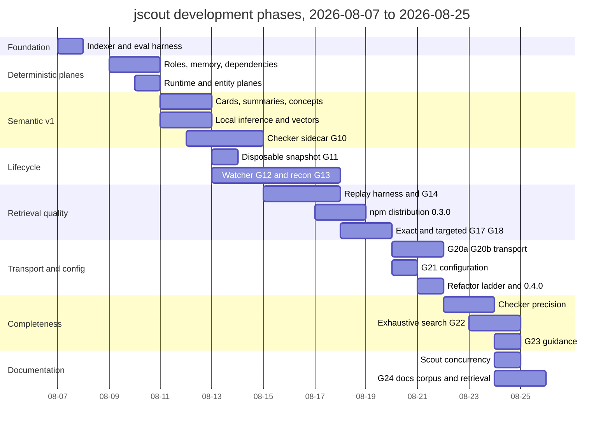
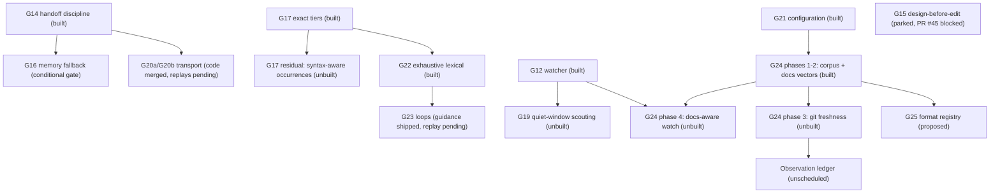

# Development history and roadmap

jscout's entire history is nineteen calendar days: 527 commits from `Initial js-rag implementation` on 2026-08-07 to `823b836` on 2026-08-25, all authored by one person, with pull requests numbered through #105. The development method is unusual enough to be worth stating mechanically: a single normative document, `PLAN.md` (3,520 lines), holds every design contract; work is organized into numbered gates G1–G25, each of which is a section in that file carrying a status word in its own heading, a contract, and an explicit acceptance clause; evidence for the decisions sits under `eval/` as dated, never-rewritten result files. The consequence — visible at this commit — is that the roadmap's status is a hand-maintained string in a Markdown heading, and it drifts. G24's heading still reads "Proposed" while two of its four delivery phases are compiled into the binary. This document reconstructs the timeline from the commit log, describes how a gate actually works, audits each gate heading against the source tree, and records the directions that were dropped rather than deferred.

## Timeline by phase

Commit dates cluster into nine working phases. Counts are commits per day from `git log --format=%ad --date=short`; 2026-08-08 has none.

| Dates | Commits | What landed |
|---|---|---|
| 08-07 | 14 | Initial indexer, rename to jscout, snapshot-safe structural neighborhoods, first agent-evaluation harness |
| 08-09 – 08-10 | 83 | File-role classification, evidence-backed workflow memory (G1–G5), module resolution hardening, dependency indexing (#2), runtime/contract/entity planes |
| 08-11 – 08-12 | 68 | Symbol cards (G6), hierarchical summaries (G7), concepts (G8), semantic retrieval and gateway operations (G9), local BGE inference plus sqlite-vec, checker sidecar (G10) begun |
| 08-13 – 08-14 | 64 | Disposable-snapshot rewrite (G11) removing cross-snapshot freshness machinery, checker enrichment redesigned for scale, watcher coordinator specified (G12), reconnaissance scout (G13), compact transport, dual MIT/Apache licensing |
| 08-15 – 08-17 | 82 | PR-replay evaluation harness, semantic-memory retrieval, watcher coordinator shipped (#38) plus incremental refresh G12.1 (#47), retrieval handoff discipline G14 (#44), npm distribution as `@jscout/cli` (#48), G15 parked |
| 08-18 – 08-19 | 31 | Exact-identifier dominance (G17) and task-directed semantic selection (G18) in #50, v0.3.0, watcher recovery semantics |
| 08-20 – 08-21 | 111 | Compact transport G20a (#60), path transport G20b (#62), repository runtime configuration G21 (#59), module-split refactor ladder, clippy lint ratchet, filesystem test seams, performance indexes, v0.4.0 (#64) |
| 08-22 – 08-23 | 37 | Checker precision work (closed candidate sets, grouped scopes, package gate, family semantics, receiver value flow), exhaustive lexical search G22 (#91–#93) |
| 08-24 – 08-25 | 37 | G23 skill/MCP guidance, configurable scout model concurrency (#97), watch rejection dedup (#98), G24 documentation corpus and retrieval (#104, #102, #105) |

The shape to notice below: two long build ramps (08-09→08-14 and 08-15→08-21) separated by an evaluation-heavy middle, and a final compressed burst in which an entire subsystem — `src/docs/` at 5,495 lines across four modules — landed in two days.

## How a gate works

A gate is a section of `PLAN.md`, not a tracker issue. Its heading carries the status (`Implemented G17`, `Parked G15`, `Conditional G16`, `Planned G19`, `In progress G20b`, `Proposed G24`), the body states the failure that motivates it — almost always a measured one, citing a file under `eval/` — then a numbered contract, then an `Acceptance:` clause naming the replay or fixture that would close it. `PLAN.md:31` declares this the only normative architecture document and forbids competing plans; superseded designs are expected to live in Git history rather than in the tree. Two exceptions exist as incorporated-by-reference implementation contracts under `docs/plans/`: the G24 proposal and the one-store ADR, with `PLAN.md` winning on explicit disagreement (`PLAN.md:3361`).

Motivation is empirical rather than aspirational. G22 exists because one production investigation ran twelve `vector: false` searches at `limit: 10`, missed an occurrence `rg` listed, and reported the comparison as complete (`PLAN.md:3044`). G17 exists because root-layout searches ranked partial example chunks above exact identifiers. G18 exists because 448 card calls missed the relevant type-generation surface. The `Evaluation decisions already made` table at `PLAN.md:3403` compresses each finding into the design consequence it forces, which is what survives after the raw evidence stops being read.

Implementation follows the same rhythm each time: `docs(plan):` commits shape the contract, sometimes over several days and several reversals, then `feat`/`fix` commits land on a branch (`codex/<topic>` for delegated work, `feat/…` or `rust/…` otherwise), then a merge commit. G24's contract alone took nine `docs(plan):` commits between 08-24 and 08-25 before any code merged.

The weak link is that the status word is edited by hand, in a separate commit from the code. Nothing in the build checks it.

## Gate status audited against the tree

| Gate | Heading in `PLAN.md` | Verified at `823b836` |
|---|---|---|
| G1–G5 workflow scouting | `Implemented` (:362) | Built |
| G6 symbol cards | `Implemented` (:388) | Built |
| G7 hierarchical summaries | `Implemented` (:417) | Built |
| G8 concepts | `Implemented` (:468) | Built |
| G9 semantic retrieval/ops | `Implemented` (:525) | Built |
| G10 checker sidecar | `Implemented post-v1` (:608) | Built |
| G11 fixed-snapshot simplification | no status word (:1404) | Built; cross-snapshot freshness machinery removed 08-13 |
| G12 watcher coordinator | no status word (:1454) | Built (#38), plus G12.1 incremental refresh (#47) |
| G13 reconnaissance scout | `Implemented` (:1820) | Built; the generated-output boundary extension (:1947) is not |
| G14 retrieval handoff | `Implemented` (:2020) | Built |
| G15 design-before-edit memory | `Parked` (:2166) | Not built, deliberately: PR #45 blocked, two-phase arms cost more and passed less often (`PLAN.md:2168`) |
| G16 attached-memory fallback | `Conditional` (:2334) | Not built; a decision gate with entry criteria (:2353), not a milestone |
| G17 exact-identifier dominance | `Implemented` (:2413) | Built; the syntax-aware occurrence residual (:2442) is not |
| G18 task-directed selection | `Implemented` (:2505) | Built; the overlap/consolidation follow-up (:2534) is not |
| G19 quiet-window watch scouting | `Planned` (:2573) | Not built; no `--scout` flag ships until the six named fixtures exist |
| G20b path transport | `In progress` (:2603) | Code merged in #62; open work is the structured-content compatibility experiment and the fixed/staged replays (:2902) |
| G21 runtime configuration | `Implemented` (:2987) | Built; `.jscout.toml` loaded once per process |
| G22 exhaustive lexical search | `Implemented` (:3042) | Built (#91–#93) |
| G23 investigation/inquiry loops | `guidance implemented, acceptance replay pending` (:3138) | Skill and both MCP instruction strings updated; the links-iteration replay that would close it has not run |
| G24 documentation retrieval | `Proposed` (:3184) | **Stale.** Phases 1 and 2 built; 3 and 4 not |
| G25 multi-format admission | `Proposed` (:3364) | Genuinely unbuilt |

Two headings (G11, G12) carry no status word at all, which is why the convention cannot be parsed mechanically even in principle.

## The stale G24 heading

`git log -S'## Proposed G24 — repository documentation retrieval' -- PLAN.md` returns exactly one commit: `e6891c5`, `docs(plan): add proposed G24 and revise markdown retrieval plan`, dated 2026-08-24. No later commit touched that string. The implementation merged the next day in `c07eaa1` (#104, `codex/g24-docs-indexing`), `23af695` (#102, `g24-snapshot-log`), and `823b836` (#105, `g24-unified-storage`), and the heading was never revisited.

What phases 1 and 2 delivered is checkable. `src/docs/corpus.rs` (2,708 lines), `src/docs/retrieval.rs` (2,299), `src/docs/store.rs` (470), and `src/commands/docs.rs` (214) exist. `src/store.rs` creates `docs_fts`, `doc_chunk_meta`, `doc_inventory`, `doc_embedding_index_entries`, `doc_vector_generations`, and the dimension-named `vec_doc_embeddings_N` family (`src/store.rs:42`, `:225`, `:368`). `SCHEMA_VERSION` is `"31"` (`src/store.rs:8`), three versions past what the plan's own baseline table still records. The ownership inversion is the sharpest evidence that this is not a proposal: `walk::repository_inventory` no longer walks — it calls `crate::docs::corpus::scan_repository` and unpacks the result into code files and documents (`src/walk.rs:169`). The documentation module now owns the single deterministic traversal that produces the code plane's file list.

What phases 3 and 4 did not deliver is equally checkable. Grepping `src/` for `max_rank_movement`, `doc_block_state`, `no_freshness`, and `line-porcelain` returns nothing: the bounded order-based freshness reorder and the git-blame provenance basis are contract text only. `snapshot_log` — the durable ordered snapshot clock that two `docs(plan):` commits on 08-25 adopted specifically to give the observation ledger a baseline — likewise appears nowhere in `src/`, despite the branch name `g24-snapshot-log`. Phase 4, documentation-aware watch classification, is absent in a way that is user-visible: `src/watch.rs:521` still admits filesystem events through `walk::is_indexable`, which accepts only JS/TS extensions, so editing a `.md` file alone triggers no watch generation. Documentation is reindexed only when a code change happens to trigger one.

## What is planned and unbuilt

Beyond G24's remaining phases, the unbuilt set is: G19 quiet-window scouting inside watch, blocked on stale-delta scoping design and six named fixtures (`PLAN.md:2573`); the G17 residual that would order exact occurrences by syntactic role so an import specifier cannot consume the reserved slot ahead of a call site (`PLAN.md:2442`); the G13 generated-output boundary overlay (`PLAN.md:1947`); G16, which is not a milestone but a decision gate on whether G14's evidence-connection boundary hides useful artifacts (`PLAN.md:2334`); and G25, a per-format registry deciding both comprehension tier and corpus membership. G25 is honest about its own value — the registry "gives a new format a defined place to plug in… and that is all it buys" (`PLAN.md:3372`); each format still needs its own scanner and chunking contract, and any format joining the *code* corpus additionally pays exact-tier and BM25 integration that the docs corpus deliberately avoided. Its stated north star is a cross-file string-reference plane: environment variables read but never declared, Helm values naming missing services.

Read the diagram by the leaf nodes: everything unbuilt hangs off something built, and the two nodes with no path to a built parent — `G15` and `LEDGER` — are the two that were removed from the schedule rather than merely queued.

## Superseded directions

The plan discards work as readily as it adds it, and several discards are load-bearing.

The G24 number was used twice. `d0cebdd` on 08-23, `docs(plan): drop G24; the vector-path latency is the external embedding call`, killed a gate about vector latency the day after `369ffc3` introduced it; `e6891c5` on 08-24 reassigned the identifier to documentation retrieval. Gate numbers are therefore not stable references across the history.

G24's own architecture was reversed mid-design. The review rounds on PR #96 established that the shared database cannot host a second lifecycle behind one global schema version, and that a multiplicative score decay is unbounded once applied to rank-fusion scores (`PLAN.md:3192`). Both a second database and a decay multiplier were rejected; the resolution — one lifecycle, a separate ranking corpus, and an order-based reorder capped at `max_rank_movement` — is recorded in `docs/plans/g24-adr-one-store-separate-ranking-2026-08-25.md`. The separate `vec_doc_embeddings_N` tables exist for one concrete reason: sqlite-vec applies KNN's `k` before any join filter, so docs and code vectors sharing a table would let one corpus starve the other.

G11 deleted cross-snapshot freshness machinery on 08-13 (`refactor(snapshot): remove cross-snapshot freshness machinery`) in favour of a disposable snapshot rebuilt whole, and `fix(store): reject legacy v15 durable schema` in the same batch refused to migrate the old shape. G15 is the largest reversal: a full design for design-before-edit task memory sits at `PLAN.md:2195` behind an explicit decision amendment not to ship it, because two-phase arms cost more, passed less often, and twice preserved a coherent but wrong output contract through implementation. It is retained as text, with PR #45 blocked, only to be reconsidered if repeated tasks show otherwise. The standing `Deferred or out of scope` list (`PLAN.md:3475`) names sixteen more: runtime traces, learned traversal policy, LLM-generated pseudocode as source truth, one model call per chunk, embedding clusters presented as concepts, hidden model spending during index or watch, autonomous agents inside the gateway, Yarn PnP archive indexing, and — pointedly — checker-backed enrichment beyond occurrence-scoped receiver resolution, with the instruction to use an LSP instead.

## Releases

Two tags exist: `v0.3.0` (08-18, #52) and `v0.4.0` (08-21, #64). npm distribution as `@jscout/cli` landed on 08-17 in #48, followed the same day by a first-publish bootstrap script and a pin of the publish job's npm to 11.19.0. Version 0.4.0 arrived alongside the refactor ladder — CLI and configuration module splits, `#[expect]` over `#[allow]`, a clippy ratchet asserting only lints the tree already passes — which is why 08-20 and 08-21 are the two densest days in the history at 59 and 52 commits and why `src/main.rs` is 81 lines of module declarations rather than a program.
