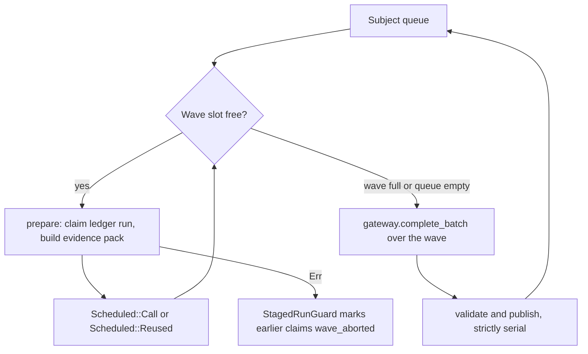
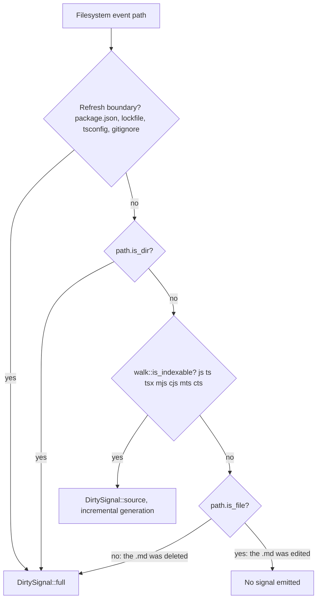

# Sharp edges, complexity hotspots, and risks

This document collects the places in jscout at `823b836` where the code costs more than it looks, where a contract holds by convention rather than by construction, and where a plausible reading of the source is wrong. It is organized by theme rather than by module: mass and where it accumulated; the concurrency paths that exist but are off by default; the asymmetries the documentation plane introduced; the corpus-isolation guarantees and which of them are actually enforced; heuristics that read as guarantees; duplicated constants; dead code; the test and release gaps; and a closing set of plausible claims that turn out not to hold. Every entry names what it is, where it lives, what breaks if it goes wrong, and roughly what fixing it would cost. Nothing here is a bug report — most of these are deliberate tradeoffs with one side of the tradeoff unwritten.

## Where the mass is

91,174 lines across 87 `.rs` files, of which roughly a third is test code living in sibling `tests.rs` modules. Ten files hold about 30,000 lines between them.

| File | Lines | Tests | Why it is large |
|---|---|---|---|
| `src/checker/enrich.rs` | 3,934 | `enrich/tests.rs` 3,638 | Staging batches, project restart, activation transaction |
| `src/scouting/mod.rs` | 3,903 | `scouting/tests.rs` 3,428 | Five scout families, each with prepare/wave/publish |
| `src/structural.rs` | 3,835 | `structural/tests.rs` 2,465 | Seven projection stages plus key minting |
| `src/search.rs` | 3,531 | `search/tests.rs` 2,178 | Hybrid ranking, exact tiers, exhaustive paging, byte budget |
| `src/docs/corpus.rs` | 2,708 | 27 inline (from `:1893`) | One traversal for two planes, plus the whole Markdown parser |
| `src/scouting/repository.rs` | 2,448 | inline | Recon subject subdivision and its own wave loop |
| `src/docs/retrieval.rs` | 2,299 | 14 inline (from `:1311`) | BM25 + vector + RRF + rerank + source hydration |
| `src/mcp.rs` | 2,241 | `mcp/tests.rs` 1,993 | 13 tool schemas, two profiles, two transports |
| `src/store.rs` | 2,171 | 19 inline (from `:1347`) | 47 tables, 2 FTS5, 2 views, 4 triggers, 57 indexes |
| `src/semantic.rs` | 2,043 | `semantic/tests.rs` 961 | Artifact validation, lineage, ranking |

`src/docs/corpus.rs` and `src/docs/retrieval.rs` are the new entrants — together with `docs/store.rs` and `docs/mod.rs` they add 5,495 lines, and `src/commands/docs.rs` another 214. Two things about that mass are worth naming. First, `corpus.rs` is not only a scanner: it owns the repository traversal for *both* planes (`walk::repository_inventory` at `src/walk.rs:169` is a 20-line adapter over `docs::corpus::scan_repository`), the Markdown/MDX block parser, the chunk-budget splitter, and the glob validation the config loader calls at load time. Anyone looking for the code-vs-docs descent policy will look in `walk.rs` and not find it. Second, the docs subsystem's tests are inline rather than in a sibling `tests.rs`, so the production/test ratio there (`corpus.rs` ≈ 1,890 production lines to 816 test lines) is visibly thinner than the convention elsewhere in the tree.

## Concurrency: the configured default is the exercised path

`llm.max_concurrency` defaults to 1 (`src/llm/config.rs:199`), is rejected at zero (`with_max_concurrency`, `src/llm/config.rs:203`), has no upper clamp, and has no environment override. It reaches scouting through six `with_max_concurrency` calls in `src/commands/mod.rs` (`:800, :850, :905, :944, :988, :1011`) and is then floored and capped in `launch_scout_gateway` (`src/commands/scout.rs:9-23`) as `max_concurrency.min(call_capacity.max(1))`. The consequence: on every default install, `N = 1`, and the wave machinery runs in a shape indistinguishable from the old straight-line loop. The genuinely concurrent path — overlapping model calls, `DispatchAdmission`, multi-worker cancellation routing — is the one nobody exercises unless they opt in.

Read the `PREP` to `ABORT` edge first: a preparation failure anywhere in a wave — concept lineage drift, an in-flight claim conflict — propagates with `?` and unwinds the *whole* wave, marking already-claimed runs `wave_aborted` rather than failing one subject. That is correct but batch-scoped, and it gets sharper as `max_concurrency` rises. Then read `SLOT`: the counter differs by family. Every family in `src/scouting/mod.rs` bounds on claimed model calls (`calls_in_wave`), while `repository::execute` bounds on total scheduled items (`src/scouting/repository.rs:1080`), so reused runs and over-budget subjects consume repository wave slots and effective concurrency there is lower than configured.

The pool itself is process-level, not protocol-level. Each gateway child still serves exactly one `complete` at a time and answers a second with `busy` (`gateway/src/server.mjs:143`); there is no id demultiplexing on the wire. `ProcessGatewayPool` gets parallelism only by spawning more node processes, and only through `complete_batch` — `capabilities` and `complete` hard-delegate to `self.workers[0]` (`src/llm/process.rs:588-601`), so preparation's capability and billing-path lookups all serialize on worker 0. `complete_batch` chunks tasks by `workers.len()` and joins each chunk before starting the next, so one slow request stalls its chunk; there is no work stealing. If `DispatchAdmission::capture()` fails, *every* task in the batch returns the same `GatewayError::Io` (`src/llm/process.rs:605-615`) — a mass-failure path with a single non-obvious cause.

Cancellation state is process-global: `INTERRUPT_CONTROL`, `INTERRUPT_PENDING`, and `INTERRUPT_GENERATION` are statics (`src/llm/process.rs:30-33`), and `register_interrupt_controls` replaces the previous registration wholesale. Dropping any one pool worker calls `unregister_interrupt_control` (`:196`), which nulls the registration for the entire group, so surviving workers lose Ctrl-C coverage. A `ProcessGateway::launch` on the `llm doctor` path evicts a live pool registration the same way. Tests avoid the interference by serializing on a private `INTERRUPT_TEST_LOCK` (`src/llm/process.rs:825`); a new interrupt test that forgets it will flake. Fixing this properly means making the control a scoped value rather than a static — a moderate refactor touching every gateway construction site.

One more asymmetry the LLM-side design does not advertise: the checker's Ctrl-C handler *does* write child stdin from the signal thread (`CheckerControl::cancel_active`, `src/checker/process.rs:200-212`), which is exactly the thing the gateway side was reworked to avoid.

## The documentation plane's asymmetries

A `.md` edit does not start a watch generation. `EventClassifier::classify` routes source events through `walk::is_indexable`, whose `EXTENSIONS` list is JS/TS only (`src/walk.rs:9`), and the fall-through branch escalates only when `!path.is_file()` (`src/watch.rs:534`). The comment above it names "README edits" as ordinary repository noise.

Follow `IDX` to `EXIST` to `NONE`: editing or creating a Markdown file produces nothing at all, and the corpus goes stale until an unrelated code change or the 600-second reconcile starts a generation. Follow `EXIST` to `FULL` for the inverse: *deleting* a doc makes `is_file()` false and forces the most expensive scope, a full refresh. Creates and edits are silent; deletes are maximally loud. This is G24 phase 4, planned and unbuilt; the fix is small in code (one extension predicate in the classifier) but needs the scope decision — an incremental docs scope does not currently exist.

Incremental scope saves nothing on the Markdown side anyway. `scan_repository` reads and fully parses every admitted document on every refresh; the `unchanged` short-circuit at `src/indexer.rs:576` only skips the database write. Peak memory therefore holds the whole documentation corpus (up to 4 MiB per file) for the run, and that cap is a `CorpusOptions` field the indexer never overrides (`..CorpusOptions::default()`, `src/indexer.rs:388-390`, `DEFAULT_MAX_FILE_BYTES` at `src/docs/corpus.rs:17`) — so there is no `[docs]` key for it even though include/exclude are configurable.

The two planes also fail differently. A code read error becomes an `IndexRejection` surfaced by `report_rejections`; a document read error becomes a `doc_inventory` decision row (`src/docs/corpus.rs:598-603`) visible only through `jscout docs status`, so `outcome.rejected` undercounts documentation problems. Worse in the other direction: `insert_documentation_file` has no rejection path at all — every `ensure!` in it (`src/indexer.rs:914-932` and following) propagates out of the preparation closure and rolls back the entire index. One malformed captured document aborts the whole run. So does one stray FIFO or socket named `*.md` inside an active docs subtree, via `ensure_regular_inventory_file` (`src/docs/corpus.rs:610`); the same special file with any other extension is silently skipped.

Finally, `IndexOutcome`'s counters are corpus-blind. `indexed`/`unchanged`/`removed`/`chunks` mix code and docs, so `jscout index`'s summary cannot tell a user that Markdown admission moved their numbers.

## Isolation held by three different mechanisms

"Documentation never enters code retrieval" is true, but it rests on three unequal footings, and only one of them is a constraint.

Enforced by schema: `doc_chunk_meta` cannot reference a non-docs file, and a file with such rows cannot leave the docs corpus — four SQL triggers `RAISE(ABORT)` on insert, chunk-id update, `files.corpus` update, and `chunks.file_id` update (`src/store.rs:382-424`).

Enforced by view: `exact_definition_chunks` (`src/search.rs:598-599, :640-641`), `file_outline` (`src/mcp.rs:1336`), the structural projection's `load_files` (`src/structural.rs:688`), `ModuleGraph::load` (`src/query.rs:97`), the checker inventory (`src/checker/package_gate.rs:12`), and the code embedding queries all read `code_files`/`code_chunks`, which filter `corpus='code'`.

Enforced only by the insert side: `bm25_ranking`, `exhaustive_hits`, `exact_occurrence_chunks`, `load_hit`, and `definition`'s source fetch (`src/mcp.rs:1253-1254`) all join bare `chunks`/`files`. Their docs exclusion holds because docs chunks are routed to `docs_fts` and never to `chunks_fts`, and because docs files never acquire `refs`, `events`, `member_calls`, or `symbols` rows. Any future writer that mirrors docs into `chunks_fts` opens the code path silently, and nothing would catch it. Note also that `docs_fts` and `chunks_fts` share the `chunks.id` rowid namespace, so a cross-plane write would collide rather than error.

There is one place documentation genuinely reaches into the code plane, and it is not the retrieval surface: a documentation-only edit changes the snapshot digest, because `compute_snapshot_with_resolution` hashes every `files` row with no corpus filter plus the documentation parser contract (`src/structural.rs:450-473`). That forces a full projection rebuild and, since `project_checker_enrichments` requires a matching `batch.source_snapshot`, drops every checker edge until a new batch is built.

## Heuristics that read as guarantees

The extraction-reset heuristic is corpus-coupled by accident. `cleared` counts only `corpus='code'` files with a blanked hash, but the threshold is `cleared * 2 >= existing.len()` where `existing` holds *both* corpora (`src/indexer.rs:476-481`). In a repository where docs exceed about a third of the file count, an extractor-version bump that blanks every code hash can fail the 50% test and fall back to per-file replacement — precisely the pathological path the reset exists to avoid. This is the one place docs admission changes code-path behavior. A one-line denominator fix.

`vector_search` on the docs side asks sqlite-vec for `k` equal to the full embeddable occurrence count and then `ensure!`s it got exactly `k` rows (`src/docs/retrieval.rs:1097-1102`). A single missing vec0 row is not a partial result — it is an error that `search_inner` converts to `vector_status=degraded`, disabling docs vector retrieval entirely. Above `SQLITE_VEC_MAX_K` (4,096) the code switches to `full_distance_vector_search`, a `vec_distance_cosine` over every cached vector on every query: correct, deterministic, and linear in corpus size.

Type erasure in `src/chunk.rs` is per-oxc-variant and the variant set has moved underneath it. `declare global { ... }` is `TSGlobalDeclaration`, not `TSModuleDeclaration`, so it falls to the `_ => misc_unit` arm at `src/chunk.rs:175` and is kept; `export type { X } from './y'` is an `ExportFromDeclaration`, so the type check at `src/chunk.rs:127` misses it. A `.d.ts` of pure interfaces yields zero chunks, but one of `declare const`/`declare class` yields normal chunks.

Other approximations worth naming without expanding: `file_role::classify` matches path components anywhere in the path, so `packages/api/tests/generated/run.test.ts` is `generated`, not `test` (`src/file_role.rs:29-83`); the generated-header scan reads only the first 4,096 bytes (`src/file_role.rs:23-27`); `contains_code_identifier` (`src/search.rs:807`) models neither regex literals nor JSX text, so an apostrophe in prose flips its lexer; `pnpm_workspace_globs` (`src/workspace.rs:278-313`) is a hand parser that silently yields nothing on anchors or nested keys; `package_gate`'s `script_path_tokens` skips any token containing `$`, `{`, `}`, or `//`, making a variable-driven entry point invisible to reachability; and `file_outline` matches `f.path LIKE '%' || ?1` (`src/mcp.rs:1337`) with no separator boundary, so `service.ts` matches `my-service.ts`.

Two ranking-surface facts contradict their own names. `Hit.score` is not the ranking key — exact-tier candidates that never entered the hybrid pool report `0.0` while ranked first (`src/search.rs:977`). And `exhaustive_fts_query` is `fts_query_for_column(q, Some("content"))` (`src/search.rs:469`) while `bm25_ranking` matches unscoped across content, name, symbols, and path: the exhaustive "complete match set" is a complete *source-content* match set, and `total_chunks` counts that.

## Duplicated constants and drifted prose

`resolve_flag` is defined twice with byte-identical bodies (`src/commands/mod.rs:127` and a `const fn` copy at `src/commands/docs.rs:212`). RRF `k = 60` is a named `RRF_K` in docs (`src/docs/retrieval.rs:18`) and a bare literal in code search (`src/search.rs:2105`). `llm.max_concurrency`'s default of 1 lives in `src/llm/config.rs:199`, its config-side default in `src/config/load.rs`, and its zero-check in a third place. The glibc floor 2.31 is restated in at least six files including a test assertion regex. The toolchain 1.97.1 appears in five build files with no cross-check. `npm/cli/package.json` hardcodes 0.4.0 five times, and `npm-package.mjs` only *warns* on disagreement; `checker/package.json` is copied verbatim, so its authored version is what ships, and `gateway/package.json` is still 0.1.0.

`reranker.top` is the only key whose validation depends on its own recorded provenance: `150` from `.jscout.toml` bails, while the same value from `JSCOUT_RERANK_TOP` is silently clamped to 100 (`src/config/load.rs:741-747`).

PLAN.md has drifted from the tree. `PLAN.md:3184` still heads the section "Proposed G24" although phases 1 and 2 are merged; `git log -S` shows the heading was never touched when the code landed. PLAN.md also still reports schema v29 in three places against an actual `SCHEMA_VERSION = "31"`. G25 is genuinely proposed — there is no format registry; `code_format` and `documentation_format` (`src/indexer.rs:854, :866`) are two hardcoded extension matches — but its persistence, `files.corpus` and `files.format`, already shipped inside G24.

## Dead and vestigial code

`Command::root()` has a `Self::Config { command }` arm (`src/commands/mod.rs:86`) that `main` can never reach, since Config is dispatched first. Windows is handled in two places — `package-release.sh` picks `jscout.exe` for `*windows*` triples and `jscout.mjs:82` resolves `jscout.exe` on win32 — but no Windows target is built or declared, so `platformKey()` returns null first. `SearchHit.stub` (`src/docs/store.rs:56`) is computed and serialized and nothing consumes it. The `ensure!(defaults.enabled)` in the MCP documentation handler (`src/mcp.rs:1144-1147`) is unreachable in production and exists for a test-only entry point. `walk::source_inventory` still exists but is now diagnostics-only, which means ignore semantics are implemented twice — and the two walkers sort code paths with different keys (`files.sort()` on `Path` at `src/walk.rs:162` versus `as_os_str()` byte order at `src/docs/corpus.rs:217`), so the parity assertions pass on fixture luck rather than structure.

One test fixture actively misinforms: `src/store.rs:2099-2103` creates `vec_doc_embeddings_2` with a `snapshot TEXT PARTITION KEY` column that production's `ensure_vector_table` (`src/docs/retrieval.rs:972-981`) never creates. Reading the vec0 doc-table shape off that test gives the wrong answer.

## Testing and release gaps

570 Rust tests all run under one `cargo test`. The entire 5,709-line docs subsystem is gated by nothing else: neither CI smoke test runs `jscout docs`, and the release-package smoke (`.github/workflows/ci.yml:85-96`) exercises only `llm doctor` and `checker doctor`. Outside Rust, 71 test cases run in no workflow — 60 across 18 `scripts/*.test.mjs`, 4 in `examples/graph-memory/demo.test.mjs`, 7 in `inference/test_service.py` — and the root `package.json` test script hand-enumerates paths rather than globbing, omitting one file outright.

The release pipeline has no preflight. Every integrity check worth having — declared-versus-present package set equality, `file -b` architecture verification, minimum binary size, per-package version equality — lives only in `npm-bootstrap-publish.mjs`, a one-time manual script. `release-npm.yml`'s publish loop iterates `target/npm/*/` and publishes whatever the artifact merge produced. Relatedly, `x86_64-apple-darwin` is cross-compiled on an arm64 runner and its smoke step is skipped by `if: matrix.native`, so it is never executed anywhere in the automated path. The CI `rust` job also omits `--locked`, so lock drift surfaces at release time rather than on a PR.

## Plausible claims that do not hold

Five statements about this tree read as edges but are false, and are worth stating as such because each is easy to arrive at from a partial reading.

- **Decision rows cover only documentation candidates.** They do not: the symlink branch emits a `symlink-not-followed` row for any symlink, whatever its extension, whenever the documentation plane is active (`src/docs/corpus.rs:441-448`).
- **`doc_chunk_meta.ordinal` is the document ordinal.** It is `same_heading_ordinal`; the contiguous document ordinal is asserted at insert and never persisted.
- **The three sidecar manifests must pin the same dependencies identically.** The check is per-sidecar against the wrapper only (`scripts/npm-package.mjs:186-201`); the two sidecars are never compared to each other.
- **The LLM protocol was reworked for concurrent in-flight requests.** The wire protocol is unchanged at version 1; each child still answers a second `complete` with `busy`, and concurrency comes from running N children.
- **Oversize is detected without reading the file.** `capture_file` reads `max_bytes + 1` bytes.
