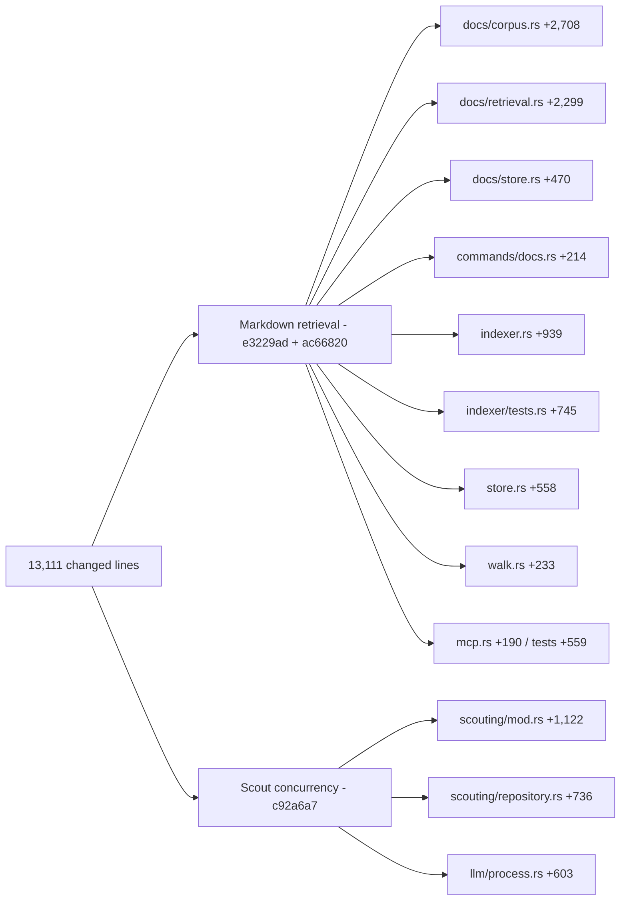
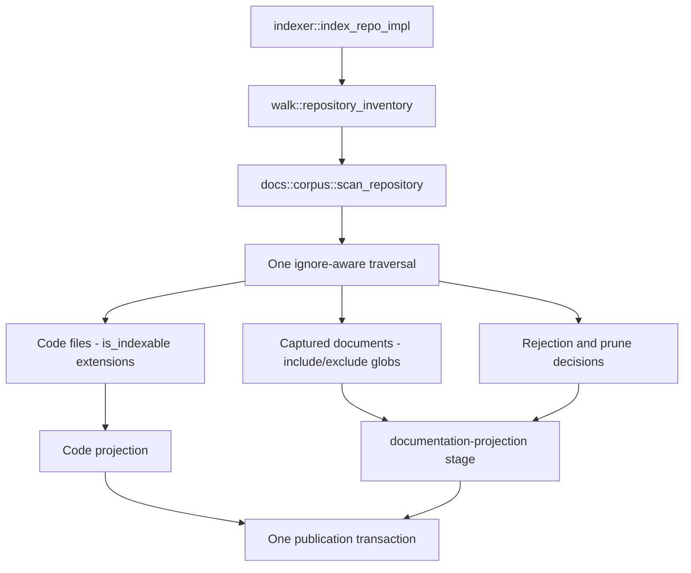

# What changed since the 2026-08-24 analysis

Between `4de5622` and `823b836` — one day, 27 commits, 8 merged pull requests — `git diff --stat 4de5622 HEAD -- src` reports 52 files changed, 12,161 insertions, 950 deletions. Two commits carry almost all of it: `e3229ad` ("feat: add unified Markdown retrieval") and its follow-up `ac66820` ("fix: narrow MDX retrieval noise"), which together add the `src/docs/` subsystem, four tables, two views, four triggers, a second FTS5 corpus, a third `vec0` family, and a thirteenth MCP tool. One independent change, `c92a6a7`, gives scout runs a bounded model-concurrency pool. All the code in the range arrived through five pull requests (#94, #95, #97, #98, #104); of the remaining three, #96 touches `PLAN.md` and `docs/plans/` only, while #102 and #105 are integration merges whose own commits are documentation-only — they carry #104's code forward rather than adding any. This document states the new figures, describes what landed, resolves the one documentation discrepancy the range introduced, and then rates every document in the prior set at `/Users/cristian/git/js-rag/docs/codebase-analysis` for how wrong it now is.

## Headline figures

| Metric | `4de5622` | `823b836` |
|---|---|---|
| `.rs` files under `src/` | 82 | **87** |
| Rust LOC under `src/` | 79,963 | **91,174** |
| `#[test]` attributes | 474 | **570** |
| `src/main.rs` lines / module declarations | 80 / 40 | **81 / 41** |
| `store::SCHEMA_VERSION` | `"29"` | **`"31"`** |
| Regular tables in `init_schema` | 43 | **47** |
| FTS5 virtual tables | 1 | **2** |
| SQL views / triggers | 0 / 0 | **2 / 4** |
| Index creations in `store.rs` | 53 | **57** |
| MCP tools | 12 | **13** |
| `Command` variants / nested enums / invocable paths | 22 / 5 / 30 | **23 / 6 / 33** |
| Dotted config keys | 67 | **75** |
| Cargo runtime dependencies | 22 | **26** |
| `PLAN.md` lines | 3,293 | **3,520** |
| Commits / merged PRs | 500 / 84 | **527 / 92** |

Unchanged across the range: crate `0.4.0`, `entity::EXTRACTION_VERSION` `"7"`, `structural::PROJECTION_VERSION` `"12"`, `checker::protocol::PROTOCOL_VERSION` `4`, `llm::protocol::PROTOCOL_VERSION` `1`, `DURABLE_SCHEMA_FLOOR` `16`. Nothing under `checker/`, `gateway/`, `inference/`, `npm/`, `eval/`, or `.github/` changed at all.

Four new dependencies, all from `e3229ad`: `pulldown-cmark 0.13.0` (block parsing), `serde_yaml_ng 0.10.0` (front matter), `globset 0.4.20` (include/exclude patterns), `base64 0.22.1` (reporting non-UTF-8 paths in `docs status`).

File sizes moved enough that every line citation in the prior set is drifted: `store.rs` 1,641→2,171, `indexer.rs` 1,401→1,810, `scouting/mod.rs` 3,365→3,903, `scouting/repository.rs` 1,848→2,448, `llm/process.rs` 809→1,316, `mcp.rs` 2,093→2,241, `cli.rs` 885→956, `walk.rs` 268→501. `init_schema` moved from `store.rs:260` to `store.rs:312`.

The diagram apportions the range by changed lines per file as `git diff --stat` counts them (insertions plus deletions): 13,111 in total, of which 12,161 are insertions. Two features account for the whole range, and the docs branch is dominated by files that did not exist a day earlier.

`CORPUS` and `RETR` are pure additions; `IDX`, `STORE`, `WALK` and `MCP` are the seams the feature had to cut through existing code, and `SMOD`/`SREPO`/`LLM` are a restructuring of code that already existed rather than new surface.

## The `src/docs/` subsystem

Four files under `src/docs/` totalling 5,495 lines, plus the 214-line command module that drives them: 5,709 lines in all.

| File | Lines | Mechanism |
|---|---|---|
| `src/docs/mod.rs` | 18 | Two constants: `DEFAULT_INCLUDE_GLOBS = ["**/*.md", "**/*.mdx"]` and `CHUNK_FORMAT_VERSION = "documentation-v1"` — a fourth independent version stamp beside schema, extraction, and projection. |
| `src/docs/corpus.rs` | 2,708 | Ignore-aware walk with a fixed hidden-root allowlist (`.github`, `.claude`, `.agents`), globset validation, symlink-refusing open, a 4 MiB file cap, YAML front-matter parse that degrades to `malformed_as_body`, `pulldown-cmark` block chunking that never crosses a heading, size merge at 2,400 / 4,000 / 24,000 bytes, and a blake3 corpus fingerprint. `ac66820` added ~270 lines that strip a contiguous leading ESM-only preamble and exact JSX comments outside protected code ranges from `.mdx`; everything else stays authored text. |
| `src/docs/store.rs` | 470 | Read side: `status()`, `decisions()`, `lexical_search()` over `docs_fts`, and deterministic tie-breaks. |
| `src/docs/retrieval.rs` | 2,299 | `embed_current()` materializes missing docs vectors; `search()` fuses BM25 with optional vector and rerank stages at the same `RRF_K = 60.0` as code search, with the lexical score defined as `-bm25()`. |
| `src/commands/docs.rs` | 214 | `docs status`, `docs embed`, `docs search`; each short-circuits when `runtime.effective.docs.enabled` is false. |

`embedding_identity()` in `corpus.rs` hashes a fixed domain tag (`b"jscout-doc-embedding-v1\0"`), a heading-presence byte, and the length-prefixed nearest heading and rendered body — deliberately not the path, and not `CHUNK_FORMAT_VERSION` — so a rename or an ancestor-heading edit reuses cached vectors instead of paying for them again.

**The ownership inversion.** `walk::repository_inventory` no longer walks anything. At `src/walk.rs:173` it calls `crate::docs::corpus::scan_repository(root, documentation)?` and derives the code file list from the result, so the documentation module owns the single traversal that produces both planes. The reason is stated in a comment at `src/docs/corpus.rs:249`: routing through one scan is what stops Markdown from being published through an independent path. The cost is a dependency direction most readers will find backwards — `walk`, the older and more general module, now depends on `docs`, the newer and narrower one.

`ONE` is the point: there is no second walk to drift out of sync, and `TX` means crash recovery exposes one complete snapshot rather than a code/docs mixture.

**What the unified-storage decision settled.** The record is `/Users/cristian/git/js-rag/docs/plans/g24-adr-one-store-separate-ranking-2026-08-25.md`, incorporated by reference from `PLAN.md`. Review on PR #96 established that a shared database cannot host a second lifecycle behind one global schema version and one structural-snapshot gate, and that a multiplicative freshness decay is unbounded once applied to fused scores. The resolution separates two axes that had been conflated: **one lifecycle, one database, one snapshot; a separate ranking corpus.**

Concretely, in `src/store.rs`:

- `files` gains `corpus TEXT NOT NULL CHECK(corpus IN ('code','docs'))` and `format TEXT NOT NULL CHECK(length(trim(format)) > 0)`, with `idx_files_corpus` at `store.rs:345`. Membership is a property of the row, never inferred from the presence of a sidecar.
- Docs sections are ordinary `chunks` rows with `kind` of `markdown_section` or `markdown_document`, carrying no `name` and no symbols — so the G17 exact-match tiers structurally cannot match them, rather than being filtered away from them. `doc_chunk_meta` carries the retrieval-only fields, and four triggers (`store.rs:382`, `:394`, `:406`, `:418`) enforce in both directions that it is not a membership marker.
- Views `code_files` (`store.rs:429`) and `code_chunks` (`store.rs:434`) put the boundary in one schema object. Every code-plane reader was converted in the same commit — `embed.rs`, `surface.rs`, `query.rs`, `recon.rs`, `search.rs`, `checker/package_gate.rs`, `dependency.rs`, `semantic_query.rs`, `structural.rs`, `semantic.rs` — so no scattered negative predicates exist to forget.
- Docs rows mirror into `docs_fts` and never into `chunks_fts`, so admitting Markdown cannot move code BM25 term statistics. Docs vectors go to `vec_doc_embeddings_{d}` rather than the shared `vec_embeddings_{d}`, because sqlite-vec applies KNN's `k` before any relational corpus filter could run. Generation is separately opt-in: only `jscout docs embed` issues docs-provider requests.

Config gains `[docs]` — `enabled` (default true), `include`, `exclude` — plus `[docs.search]` with `vector` and `rerank` (both true), `limit` 10, `response_bytes` 24,000. Patterns are validated by `docs::corpus::validate_patterns` at load time, before any database opens. MCP gains `documentation_search` (`src/mcp.rs:563`), which is *retained out of* `tools/list` when docs are disabled (`src/mcp.rs:849`) — so the advertised tool count is now configuration-dependent, and `server_instructions` changed from `&'static str` to `String` to allow the conditional sentence.

## Scout concurrency and the LLM client rework

PR #97 (`c92a6a7`) is three commits and roughly 2,400 changed lines across `scouting/mod.rs`, `scouting/repository.rs`, and `llm/process.rs`.

- `llm::config::RequestPolicy` gains `max_concurrency: usize`, default 1, set through a fallible `with_max_concurrency()` that rejects zero (`src/llm/config.rs:203-207`), sourced from a new `llm.max_concurrency` key.
- `LlmGateway` gains a defaulted `complete_batch(&[CompletionTask])` (`src/llm/mod.rs:134`). The default implementation loops serially, so every test double and non-process gateway keeps deterministic serial behavior unless it explicitly provides concurrent transport.
- `ProcessGatewayPool` (`src/llm/process.rs:48`, `:554`) spawns exactly `max_concurrency` independent child processes. `capabilities()` and `complete()` delegate to worker zero; only `complete_batch` fans out, chunking tasks by worker count inside a `std::thread::scope` (`src/llm/process.rs:619`). A panicked worker becomes a `GatewayError::Io`, not a process abort.
- `commands/scout.rs:9` wraps the pool in `launch_scout_gateway`, which clamps size to `max_concurrency.min(call_capacity.max(1))` — so a two-item plan never spawns eight Node processes. All six scout dispatch sites go through it. Configuration itself applies **no upper clamp**, by design: `llm.max_concurrency = 128` loads without complaint (`src/config/tests.rs:293-295`).
- Interrupt handling moved from a single control slot to `register_interrupt_controls(Vec<GatewayControl>)` (`src/llm/process.rs:186`), with a `DispatchAdmission` captured once per batch, so Ctrl-C mid-wave cancels every worker consistently.
- Scouting runners were restructured from prepare-then-execute into claim/schedule/finish waves: `execute_prepared_card` became `claim_prepared_card` plus `finish_claimed_card`, and the same for concept, summary, workflow, and repository. New `Claimed<T>`, `Scheduled<T>`, `BatchOutcomes` (whose `cardinality_error` catches a gateway returning the wrong number of outcomes), and `StagedRunGuard`, an RAII guard that stamps any still-unfinished run at drop as `wave_aborted` (`src/scouting/mod.rs:263`) so a partial wave cannot leave the ledger claiming work is in flight.

Model execution now overlaps; validation and database publication do not.

## The snapshot log and indexer changes

**PR #102 contains no code.** `grep -rn snapshot_log --include='*.rs' src` returns nothing, and so does `doc_block_state`. The append-only block-observation ledger is a design resolution recorded in `PLAN.md`, not an implementation: a durable `snapshot_log` appended in the publication transaction whenever the published digest changes, plus a durable rolling `doc_block_state` baseline (hashes and positions, no bodies) so matching can compare last-observed against current even across a full rebuild. The pair exists so that history recording needs neither a private clock nor a private baseline. PLAN assigns it no milestone and states it ships only with the supersession product.

Indexer changes, all in `e3229ad`:

- `IndexOptions` gains `docs_include` / `docs_exclude`, defaulting to `docs::default_include_globs()`.
- `ensure_documentation_chunk_format()` compares stored `meta.documentation_chunk_format_version` (`src/indexer.rs:17`) against `docs::CHUNK_FORMAT_VERSION`; a mismatch invalidates documentation rows *without* invalidating unchanged code rows.
- `code_format()` and `documentation_format()` classify each admitted path into the `files.format` value. An unsupported documentation extension is a hard error, not a silent skip.
- `insert_documentation_file()` re-verifies that the captured byte length and hash match the parser metadata before writing, and refuses an identity whose corpus or format is wrong. A separately timed `documentation-projection` stage runs inside the same transaction as code projection.
- Because documentation lives in `index_repo_impl`, both `refresh_repo_with_options` and `incremental_refresh_repo_with_options` index it with no separate door.

The read-only opener's contract check gained a second stamp: `validate_published_contracts` (`src/store.rs:123`) now reads `extraction_version` and `documentation_chunk_format_version` in one query and bails on either mismatch.

## Schema v29 to v31

`SCHEMA_VERSION` jumped 29 → 31 in the single commit `e3229ad`; `git log -S'"30"' 4de5622..HEAD -- src/store.rs` is empty, so v30 is a branch bookkeeping artifact and no database on `main` was ever stamped with it. Four tables were added and none removed.

| Table | Shape |
|---|---|
| `doc_chunk_meta` (`store.rs:368`) | `chunk_id INTEGER PK REFERENCES chunks(id) ON DELETE CASCADE`, plus `title`, `description`, `tags_json`, `breadcrumb`, `nearest_heading`, `ordinal`, `embedding_identity`, `front_matter_state`. Guarded by the four triggers. |
| `doc_inventory` (`store.rs:442`) | `path`, `subject`, `rule`, `detail`, `path_base64`, `path_encoding`. No primary key and no foreign key — pruned directories and rejected files have no `files` row by construction. |
| `doc_embedding_index_entries` (`store.rs:767`) | `id INTEGER PK` doubling as the `vec_doc_embeddings_<d>` rowid, plus `chunk_id`, `profile_id`, `UNIQUE(chunk_id, profile_id)`. |
| `doc_vector_generations` (`store.rs:776`) | `PRIMARY KEY (snapshot, profile_id, dimensions, chunk_format_version)` — the persisted readiness record that gates whether the vector stage participates at all. |

Also new, and absent from the prior set's categories: virtual table `docs_fts` (`store.rs:42`); views `code_files` and `code_chunks`; four triggers; and the dynamic `vec_doc_embeddings_{dimensions}` family, a third `vec0` lineage beside `vec_embeddings_` and `vec_semantic_embeddings_`, with the migration's GLOB enumeration extended to cover it.

## The G24 heading discrepancy

`PLAN.md:3184` reads `## Proposed G24 — repository documentation retrieval`. The status word is wrong, and the evidence is that it was never touched. `git log -S'## Proposed G24' 4de5622..HEAD -- PLAN.md` returns exactly one commit, `e6891c5` ("docs(plan): add proposed G24 and revise markdown retrieval plan"), which predates any G24 code. The implementing commit `e3229ad` rewrote 126 lines of the G24 section body — adding the ADR reference, the `files.corpus`/`files.format` contract, the phase list, and the acceptance criteria — but `git show e3229ad -- PLAN.md | grep '^[+-]## '` shows no heading line changed at all.

| Phase | PLAN text | Status at `823b836` |
|---|---|---|
| 1 — named-sections admission | `files.corpus`/`files.format`, `docs_fts`, `doc_chunk_meta`, corpus views, MCP surface, `docs search --lexical-only` | **Built**, including every named artifact |
| 2 — docs vectors from the shared `[embedding]` profile | `doc_embedding_index_entries`, `doc_vector_generations`, `vec_doc_embeddings_{d}`, `jscout docs embed` | **Built** |
| 3 — git-basis freshness, bounded reorder | `max_rank_movement`, `--no-freshness`, `git blame --line-porcelain` provenance | **Not built.** None of `max_rank_movement`, `no_freshness`, or `blame` appears anywhere in `src/`. PLAN itself gates this behind the retrieval evaluation corpus existing first. |
| 4 — documentation-aware watch classification | — | **Not built.** `src/watch.rs:521` still routes events through `walk::is_indexable`, which accepts only `js/jsx/ts/tsx/mjs/cjs/mts/cts`; the comment at `:529` names README edits as repository noise. |
| Observation ledger (`snapshot_log`, `doc_block_state`) | "unscheduled" | **Not built**, and correctly labelled. |

The practical consequence of phase 4 being absent is worth stating plainly: `docs_include` and `docs_exclude` *are* threaded into the watcher's `IndexOptions`, so a generation triggered by a code change does reindex documentation — but a `.md` edit on its own triggers no generation, and `docs search` keeps serving the last code-triggered snapshot until something else moves.

An accurate heading would follow the convention `PLAN.md` already uses at `:3138` (`## G23 — guidance implemented, acceptance replay pending`) and for `## In progress G20b`. By contrast, `## Proposed G25 — multi-format admission` at `:3364` is accurate: G25 asks for a per-format registry deciding understanding tier and corpus assignment, and no such registry exists — `indexer.rs` has two hardcoded match functions. G25's own prose is correct on the boundary, noting that MDX "is already admitted by G24 as `format='mdx'`".

## Per-document staleness of the 2026-08-24 set

Baseline for that set is `4de5622`. Treat every line citation in all 21 documents as drifted; the table lists substantive errors. **H** = a reader forms a wrong model of the system; **M** = wrong numbers or renamed symbols; **L** = citation drift only.

| Prior doc | Sev | Successor here | What is now wrong |
|---|---|---|---|
| `README.md` | **H** | `README.md` | Every header figure: 82 files / 79,963 lines / 474 tests / schema v29 → 87 / 91,174 / 570 / v31. Row 06 "All 43 tables" → 47; row 12 "the twelve tools" → thirteen. The scope sentence omits an entire 5,709-line subsystem, and the set has no successor note. |
| `01-system-overview.md` | **H** | `01` | Line 9's figures and "`src/main.rs` is 80 lines: 40 module declarations" → 81 / 41. Mermaid nodes "12 tools" → 13 and "43 tables" → 47. Line 52: 43 tables and one FTS5 table → 47 and two, plus views and triggers the sentence has no category for. Line 82: `"29"` → `"31"`, and "three independent version stamps" → four. The two-planes diagram shows no docs storage, and "two retrieval modes" is now three. |
| `02-ingestion.md` | **H** | `02`, `05` | The stated output (`files`, `chunks`, `module_edges`) now also includes `doc_chunk_meta`, `doc_inventory`, `docs_fts`. `files` gained two `NOT NULL` CHECK columns, so every described insert changed. The inventory walk now returns documentation decisions and captured documents and is owned by `docs::corpus`. A `documentation-projection` stage runs in the same transaction. |
| `03-structural-extraction.md` | **M** | `06` | `chunks.kind` has two values produced by `pulldown-cmark`, not by any oxc visitor, so the document's implicit premise that every `chunks` row came from an oxc parse is false. Extraction reads canonical rows through `code_files`. |
| `04-value-flow.md` | **L** | folded into `06`/`07` | `value_flow.rs` and `receiver_flow.rs` are byte-identical in the range; only `structural.rs`'s two view references changed beneath it. |
| `05-call-graph-and-surface.md` | **M** | `07` | `surface.rs` reads `code_files`/`code_chunks` now. Worth stating that the exact tiers cannot match docs chunks — not because they are filtered, but because docs chunks carry no `name` and no symbols. |
| `06-storage-schema.md` | **H** | `08` | The most damaged document. Line 3: 43 tables → 47; one FTS constant → two; "two more table families" outside the batch → three; "v26 to the current v29" → v29 to v31. Line 39: `DROP TABLE` 35 → 40, preceded by two `DROP VIEW`; five purged `meta` keys → six; the stamp writes `'31'`. `init_schema` moved 260→312, so every `Line` cell in the table is wrong, and the document has no section for views or triggers. |
| `07-semantic-layer.md` | **H** | `09` | "Three layers per width" is four for docs (`embeddings` → `doc_embedding_index_entries` → `vec_doc_embeddings_<d>`, gated by `doc_vector_generations`). The embed pass reads `code_chunks`, so `jscout embed` provably never produces a documentation vector. Docs participation requires a persisted readiness generation — a concept with no analogue on the code side. |
| `08-retrieval.md` | **H** | `10`, `04` | "Two modes behind one entry point" is incomplete: `docs/retrieval.rs` is a 2,299-line third path with an independent BM25 corpus, its own vector plane, and its own CLI and MCP entry points, sharing `RRF_K = 60.0` and the reranker but no code with `search.rs`. `--vector` on docs search means required participation; there is deliberately no vector-only mode. |
| `09-scouting.md` | **H** | `11` | Every runner named at line 67 was renamed or split; "prepare everything up front and then loop" is superseded by claim/schedule/finish waves bounded by `max_concurrency`. Missing entirely: `StagedRunGuard` and `wave_aborted`, `BatchOutcomes::cardinality_error`, `Claimed<T>`/`Scheduled<T>`, and repository subdivision queuing. The coverage census at line 157 is stale, and both files grew by ~1,100 lines. |
| `10-sidecars.md` | **H** | `12` | Line 14's "one completion at a time; a second gets `busy`" is still true per child process, but jscout now runs N children via `ProcessGatewayPool`. No `complete_batch`, `CompletionTask`, or `DispatchAdmission` appears. The Ctrl-C sharp edge needs the single-slot → `Vec<GatewayControl>` change. Checker side is byte-identical. |
| `11-cli-and-commands.md` | **M** | `13` | Line 3: 885 lines / 22 variants / five nested enums → 956 / 23 / six. Line 7: 39 `mod` statements → 40. Line 65: 30 invocable paths → 33, with `DocsCommand::{Status, Embed, Search}` new. The mermaid node naming `ProcessGateway::launch` → `launch_scout_gateway` wrapping `ProcessGatewayPool::launch`. |
| `12-mcp-surface.md` | **M** | `14` | "twelve tools, eleven read-only" → thirteen and twelve; `mcp.rs` 2,093 → 2,241. `documentation_search` is absent, as is the fact that `tool_defs` and `server_instructions` now take a `docs_enabled` flag — the tool inventory is configuration-dependent, which the document's fixed-inventory framing does not admit. |
| `13-configuration.md` | **M** | `15` | Line 3's "67 dotted keys" → 75 by direct count of `src/config/load.rs`. Twelve sections → thirteen, with `DocsFileConfig` and `DocsSearchFileConfig` added. Eight new keys: seven under `docs.*` plus `llm.max_concurrency`. The validation-order paragraph needs a new *kind* of load-time check — `docs::corpus::validate_patterns` rejects malformed globs before any database opens. |
| `14-incremental-and-watch.md` | **H** | `16` | The classification gap above is the load-bearing correction: a `.md`-only edit still triggers no generation. Also missing `RejectionReportLatch`/`RejectionReportDecision`, which suppress repeated identical rejection detail across generations while the refresh summary stays authoritative. `run_refresh` changed signature from six scalars to a constructed `IndexOptions`. |
| `15-build-ci-distribution.md` | **M** | `17` | Dependencies 22 → 26; Rust tests 474 → 570. Everything else it covers — clippy policy, workflows, `npm/cli/`, sidecars, eval harness — is byte-identical, making it the least damaged document in the set. |
| `16-cross-cutting.md` | **M** | `18` | Line 26's dependency count, and "every command is one blocking thread that owns a `rusqlite::Connection`" now needs a carve-out for scout commands. Line 28's "seven `thread::spawn` calls serving exactly two purposes" → eight sites and a third purpose, bounded model fan-out; the real count is dynamic at three threads per gateway worker. The `println!`/`eprintln!` census is stale after `commands/docs.rs`. |
| `17-end-to-end-traces.md` | **M** | `19` | Trace 1 omits the documentation stages entirely. Trace 4 stays correct only because it edits a `.ts` file — retold with a `.md` file it would be silently wrong. A `docs embed` → `docs search` trace is missing. |
| `18-history-and-roadmap.md` | **H** | `20` | Line 3: seventeen days / 500 commits / 84 PRs / branch `codex/close-g20b` → nineteen calendar days / 527 / 92 / `main`; `PLAN.md` 3,293 → 3,520. Line 69 records G23 as "Planned" against PLAN's own "guidance implemented". Line 71 — "G24 existed for one commit … dropped the same day" — is doubly wrong: G24 was re-created as documentation retrieval and its phases 1–2 shipped. G25 does not appear. The gate ladder ends at G23, and the "five items specified and absent" count needs redoing. |
| `19-sharp-edges.md` | **M** | `21` | Existing edges hold. Missing: documentation edits do not wake the watcher; `max_concurrency` has no upper clamp by design; the corpus boundary now depends on four triggers while `rebuild_legacy_disposable_schema` still drops before `foreign_keys=ON`; a fourth version stamp joins the three tracked under facts-authored-in-several-places; and v30 is a schema number no database was ever stamped with. |
| `20-delta-since-2026-08-22.md` | **L** | superseded by this document | Accurate for its own range and should stay frozen, but its title and the README row imply it is the current delta. Its own correction table for `18-history-and-roadmap.md` is itself superseded by the G23/G24/G25 findings above. |

Six documents — `01`, `06`, `07`, `08`, `09`, `18` — each carry a load-bearing structural claim that is now false, and are rewrites rather than patches. Four (`02`, `10`, `14`, `17`) need a new section. `04`, `15`, and `20` need close to nothing.
