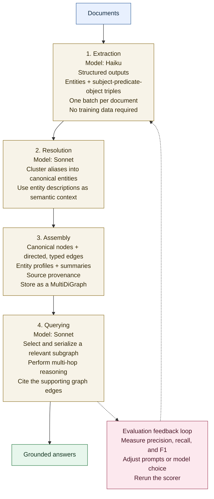
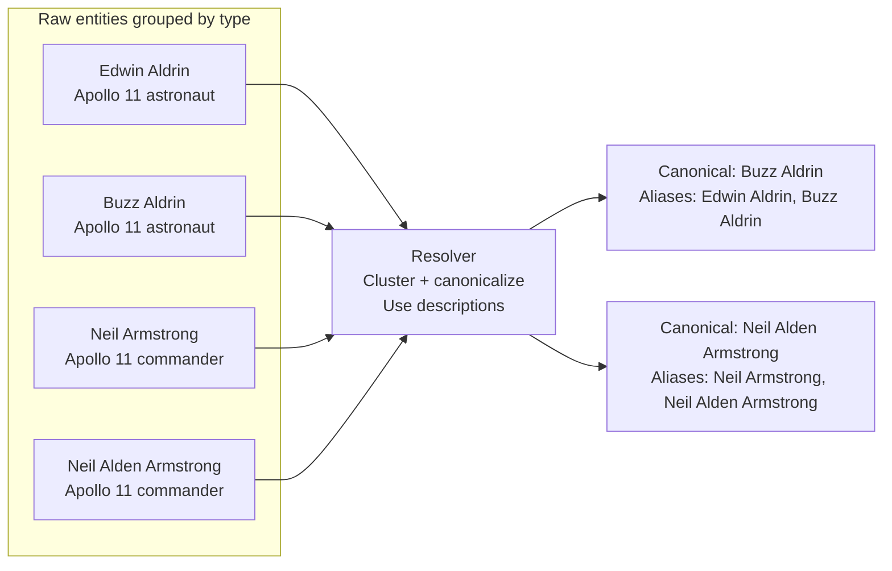
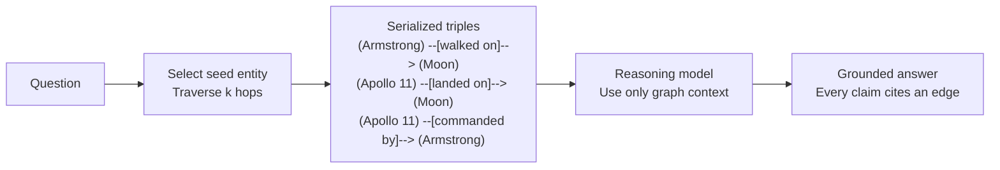
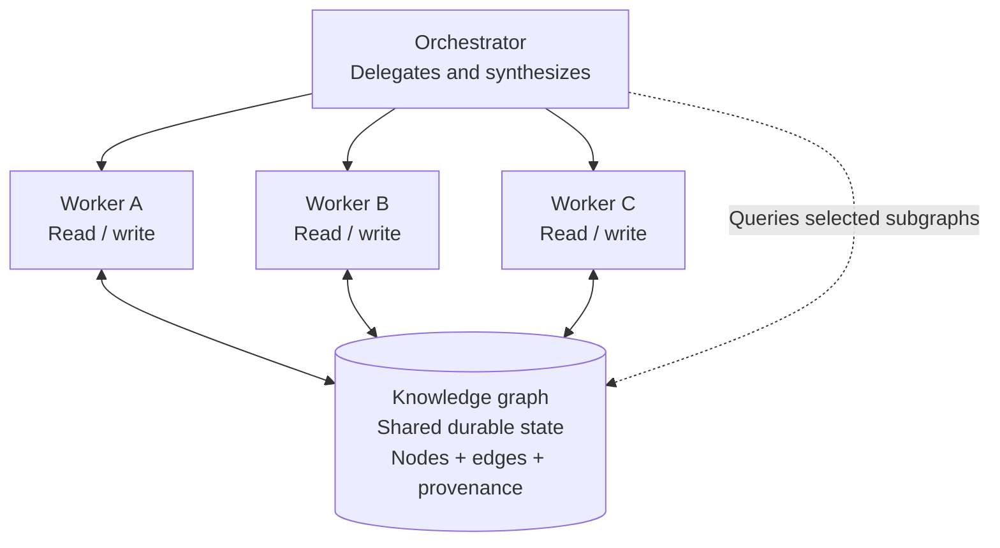

# Knowledge Graph Engineering for Multi-Agentic Systems: The Anthropic Playbook

> A synthesis for study  
> Based on Anthropic's Knowledge Graph Cookbook, *Building Effective AI Agents*, and Claude API documentation  
> Independently compiled, July 2026 - not affiliated with or endorsed by Anthropic

## Markdown edition

This Markdown edition preserves the source document's structure, arguments, code, tables, and appendices while normalizing the original two-column layout into a single reading order. The four original figures have been recreated as editable Mermaid diagrams.

Product capabilities, model names, prices, and performance figures reflect the source document at the time it was written and may have changed.

## Contents

- [Abstract](#abstract)
- [I. Introduction](#i-introduction)
- [II. Background](#ii-background)
- [III. Entity and Relation Extraction](#iii-entity-and-relation-extraction)
- [IV. Entity Resolution](#iv-entity-resolution)
- [V. Graph Assembly and Summarization](#v-graph-assembly-and-summarization)
- [VI. Multi-Hop Querying](#vi-multi-hop-querying)
- [VII. Knowledge Graphs in Multi-Agent Architectures](#vii-knowledge-graphs-in-multi-agent-architectures)
- [VIII. Evaluation](#viii-evaluation)
- [IX. Scaling Guidance](#ix-scaling-guidance)
- [X. Related Work](#x-related-work)
- [XI. Discussion](#xi-discussion)
- [XII. Conclusion](#xii-conclusion)
- [Acknowledgment and Sources](#acknowledgment-and-sources)
- [Appendix A: Glossary](#appendix-a-glossary)
- [Appendix B: Worked Example - Competitive Intelligence System](#appendix-b-worked-example---competitive-intelligence-system)
- [Appendix C: Decision Framework](#appendix-c-decision-framework)
- [Appendix D: Production Readiness Checklist](#appendix-d-production-readiness-checklist)
- [Appendix E: Complete Query Implementation](#appendix-e-complete-query-implementation)

## Abstract

Multi-agent systems can generate, evaluate, and orchestrate work at machine speed, but they share a fundamental weakness: each agent's memory dies with its context window. When agents need to reason across documents, chain facts that never co-occur in one source, or maintain a shared world model across sessions, the context window is not enough.

This note presents knowledge graph engineering as an infrastructure layer for multi-agentic systems. Claude replaces a classical NLP pipeline - trained named-entity recognition, a trained relation classifier, and hand-written entity-resolution heuristics - with structured-output prompts that:

1. Extract typed entities and subject-predicate-object triples.
2. Resolve surface-form variants into canonical nodes.
3. Assemble a queryable graph.
4. Answer multi-hop questions with edge-level citations.

The graph serves as:

- Shared memory for orchestrator-worker systems.
- A grounding layer for evaluator-optimizer loops.
- A persistent world model that survives context-window flushes.

The note also covers precision and recall evaluation, the cost-quality tradeoff between model classes, and scaling guidance for production graphs.

**Index terms:** knowledge graphs, named entity recognition, entity resolution, multi-agent systems, structured outputs, Claude, agentic AI, graph-grounded reasoning.

## Figure 1: The Knowledge Graph Pipeline



The complete stage details, model choices, graph artifacts, and evaluation loop are included directly in the diagram.

# I. Introduction

Suppose you have a pile of unstructured documents and need to answer questions that span them:

- Who works with people who worked on project X?
- Which vendors are connected to this incident?

No single document contains the answer. Retrieval-augmented generation can surface relevant chunks, but it does not itself chain the facts. A knowledge graph represents entities as nodes and typed relations as edges, turning multi-hop reasoning into graph traversal.

Building a graph traditionally required:

- A domain-specific named-entity recognizer.
- A relation classifier.
- Entity-resolution rules.
- Labeled data and retraining whenever the domain changed.

With Claude, those stages become structured-output calls whose interface is a schema.

Anthropic's agent guidance emphasizes simple, composable patterns:

1. Augmented LLM.
2. Prompt chaining.
3. Routing.
4. Orchestrator-workers.
5. Evaluator-optimizer.

These patterns work while information fits in a context window or can be retrieved in one step. When an answer requires facts from different documents, or several agents need a shared world model, the system needs persistent infrastructure underneath the pattern. That infrastructure can be a knowledge graph.

## A. The Problem in Concrete Terms

Consider a competitive-intelligence system with five workers:

- Pricing analyst.
- Product analyst.
- Financial analyst.
- Marketing analyst.
- Strategic synthesizer.

Each worker reads a different slice of the corpus. The synthesizer must discover that the competitor whose pricing dropped by 15% is also the company whose patent suggests a new product line and whose quarterly filing shows doubled R&D spending.

No worker saw all three facts. If all outputs are passed through the orchestrator, its context grows linearly with the number of workers. If workers instead write entities and relations into a shared graph, the synthesizer can traverse the graph without receiving every intermediate document or summary.

## B. Contributions

This note makes three contributions:

1. It presents a complete knowledge-graph pipeline built from Claude API calls, without trained NLP models or a required graph database.
2. It maps the graph into Anthropic's documented agent patterns as shared memory, grounding layer, classifier input, gate signal, and persistent world model.
3. It describes an evaluation harness, model-selection tradeoffs, and production scaling practices.

# II. Background

## A. Classical Knowledge Graph Construction

The traditional pipeline has three stages:

1. **Named Entity Recognition (NER):** tag text spans with labels such as `PERSON`, `ORGANIZATION`, and `LOCATION`.
2. **Relation Extraction:** classify relationships between entity pairs, such as `works_at` or `located_in`.
3. **Entity Resolution:** merge mentions that refer to the same real-world entity.

Each stage is expensive to build and brittle under domain shift. A news-trained NER model can fail on legal contracts. A biomedical relation classifier can produce nonsense on financial filings. Heuristics tuned for English names can fail on transliterations.

The LLM-based alternative keeps the model, prompt, and schema stable across domains and moves adaptation from model training to prompt tuning.

## B. Anthropic's Agent Patterns

The five composable patterns are:

- **Augmented LLM:** a model enhanced with retrieval, tools, and memory.
- **Prompt chaining:** fixed sequential steps with programmatic gates.
- **Routing:** classify the input and send it to a specialized follow-up.
- **Orchestrator-workers:** a central model decomposes work, delegates, and synthesizes.
- **Evaluator-optimizer:** one model generates while another evaluates and provides feedback.

Multi-agent systems can outperform a single agent on tasks that require independent search directions, but they consume more tokens and require careful context management. A graph addresses the context problem structurally.

## C. Where the Graph Fits

The graph has three major roles.

### Shared memory

Workers read from and write to a common graph rather than passing every summary through the orchestrator.

### Grounding layer

An evaluator checks generated claims against provenance-carrying edges instead of judging only whether a statement sounds plausible.

### Persistent world model

The graph survives agent restarts and context-window flushes. The agent forgets; the graph does not.

## D. RAG vs. Knowledge Graph

RAG retrieves text chunks by semantic similarity and places them into the context window. It is effective for single-hop questions whose answers exist in one passage.

A knowledge graph is useful when:

- The answer requires chaining facts across passages.
- The passages are not semantically similar to each other.
- An entity must connect otherwise unrelated documents.
- The system needs durable, structured shared state.

RAG and knowledge graphs are complementary:

- Use RAG for direct retrieval.
- Use the graph for structural reasoning.
- Use the LLM to synthesize across both.

# III. Entity and Relation Extraction

Classical NER and relation extraction can be collapsed into one structured-output call per document.

## Data Model

```python
from typing import Literal
from pydantic import BaseModel

EntityType = Literal[
    "PERSON",
    "ORGANIZATION",
    "LOCATION",
    "EVENT",
    "ARTIFACT",
]


class Entity(BaseModel):
    name: str
    type: EntityType
    description: str  # One line, used for disambiguation.


class Relation(BaseModel):
    source: str
    predicate: str  # Short verb phrase.
    target: str


class ExtractedGraph(BaseModel):
    entities: list[Entity]
    relations: list[Relation]
```

The schema is the interface contract. A successful call returns a typed object rather than free-form text that must be parsed and validated after the fact.

## A. The Extraction Prompt

The extraction prompt should:

1. Extract only entities central to the document.
2. Give each entity a one-sentence description grounded in the document.
3. Use short verb phrases as predicates.
4. Require every relation to connect two extracted entities.

Descriptions are essential to resolution. Two entities named "Armstrong" might be an astronaut and a jazz trumpeter. Their descriptions carry the semantic distinction that surface forms do not.

## B. Why Structured Outputs Matter

Without structured outputs, the pipeline must:

- Parse free-form model output.
- Handle malformed JSON.
- Validate fields and types.
- Recover from silent corruption.

These failure points compound at corpus scale. With structured outputs, the API either returns a valid `ExtractedGraph` or raises an error. The stage boundary becomes a type-checked contract.

## C. The Full Extraction Prompt

```python
EXTRACTION_PROMPT = """Extract a knowledge graph from
the document below.

<document>
{text}
</document>

Guidelines:
- Extract only entities that are central to what
  this document is about - skip incidental mentions.
- For each entity, write a one-sentence description
  grounded in this document. These descriptions are
  used later to disambiguate entities with similar
  names.
- Predicates should be short verb phrases
  ("commanded", "launched from", "part of").
- Every relation must connect two entities you
  extracted."""
```

The guidelines map to specific failure modes:

- "Central only" controls recall and graph noise.
- Descriptions provide disambiguation context.
- Short predicates keep the graph traversable.
- Endpoint constraints prevent orphaned edges.

## D. The API Call

```python
def extract(text: str) -> ExtractedGraph:
    response = client.messages.parse(
        model=EXTRACTION_MODEL,  # claude-haiku-4-5 in the source
        max_tokens=2048,
        messages=[
            {
                "role": "user",
                "content": EXTRACTION_PROMPT.format(text=text),
            }
        ],
        output_format=ExtractedGraph,
    )
    return response.parsed_output
```

The `output_format` parameter defines the complete output interface. The result supports typed attribute access such as `result.entities[0].name`.

## E. Apollo Corpus Results

On six Apollo-related documents, the extractor produced 36 raw entities and 34 relations.

| Document | Entities | Relations |
|---|---:|---:|
| Apollo program | 8 | 7 |
| Apollo 11 | 6 | 5 |
| Neil Armstrong | 3 | 2 |
| Saturn V | 5 | 4 |
| Buzz Aldrin | 6 | 6 |
| Kennedy Space Center | 8 | 10 |

The same real-world entities appeared under different surface forms, including:

- `Neil Armstrong` and `Neil Alden Armstrong`
- `Buzz Aldrin` and `Edwin Aldrin`

Those variants become the input to entity resolution.

# IV. Entity Resolution

Raw extraction creates overlapping mentions:

- `NASA` and `National Aeronautics and Space Administration`
- `Neil Armstrong` and `Armstrong`
- `the Moon` and `Moon`

Building the graph directly from those names fractures one concept into several disconnected nodes.

String similarity handles typos and capitalization differences but fails on aliases with little character overlap, such as `Edwin Aldrin` and `Buzz Aldrin`. The resolution stage instead clusters entities by type and uses their descriptions as semantic context.

## Figure 2: Entity Resolution



## Resolution Schema

```python
class Cluster(BaseModel):
    canonical: str
    aliases: list[str]


class ResolvedClusters(BaseModel):
    clusters: list[Cluster]
```

## A. Resolution Results

On the Apollo corpus, resolution compressed 24 unique surface forms into 22 canonical entities. It correctly handled:

- `Edwin Aldrin` -> `Buzz Aldrin`
- `Neil Armstrong` -> `Neil Alden Armstrong`

These are cases where edit distance alone would fail.

## B. Two Failure Modes

### Silent loss

If a raw name appears in no cluster, it disappears because the alias map has no entry for it.

**Production fallback:** create a single-element cluster for every unmatched name.

### Over-merging

The resolver can merge a specific entity such as `Gemini 12` into a broader entity such as `Project Gemini` because their descriptions overlap.

Both failure modes require spot checks and evaluation against a gold set.

## C. Why Descriptions Are the Key

Descriptions are not decorative metadata. They are a first-class input to resolution.

Without descriptions, the resolver sees only surface forms and falls back toward string matching. With descriptions, it receives a per-document semantic signal that distinguishes aliases from different entities with similar names.

## D. The Full Resolution Prompt

```python
RESOLVE_PROMPT = """Below are {entity_type} entities
extracted from several documents. Some are different
surface forms of the same real-world entity.

<entities>
{entity_list}
</entities>

Cluster them. Each input name must appear in exactly
one cluster's aliases list. Entities that are
genuinely distinct get their own single-element
cluster. Use the descriptions to avoid merging
entities that merely share a name. The canonical
name should be the most complete, unambiguous
form."""
```

The prompt establishes four invariants:

1. Every input name appears exactly once.
2. Distinct entities remain separate.
3. Descriptions participate in the decision.
4. The canonical form is complete and unambiguous.

Processing one entity type at a time keeps the task focused and makes batches easier to parallelize.

## E. Resolution as a Composable Agent

The resolver can be treated as a specialized worker:

- Input: raw entities grouped by type.
- Judgment: decide which names refer to the same real-world entity.
- Output: canonical clusters.

Because the prompt and schema are fixed, the resolver can be a stateless function that handles independent batches.

# V. Graph Assembly and Summarization

After resolution, every relation endpoint is rewritten to its canonical form and loaded into a directed multigraph.

A `MultiDiGraph` is appropriate because:

- Two nodes can have several relationships.
- Direction matters.
- `Armstrong commanded Apollo 11` is not equivalent to `Apollo 11 commanded Armstrong`.

Each node carries:

- Entity type.
- Source documents.
- Mention count.
- Optional synthesized profile.

Each edge carries:

- Predicate.
- Source document.
- Provenance metadata.

The Apollo graph had:

- 22 nodes.
- 34 edges.
- 1 connected component.

A single component suggests resolution successfully linked the corpus. Fragmented islands can indicate aliases that should have merged but did not.

## A. Entity Summarization

Hub nodes appear in several documents. Their one-line extraction descriptions are not enough, so the system pools:

- Every source excerpt that mentions the entity.
- The entity's graph neighborhood.
- Existing descriptions and provenance.

A stronger reasoning model then synthesizes a profile.

```python
class TimeRange(BaseModel):
    start: str  # YYYY or "unknown"
    end: str    # YYYY or "ongoing"


class EntityProfile(BaseModel):
    summary: str
    key_facts: list[str]
    time_range: TimeRange
```

The profile turns a graph of labels into a graph of knowledge. Structured time ranges support temporal reasoning, while atomic facts give evaluators evidence they can verify.

## B. When to Summarize

Summarization is expensive, so it should be selective.

A practical rule is to summarize nodes with degree at least 3. High-degree nodes tie documents together and benefit most from cross-document synthesis. For low-degree nodes, the original one-document description is often sufficient.

## C. The Summarization Prompt

```python
SUMMARIZE_PROMPT = """Generate a knowledge-graph
profile for this entity.

Entity: {name} ({etype})

Source excerpts mentioning this entity:
{excerpts}

Known relations in the graph:
{relations}

Write a 2-3 paragraph factual summary synthesized
from the excerpts, resolving any contradictions by
preferring the most specific claim. Include 3-5
atomic key facts, each traceable to the sources.
For the time range, use YYYY or YYYY-MM format.

Do not invent facts not supported by the
excerpts."""
```

Two instructions protect graph quality:

- Prefer the most specific supported claim when sources differ.
- Do not invent facts not present in the excerpts.

## D. What Summarization Produces

For the Apollo program hub, the summarizer produced a profile spanning:

- Program conception in 1960.
- Kennedy's 1961 congressional address.
- The first lunar landing in 1969.
- Saturn V operations from 1967 to 1973.
- Launch Complex 39 at Kennedy Space Center.

No single source contained the complete profile. The result was a cross-document synthesis with traceable facts.

## E. Graph Diagnostics

Before querying, inspect:

### Connected components

An increasing number of components can indicate failed resolution and missing cross-document links.

### Degree distribution

A few high-degree hubs and many low-degree nodes are common in well-extracted corpora. A flat distribution can indicate over-extraction or an unusually homogeneous corpus.

### Edge-to-node ratio

- Below `1.0`: sparse graph with many isolated entities.
- Above `2.0`: richly connected graph.
- Apollo example: `34 / 22 = 1.55`.

# VI. Multi-Hop Querying

The purpose of the graph is to answer questions that require facts from documents with little or no lexical overlap.

For example, "Which locations are connected to people who flew on Apollo 11?" requires:

1. Person-to-mission edges from one document.
2. Person-to-location edges from another.
3. Entity resolution so the person nodes meet.

The query mechanism is simple:

1. Select a seed entity.
2. Traverse its `k`-hop neighborhood.
3. Serialize the induced subgraph as triples.
4. Ask the model to answer using only those triples.
5. Require every claim to cite a specific edge.

## Figure 3: Graph-Grounded Querying



## A. Grounded vs. Ungrounded

Without graph context, a model can draw on pretraining and produce a broad answer that includes unsupported locations, institutions, or military bases.

With graph context, the answer is intentionally narrower:

> The only person-location relationship supported by the graph is Neil Armstrong -> walked on -> the Moon.

The grounded answer is:

- Traceable.
- Limited to the corpus.
- Explicit about missing evidence.
- Useful on private corpora unknown to the base model.

## B. Subgraph Selection

The number of hops controls coverage and noise.

| Hops | Behavior |
|---:|---|
| 1 | Fast and focused, but limited to direct neighbors. |
| 2 | Usually the best tradeoff for multi-hop reasoning. |
| 3+ | Rapid graph growth; may require filtering or summarization. |

For the small Apollo corpus, two hops from a hub captured nearly the entire graph: 22 nodes and 34 edges.

# VII. Knowledge Graphs in Multi-Agent Architectures

| Agent pattern | Knowledge-graph role | How it helps |
|---|---|---|
| Augmented LLM | Retrieval source | The LLM queries a graph tool for multi-hop facts. |
| Prompt chaining | Gate signal | A graph query checks whether new entities conflict with existing nodes between steps. |
| Routing | Classifier input | Entity type and graph degree can route a query without another model call. |
| Orchestrator-workers | Shared memory | Workers read and write the graph while the orchestrator's context stays small. |
| Evaluator-optimizer | Grounding layer | The evaluator checks claims against provenance-carrying edges. |

## A. Shared Memory for Orchestrator-Workers

When an orchestrator delegates to several workers, each worker has its own context. Passing all summaries through the orchestrator creates a bottleneck.

The graph solves the problem structurally:

- A worker reads only the subgraph relevant to its task.
- It writes new entities and relations back.
- The orchestrator keeps a small context.
- The shared state remains durable and queryable.

## Figure 4: The Graph as Shared Memory



The graph acts like a durable session. It does not vanish when a worker's context is flushed.

## B. Grounding Layer for Evaluator-Optimizer

An evaluator without ground truth judges whether a claim looks right. A graph-backed evaluator asks whether a specific triple exists, with what predicate, and from which document.

Example generated claim:

```text
Armstrong commanded Gemini 12.
```

Graph check:

```text
(Neil Alden Armstrong) --[commanded]--> (Gemini 12)
```

No such edge exists. The graph instead contains:

```text
(Buzz Aldrin) --[flew on]--> (Gemini 12)
(Neil Alden Armstrong) --[commanded]--> (Apollo 11)
```

The evaluator can return precise evidence rather than a vague objection.

### Evaluator-Optimizer Loop

1. The generator produces content.
2. A graph-query stage finds the `k`-hop neighborhoods of mentioned entities.
3. The evaluator receives the content and serialized subgraph.
4. It checks factual claims against graph edges.
5. It returns specific supporting or contradicting evidence.
6. The generator revises the content.
7. Missing evidence is escalated rather than silently accepted or rejected.

## C. Persistent World Model for Loops

For an overnight or self-improving loop:

- New documents are extracted.
- New entities are resolved against the canonical set.
- Only new edges are added.
- Entities are re-summarized only when their source set materially changes.
- A state file tracks processed documents.
- The graph accumulates as the durable world model.

## D. Collaborative and Hierarchical Systems

In a peer-to-peer architecture, the graph acts as a shared blackboard. In a hierarchical system, domain specialists can write to separate subgraphs while a supervisor queries across them.

The schema - entity types, relation predicates, and provenance - makes domain segmentation and cross-domain queries possible.

# VIII. Evaluation

Graph quality is measured with precision and recall against a gold set.

The evaluation should cover:

- Raw extracted entities.
- Resolved entities.
- Structural relation matches.
- Alias normalization used by the scorer.

## Extraction Quality Against a Gold Set

| Document | Raw F1 | Precision | Recall | Resolved recall |
|---|---:|---:|---:|---:|
| Apollo 11 | 0.71 | 1.00 | 0.55 | 0.55 |
| Neil Armstrong | 0.55 | 1.00 | 0.38 | 0.38 |

Perfect precision means every extracted entity was correct. Lower recall means the conservative prompt missed entities the gold set considered important.

## A. Evaluation Feedback Loop

The loop is:

```text
extract -> score -> inspect errors -> tune prompt -> rerun
```

This is what turns a demo into a production system. Without a scorer, prompt changes are blind and corpus drift is hard to detect.

## B. What the Numbers Mean

False positives are often more damaging than false negatives:

- A missing entity produces an incomplete graph.
- A wrong entity creates wrong relations that can mislead multi-hop reasoning.

Some misses are deliberate. `Purdue University` may be peripheral to an Armstrong document and correctly filtered by a central-only prompt. Other misses can reflect a mismatch between per-document extraction and a cross-document gold set.

The evaluation harness makes that precision-recall tradeoff explicit.

## C. Scoring Relations

Predicate wording varies:

- `commanded`
- `led`
- `was commander of`

A simple structural scorer can compare `(source, target)` pairs while ignoring predicate wording. This gives an upper bound on relation recall and catches the most damaging errors: missing and incorrect connections.

A more advanced scorer can define equivalence classes for predicates.

# IX. Scaling Guidance

The notebook example processed six documents in memory. Production graphs may contain thousands of documents and hundreds of thousands of edges.

## A. Extraction Cost

Extraction is high-volume and schema-constrained, so speed and cost dominate. Prompt caching helps when instructions and schemas remain fixed. Batch processing helps when latency is not critical.

The source estimates that 10,000 documents averaging 2,000 tokens each can be extracted at low cost with a small model. That estimate reflects source-era pricing and should be recalculated before implementation.

## B. Resolution at Scale

Do not send 10,000 people to one resolution prompt.

Block candidates first using cheap signals:

- Same last name.
- Token overlap.
- Embedding similarity.
- Abbreviation rules.

Then let the reasoning model arbitrate within blocks of roughly 50 to 100 candidates.

This hybrid design uses deterministic logic for easy cases and models only where judgment is required.

## C. Incremental Updates

When a new document arrives:

1. Extract its entities and relations.
2. Resolve entities against the existing canonical set.
3. Add only new edges.
4. Re-summarize only affected entities.

The graph accumulates rather than rebuilding from scratch.

## D. Storage

`NetworkX` is sufficient up to a few hundred thousand edges.

Beyond that, the schema maps naturally to:

- A property graph such as Neo4j or Neptune.
- PostgreSQL tables with recursive CTEs.

Example relational schema:

```sql
entities(id, name, type, summary)
relations(source_id, target_id, predicate)
aliases(entity_id, alias)
```

Only the persistence layer changes. The extraction and resolution contracts remain the same.

## E. Chunking Long Documents

Long contracts, papers, and documentation must be chunked before extraction.

Naive token-count chunking can separate an entity from the relation that describes it. Prefer:

- Section or paragraph boundaries.
- One paragraph of overlap.
- Exact-string deduplication across chunks of the same document.

The extraction prompt can remain unchanged.

## F. Production Monitoring

Monitor four signals:

### Extraction rate

Entities and relations per document. A sudden drop can indicate domain shift; a spike can indicate over-extraction.

### Resolution compression ratio

Raw surface forms divided by canonical entities.

- Near `1.0`: naming is consistent or resolution adds little.
- Above `2.0`: naming varies significantly and resolution is valuable.

### Graph connectivity

Track the number of connected components and the size of the largest component.

### Query latency

Track time from question to grounded answer. Precompute serialized neighborhoods for high-traffic entities when necessary.

## Model Selection by Pipeline Stage

| Stage | Model class in the source | Rationale |
|---|---|---|
| Extraction | Haiku | High volume and schema-constrained; speed and cost dominate. |
| Resolution | Sonnet | Weighing conflicting evidence; reasoning quality dominates. |
| Summarization | Sonnet | Cross-document synthesis requires nuance. |
| Querying | Sonnet | Multi-hop reasoning over serialized triples. |

# X. Related Work

Knowledge graph construction has evolved from early information-extraction systems to statistical NER and neural approaches. The distinguishing feature of the LLM-based pipeline is the reduction of domain-specific training.

## A. Relationship to RAG

RAG and knowledge graphs are complementary:

- RAG finds relevant passages by semantic similarity.
- Knowledge graphs expose structural connections.
- The LLM synthesizes over both.

## B. Relationship to Closed-Loop Optimization

The evaluation loop resembles compiler and systems optimization:

- Transformation: change the extraction prompt.
- Environment: run the corpus.
- Measurement: compute precision, recall, and F1.
- Feedback: use errors to refine the next prompt.

The intelligence of the loop depends on the quality of environmental feedback.

## C. Structured Outputs as the Enabling Capability

The pipeline depends on guaranteed schema validation. Without structured outputs, every stage must parse, coerce, and validate free-form text. That failure class grows with corpus size.

Structured outputs make prompt-as-training-data practical because the schema becomes an enforceable contract.

The use of LLMs for resolution is especially useful for hard cases such as:

- Nicknames.
- Abbreviations.
- Cross-lingual variants.

Deterministic similarity remains cheaper for easy cases such as:

- Typos.
- Capitalization differences.
- Minor punctuation variants.

The practical design is hybrid: cheap blocking followed by LLM arbitration.

Knowledge graphs also implement the blackboard pattern for multi-agent systems: agents communicate through a shared knowledge repository that acts as collective memory.

# XI. Discussion

## A. What the Graph Replaces

The pipeline replaces:

- A trained named-entity recognizer.
- A trained relation classifier.
- Hand-written entity-resolution heuristics.
- Domain-specific labeled data for each stage.

The schema becomes the primary adaptation surface.

## B. What the Graph Does Not Replace

The graph does not replace judgment.

It stores structured facts, but it does not decide:

- Which facts matter.
- Which sources are trustworthy.
- Which subgraph should be queried.
- Whether a missing triple means an error or a gap in the corpus.
- Which action should be taken.

The graph moves decisions from unsupported model estimation toward extracted evidence, but agents and humans still make the decisions.

## C. Limitations

1. Extraction quality depends on prompt engineering and must be evaluated.
2. Resolution at scale requires blocking heuristics that can be domain-specific.
3. The graph is only as good as its corpus. Biased or incomplete documents create a biased or incomplete graph.

## D. Cost Considerations

The pipeline has four cost regimes:

- **Extraction:** cheap per document and linear in corpus size.
- **Resolution:** moderate; typically one reasoning call per entity type or candidate block.
- **Summarization:** expensive per entity, but limited to high-degree nodes.
- **Querying:** per question and proportional to subgraph size.

For a large corpus, extraction can dominate total cost. For a heavily queried graph, querying can dominate.

## E. Operational Discipline

Three standing practices matter:

### Sample the graph

Inspect a random node each day. Read its profile, verify its edges against source documents, and follow the provenance chain.

### Cap extraction volume

Set per-run limits on documents and extracted entities so ingestion errors cannot create unbounded cost.

### Version the schema

Version entity types, predicates, prompts, and graph data together. Graphs built under different schemas may not be compatible.

## F. Future Directions

### Temporal graphs

Add valid-time fields to edges so the graph can answer questions such as "Who held this role in Q3 2024?"

### Confidence scoring

Attach confidence based on model uncertainty or cross-document corroboration. An edge found in three independent documents should carry more weight than one found once.

### Graph of graphs

Let each team maintain a domain graph while a meta-graph records cross-domain connections.

# XII. Conclusion

The complete pipeline uses Claude API calls for:

1. Structured entity and relation extraction.
2. Semantic entity resolution.
3. Cross-document summarization.
4. Multi-hop querying with edge-level citations.

The graph integrates with agent patterns as:

- Retrieval source.
- Gate signal.
- Classifier input.
- Shared memory.
- Grounding layer.

For multi-agent systems, it solves the problem that each agent's working memory ends with its context window. The graph becomes a durable, queryable, provenance-carrying world model.

The evaluation harness is what turns the pipeline from a demo into a production system:

```text
act -> observe -> score -> learn -> repeat
```

The graph is both an output of that loop and infrastructure for the loop.

# Acknowledgment and Sources

This document is an independent synthesis for study and is not affiliated with or endorsed by Anthropic.

The source document attributes:

- The knowledge-graph pipeline, code, and evaluation methodology to Anthropic's public cookbook, *Knowledge Graph Construction with Claude*, in the `claude-cookbooks` repository.
- The agent patterns and implementation framework to Anthropic engineering writing on effective agents.
- The augmented LLM, prompt chaining, routing, orchestrator-workers, and evaluator-optimizer patterns to E. Schluntz and B. Zhang, *Building Effective Agents*, Anthropic Engineering, December 2024.
- The managed-agent architecture to L. Martin, G. Cemaj, and M. Cohen, *Scaling Managed Agents*, Anthropic Engineering, April 2026.

The competitive-intelligence example is illustrative. The Apollo corpus results are attributed to the cookbook. Code examples are adapted for pedagogical clarity.

# Appendix A: Glossary

| Term | Meaning |
|---|---|
| Knowledge graph | A structured representation of entities as nodes and typed relationships as edges, with provenance. |
| Structured outputs | An API feature that constrains a model response to validate against a schema and return typed data. |
| Entity resolution | Merging surface forms of the same real-world entity into one canonical node. |
| Multi-hop reasoning | Answering a question by chaining facts across several graph edges. |
| Subgraph serialization | Converting a graph neighborhood into triples that can be placed in a context window. |
| Ground truth | A verdict from environmental evidence, such as a provenance-carrying graph edge, rather than model estimation. |
| Blocking | Grouping resolution candidates with cheap signals before expensive model arbitration. |
| Hub node | A high-degree entity that connects many documents or concepts. |
| Alias map | A dictionary from known surface forms to canonical entity names. |
| Provenance | The source document and extraction context from which a triple was derived. |

# Appendix B: Worked Example - Competitive Intelligence System

## System Architecture

The system has:

- One orchestrator.
- Pricing worker.
- Product worker.
- Financial worker.
- Marketing worker.
- Strategic synthesizer.

The orchestrator receives a request such as "Analyze competitor X's market position" and delegates subtasks. Each worker processes a separate corpus slice.

## Step 1: Parallel Extraction

Each worker runs the same extraction contract with domain-specific entity types.

Pricing example:

```text
(ProductA, PRODUCT)
(PriceTier, PRICING)
(ProductA) --[priced_at]--> ($99/month)
```

Product example:

```text
(PatentFiling, DOCUMENT)
(NewFeatureX, FEATURE)
(CompetitorX) --[filed]--> (PatentFiling)
```

The shared schema makes the outputs compatible.

## Step 2: Cross-Worker Resolution

The workers may extract:

- `Acme Corp`
- `ACME Corporation`
- `acme`

The resolver must map all three names to one canonical node. Without this step, pricing, patent, and financial facts remain disconnected.

## Step 3: Graph Assembly

All canonical entities and relations are assembled into one graph. Every edge records:

- Which worker extracted it.
- Which document supported it.
- Any available extraction timestamp or schema version.

The graph contains cross-domain connections that no worker could have produced alone.

## Step 4: Strategic Synthesis

The synthesizer queries:

```text
Show every entity connected to Acme Corp within two hops,
including predicates and provenance.
```

It receives a compact subgraph rather than every worker's raw documents. Its analysis cites edges such as:

```text
Acme Corp reduced pricing by 15%
  source: pricing-agent / pricing-page-q3.html

Acme Corp filed patent US-2024-XXXX
  source: product-agent / patent-filing.pdf
```

The orchestrator's context never contains all five raw outputs.

## Why It Works

The graph provides:

1. **Connection:** resolution links aliases across workers.
2. **Compression:** the synthesizer reads a small subgraph instead of all documents.
3. **Grounding:** every triple points back to evidence.

# Appendix C: Decision Framework

| Scenario | Right tool | Why |
|---|---|---|
| Single-document QA | RAG or direct context | No multi-hop reasoning is required. |
| Multi-document, single-hop | RAG with reranking | The answer spans documents but does not require a chain. |
| Multi-document, multi-hop | Knowledge graph | Entity-level linking is required across sources. |
| Multi-agent shared state | Knowledge graph | Workers need a world model outside their context windows. |
| Evaluator needs ground truth | Knowledge graph | Fact-checking requires structured evidence with provenance. |
| Overnight loop with persistent memory | Knowledge graph | State must survive context flushes. |
| Simple classification or routing | Single agent | No cross-document reasoning is required. |

**Rule of thumb:** use a knowledge graph when agents must chain facts across sources, share structured state, or ground judgments in traceable evidence. Use simpler tools when retrieval or classification is enough.

# Appendix D: Production Readiness Checklist

| Element | Ask yourself | Failure if missing |
|---|---|---|
| Gold set | Is there a hand-labeled evaluation set for at least two representative documents? | Prompt changes are blind. |
| Alias map | Does the scorer recognize every canonical form the resolver produces? | Recall appears worse because of scoring artifacts. |
| Schema version | Is the extraction schema versioned with the graph? | Entities from different prompt versions become incompatible. |
| Extraction cap | Is there a per-run limit on processed documents and extracted entities? | Ingestion errors create unbounded cost. |
| Resolution fallback | Do unmatched names get single-element clusters? | Entities silently disappear. |
| Provenance tracking | Does every edge carry its source document and extraction timestamp? | Answers cannot be audited or fact-checked. |
| Incremental update | Can new documents be added without rebuilding the graph? | Rebuild cost scales with corpus size rather than the delta. |
| Connectivity monitor | Are connected components checked after each resolution pass? | Missed aliases create fragmented islands. |
| Summarization trigger | Is re-summarization limited to entities whose source set changed? | Expensive model calls are wasted. |
| Human sample | Does someone inspect a random node profile regularly? | The graph outgrows the team's understanding. |

The first two controls create the evaluation feedback loop. Schema versioning, extraction caps, and resolution fallbacks prevent silent corruption. Provenance, incremental updates, and connectivity monitoring preserve structure. Summarization triggers and human sampling control cost and comprehension.

The pipeline is not done when it runs. It is done when the team can determine whether yesterday's output was correct.

# Appendix E: Complete Query Implementation

The query implementation performs breadth-first traversal from a seed entity, serializes the induced subgraph as triples, and optionally constrains the model to that graph context.

```python
def serialize_subgraph(center: str, hops: int = 2) -> str:
    nodes = {center}
    frontier = {center}

    for _ in range(hops):
        nxt = set()
        for node in frontier:
            nxt |= set(G.successors(node))
            nxt |= set(G.predecessors(node))

        frontier = nxt - nodes
        nodes |= frontier

    subgraph = G.subgraph(nodes)
    lines = [
        f"({source}) --[{data['predicate']}]--> ({target})"
        for source, target, data in subgraph.edges(data=True)
    ]

    return "\n".join(sorted(set(lines)))


def ask(
    question: str,
    graph_context: str | None = None,
) -> str:
    if graph_context is not None:
        prompt = f"""Answer using only the knowledge
graph below. Cite the specific edges that support
your answer.

<graph>
{graph_context}
</graph>

Question: {question}"""
    else:
        prompt = question

    response = client.messages.create(
        model=SYNTHESIS_MODEL,
        max_tokens=500,
        messages=[
            {
                "role": "user",
                "content": prompt,
            }
        ],
    )

    return next(
        block.text
        for block in response.content
        if block.type == "text"
    )
```

The restrictive instruction, "Answer using only the knowledge graph below," prevents the answer from silently drawing on pretraining.

The instruction to cite specific edges produces claims such as:

```text
(Armstrong) --[walked on]--> (Moon)
```

A downstream evaluator can verify that citation directly against the input triples.

For production use, return both:

- The generated answer.
- The exact subgraph used to generate it.

This makes every available edge visible to the calling agent or human reviewer.

---

*Converted from `Graph-Engineering-Athropic-Playbook.pdf`. The source PDF states that it is an independent synthesis assembled for study and is not an Anthropic publication.*
